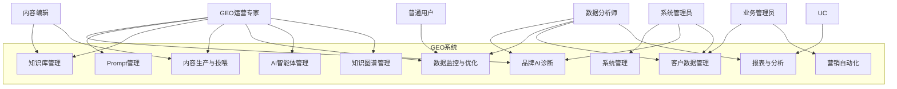
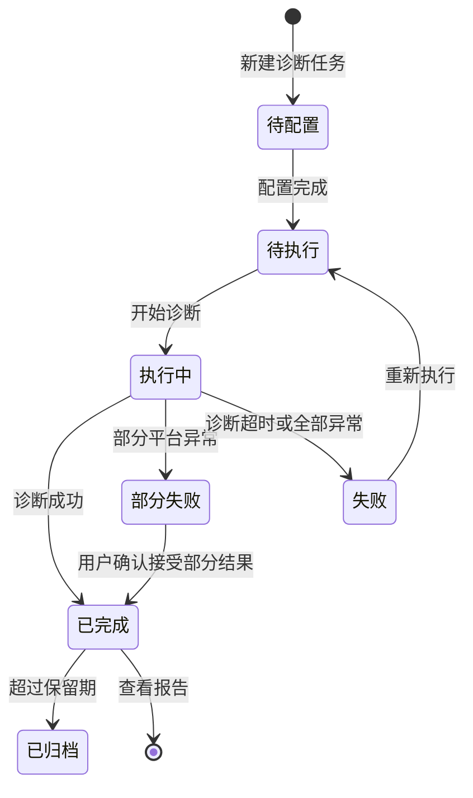
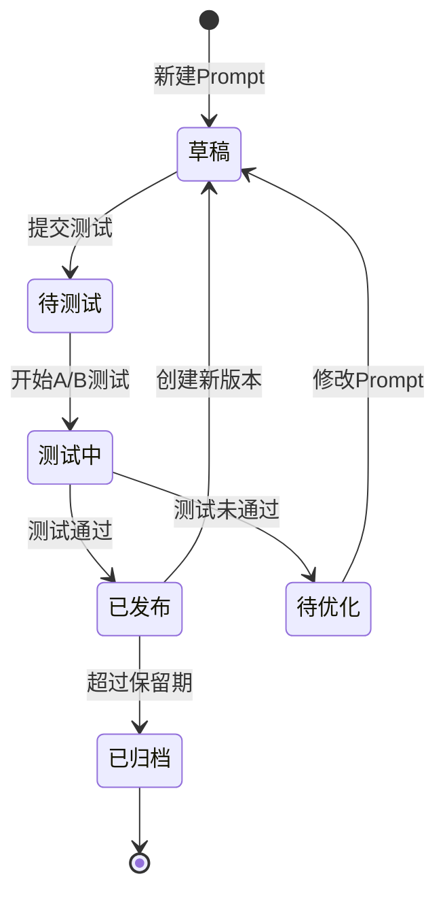
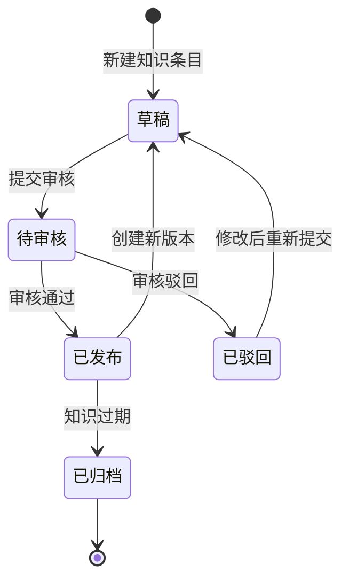
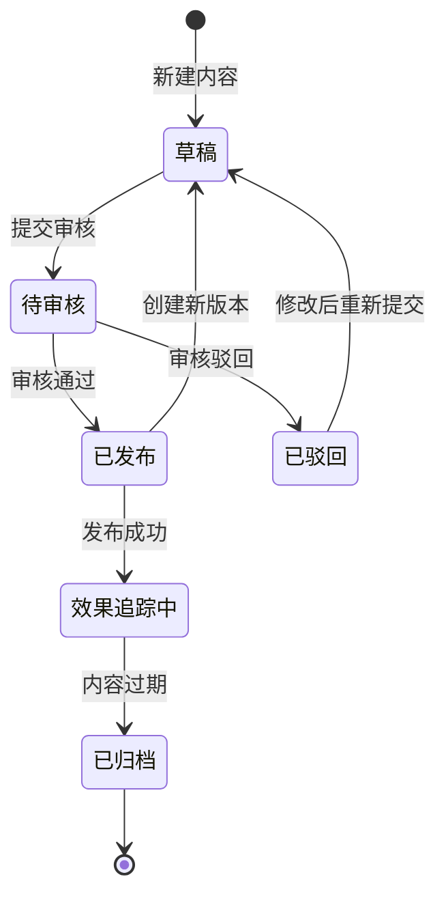
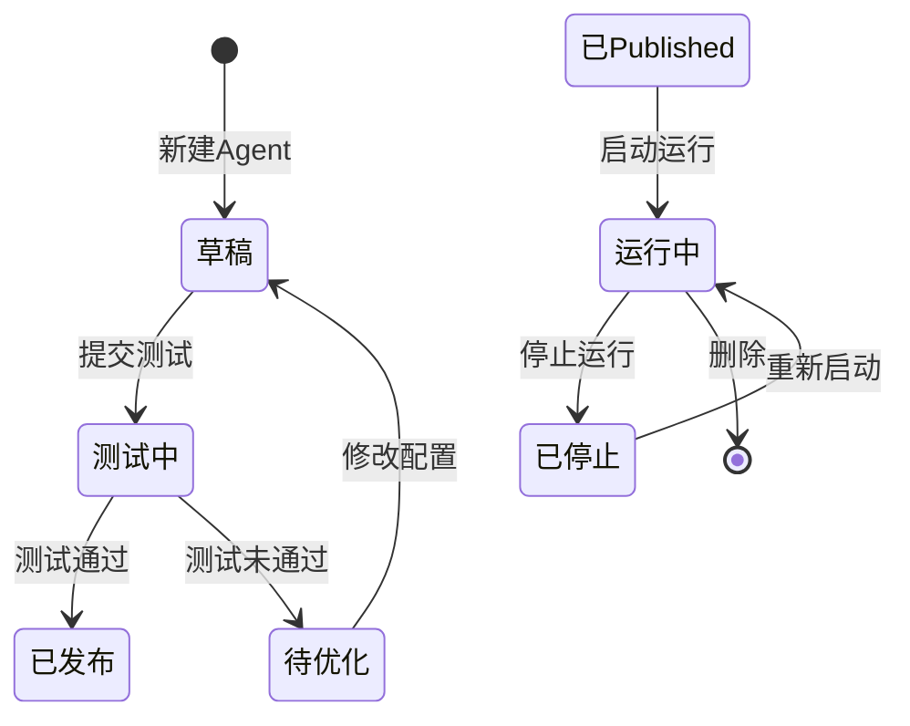

# GEO系统需求功能清单

> **文档编号**：PRD-GEO-2026-001  
> **文档版本**：v0.2  
> **创建日期**：2026年6月22日  
> **项目名称**：GEO（生成式引擎优化）系统  
> **文档性质**：产品需求功能清单（PRD功能拆解版）  
> **对标参考**：迈富时Marketingforce GEO产品（[https://www.marketingforce.com/geo.html](https://www.marketingforce.com/geo.html)）  
> **数据来源**：竞品官网、IT之家、Mordor Intelligence、易观、新浪财经、网易等公开权威渠道

---

## 文档信息

| 项目 | 内容 |
|------|------|
| 文档编号 | PRD-GEO-2026-001 |
| 文档版本 | v0.2 |
| 产品名称 | GEO产品平台 |
| 所属系统 | GEO系统 |
| 编制日期 | 2026-06-22 |
| 最后更新 | 2026-06-22 |
| 文档状态 | 初稿（基于竞品分析成果） |
| 编制依据 | 竞品分析报告《GEO竞品分析报告_迈富时对标研究》 |

---

## 修订记录

| 版本 | 日期 | 修订人 | 修订内容 |
|------|------|--------|----------|
| v0.1 | 2026-06-22 | — | 基于竞品分析成果，完成GEO系统全模块需求功能清单初稿 |
| v0.2 | 2026-06-22 | — | 深度分析与完善：补充用例分析、需求场景、角色权限矩阵、状态流转、页面布局、交互说明、错误处理、合规安全、数据字典等章节 |

---

## 目录

1. [文档概述](#1-文档概述)
2. [功能角色矩阵说明](#2-功能角色矩阵说明)
3. [系统总体架构](#3-系统总体架构)
4. [功能模块总览](#4-功能模块总览)
5. [需求场景分析](#5-需求场景分析)
6. [用例分析](#6-用例分析)
7. [模块一：AI认知诊断与算法监测](#7-模块一ai认知诊断与算法监测)
8. [模块二：语义工程逆向解析与Prompt管理](#8-模块二语义工程逆向解析与prompt管理)
9. [模块三：企业知识库资产建设](#9-模块三企业知识库资产建设)
10. [模块四：智能内容引擎与信源投喂](#10-模块四智能内容引擎与信源投喂)
11. [模块五：数据总览与优化引擎](#11-模块五数据总览与优化引擎)
12. [模块六：AI智能体中台](#12-模块六ai智能体中台)
13. [模块七：客户数据平台（CDP）](#13-模块七客户数据平台cdp)
14. [模块八：营销自动化平台](#14-模块八营销自动化平台)
15. [模块九：知识图谱引擎](#15-模块九知识图谱引擎)
16. [模块十：数据可视化与报表体系](#16-模块十数据可视化与报表体系)
17. [模块十一：系统管理与配置](#17-模块十一系统管理与配置)
18. [非功能性需求](#18-非功能性需求)
19. [数据字典](#19-数据字典)
20. [术语表](#20-术语表)

---

## 1. 文档概述

### 1.1 编写目的

本文档基于《GEO竞品分析报告_迈富时对标研究》的调研成果，对GEO系统进行全面的功能需求拆解，形成结构化的功能清单，为产品设计、研发排期和验收交付提供依据。

### 1.2 适用范围

- **产品经理**：功能规划、优先级排序、PRD编写
- **研发团队**：技术方案设计、开发排期、接口定义
- **测试团队**：测试用例设计、验收标准制定
- **运营团队**：功能上线计划、用户培训

### 1.3 功能分级说明

| 标识 | 含义 | 说明 |
|------|------|------|
| **P0** | 必须实现 | 产品核心能力，MVP阶段必须上线 |
| **P1** | 重要功能 | V1.0版本应完成，影响核心竞争力 |
| **P2** | 增强功能 | V1.1~V2.0逐步迭代，提升用户体验 |
| **P3** | 远期规划 | 长期路线图，视市场反馈决定 |

### 1.4 数据导出规范

涉及导出功能时，统一遵循以下命名规范：

- **格式**：`{业务前缀}_{YYYYMMDD}_{HHMMSS}.xlsx`
- **示例**：`品牌诊断报告_20260622_143052.xlsx`
- **批量导入模板**：使用固定名称，如`批量导入Prompt模板.xlsx`

### 1.5 删除功能规范

| 数据类别 | 删除模式 | 说明 |
|----------|----------|------|
| 核心数据（知识库、Prompt库、诊断配置） | 单条删除 | 操作不可逆，需严格管控 |
| 日志/临时数据 | 批量删除 | 数据量大，提升操作效率 |

所有删除操作需弹窗确认，已绑定/已启用状态的数据删除按钮灰化不可用。

### 1.6 导入功能规范

**核心原则**：前置全量校验，有错不导入，全部通过才入库。

| 阶段 | 处理逻辑 | 用户反馈 |
|------|----------|----------|
| 文件上传 | 校验文件格式（.xlsx）和大小（≤10MB） | 格式错误时Toast提示阻断 |
| 数据校验 | 逐行校验（必填/格式/长度/唯一性/关联数据/字典值） | 错误列表展示（行号+列名+原因） |
| 导入执行 | 全部通过后才执行导入 | 成功后Toast提示导入条数 |

---

## 2. 功能角色矩阵说明

### 2.1 角色定义

| 角色 | 角色描述 | 典型用户 |
|------|----------|----------|
| **系统管理员** | 拥有系统全部权限，负责系统配置、用户管理和数据审计 | IT运维人员、系统管理员 |
| **GEO运营专家** | 负责GEO核心业务运营，包括诊断、Prompt管理、知识库和内容生产 | GEO运营人员、SEO/SEM专员 |
| **内容编辑** | 负责内容生产和发布，管理信源矩阵 | 内容运营、文案编辑 |
| **数据分析师** | 负责数据分析、报表制作和效果评估 | 数据分析师、运营经理 |
| **业务管理员** | 负责业务线数据管理和权限分配 | 业务线负责人 |
| **普通用户** | 查看数据、使用基础功能 | 企业员工、外部访客 |

### 2.2 功能角色矩阵

| 功能模块 | 系统管理员 | GEO运营专家 | 内容编辑 | 数据分析师 | 业务管理员 | 普通用户 |
|----------|:----------:|:-----------:|:--------:|:----------:|:----------:|:--------:|
| M01 AI认知诊断与算法监测 | 全部 | 全部 | 查看 | 全部 | 本组织 | 查看 |
| M02 语义工程逆向解析与Prompt管理 | 全部 | 全部 | 查看 | 查看 | 本组织 | 查看 |
| M03 企业知识库资产建设 | 全部 | 全部 | 编辑 | 查看 | 本组织 | 查看 |
| M04 智能内容引擎与信源投喂 | 全部 | 全部 | 全部 | 查看 | 本组织 | 查看 |
| M05 数据总览与优化引擎 | 全部 | 全部 | 查看 | 全部 | 本组织 | 查看 |
| M06 AI智能体中台 | 全部 | 全部 | 查看 | 查看 | 本组织 | 无 |
| M07 客户数据平台（CDP） | 全部 | 查看 | 无 | 全部 | 本组织 | 无 |
| M08 营销自动化平台 | 全部 | 全部 | 编辑 | 查看 | 本组织 | 无 |
| M09 知识图谱引擎 | 全部 | 全部 | 查看 | 查看 | 本组织 | 无 |
| M10 数据可视化与报表体系 | 全部 | 全部 | 查看 | 全部 | 本组织 | 查看 |
| M11 系统管理与配置 | 全部 | 无 | 无 | 无 | 部分 | 无 |

### 2.3 角色权限总览

| 角色 | 功能权限 | 数据权限 |
|------|----------|----------|
| 系统管理员 | 全部功能（查看/新增/编辑/删除/导入/导出/系统配置） | 全量数据 |
| GEO运营专家 | GEO核心功能（诊断/Prompt/知识库/内容/优化/Agent/图谱） | 全量业务数据 |
| 内容编辑 | 内容生产/发布/信源管理/知识库编辑 | 内容相关数据 |
| 数据分析师 | 数据分析/报表/看板/导出 | 全量只读数据 |
| 业务管理员 | 业务线数据管理/用户管理/权限分配 | 本组织数据 |
| 普通用户 | 查看看板/报告 | 授权查看数据 |

---

## 3. 系统总体架构

### 3.1 架构分层

```
┌─────────────────────────────────────────────────────────────────┐
│                        用户交互层                                │
│  Web工作台 │ 移动端 │ 小程序 │ API开放平台 │ 第三方集成          │
├─────────────────────────────────────────────────────────────────┤
│                        场景应用层                                │
│  品牌诊断 │ Prompt管理 │ 知识库 │ 内容生产 │ 数据看板 │ Agent    │
├─────────────────────────────────────────────────────────────────┤
│                        业务服务层                                │
│  认知诊断服务 │ 语义工程服务 │ 知识库服务 │ 内容服务 │ 优化服务  │
├─────────────────────────────────────────────────────────────────┤
│                        数据中台层                                │
│  知识图谱引擎 │ CDP │ 数据仓库 │ 实时计算 │ 搜索引擎          │
├─────────────────────────────────────────────────────────────────┤
│                        基础设施层                                │
│  大模型能力 │ NLP引擎 │ 向量数据库 │ 图数据库 │ 对象存储        │
└─────────────────────────────────────────────────────────────────┘
```

### 3.2 技术选型要求

| 技术领域 | 选型方向 | 备注 |
|----------|----------|------|
| 大语言模型 | 支持多模型接入（自研+开源），千亿参数级优先 | 需支持模型切换和A/B测试 |
| 知识图谱 | 图数据库（Neo4j/自研），支持千万级节点 | 需支持实时查询和增量更新 |
| 向量数据库 | Milvus/Pinecone/自研，支持语义检索 | 需支持混合检索（向量+关键词） |
| 实时计算 | Flink/Spark Streaming | 算法监测、效果追踪需要实时性 |
| 数据存储 | MySQL（业务）+ Elasticsearch（搜索）+ OSS（文件） | 根据数据类型选择适配存储 |

---

## 4. 功能模块总览

| 模块编号 | 模块名称 | 优先级 | 功能项数 | 简要描述 |
|----------|----------|--------|----------|----------|
| M01 | AI认知诊断与算法监测 | P0 | 12项 | AI平台算法监测、品牌影响力评估 |
| M02 | 语义工程逆向解析与Prompt管理 | P0 | 10项 | Prompt库构建、语义对齐、意图管理 |
| M03 | 企业知识库资产建设 | P0 | 14项 | 知识库构建、图谱管理、权限控制 |
| M04 | 智能内容引擎与信源投喂 | P0 | 12项 | E-E-A-T内容生产、信源管理、效果追踪 |
| M05 | 数据总览与优化引擎 | P1 | 10项 | 多平台看板、ROI归因、策略推荐 |
| M06 | AI智能体中台 | P1 | 12项 | Agent构建、多智能体协同、编排调度 |
| M07 | 客户数据平台（CDP） | P1 | 8项 | 多源数据接入、用户画像、标签管理 |
| M08 | 营销自动化平台 | P2 | 10项 | 流程画布、多渠道触达、效果分析 |
| M09 | 知识图谱引擎 | P0 | 10项 | 图谱构建、实体识别、关系推理 |
| M10 | 数据可视化与报表体系 | P1 | 8项 | 经营驾驶舱、GEO看板、自定义报表 |
| M11 | 系统管理与配置 | P0 | 10项 | 账号权限、系统配置、日志审计 |
| — | **合计** | — | **116项** | — |

---

## 5. 需求场景分析

> 本章从业务视角描述GEO系统的核心需求场景，帮助产品、研发、测试团队理解"谁在什么情况下使用系统做什么事情"。

### 5.1 场景一：品牌AI可见性全面诊断

**场景描述**：企业品牌运营人员需要了解品牌在AI搜索环境中的整体表现，包括在各AI平台的曝光度、引用优先级和竞争地位。

**触发条件**：
- 企业刚接入GEO系统，需要建立品牌AI可见性基线
- 定期（月度/季度）品牌AI资产评估
- 竞品动态监测，需要了解竞争格局

**参与角色**：GEO运营专家、数据分析师

**核心流程**：
1. GEO运营专家登录系统，进入AI认知诊断工作台
2. 新建诊断任务，选择诊断范围（AI平台、关键词、竞品品牌）
3. 系统自动执行诊断，采集各AI平台数据
4. 系统生成品牌影响力报告，包含曝光度、语义占位、竞争优势评分
5. 数据分析师查看报告，导出Excel供管理层汇报
6. 基于诊断结果，制定GEO优化策略

**期望结果**：
- 获得品牌在不少于10个AI平台的可见性评分
- 生成包含趋势图、热力图、雷达图的专业报告
- 识别品牌AI可见性的优势领域和待改进领域

**异常场景**：
- AI平台API不可用 → 系统标记该平台为"数据缺失"，不影响其他平台诊断
- 诊断超时 → 系统异步执行，完成后通过消息通知用户
- 竞品品牌信息不足 → 系统提示"数据有限"，仅展示可获取的对比数据

---

### 5.2 场景二：高权重Prompt工程与优化

**场景描述**：GEO运营专家需要为品牌构建和管理高权重Prompt指令库，通过系统化方式干预AI决策优先级。

**触发条件**：
- 新建品牌GEO优化项目，需要初始化Prompt库
- 现有Prompt效果下降，需要优化
- 进入新行业/新市场，需要行业化Prompt

**参与角色**：GEO运营专家

**核心流程**：
1. GEO运营专家进入语义工程工作台
2. 选择Prompt生成方式（AI智能生成/模板选择/手动创建）
3. 输入品牌信息和目标AI平台
4. 系统基于品牌语义体系和AI回答逻辑分析，生成高权重Prompt
5. GEO运营专家审核Prompt内容，进行微调
6. 执行Prompt效果测试，选择A/B测试方案
7. 系统自动执行测试，对比AI引用提升效果
8. 效果验证通过后，Prompt发布到Prompt库
9. 系统持续监控Prompt效果，自动推荐优化建议

**期望结果**：
- AI生成的Prompt符合品牌语义和AI平台特性
- A/B测试能够量化Prompt的引用提升效果
- Prompt库支持版本管理和效果追踪

**异常场景**：
- AI生成Prompt质量不达标 → 系统提供人工编辑入口，支持手动调整
- A/B测试样本量不足 → 系统提示"样本量不足，建议延长测试周期"
- Prompt与品牌信息冲突 → 系统自动检测语义冲突并告警

---

### 5.3 场景三：企业知识库构建与AI知识供给

**场景描述**：企业需要将分散在各处的非结构化资料（产品手册、技术文档、话术库、合同等）转化为AI可理解的结构化知识资产，为AI认知体系建设提供知识基础。

**触发条件**：
- 企业首次构建GEO知识体系
- 企业资料更新或新增，需要同步更新知识库
- AI回答中品牌信息不准确或不完整，需要补充知识供给

**参与角色**：GEO运营专家、内容编辑、专家认证人员

**核心流程**：
1. GEO运营专家进入知识库管理台
2. 创建知识库，配置分类体系和权限
3. 批量导入非结构化文档（PDF/Word/Excel/PPT）
4. 系统自动解析文档，提取实体、关系和关键信息
5. 系统生成结构化知识条目，构建知识图谱
6. 专家认证人员审核知识条目，标记权威认证
7. 知识库发布，AI系统可引用知识库内容
8. 系统持续监测知识库使用情况和AI引用效果
9. 知识库动态进化，自动检测过期知识并提醒更新

**期望结果**：
- 非结构化文档自动转换为结构化知识，准确率≥90%
- 知识库支持语义搜索和智能问答
- 知识库权限管控到单个知识单位

**异常场景**：
- 文档解析失败 → 系统标记为"待人工处理"，支持手动录入
- 知识冲突 → 系统检测重复或矛盾知识，提示人工仲裁
- 知识库容量超限 → 系统提示扩容或归档旧知识

---

### 5.4 场景四：E-E-A-T标准内容生产与信源投喂

**场景描述**：内容编辑需要基于知识库和Prompt库，批量生成符合E-E-A-T标准的LLM友好内容，并通过信源矩阵建设提升品牌信息在AI中的引用权重。

**触发条件**：
- 品牌需要在AI搜索中提升特定关键词的引用优先级
- 需要批量生成行业相关内容
- 需要建设权威信源矩阵

**参与角色**：内容编辑、GEO运营专家

**核心流程**：
1. 内容编辑进入内容工作台
2. 创建内容生产任务，选择目标AI平台和关键词
3. 系统自动关联相关Prompt和知识库内容
4. AI智能体生成符合E-E-A-T标准的内容
5. 内容编辑审核生成内容，进行微调
6. 配置信源矩阵，选择权威媒体和行业报告
7. 内容发布/投喂到目标平台
8. 系统追踪内容在各AI平台的引用情况
9. 基于效果数据优化内容策略

**期望结果**：
- 批量生成符合E-E-A-T标准的内容
- 内容在各AI平台的引用率可量化追踪
- 信源矩阵建设提升品牌权威度

**异常场景**：
- 内容生成质量不达标 → 系统支持重新生成和人工编辑
- 内容审核未通过 → 系统记录审核意见，支持修改后重新提交
- AI平台拒绝引用 → 系统分析原因，推荐内容或信源优化建议

---

### 5.5 场景五：多AI平台数据监控与策略优化

**场景描述**：数据分析师需要统一监控品牌在各AI平台的GEO效果数据，进行ROI归因分析，并基于数据驱动策略优化。

**触发条件**：
- 日常GEO运营监控
- 月度/季度效果评估
- 重大营销活动前后效果对比

**参与角色**：数据分析师、GEO运营专家

**核心流程**：
1. 数据分析师进入数据工作台
2. 查看多AI平台数据看板，了解整体表现
3. 钻取分析特定平台/特定关键词的详细数据
4. 执行ROI归因分析，将GEO效果关联到业务指标
5. 系统自动推荐优化策略
6. GEO运营专家基于分析结果调整优化策略
7. 生成分析报告，导出供管理层汇报

**期望结果**：
- 统一看板展示所有AI平台数据
- ROI归因分析支持多触点模型
- 策略推荐具备可执行性

**异常场景**：
- 数据同步延迟 → 系统标注数据更新时间，提示"数据可能存在延迟"
- 数据异常波动 → 系统自动告警，提供异常原因分析
- 归因模型不适用 → 系统支持切换归因模型

---

### 5.6 场景六：AI智能体构建与自动化运营

**场景描述**：GEO运营专家需要通过AI智能体中台构建专属AI Agent，实现GEO运营的端到端自动化。

**触发条件**：
- 需要自动化重复性GEO运营任务
- 需要多Agent协同完成复杂业务链路
- 需要将GEO能力集成到企业现有业务流程

**参与角色**：GEO运营专家、系统管理员

**核心流程**：
1. GEO运营专家进入Agent构建台
2. 选择Agent构建方式（自然语言描述/模板选择）
3. 定义Agent角色、能力和行为规则
4. 配置Agent关联的知识库、Prompt库和工具
5. 测试Agent执行效果
6. 发布Agent，配置调度规则
7. 多Agent协同编排，实现复杂业务链路自动化
8. 监控Agent运行状态和效果

**期望结果**：
- 通过自然语言快速构建AI Agent
- 支持多Agent协同完成复杂任务
- Agent运行状态可监控、效果可量化

**异常场景**：
- Agent构建失败 → 系统提供错误日志和修复建议
- Agent执行异常 → 系统自动重试或告警
- 多Agent协同冲突 → 系统提供冲突检测和仲裁机制

---

### 5.7 场景七：客户数据统一管理与精准营销

**场景描述**：数据分析师需要统一管理企业多渠道客户数据，构建360°用户画像，支撑精准营销和用户运营。

**触发条件**：
- 企业多渠道数据需要统一整合
- 需要构建用户画像支撑精准营销
- 需要管理用户标签体系

**参与角色**：数据分析师、业务管理员

**核心流程**：
1. 数据分析师进入CDP工作台
2. 配置多源数据接入（数据库/API/文件导入）
3. 系统自动执行数据清洗和治理
4. 系统构建统一用户身份（One-ID）
5. 数据分析师创建和管理用户标签
6. 基于标签进行人群分群和画像分析
7. 导出人群数据用于精准营销

**期望结果**：
- 多渠道数据统一整合，构建One-ID体系
- 360°用户画像支持多维度分析
- 标签管理支持11种创建方式

**异常场景**：
- 数据源接入失败 → 系统提示连接错误，支持重试
- 数据清洗规则不适配 → 系统支持自定义清洗规则
- ID Mapping冲突 → 系统提供冲突检测和人工仲裁

---

### 5.8 场景八：知识图谱构建与智能推理

**场景描述**：GEO运营专家需要构建企业知识图谱，实现实体识别、关系抽取和智能推理，为AI认知体系提供结构化知识。

**触发条件**：
- 需要从非结构化数据中提取结构化知识
- 需要构建行业知识图谱
- 需要基于知识图谱进行智能推理

**参与角色**：GEO运营专家、系统管理员

**核心流程**：
1. GEO运营专家进入知识图谱工作台
2. 选择图谱构建方式（自动构建/手动创建/导入）
3. 配置数据源和抽取规则
4. 系统自动执行实体识别、关系抽取
5. 系统生成可视化知识图谱
6. GEO运营专家审核和编辑图谱
7. 基于图谱进行智能查询和推理
8. 图谱质量评估和持续优化

**期望结果**：
- 自动从多源数据构建知识图谱
- 图谱可视化支持交互式探索
- 支持智能查询和多跳推理

**异常场景**：
- 实体识别准确率不足 → 系统支持人工校正
- 关系抽取冲突 → 系统提示冲突，支持人工仲裁
- 图谱规模过大 → 系统支持分布式存储和计算

---

## 6. 用例分析

> 本章以UML用例图+用例描述的形式，详细分析GEO系统的核心功能用例。

### 6.1 系统总体用例图



### 6.2 核心用例描述

#### 6.2.1 UC01：品牌AI诊断

| 项目 | 内容 |
|------|------|
| **用例编号** | UC01 |
| **用例名称** | 品牌AI诊断 |
| **参与者** | GEO运营专家（主）、数据分析师（辅） |
| **前置条件** | 用户已登录系统，已配置品牌基础信息 |
| **后置条件** | 系统生成品牌AI诊断报告，数据存入历史记录 |
| **触发条件** | 用户点击"新建诊断"按钮 |

**主流程（基本流）**：

| 步骤 | 参与者 | 系统 |
|------|--------|------|
| 1 | 点击"新建诊断" | — |
| 2 | — | 打开诊断配置页面 |
| 3 | 选择诊断范围（AI平台、关键词、竞品） | — |
| 4 | — | 校验配置有效性 |
| 5 | 点击"开始诊断" | — |
| 6 | — | 系统异步执行诊断任务 |
| 7 | — | 采集各AI平台数据 |
| 8 | — | 执行语义分析和评分计算 |
| 9 | — | 生成品牌影响力报告 |
| 10 | 收到诊断完成通知 | — |
| 11 | 查看诊断报告 | — |
| 12 | — | 展示多维度评分和可视化图表 |
| 13 | 导出报告（可选） | — |
| 14 | — | 生成Excel/PDF报告文件 |

**备选流程（替代流）**：

| 编号 | 条件 | 处理 |
|------|------|------|
| 3a | 未选择任何AI平台 | 系统提示"请至少选择一个AI平台"，阻止提交 |
| 6a | 诊断任务超时（>30分钟） | 系统标记任务为"超时"，提示用户稍后查看 |
| 7a | 某AI平台API不可用 | 系统跳过该平台，在报告中标记"数据缺失" |
| 11a | 诊断结果异常 | 系统提示"诊断结果异常，建议重新诊断" |

**业务规则**：
- 诊断任务支持14个主流AI平台
- 诊断报告包含曝光度、语义占位、竞争优势三个维度评分
- 诊断历史数据保留≥180天
- 单次诊断最多支持5个竞品对比

---

#### 6.2.2 UC02：Prompt智能生成与测试

| 项目 | 内容 |
|------|------|
| **用例编号** | UC02 |
| **用例名称** | Prompt智能生成与测试 |
| **参与者** | GEO运营专家 |
| **前置条件** | 用户已登录系统，品牌知识库已构建 |
| **后置条件** | 系统生成高权重Prompt，测试结果存入Prompt库 |
| **触发条件** | 用户点击"新建Prompt"按钮 |

**主流程（基本流）**：

| 步骤 | 参与者 | 系统 |
|------|--------|------|
| 1 | 点击"新建Prompt" | — |
| 2 | — | 打开Prompt创建页面 |
| 3 | 选择生成方式（AI生成/模板选择/手动创建） | — |
| 4 | — | 根据选择展示对应界面 |
| 5 | 输入品牌信息和目标AI平台 | — |
| 6 | — | 校验输入有效性 |
| 7 | 点击"生成Prompt" | — |
| 8 | — | 系统基于品牌语义和AI逻辑生成Prompt |
| 9 | 审核Prompt内容 | — |
| 10 | — | 展示Prompt预览 |
| 11 | 点击"效果测试" | — |
| 12 | — | 打开测试配置页面 |
| 13 | 配置A/B测试方案 | — |
| 14 | — | 系统执行A/B测试 |
| 15 | — | 对比AI引用提升效果 |
| 16 | 查看测试结果 | — |
| 17 | — | 展示测试报告和效果对比 |
| 18 | 点击"发布" | — |
| 19 | — | Prompt进入Prompt库 |

**备选流程（替代流）**：

| 编号 | 条件 | 处理 |
|------|------|------|
| 8a | AI生成Prompt质量评分<70分 | 系统提示"生成质量较低，建议调整输入条件后重新生成" |
| 14a | A/B测试样本量不足 | 系统提示"样本量不足，建议延长测试周期或扩大测试范围" |
| 15a | 测试效果为负（引用率下降） | 系统告警"测试效果为负，建议优化Prompt后重新测试" |
| 18a | Prompt与已有Prompt重复 | 系统提示"检测到相似Prompt，建议合并或差异化" |

**业务规则**：
- AI生成的Prompt需经过人工审核才能发布
- A/B测试最小样本量为100次搜索请求
- Prompt库支持版本管理，最多保留20个历史版本
- Prompt发布后自动进入效果监控

---

#### 6.2.3 UC03：知识库构建与管理

| 项目 | 内容 |
|------|------|
| **用例编号** | UC03 |
| **用例名称** | 知识库构建与管理 |
| **参与者** | GEO运营专家（主）、内容编辑（辅）、专家认证人员（辅） |
| **前置条件** | 用户已登录系统，具备知识库管理权限 |
| **后置条件** | 知识库构建完成，知识条目可检索和引用 |
| **触发条件** | 用户点击"新建知识库"或"导入文档" |

**主流程（基本流）**：

| 步骤 | 参与者 | 系统 |
|------|--------|------|
| 1 | 点击"新建知识库" | — |
| 2 | — | 打开知识库创建页面 |
| 3 | 配置知识库基本信息（名称、分类、权限） | — |
| 4 | — | 创建知识库 |
| 5 | 点击"导入文档" | — |
| 6 | — | 打开文件上传页面 |
| 7 | 选择文件（PDF/Word/Excel/PPT） | — |
| 8 | — | 校验文件格式和大小 |
| 9 | — | 系统异步解析文档 |
| 10 | — | 自动提取实体、关系和关键信息 |
| 11 | — | 生成结构化知识条目 |
| 12 | 审核知识条目 | — |
| 13 | — | 展示知识条目列表 |
| 14 | 专家认证人员进行权威认证 | — |
| 15 | — | 标记权威认证标识 |
| 16 | 点击"发布" | — |
| 17 | — | 知识库上线，AI可引用 |

**备选流程（替代流）**：

| 编号 | 条件 | 处理 |
|------|------|------|
| 8a | 文件格式不支持 | 系统提示"不支持的文件格式，请上传PDF/Word/Excel/PPT文件" |
| 8b | 文件超过100MB | 系统提示"文件过大，请上传100MB以内的文件" |
| 9a | 文档解析失败 | 系统标记为"待人工处理"，支持手动录入 |
| 10a | 知识提取准确率<80% | 系统提示"提取准确率较低，建议人工审核" |
| 14a | 知识条目与已有知识冲突 | 系统提示冲突，支持人工仲裁 |

**业务规则**：
- 单文件最大支持100MB，批量导入最大1GB
- 知识库权限管控到单个知识单位
- 知识条目支持版本管理和审批流
- 专家认证内容在搜索中优先展示

---

#### 6.2.4 UC04：内容生产与信源投喂

| 项目 | 内容 |
|------|------|
| **用例编号** | UC04 |
| **用例名称** | 内容生产与信源投喂 |
| **参与者** | 内容编辑（主）、GEO运营专家（辅） |
| **前置条件** | 用户已登录系统，知识库和Prompt库已构建 |
| **后置条件** | 内容生成并发布，效果数据可追踪 |
| **触发条件** | 用户点击"新建内容"或"批量生成" |

**主流程（基本流）**：

| 步骤 | 参与者 | 系统 |
|------|--------|------|
| 1 | 点击"新建内容" | — |
| 2 | — | 打开内容创建页面 |
| 3 | 选择目标AI平台和关键词 | — |
| 4 | — | 系统自动关联相关Prompt和知识库 |
| 5 | 点击"AI生成" | — |
| 6 | — | 系统基于E-E-A-T标准生成内容 |
| 7 | 审核生成内容 | — |
| 8 | — | 展示内容预览和E-E-A-T评分 |
| 9 | 配置信源矩阵 | — |
| 10 | — | 选择权威媒体和行业报告 |
| 11 | 点击"发布" | — |
| 12 | — | 内容发布到目标平台 |
| 13 | — | 系统开始追踪内容引用效果 |
| 14 | 查看效果数据 | — |
| 15 | — | 展示引用率、排名变化等指标 |

**备选流程（替代流）**：

| 编号 | 条件 | 处理 |
|------|------|------|
| 6a | E-E-A-T评分<70分 | 系统提示"内容质量较低，建议优化后重新生成" |
| 7a | 内容审核未通过 | 系统记录审核意见，支持修改后重新提交 |
| 11a | 内容发布失败 | 系统提示发布失败原因，支持重试 |
| 15a | 内容引用率持续下降 | 系统自动告警，推荐内容优化建议 |

---

#### 6.2.5 UC05：数据监控与策略优化

| 项目 | 内容 |
|------|------|
| **用例编号** | UC05 |
| **用例名称** | 数据监控与策略优化 |
| **参与者** | 数据分析师（主）、GEO运营专家（辅） |
| **前置条件** | 用户已登录系统，已有GEO运营数据 |
| **后置条件** | 生成分析报告，优化策略被执行 |
| **触发条件** | 用户进入数据工作台或收到告警通知 |

**主流程（基本流）**：

| 步骤 | 参与者 | 系统 |
|------|--------|------|
| 1 | 进入数据工作台 | — |
| 2 | — | 展示多AI平台数据看板 |
| 3 | 选择分析维度和时间范围 | — |
| 4 | — | 系统聚合数据并展示 |
| 5 | 点击"钻取分析" | — |
| 6 | — | 展示详细数据 |
| 7 | 点击"ROI归因分析" | — |
| 8 | — | 执行归因计算 |
| 9 | — | 展示归因结果 |
| 10 | 查看策略推荐 | — |
| 11 | — | 系统展示优化策略建议 |
| 12 | GEO运营专家执行优化策略 | — |
| 13 | — | 系统记录策略执行日志 |

---

#### 6.2.6 UC06：AI智能体构建

| 项目 | 内容 |
|------|------|
| **用例编号** | UC06 |
| **用例名称** | AI智能体构建 |
| **参与者** | GEO运营专家（主）、系统管理员（辅） |
| **前置条件** | 用户已登录系统，具备Agent管理权限 |
| **后置条件** | Agent构建完成并发布，可执行自动化任务 |
| **触发条件** | 用户点击"新建Agent" |

**主流程（基本流）**：

| 步骤 | 参与者 | 系统 |
|------|--------|------|
| 1 | 点击"新建Agent" | — |
| 2 | — | 打开Agent构建页面 |
| 3 | 选择构建方式（自然语言/模板） | — |
| 4 | — | 展示对应构建界面 |
| 5 | 描述Agent角色和能力 | — |
| 6 | — | 系统解析并生成Agent配置 |
| 7 | 配置关联资源（知识库/Prompt/工具） | — |
| 8 | — | 校验资源配置有效性 |
| 9 | 点击"测试" | — |
| 10 | — | 执行Agent测试任务 |
| 11 | 查看测试结果 | — |
| 12 | — | 展示执行日志和结果 |
| 13 | 点击"发布" | — |
| 14 | — | Agent上线运行 |

---

## 7. 模块一：AI认知诊断与算法监测

> **模块定位**：GEO系统的"感知层"，负责实时监测AI平台算法趋势、评估品牌AI可见性，为后续优化提供数据支撑。  
> **对标竞品**：迈富时品牌AI诊断引擎  
> **优先级**：P0

### 7.1 功能清单

| 功能编号 | 功能名称 | 优先级 | 功能类型 | 功能描述 | 应用场景 | 能力边界 | 技术支撑 |
|----------|----------|--------|----------|----------|----------|----------|----------|
| M01-F01 | 品牌AI诊断引擎 | P0 | 核心功能 | 对品牌在主流AI平台（ChatGPT、Perplexity、Claude、Gemini、豆包、Kimi、DeepSeek、文心一言等）的AI可见性进行全面诊断，自动生成品牌影响力报告 | 品牌AI资产盘点、竞争格局分析、投放策略制定 | 覆盖不少于10个主流AI平台，语义匹配精度≥99% | NLP+知识图谱+多平台API对接 |
| M01-F02 | AI可见性量化评估 | P0 | 核心功能 | 建立多维度量化评估模型，包括：曝光度评分（品牌在AI答案中的出现频率）、语义占位评分（品牌在特定语义空间的覆盖度）、竞争优势评分（vs竞品的相对排名） | 品牌AI资产量化管理、效果追踪、目标设定 | 支持自定义权重配置 | 语义分析+向量空间建模+评分算法 |
| M01-F03 | 算法趋势监测 | P0 | 核心功能 | 实时监测主流AI平台的算法更新和趋势变化，包括：算法版本变更检测、排名规则变化感知、新平台/新模型接入发现 | 算法波动预警、策略提前调整、新机会发现 | 48-72小时内感知算法变化 | 爬虫监测+异常检测+版本对比 |
| M01-F04 | 竞品AI可见性对比 | P0 | 核心功能 | 支持输入1-5个竞品品牌，自动对比自身与竞品在各AI平台的曝光差异，生成对比分析报告 | 竞争分析、差异化策略制定、市场定位 | 支持多竞品并行对比，数据可导出 | 语义匹配+实体识别+对比分析 |
| M01-F05 | 品牌影响力报告 | P1 | 核心功能 | 自动生成品牌AI影响力评估报告，支持日报/周报/月报，包含：AI可见性趋势图、平台分布热力图、竞品对比雷达图、优化建议 | 管理层汇报、运营效果追踪、客户交付 | 支持自定义报告模板，支持PDF/Excel导出 | 数据可视化+自动报告生成 |
| M01-F06 | AI平台覆盖管理 | P1 | 辅助功能 | 管理品牌在各AI平台的注册信息、认证状态和基础信息一致性，支持平台账号绑定和信息同步 | 品牌信息一致性管理、多平台统一管理 | 覆盖国内外主流AI平台 | API集成+信息同步 |
| M01-F07 | 关键词意图分析 | P1 | 辅助功能 | 分析用户搜索关键词与品牌相关的意图分布，识别高价值搜索场景和潜在机会 | SEO/GEO关键词策略、内容规划 | 支持意图分类和聚类 | 意图识别+关键词分析 |
| M01-F08 | 语义占位地图 | P2 | 辅助功能 | 以可视化方式展示品牌在AI语义空间中的占位情况，识别语义空白和竞争热点 | 语义策略制定、内容覆盖规划 | 支持多维语义空间映射 | 降维可视化+语义映射 |
| M01-F09 | 诊断任务调度 | P1 | 辅助功能 | 支持设置定期诊断任务（每日/每周/每月），自动执行诊断并推送报告 | 持续监测、自动化运营 | 支持自定义调度规则 | 定时任务+消息推送 |
| M01-F10 | 告警与通知 | P1 | 辅助功能 | 关键指标异常告警，如AI引用率大幅下降、竞品超越、算法重大更新等，支持多渠道通知（站内信/邮件/企微） | 风险预警、及时响应 | 支持自定义告警规则和阈值 | 异常检测+消息推送 |
| M01-F11 | 历史趋势分析 | P2 | 辅助功能 | 展示品牌AI可见性的历史趋势，支持同比/环比分析，识别季节性规律 | 长期策略制定、效果评估 | 支持多时间维度 | 时间序列分析+趋势预测 |
| M01-F12 | 诊断数据导出 | P1 | 辅助功能 | 支持将诊断数据导出为Excel/PDF格式，包含完整的诊断结果和原始数据 | 数据分析、客户交付、外部分析 | 支持自定义导出字段 | 数据导出引擎 |

### 7.2 状态流转图



### 7.3 页面布局

```
┌─────────────────────────────────────────────────────────────────┐
│  AI认知诊断工作台                                      [+新建诊断] │
├─────────────────────────────────────────────────────────────────┤
│  查询条件区                                                       │
│  ┌─────────────┐ ┌─────────────┐ ┌──────┐ ┌──────┐             │
│  │ 品牌名称    │ │ 时间范围    │ │ 查询 │ │ 重置 │             │
│  │ [输入框    ]│ │ [日期选择  ]│ │ 按钮 │ │ 按钮 │             │
│  └─────────────┘ └─────────────┘ └──────┘ └──────┘             │
├─────────────────────────────────────────────────────────────────┤
│  诊断任务列表                                                     │
│  ┌────┬──────┬──────────┬──────────┬──────────┬────────┐      │
│  │ □  │ 序号 │ 任务名称  │ 状态     │ 创建时间 │ 操作   │      │
│  ├────┼──────┼──────────┼──────────┼──────────┼────────┤      │
│  │ □  │  1   │ 月度诊断  │ 已完成   │ 06-01    │ [查看] [导出]│  │
│  │ □  │  2   │ 竞品对比  │ 执行中   │ 06-15    │ [查看] [取消]│  │
│  │ □  │  3   │ 季度评估  │ 失败     │ 06-20    │ [查看] [重试]│  │
│  └────┴──────┴──────────┴──────────┴──────────┴────────┘      │
├─────────────────────────────────────────────────────────────────┤
│  分页区    [< 1 2 3 ... 5 >]  [每页 10 ▼]  共 48 条            │
└─────────────────────────────────────────────────────────────────┘
```

### 7.4 交互说明

| 操作类型 | 触发操作 | 交互可用性 | 正向输出 | 异常场景 | 异常处理 |
|----------|----------|------------|----------|----------|----------|
| 新建诊断 | 点击"+新建诊断" | 始终可用 | 打开诊断配置弹窗 | — | — |
| 查看报告 | 点击"查看" | 任务已完成 | 展示诊断报告详情 | 报告已失效 | 提示"报告已失效，请重新诊断" |
| 导出报告 | 点击"导出" | 任务已完成 | 下载Excel/PDF文件 | 无数据 | Toast提示"暂无数据可导出" |
| 取消诊断 | 点击"取消" | 任务执行中 | 终止诊断任务 | — | — |
| 重试诊断 | 点击"重试" | 任务失败 | 重新执行诊断 | — | — |

### 7.5 错误处理规范

| 场景 | 触发条件 | 提示文案 | 处理方式 |
|------|----------|----------|----------|
| AI平台API不可用 | 平台接口超时或返回错误 | 部分AI平台数据获取失败，报告中标记"数据缺失" | 继续其他平台诊断 |
| 诊断超时 | 诊断任务超过30分钟 | 诊断任务超时，请稍后重试 | 支持重试 |
| 数据异常 | 诊断结果超出合理范围 | 诊断结果异常，建议重新诊断 | 支持重新诊断 |
| 导出失败 | 文件生成失败 | 导出失败，请稍后重试 | 支持重试 |

---

## 8. 模块二：语义工程逆向解析与Prompt管理

> **模块定位**：GEO系统的"策略层"，负责逆向解析AI回答逻辑，构建和管理高权重Prompt指令库。  
> **对标竞品**：迈富时高权重Prompt库+五层干预架构  
> **优先级**：P0

### 8.1 功能清单

| 功能编号 | 功能名称 | 优先级 | 功能类型 | 功能描述 | 应用场景 | 能力边界 | 技术支撑 |
|----------|----------|--------|----------|----------|----------|----------|----------|
| M02-F01 | Prompt库管理 | P0 | 核心功能 | 创建、编辑、分类、标签化管理Prompt指令库，支持按行业/场景/AI平台多维分类 | Prompt统一管理、团队协作、版本控制 | 支持百万级Prompt管理，支持全文检索 | 数据库+搜索引擎+标签系统 |
| M02-F02 | AI回答逻辑解析 | P0 | 核心功能 | 逆向分析AI生成优质回答的逻辑结构、信源引用规律、回答模式，提取关键影响因素 | 内容策略优化、信源权重提升、Prompt设计参考 | 适配主流AI引擎推理逻辑 | NLP+逻辑推理+模式识别 |
| M02-F03 | Prompt智能生成 | P0 | 核心功能 | 基于品牌信息、行业特征和AI平台特性，自动生成高权重Prompt指令，支持批量生成 | 批量Prompt生产、场景化适配、冷启动 | 支持行业定制模板，支持多AI平台适配 | LLM+模板引擎+规则引擎 |
| M02-F04 | Prompt效果测试 | P0 | 核心功能 | 对生成的Prompt进行A/B测试，验证AI引用提升效果，支持多平台同步测试 | Prompt优化、效果验证、最佳实践沉淀 | 支持多变量测试，统计显著性分析 | A/B测试框架+数据分析 |
| M02-F05 | 语义对齐引擎 | P1 | 核心功能 | 将品牌语义体系与AI理解语义空间进行对齐，检测语义偏差并自动修正 | 语义一致性管理、AI误解消除、品牌信息准确性 | 支持多语言、多模态语义对齐 | 向量空间建模+语义映射+对比学习 |
| M02-F06 | 意图节点管理 | P1 | 核心功能 | 管理语义意图节点库，覆盖用户搜索场景，支持层级结构和标签管理 | 意图覆盖度分析、场景化策略、搜索覆盖 | 支持自定义意图层级，支持意图关联 | 意图识别+知识图谱 |
| M02-F07 | Prompt版本管理 | P1 | 辅助功能 | Prompt的版本控制、变更历史、回滚能力，支持版本对比 | Prompt迭代管理、变更追溯、团队协作 | 支持差异对比和一键回滚 | 版本控制+差异对比 |
| M02-F08 | Prompt模板市场 | P2 | 辅助功能 | 内置行业Prompt模板市场，支持模板分享、收藏和一键使用 | 快速启动、最佳实践传播、行业适配 | 支持评分和评论 | 模板引擎+评分系统 |
| M02-F09 | 五层干预架构配置 | P1 | 辅助功能 | 配置五层认知干预架构的参数和策略（诊断→语义→知识→内容→优化） | 系统化GEO策略配置、效果最大化 | 支持自定义干预强度和优先级 | 规则引擎+配置中心 |
| M02-F10 | Prompt使用统计 | P1 | 辅助功能 | 统计各Prompt的使用次数、效果评分、引用提升率，支持排名和筛选 | Prompt效果评估、优化决策、资源分配 | 支持多维度统计 | 数据统计+可视化 |

### 8.2 状态流转图



### 8.3 页面布局

```
┌─────────────────────────────────────────────────────────────────┐
│  Prompt管理库                                    [+新建Prompt]    │
├─────────────────────────────────────────────────────────────────┤
│  查询条件区                                                       │
│  ┌─────────────┐ ┌─────────────┐ ┌──────────┐ ┌──────┐ ┌──────┐│
│  │ Prompt名称  │ │ 适用平台    │ │ 状态     │ │ 查询 │ │ 重置 ││
│  │ [输入框    ]│ │ [下拉框  ▼] │ │ [下拉  ▼]│ │ 按钮 │ │ 按钮 ││
│  └─────────────┘ └─────────────┘ └──────────┘ └──────┘ └──────┘│
├─────────────────────────────────────────────────────────────────┤
│  Prompt列表                                                       │
│  ┌────┬──────┬──────────┬────────┬──────────┬────────┬────────┐│
│  │ □  │ 序号 │ 名称     │ 平台   │ 效果评分 │ 状态   │ 操作   ││
│  ├────┼──────┼──────────┼────────┼──────────┼────────┼────────┤│
│  │ □  │  1   │ 品牌介绍 │ ChatGPT│ 92分     │ 已发布 │ [编辑][测试]│
│  │ □  │  2   │ 产品优势 │ 豆包   │ 85分     │ 已发布 │ [编辑][测试]│  │
│  │ □  │  3   │ 行业方案 │ Kimi   │ —        │ 草稿   │ [编辑][删除]│  │
│  └────┴──────┴──────────┴────────┴──────────┴────────┴────────┘│
├─────────────────────────────────────────────────────────────────┤
│  分页区    [< 1 2 3 ... 8 >]  [每页 10 ▼]  共 76 条            │
└─────────────────────────────────────────────────────────────────┘
```

### 8.4 交互说明

| 操作类型 | 触发操作 | 交互可用性 | 正向输出 | 异常场景 | 异常处理 |
|----------|----------|------------|----------|----------|----------|
| 新建Prompt | 点击"+新建Prompt" | 始终可用 | 打开Prompt创建弹窗 | — | — |
| AI生成 | 点击"AI生成" | 已填写品牌信息 | 系统生成Prompt | 生成质量评分<70 | 提示"生成质量较低，建议调整输入" |
| 效果测试 | 点击"测试" | Prompt已保存 | 打开测试配置弹窗 | 样本量不足 | 提示"建议延长测试周期" |
| 发布 | 点击"发布" | 测试通过 | Prompt上线 | 与已有Prompt重复 | 提示"检测到相似Prompt" |
| 编辑 | 点击"编辑" | 非已归档状态 | 打开编辑弹窗 | — | — |
| 删除 | 点击"删除" | 草稿状态 | 删除Prompt | 已发布状态 | 按钮灰化不可点击 |

### 8.5 错误处理规范

| 场景 | 触发条件 | 提示文案 | 处理方式 |
|------|----------|----------|----------|
| AI生成失败 | LLM接口超时或返回错误 | Prompt生成失败，请稍后重试 | 支持重试 |
| 测试超时 | A/B测试超过预期时间 | 测试超时，请稍后查看结果 | 异步执行，完成后通知 |
| 测试效果为负 | 引用率下降 | 测试效果为负，建议优化Prompt后重新测试 | 阻止发布 |
| 语义冲突 | Prompt与品牌信息冲突 | 检测到语义冲突，请修改后重新提交 | 阻止发布 |

---

## 9. 模块三：企业知识库资产建设

> **模块定位**：GEO系统的"资产层"，负责将企业非结构化资料转化为AI可理解、可推理的结构化知识资产。  
> **对标竞品**：迈富时企业知识库平台+KnowForce AI知识中台  
> **优先级**：P0

### 9.1 功能清单

| 功能编号 | 功能名称 | 优先级 | 功能类型 | 功能描述 | 应用场景 | 能力边界 | 技术支撑 |
|----------|----------|--------|----------|----------|----------|----------|----------|
| M03-F01 | 知识库创建与管理 | P0 | 核心功能 | 创建和管理企业知识库，支持按业务领域/部门/项目多维分类，支持知识库级别的权限配置 | 企业知识统一管理、多业务线支持 | 支持无限层级分类，支持百万级文档 | 数据库+文件系统+权限管理 |
| M03-F02 | 非结构化数据导入 | P0 | 核心功能 | 支持PDF/Word/Excel/PPT/TXT等多种格式文件批量导入，自动解析和结构化转换 | 历史文档数字化、知识资产积累、冷启动 | 单文件≤100MB，批量导入≤1GB | OCR+文档解析+异步处理 |
| M03-F03 | 智能知识提取 | P0 | 核心功能 | 自动从文档中提取实体、关系、关键信息，生成结构化知识条目 | 知识图谱构建、知识条目自动化生产 | 支持中文/英文多语言 | NER+关系抽取+LLM |
| M03-F04 | 行业知识图谱构建 | P0 | 核心功能 | 结合行业基础数据构建面向行业场景的知识图谱，支持自定义行业本体 | 行业知识管理、专业问答、AI认知建设 | 支持自定义行业本体，支持图谱增量更新 | 本体构建+图数据库+知识融合 |
| M03-F05 | 知识库智能检索 | P0 | 核心功能 | 支持语义搜索+关键词搜索混合检索，支持自然语言问答 | 员工知识问答、AI知识供给、决策支持 | 检索响应时间≤1秒 | 向量数据库+ES+RAG |
| M03-F06 | 知识库权限管理 | P0 | 核心功能 | 原子级权限控制，支持人员/部门/项目组/岗位多维度授权，支持所有/管理/协作/使用等权限层级 | 知识安全管控、跨部门协作、合规管理 | 细粒度到单个知识单位 | RBAC+ABAC权限模型 |
| M03-F07 | 知识库版本管理 | P1 | 核心功能 | 知识库内容的版本控制、变更历史、审批流和发布管理 | 知识质量管控、合规审计、变更追溯 | 支持自定义审批流 | 工作流引擎+版本控制 |
| M03-F08 | 专家认证体系 | P1 | 核心功能 | 按业务领域定义专家席位，专家产出内容带"权威认证"标识，搜索结果优先展示 | 权威知识优先展示、专家贡献量化、知识质量保障 | 支持多领域专家体系 | 权重算法+认证体系 |
| M03-F09 | 知识库动态进化 | P1 | 核心功能 | 基于AI反馈和用户交互持续优化知识库内容，自动检测过期知识并提醒更新 | 知识库质量持续提升、内容时效性管理 | 支持自动更新+人工审核 | 强化学习+人工审核+过期检测 |
| M03-F10 | 多模态知识处理 | P1 | 辅助功能 | 支持文本、图片、音频、视频等多模态知识内容的存储、检索和理解 | 全类型知识管理、多媒体知识库 | 支持主流多媒体格式 | 多模态LLM+特征提取 |
| M03-F11 | 组织/个人知识库 | P1 | 辅助功能 | 组织知识库统一管理（入职授权/离职交接），个人知识库默认私有 | 知识安全、个人知识积累、组织知识传承 | 支持权限灵活配置 | 权限管理+加密存储 |
| M03-F12 | 知识审批流 | P1 | 辅助功能 | 个人知识升级为组织知识的审批流程，支持自定义审批节点和规则 | 知识质量管控、合规审计 | 支持多级审批 | 工作流引擎 |
| M03-F13 | 动态水印 | P2 | 辅助功能 | 知识展示时叠加动态水印（用户信息+时间戳），支持自定义水印规则 | 防泄密、全程可追溯 | 支持自定义水印内容 | 水印引擎+日志追踪 |
| M03-F14 | 知识库统计报表 | P1 | 辅助功能 | 知识库使用统计（访问量/引用次数/用户活跃度）、知识覆盖率分析 | 知识库运营分析、投入产出评估 | 支持自定义维度 | 数据统计+可视化 |

### 9.2 状态流转图



### 9.3 页面布局

```
┌─────────────────────────────────────────────────────────────────┐
│  知识库管理                                    [+新建知识库]      │
├──────────┬──────────────────────────────────────────────────────┤
│ 知识库导航 │  知识库：品牌知识库_2026                            │
│          ├──────────────────────────────────────────────────────┤
│ 📁 全部    │  查询条件区                                          │
│ 📁 产品资料│  ┌─────────────┐ ┌─────────────┐ ┌──────┐ ┌──────┐│
│ 📁 技术文档│  │ 关键词      │ │ 类型        │ │ 查询 │ │ 重置 ││
│ 📁 话术库  │  │ [输入框    ]│ │ [下拉框  ▼] │ │ 按钮 │ │ 按钮 ││
│ 📁 行业报告│  └─────────────┘ └─────────────┘ └──────┘ └──────┘│
│          ├──────────────────────────────────────────────────────┤
│          │  工具栏    [+导入文档]  [+手动创建]  [批量操作▼]      │
│          ├──────────────────────────────────────────────────────┤
│          │  知识条目列表                                          │
│          │  ┌────┬──────┬──────────┬────────┬────────┬────────┐│
│          │  │ □  │ 序号 │ 标题     │ 类型   │ 状态   │ 操作   ││
│          │  ├────┼──────┼──────────┼────────┼────────┼────────┤│
│          │  │ □  │  1   │ 品牌介绍 │ 文本   │ 已发布 │ [查看][编辑]│
│          │  │ □  │  2   │ 产品参数 │ 表格   │ 已发布 │ [查看][编辑]│
│          │  │ □  │  3   │ 话术模板 │ 文本   │ 待审核 │ [查看][审核]│
│          │  └────┴──────┴──────────┴────────┴────────┴────────┘│
│          ├──────────────────────────────────────────────────────┤
│          │  分页区    [< 1 2 3 ... 12 >]  [每页 10 ▼]  共 118条│
└──────────┴──────────────────────────────────────────────────────┘
```

### 9.4 交互说明

| 操作类型 | 触发操作 | 交互可用性 | 正向输出 | 异常场景 | 异常处理 |
|----------|----------|------------|----------|----------|----------|
| 新建知识库 | 点击"+新建知识库" | 始终可用 | 打开知识库创建弹窗 | — | — |
| 导入文档 | 点击"+导入文档" | 知识库已创建 | 打开文件上传弹窗 | 文件格式不支持 | 提示"不支持的文件格式" |
| 手动创建 | 点击"+手动创建" | 知识库已创建 | 打开知识条目编辑弹窗 | — | — |
| 查看 | 点击"查看" | 始终可用 | 展示知识条目详情 | 知识已失效 | 提示"知识条目已失效" |
| 编辑 | 点击"编辑" | 已发布/草稿状态 | 打开编辑弹窗 | 知识被锁定 | 提示"知识条目被锁定" |
| 审核 | 点击"审核" | 待审核状态 | 打开审核弹窗 | — | — |
| 删除 | 点击"删除" | 草稿状态 | 删除知识条目 | 已发布状态 | 按钮灰化不可点击 |

### 9.5 错误处理规范

| 场景 | 触发条件 | 提示文案 | 处理方式 |
|------|----------|----------|----------|
| 文档解析失败 | OCR或解析引擎失败 | 文档解析失败，请手动录入 | 标记为"待人工处理" |
| 知识提取准确率不足 | 提取准确率<80% | 提取准确率较低，建议人工审核 | 提示审核 |
| 知识冲突 | 与已有知识重复或矛盾 | 检测到知识冲突，请人工仲裁 | 提示仲裁 |
| 文件过大 | 单文件超过100MB | 文件大小不能超过100MB | 阻断上传 |
| 批量导入校验失败 | 数据存在校验错误 | 第N行：【字段名】+错误原因 | 遇错即停 |

---

## 10. 模块四：智能内容引擎与信源投喂

> **模块定位**：GEO系统的"生产层"，负责结合知识库和Prompt库，智能体产出符合E-E-A-T标准的LLM友好内容。  
> **对标竞品**：迈富时内容生产与投喂引擎  
> **优先级**：P0

### 10.1 功能清单

| 功能编号 | 功能名称 | 优先级 | 功能类型 | 描述 | 应用场景 | 能力边界 | 技术支撑 |
|----------|----------|--------|----------|------|----------|----------|----------|
| M04-F01 | 内容智能生产 | P0 | 核心功能 | 结合知识库与Prompt库，智能体自动产出符合E-E-A-T标准的LLM友好内容 | 大规模AI友好内容生产、品牌信息覆盖 | 支持文本/图片/音频/视频多模态 | LLM+知识库+E-E-A-T框架 |
| M04-F02 | E-E-A-T标准引擎 | P0 | 核心功能 | 内置E-E-A-T（Experience-Expertise-Authoritativeness-Trustworthiness）评估模型，确保生成内容满足AI引用标准 | AI引用率提升、品牌权威建设、内容质量保障 | 覆盖全行业内容类型 | LLM+质量评估模型 |
| M04-F03 | 高权重索引内容池 | P0 | 核心功能 | 构建系统化的"索引内容池"，统一管理所有已发布内容，追踪各AI平台引用情况 | AI搜索优化、品牌信息覆盖、内容资产管理 | 支持千万级内容管理 | 内容管理+索引优化+引用追踪 |
| M04-F04 | 信源矩阵管理 | P0 | 核心功能 | 管理品牌在第三方权威媒体、行业报告、学术论文等信源矩阵，提升品牌信息被AI引用的权重 | 权威信源建设、引用权重提升、品牌可信度 | 支持多平台信源接入和评估 | 信源评估+权重算法+媒体API |
| M04-F05 | 内容模板管理 | P1 | 核心功能 | 管理内容模板库，支持按行业/场景/AI平台分类，支持模板变量和动态填充 | 内容标准化生产、效率提升、品牌一致性 | 支持自定义模板 | 模板引擎+变量管理 |
| M04-F06 | 内容效果追踪 | P0 | 核心功能 | 追踪生成内容在各AI平台的引用情况、排名变化和效果指标 | 内容策略优化、ROI评估、效果归因 | 支持多平台效果追踪 | 数据分析+归因模型 |
| M04-F07 | 内容合规审核 | P1 | 核心功能 | 内容发布前的合规性审核，确保符合各AI平台规范和法律法规 | 合规风险控制、品牌安全、法律合规 | 支持自定义审核规则 | 规则引擎+AI审核+人工审核 |
| M04-F08 | 多模态内容生成 | P1 | 辅助功能 | 生成文本、图片、音频、视频等多模态内容，适配不同AI平台的内容偏好 | 全渠道内容分发、多场景适配 | 支持主流多媒体格式 | 多模态LLM+生成式AI |
| M04-F09 | 内容发布管理 | P1 | 辅助功能 | 管理内容发布计划，支持定时发布、批量发布和跨平台分发 | 内容发布效率提升、多平台覆盖 | 支持主流AI平台和媒体 | 发布引擎+调度系统 |
| M04-F10 | 内容日历 | P2 | 辅助功能 | 内容生产日历视图，规划内容发布节奏和主题 | 内容策略可视化、团队协作 | 支持自定义日历视图 | 日历组件+任务管理 |
| M04-F11 | 内容A/B测试 | P1 | 辅助功能 | 对内容的不同版本进行A/B测试，验证AI引用效果 | 内容优化、效果验证 | 支持多变量测试 | A/B测试框架 |
| M04-F12 | 内容数据导出 | P1 | 辅助功能 | 内容数据和效果数据导出为Excel/PDF | 数据分析、客户交付 | 支持自定义导出字段 | 数据导出引擎 |

### 10.2 状态流转图



### 10.3 页面布局

```
┌─────────────────────────────────────────────────────────────────┐
│  内容工作台                                      [+新建内容]      │
├─────────────────────────────────────────────────────────────────┤
│  查询条件区                                                       │
│  ┌─────────────┐ ┌─────────────┐ ┌──────────┐ ┌──────┐ ┌──────┐│
│  │ 内容标题    │ │ 目标平台    │ │ 状态     │ │ 查询 │ │ 重置 ││
│  │ [输入框    ]│ │ [下拉框  ▼] │ │ [下拉  ▼]│ │ 按钮 │ │ 按钮 ││
│  └─────────────┘ └─────────────┘ └──────────┘ └──────┘ └──────┘│
├─────────────────────────────────────────────────────────────────┤
│  工具栏    [+AI生成]  [+模板创建]  [批量发布]  [导出]           │
├─────────────────────────────────────────────────────────────────┤
│  内容列表                                                         │
│  ┌────┬──────┬──────────┬────────┬──────────┬────────┬────────┐│
│  │ □  │ 序号 │ 标题     │ 平台   │ E-E-A-T  │ 状态   │ 操作   ││
│  ├────┼──────┼──────────┼────────┼──────────┼────────┼────────┤│
│  │ □  │  1   │ 品牌介绍 │ ChatGPT│ 92分     │ 已发布 │ [查看][编辑]│
│  │ □  │  2   │ 产品优势 │ 豆包   │ 88分     │ 已发布 │ [查看][编辑]│  │
│  │ □  │  3   │ 行业方案 │ Kimi   │ —        │ 草稿   │ [编辑][删除]│  │
│  └────┴──────┴──────────┴────────┴──────────┴────────┴────────┘│
├─────────────────────────────────────────────────────────────────┤
│  分页区    [< 1 2 3 ... 6 >]  [每页 10 ▼]  共 58 条            │
└─────────────────────────────────────────────────────────────────┘
```

### 10.4 交互说明

| 操作类型 | 触发操作 | 交互可用性 | 正向输出 | 异常场景 | 异常处理 |
|----------|----------|------------|----------|----------|----------|
| AI生成 | 点击"+AI生成" | 知识库和Prompt已配置 | 打开AI生成弹窗 | E-E-A-T评分<70 | 提示"内容质量较低，建议优化" |
| 模板创建 | 点击"+模板创建" | 始终可用 | 打开模板选择弹窗 | — | — |
| 内容审核 | 点击"审核" | 待审核状态 | 打开审核弹窗 | — | — |
| 发布 | 点击"发布" | 审核通过 | 内容发布到目标平台 | 发布失败 | 提示失败原因，支持重试 |
| 效果追踪 | 点击"效果" | 已发布状态 | 展示效果数据 | — | — |
| 删除 | 点击"删除" | 草稿状态 | 删除内容 | 已发布状态 | 按钮灰化不可点击 |

### 10.5 错误处理规范

| 场景 | 触发条件 | 提示文案 | 处理方式 |
|------|----------|----------|----------|
| AI生成失败 | LLM接口超时或返回错误 | 内容生成失败，请稍后重试 | 支持重试 |
| E-E-A-T评分不达标 | 评分<70分 | 内容质量较低，建议优化后重新生成 | 支持重新生成和手动编辑 |
| 内容审核驳回 | 审核人员拒绝 | 内容审核未通过：{驳回原因} | 支持修改后重新提交 |
| 发布失败 | 目标平台接口异常 | 发布失败，请稍后重试 | 支持重试 |
| 信源不可用 | 信源平台接口异常 | 部分信源不可用，已跳过 | 继续发布到其他信源 |

---

## 11. 模块五：数据总览与优化引擎

> **模块定位**：GEO系统的"决策层"，负责可视化监控多AI平台数据、ROI归因分析和策略推荐。  
> **对标竞品**：迈富时GEO智能工作台+强化学习优化闭环  
> **优先级**：P1

### 11.1 功能清单

| 功能编号 | 功能名称 | 优先级 | 功能类型 | 描述 | 应用场景 | 能力边界 | 技术支撑 |
|----------|----------|--------|----------|------|----------|----------|----------|
| M05-F01 | GEO数据工作台 | P1 | 核心功能 | 统一工作台展示所有GEO相关数据，支持自定义看板布局和组件 | 日常运营监控、数据一览、快速决策 | 支持自定义看板 | 数据可视化+实时监控 |
| M05-F02 | 多AI平台数据看板 | P1 | 核心功能 | 统一展示各AI平台的品牌曝光、引用、推荐数据，支持平台间对比 | 运营分析、平台效果评估 | 覆盖所有已接入AI平台 | BI引擎+数据聚合 |
| M05-F03 | ROI归因分析 | P1 | 核心功能 | 将GEO效果归因到具体业务指标（线索、成交、复购），支持多触点归因模型 | 效果评估、预算优化、ROI最大化 | 支持自定义归因模型 | 归因模型+数据追踪 |
| M05-F04 | 策略推荐引擎 | P1 | 核心功能 | 基于数据分析自动推荐优化策略，包括Prompt优化建议、内容生产建议、信源建设建议 | 运营效率提升、策略迭代、自动化优化 | 支持个性化推荐 | 推荐算法+规则引擎 |
| M05-F05 | 强化学习优化闭环 | P2 | 核心功能 | 依托强化学习闭环，实现策略自动调优与认知资产增值 | 自动化策略优化、效果持续提升、AI自我进化 | 支持多目标优化 | 强化学习+多臂老虎机 |
| M05-F06 | 自定义数据看板 | P1 | 辅助功能 | 支持用户自定义数据看板，选择指标、图表类型和时间范围 | 个性化数据监控、角色化视图 | 支持拖拽式配置 | 可视化引擎+配置中心 |
| M05-F07 | 数据钻取分析 | P1 | 辅助功能 | 支持从汇总数据逐层钻取到明细数据，定位问题根因 | 问题排查、精细化分析 | 支持多层级钻取 | OLAP+数据钻取 |
| M05-F08 | 竞品数据监控 | P2 | 辅助功能 | 监控竞品在各AI平台的表现变化，生成竞品动态报告 | 竞争情报、市场洞察 | 支持多竞品监控 | 爬虫+数据分析 |
| M05-F09 | 优化任务管理 | P1 | 辅助功能 | 管理优化任务的创建、执行、验证和归档 | 优化流程管理、效果追踪 | 支持任务模板 | 工作流引擎 |
| M05-F10 | 数据导出与分享 | P1 | 辅助功能 | 支持看板数据和报表的导出与分享，支持定时推送 | 数据共享、管理层汇报 | 支持多渠道分享 | 数据导出+消息推送 |

### 11.2 页面布局

```
┌─────────────────────────────────────────────────────────────────┐
│  GEO数据工作台                                                   │
├─────────────────────────────────────────────────────────────────┤
│  核心指标卡片区                                                   │
│  ┌──────────┐ ┌──────────┐ ┌──────────┐ ┌──────────┐          │
│  │ AI可见性 │ │ 引用率   │ │ 推荐率   │ │ ROI      │          │
│  │ 87.5%    │ │ 72.3%    │ │ 65.8%    │ │ 1:5.2    │          │
│  │ ↑3.2%   │ │ ↑1.8%   │ │ ↓0.5%   │ │ ↑0.3    │          │
│  └──────────┘ └──────────┘ └──────────┘ └──────────┘          │
├─────────────────────────────────────────────────────────────────┤
│  趋势图表区                                                       │
│  ┌────────────────────────────┐ ┌────────────────────────────┐ │
│  │ AI可见性趋势（折线图）       │ │ 平台分布（饼图）            │ │
│  │                            │ │                            │ │
│  └────────────────────────────┘ └────────────────────────────┘ │
├─────────────────────────────────────────────────────────────────┤
│  平台对比区                                                       │
│  ┌──────────────────────────────────────────────────────────┐  │
│  │ 各AI平台效果对比（柱状图）                                  │  │
│  │ ChatGPT ████████ 92%                                     │  │
│  │ 豆包     ███████ 85%                                      │  │
│  │ Kimi     ██████ 78%                                       │  │
│  │ DeepSeek  █████ 70%                                       │  │
│  └──────────────────────────────────────────────────────────┘  │
└─────────────────────────────────────────────────────────────────┘
```

### 11.3 交互说明

| 操作类型 | 触发操作 | 交互可用性 | 正向输出 | 异常场景 | 异常处理 |
|----------|----------|------------|----------|----------|----------|
| 查看看板 | 进入数据工作台 | 有数据权限 | 展示数据看板 | 数据同步延迟 | 标注"数据可能存在延迟" |
| 钻取分析 | 点击图表数据点 | 始终可用 | 展示详细数据 | — | — |
| ROI归因 | 点击"ROI归因" | 有业务数据 | 展示归因结果 | 归因模型不适用 | 支持切换归因模型 |
| 策略推荐 | 点击"策略推荐" | 有运营数据 | 展示优化建议 | — | — |
| 导出 | 点击"导出" | 始终可用 | 下载Excel/PDF | 无数据 | Toast提示"暂无数据可导出" |

---

## 12. 模块六：AI智能体中台

> **模块定位**：GEO系统的"智能层"，负责AI智能体的构建、编排和协同，实现端到端自动化闭环。  
> **对标竞品**：迈富时AI-Agentforce企业级智能体中台  
> **优先级**：P1

### 12.1 功能清单

| 功能编号 | 功能名称 | 优先级 | 功能类型 | 描述 | 应用场景 | 能力边界 | 技术支撑 |
|----------|----------|--------|----------|------|----------|----------|----------|
| M06-F01 | Agent快速构建 | P1 | 核心功能 | 通过自然语言或模板快速搭建专属AI Agent，支持角色定义、能力配置和行为规则 | 业务场景智能化、工作流自动化 | 低代码/无代码构建 | LLM+Agent框架 |
| M06-F02 | 多智能体协同（MAS） | P1 | 核心功能 | 协调不同岗位AI Agent共同完成长流程任务，支持任务分解和结果汇总 | 跨部门协作、复杂业务链路、端到端自动化 | 支持多Agent编排调度 | MAS框架+编排引擎 |
| M06-F03 | AI能力编排 | P1 | 核心功能 | 串联AI单点能力（NLP/图像识别/数据分析等），智能编排业务接口 | 业务流程智能化、能力复用 | 支持自定义编排 | 工作流引擎+API编排 |
| M06-F04 | 营销Agent | P1 | 核心功能 | 负责内容生成、投放优化、效果追踪的专属Agent | 广告投放、内容营销、效果优化 | 支持多渠道投放 | AI+投放优化算法 |
| M06-F05 | 销售Agent | P2 | 核心功能 | 负责线索评分、跟进策略推荐、客户画像分析 | 销售自动化、线索管理 | 支持线索全生命周期 | 线索评分模型+AI |
| M06-F06 | 客服Agent | P2 | 核心功能 | 负责售后响应、常见问题解答、工单处理 | 客户服务、售后支持 | 支持多渠道客服 | NLP+对话系统 |
| M06-F07 | 经营分析Agent | P2 | 核心功能 | 负责数据分析、报告生成、异常告警、决策建议 | 经营分析、数据洞察 | 支持对话式分析 | AI+数据分析 |
| M06-F08 | Agent权限管理 | P1 | 辅助功能 | 管理Agent的数据访问权限和操作权限，支持细粒度权限控制 | 安全管控、合规运营 | 细粒度权限控制 | RBAC+ABAC |
| M06-F09 | Agent效果评估 | P1 | 辅助功能 | 量化Agent的业务贡献和效果，支持多维度评估指标 | Agent优化、ROI评估 | 支持自定义评估维度 | 效果评估模型 |
| M06-F10 | Agent模板市场 | P2 | 辅助功能 | 内置行业Agent模板，支持模板分享和一键使用 | 快速启动、最佳实践传播 | 支持评分和评论 | 模板引擎+评分系统 |
| M06-F11 | 大模型调度 | P1 | 辅助功能 | 打通大模型和传统小模型，实现智能调度和负载均衡 | 模型资源优化、成本控制 | 支持多模型接入 | 模型路由+负载均衡 |
| M06-F12 | Agent运行监控 | P1 | 辅助功能 | 实时监控Agent运行状态、任务执行情况、资源消耗 | 运维管理、性能优化 | 支持告警和自动恢复 | 监控系统+告警引擎 |

### 12.2 状态流转图



### 12.3 页面布局

```
┌─────────────────────────────────────────────────────────────────┐
│  AI智能体中台                                    [+新建Agent]    │
├─────────────────────────────────────────────────────────────────┤
│  Agent列表                                                       │
│  ┌────┬──────┬──────────┬────────┬──────────┬────────┬────────┐│
│  │ □  │ 序号 │ 名称     │ 类型   │ 状态     │ 效果   │ 操作   ││
│  ├────┼──────┼──────────┼────────┼──────────┼────────┼────────┤│
│  │ □  │  1   │ 营销Agent│ 营销   │ 运行中   │ 92分   │ [查看][停止]│
│  │ □  │  2   │ 客服Agent│ 客服   │ 运行中   │ 88分   │ [查看][停止]│  │
│  │ □  │  3   │ 分析Agent│ 分析   │ 已停止   │ —      │ [查看][启动]│  │
│  └────┴──────┴──────────┴────────┴──────────┴────────┴────────┘│
└─────────────────────────────────────────────────────────────────┘
```

### 12.4 交互说明

| 操作类型 | 触发操作 | 交互可用性 | 正向输出 | 异常场景 | 异常处理 |
|----------|----------|------------|----------|----------|----------|
| 新建Agent | 点击"+新建Agent" | 始终可用 | 打开Agent构建弹窗 | — | — |
| 测试 | 点击"测试" | Agent已保存 | 执行测试任务 | 测试超时 | 提示"测试超时，请稍后查看" |
| 发布 | 点击"发布" | 测试通过 | Agent上线 | 资源配置不足 | 提示"资源不足，请扩容" |
| 停止 | 点击"停止" | 运行中状态 | Agent停止运行 | — | — |
| 启动 | 点击"启动" | 已停止状态 | Agent重新启动 | — | — |
| 删除 | 点击"删除" | 已停止状态 | Agent删除 | 运行中状态 | 按钮灰化不可点击 |

---

## 13. 模块七：客户数据平台（CDP）

> **模块定位**：GEO系统的"数据基座"，负责多源数据接入、统一用户画像和标签管理。  
> **对标竞品**：迈富时CDP产品  
> **优先级**：P1

### 13.1 功能清单

| 功能编号 | 功能名称 | 优先级 | 功能类型 | 描述 | 应用场景 | 能力边界 | 技术支撑 |
|----------|----------|--------|----------|------|----------|----------|----------|
| M07-F01 | 多源数据接入 | P1 | 核心功能 | 支持MySQL/Hive/ClickHouse/HBase等多种数据源，支持Excel/CSV导入和API集成 | 数据整合、数据仓库建设 | 支持主流数据库和文件格式 | ETL+数据连接器 |
| M07-F02 | 数据清洗治理 | P1 | 核心功能 | 可视化建模，20+种数据清洗算子（表连接/聚合/计算/分组/去重/拆分等） | 数据质量管控、数据治理 | 支持复杂清洗规则 | 可视化ETL+数据质量框架 |
| M07-F03 | 统一用户身份 | P1 | 核心功能 | 跨渠道用户ID合并，识别用户关系，构建One-ID体系 | 用户识别、360°画像 | 支持实时+离线合并 | ID Mapping+图计算 |
| M07-F04 | 360°用户画像 | P1 | 核心功能 | 构建360°客户画像，支持分群和标签，展示用户全生命周期数据 | 用户洞察、精准营销 | 支持千万级标签体系 | 标签引擎+用户画像 |
| M07-F05 | 标签创建管理 | P1 | 核心功能 | 11种标签创建方式，支持规则/导入/人群扩展分群 | 用户分群、精准投放 | 支持自定义标签规则 | 标签引擎+规则引擎 |
| M07-F06 | 人群管理 | P1 | 辅助功能 | 支持人群创建、编辑、扩展、交叉分析，支持人群导出 | 精准营销、人群运营 | 支持千万级人群 | 人群引擎+计算框架 |
| M07-F07 | 数据资产目录 | P2 | 辅助功能 | 统一管理企业数据资产，支持数据血缘、数据地图 | 数据治理、数据价值发现 | 支持自动发现 | 元数据管理+数据血缘 |
| M07-F08 | 数据导出 | P1 | 辅助功能 | 支持用户数据、标签数据、人群数据导出为Excel | 数据分析、外部对接 | 支持自定义导出字段 | 数据导出引擎 |

### 13.2 页面布局

```
┌─────────────────────────────────────────────────────────────────┐
│  客户数据平台（CDP）                                              │
├──────────┬──────────────────────────────────────────────────────┤
│ 数据源    │  360°用户画像                                        │
│ 管理      │  ┌──────────────────────────────────────────────┐   │
│          │  │ 用户总数：128,563    活跃用户：89,234           │   │
│ 📋 数据源 │  │ 标签数量：1,256      人群数量：89              │   │
│ 📋 清洗规则│  └──────────────────────────────────────────────┘   │
│ 📋 One-ID │                                                      │
│          │  标签管理                                              │
│ 用户画像  │  ┌──────────────────────────────────────────────────┐│
│ 📋 360°画像│  │ 热门标签                                          ││
│ 📋 标签管理│  │ [高价值客户] [潜在流失] [新客] [复购] [活跃]      ││
│ 📋 人群管理│  └──────────────────────────────────────────────────┘│
│          │                                                      │
│ 人群管理  │  人群列表                                              │
│ 📋 人群列表│  ┌────┬──────┬──────────┬────────┬────────┐         │
│ 📋 新建人群│  │ 序号│ 名称 │ 人数     │ 创建时间│ 操作   │         │
│          │  │ 1  │ 高价值│ 12,345  │ 06-01  │ [查看][编辑]│      │
│          │  │ 2  │ 潜在流失│ 8,901  │ 06-10  │ [查看][编辑]│      │
│          │  └────┴──────┴──────────┴────────┴────────┘         │
└──────────┴──────────────────────────────────────────────────────┘
```

---

## 14. 模块八：营销自动化平台

> **模块定位**：GEO系统的"执行层"，负责可视化搭建自动营销流程，实现目标人群精准触达。  
> **对标竞品**：迈富时GMA增长营销自动化平台  
> **优先级**：P2

### 14.1 功能清单

| 功能编号 | 功能名称 | 优先级 | 功能类型 | 描述 | 应用场景 | 能力边界 | 技术支撑 |
|----------|----------|--------|----------|------|----------|----------|----------|
| M08-F01 | 可视化流程画布 | P2 | 核心功能 | 拖拽式构建个性化用户旅程，在用户旅程不同触点自动化传递用户所需 | 用户生命周期运营、精准营销 | 支持复杂分支逻辑 | 流程引擎+可视化编辑器 |
| M08-F02 | 用户精准筛选 | P2 | 核心功能 | 基于用户属性和行为数据洞察，快速筛选精准人群 | 目标人群圈选、精细化运营 | 支持千万级用户分群 | 用户画像+标签系统 |
| M08-F03 | 多渠道触达 | P2 | 核心功能 | 打通短信、微信、弹框、APP推送等多种触达通道，支持webhook对接内部系统 | 全渠道营销、用户触达 | 支持主流触达渠道 | 渠道集成+消息推送 |
| M08-F04 | 全局触达管理 | P2 | 辅助功能 | 每天/每周/每月"有克制"的推送频次管理 | 用户体验优化、防打扰 | 支持自定义频次规则 | 规则引擎+频控算法 |
| M08-F05 | 推送勿扰 | P2 | 辅助功能 | 特定时间段不打扰用户，配合全局触达管理 | 用户体验优化 | 支持自定义勿扰时段 | 时间规则引擎 |
| M08-F06 | A/B对照组 | P2 | 辅助功能 | 推送分流到两个群组对比效果，支持多变量测试 | 营销策略优化、内容测试 | 支持多变量测试 | A/B测试框架 |
| M08-F07 | 动态内容设置 | P2 | 辅助功能 | 推送内容中体现用户姓名、偏好商品等个性化信息 | 个性化营销、转化率提升 | 支持模板变量 | 模板引擎+用户画像 |
| M08-F08 | 实时效果分析 | P2 | 辅助功能 | 实时活动看板，展示触达率、转化率、ROI等核心指标 | 运营效果追踪、策略迭代 | 支持实时数据 | 实时计算+数据可视化 |
| M08-F09 | 营销活动管理 | P2 | 辅助功能 | 创建和管理营销活动，支持活动计划、目标设定、效果追踪 | 活动运营管理 | 支持自定义活动类型 | 活动管理+目标管理 |
| M08-F10 | 自动化规则引擎 | P2 | 辅助功能 | 基于触发条件的自动化规则引擎，支持复杂条件组合 | 自动化运营、事件驱动 | 支持自定义规则 | 规则引擎+事件驱动 |

### 14.2 页面布局

```
┌─────────────────────────────────────────────────────────────────┐
│  营销自动化平台                                  [+新建活动]      │
├─────────────────────────────────────────────────────────────────┤
│  流程画布区                                                       │
│  ┌──────────────────────────────────────────────────────────┐  │
│  │  [触发器] → [用户筛选] → [条件判断] → [触达动作] → [效果追踪]│  │
│  │                                                          │  │
│  │  触发条件：新用户注册                                      │  │
│  │  筛选条件：高价值人群                                      │  │
│  │  条件判断：是否已购买                                      │  │
│  │  触达动作：发送欢迎短信                                    │  │
│  └──────────────────────────────────────────────────────────┘  │
├─────────────────────────────────────────────────────────────────┤
│  活动列表                                                         │
│  ┌────┬──────┬──────────┬────────┬──────────┬────────┐         │
│  │ 序号│ 名称 │ 状态     │ 触达人数│ 转化率  │ 操作   │         │
│  │ 1  │ 新用户│ 进行中   │ 12,345 │ 8.5%    │ [查看][暂停]│     │
│  │ 2  │ 复购  │ 已结束   │ 8,901  │ 12.3%   │ [查看][复制]│     │
│  └────┴──────┴──────────┴────────┴──────────┴────────┘         │
└─────────────────────────────────────────────────────────────────┘
```

---

## 15. 模块九：知识图谱引擎

> **模块定位**：GEO系统的"认知基座"，负责知识图谱的构建、存储、查询和推理。  
> **对标竞品**：迈富时知识图谱引擎  
> **优先级**：P0

### 15.1 功能清单

| 功能编号 | 功能名称 | 优先级 | 功能类型 | 描述 | 应用场景 | 能力边界 | 技术支撑 |
|----------|----------|--------|----------|------|----------|----------|----------|
| M09-F01 | 图谱构建工具 | P0 | 核心功能 | 支持从结构化/半结构化/非结构化数据自动构建知识图谱，支持增量更新 | 知识图谱快速构建、数据知识化 | 支持千万级节点 | NLP+机器学习+数据挖掘 |
| M09-F02 | 实体识别与链接 | P0 | 核心功能 | 自动抽取文本中的实体，链接到知识图谱中的已有实体 | 实体消歧、数据结构化 | 支持多语言NER，准确率≥95% | NER+实体链接+消歧 |
| M09-F03 | 关系抽取与建模 | P0 | 核心功能 | 从文本中抽取实体间关系，支持自定义关系类型和属性 | 知识图谱关系层构建 | 支持复杂关系类型 | 关系抽取+LLM |
| M09-F04 | 图数据库引擎 | P0 | 核心功能 | 高性能图数据库，支持复杂图查询和遍历操作 | 知识存储、图查询 | 支持Cypher查询语言 | 图数据库+分布式计算 |
| M09-F05 | 图谱可视化 | P1 | 核心功能 | 知识图谱可视化展示，支持交互式探索和编辑 | 图谱理解、知识发现 | 支持大规模图谱渲染 | 可视化引擎+图布局算法 |
| M09-F06 | 图谱查询推理 | P1 | 核心功能 | 基于知识图谱进行智能查询和推理，支持规则推理和路径推理 | 智能问答、决策支持、知识发现 | 支持多跳推理 | 图查询+NLG+推理引擎 |
| M09-F07 | 产业链图谱 | P1 | 辅助功能 | 借助搜索大数据挖掘企业产业链图谱 | 产业分析、供应链洞察 | 支持多层级产业链 | 图算法+搜索数据 |
| M09-F08 | 商圈分析 | P2 | 辅助功能 | 地理区域内人口统计、人群分布、POI统计分析 | 选址决策、区域分析 | 支持多维度交叉分析 | 地理数据+可视化 |
| M09-F09 | 图谱质量评估 | P1 | 辅助功能 | 评估知识图谱的完整性、准确性和时效性 | 图谱质量管控、优化方向 | 支持自定义评估指标 | 质量评估模型 |
| M09-F10 | 图谱导入导出 | P1 | 辅助功能 | 支持图谱数据的导入导出，支持标准格式（RDF/JSON-LD/CSV） | 数据迁移、系统对接 | 支持多种标准格式 | 数据转换+格式适配 |

### 15.2 页面布局

```
┌─────────────────────────────────────────────────────────────────┐
│  知识图谱引擎                                    [+新建图谱]      │
├──────────┬──────────────────────────────────────────────────────┤
│ 图谱导航  │  图谱可视化区                                         │
│          │  ┌──────────────────────────────────────────────┐   │
│ 📋 企业图谱│  │                                              │   │
│ 📋 产业链  │  │    [实体A]──关系──[实体B]                    │   │
│ 📋 行业图谱│  │       │              │                       │   │
│          │  │    [实体C]          [实体D]                    │   │
│          │  │                                              │   │
│          │  └──────────────────────────────────────────────┘   │
│          │                                                      │
│          │  实体详情                                             │
│          │  ┌──────────────────────────────────────────────┐   │
│          │  │ 实体名称：XX公司                               │   │
│          │  │ 类型：企业                                    │   │
│          │  │ 关联实体：5个                                 │   │
│          │  │ 关系：供应商、客户、合作伙伴                    │   │
│          │  └──────────────────────────────────────────────┘   │
└──────────┴──────────────────────────────────────────────────────┘
```

---

## 16. 模块十：数据可视化与报表体系

> **模块定位**：GEO系统的"呈现层"，负责经营驾驶舱、GEO效果看板和自定义报表。  
> **对标竞品**：迈富时数据总览与优化引擎  
> **优先级**：P1

### 16.1 功能清单

| 功能编号 | 功能名称 | 优先级 | 功能类型 | 描述 | 应用场景 | 能力边界 | 技术支撑 |
|----------|----------|--------|----------|------|----------|----------|----------|
| M10-F01 | 经营驾驶舱 | P1 | 核心功能 | 管理层一站式数据看板，全局经营指标实时监控 | 经营决策、管理层汇报 | 支持自定义指标和布局 | BI+实时计算 |
| M10-F02 | GEO效果看板 | P1 | 核心功能 | 多AI平台GEO效果统一展示，包含曝光、引用、推荐、排名等核心指标 | GEO运营监控、效果评估 | 覆盖所有已接入AI平台 | 数据可视化+聚合 |
| M10-F03 | 内容效果看板 | P1 | 核心功能 | 展示内容生产、发布、引用、效果等数据 | 内容运营分析 | 支持多维度分析 | 数据可视化+分析 |
| M10-F04 | 自定义报表 | P1 | 核心功能 | 支持自定义报表模板和维度，拖拽式报表构建 | 个性化数据分析 | 支持灵活配置 | 报表引擎+OLAP |
| M10-F05 | 数据导出 | P1 | 辅助功能 | 支持报表数据导出为Excel/PDF/PNG | 数据共享、外部分析 | 支持多格式导出 | 数据导出引擎 |
| M10-F06 | 定时报告推送 | P1 | 辅助功能 | 定时生成并推送报告，支持邮件/企微/站内信 | 自动化汇报、信息同步 | 支持自定义推送规则 | 定时任务+消息推送 |
| M10-F07 | 数据钻取 | P2 | 辅助功能 | 从汇总数据逐层钻取到明细，支持多维度下钻 | 问题排查、精细化分析 | 支持多层级钻取 | OLAP+数据钻取 |
| M10-F08 | 报表权限管理 | P1 | 辅助功能 | 报表的访问权限控制，支持行级/列级数据安全 | 数据安全、合规管理 | 支持细粒度权限 | 权限管理+数据脱敏 |

---

## 17. 模块十一：系统管理与配置

> **模块定位**：GEO系统的"基座层"，负责账号权限、系统配置和日志审计。  
> **对标竞品**：通用系统管理模块  
> **优先级**：P0

### 17.1 功能清单

| 功能编号 | 功能名称 | 优先级 | 功能类型 | 描述 | 应用场景 | 能力边界 | 技术支撑 |
|----------|----------|--------|----------|------|----------|----------|----------|
| M11-F01 | 账号管理 | P0 | 核心功能 | 用户账号的创建、编辑、禁用、删除，支持批量操作 | 用户管理、组织人员管理 | 支持百万级用户 | 账号管理+密码策略 |
| M11-F02 | 角色权限管理 | P0 | 核心功能 | RBAC权限模型，支持角色创建、权限分配、数据权限控制 | 权限管控、数据安全 | 支持功能权限+数据权限 | RBAC+ABAC |
| M11-F03 | 组织管理 | P0 | 核心功能 | 企业组织架构管理，支持多级部门和岗位设置 | 组织架构管理、权限继承 | 支持无限层级 | 组织树+权限继承 |
| M11-F04 | 系统配置中心 | P0 | 核心功能 | 系统参数配置，支持按环境（开发/测试/生产）管理配置 | 系统运维、配置管理 | 支持配置版本管理 | 配置中心+环境管理 |
| M11-F05 | 操作日志审计 | P0 | 核心功能 | 记录所有关键操作日志，支持查询和导出 | 安全审计、合规管理、问题追溯 | 支持日志检索和导出 | 日志系统+搜索引擎 |
| M11-F06 | 系统监控 | P1 | 核心功能 | 系统运行状态监控，包括服务状态、资源消耗、接口性能 | 运维管理、性能优化 | 支持自定义监控指标 | 监控系统+告警 |
| M11-F07 | 消息通知中心 | P1 | 核心功能 | 统一管理站内信、邮件、企微等通知渠道的消息 | 消息推送、通知管理 | 支持多渠道消息 | 消息中心+渠道集成 |
| M11-F08 | API管理 | P1 | 核心功能 | API接口的注册、授权、限流、监控 | 第三方集成、开放平台 | 支持OAuth2.0/API Key | API网关+OAuth |
| M11-F09 | 数据备份与恢复 | P1 | 辅助功能 | 支持数据定期备份和恢复，支持全量和增量备份 | 数据安全、灾难恢复 | 支持自动化备份 | 备份引擎+存储管理 |
| M11-F10 | 帮助中心 | P2 | 辅助功能 | 系统使用文档、FAQ、在线客服 | 用户自助服务、降低培训成本 | 支持搜索和分类 | 内容管理+搜索 |

### 17.2 页面布局

```
┌─────────────────────────────────────────────────────────────────┐
│  系统管理                                         [系统状态：正常] │
├──────────┬──────────────────────────────────────────────────────┤
│ 导航菜单  │  账号管理                                              │
│          │  ┌──────────────────────────────────────────────────┐│
│ 👤 账号管理│  │ 查询条件                                            ││
│ 🔐 角色权限│  │ ┌──────────┐ ┌──────────┐ ┌──────┐ ┌──────┐   ││
│ 🏢 组织管理│  │ │ 用户姓名 │ │ 状态     │ │ 查询 │ │ 重置 │   ││
│ ⚙️ 系统配置│  │ └──────────┘ └──────────┘ └──────┘ └──────┘   ││
│ 📋 操作日志│  ├──────────────────────────────────────────────────┤│
│ 📊 系统监控│  │ 工具栏  [+新增]  [导入]  [导出]                   ││
│ 🔔 消息中心│  ├──────────────────────────────────────────────────┤│
│ 🔌 API管理│  │ 用户列表                                            ││
│ 💾 数据备份│  │ ┌────┬──────┬──────┬──────┬──────┬────────┐   ││
│ ❓ 帮助中心│  │ │ □  │ 姓名 │ 角色 │ 状态 │ 组织 │ 操作   │   ││
│          │  │ ├────┼──────┼──────┼──────┼──────┼────────┤   ││
│          │  │ │ □  │ 张三 │ 运营 │ 启用 │ 市场部│ [编辑][删除]│ │
│          │  │ │ □  │ 李四 │ 分析 │ 启用 │ 数据部│ [编辑][删除]│ │
│          │  │ └────┴──────┴──────┴──────┴──────┴────────┘   ││
│          │  └──────────────────────────────────────────────────┘│
└──────────┴──────────────────────────────────────────────────────┘
```

---

## 18. 非功能性需求

### 18.1 性能要求

| 指标 | 要求 | 说明 |
|------|------|------|
| 页面加载时间 | ≤2秒 | 首屏加载，网络正常情况下 |
| API响应时间 | ≤500ms | 95分位值，核心接口 |
| 语义匹配精度 | ≥99% | 品牌实体识别和匹配 |
| Prompt生成速度 | ≤5秒 | 单个Prompt生成 |
| 知识库检索速度 | ≤1秒 | 百万级知识库检索 |
| 并发用户数 | ≥1000 | 同时在线用户 |
| 数据同步延迟 | ≤5分钟 | 各AI平台数据同步 |

### 18.2 可用性要求

| 指标 | 要求 | 说明 |
|------|------|------|
| 系统可用性 | ≥99.9% | 月度可用性 |
| 计划外停机 | ≤8.76h/年 | 含故障恢复时间 |
| 故障恢复时间（RTO） | ≤30分钟 | 从故障发生到恢复 |
| 数据恢复点（RPO） | ≤5分钟 | 数据丢失容忍度 |

### 18.3 安全要求

| 指标 | 要求 | 说明 |
|------|------|------|
| 数据加密 | 传输TLS 1.2+，存储AES-256 | 全链路加密 |
| 身份认证 | 支持MFA多因素认证 | 核心操作二次确认 |
| 访问控制 | RBAC+ABAC混合模型 | 功能权限+数据权限 |
| 日志审计 | 关键操作全量日志，保留≥180天 | 不可篡改 |
| 敏感数据 | 脱敏展示，导出需审批 | 手机号、邮箱等 |
| 接口安全 | OAuth2.0/API Key+限流 | 防重放、防刷 |

### 18.4 兼容性要求

| 指标 | 要求 | 说明 |
|------|------|------|
| 浏览器 | Chrome 90+、Firefox 88+、Safari 14+、Edge 90+ | 主流浏览器 |
| 分辨率 | 最低1366×768，推荐1920×1080 | 响应式适配 |
| 移动端 | iOS 14+、Android 10+ | 移动端适配 |
| 操作系统 | Windows 10+、macOS 11+ | 桌面端 |

### 18.5 可扩展性要求

| 指标 | 要求 | 说明 |
|------|------|------|
| 水平扩展 | 支持无状态服务水平扩展 | 应对用户增长 |
| 数据扩展 | 支持数据库分库分表 | 应对数据增长 |
| 插件机制 | 支持功能插件化扩展 | 新功能快速上线 |
| API开放 | 提供完整RESTful API | 第三方集成 |

### 18.6 合规要求

> 本模块合规要求引用《通用等保三级安全要求》相关章节，详见skill内`references/通用等保三级安全要求.md`。

| 适用规范 | 内容摘要 | 本模块特有要求 |
|----------|----------|----------------|
| §一 身份鉴别 | 密码+验证码双重校验，密码策略，账号锁定，会话管理 | 系统管理员操作需MFA二次确认 |
| §二 访问控制 | RBAC最小权限，数据权限隔离，高危操作二次确认 | 业务管理员仅可管理本组织数据 |
| §三 操作日志 | 操作级日志，保留≥6个月，不可篡改 | 覆盖所有关键操作：登录/配置/数据变更 |
| §四 敏感数据脱敏 | 手机号/身份证/邮箱/银行卡脱敏 | 手机号在列表和详情中脱敏展示 |
| §五 文件操作安全 | 导出≤1000条/次，导入≤10MB/1000条 | 导出行为记录操作日志 |
| §六 数据传输安全 | 全站HTTPS，Token鉴权，接口限流 | 密码传输前前端加密 |

---

## 19. 数据字典

### 19.1 通用状态字典

**账号状态（accountStatus）**

| 枚举值（code） | 显示文本（label） | 说明 |
|:-------:|:-----------:|------|
| 0 | 禁用 | 账号不可登录 |
| 1 | 启用 | 账号可正常使用 |
| 2 | 锁定 | 连续登录失败被锁定 |

**内容状态（contentStatus）**

| 枚举值（code） | 显示文本（label） | 说明 |
|:-------:|:-----------:|------|
| 0 | 草稿 | 内容编辑中 |
| 1 | 待审核 | 等待审核 |
| 2 | 已发布 | 已发布上线 |
| 3 | 已驳回 | 审核未通过 |
| 4 | 已归档 | 内容过期 |

**知识条目状态（knowledgeStatus）**

| 枚举值（code） | 显示文本（label） | 说明 |
|:-------:|:-----------:|------|
| 0 | 草稿 | 知识条目编辑中 |
| 1 | 待审核 | 等待审核 |
| 2 | 已发布 | 已发布上线 |
| 3 | 已驳回 | 审核未通过 |
| 4 | 已归档 | 知识过期 |

**Prompt状态（promptStatus）**

| 枚举值（code） | 显示文本（label） | 说明 |
|:-------:|:-----------:|------|
| 0 | 草稿 | Prompt编辑中 |
| 1 | 待测试 | 等待A/B测试 |
| 2 | 测试中 | A/B测试执行中 |
| 3 | 已发布 | 已发布上线 |
| 4 | 待优化 | 测试未通过，待优化 |
| 5 | 已归档 | 超过保留期 |

**诊断任务状态（diagnosisStatus）**

| 枚举值（code） | 显示文本（label） | 说明 |
|:-------:|:-----------:|------|
| 0 | 待配置 | 新建任务，待配置 |
| 1 | 待执行 | 配置完成，待执行 |
| 2 | 执行中 | 诊断执行中 |
| 3 | 已完成 | 诊断成功 |
| 4 | 部分失败 | 部分平台异常 |
| 5 | 失败 | 诊断超时或全部异常 |
| 6 | 已归档 | 超过保留期 |

**Agent状态（agentStatus）**

| 枚举值（code） | 显示文本（label） | 说明 |
|:-------:|:-----------:|------|
| 0 | 草稿 | Agent配置中 |
| 1 | 测试中 | 测试执行中 |
| 2 | 已发布 | 已发布上线 |
| 3 | 运行中 | Agent正在运行 |
| 4 | 已停止 | Agent已停止 |
| 5 | 待优化 | 测试未通过 |

### 19.2 AI平台字典

**AI平台类型（aiPlatformType）**

| 枚举值（code） | 显示文本（label） | 说明 |
|:-------:|:-----------:|------|
| 1 | ChatGPT | OpenAI ChatGPT |
| 2 | Perplexity | Perplexity AI |
| 3 | Claude | Anthropic Claude |
| 4 | Gemini | Google Gemini |
| 5 | Google AI Overviews | Google搜索AI概览 |
| 6 | 豆包 | 字节跳动豆包 |
| 7 | Kimi | 月之暗面Kimi |
| 8 | DeepSeek | 深度求索DeepSeek |
| 9 | 文心一言 | 百度文心一言 |
| 10 | 通义千问 | 阿里通义千问 |
| 11 | 智谱 | 智谱AI |
| 12 | 讯飞星火 | 讯飞星火认知大模型 |
| 13 | 腾讯混元 | 腾讯混元大模型 |
| 14 | 其他 | 其他AI平台 |

### 19.3 内容类型字典

**内容类型（contentType）**

| 枚举值（code） | 显示文本（label） | 说明 |
|:-------:|:-----------:|------|
| 1 | 文本 | 纯文本内容 |
| 2 | 图片 | 图片内容 |
| 3 | 音频 | 音频内容 |
| 4 | 视频 | 视频内容 |
| 5 | 图文 | 图文混合内容 |

**信源类型（sourceType）**

| 枚举值（code） | 显示文本（label） | 说明 |
|:-------:|:-----------:|------|
| 1 | 权威媒体 | 主流权威媒体 |
| 2 | 行业报告 | 行业研究报告 |
| 3 | 学术论文 | 学术期刊论文 |
| 4 | 政府网站 | 政府机构网站 |
| 5 | 行业协会 | 行业协会网站 |
| 6 | 企业官网 | 企业官方网站 |

### 19.4 知识类型字典

**知识条目类型（knowledgeType）**

| 枚举值（code） | 显示文本（label） | 说明 |
|:-------:|:-----------:|------|
| 1 | 文本 | 文本知识条目 |
| 2 | 表格 | 表格知识条目 |
| 3 | 图片 | 图片知识条目 |
| 4 | 音频 | 音频知识条目 |
| 5 | 视频 | 视频知识条目 |

**知识库权限级别（knowledgePermissionLevel）**

| 枚举值（code） | 显示文本（label） | 说明 |
|:-------:|:-----------:|------|
| 1 | 所有 | 全部权限（查看/编辑/删除/审核） |
| 2 | 管理 | 管理权限（查看/编辑/审核） |
| 3 | 协作 | 协作权限（查看/编辑） |
| 4 | 使用 | 使用权限（仅查看） |

### 19.5 报表相关字典

**报告周期（reportPeriod）**

| 枚举值（code） | 显示文本（label） | 说明 |
|:-------:|:-----------:|------|
| 1 | 日报 | 每日报告 |
| 2 | 周报 | 每周报告 |
| 3 | 月报 | 每月报告 |
| 4 | 季报 | 每季度报告 |
| 5 | 年报 | 每年报告 |
| 6 | 自定义 | 自定义时间范围 |

**告警级别（alertLevel）**

| 枚举值（code） | 显示文本（label） | 说明 |
|:-------:|:-----------:|------|
| 1 | 信息 | 一般信息通知 |
| 2 | 警告 | 需要关注 |
| 3 | 严重 | 需要立即处理 |
| 4 | 紧急 | 系统级故障 |

### 19.6 下拉框数据来源说明

| 字段名 | 数据来源类型 | 来源说明 |
|--------|-------------|----------|
| 账号状态 | 字典项 | 参见19.1 accountStatus |
| 内容状态 | 字典项 | 参见19.1 contentStatus |
| 知识条目状态 | 字典项 | 参见19.1 knowledgeStatus |
| Prompt状态 | 字典项 | 参见19.1 promptStatus |
| 诊断任务状态 | 字典项 | 参见19.1 diagnosisStatus |
| Agent状态 | 字典项 | 参见19.1 agentStatus |
| AI平台类型 | 字典项 | 参见19.2 aiPlatformType |
| 内容类型 | 字典项 | 参见19.3 contentType |
| 信源类型 | 字典项 | 参见19.3 sourceType |
| 知识条目类型 | 字典项 | 参见19.4 knowledgeType |
| 知识库权限级别 | 字典项 | 参见19.4 knowledgePermissionLevel |
| 报告周期 | 字典项 | 参见19.5 reportPeriod |
| 告警级别 | 字典项 | 参见19.5 alertLevel |
| 所属组织 | 接口动态加载 | 来源于组织管理模块组织列表接口 |
| 所属角色 | 接口动态加载 | 来源于角色权限模块角色列表接口 |

---

## 20. 术语表

| 术语 | 全称 | 说明 |
|------|------|------|
| **GEO** | Generative Engine Optimization | 生成式引擎优化，优化品牌在AI答案中的引用优先级 |
| **AIVO** | AI Visibility Optimization | AI可见度优化，GEO的升级方向 |
| **T-GEO™** | — | 迈富时五层认知工程模型商标 |
| **E-E-A-T** | Experience-Expertise-Authoritativeness-Trustworthiness | Google内容质量评估标准，GEO沿用 |
| **LLM** | Large Language Model | 大语言模型 |
| **NER** | Named Entity Recognition | 命名实体识别 |
| **RAG** | Retrieval-Augmented Generation | 检索增强生成 |
| **MAS** | Multi-Agent System | 多智能体系统 |
| **CDP** | Customer Data Platform | 客户数据平台 |
| **DSP** | Demand-Side Platform | 需求方平台 |
| **DMP** | Data Management Platform | 数据管理平台 |
| **pCTR** | Predicted Click-Through Rate | 预估点击率 |
| **pCVR** | Predicted Conversion Rate | 预估转化率 |
| **RaaS** | Results as a Service | 按效果付费的服务模式 |
| **One-ID** | — | 统一用户身份标识 |
| **RBAC** | Role-Based Access Control | 基于角色的访问控制 |
| **ABAC** | Attribute-Based Access Control | 基于属性的访问控制 |
| **RTO** | Recovery Time Objective | 恢复时间目标 |
| **RPO** | Recovery Point Objective | 恢复点目标 |
| **CMMI** | Capability Maturity Model Integration | 能力成熟度模型集成 |
| **EEAT** | — | E-E-A-T的另一种缩写形式 |

---

## 附录A：功能优先级总览

### P0功能清单（MVP必须完成，共26项）

| 模块 | P0功能数 | 功能编号范围 |
|------|----------|-------------|
| M01 AI认知诊断与算法监测 | 4项 | M01-F01~F04 |
| M02 语义工程逆向解析与Prompt管理 | 4项 | M02-F01~F04 |
| M03 企业知识库资产建设 | 6项 | M03-F01~F06 |
| M04 智能内容引擎与信源投喂 | 4项 | M04-F01~F04 |
| M09 知识图谱引擎 | 4项 | M09-F01~F04 |
| M11 系统管理与配置 | 4项 | M11-F01~F04 |
| **合计** | **26项** | — |

### P1功能清单（V1.0重要功能，共54项）

| 模块 | P1功能数 | 功能编号范围 |
|------|----------|-------------|
| M01 AI认知诊断与算法监测 | 5项 | M01-F05~F07, F09~F10, F12 |
| M02 语义工程逆向解析与Prompt管理 | 4项 | M02-F05~F07, F10 |
| M03 企业知识库资产建设 | 6项 | M03-F07~F12 |
| M04 智能内容引擎与信源投喂 | 6项 | M04-F05~F09, F11~F12 |
| M05 数据总览与优化引擎 | 8项 | M05-F01~F04, F06~F07, F09~F10 |
| M06 AI智能体中台 | 6项 | M06-F01~F04, F08~F09, F11~F12 |
| M07 客户数据平台（CDP） | 6项 | M07-F01~F06 |
| M09 知识图谱引擎 | 2项 | M09-F05~F06 |
| M10 数据可视化与报表体系 | 7项 | M10-F01~F06, F08 |
| M11 系统管理与配置 | 4项 | M11-F05~F08 |
| **合计** | **54项** | — |

### P2功能清单（增强功能，共28项）

| 模块 | P2功能数 | 功能编号范围 |
|------|----------|-------------|
| M01 AI认知诊断与算法监测 | 2项 | M01-F08, F11 |
| M02 语义工程逆向解析与Prompt管理 | 2项 | M02-F08~F09 |
| M03 企业知识库资产建设 | 2项 | M03-F13~F14 |
| M04 智能内容引擎与信源投喂 | 2项 | M04-F10~F11 |
| M05 数据总览与优化引擎 | 2项 | M05-F05, F08 |
| M06 AI智能体中台 | 3项 | M06-F05~F07, F10 |
| M08 营销自动化平台 | 10项 | M08-F01~F10 |
| M09 知识图谱引擎 | 2项 | M09-F07~F08 |
| M10 数据可视化与报表体系 | 2项 | M10-F07 |
| M11 系统管理与配置 | 1项 | M11-F09~F10 |
| **合计** | **28项** | — |

---

## 附录B：外部系统接口说明

### B.1 接口清单

| 接口名称 | 功能描述 | 交互方向 | 依赖系统 | 数据流向 |
|----------|----------|----------|----------|----------|
| AI平台数据采集接口 | 采集各AI平台品牌曝光和引用数据 | 调用 | 各AI平台API | 外部系统→本系统 |
| 大模型调用接口 | 调用LLM进行Prompt生成和内容生成 | 调用 | 大模型服务 | 本系统→外部系统 |
| 向量数据库接口 | 语义检索和知识检索 | 调用 | 向量数据库 | 双向 |
| 图数据库接口 | 知识图谱存储和查询 | 调用 | 图数据库 | 双向 |
| 消息推送接口 | 发送站内信/邮件/企微通知 | 调用 | 消息服务 | 本系统→外部系统 |
| 文件存储接口 | 文档上传下载 | 调用 | OSS对象存储 | 双向 |
| 第三方数据接入接口 | 接入外部数据源 | 被调用 | 外部业务系统 | 外部系统→本系统 |
| 开放API | 对外提供GEO能力 | 被调用 | 第三方系统 | 本系统→外部系统 |

### B.2 接口详细说明

**AI平台数据采集接口**

| 规则项 | 说明 |
|--------|------|
| 触发时机 | 诊断任务执行时 / 定时数据采集 |
| 请求条件 | 已配置AI平台API密钥 |
| 成功处理 | 采集品牌曝光、引用、排名数据，存入数据仓库 |
| 失败处理 | 记录失败日志，标记该平台为"数据缺失" |
| 重试机制 | 自动重试3次，间隔5分钟 |

**大模型调用接口**

| 规则项 | 说明 |
|--------|------|
| 触发时机 | Prompt生成 / 内容生产 / 知识提取 |
| 请求条件 | 已配置大模型API密钥和参数 |
| 成功处理 | 返回生成结果，记录Token消耗 |
| 失败处理 | 记录失败日志，支持重试 |
| 重试机制 | 自动重试2次，切换备用模型 |

---

> **文档说明**：本功能清单基于竞品分析报告的调研成果编制，所有功能项均标注了优先级、能力边界和技术支撑要求。在实际产品设计中，需结合企业自身技术栈、团队能力和市场策略进行适当调整和裁剪。  
>
> **下一步行动**：  
> 1. 产品团队确认功能优先级和版本规划  
> 2. 研发团队评估技术可行性和工作量  
> 3. 输出详细PRD文档（基于本清单逐模块展开）  
> 4. 制定开发排期和里程碑计划

---

*文档完成 · 待产品评审*