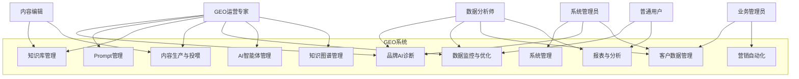

# 6. 用例分析

> 本章以UML用例图+用例描述的形式，详细分析GEO系统的核心功能用例。

## 6.1 系统总体用例图

## 6.2 核心用例描述

### 6.2.1 UC01：品牌AI诊断

| 项目 | 内容 |
|------|------|
| **用例编号** | UC01 |
| **用例名称** | 品牌AI诊断 |
| **参与者** | GEO运营专家（主）、数据分析师（辅） |
| **前置条件** | 用户已登录系统，已配置品牌基础信息 |
| **后置条件** | 系统生成品牌AI诊断报告，数据存入历史记录 |
| **触发条件** | 用户点击"新建诊断"按钮 |

**主流程（基本流）**：

| 步骤 | 参与者 | 系统 |
|------|--------|------|
| 1 | 点击"新建诊断" | — |
| 2 | — | 打开诊断配置页面 |
| 3 | 选择诊断范围（AI平台、关键词、竞品） | — |
| 4 | — | 校验配置有效性 |
| 5 | 点击"开始诊断" | — |
| 6 | — | 系统异步执行诊断任务 |
| 7 | — | 采集各AI平台数据 |
| 8 | — | 执行语义分析和评分计算 |
| 9 | — | 生成品牌影响力报告 |
| 10 | 收到诊断完成通知 | — |
| 11 | 查看诊断报告 | — |
| 12 | — | 展示多维度评分和可视化图表 |
| 13 | 导出报告（可选） | — |
| 14 | — | 生成Excel/PDF报告文件 |

**备选流程（替代流）**：

| 编号 | 条件 | 处理 |
|------|------|------|
| 3a | 未选择任何AI平台 | 系统提示"请至少选择一个AI平台"，阻止提交 |
| 6a | 诊断任务超时（>30分钟） | 系统标记任务为"超时"，提示用户稍后查看 |
| 7a | 某AI平台API不可用 | 系统跳过该平台，在报告中标记"数据缺失" |
| 11a | 诊断结果异常 | 系统提示"诊断结果异常，建议重新诊断" |

**业务规则**：
- 诊断任务支持14个主流AI平台
- 诊断报告包含曝光度、语义占位、竞争优势三个维度评分
- 诊断历史数据保留≥180天
- 单次诊断最多支持5个竞品对比

---

### 6.2.2 UC02：Prompt智能生成与测试

| 项目 | 内容 |
|------|------|
| **用例编号** | UC02 |
| **用例名称** | Prompt智能生成与测试 |
| **参与者** | GEO运营专家 |
| **前置条件** | 用户已登录系统，品牌知识库已构建 |
| **后置条件** | 系统生成高权重Prompt，测试结果存入Prompt库 |
| **触发条件** | 用户点击"新建Prompt"按钮 |

**主流程（基本流）**：

| 步骤 | 参与者 | 系统 |
|------|--------|------|
| 1 | 点击"新建Prompt" | — |
| 2 | — | 打开Prompt创建页面 |
| 3 | 选择生成方式（AI生成/模板选择/手动创建） | — |
| 4 | — | 根据选择展示对应界面 |
| 5 | 输入品牌信息和目标AI平台 | — |
| 6 | — | 校验输入有效性 |
| 7 | 点击"生成Prompt" | — |
| 8 | — | 系统基于品牌语义和AI逻辑生成Prompt |
| 9 | 审核Prompt内容 | — |
| 10 | — | 展示Prompt预览 |
| 11 | 点击"效果测试" | — |
| 12 | — | 打开测试配置页面 |
| 13 | 配置A/B测试方案 | — |
| 14 | — | 系统执行A/B测试 |
| 15 | — | 对比AI引用提升效果 |
| 16 | 查看测试结果 | — |
| 17 | — | 展示测试报告和效果对比 |
| 18 | 点击"发布" | — |
| 19 | — | Prompt进入Prompt库 |

**备选流程（替代流）**：

| 编号 | 条件 | 处理 |
|------|------|------|
| 8a | AI生成Prompt质量评分<70分 | 系统提示"生成质量较低，建议调整输入条件后重新生成" |
| 14a | A/B测试样本量不足 | 系统提示"样本量不足，建议延长测试周期或扩大测试范围" |
| 15a | 测试效果为负（引用率下降） | 系统告警"测试效果为负，建议优化Prompt后重新测试" |
| 18a | Prompt与已有Prompt重复 | 系统提示"检测到相似Prompt，建议合并或差异化" |

**业务规则**：
- AI生成的Prompt需经过人工审核才能发布
- A/B测试最小样本量为100次搜索请求
- Prompt库支持版本管理，最多保留20个历史版本
- Prompt发布后自动进入效果监控

---

### 6.2.3 UC03：知识库构建与管理

| 项目 | 内容 |
|------|------|
| **用例编号** | UC03 |
| **用例名称** | 知识库构建与管理 |
| **参与者** | GEO运营专家（主）、内容编辑（辅）、专家认证人员（辅） |
| **前置条件** | 用户已登录系统，具备知识库管理权限 |
| **后置条件** | 知识库构建完成，知识条目可检索和引用 |
| **触发条件** | 用户点击"新建知识库"或"导入文档" |

**主流程（基本流）**：

| 步骤 | 参与者 | 系统 |
|------|--------|------|
| 1 | 点击"新建知识库" | — |
| 2 | — | 打开知识库创建页面 |
| 3 | 配置知识库基本信息（名称、分类、权限） | — |
| 4 | — | 创建知识库 |
| 5 | 点击"导入文档" | — |
| 6 | — | 打开文件上传页面 |
| 7 | 选择文件（PDF/Word/Excel/PPT） | — |
| 8 | — | 校验文件格式和大小 |
| 9 | — | 系统异步解析文档 |
| 10 | — | 自动提取实体、关系和关键信息 |
| 11 | — | 生成结构化知识条目 |
| 12 | 审核知识条目 | — |
| 13 | — | 展示知识条目列表 |
| 14 | 专家认证人员进行权威认证 | — |
| 15 | — | 标记权威认证标识 |
| 16 | 点击"发布" | — |
| 17 | — | 知识库上线，AI可引用 |

**备选流程（替代流）**：

| 编号 | 条件 | 处理 |
|------|------|------|
| 8a | 文件格式不支持 | 系统提示"不支持的文件格式，请上传PDF/Word/Excel/PPT文件" |
| 8b | 文件超过100MB | 系统提示"文件过大，请上传100MB以内的文件" |
| 9a | 文档解析失败 | 系统标记为"待人工处理"，支持手动录入 |
| 10a | 知识提取准确率<80% | 系统提示"提取准确率较低，建议人工审核" |
| 14a | 知识条目与已有知识冲突 | 系统提示冲突，支持人工仲裁 |

**业务规则**：
- 单文件最大支持100MB，批量导入最大1GB
- 知识库权限管控到单个知识单位
- 知识条目支持版本管理和审批流
- 专家认证内容在搜索中优先展示

---

### 6.2.4 UC04：内容生产与信源投喂

| 项目 | 内容 |
|------|------|
| **用例编号** | UC04 |
| **用例名称** | 内容生产与信源投喂 |
| **参与者** | 内容编辑（主）、GEO运营专家（辅） |
| **前置条件** | 用户已登录系统，知识库和Prompt库已构建 |
| **后置条件** | 内容生成并发布，效果数据可追踪 |
| **触发条件** | 用户点击"新建内容"或"批量生成" |

**主流程（基本流）**：

| 步骤 | 参与者 | 系统 |
|------|--------|------|
| 1 | 点击"新建内容" | — |
| 2 | — | 打开内容创建页面 |
| 3 | 选择目标AI平台和关键词 | — |
| 4 | — | 系统自动关联相关Prompt和知识库 |
| 5 | 点击"AI生成" | — |
| 6 | — | 系统基于E-E-A-T标准生成内容 |
| 7 | 审核生成内容 | — |
| 8 | — | 展示内容预览和E-E-A-T评分 |
| 9 | 配置信源矩阵 | — |
| 10 | — | 选择权威媒体和行业报告 |
| 11 | 点击"发布" | — |
| 12 | — | 内容发布到目标平台 |
| 13 | — | 系统开始追踪内容引用效果 |
| 14 | 查看效果数据 | — |
| 15 | — | 展示引用率、排名变化等指标 |

**备选流程（替代流）**：

| 编号 | 条件 | 处理 |
|------|------|------|
| 6a | E-E-A-T评分<70分 | 系统提示"内容质量较低，建议优化后重新生成" |
| 7a | 内容审核未通过 | 系统记录审核意见，支持修改后重新提交 |
| 11a | 内容发布失败 | 系统提示发布失败原因，支持重试 |
| 15a | 内容引用率持续下降 | 系统自动告警，推荐内容优化建议 |

---

### 6.2.5 UC05：数据监控与策略优化

| 项目 | 内容 |
|------|------|
| **用例编号** | UC05 |
| **用例名称** | 数据监控与策略优化 |
| **参与者** | 数据分析师（主）、GEO运营专家（辅） |
| **前置条件** | 用户已登录系统，已有GEO运营数据 |
| **后置条件** | 生成分析报告，优化策略被执行 |
| **触发条件** | 用户进入数据工作台或收到告警通知 |

**主流程（基本流）**：

| 步骤 | 参与者 | 系统 |
|------|--------|------|
| 1 | 进入数据工作台 | — |
| 2 | — | 展示多AI平台数据看板 |
| 3 | 选择分析维度和时间范围 | — |
| 4 | — | 系统聚合数据并展示 |
| 5 | 点击"钻取分析" | — |
| 6 | — | 展示详细数据 |
| 7 | 点击"ROI归因分析" | — |
| 8 | — | 执行归因计算 |
| 9 | — | 展示归因结果 |
| 10 | 查看策略推荐 | — |
| 11 | — | 系统展示优化策略建议 |
| 12 | GEO运营专家执行优化策略 | — |
| 13 | — | 系统记录策略执行日志 |

---

### 6.2.6 UC06：AI智能体构建

| 项目 | 内容 |
|------|------|
| **用例编号** | UC06 |
| **用例名称** | AI智能体构建 |
| **参与者** | GEO运营专家（主）、系统管理员（辅） |
| **前置条件** | 用户已登录系统，具备Agent管理权限 |
| **后置条件** | Agent构建完成并发布，可执行自动化任务 |
| **触发条件** | 用户点击"新建Agent" |

**主流程（基本流）**：

| 步骤 | 参与者 | 系统 |
|------|--------|------|
| 1 | 点击"新建Agent" | — |
| 2 | — | 打开Agent构建页面 |
| 3 | 选择构建方式（自然语言/模板） | — |
| 4 | — | 展示对应构建界面 |
| 5 | 描述Agent角色和能力 | — |
| 6 | — | 系统解析并生成Agent配置 |
| 7 | 配置关联资源（知识库/Prompt/工具） | — |
| 8 | — | 校验资源配置有效性 |
| 9 | 点击"测试" | — |
| 10 | — | 执行Agent测试任务 |
| 11 | 查看测试结果 | — |
| 12 | — | 展示执行日志和结果 |
| 13 | 点击"发布" | — |
| 14 | — | Agent上线运行 |
