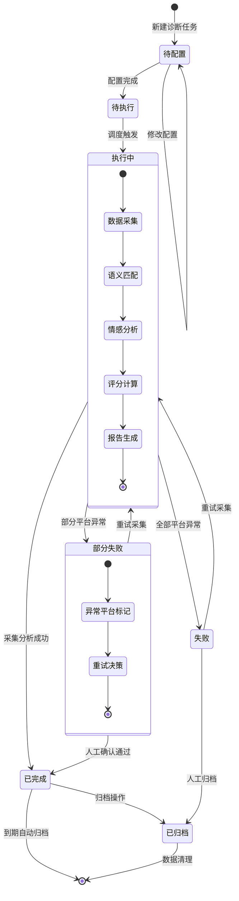

# 模块一：AI认知诊断与算法监测（M01）

> **模块定位**：GEO系统的"感知层"——作为整个GEO平台的前置智能引擎，负责实时监测各大AI平台对品牌/产品的认知状态，诊断算法推荐逻辑，为后续内容优化、知识库构建提供数据基础和决策依据。
>
> **竞品参考**：品牌AI诊断引擎（Brand AI Diagnostic Engine）——能够追踪品牌在ChatGPT、Perplexity、Google AI Overviews等主流AI平台中的可见度、引用率和情感倾向，提供跨平台的AI认知健康度评分。本模块在此基础上，进一步扩展了国内主流AI平台（豆包、Kimi、DeepSeek、文心一言、通义千问等）的覆盖，并增加了算法变更监测和竞品对比分析能力。
>
> **优先级**：P0（核心基础模块，其他模块依赖本模块的输出数据）

---

## 7.1 功能清单

| 编号 | 功能名称 | 优先级 | 描述 |
|------|----------|--------|------|
| M01-F01 | AI平台账号接入 | P0 | 支持接入14个主流AI平台的API/数据源，完成OAuth2.0认证或API Key配置，建立安全连接通道 |
| M01-F02 | 品牌认知度诊断 | P0 | 监测品牌在各大AI平台中的提及率、排名位置、引用频次，生成品牌AI认知度综合评分（0-100分） |
| M01-F03 | 算法推荐逻辑分析 | P0 | 通过逆向分析AI平台的回答内容，推断其推荐算法的权重因子（权威性、时效性、相关性、地域性等），生成算法画像 |
| M01-F04 | 竞品AI认知对比 | P1 | 支持选择1-5个竞品品牌，横向对比各品牌在AI平台中的认知度、可见度、情感倾向等维度的差异 |
| M01-F05 | 算法变更监测 | P0 | 持续监测AI平台算法更新，当检测到排名/推荐结果发生显著波动（变化幅度>10%）时自动触发告警通知 |
| M01-F06 | 语义关联分析 | P1 | 分析AI平台回答中与品牌相关的语义关联词、上下文语境、实体识别结果，构建品牌语义知识图谱 |
| M01-F07 | 情感倾向分析 | P1 | 对AI平台回答中涉及品牌的内容进行情感分析（正面/负面/中性），计算品牌情感得分和趋势变化 |
| M01-F08 | 诊断报告生成 | P0 | 基于采集数据自动生成结构化诊断报告，包含概览仪表盘、趋势图表、问题诊断、优化建议等模块 |
| M01-F09 | 数据采集调度 | P0 | 支持定时/实时/触发式三种数据采集模式，可配置采集频率、采集时段、并发数等参数 |
| M01-F10 | 诊断评分模型 | P0 | 内置多维度加权评分模型，综合品牌可见度、引用质量、情感倾向、竞品差距等因子计算AI认知健康度指数 |
| M01-F11 | 告警通知中心 | P1 | 支持多级告警（信息/警告/严重/紧急），可通过站内消息、邮件、企业微信/钉钉等渠道推送告警通知 |
| M01-F12 | 历史数据回溯 | P2 | 支持查询历史诊断数据（最长365天），提供时间维度对比分析，支持数据导出（CSV/Excel/PDF） |

---

## 7.2 状态流转图



---

## 7.3 页面布局

```
┌─────────────────────────────────────────────────────────────────────┐
│  GEO系统 > AI认知诊断与算法监测                        [用户头像 ▼]  │
├──────────┬──────────────────────────────────────────────────────────┤
│          │                                                          │
│  导航栏   │  ┌──────────────────────────────────────────────────┐   │
│          │  │  📊 诊断概览仪表盘                                │   │
│ ◉ 概览   │  │  ┌────────┐ ┌────────┐ ┌────────┐ ┌────────┐   │   │
│ ○ 诊断   │  │  │AI认知  │ │情感得分│ │竞品差距│ │算法变更│   │   │
│ ○ 报告   │  │  │  78分  │ │  +0.62 │ │  -12%  │ │  3次   │   │   │
│ ○ 告警   │  │  └────────┘ └────────┘ └────────┘ └────────┘   │   │
│ ○ 配置   │  └──────────────────────────────────────────────────┘   │
│ ○ 历史   │                                                          │
│          │  ┌──────────────────────────────────────────────────┐   │
│          │  │  📈 品牌AI认知度趋势（近30天）                    │   │
│          │  │  ┌────────────────────────────────────────────┐  │   │
│          │  │  │    📉 折线图区域                            │  │   │
│          │  │  │                                            │  │   │
│          │  │  │  70├───────────────────────────────        │  │   │
│          │  │  │    │     ╱╲      ╱╲                        │  │   │
│          │  │  │  60├────╱──╲────╱──╲──────────────────    │  │   │
│          │  │  │    │   ╱    ╲  ╱    ╲                     │  │   │
│          │  │  │  50├──╱──────╲╱──────╲────────────────    │  │   │
│          │  │  │    │ ╱                  ╲                 │  │   │
│          │  │  │  40├╱────────────────────╲────────────    │  │   │
│          │  │  │    1/1    1/8    1/15   1/22   1/30      │  │   │
│          │  │  └────────────────────────────────────────────┘  │   │
│          │  └──────────────────────────────────────────────────┘   │
│          │                                                          │
│          │  ┌─────────────────────┬───────────────────────────┐   │
│          │  │  🏢 各平台认知度    │  ⚠️ 最近告警              │   │
│          │  │  ┌───────────────┐  │  ┌─────────────────────┐  │   │
│          │  │  │ ChatGPT    82 │  │  │ 🔴 2026-06-20       │  │   │
│          │  │  │ Perplexity 75 │  │  │ Claude算法变更       │  │   │
│          │  │  │ Claude     68 │  │  │ 品牌排名下降3位      │  │   │
│          │  │  │ Gemini     71 │  │  ├─────────────────────┤  │   │
│          │  │  │ 豆包       80 │  │  │ 🟡 2026-06-18       │  │   │
│          │  │  │ Kimi       73 │  │  │ 豆包情感得分下降     │  │   │
│          │  │  │ DeepSeek   65 │  │  │ 超过阈值-15%         │  │   │
│          │  │  │ ...        │  │  │  │                     │  │   │
│          │  │  └───────────────┘  │  └─────────────────────┘  │   │
│          │  └─────────────────────┴───────────────────────────┘   │
│          │                                                          │
└──────────┴──────────────────────────────────────────────────────────┘
```

---

## 7.4 交互说明

| 操作 | 触发条件 | 系统响应 | 备注 |
|------|----------|----------|------|
| 新建诊断任务 | 点击"新建诊断"按钮 | 弹出配置向导，引导选择品牌关键词、目标AI平台、采集模式 | 支持保存为模板 |
| 执行诊断 | 点击"立即执行"或定时调度触发 | 进入执行状态，实时展示各平台采集进度和中间结果 | 支持暂停/恢复 |
| 查看报告 | 诊断任务完成后点击"查看报告" | 跳转报告详情页，展示完整诊断报告 | 支持在线预览和下载 |
| 配置告警规则 | 进入告警配置页面 | 支持配置告警阈值、通知渠道、通知频率 | 支持批量配置 |
| 竞品对比 | 在诊断报告中点击"添加竞品" | 弹出竞品选择框，支持搜索和批量添加 | 最多5个竞品 |
| 数据导出 | 点击"导出"按钮 | 弹出导出选项（格式/时间范围/数据维度），生成文件后下载 | 支持CSV/Excel/PDF |
| 重试采集 | 部分失败状态下点击"重试" | 仅对失败的平台重新执行采集，保留已成功的数据 | 最多重试3次 |
| 算法变更详情 | 点击告警中的算法变更记录 | 展示变更前后对比（排名变化、内容差异、影响评估） | 支持diff视图 |

---

## 7.5 错误处理规范

| 错误场景 | 错误码 | 处理策略 | 用户提示 |
|----------|--------|----------|----------|
| AI平台API认证失败 | M01-E001 | 自动重试1次，失败后暂停任务并触发告警 | "平台{platform}认证失败，请检查API配置" |
| AI平台API限流 | M01-E002 | 自动退避重试（指数退避，最多3次），超过后标记该平台为失败 | "平台{platform}请求频率限制，正在自动重试" |
| AI平台API响应超时 | M01-E003 | 超时30秒后重试，累计3次超时标记该平台为失败 | "平台{platform}响应超时，已跳过并记录" |
| 数据采集不完整 | M01-E004 | 记录缺失数据项，在报告中标记数据完整度百分比 | "本次采集数据完整度为{percent}%，部分平台数据缺失" |
| 语义匹配引擎异常 | M01-E005 | 切换备用匹配引擎，触发系统告警 | "语义分析引擎异常，已切换备用引擎" |
| 评分模型计算异常 | M01-E006 | 使用最近一次有效评分，标记当前数据为"待校准" | "评分计算异常，显示上次有效评分" |
| 报告生成失败 | M01-E007 | 保存原始数据，支持手动重新生成报告 | "报告生成失败，原始数据已保存，请手动重试" |
| 存储空间不足 | M01-E008 | 触发数据清理策略（归档30天前数据），通知管理员 | "存储空间不足，已自动归档历史数据" |
| 并发任务超限 | M01-E009 | 排队等待，超出队列上限后拒绝新任务 | "当前并发任务已达上限（{max}），请稍后重试" |

---

## 7.6 技术规格

### 7.6.1 AI平台对接清单（14个）

| 序号 | 平台名称 | 对接方式 | 认证方式 | 采集频率上限 | 数据内容 |
|------|----------|----------|----------|-------------|----------|
| 1 | ChatGPT | 官方API | API Key | 100次/分钟 | 回答内容、引用来源、排名 |
| 2 | Perplexity | 官方API | API Key | 60次/分钟 | 回答内容、引用来源、相关搜索 |
| 3 | Claude | 官方API | API Key | 50次/分钟 | 回答内容、引用来源 |
| 4 | Gemini | 官方API | API Key | 60次/分钟 | 回答内容、引用来源、AI概览 |
| 5 | Google AI Overviews | 爬虫+API | OAuth2.0 | 30次/分钟 | AI概览内容、引用来源、排名 |
| 6 | 豆包 | 官方API | API Key | 50次/分钟 | 回答内容、引用来源 |
| 7 | Kimi | 官方API | API Key | 50次/分钟 | 回答内容、引用来源、相关搜索 |
| 8 | DeepSeek | 官方API | API Key | 50次/分钟 | 回答内容、引用来源 |
| 9 | 文心一言 | 官方API | OAuth2.0 | 50次/分钟 | 回答内容、引用来源 |
| 10 | 通义千问 | 官方API | API Key | 50次/分钟 | 回答内容、引用来源 |
| 11 | 智谱 | 官方API | API Key | 30次/分钟 | 回答内容、引用来源 |
| 12 | 讯飞星火 | 官方API | API Key | 30次/分钟 | 回答内容、引用来源 |
| 13 | 腾讯混元 | 官方API | API Key | 30次/分钟 | 回答内容、引用来源 |
| 14 | 其他 | 自定义配置 | 可配置 | 可配置 | 可配置 |

### 7.6.2 诊断引擎核心算法

**AI认知健康度评分模型（GeoScore）**：

```
GeoScore = W1×V_score + W2×Q_score + W3×S_score + W4×C_score + W5×T_score

其中：
- V_score（可见度得分，权重W1=0.30）：品牌在AI平台回答中的提及率和排名位置
- Q_score（引用质量得分，权重W2=0.25）：品牌内容被AI引用的频次和引用来源权威性
- S_score（情感得分，权重W3=0.20）：品牌相关回答的情感倾向综合评分
- C_score（竞品对比得分，权重W4=0.15）：相对于竞品的AI认知优势/劣势
- T_score（时效性得分，权重W5=0.10）：品牌内容在AI回答中的新鲜度

各子得分归一化至0-100分，最终GeoScore范围为0-100分
```

**算法变更检测算法**：

```
变更检测 = Σ(ΔRank_i × P_i) / ΣP_i

其中：
- ΔRank_i：第i个关键词的排名变化量
- P_i：第i个关键词的搜索热度权重
- 当变更检测值 > 阈值θ（默认10%）时，触发算法变更告警
```

### 7.6.3 数据采集策略

| 采集模式 | 说明 | 适用场景 | 配置参数 |
|----------|------|----------|----------|
| 定时采集 | 按固定周期自动执行 | 日常监测 | 频率（每小时/每天/每周）、时段 |
| 实时采集 | 持续监听AI平台变化 | 重要活动/危机公关 | 关键词列表、监测平台 |
| 触发式采集 | 满足条件时自动启动 | 告警后深度分析 | 触发条件、采集深度 |
| 手动采集 | 用户手动触发 | 临时需求 | 采集范围、平台选择 |

### 7.6.4 评分模型权重

| 评分维度 | 权重 | 计算方式 | 数据来源 |
|----------|------|----------|----------|
| 可见度（V） | 30% | 提及率×0.6 + 排名得分×0.4 | AI平台搜索结果 |
| 引用质量（Q） | 25% | 引用频次×0.5 + 来源权威度×0.5 | AI平台引用数据 |
| 情感倾向（S） | 20% | 正面占比×1.0 - 负面占比×0.5 | NLP情感分析 |
| 竞品对比（C） | 15% | (品牌得分 - 竞品平均分) / 竞品平均分 × 100 | 竞品诊断数据 |
| 时效性（T） | 10% | 近30天内容占比×0.7 + 近7天内容占比×0.3 | 内容时间戳 |

### 7.6.5 报告模板

```
诊断报告结构：
├── 1. 执行摘要
│   ├── 1.1 诊断概览（时间范围、覆盖平台数、关键词数）
│   ├── 1.2 核心发现（Top 3亮点 + Top 3风险）
│   └── 1.3 GeoScore总览及变化趋势
├── 2. 品牌AI认知度分析
│   ├── 2.1 各平台认知度评分
│   ├── 2.2 认知度趋势图（30/90/365天）
│   └── 2.3 关键词排名分布
├── 3. 算法推荐逻辑分析
│   ├── 3.1 各平台算法画像
│   ├── 3.2 算法变更记录
│   └── 3.3 推荐因子权重推断
├── 4. 竞品对比分析
│   ├── 4.1 竞品认知度对比
│   ├── 4.2 优劣势矩阵
│   └── 4.3 差距变化趋势
├── 5. 情感倾向分析
│   ├── 5.1 整体情感得分
│   ├── 5.2 各平台情感分布
│   └── 5.3 情感关键词云
├── 6. 优化建议
│   ├── 6.1 内容优化建议
│   ├── 6.2 平台优先级建议
│   └── 6.3 知识库补充建议
└── 7. 附录
    ├── 7.1 原始数据摘要
    ├── 7.2 采集日志
    └── 7.3 术语表
```

### 7.6.6 伪API

```
POST /api/v1/diagnosis/task/create
请求体：
{
  "brandName": "品牌名称",
  "keywords": ["关键词1", "关键词2"],
  "platforms": ["ChatGPT", "Claude", "Gemini"],
  "mode": "scheduled|realtime|triggered|manual",
  "scheduleConfig": {
    "frequency": "daily",
    "time": "02:00",
    "timezone": "Asia/Shanghai"
  }
}
响应：
{
  "taskId": "diag_20260622_001",
  "status": "pending",
  "estimatedDuration": "15min",
  "createdAt": "2026-06-22T10:00:00Z"
}

GET /api/v1/diagnosis/task/{taskId}/status
响应：
{
  "taskId": "diag_20260622_001",
  "status": "executing|completed|failed|partial_failed",
  "progress": 0.75,
  "platformStatus": {
    "ChatGPT": "completed",
    "Claude": "completed",
    "Gemini": "executing"
  }
}

GET /api/v1/diagnosis/report/{taskId}
响应：
{
  "taskId": "diag_20260622_001",
  "geoScore": 78,
  "trend": "+5.2",
  "sections": [...],
  "generatedAt": "2026-06-22T10:15:00Z"
}

GET /api/v1/diagnosis/alerts?status=open&limit=20
响应：
{
  "total": 3,
  "alerts": [
    {
      "alertId": "alt_001",
      "level": "critical",
      "type": "algorithm_change",
      "platform": "Claude",
      "description": "Claude算法变更导致品牌排名下降3位",
      "createdAt": "2026-06-20T08:30:00Z"
    }
  ]
}
```

---

## 7.7 验收标准

| 编号 | 验收项 | 验收标准 | 验证方法 |
|------|--------|----------|----------|
| AC-M01-01 | AI平台接入 | 成功对接全部14个AI平台，认证通过率100% | 逐一验证各平台连接状态 |
| AC-M01-02 | 数据采集 | 单次诊断任务数据采集成功率≥95%，采集完整度≥90% | 执行10次诊断任务，统计成功率和完整度 |
| AC-M01-03 | 品牌认知度诊断 | 品牌认知度评分与人工验证结果偏差≤5% | 人工抽样验证，对比系统评分 |
| AC-M01-04 | 算法变更监测 | 算法变更检测准确率≥90%，误报率≤10% | 使用历史已知算法变更事件回测 |
| AC-M01-05 | 竞品对比 | 竞品对比数据与独立采集数据一致率≥95% | 交叉验证竞品数据 |
| AC-M01-06 | 报告生成 | 报告生成成功率≥99%，内容完整度100% | 批量生成100份报告验证 |
| AC-M01-07 | 采集性能 | 单次诊断任务（14平台）完成时间≤15分钟 | 计时测试 |
| AC-M01-08 | 告警通知 | 告警触发后30秒内送达通知渠道，漏报率≤1% | 模拟告警触发测试 |
| AC-M01-09 | 历史数据 | 支持365天历史数据查询，查询响应时间≤2秒 | 边界值测试 |
| AC-M01-10 | 并发能力 | 支持≥50个并发诊断任务，系统资源使用率≤80% | 压力测试 |
