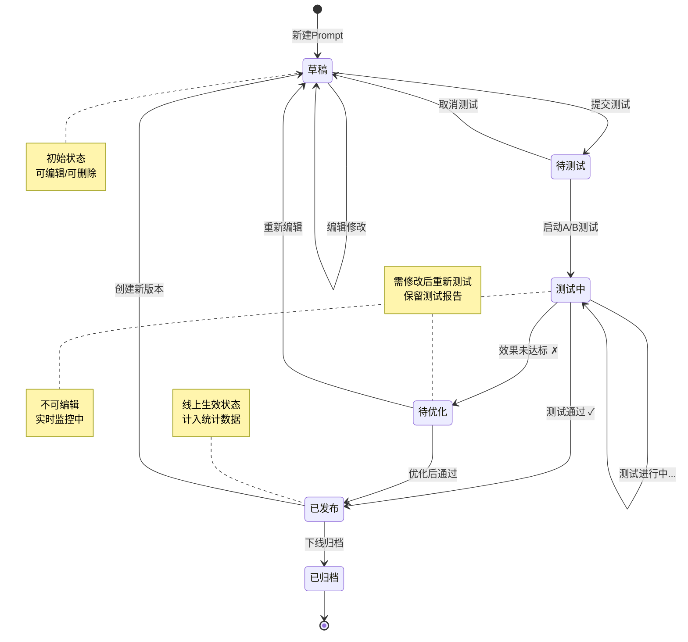

# M02 模块二：语义工程逆向解析与Prompt管理

> **模块定位**：GEO系统的"策略层"，负责逆向解析AI回答逻辑，构建和管理高权重Prompt指令库，是T-GEO五层干预架构的核心调度中枢。
>
> **竞品参考**：高权重Prompt库 + 五层干预架构
>
> **优先级**：P0
>
> **文档版本**：v1.0
>
> **最后更新**：2026-06-22

---

## 8.1 功能清单

| 编号 | 功能名称 | 优先级 | 功能描述 | 依赖模块 |
|------|----------|--------|----------|----------|
| M02-F01 | Prompt库管理 | P0 | 创建、编辑、分类、标签化管理Prompt指令，支持多维度检索与批量操作 | M01 |
| M02-F02 | AI回答逻辑解析 | P0 | 逆向分析AI搜索引擎的回答逻辑，提取关键语义节点与引用权重因子 | M01, M03 |
| M02-F03 | Prompt智能生成 | P0 | 基于AI回答逻辑解析结果，自动生成高权重Prompt指令，支持人工微调 | M02-F02 |
| M02-F04 | Prompt效果测试 | P0 | 通过A/B测试验证Prompt指令的实际效果，输出量化评估报告 | M02-F01, M02-F03 |
| M02-F05 | 语义对齐引擎 | P1 | 将品牌语义空间与AI语义空间进行对齐，确保Prompt指令与品牌调性一致 | M02-F01 |
| M02-F06 | 意图节点管理 | P1 | 管理AI搜索意图节点库，维护意图分类体系与节点权重 | M02-F02 |
| M02-F07 | Prompt版本管理 | P1 | Prompt指令的版本控制，支持回滚、对比、分支管理 | M02-F01 |
| M02-F08 | Prompt模板市场 | P2 | 行业Prompt模板市场，支持模板分享、导入、评分与评论 | M02-F01 |
| M02-F09 | 五层干预架构配置 | P1 | T-GEO五层干预架构（诊断→语义→知识→内容→优化）的策略配置与调度 | M02-F01~F06 |
| M02-F10 | Prompt使用统计 | P1 | Prompt指令的使用频次、效果评分、ROI等统计数据的可视化展示 | M02-F04 |

---

## 8.2 状态流转图



### 状态说明

| 状态 | 说明 | 可执行操作 |
|------|------|-----------|
| 草稿 | Prompt初始创建状态，尚未进入测试流程 | 编辑、删除、提交测试 |
| 待测试 | 已提交测试申请，等待测试启动 | 取消测试、启动测试 |
| 测试中 | A/B测试正在执行，实时监控效果数据 | 查看实时数据、终止测试 |
| 已发布 | 测试通过，Prompt指令线上生效 | 查看统计、创建新版本、下线 |
| 待优化 | 测试效果未达预期，需修改后重新测试 | 查看报告、重新编辑 |
| 已归档 | 已下线的Prompt指令，保留历史记录 | 查看历史、恢复上线 |

---

## 8.3 页面布局

```
┌─────────────────────────────────────────────────────────────────────┐
│  GEO语义工程平台                    [搜索框...]  [通知]  [用户头像]  │
├──────────┬──────────────────────────────────────────────────────────┤
│          │                                                          │
│  导航栏   │  ┌────────────────────────────────────────────────────┐ │
│          │  │  📊 概览卡片区                                       │ │
│  📋 Prompt库  │  │  ┌──────────┐ ┌──────────┐ ┌──────────┐ ┌──────────┐ │
│  🔍 AI解析  │  │  │ 总Prompt  │ │ 已发布   │ │ 测试中   │ │ 本月新增 │ │
│  ✨ 智能生成 │  │  │   1,234  │ │   856    │ │   23     │ │   128    │ │
│  🧪 效果测试 │  │  └──────────┘ └──────────┘ └──────────┘ └──────────┘ │
│  🎯 语义对齐 │  └────────────────────────────────────────────────────┘ │
│  🔗 意图节点 │                                                          │
│  📝 版本管理 │  ┌────────────────────────────────────────────────────┐ │
│  🏪 模板市场 │  │  🔍 筛选栏: [分类▼] [标签▼] [状态▼] [时间范围▼]    │ │
│  ⚙️ 架构配置 │  │  [+ 新建Prompt]  [🤖 AI生成]  [📥 批量导入]        │ │
│  📈 使用统计 │  ├────────────────────────────────────────────────────┤ │
│          │  │  Prompt列表                                           │ │
│          │  │  ┌──────────────────────────────────────────────────┐ │ │
│          │  │  │ ☑ │ 品牌核心Prompt-001  │ 已发布 │ 效果+12.3%  │ │ │
│          │  │  │   │ 标签:#品牌 #核心   │ 更新:2026-06-20      │ │ │
│          │  │  ├──────────────────────────────────────────────────┤ │ │
│          │  │  │ ☑ │ 产品卖点Prompt-003  │ 测试中 │ 效果+5.6%   │ │ │
│          │  │  │   │ 标签:#产品 #卖点   │ 更新:2026-06-21      │ │ │
│          │  │  ├──────────────────────────────────────────────────┤ │ │
│          │  │  │ ☑ │ 行业关键词Prompt-007│ 草稿  │ 效果--       │ │ │
│          │  │  │   │ 标签:#行业 #关键词  │ 更新:2026-06-22      │ │ │
│          │  │  └──────────────────────────────────────────────────┘ │ │
│          │  │  [◀ 上一页]  第1页/共42页  [下一页 ▶]                  │ │
│          │  └────────────────────────────────────────────────────┘ │
└──────────┴──────────────────────────────────────────────────────────┘
```

### Prompt详情页布局

```
┌─────────────────────────────────────────────────────────────────────┐
│  ← 返回列表    品牌核心Prompt-001              [编辑] [复制] [删除]  │
├─────────────────────────────────────────────────────────────────────┤
│  ┌──────────────────────────────┐  ┌──────────────────────────────┐ │
│  │  📋 Prompt内容               │  │  📊 效果数据                  │ │
│  │                              │  │                              │ │
│  │  名称: 品牌核心Prompt-001    │  │  引用率: ████████░░ 82.3%   │ │
│  │  分类: 品牌策略              │  │  点击率: ██████░░░░ 65.7%   │ │
│  │  标签: #品牌 #核心 #高权重   │  │  转化率: ████░░░░░░ 43.2%   │ │
│  │  状态: ✅ 已发布              │  │  ROI:   █████████░ 91.5%   │ │
│  │  版本: v3.2                  │  │                              │ │
│  │  创建: 2026-06-01            │  │  [查看详细报告 →]            │ │
│  │  更新: 2026-06-20            │  │                              │ │
│  │                              │  ├──────────────────────────────┤ │
│  │  ─── Prompt正文 ───          │  │  🔗 关联信息                  │ │
│  │                              │  │                              │ │
│  │  [Prompt内容编辑区域]        │  │  关联意图节点: 3个           │ │
│  │                              │  │  关联知识条目: 12个          │ │
│  │  [变量: {{brand_name}}]      │  │  关联内容资产: 8个           │ │
│  │  [变量: {{product_line}}]    │  │                              │ │
│  │                              │  ├──────────────────────────────┤ │
│  │  ─── 预期输出示例 ───        │  │  📝 版本历史                  │ │
│  │                              │  │                              │ │
│  │  [AI回答预览区域]            │  │  v3.2 (当前) - 2026-06-20   │ │
│  │                              │  │  v3.1 - 2026-06-15          │ │
│  │                              │  │  v3.0 - 2026-06-10          │ │
│  │                              │  │  [查看全部版本 →]            │ │
│  └──────────────────────────────┘  └──────────────────────────────┘ │
└─────────────────────────────────────────────────────────────────────┘
```

---

## 8.4 交互说明

| 交互场景 | 触发条件 | 系统行为 | 用户反馈 |
|----------|----------|----------|----------|
| **新建Prompt** | 点击"新建Prompt"按钮 | 弹出新建表单，包含名称、分类、标签、Prompt正文、变量定义等字段 | 创建成功提示，跳转至编辑页 |
| **AI生成** | 点击"AI生成"按钮 | 调用AI回答逻辑解析引擎，基于选定意图节点自动生成Prompt候选列表 | 展示3-5个候选Prompt，用户可选择或调整 |
| **效果测试** | 点击"提交测试"按钮 | 启动A/B测试流程，自动分配流量，实时监控效果指标 | 测试状态实时更新，完成后推送通知 |
| **发布** | 测试通过后点击"发布" | Prompt状态变更为"已发布"，同步至线上生效，触发统计计数 | 发布成功提示，列表状态实时更新 |
| **编辑** | 点击"编辑"按钮 | 进入编辑模式，已发布Prompt创建新版本草稿，草稿状态直接编辑 | 编辑区域高亮，保存后提示结果 |
| **删除** | 点击"删除"按钮 | 二次确认弹窗，已发布Prompt需先下线才能删除，草稿直接删除 | 删除成功提示，列表自动刷新 |

### 详细交互流程

#### 新建Prompt流程

```
用户点击"新建Prompt"
    │
    ▼
弹出新建表单
    │
    ├── 填写基本信息（名称、分类、标签）
    ├── 编写Prompt正文（支持变量语法 {{var}}）
    ├── 定义预期输出示例
    └── 选择关联意图节点
    │
    ▼
[保存草稿] ──→ 状态：草稿 ──→ 返回列表
    │
    ▼
[提交测试] ──→ 状态：待测试 ──→ 进入测试队列
```

#### AI生成流程

```
用户点击"AI生成"
    │
    ▼
选择目标意图节点（可多选）
    │
    ▼
系统调用AI回答逻辑解析引擎
    │
    ├── 分析目标AI搜索引擎的回答模式
    ├── 提取高权重语义因子
    ├── 匹配品牌语义空间
    └── 生成Prompt候选列表（3-5个）
    │
    ▼
展示候选列表（含预期效果评分）
    │
    ├── [选择并编辑] ──→ 进入编辑模式
    ├── [直接提交测试] ──→ 状态：待测试
    └── [重新生成] ──→ 重新调用引擎
```

---

## 8.5 错误处理规范

| 错误场景 | 错误码 | 触发条件 | 处理策略 | 用户提示 |
|----------|--------|----------|----------|----------|
| **AI生成失败** | M02-E001 | AI引擎返回异常或超时（>30s） | 自动重试1次，仍失败则降级为模板填充模式 | "AI生成服务暂时不可用，已切换为模板模式，请手动调整" |
| **测试超时** | M02-E002 | A/B测试超过预设时间（默认7天）仍未达到统计显著性 | 自动终止测试，输出当前数据报告，标记为"待优化" | "测试已超时，当前数据未达到统计显著性，建议调整Prompt后重新测试" |
| **测试效果为负** | M02-E003 | A/B测试结果显示实验组指标显著低于对照组（p<0.05） | 自动终止测试，回滚至对照组配置，标记Prompt为"待优化" | "测试效果为负（-X%），已自动回滚，请优化Prompt后重新提交" |
| **语义冲突** | M02-E004 | 新Prompt与已发布Prompt存在语义重叠或矛盾（相似度>85%） | 阻止发布，提示冲突Prompt列表，建议合并或修改 | "检测到与以下Prompt存在语义冲突：[列表]，请修改后重新提交" |
| **变量未定义** | M02-E005 | Prompt中包含未定义的变量引用 | 保存时校验，高亮未定义变量，阻止提交 | "Prompt中包含未定义变量：{{xxx}}，请定义后保存" |
| **版本冲突** | M02-E006 | 多人同时编辑同一Prompt的不同版本 | 乐观锁机制，后提交者提示版本冲突，需合并变更 | "Prompt已被其他用户修改，请刷新后重新编辑" |
| **模板解析失败** | M02-E007 | 模板引擎解析Prompt模板时语法错误 | 定位错误位置，提供语法修复建议 | "模板语法错误（行X）：[具体错误]，请修正后重试" |

---

## 8.6 技术规格

### 8.6.1 Prompt生成引擎架构

```
┌─────────────────────────────────────────────────────────────┐
│                    Prompt生成引擎架构                         │
├─────────────────────────────────────────────────────────────┤
│                                                             │
│  ┌───────────┐    ┌───────────────┐    ┌────────────────┐  │
│  │ 意图输入层 │───→│ 语义解析核心层 │───→│ Prompt构造输出层│  │
│  └───────────┘    └───────────────┘    └────────────────┘  │
│        │                  │                      │          │
│        ▼                  ▼                      ▼          │
│  ┌───────────┐    ┌───────────────┐    ┌────────────────┐  │
│  │ • 意图节点 │    │ • AI回答解析器 │    │ • 模板渲染器   │  │
│  │ • 品牌语义 │    │ • 权重计算器   │    │ • 变量注入器   │  │
│  │ • 关键词库 │    │ • 语义对齐器   │    │ • 效果预估器   │  │
│  │ • 行业数据 │    │ • 冲突检测器   │    │ • 候选排序器   │  │
│  └───────────┘    └───────────────┘    └────────────────┘  │
│                                                             │
│  ┌─────────────────────────────────────────────────────┐   │
│  │                   知识底座层                          │   │
│  │  ┌──────────┐ ┌──────────┐ ┌──────────┐ ┌────────┐ │   │
│  │  │ 品牌知识库│ │ 行业知识库│ │ AI行为库 │ │ 效果库 │ │   │
│  │  └──────────┘ └──────────┘ └──────────┘ └────────┘ │   │
│  └─────────────────────────────────────────────────────┘   │
└─────────────────────────────────────────────────────────────┘
```

**核心组件说明：**

| 组件 | 职责 | 技术实现 |
|------|------|----------|
| AI回答解析器 | 逆向解析AI搜索引擎的回答模式，提取语义权重因子 | 基于LLM的few-shot分析 + 统计权重模型 |
| 权重计算器 | 计算Prompt中各语义因子的相对权重 | TF-IDF + 语义相似度 + 历史效果加权 |
| 语义对齐器 | 将品牌语义映射到AI语义空间 | 向量空间映射 + 余弦相似度对齐 |
| 冲突检测器 | 检测新Prompt与已有Prompt的语义冲突 | 语义相似度 > 85% 触发冲突告警 |
| 效果预估器 | 预估Prompt的预期效果评分 | 基于历史数据的回归模型 |

### 8.6.2 A/B测试框架设计

```
┌─────────────────────────────────────────────────────────────┐
│                    A/B测试框架架构                            │
├─────────────────────────────────────────────────────────────┤
│                                                             │
│  ┌──────────┐   ┌──────────────┐   ┌───────────────────┐  │
│  │ 流量分配器 │──→│ 实验执行引擎  │──→│ 数据收集与分析器  │  │
│  └──────────┘   └──────────────┘   └───────────────────┘  │
│       │               │                     │              │
│       ▼               ▼                     ▼              │
│  ┌──────────┐   ┌──────────────┐   ┌───────────────────┐  │
│  │ • 随机分组│   │ • 实验组配置  │   │ • 实时指标采集    │  │
│  │ • 分层抽样│   │ • 对照组配置  │   │ • 统计显著性检验  │  │
│  │ • 流量配比│   │ • 变量控制    │   │ • 效果报告生成    │  │
│  │ • 排除规则│   │ • 时间窗口    │   │ • 置信区间计算    │  │
│  └──────────┘   └──────────────┘   └───────────────────┘  │
│                                                             │
│  测试参数配置：                                              │
│  ┌─────────────────────────────────────────────────────┐   │
│  │ 最小样本量: 1000/组    置信水平: 95%                │   │
│  │ 最大测试周期: 14天      最小可检测效应: 5%           │   │
│  │ 流量分配比例: 50:50    自动终止条件: 显著性达标/超时  │   │
│  └─────────────────────────────────────────────────────┘   │
└─────────────────────────────────────────────────────────────┘
```

**核心指标：**

| 指标名称 | 计算方式 | 目标值 | 权重 |
|----------|----------|--------|------|
| AI引用率 | 引用该Prompt对应内容的AI回答数 / 总AI回答数 | ≥60% | 40% |
| 品牌提及率 | 品牌被AI引用的次数 / 总引用次数 | ≥30% | 30% |
| 语义匹配度 | Prompt语义与AI回答语义的余弦相似度 | ≥0.85 | 20% |
| 转化提升率 | 实验组转化率 / 对照组转化率 - 1 | ≥10% | 10% |

### 8.6.3 语义对齐算法说明

**算法流程：**

```
输入: 品牌语义向量 B = [b1, b2, ..., bn]
      AI语义向量 A = [a1, a2, ..., am]
      对齐阈值 θ = 0.85

Step 1: 向量空间映射
    使用预训练映射矩阵 M 将品牌语义映射到AI语义空间:
    B' = M × B

Step 2: 相似度计算
    计算映射后品牌语义与AI语义的余弦相似度:
    sim(B', A) = (B' · A) / (||B'|| × ||A||)

Step 3: 对齐判定
    IF sim(B', A) ≥ θ:
        对齐成功，输出对齐后的Prompt语义
    ELSE:
        计算语义差距向量: Δ = A - B'
        生成对齐建议: 基于Δ调整Prompt关键词和语义结构
        输出对齐建议 + 调整后的Prompt候选

Step 4: 权重优化
    基于历史效果数据，使用梯度下降优化Prompt中各语义因子的权重:
    w_new = w_old - η × ∂Loss/∂w
    其中 Loss = 1 - sim(B', A) + λ × (1 - effect_score)
```

### 8.6.4 五层干预架构详细说明

```
┌─────────────────────────────────────────────────────────────────┐
│              T-GEO 五层干预架构 (Five-Layer Intervention)        │
├─────────────────────────────────────────────────────────────────┤
│                                                                 │
│  ┌───────────────────────────────────────────────────────────┐ │
│  │ 第5层: 优化层 (Optimization Layer)                         │ │
│  │ 职责: 基于效果反馈持续优化Prompt策略                         │ │
│  │ 功能: 自动调优、效果归因、策略迭代                           │ │
│  │ 输出: 优化建议、策略更新指令                                 │ │
│  └──────────────────────────┬────────────────────────────────┘ │
│                             │ 反馈数据                          │
│  ┌──────────────────────────▼────────────────────────────────┐ │
│  │ 第4层: 内容层 (Content Layer)                              │ │
│  │ 职责: 管理品牌内容资产，确保内容符合Prompt策略               │ │
│  │ 功能: 内容审核、内容优化、内容分发                           │ │
│  │ 输出: 优化后的内容资产、内容标签                             │ │
│  └──────────────────────────┬────────────────────────────────┘ │
│                             │ 内容策略                          │
│  ┌──────────────────────────▼────────────────────────────────┐ │
│  │ 第3层: 知识层 (Knowledge Layer)                            │ │
│  │ 职责: 构建和维护品牌知识图谱，支撑Prompt语义基础              │ │
│  │ 功能: 知识抽取、知识关联、知识更新                           │ │
│  │ 输出: 结构化知识库、语义关系图                               │ │
│  └──────────────────────────┬────────────────────────────────┘ │
│                             │ 知识支撑                          │
│  ┌──────────────────────────▼────────────────────────────────┐ │
│  │ 第2层: 语义层 (Semantic Layer) ← 本模块核心                │ │
│  │ 职责: 管理Prompt指令库，执行语义对齐与冲突检测                │ │
│  │ 功能: Prompt管理、语义对齐、意图节点管理                     │ │
│  │ 输出: 高权重Prompt指令、语义对齐报告                         │ │
│  └──────────────────────────┬────────────────────────────────┘ │
│                             │ 语义策略                          │
│  ┌──────────────────────────▼────────────────────────────────┐ │
│  │ 第1层: 诊断层 (Diagnostic Layer)                           │ │
│  │ 职责: 诊断品牌在AI搜索环境中的可见度与引用状况                │ │
│  │ 功能: AI引用监测、竞品分析、差距诊断                         │ │
│  │ 输出: 诊断报告、差距分析、优化方向                           │ │
│  └───────────────────────────────────────────────────────────┘ │
│                                                                 │
│  数据流向: 诊断层 → 语义层 → 知识层 → 内容层 → 优化层          │
│  反馈流向: 优化层 → 内容层 → 知识层 → 语义层 → 诊断层          │
└─────────────────────────────────────────────────────────────────┘
```

**各层详细职责：**

| 层级 | 名称 | 核心职责 | 关键输入 | 关键输出 | 更新频率 |
|------|------|----------|----------|----------|----------|
| L1 | 诊断层 | 品牌在AI搜索环境中的可见度诊断 | AI搜索引擎数据、竞品数据 | 诊断报告、差距分析、优化方向 | 每日 |
| L2 | 语义层 | Prompt指令管理与语义对齐 | 诊断报告、品牌语义数据 | 高权重Prompt指令、语义对齐报告 | 实时 |
| L3 | 知识层 | 品牌知识图谱构建与维护 | Prompt指令、行业知识 | 结构化知识库、语义关系图 | 每日 |
| L4 | 内容层 | 品牌内容资产优化与管理 | 知识库、Prompt策略 | 优化内容资产、内容标签 | 每周 |
| L5 | 优化层 | 基于效果反馈的持续优化 | 效果统计数据 | 优化建议、策略更新指令 | 每周 |

### 8.6.5 Prompt模板引擎设计

```
┌─────────────────────────────────────────────────────────────┐
│                    Prompt模板引擎架构                         │
├─────────────────────────────────────────────────────────────┤
│                                                             │
│  模板定义语言 (PDL):                                         │
│  ┌─────────────────────────────────────────────────────┐   │
│  │  template: "品牌核心Prompt"                           │   │
│  │  version: "3.2"                                       │   │
│  │  variables:                                           │   │
│  │    brand_name: { type: "string", required: true }    │   │
│  │    product_line: { type: "string", default: "旗舰" } │   │
│  │    tone: { type: "enum", values: ["专业","亲和"] }    │   │
│  │  body: |                                              │   │
│  │    作为{{brand_name}}的{{product_line}}产品线，       │   │
│  │    请强调以下核心卖点...                              │   │
│  │  constraints:                                         │   │
│  │    max_length: 2000                                    │   │
│  │    min_weight_score: 0.7                              │   │
│  └─────────────────────────────────────────────────────┘   │
│                                                             │
│  引擎处理流程:                                               │
│  ┌────────┐  ┌────────┐  ┌────────┐  ┌────────┐          │
│  │ 解析器  │→│ 校验器  │→│ 渲染器  │→│ 优化器  │          │
│  └────────┘  └────────┘  └────────┘  └────────┘          │
│  │ 语法解析 │  │ 变量校验│  │ 变量替换│  │ 语义增强│          │
│  │ AST构建  │  │ 约束检查│  │ 模板展开│  │ 权重调整│          │
│  └────────┘  └────────┘  └────────┘  └────────┘          │
└─────────────────────────────────────────────────────────────┘
```

### 8.6.6 接口定义（伪API）

#### Prompt库管理接口

```http
# 创建Prompt
POST /api/v1/prompts
Content-Type: application/json
{
  "name": "品牌核心Prompt-001",
  "category": "brand_strategy",
  "tags": ["品牌", "核心", "高权重"],
  "body": "作为{{brand_name}}的{{product_line}}产品线，请强调以下核心卖点...",
  "variables": {
    "brand_name": { "type": "string", "required": true },
    "product_line": { "type": "string", "default": "旗舰" }
  },
  "intent_node_ids": ["IN-001", "IN-003"],
  "expected_output": "..."
}

# 获取Prompt列表
GET /api/v1/prompts?page=1&size=20&category=brand_strategy&status=published&tag=核心

# 获取Prompt详情
GET /api/v1/prompts/{prompt_id}

# 更新Prompt
PUT /api/v1/prompts/{prompt_id}
Content-Type: application/json
{ "body": "更新后的Prompt内容..." }

# 删除Prompt
DELETE /api/v1/prompts/{prompt_id}

# 批量操作
POST /api/v1/prompts/batch
Content-Type: application/json
{
  "action": "publish",
  "prompt_ids": ["P-001", "P-002", "P-003"]
}
```

#### AI生成接口

```http
# AI智能生成Prompt
POST /api/v1/prompts/generate
Content-Type: application/json
{
  "intent_node_ids": ["IN-001", "IN-003"],
  "brand_id": "BRAND-001",
  "industry": "科技",
  "tone": "专业",
  "candidate_count": 5
}

# 响应
{
  "request_id": "GEN-20260622-001",
  "status": "completed",
  "candidates": [
    {
      "id": "CAND-001",
      "body": "...",
      "estimated_score": 0.87,
      "semantic_alignment": 0.92,
      "confidence": 0.85
    }
  ]
}
```

#### 效果测试接口

```http
# 启动A/B测试
POST /api/v1/experiments
Content-Type: application/json
{
  "prompt_id": "P-001",
  "experiment_config": {
    "traffic_split": 0.5,
    "min_sample_size": 1000,
    "max_duration_days": 14,
    "confidence_level": 0.95,
    "min_detectable_effect": 0.05,
    "metrics": ["ai_citation_rate", "brand_mention_rate", "conversion_rate"]
  }
}

# 获取测试状态
GET /api/v1/experiments/{experiment_id}

# 获取测试报告
GET /api/v1/experiments/{experiment_id}/report

# 终止测试
POST /api/v1/experiments/{experiment_id}/terminate
```

#### 语义对齐接口

```http
# 执行语义对齐
POST /api/v1/semantic-alignment
Content-Type: application/json
{
  "prompt_id": "P-001",
  "target_ai_engines": ["chatgpt", "perplexity", "gemini"],
  "alignment_threshold": 0.85
}

# 获取对齐报告
GET /api/v1/semantic-alignment/{prompt_id}/report
```

#### 五层干预架构接口

```http
# 获取五层架构状态
GET /api/v1/intervention/status?brand_id=BRAND-001

# 更新层级配置
PUT /api/v1/intervention/layers/{layer_id}/config
Content-Type: application/json
{ "config": { ... } }

# 触发层级执行
POST /api/v1/intervention/layers/{layer_id}/execute
Content-Type: application/json
{ "params": { ... } }
```

---

## 8.7 验收标准

### P0功能验收标准

#### M02-F01 Prompt库管理

| 验收项 | 验收标准 | 验证方法 |
|--------|----------|----------|
| 创建Prompt | 支持创建包含名称、分类、标签、正文、变量的Prompt，创建成功率 ≥ 99% | 功能测试 + 压力测试 |
| 编辑Prompt | 支持富文本编辑，变量语法高亮，实时预览，编辑响应时间 ≤ 500ms | 功能测试 + 性能测试 |
| 分类管理 | 支持至少3级分类体系，分类创建/编辑/删除功能完整 | 功能测试 |
| 标签管理 | 支持多标签（≥10个/Prompt），标签自动补全，标签云展示 | 功能测试 |
| 检索功能 | 支持关键词搜索 + 分类筛选 + 标签筛选 + 状态筛选，搜索响应时间 ≤ 300ms | 功能测试 + 性能测试 |
| 批量操作 | 支持批量发布/下线/删除/分类调整，批量操作100条Prompt响应时间 ≤ 3s | 功能测试 + 性能测试 |

#### M02-F02 AI回答逻辑解析

| 验收项 | 验收标准 | 验证方法 |
|--------|----------|----------|
| 解析准确率 | AI回答逻辑解析结果与人工标注的一致性 ≥ 85% | 人工评估 + 准确率计算 |
| 解析覆盖率 | 支持主流AI搜索引擎（≥5个）的回答逻辑解析 | 功能测试 |
| 解析响应时间 | 单次解析任务响应时间 ≤ 30s | 性能测试 |
| 权重因子提取 | 自动提取语义权重因子，与人工标注的Spearman相关系数 ≥ 0.7 | 统计评估 |
| 意图节点生成 | 基于解析结果自动生成意图节点，节点质量评分 ≥ 0.75 | 人工评估 |

#### M02-F03 Prompt智能生成

| 验收项 | 验收标准 | 验证方法 |
|--------|----------|----------|
| 生成质量 | AI生成Prompt的人工评审通过率 ≥ 70% | 人工评审（≥3位评审员） |
| 生成速度 | 单次生成任务响应时间 ≤ 60s，候选数量 3-5个 | 性能测试 |
| 语义对齐度 | 生成Prompt与品牌语义空间的余弦相似度 ≥ 0.80 | 自动化测试 |
| 预估准确度 | 效果预估评分与实际效果评分的MAE ≤ 0.15 | 回归测试 |
| 多样性 | 5个候选Prompt之间的平均语义相似度 ≤ 0.60（确保多样性） | 自动化测试 |

#### M02-F04 Prompt效果测试

| 验收项 | 验收标准 | 验证方法 |
|--------|----------|----------|
| 测试准确性 | A/B测试结果与真实效果的偏差 ≤ 5% | 对照实验 |
| 统计显著性 | 在设定置信水平(95%)下，能正确判定显著/不显著 | 统计检验 |
| 实时监控 | 测试数据实时更新延迟 ≤ 1分钟 | 功能测试 |
| 报告完整性 | 测试报告包含所有核心指标、置信区间、效果趋势图 | 功能测试 |
| 自动决策 | 测试通过/未通过/超时自动判定准确率 ≥ 95% | 历史数据回测 |
| 异常处理 | 测试超时、效果为负等异常场景自动处理成功率 ≥ 99% | 异常场景测试 |

### 通用验收标准

| 验收项 | 验收标准 | 验证方法 |
|--------|----------|----------|
| 系统可用性 | 系统可用率 ≥ 99.9% | 监控统计 |
| 并发支持 | 支持 ≥ 100并发用户同时操作 | 压力测试 |
| 数据安全 | Prompt数据加密存储，操作日志完整记录 | 安全审计 |
| 兼容性 | 支持Chrome、Firefox、Edge最新两个版本 | 兼容性测试 |
| 移动端适配 | 核心功能在移动端可正常使用 | 功能测试 |

---

> **文档维护说明**：本文档为M02模块需求规格说明，随项目迭代持续更新。重大变更需经产品评审通过后修订。
