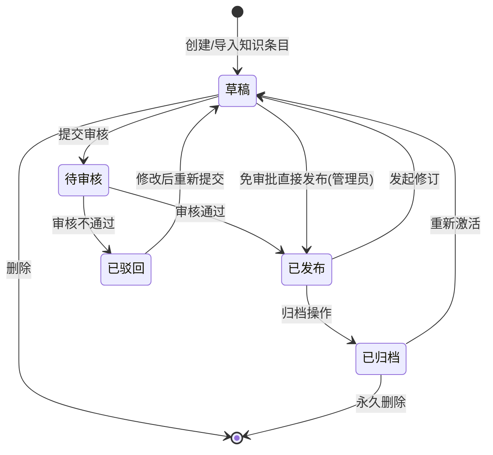

# 模块三：企业知识库资产建设（M03）

> **模块定位**：GEO 系统的"资产层"，负责将企业非结构化资料（招标文件、技术方案、资质证照、历史标书、行业规范等）转化为 AI 可理解、可检索、可复用的结构化知识资产，是整个 GEO 平台的数据基座。
>
> **竞品参考**：企业知识库平台 + KnowForce AI 知识中台
>
> **优先级**：P0

---

## 9.1 功能清单

| 编号 | 功能名称 | 优先级 | 说明 |
|------|---------|--------|------|
| M03-F01 | 知识库创建与管理 | P0 | 创建/编辑/删除知识库，配置知识库元信息（名称、描述、行业标签、访问范围） |
| M03-F02 | 非结构化数据导入 | P0 | 支持 PDF/Word/Excel/PPT 等格式批量导入，自动识别文档类型与编码 |
| M03-F03 | 智能知识提取 | P0 | 基于 NER（命名实体识别）+ 关系抽取，自动从文档中提取关键实体、规则、参数 |
| M03-F04 | 行业知识图谱构建 | P0 | 基于提取的实体与关系，自动构建行业知识图谱（节点=实体、边=关系） |
| M03-F05 | 知识库智能检索 | P0 | 语义检索 + 关键词混合检索，支持多条件筛选、上下文高亮、相关度排序 |
| M03-F06 | 知识库权限管理 | P0 | 原子级权限控制（RBAC + ABAC），精确到单条知识/单个字段的读写控制 |
| M03-F07 | 知识库版本管理 | P1 | 知识条目版本化，支持版本对比、回滚、变更历史追溯 |
| M03-F08 | 专家认证体系 | P1 | 领域专家注册/认证/评级，专家可对知识条目进行标注、修正、认证 |
| M03-F09 | 知识库动态进化 | P1 | 基于用户反馈与使用数据，自动优化知识条目权重、补充缺失关系 |
| M03-F10 | 多模态知识处理 | P1 | 支持图片、表格、公式、流程图等非文本模态的知识提取与索引 |
| M03-F11 | 组织/个人知识库 | P1 | 支持组织级共享知识库与个人私有知识库，支持知识条目分享与收藏 |
| M03-F12 | 知识审批流 | P1 | 知识条目发布前可配置审批流程（单人/多人/会签），审批通过后方可发布 |
| M03-F13 | 动态水印 | P2 | 浏览/导出知识文档时自动叠加动态水印（用户名+时间），防止信息泄露 |
| M03-F14 | 知识库统计报表 | P1 | 知识库使用统计（检索频次、命中率、贡献排行）、质量评分、覆盖率分析 |

---

## 9.2 状态流转图



**状态说明：**

| 状态 | 说明 | 可操作角色 |
|------|------|-----------|
| 草稿 | 知识条目创建中或修改中，仅创建者可见 | 创建者、管理员 |
| 待审核 | 已提交审批，等待审批人处理 | 审批人、管理员 |
| 已发布 | 审核通过，对授权范围内用户可见 | 有权限用户 |
| 已驳回 | 审核不通过，附驳回原因，可修改后重新提交 | 创建者 |
| 已归档 | 历史版本或过期知识，不可编辑但可查看 | 有权限用户 |

---

## 9.3 页面布局

```
┌─────────────────────────────────────────────────────────────────────┐
│  [Logo]  GEO 知识库                                    [🔍] [👤] [⚙] │
├──────────┬──────────────────────────────────────────────────────────┤
│          │                                                          │
│ 📁 知识库  │  ┌──────────────────────────────────────────────────┐  │
│          │  │  📊 知识库概览                                    │  │
│ ├── 全部   │  │  ┌────────┐ ┌────────┐ ┌────────┐ ┌────────┐   │  │
│ ├── 招标   │  │  │知识条目 │ │文档总数 │ │图谱节点 │ │本月活跃 │   │  │
│ ├── 技术   │  │  │ 12,480 │ │  3,260 │ │  8,920 │ │  1,840 │   │  │
│ ├── 资质   │  │  └────────┘ └────────┘ └────────┘ └────────┘   │  │
│ ├── 规范   │  │                                                  │  │
│ ├── 历史   │  │  📋 最近使用                    [+ 新建知识库]   │  │
│ │  标书    │  │  ┌──────────────────────────────────────────┐   │  │
│ ├── 个人   │  │  │ 📄 2025年信息化招标规范解读    [已发布]     │   │  │
│ │  知识库  │  │  │ 📄 政府采购法实施条例要点      [草稿]       │   │  │
│ ├── 审批   │  │  │ 📄 ISO9001认证要求速查        [待审核]     │   │  │
│ │  中心    │  │  │ 📄 电子招投标平台技术规范      [已发布]     │   │  │
│ └── 统计   │  │  └──────────────────────────────────────────┘   │  │
│    报表    │  │                                                  │  │
│          │  │  📈 知识库使用趋势                                 │  │
│          │  │  ┌──────────────────────────────────────────┐   │  │
│          │  │  │          ╱╲                               │   │  │
│          │  │  │        ╱    ╲     ╱╲                      │   │  │
│          │  │  │      ╱        ╲╱    ╲                    │   │  │
│          │  │  │    ╱                    ╲                 │   │  │
│          │  │  │  ╱                        ╲               │   │  │
│          │  │  │ ╱──────────────────────────╲             │   │  │
│          │  │  │ 1月  2月  3月  4月  5月  6月              │   │  │
│          │  │  └──────────────────────────────────────────┘   │  │
│          │  └──────────────────────────────────────────────────┘  │
└──────────┴──────────────────────────────────────────────────────────┘
```

**布局说明：**

- **左侧导航树**：按知识库分类组织，支持折叠/展开，显示各分类下的条目数量徽标
- **右侧内容区**：顶部为知识库概览统计卡片，中部为最近使用/待处理列表，底部为使用趋势图表
- **全局搜索栏**：顶部居中，支持语义检索与关键词检索切换
- **操作按钮**：右上角快捷入口（新建知识库、导入文档）

---

## 9.4 交互说明

| 操作 | 触发方式 | 交互流程 | 备注 |
|------|---------|---------|------|
| 新建知识库 | 点击"+ 新建知识库"按钮 | 弹出创建表单 → 填写名称/描述/行业标签/访问范围 → 选择审批流程 → 确认创建 → 进入知识库详情页 | 创建后默认为空知识库，可立即导入文档 |
| 导入文档 | 点击"导入文档"按钮或拖拽文件至导入区 | 选择/拖拽文件 → 文件校验（格式/大小）→ 批量预览 → 配置提取策略（自动/手动）→ 确认导入 → 后台异步处理 → 处理完成通知 | 支持批量导入，单文件≤100MB，单次≤50个文件 |
| 手动创建 | 在知识库详情页点击"手动创建" | 选择知识类型（条目/规则/参数/图谱节点）→ 填写结构化表单 → 关联已有知识 → 提交审核/保存草稿 | 支持富文本编辑器，可插入表格/图片/公式 |
| 查看 | 点击知识条目标题 | 进入详情页 → 展示知识内容/来源文档/关联知识/版本历史/专家标注 → 支持收藏/分享/导出 | 浏览时自动叠加动态水印 |
| 编辑 | 在详情页点击"编辑"按钮 | 进入编辑模式 → 修改内容 → 填写变更说明 → 提交审核/保存草稿 | 已发布条目编辑后生成新版本草稿 |
| 审核 | 审批人在审批中心点击待审核条目 | 进入审核页 → 查看知识内容/来源/提取置信度 → 通过/驳回（附意见）→ 通知创建者 | 支持审批意见的 threaded 讨论 |
| 删除 | 在详情页或列表项点击"删除" | 二次确认弹窗 → 输入删除原因 → 确认删除 → 移入回收站（30天内可恢复） | 已发布条目删除需管理员权限 |

---

## 9.5 错误处理规范

| 错误场景 | 触发条件 | 处理策略 | 用户提示 |
|---------|---------|---------|---------|
| 文档解析失败 | 文件损坏/加密/格式不支持/编码异常 | 记录失败原因 → 跳过该文件 → 继续处理其他文件 → 汇总报告 | "文档「XXX.pdf」解析失败：文件已加密，请提供解密后文件重新导入" |
| 提取准确率不足 | NER/关系抽取置信度低于阈值（默认 0.6） | 标记为"待人工复核" → 推送给创建者/专家 → 人工修正后重新入库 | "文档中有 23 处知识提取置信度较低，建议人工复核确认" |
| 知识冲突 | 新提取的知识与已有知识存在矛盾（同一实体不同属性值） | 标记冲突 → 通知知识库管理员 → 提供冲突对比视图 → 人工裁定 | "检测到知识冲突：条目 A 与条目 B 对「XXX参数」的定义不一致，请确认" |
| 文件过大 | 单文件超过 100MB 或批量导入总大小超过 1GB | 拒绝导入 → 提示文件过大 → 建议拆分或压缩 | "文件大小超过限制（100MB），请拆分后重新导入" |
| 批量导入校验失败 | 批量导入中部分文件校验失败（格式/大小/病毒扫描） | 通过的文件正常处理 → 失败的文件列出原因 → 支持下载校验报告 | "批量导入完成：成功 45/50 个文件，5 个文件校验失败，[下载报告]" |
| 知识图谱构建失败 | 实体关系抽取结果为空或图谱引擎异常 | 记录异常日志 → 通知运维 → 提供重试入口 | "知识图谱构建异常，已通知运维处理，可稍后重试" |
| 权限越权访问 | 用户尝试访问无权限的知识条目/字段 | 拒绝访问 → 记录审计日志 → 提示申请权限 | "您没有权限查看此知识条目，如需访问请联系管理员申请" |
| 版本冲突 | 多人同时编辑同一知识条目 | 乐观锁机制 → 后提交者提示冲突 → 提供版本对比与合并工具 | "该条目已被他人修改，请对比最新版本后重新编辑" |

---

## 9.6 技术规格

### 9.6.1 文档解析引擎架构

```
┌─────────────────────────────────────────────────────────────┐
│                     文档解析引擎                              │
├─────────────────────────────────────────────────────────────┤
│                                                             │
│  ┌──────────┐    ┌──────────────┐    ┌──────────────────┐  │
│  │ 文件接收  │───▶│  格式识别层   │───▶│   解析路由层      │  │
│  │ & 校验   │    │ (Magic Byte  │    │ (根据格式分发)    │  │
│  └──────────┘    │  + 扩展名)   │    └────────┬─────────┘  │
│                  └──────────────┘             │             │
│                          ┌────────────────────┼──────┐      │
│                          ▼                    ▼      ▼      │
│                   ┌──────────┐  ┌──────────┐  ┌─────────┐  │
│                   │ 文本解析  │  │ OCR 引擎  │  │ 结构化  │  │
│                   │ (PDF/Word │  │ (图片/   │  │ 解析    │  │
│                   │  /PPT/   │  │  扫描件) │  │ (Excel/ │  │
│                   │  Excel)  │  │          │  │  CSV)   │  │
│                   └────┬─────┘  └────┬─────┘  └────┬────┘  │
│                        │             │              │        │
│                        ▼             ▼              ▼        │
│                   ┌─────────────────────────────────────┐   │
│                   │         文本后处理层                  │   │
│                   │  (去噪/分段/编码统一/语言检测)        │   │
│                   └────────────────┬────────────────────┘   │
│                                    ▼                        │
│                   ┌─────────────────────────────────────┐   │
│                   │         输出：结构化文本块             │   │
│                   │     (标题/正文/表格/图片/元数据)       │   │
│                   └─────────────────────────────────────┘   │
└─────────────────────────────────────────────────────────────┘
```

**技术选型：**

| 组件 | 技术方案 | 说明 |
|------|---------|------|
| 文本解析 | Apache Tika + 自研适配器 | 支持 PDF/Word/PPT/Excel 等 20+ 格式 |
| OCR 引擎 | PaddleOCR + LLM 视觉模型 | 常规文档用 PaddleOCR，复杂版式用 LLM 视觉模型 |
| 解析路由 | 策略模式 + 格式注册表 | 根据文件 Magic Byte 自动选择解析策略 |
| 文本后处理 | 自研 Pipeline | 包含去噪、分段、编码统一、语言检测 |
| 异步处理 | 消息队列（RabbitMQ/Kafka） | 大文件/批量导入异步处理，支持进度查询 |

### 9.6.2 知识提取 Pipeline 设计

```
┌─────────────────────────────────────────────────────────────────┐
│                    知识提取 Pipeline                              │
├─────────────────────────────────────────────────────────────────┤
│                                                                 │
│  结构化文本块                                                    │
│       │                                                         │
│       ▼                                                         │
│  ┌──────────┐    ┌──────────┐    ┌──────────┐    ┌──────────┐  │
│  │ 文本分段  │───▶│  NER    │───▶│ 关系抽取  │───▶│ 知识融合  │  │
│  │ & 分块   │    │ 实体识别 │    │ (三元组)  │    │ & 去重   │  │
│  └──────────┘    └──────────┘    └──────────┘    └──────────┘  │
│       │               │               │               │        │
│       ▼               ▼               ▼               ▼        │
│  ┌──────────┐    ┌──────────┐    ┌──────────┐    ┌──────────┐  │
│  │ 段落级   │    │ 行业实体  │    │ 实体间    │    │ 冲突检测  │  │
│  │ 语义分块 │    │ (法规/   │    │ 语义关系  │    │ & 消解   │  │
│  │ (512 token│    │ 标准/参数│    │ (包含/   │    │          │  │
│  │  滑动窗口)│    │ /流程等) │    │ 引用/    │    │          │  │
│  └──────────┘    └──────────┘    │ 约束)    │    └──────────┘  │
│                                  └──────────┘                   │
│                                        │                        │
│                                        ▼                        │
│                               ┌──────────────┐                  │
│                               │  知识条目     │                  │
│                               │  (结构化存储) │                  │
│                               └──────────────┘                  │
└─────────────────────────────────────────────────────────────────┘
```

**Pipeline 各阶段说明：**

| 阶段 | 技术方案 | 输入 | 输出 |
|------|---------|------|------|
| 文本分段 | 语义分块（Semantic Chunking）+ 滑动窗口 | 解析后的纯文本 | 语义完整的文本块（≤512 token） |
| NER 实体识别 | 领域微调 LLM + 规则引擎 | 文本块 | 实体列表（类型+值+位置+置信度） |
| 关系抽取 | LLM Prompt（Few-shot）+ 图谱 Schema 约束 | 实体对 + 上下文 | 三元组（头实体-关系-尾实体） |
| 知识融合 | 向量相似度匹配 + 规则去重 | 新提取知识 + 已有知识 | 融合后的知识条目（新增/更新/冲突标记） |

### 9.6.3 向量检索架构

```
┌─────────────────────────────────────────────────────────────────┐
│                      向量检索架构                                 │
├─────────────────────────────────────────────────────────────────┤
│                                                                 │
│  查询请求                                                        │
│       │                                                         │
│       ▼                                                         │
│  ┌──────────────────────────────────────────┐                   │
│  │            查询预处理层                    │                   │
│  │  ┌────────┐  ┌────────┐  ┌────────────┐ │                   │
│  │  │ 分词   │  │ 意图   │  │ 查询改写   │ │                   │
│  │  │ & 纠错 │  │ 识别   │  │ & 扩展     │ │                   │
│  │  └────────┘  └────────┘  └────────────┘ │                   │
│  └────────────────────┬─────────────────────┘                   │
│                       ▼                                         │
│  ┌──────────────────────────────────────────┐                   │
│  │            混合检索引擎                    │                   │
│  │                                          │                   │
│  │  ┌──────────────┐  ┌──────────────────┐ │                   │
│  │  │  向量检索     │  │  关键词检索       │ │                   │
│  │  │  (Dense)     │  │  (Sparse/BM25)   │ │                   │
│  │  │  Embedding   │  │  倒排索引         │ │                   │
│  │  │  → ANN搜索   │  │  → 精确匹配       │ │                   │
│  │  └──────┬───────┘  └────────┬─────────┘ │                   │
│  │         │                   │            │                   │
│  │         ▼                   ▼            │                   │
│  │  ┌──────────────────────────────────┐   │                   │
│  │  │      结果融合 & 重排序            │   │                   │
│  │  │  (RRF / 线性加权 / Cross-Encoder)│   │                   │
│  │  └──────────────────────────────────┘   │                   │
│  └────────────────────┬─────────────────────┘                   │
│                       ▼                                         │
│  ┌──────────────────────────────────────────┐                   │
│  │          后处理 & 返回                     │                   │
│  │  (权限过滤/高亮/分页/相关度评分)           │                   │
│  └──────────────────────────────────────────┘                   │
└─────────────────────────────────────────────────────────────────┘
```

**向量检索技术规格：**

| 组件 | 技术方案 | 说明 |
|------|---------|------|
| Embedding 模型 | BGE-M3 / 自研领域 Embedding | 支持中英双语，维度 1024 |
| 向量数据库 | Milvus / Elasticsearch 8.x | 支持 ANN 搜索（IVF/HNSW），亿级向量 |
| 混合检索策略 | Dense + Sparse 线性加权 | 权重可配置（默认 Dense 0.7 + Sparse 0.3） |
| 重排序 | Cross-Encoder（BGE-Reranker） | Top-100 候选集重排序，提升精确率 |
| 索引更新 | 增量索引 + 定时全量重建 | 新知识条目实时入库，每日凌晨全量重建 |

### 9.6.4 权限模型详细设计（RBAC + ABAC）

```
┌─────────────────────────────────────────────────────────────────┐
│                    权限模型（RBAC + ABAC）                        │
├─────────────────────────────────────────────────────────────────┤
│                                                                 │
│  ┌─────────────────────────────────────────────────────────┐   │
│  │                    RBAC 基础层                            │   │
│  │                                                         │   │
│  │  用户 ──▶ 用户角色 ──▶ 角色 ──▶ 角色权限 ──▶ 操作       │   │
│  │                                                         │   │
│  │  内置角色：                                             │   │
│  │  • 超级管理员：全部权限                                  │   │
│  │  • 知识库管理员：知识库 CRUD + 审批 + 成员管理           │   │
│  │  • 知识编辑者：知识条目 CRUD + 导入 + 提交审核            │   │
│  │  • 知识查看者：已发布知识查看 + 检索 + 收藏               │   │
│  │  • 审批人：指定知识库的审批权限                           │   │
│  │  • 专家：知识标注 + 修正建议 + 认证                       │   │
│  └─────────────────────────────────────────────────────────┘   │
│                                                                 │
│  ┌─────────────────────────────────────────────────────────┐   │
│  │                    ABAC 增强层                            │   │
│  │                                                         │   │
│  │  属性维度：                                             │   │
│  │  ┌────────────┐ ┌────────────┐ ┌────────────────────┐  │   │
│  │  │ 用户属性    │ │ 资源属性    │ │ 环境属性            │  │   │
│  │  │ • 部门     │ │ • 知识库ID  │ │ • 访问时间          │  │   │
│  │  │ • 职级     │ │ • 安全等级  │ │ • 访问IP/设备       │  │   │
│  │  │ • 专业领域 │ │ • 行业标签  │ │ • 网络环境          │  │   │
│  │  │ • 认证状态 │ │ • 创建时间  │ │ • 并发数            │  │   │
│  │  └────────────┘ └────────────┘ └────────────────────┘  │   │
│  │                                                         │   │
│  │  策略示例：                                             │   │
│  │  "部门=法务部 AND 资源.行业标签=法律规范 → 允许读取"     │   │
│  │  "资源.安全等级=机密 AND 用户.职级<5 → 拒绝访问"         │   │
│  │  "环境.网络环境=外网 AND 资源.安全等级>=3 → 拒绝导出"    │   │
│  └─────────────────────────────────────────────────────────┘   │
│                                                                 │
│  ┌─────────────────────────────────────────────────────────┐   │
│  │                    原子级权限控制                         │   │
│  │                                                         │   │
│  │  知识库级别 ──▶ 知识条目级别 ──▶ 字段级别                 │   │
│  │  (创建/删除)    (CRUD/审批)     (某字段可见/可编辑)       │   │
│  └─────────────────────────────────────────────────────────┘   │
└─────────────────────────────────────────────────────────────────┘
```

### 9.6.5 版本管理方案

| 维度 | 方案 |
|------|------|
| 版本模型 | 基于 Git-like 的版本树，每个知识条目独立维护版本链 |
| 版本号 | 语义化版本号（主版本.次版本.修订号），如 v2.1.3 |
| 变更记录 | 每次修改自动记录：变更人、变更时间、变更说明、变更内容（diff） |
| 版本对比 | 支持任意两个版本的 diff 对比（文本/结构化字段/图谱关系） |
| 回滚机制 | 支持一键回滚到任意历史版本，回滚操作本身记录为新版本 |
| 存储策略 | 最新版本全量存储，历史版本增量存储（delta），保留最近 50 个版本 |
| 发布版本 | 已发布版本不可修改（immutable），修改操作自动创建新版本草稿 |

### 9.6.6 专家认证流程

```
┌──────────┐    ┌──────────┐    ┌──────────┐    ┌──────────┐    ┌──────────┐
│  申请    │───▶│  初审    │───▶│  评审    │───▶│  公示    │───▶│  认证    │
│  提交    │    │  (资料   │    │  (专家   │    │  (3天    │    │  生效    │
│  材料    │    │   核验)  │    │   答辩)  │    │   公示)  │    │          │
└──────────┘    └──────────┘    └──────────┘    └──────────┘    └──────────┘
                     │                               │
                     ▼                               ▼
               ┌──────────┐                    ┌──────────┐
               │  驳回    │                    │  异议    │
               │  (可重新  │                    │  (调查   │
               │   申请)   │                    │   处理)  │
               └──────────┘                    └──────────┘
```

**专家等级体系：**

| 等级 | 要求 | 权限 |
|------|------|------|
| L1 初级专家 | 提交基础资料 + 通过基础测试 | 知识标注、修正建议 |
| L2 中级专家 | L1 + 3年以上行业经验 + 评审通过 | 知识认证、审批权限 |
| L3 高级专家 | L2 + 5年以上经验 + 行业影响力 | 知识库管理、专家评审 |
| L4 首席专家 | L3 + 行业权威认证 | 全部专家权限 + 知识库架构决策 |

### 9.6.7 接口定义（伪 API）

#### 知识库管理接口

```http
# 创建知识库
POST /api/v1/knowledge-bases
{
  "name": "招标法规知识库",
  "description": "收录招投标相关法律法规及实施细则",
  "industry_tags": ["招投标", "政府采购", "法规"],
  "access_scope": "organization",       // organization / department / personal
  "department_id": "dept_001",
  "approval_flow_id": "flow_001",        // 可选，为空则免审批
  "security_level": 2                    // 1-公开 2-内部 3-机密 4-绝密
}

# 获取知识库列表
GET /api/v1/knowledge-bases?page=1&size=20&industry_tag=招投标&status=active

# 获取知识库详情
GET /api/v1/knowledge-bases/{kb_id}

# 更新知识库
PUT /api/v1/knowledge-bases/{kb_id}

# 删除知识库
DELETE /api/v1/knowledge-bases/{kb_id}
```

#### 知识条目接口

```http
# 创建知识条目
POST /api/v1/knowledge-bases/{kb_id}/items
{
  "title": "政府采购法第三十八条",
  "type": "regulation",               // regulation / rule / parameter / experience
  "content": "政府采购法第三十八条规定...",
  "source_document_id": "doc_123",
  "tags": ["政府采购", "法规", "评分标准"],
  "related_items": ["item_456", "item_789"],
  "custom_fields": {
    "effective_date": "2024-01-01",
    "jurisdiction": "全国"
  }
}

# 检索知识条目
POST /api/v1/knowledge-bases/{kb_id}/search
{
  "query": "政府采购评分标准",
  "search_type": "hybrid",               // semantic / keyword / hybrid
  "filters": {
    "type": "regulation",
    "tags": ["政府采购"],
    "date_range": ["2024-01-01", "2025-12-31"]
  },
  "page": 1,
  "size": 20,
  "highlight": true
}

# 获取知识条目详情
GET /api/v1/knowledge-bases/{kb_id}/items/{item_id}

# 更新知识条目
PUT /api/v1/knowledge-bases/{kb_id}/items/{item_id}

# 删除知识条目
DELETE /api/v1/knowledge-bases/{kb_id}/items/{item_id}

# 提交审核
POST /api/v1/knowledge-bases/{kb_id}/items/{item_id}/submit-review

# 审核操作
POST /api/v1/knowledge-bases/{kb_id}/items/{item_id}/review
{
  "action": "approve",                    // approve / reject
  "comment": "内容准确，通过审核"
}
```

#### 文档导入接口

```http
# 上传文档（单文件）
POST /api/v1/knowledge-bases/{kb_id}/documents
Content-Type: multipart/form-data
file: <binary>
extract_strategy: "auto"                  // auto / manual

# 批量导入
POST /api/v1/knowledge-bases/{kb_id}/documents/batch
{
  "files": ["file_id_1", "file_id_2"],
  "extract_strategy": "auto",
  "options": {
    "enable_ocr": true,
    "enable_knowledge_extraction": true,
    "confidence_threshold": 0.6
  }
}

# 查询导入进度
GET /api/v1/knowledge-bases/{kb_id}/documents/import-status/{task_id}
```

#### 知识图谱接口

```http
# 获取知识图谱
GET /api/v1/knowledge-bases/{kb_id}/graph?depth=2&entity_type=regulation

# 获取实体详情
GET /api/v1/knowledge-bases/{kb_id}/graph/entities/{entity_id}

# 获取实体关系
GET /api/v1/knowledge-bases/{kb_id}/graph/entities/{entity_id}/relations

# 图谱搜索
POST /api/v1/knowledge-bases/{kb_id}/graph/search
{
  "query": "政府采购",
  "search_mode": "subgraph"              // subgraph / path / neighborhood
}
```

#### 权限管理接口

```http
# 授予权限
POST /api/v1/knowledge-bases/{kb_id}/permissions
{
  "principal_type": "user",              // user / role / department
  "principal_id": "user_001",
  "resource_type": "knowledge_base",      // knowledge_base / item / field
  "resource_id": "kb_001",
  "actions": ["read", "write"],          // read / write / delete / approve
  "conditions": {                         // ABAC 条件（可选）
    "department": "法务部",
    "security_level_lte": 3
  },
  "expire_at": "2025-12-31T23:59:59Z"
}

# 校验权限
POST /api/v1/knowledge-bases/{kb_id}/permissions/check
{
  "user_id": "user_001",
  "action": "read",
  "resource_type": "item",
  "resource_id": "item_123"
}
```

#### 版本管理接口

```http
# 获取版本列表
GET /api/v1/knowledge-bases/{kb_id}/items/{item_id}/versions

# 获取指定版本
GET /api/v1/knowledge-bases/{kb_id}/items/{item_id}/versions/{version}

# 版本对比
GET /api/v1/knowledge-bases/{kb_id}/items/{item_id}/versions/compare?v1=v1.2.0&v2=v2.0.0

# 回滚到指定版本
POST /api/v1/knowledge-bases/{kb_id}/items/{item_id}/versions/rollback
{
  "target_version": "v1.2.0",
  "reason": "新版本存在错误，回滚到稳定版本"
}
```

---

## 9.7 验收标准

### P0 功能验收标准

| 功能编号 | 验收项 | 验收标准 | 测试方法 |
|---------|--------|---------|---------|
| M03-F01 | 知识库创建 | 创建知识库后，元信息（名称、描述、标签、访问范围）正确存储并展示；创建成功后在左侧导航树中可见 | 功能测试 + 数据校验 |
| M03-F01 | 知识库编辑/删除 | 编辑后元信息实时更新；删除后知识库及关联数据移入回收站，30天内可恢复 | 功能测试 + 边界测试 |
| M03-F02 | 单文档导入 | 支持 PDF/Word/Excel/PPT 格式，单文件 ≤100MB，导入后文档元信息正确解析，原文可预览 | 兼容性测试（每种格式至少 5 个样本） |
| M03-F02 | 批量导入 | 单次导入 ≤50 个文件，总大小 ≤1GB；导入过程显示进度；失败文件有明确错误提示 | 压力测试（50 文件并发） |
| M03-F03 | 实体识别准确率 | 招标领域核心实体（法规名称、参数、流程节点）识别准确率 ≥85%（F1-score） | 使用标注测试集（≥500 条）评估 |
| M03-F03 | 关系抽取准确率 | 实体间关系抽取准确率 ≥80%（F1-score） | 使用标注测试集（≥300 条）评估 |
| M03-F03 | 低置信度处理 | 置信度 <0.6 的提取结果自动标记为"待人工复核"，并在 UI 中醒目标识 | 功能测试 |
| M03-F04 | 图谱自动构建 | 基于提取的实体与关系自动生成知识图谱，节点数与关系数与提取结果一致 | 数据一致性校验 |
| M03-F04 | 图谱可视化 | 知识图谱支持节点/边的浏览、缩放、搜索；点击节点可查看关联知识条目 | 功能测试 + 交互测试 |
| M03-F05 | 语义检索召回率 | 语义检索 Top-10 召回率 ≥90%（相关文档在 Top-10 中的比例） | 使用标注查询集（≥100 条查询）评估 |
| M03-F05 | 混合检索效果 | 混合检索 MRR@10 ≥0.85，优于纯关键词检索和纯语义检索 | A/B 对比测试 |
| M03-F05 | 检索响应时间 | 95% 的检索请求响应时间 ≤500ms（知识库规模 ≤10 万条目） | 性能测试 |
| M03-F06 | RBAC 权限控制 | 不同角色用户只能执行其权限范围内的操作；越权操作被拒绝并记录审计日志 | 权限矩阵测试（全角色覆盖） |
| M03-F06 | ABAC 属性策略 | 基于用户属性（部门/职级）和资源属性（安全等级/标签）的策略正确生效 | 策略组合测试（≥20 种场景） |
| M03-F06 | 原子级权限 | 字段级权限控制正确：无权限字段在 API 响应中脱敏，在 UI 中隐藏或显示为"***" | 功能测试 + API 测试 |
| M03-F06 | 权限变更实时生效 | 权限变更后，用户在下一个请求中立即生效（缓存失效时间 ≤5s） | 时效性测试 |

### 非功能性验收标准

| 维度 | 标准 |
|------|------|
| 性能 | 知识库列表页加载 ≤2s；文档导入（10MB PDF）处理完成 ≤30s；知识提取 Pipeline 吞吐量 ≥100 文档/分钟 |
| 可用性 | 系统可用性 ≥99.9%；支持水平扩展，知识库容量线性扩展 |
| 安全性 | 所有 API 需认证；敏感操作记录审计日志；数据传输 TLS 1.2+；存储加密 AES-256 |
| 兼容性 | 支持 Chrome 90+、Edge 90+、Firefox 88+；支持 1920×1080 及以上分辨率 |
| 可维护性 | 知识提取 Pipeline 各阶段可独立升级/替换；支持通过配置新增实体类型和关系类型 |

---

> **文档版本**：v1.0
> **编写日期**：2026-06-22
> **编写人**：GEO 产品团队
> **审核状态**：待审核
