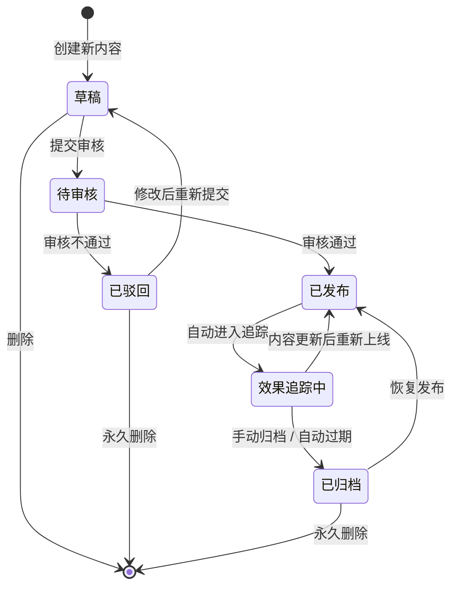

# M04 模块四：智能内容引擎与信源投喂

> **模块定位**：GEO 系统的"生产层"，负责结合知识库（M02）和 Prompt 库（M03）产出符合 E-E-A-T 标准的 LLM 友好内容，并通过信源矩阵实现权威信源投喂，构建可持续的内容供给链路。
>
> **竞品参考**：内容生产与投喂引擎
>
> **优先级**：P0
>
> **文档版本**：v1.0
>
> **最后更新**：2026-06-22

---

## 10.1 功能清单

| 编号 | 功能名称 | 优先级 | 说明 |
|------|----------|--------|------|
| M04-F01 | 内容智能生产 | P0 | 结合知识库和 Prompt 库自动产出符合 GEO 标准的文章内容 |
| M04-F02 | E-E-A-T 标准引擎 | P0 | 基于 Experience / Expertise / Authoritativeness / Trustworthiness 四维评估模型，对内容进行质量评分 |
| M04-F03 | 高权重索引内容池 | P0 | 统一管理所有已发布、待发布、已归档的内容资产，支持多维检索与状态流转 |
| M04-F04 | 信源矩阵管理 | P0 | 管理权威媒体、行业报告、学术论文、政府网站等外部信源，定义权重与引用规则 |
| M04-F05 | 内容模板管理 | P1 | 管理可复用的内容模板，支持按行业、主题、风格进行分类与版本管理 |
| M04-F06 | 内容效果追踪 | P0 | 追踪已发布内容的排名变化、引用率、曝光量、点击率等核心指标 |
| M04-F07 | 内容合规审核 | P1 | 对生成内容进行合规性检测，包括敏感词过滤、事实核查、版权校验 |
| M04-F08 | 多模态内容生成 | P1 | 支持文章、图表、信息图、FAQ 问答对等多种内容形态的生成 |
| M04-F09 | 内容发布管理 | P1 | 管理内容向目标平台（官网、公众号、第三方媒体等）的分发与同步 |
| M04-F10 | 内容日历 | P2 | 提供内容排期视图，支持按时间线查看内容发布计划与执行状态 |
| M04-F11 | 内容 A/B 测试 | P1 | 支持对同一主题生成多个版本的内容，通过效果数据选择最优版本 |
| M04-F12 | 内容数据导出 | P1 | 支持将内容数据、效果报告导出为 CSV / Excel / PDF 格式 |

---

## 10.2 状态流转图



**状态说明：**

| 状态 | 说明 | 可执行操作 |
|------|------|-----------|
| 草稿 | 内容正在创建或编辑中 | 编辑、提交审核、删除 |
| 待审核 | 内容已提交，等待审核 | 撤回、审核通过/驳回 |
| 已发布 | 内容已发布到目标平台 | 更新、下线、查看效果 |
| 已驳回 | 审核未通过，需修改 | 编辑后重新提交、删除 |
| 效果追踪中 | 系统正在追踪内容表现数据 | 查看数据、归档 |
| 已归档 | 内容已停止追踪，存入历史库 | 恢复发布、永久删除 |

---

## 10.3 页面布局

```
┌─────────────────────────────────────────────────────────────────────┐
│  GEO 智能内容引擎                                      [用户头像 ▼]  │
├──────────┬──────────────────────────────────────────────────────────┤
│          │                                                          │
│  导航栏  │              内容工作台主区域                             │
│          │                                                          │
│ ┌──────┐ │  ┌────────────────────────────────────────────────────┐  │
│ │ 📝   │ │  │  搜索栏 [关键词搜索...]  [筛选 ▼]  [排序 ▼]       │  │
│ │ 内容 │ │  └────────────────────────────────────────────────────┘  │
│ │ 生产 │ │                                                          │
│ ├──────┤ │  ┌──────────┐ ┌──────────┐ ┌──────────┐ ┌──────────┐   │
│ │ 📊   │ │  │ 总内容数 │ │ 本月发布 │ │ 平均E-E-A-T│ │ 活跃信源 │   │
│ │ 效果 │ │  │   1,286  │ │   86    │ │   87.3   │ │   42    │   │
│ │ 追踪 │ │  └──────────┘ └──────────┘ └──────────┘ └──────────┘   │
│ ├──────┤ │                                                          │
│ │ 📦   │ │  ┌────────────────────────────────────────────────────┐  │
│ │ 内容 │ │  │  内容列表                                          │  │
│ │ 池   │ │  │  ┌──────────────────────────────────────────────┐  │  │
│ ├──────┤ │  │  │ ☑ │ 标题              │ 状态   │ E-E-A-T │ 操作│  │  │
│ │ 🔗   │ │  │  ├────┼──────────────────┼────────┼─────────┼────┤  │  │
│ │ 信源 │ │  │  │ ☐ │ 2026行业趋势报告  │ 已发布 │  92/100 │ ⋮  │  │  │
│ │ 矩阵 │ │  │  │ ☐ │ AI技术白皮书     │ 草稿   │  78/100 │ ⋮  │  │  │
│ ├──────┤ │  │  │ ☐ │ 产品对比分析     │ 待审核 │  85/100 │ ⋮  │  │  │
│ │ 📋   │ │  │  │ ☐ │ 用户案例研究     │ 已驳回 │  71/100 │ ⋮  │  │  │
│ │ 模板 │ │  │  └──────────────────────────────────────────────┘  │  │
│ │ 管理 │ │  │  [< 1 / 5 >]  每页 20 条  共 1,286 条              │  │
│ ├──────┤ │  └────────────────────────────────────────────────────┘  │
│ │ 📅   │ │                                                          │
│ │ 内容 │ │  ┌────────────────────────────────────────────────────┐  │
│ │ 日历 │ │  │  快捷操作                                            │  │
│ ├──────┤ │  │  [+ AI 生成内容]  [+ 模板创建]  [+ 批量导入]       │  │
│ │ 🧪   │ │  │  [📊 导出报告]    [⚙ 发布设置]  [🔄 同步信源]       │  │
│ │ A/B  │ │  └────────────────────────────────────────────────────┘  │
│ │ 测试 │ │                                                          │
│ ├──────┤ │                                                          │
│ │ 📤   │ │                                                          │
│ │ 数据 │ │                                                          │
│ │ 导出 │ │                                                          │
│ └──────┘ │                                                          │
└──────────┴──────────────────────────────────────────────────────────┘
```

---

## 10.4 交互说明

| 交互场景 | 触发条件 | 系统行为 | 用户反馈 |
|----------|----------|----------|----------|
| AI 生成内容 | 点击「+ AI 生成内容」按钮 | 弹出配置面板：选择行业、主题、关键词、目标风格、引用信源数量；确认后调用 M03 Prompt 库 + M02 知识库生成内容 | 生成过程中显示进度条与实时预览；完成后自动进入草稿编辑态 |
| 模板创建 | 点击「+ 模板创建」按钮 | 弹出模板选择器：按行业/主题/风格筛选模板，选择后自动填充内容框架 | 模板填充后进入编辑态，用户可修改各模块内容 |
| 内容审核 | 草稿提交审核 / 点击「送审」 | 系统自动执行 M04-F07 合规审核 + M04-F02 E-E-A-T 评分；审核结果推送至审核人员 | 审核通过：状态变为「待审核」→「已发布」；审核驳回：状态变为「已驳回」，附带驳回原因 |
| 发布 | 审核通过后点击「发布」 | 系统通过 M04-F09 将内容分发至已配置的目标平台；发布成功后自动进入效果追踪 | 发布成功：显示各平台发布状态；发布失败：显示失败原因与重试按钮 |
| 效果追踪 | 内容发布后自动触发 | 系统通过 M04-F06 定期采集排名、引用率、曝光量等数据，更新内容看板 | 数据看板实时更新；指标异常时触发告警通知 |
| 删除 | 点击内容项的「删除」按钮 | 二次确认弹窗；已发布内容需先下线再删除；删除后进入回收站保留 30 天 | 删除成功：Toast 提示；删除失败：弹窗提示错误原因 |

---

## 10.5 错误处理规范

| 错误场景 | 错误码 | 触发条件 | 处理策略 | 用户提示 |
|----------|--------|----------|----------|----------|
| AI 生成失败 | M04-E001 | LLM 接口超时 / 返回异常 / Token 超限 | 自动重试 2 次（间隔 5s/15s）；仍失败则保存当前进度并通知用户 | "内容生成遇到问题，已保存草稿，请稍后重试" |
| E-E-A-T 评分不达标 | M04-E002 | 内容评分低于设定阈值（默认 70 分） | 阻止发布，返回详细评分报告与改进建议 | "内容 E-E-A-T 评分为 XX，未达到发布标准（≥70），请参考建议优化后重新提交" |
| 审核驳回 | M04-E003 | 合规审核检测到敏感词 / 事实错误 / 版权风险 | 状态变更为「已驳回」，附带具体驳回原因与位置标注 | "审核未通过：[具体原因]，请修改后重新提交" |
| 发布失败 | M04-E004 | 目标平台接口异常 / 认证失败 / 内容格式不兼容 | 记录失败日志，支持单平台重试；全部失败时保留为草稿 | "发布至 [平台名] 失败：[原因]，可点击重试" |
| 信源不可用 | M04-E005 | 外部信源 URL 无法访问 / 内容已下架 / 权重降为 0 | 标记信源为「不可用」，通知管理员；已引用该信源的内容触发重新评估 | "信源 [名称] 暂时不可用，已暂停相关内容的引用推荐" |

---

## 10.6 技术规格

### 10.6.1 E-E-A-T 评估模型详细设计

E-E-A-T 评估模型基于 Google 搜索质量评估指南，从四个维度对内容进行量化评分，总分 100 分。

#### 维度一：Experience（经验性）— 权重 25%

| 评分项 | 分值 | 评分规则 |
|--------|------|----------|
| 第一手经验描述 | 8 分 | 内容包含实际案例、数据、实验结果得 8 分；仅有概述得 4 分；无第一手经验得 0 分 |
| 实操步骤完整性 | 7 分 | 提供完整可复现的操作步骤得 7 分；部分步骤得 3-5 分；无实操指导得 0 分 |
| 时效性标记 | 5 分 | 标注发布日期和最后更新日期得 5 分；仅标注发布日期得 3 分；无日期得 0 分 |
| 多媒体佐证 | 5 分 | 包含截图/视频/数据图表等佐证材料得 5 分；仅有文字描述得 2 分 |

#### 维度二：Expertise（专业性）— 权重 30%

| 评分项 | 分值 | 评分规则 |
|--------|------|----------|
| 专业术语准确性 | 10 分 | 术语使用准确且附带解释得 10 分；术语准确但无解释得 6 分；存在术语错误得 0 分 |
| 引用权威来源 | 8 分 | 引用 ≥3 个高权重信源得 8 分；1-2 个得 4 分；无引用得 0 分 |
| 内容深度 | 7 分 | 覆盖主题的核心概念、原理、最佳实践得 7 分；仅覆盖表面信息得 3 分 |
| 作者资质标注 | 5 分 | 标注作者姓名、职位、相关资质得 5 分；仅标注姓名得 2 分；无标注得 0 分 |

#### 维度三：Authoritativeness（权威性）— 权重 25%

| 评分项 | 分值 | 评分规则 |
|--------|------|----------|
| 发布平台权重 | 8 分 | 发布在行业权威平台（DA≥50）得 8 分；一般平台（DA 20-49）得 4 分；低权重平台得 1 分 |
| 外部引用数量 | 7 分 | 被 ≥5 个外部高权重站点引用得 7 分；1-4 个得 3 分；无外部引用得 0 分 |
| 品牌一致性 | 5 分 | 内容风格、视觉、语气与品牌指南完全一致得 5 分；基本一致得 3 分；不一致得 0 分 |
| 行业认证 | 5 分 | 获得行业认证/奖项/合作伙伴标识得 5 分；无认证得 0 分 |

#### 维度四：Trustworthiness（可信度）— 权重 20%

| 评分项 | 分值 | 评分规则 |
|--------|------|----------|
| 事实准确性 | 8 分 | 所有数据、声明均有来源标注且可验证得 8 分；部分标注得 4 分；无标注得 0 分 |
| 隐私与免责声明 | 5 分 | 包含完整的隐私政策和免责声明得 5 分；部分包含得 2 分；无得 0 分 |
| 内容透明度 | 4 分 | 明确标注广告/赞助内容、利益相关声明得 4 分；未标注得 0 分 |
| 纠错机制 | 3 分 | 提供内容纠错反馈入口且 48h 内响应得 3 分；有入口但响应慢得 1 分；无得 0 分 |

**评分等级划分：**

| 等级 | 分数范围 | 处理策略 |
|------|----------|----------|
| ⭐⭐⭐⭐⭐ 优秀 | 90-100 | 优先发布，进入高权重推荐队列 |
| ⭐⭐⭐⭐ 良好 | 80-89 | 正常发布 |
| ⭐⭐⭐ 合格 | 70-79 | 发布但需后续优化 |
| ⭐⭐ 待改进 | 50-69 | 阻止发布，返回修改建议 |
| ⭐ 不合格 | 0-49 | 阻止发布，需重新生成 |

---

### 10.6.2 内容生成 Pipeline

```
┌──────────┐    ┌──────────┐    ┌──────────┐    ┌──────────┐    ┌──────────┐
│  输入层  │───▶│  处理层  │───▶│  生成层  │───▶│  评估层  │───▶│  输出层  │
└──────────┘    └──────────┘    └──────────┘    └──────────┘    └──────────┘
     │               │               │               │               │
     ▼               ▼               ▼               ▼               ▼
 ┌────────┐    ┌──────────┐    ┌──────────┐    ┌──────────┐    ┌──────────┐
 │主题    │    │Prompt    │    │LLM 调用  │    │E-E-A-T   │    │内容草稿  │
 │关键词  │    │组装      │    │流式输出  │    │评分      │    │评分报告  │
 │目标受众│    │知识库    │    │多轮对话  │    │合规检测  │    │发布队列  │
 │风格偏好│    │检索(RAG) │    │多版本    │    │信源验证  │    │效果追踪  │
 │信源要求│    │信源注入  │    │生成      │    │          │    │          │
 └────────┘    └──────────┘    └──────────┘    └──────────┘    └──────────┘
```

**Pipeline 各阶段说明：**

| 阶段 | 输入 | 处理逻辑 | 输出 |
|------|------|----------|------|
| 输入层 | 用户配置（主题、关键词、受众、风格、信源要求） | 参数校验与补全 | 结构化内容请求 |
| 处理层 | 结构化内容请求 | 从 M03 检索匹配 Prompt 模板；从 M02 检索相关知识片段；从 M04-F04 获取信源数据；组装最终 Prompt | 完整 Prompt + 上下文 |
| 生成层 | 完整 Prompt + 上下文 | 调用 LLM 进行流式生成；支持同时生成 2-3 个版本用于 A/B 测试 | 原始内容（多版本） |
| 评估层 | 原始内容 | 执行 E-E-A-T 四维评分；执行合规审核；验证信源引用有效性 | 评分报告 + 改进建议 |
| 输出层 | 评分报告 + 内容 | 评分 ≥70 分进入发布队列；<70 分附带建议返回修改 | 可发布内容 / 待修改内容 |

---

### 10.6.3 信源矩阵权重算法

信源权重（Source Authority Score, SAS）计算公式：

```
SAS = (DA × 0.3) + (CR × 0.25) + (FR × 0.2) + (RR × 0.15) + (HR × 0.1)
```

| 因子 | 符号 | 权重 | 说明 |
|------|------|------|------|
| 域名权威度 | DA | 0.30 | 基于 Moz DA 或类似指标，归一化至 0-100 |
| 引用率 | CR | 0.25 | 该信源被其他高权重站点引用的频率 |
| 新鲜度 | FR | 0.20 | 信源内容的更新频率（日更=100，周更=70，月更=40，季更=20） |
| 相关性 | RR | 0.15 | 信源与当前行业/主题的相关度（人工标注 + NLP 计算） |
| 历史表现 | HR | 0.10 | 引用该信源的内容在过往的平均效果得分 |

**信源等级划分：**

| 等级 | SAS 分数 | 引用策略 |
|------|----------|----------|
| S 级（核心信源） | 85-100 | 优先引用，每个内容至少引用 1 个 |
| A 级（重要信源） | 70-84 | 推荐引用，每个内容引用 1-2 个 |
| B 级（一般信源） | 50-69 | 可选引用，视内容需要 |
| C 级（参考信源） | 30-49 | 仅在无更优信源时使用 |
| D 级（低质信源） | 0-29 | 不引用，标记为不可用 |

---

### 10.6.4 内容发布流程

```
┌──────────┐     ┌──────────┐     ┌──────────┐     ┌──────────┐
│  发布    │     │  适配    │     │  分发    │     │  确认    │
│  请求    │────▶│  转换    │────▶│  推送    │────▶│  回调    │
└──────────┘     └──────────┘     └──────────┘     └──────────┘
     │                │                │                │
     ▼                ▼                ▼                ▼
 选择目标平台    按平台格式适配    API 调用推送     接收发布结果
 设置发布时间    内容裁剪/扩展    失败重试机制     更新内容状态
 配置发布参数    元数据填充       多平台并行       触发效果追踪
```

**支持的目标平台：**

| 平台类型 | 平台示例 | 发布方式 | 内容格式 |
|----------|----------|----------|----------|
| 官方网站 | 企业官网 CMS | API / Webhook | 富文本 / Markdown |
| 微信公众号 | 公众号后台 | API 调用 | 图文消息 |
| 行业媒体 | 36氪、虎嗅等 | API / 邮件投稿 | 富文本 |
| 社交平台 | 知乎、小红书 | API 调用 | 图文 / 短内容 |
| 学术平台 | 知网、万方 | 手动 / 邮件 | PDF / 论文格式 |

---

### 10.6.5 效果追踪指标定义

| 指标名称 | 指标代码 | 计算方式 | 采集频率 | 目标值 |
|----------|----------|----------|----------|--------|
| 搜索排名 | ER | 关键词在搜索引擎中的平均排名位置 | 每日 | Top 10 |
| 内容引用率 | CR | 被 LLM 引用的次数 / 总发布内容数 | 每周 | ≥15% |
| 曝光量 | PV | 内容在各平台的总展示次数 | 每日 | 环比增长 ≥5% |
| 点击率 | CTR | 点击次数 / 曝光次数 | 每日 | ≥3% |
| 停留时长 | ATD | 用户在内容页面的平均停留时间 | 每日 | ≥2 分钟 |
| 社交分享量 | SS | 内容在各社交平台被分享的总次数 | 每周 | 环比增长 ≥3% |
| 反向链接数 | BL | 外部站点指向该内容的链接数量 | 每周 | 环比增长 ≥2% |
| E-E-A-T 维持率 | EAT-R | 发布 30 天后 E-E-A-T 评分 ≥ 初始评分的内容占比 | 每月 | ≥80% |

---

### 10.6.6 接口定义（伪 API）

#### 10.6.6.1 内容生产接口

```
POST /api/v1/content/generate
Request Body:
{
  "topic": "2026年AI在医疗行业的应用趋势",
  "keywords": ["AI医疗", "诊断辅助", "药物研发"],
  "target_audience": "医疗行业从业者",
  "style": "professional",          // professional | casual | academic
  "word_count": 3000,
  "source_level": "S",               // S | A | B
  "min_sources": 3,
  "template_id": null,              // 可选，指定模板ID
  "ab_test": true                    // 是否生成多版本
}

Response:
{
  "code": 200,
  "data": {
    "task_id": "gen_20260622_001",
    "status": "processing",
    "estimated_time": 120,           // 预估耗时（秒）
    "poll_url": "/api/v1/content/generate/gen_20260622_001/status"
  }
}
```

#### 10.6.6.2 E-E-A-T 评分接口

```
POST /api/v1/content/evaluate
Request Body:
{
  "content_id": "cnt_20260622_001",
  "content": "（完整内容文本）",
  "metadata": {
    "author": "张三",
    " "author_title": "高级研究员",
    "publish_date": "2026-06-22",
    "sources": ["https://source1.com", "https://source2.com"]
  }
}

Response:
{
  "code": 200,
  "data": {
    "content_id": "cnt_20260622_001",
    "total_score": 87.5,
    "grade": "良好",
    "passed": true,
    "dimensions": {
      "experience": { "score": 22, "max": 25, "suggestions": ["增加更多实操案例"] },
      "expertise": { "score": 27, "max": 30, "suggestions": ["补充作者资质说明"] },
      "authoritativeness": { "score": 21, "max": 25, "suggestions": ["增加外部引用数量"] },
      "trustworthiness": { "score": 17.5, "max": 20, "suggestions": ["添加免责声明"] }
    },
    "improvement_suggestions": [
      "建议增加 2-3 个第一手案例数据",
      "建议补充作者相关资质认证信息",
      "建议增加至少 1 个 S 级信源引用"
    ]
  }
}
```

#### 10.6.6.3 信源矩阵接口

```
GET /api/v1/sources?industry=ai&level=S&limit=20

Response:
{
  "code": 200,
  "data": {
    "total": 156,
    "sources": [
      {
        "id": "src_001",
        "name": "Nature AI",
        "url": "https://nature.com/ai",
        "sas_score": 92,
        "level": "S",
        "domain_authority": 95,
        "update_frequency": "daily",
        "relevance_score": 88,
        "status": "active"
      }
    ]
  }
}
```

#### 10.6.6.4 内容发布接口

```
POST /api/v1/content/publish
Request Body:
{
  "content_id": "cnt_20260622_001",
  "platforms": [
    { "platform": "official_cms", "publish_time": "2026-06-22T10:00:00+08:00" },
    { "platform": "wechat", "publish_time": "2026-06-22T10:30:00+08:00" },
    { "platform": "zhihu", "publish_time": "2026-06-22T11:00:00+08:00" }
  ],
  "sync_mode": "parallel"           // parallel | sequential
}

Response:
{
  "code": 200,
  "data": {
    "publish_task_id": "pub_20260622_001",
    "results": [
      { "platform": "official_cms", "status": "success", "url": "https://example.com/article/001" },
      { "platform": "wechat", "status": "success", "url": "https://mp.weixin.qq.com/s/xxx" },
      { "platform": "zhihu", "status": "failed", "error": "M04-E004: 内容格式不兼容" }
    ]
  }
}
```

#### 10.6.6.5 效果追踪接口

```
GET /api/v1/content/{content_id}/performance?start_date=2026-06-01&end_date=2026-06-22

Response:
{
  "code": 200,
  "data": {
    "content_id": "cnt_20260622_001",
    "period": { "start": "2026-06-01", "end": "2026-06-22" },
    "metrics": {
      "search_ranking": { "current": 8, "change": "+2" },
      "citation_rate": { "current": "18%", "change": "+3%" },
      "page_views": { "current": 12580, "change": "+22%" },
      "click_through_rate": { "current": "4.2%", "change": "+0.8%" },
      "avg_time_on_page": { "current": "2m35s", "change": "+15s" },
      "social_shares": { "current": 86, "change": "+12" },
      "backlinks": { "current": 15, "change": "+4" },
      "eat_maintenance_rate": { "current": "92%", "change": "-3%" }
    },
    "trend": [
      { "date": "2026-06-01", "page_views": 520, "ranking": 12 },
      { "date": "2026-06-08", "page_views": 3800, "ranking": 9 },
      { "date": "2026-06-15", "page_views": 8200, "ranking": 8 },
      { "date": "2026-06-22", "page_views": 12580, "ranking": 8 }
    ]
  }
}
```

---

## 10.7 验收标准

### P0 功能验收标准

| 功能编号 | 验收项 | 验收标准 | 验证方法 |
|----------|--------|----------|----------|
| M04-F01 | 内容生成成功率 | ≥95% 的内容生成请求能成功返回结果（排除用户主动取消） | 压力测试：连续发送 100 次生成请求，统计成功率 |
| M04-F01 | 内容生成耗时 | 3000 字以内的内容，平均生成耗时 ≤60 秒 | 取 50 次生成请求的 P50 耗时 |
| M04-F01 | 内容相关性 | 生成内容与指定主题的相关性评分 ≥80/100（由 3 名评估人员盲评取均值） | 随机抽取 20 篇生成内容进行人工评估 |
| M04-F02 | E-E-A-T 评分准确率 | 系统评分与专家评分偏差 ≤5 分（以 100 篇已有人工标注内容为基准） | 对比系统评分与专家评分的 MAE |
| M04-F02 | E-E-A-T 评分覆盖率 | 100% 的新生成内容经过 E-E-A-T 评分 | 检查内容生成 Pipeline 日志 |
| M04-F02 | 评分响应时间 | 单篇内容 E-E-A-T 评分耗时 ≤10 秒 | 取 50 次评分请求的 P95 耗时 |
| M04-F03 | 内容检索响应时间 | 内容池检索（含关键词 + 筛选 + 排序）平均响应时间 ≤500ms | 在 10 万条内容池中执行 100 次检索，取 P95 |
| M04-F03 | 状态流转正确率 | 100% 的状态变更符合状态流转图定义，无非法跳转 | 设计 30 个状态流转测试用例，全部通过 |
| M04-F03 | 内容存储容量 | 支持 ≥50 万条内容的高效存储与检索 | 导入 50 万条测试数据，验证检索性能不退化 |
| M04-F04 | 信源覆盖率 | 每个一级行业分类下至少有 ≥20 个 S/A 级信源 | 按行业分类统计信源数量 |
| M04-F04 | 信源可用性检测 | 每 4 小时自动检测一次信源可用性，不可用信源在 ≤4 小时内标记 | 模拟 10 个信源下线，验证检测时效 |
| M04-F04 | 信源权重更新 | SAS 分数每日自动更新，更新延迟 ≤24 小时 | 检查信源权重更新日志 |
| M04-F06 | 数据采集完整度 | 8 个核心效果指标的数据采集完整度 ≥95% | 随机抽取 30 篇已发布内容，检查指标数据缺失率 |
| M04-F06 | 数据更新延迟 | 效果数据从平台采集到展示的全链路延迟 ≤2 小时 | 在目标平台制造数据变化，记录系统端可见时间 |
| M04-F06 | 数据准确性 | 效果数据与平台原始数据偏差 ≤2% | 人工对比 20 条内容的效果数据与平台原始数据 |

### 通用验收标准

| 验收项 | 验收标准 | 验证方法 |
|--------|----------|----------|
| 页面加载速度 | 内容工作台首屏加载时间 ≤2 秒（网络条件：100Mbps） | Lighthouse 性能测试 |
| 并发支持 | 支持 ≥50 个用户同时进行内容生产操作 | 并发压力测试 |
| 错误恢复 | 系统异常后 ≤5 分钟自动恢复，数据零丢失 | 模拟故障注入测试 |
| 日志完整性 | 所有关键操作（创建、审核、发布、删除）均有完整审计日志 | 日志审查 |
| 权限控制 | 内容操作严格遵循 RBAC 权限模型，无越权访问 | 权限矩阵测试（≥20 个用例） |

---

> **文档维护说明**：本文档为 GEO 系统需求文档的第四部分，涵盖智能内容引擎与信源投喂模块的完整需求定义。后续如有变更，请同步更新版本号与变更记录。
