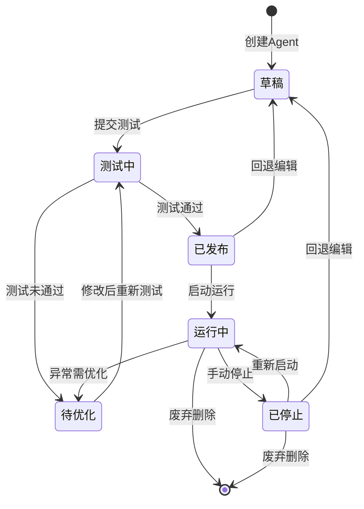

# M06 模块六：AI智能体中台

## 模块定位

本模块是GEO系统的**"智能层"**，负责AI智能体的构建、编排和协同。通过提供标准化的Agent构建框架、多智能体协同机制和大模型调度能力，实现营销、销售、客服、经营分析等场景的智能化升级。

| 属性 | 说明 |
|------|------|
| **模块名称** | AI智能体中台 |
| **模块编号** | M06 |
| **优先级** | P1 |
| **模块定位** | GEO系统的"智能层"，负责AI智能体的构建、编排和协同 |
| **竞品参考** | AI-Agentforce企业级智能体中台 |
| **依赖模块** | M01 用户与权限管理、M02 内容管理、M03 渠道管理、M04 数据管理、M05 工作流引擎 |

---

## 12.1 功能清单

| 编号 | 功能名称 | 优先级 | 说明 |
|------|----------|--------|------|
| M06-F01 | Agent快速构建 | P1 | 通过自然语言描述或预置模板快速构建AI智能体，支持零代码/低代码方式创建 |
| M06-F02 | 多智能体协同MAS | P1 | 支持多个Agent之间的任务分工、消息传递与协同执行，实现复杂业务场景的自动化处理 |
| M06-F03 | AI能力编排 | P1 | 将大模型调用、知识库检索、工具调用、数据分析等AI能力进行灵活编排组合 |
| M06-F04 | 营销Agent | P1 | 面向营销场景的智能体，支持内容生成、投放优化、效果追踪等功能 |
| M06-F05 | 销售Agent | P2 | 面向销售场景的智能体，支持线索评分、跟进策略推荐、客户画像分析 |
| M06-F06 | 客服Agent | P2 | 面向售后客服场景的智能体，支持常见问题自动响应、工单分类、满意度预测 |
| M06-F07 | 经营分析Agent | P2 | 面向经营分析场景的智能体，支持数据自动分析、报告生成、异常预警 |
| M06-F08 | Agent权限管理 | P1 | 对Agent的创建、编辑、调用、数据访问进行细粒度权限控制 |
| M06-F09 | Agent效果评估 | P1 | 量化评估各Agent的业务贡献，提供效果指标看板与优化建议 |
| M06-F10 | Agent模板市场 | P2 | 提供行业预置Agent模板，支持模板的发布、下载与二次定制 |
| M06-F11 | 大模型调度 | P1 | 多模型智能调度，支持负载均衡、自动降级、重试策略与成本优化 |
| M06-F12 | Agent运行监控 | P1 | 实时监控Agent运行状态、资源消耗、异常告警与日志追踪 |

---

## 12.2 状态流转图



**状态说明：**

| 状态 | 说明 |
|------|------|
| 草稿 | Agent初始创建状态，可自由编辑配置 |
| 测试中 | Agent进入测试环境验证，记录测试结果 |
| 待优化 | 测试未通过，需根据反馈修改后重新测试 |
| 已发布 | 测试通过，可启动正式运行 |
| 运行中 | Agent正式运行，执行业务任务 |
| 已停止 | Agent已暂停运行，可重新启动或编辑 |

---

## 12.3 页面布局

```
┌─────────────────────────────────────────────────────────────────────┐
│  GEO AI智能体中台                                    [用户头像 ▼]   │
├──────────┬──────────────────────────────────────────────────────────┤
│          │  🔍 搜索Agent...                    [+ 新建Agent] [模板市场]│
│  导航栏   │──────────────────────────────────────────────────────────│
│          │                                                          │
│ 📊 概览   │  ┌─────────┐ ┌─────────┐ ┌─────────┐ ┌─────────┐       │
│          │  │ 运行中   │ │ 已停止   │ │ 草稿    │ │ 今日调用 │       │
│ 🤖 Agent │  │   12    │ │    3    │ │    5    │ │ 1.2M次  │       │
│   列表   │  └─────────┘ └─────────┘ └─────────┘ └─────────┘       │
│          │                                                          │
│ 📋 模板   │  ┌──────────────────────────────────────────────────┐   │
│   市场   │  │  Agent名称      │ 类型   │ 状态  │ 调用次数 │ 操作 │   │
│          │  │──────────────────────────────────────────────────│   │
│ 📈 效果   │  │  营销Agent-01  │ 营销   │ 运行中 │  85,420  │ 详情 │   │
│   评估   │  │  销售Agent-03  │ 销售   │ 运行中 │  42,180  │ 详情 │   │
│          │  │  客服Agent-02  │ 客服   │ 已停止 │  28,950  │ 详情 │   │
│ ⚙️ 大模型 │  │  分析Agent-01  │ 分析   │ 草稿   │       0  │ 详情 │   │
│   调度   │  │  营销Agent-02  │ 营销   │ 运行中 │  67,300  │ 详情 │   │
│          │  └──────────────────────────────────────────────────┘   │
│ 🔧 配置   │                                                          │
│          │  ┌─ 快捷操作 ──────────────────────────────────────────┐ │
│ 📜 日志   │  │  [批量启动] [批量停止] [导出报表] [刷新状态]        │ │
│          │  └─────────────────────────────────────────────────────┘ │
└──────────┴──────────────────────────────────────────────────────────┘
```

**Agent详情页布局：**

```
┌─────────────────────────────────────────────────────────────────────┐
│  ← 返回列表    营销Agent-01                    [编辑] [测试] [启动]  │
├─────────────────────────────────────────────────────────────────────┤
│  ┌─ 基本信息 ──────────────────┐  ┌─ 运行状态 ──────────────────┐  │
│  │ 名称: 营销Agent-01          │  │ 状态: ● 运行中              │  │
│  │ 类型: 营销                  │  │ 今日调用: 3,420次           │  │
│  │ 创建时间: 2026-06-01        │  │ 成功率: 98.5%               │  │
│  │ 创建人: 张三                │  │ 平均响应: 1.2s              │  │
│  │ 模型: GPT-4o / Claude-3     │  │ 资源消耗: CPU 45%           │  │
│  └─────────────────────────────┘  └─────────────────────────────┘  │
│                                                                     │
│  ┌─ 能力配置 ────────────────────────────────────────────────────┐  │
│  │  🧠 大模型能力    📚 知识库    🔧 工具调用    📊 数据分析     │  │
│  │  [已配置]        [已配置]     [已配置]      [未配置]         │  │
│  └───────────────────────────────────────────────────────────────┘  │
│                                                                     │
│  ┌─ 协同配置 ────────────────────────────────────────────────────┐  │
│  │  关联Agent: 分析Agent-01 (数据支持)                           │  │
│  │  消息队列: kafka://agent-mq/topic-001                        │  │
│  │  协同模式: 主从模式                                           │  │
│  └───────────────────────────────────────────────────────────────┘  │
│                                                                     │
│  ┌─ 运行日志 ────────────────────────────────────────────────────┐  │
│  │  2026-06-22 10:30:15  [INFO] 内容生成任务完成, 耗时1.1s      │  │
│  │  2026-06-22 10:28:42  [INFO] 投放优化建议已推送              │  │
│  │  2026-06-22 10:25:30  [WARN] 模型响应延迟升高, 已自动切换    │  │
│  └───────────────────────────────────────────────────────────────┘  │
└─────────────────────────────────────────────────────────────────────┘
```

---

## 12.4 交互说明

| 操作 | 触发条件 | 交互流程 | 结果 |
|------|----------|----------|------|
| **新建Agent** | 点击"+ 新建Agent"按钮 | 选择创建方式（自然语言/模板/空白）→ 配置Agent基本信息 → 配置AI能力 → 配置协同关系 → 保存 | Agent进入"草稿"状态 |
| **测试** | 点击Agent详情页"测试"按钮 | 进入测试环境 → 执行测试用例 → 展示测试结果（通过/未通过） | 测试通过→"已发布"；未通过→"待优化" |
| **发布** | 测试通过后点击"发布"按钮 | 确认发布信息 → 分配运行资源 → 注册到运行集群 | Agent进入"已发布"状态，可启动运行 |
| **停止** | 运行中Agent点击"停止"按钮 | 确认停止操作 → 完成当前任务 → 释放运行资源 | Agent进入"已停止"状态 |
| **启动** | 已停止/已发布Agent点击"启动"按钮 | 加载Agent配置 → 分配运行资源 → 注册到运行集群 → 开始接收任务 | Agent进入"运行中"状态 |
| **删除** | 草稿/已停止状态下点击"删除" | 二次确认 → 清理关联资源 → 删除Agent配置 | Agent永久删除 |

---

## 12.5 错误处理规范

| 错误场景 | 错误码 | 触发条件 | 处理策略 | 用户提示 |
|----------|--------|----------|----------|----------|
| **Agent构建失败** | M06-E001 | 配置校验不通过或依赖资源不可用 | 记录构建日志，回滚已创建资源，返回详细错误信息 | "Agent构建失败：{具体原因}，请检查配置后重试" |
| **测试超时** | M06-E002 | 测试执行超过预设时间阈值（默认300s） | 终止测试进程，释放测试资源，标记为"待优化" | "测试超时，请检查Agent逻辑复杂度或调整超时配置" |
| **资源不足** | M06-E003 | 启动/运行时计算资源（CPU/内存/GPU）不足 | 进入资源等待队列，触发自动扩容（如配置），超时后通知管理员 | "资源不足，Agent已进入等待队列，预计等待时间：{预估时间}" |
| **运行异常** | M06-E004 | Agent执行过程中发生未捕获异常或模型调用失败 | 自动重试（最多3次），失败后停止Agent并告警，记录异常堆栈 | "Agent运行异常已自动停止，错误已记录，请查看日志详情" |
| **模型调用失败** | M06-E005 | 大模型API返回错误或超时 | 触发模型降级策略，切换到备用模型，记录失败信息 | "主模型调用失败，已自动切换至备用模型" |
| **权限不足** | M06-E006 | 用户尝试操作无权限的Agent | 拒绝操作，记录审计日志 | "权限不足，如需操作请联系管理员授权" |
| **协同通信失败** | M06-E007 | Agent间消息传递超时或失败 | 重试通信（最多3次），失败后隔离故障Agent并告警 | "与关联Agent通信异常，已隔离处理，请检查网络状态" |

---

## 12.6 技术规格

### 12.6.1 Agent架构设计

本模块采用 **ReAct + Plan-and-Execute 双模式** 混合架构：

```
┌─────────────────────────────────────────────────────────┐
│                    Agent Core Framework                  │
│                                                         │
│  ┌──────────────┐    ┌──────────────┐                   │
│  │   ReAct模式   │    │ Plan-and-    │                   │
│  │  (单步推理)   │    │ Execute模式  │                   │
│  │              │    │ (多步规划)    │                   │
│  └──────┬───────┘    └──────┬───────┘                   │
│         │                   │                           │
│         └─────────┬─────────┘                           │
│                   ▼                                     │
│  ┌────────────────────────────────────┐                 │
│  │         Agent Runtime Engine       │                 │
│  │  ┌────────┐ ┌────────┐ ┌────────┐ │                 │
│  │  │ 推理器  │ │ 规划器  │ │ 执行器  │ │                 │
│  │  └────────┘ └────────┘ └────────┘ │                 │
│  └────────────────────────────────────┘                 │
│                   │                                     │
│  ┌────────────────┼────────────────────┐                │
│  ▼                ▼                    ▼                │
│ ┌──────┐   ┌──────────┐   ┌──────────────┐            │
│ │ 知识库 │   │ 工具注册表 │   │ 大模型调度器  │            │
│ └──────┘   └──────────┘   └──────────────┘            │
└─────────────────────────────────────────────────────────┘
```

**模式选择策略：**

| 模式 | 适用场景 | 特点 |
|------|----------|------|
| ReAct模式 | 简单问答、单步工具调用 | 响应快，Token消耗少，适合实时交互 |
| Plan-and-Execute模式 | 复杂任务、多步骤编排 | 先规划再执行，支持任务分解与并行处理 |

### 12.6.2 多智能体协同框架

```
┌─────────────────────────────────────────────────────────────┐
│                  Multi-Agent System (MAS)                    │
│                                                             │
│  ┌─────────────────────────────────────────────────────┐    │
│  │              Orchestrator (编排器)                    │    │
│  │   负责任务分解、Agent调度、结果聚合、冲突仲裁          │    │
│  └──────────┬──────────────┬──────────────┬────────────┘    │
│             │              │              │                 │
│     ┌───────▼──────┐ ┌────▼─────┐ ┌──────▼───────┐        │
│     │  营销Agent    │ │ 销售Agent │ │  分析Agent    │        │
│     │  (内容生成)   │ │ (线索跟进)│ │  (数据分析)   │        │
│     └───────┬──────┘ └────┬─────┘ └──────┬───────┘        │
│             │              │              │                 │
│     ┌───────▼──────────────▼──────────────▼───────┐        │
│     │          Message Bus (消息总线)               │        │
│     │     Kafka / RabbitMQ 异步消息传递             │        │
│     └─────────────────────────────────────────────┘        │
│                                                             │
│  ┌─────────────────────────────────────────────────────┐    │
│  │              Shared Memory (共享记忆)                 │    │
│  │    共享上下文、任务状态、中间结果存储                   │    │
│  └─────────────────────────────────────────────────────┘    │
└─────────────────────────────────────────────────────────────┘
```

**协同模式：**

| 模式 | 说明 | 适用场景 |
|------|------|----------|
| 主从模式 | 主Agent分配任务，子Agent执行并汇报 | 任务可明确分解的场景 |
| 对等模式 | Agent间平等协商，共同决策 | 需要多视角综合判断的场景 |
| 流水线模式 | Agent按顺序处理，前一个输出作为后一个输入 | 流程化处理的场景 |
| 竞争模式 | 多个Agent独立执行同一任务，取最优结果 | 需要结果质量保障的场景 |

**冲突仲裁机制：**
1. **优先级仲裁**：按Agent优先级（P0 > P1 > P2）决定执行权
2. **投票仲裁**：多Agent意见不一致时，按多数决原则
3. **人工仲裁**：关键决策点暂停，等待人工确认
4. **上下文仲裁**：根据任务上下文和历史执行数据自动决策

### 12.6.3 大模型调度策略

```
请求 → 调度器 → ┬─ 负载均衡 → 模型实例A
                ├─ 负载均衡 → 模型实例B
                └─ 负载均衡 → 模型实例C
                     │
                     ▼
              ┌──────────────┐
              │  健康检查      │
              │  失败？→ 降级   │
              │  超时？→ 重试   │
              │  限流？→ 排队   │
              └──────────────┘
```

**调度策略：**

| 策略 | 说明 | 配置参数 |
|------|------|----------|
| 负载均衡 | 基于模型实例的当前负载（QPS/延迟）进行加权分发 | `weight`, `health_check_interval` |
| 自动降级 | 主模型不可用时，按优先级切换到备用模型 | `fallback_chain`, `timeout_threshold` |
| 智能重试 | 失败后按指数退避策略重试，最多N次 | `max_retry`, `backoff_base`, `backoff_max` |
| 成本优化 | 根据任务复杂度自动选择性价比最优模型 | `cost_budget`, `complexity_threshold` |
| 限流保护 | 对每个模型实例设置QPS上限，超限排队或拒绝 | `rate_limit`, `queue_size` |

**模型优先级链示例：**
```
GPT-4o → Claude-3.5-Sonnet → 通义千问-Max → DeepSeek-V3
```

### 12.6.4 Agent权限模型

```
┌─────────────────────────────────────────────────────┐
│                 Agent权限模型 (ABAC)                  │
│                                                     │
│  主体 (Subject)    →  用户 / 用户组 / 部门           │
│  资源 (Resource)   →  Agent / Agent类型 / Agent实例  │
│  操作 (Action)     →  创建 / 查看 / 编辑 / 删除 /    │
│                     启动 / 停止 / 调用 / 导出         │
│  环境 (Environment)→  时间 / 网络 / 数据权限范围      │
│                                                     │
│  策略示例：                                          │
│  - 营销部用户可创建和编辑营销类Agent                   │
│  - 所有用户可查看已发布的Agent                        │
│  - 仅管理员可删除Agent                               │
│  - 仅授权用户可调用涉及敏感数据的Agent                 │
└─────────────────────────────────────────────────────┘
```

### 12.6.5 效果评估指标体系

| 指标类别 | 指标名称 | 计算方式 | 目标值 |
|----------|----------|----------|--------|
| **业务指标** | 任务完成率 | 成功完成任务数 / 总任务数 × 100% | ≥ 95% |
| **业务指标** | 业务转化率 | 转化用户数 / 触达用户数 × 100% | ≥ 行业均值×1.2 |
| **效率指标** | 平均响应时间 | 所有请求响应时间之和 / 请求数 | ≤ 2s |
| **效率指标** | 人工替代率 | Agent处理量 / (Agent处理量 + 人工处理量) × 100% | ≥ 70% |
| **质量指标** | 用户满意度 | 满意评价数 / 总评价数 × 100% | ≥ 90% |
| **质量指标** | 结果准确率 | 正确结果数 / 总输出数 × 100% | ≥ 95% |
| **成本指标** | 单次调用成本 | 总调用成本 / 总调用次数 | ≤ 预算阈值 |
| **成本指标** | ROI | (业务收益 - 运行成本) / 运行成本 × 100% | ≥ 200% |

### 12.6.6 接口定义（伪API）

#### Agent管理接口

```
POST   /api/v1/agents                     # 创建Agent
GET    /api/v1/agents/{id}                # 获取Agent详情
PUT    /api/v1/agents/{id}                # 更新Agent配置
DELETE /api/v1/agents/{id}                # 删除Agent
GET    /api/v1/agents                     # 查询Agent列表（支持分页/筛选/排序）

POST   /api/v1/agents/{id}/test           # 提交Agent测试
GET    /api/v1/agents/{id}/test/{testId}  # 获取测试结果

POST   /api/v1/agents/{id}/publish        # 发布Agent
POST   /api/v1/agents/{id}/start          # 启动Agent
POST   /api/v1/agents/{id}/stop           # 停止Agent
```

#### 协同管理接口

```
POST   /api/v1/agents/{id}/collaborations           # 创建协同关系
DELETE /api/v1/agents/{id}/collaborations/{colId}   # 删除协同关系
GET    /api/v1/agents/{id}/collaborations            # 查询协同关系
POST   /api/v1/agents/{id}/messages                  # 发送协同消息
GET    /api/v1/agents/{id}/messages                  # 获取协同消息
```

#### 效果评估接口

```
GET    /api/v1/agents/{id}/metrics                    # 获取Agent效果指标
GET    /api/v1/agents/{id}/reports                   # 获取Agent效果报告
POST   /api/v1/agents/{id}/evaluations               # 提交效果评估
```

#### 模板市场接口

```
GET    /api/v1/templates                            # 查询模板列表
GET    /api/v1/templates/{id}                       # 获取模板详情
POST   /api/v1/templates                            # 发布模板
POST   /api/v1/templates/{id}/install               # 安装模板
```

#### 大模型调度接口

```
GET    /api/v1/models                               # 查询可用模型列表
GET    /api/v1/models/{id}/status                   # 查询模型状态
PUT    /api/v1/models/{id}/config                   # 更新模型配置
```

#### 监控接口

```
GET    /api/v1/agents/{id}/logs                      # 获取Agent运行日志
GET    /api/v1/agents/{id}/monitor                   # 获取Agent实时监控数据
GET    /api/v1/agents/{id}/alerts                   # 获取Agent告警信息
```

---

## 12.7 验收标准

### P1功能验收标准

| 功能编号 | 功能名称 | 验收标准 |
|----------|----------|----------|
| **M06-F01** | Agent快速构建 | ① 通过自然语言描述可在5分钟内完成一个基础Agent构建；② 模板创建方式可在3分钟内完成Agent构建；③ 构建成功率 ≥ 95%；④ 支持至少10种预置模板 |
| **M06-F02** | 多智能体协同MAS | ① 支持至少5个Agent同时协同工作；② 消息传递延迟 ≤ 500ms；③ 支持主从、对等、流水线三种协同模式；④ 冲突仲裁机制可正确处理意见分歧场景 |
| **M06-F03** | AI能力编排 | ① 支持大模型调用、知识库检索、工具调用、数据分析四类能力编排；② 编排配置可视化，支持拖拽操作；③ 编排流程可保存为模板复用；④ 编排执行成功率 ≥ 98% |
| **M06-F04** | 营销Agent | ① 内容生成质量评分 ≥ 85分（人工评审）；② 投放优化建议采纳率 ≥ 60%；③ 效果追踪数据准确率 ≥ 99%；④ 支持至少3个营销渠道的内容适配 |
| **M06-F08** | Agent权限管理 | ① 支持基于角色和属性的双重权限控制；② 权限变更实时生效（延迟 ≤ 5s）；③ 所有操作均有审计日志记录；④ 权限校验覆盖率 100% |
| **M06-F09** | Agent效果评估 | ① 支持8类核心指标的自动计算与展示；② 效果报告可按日/周/月维度生成；③ 指标数据准确率 ≥ 99%；④ 支持效果对比分析（Agent间/时间维度） |
| **M06-F11** | 大模型调度 | ① 支持至少4种主流大模型的接入与调度；② 模型切换对用户透明，业务无感知；③ 降级策略在主模型故障时100%生效；④ 成本优化策略可降低调用成本 ≥ 20% |
| **M06-F12** | Agent运行监控 | ① 监控数据刷新频率 ≤ 10s；② 异常告警通知延迟 ≤ 30s；③ 支持邮件/短信/站内信三种告警方式；④ 日志保留周期 ≥ 90天；⑤ 支持日志全文检索 |

### 通用验收标准

| 维度 | 标准 |
|------|------|
| **性能** | Agent平均响应时间 ≤ 2s；系统支持并发Agent数 ≥ 100 |
| **可用性** | 系统可用性 ≥ 99.9%；计划外停机时间 ≤ 8.76h/年 |
| **安全性** | 通过安全渗透测试；敏感数据加密存储与传输；符合等保2.0三级要求 |
| **兼容性** | 支持Chrome、Edge、Firefox最新两个版本的浏览器 |
| **可扩展性** | 支持水平扩展，可通过增加节点提升处理能力 |
