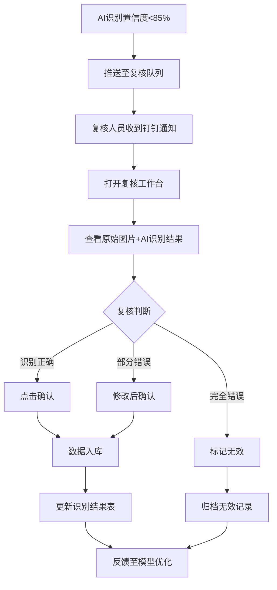
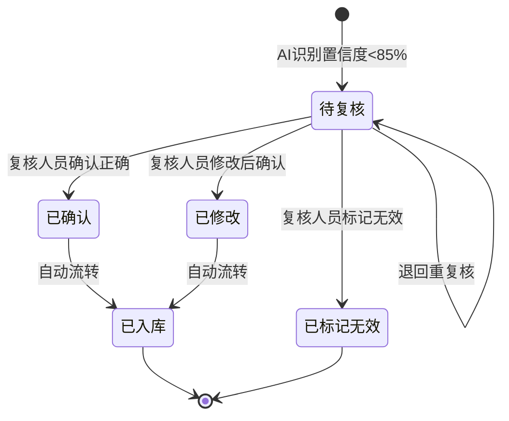

# AI拍照市调系统 · 人工复核工作台功能设计

***

## 文档信息

| 项目   | 内容                   |
| ---- | -------------------- |
| 文档编号 | PRD-FN-002-2026-001 |
| 文档版本 | v0.1                 |
| 产品名称 | AI拍照市调系统             |
| 所属系统 | AI拍照市调系统             |
| 编制日期 | 2026-06-12       |
| 编制人员 | 周先虎               |

### 修订记录

| 版本   | 修订日期           | 修订说明 | 修订人    |
| ---- | -------------- | ---- | ------ |
| v0.1 | 2026-06-12 | 初稿创建 | 周先虎 |

***

> **文档使用说明**
>
> - `【替换】` 标记的内容：使用时替换为实际业务内容
> - `【删除】` 标记的内容：仅为填写说明，完成后删除
> - 本模板供 AI 开发智能体读取，请保持结构完整

> **文档撰写规范（重要）**
>
> 1. **严格遵循模板格式**：各章节表格字段必须与模板保持一致
> 2. **聚焦业务规则**：描述业务逻辑、数据约束、权限控制等，不写技术实现细节
> 3. **减少不必要的示例**：不写JSON/XML格式的报文示例
> 4. **页面布局与交互分离**：§四仅描述页面结构，§五描述业务规则

***

## 一、功能角色矩阵说明

### 1.1 功能描述

- **功能名称：** 人工复核工作台
- **所属模块：** 市调采集
- **功能描述：** AI识别置信度低于阈值（默认85%）的结果自动推送至复核工作台，复核人员查看原始图片和AI识别结果，进行确认、修改或标记无效操作，确保数据准确性。

### 1.2 角色权限总览

| 角色      | 功能权限                        | 数据权限   |
| ------- | --------------------------- | ------ |
| 复核人员 | 查看待复核列表、确认、修改、标记无效、导出复核记录 | 分配给自己的复核数据 |
| 单品运营 | 查看所有复核数据、分配复核任务、导出复核记录     | 全量数据   |
| 系统管理员 | 全功能权限，包括复核规则配置            | 全量数据   |

### 1.3 功能角色矩阵

| 功能点  | 复核人员 | 单品运营 | 系统管理员 |
| ---- | :-----: | :-----: | :-----: |
| 查看待复核列表 |    是    |    是    |    是    |
| 确认AI识别结果 |    是    |    否    |    是    |
| 修改识别字段 |    是    |    否    |    是    |
| 标记无效 |    是    |    否    |    是    |
| 分配复核任务 |    否    |    是    |    是    |
| 配置复核规则 |    否    |    否    |    是    |
| 导出复核记录 |    是    |    是    |    是    |

***

## 二、模块路径

钉钉AI表格应用 → AI拍照市调系统 → 人工复核工作台 → 复核列表

***

## 三、状态流转与流程图

### 3.1 业务流程图



### 3.2 状态流转图



***

## 四、页面布局

### 4.1 页面清单

|  序号 | 页面名称    | 页面类型   | 描述                           |
| :-: | ------- | ------ | ---------------------------- |
|  1  | 复核列表页面 | 主页面    | 展示待复核数据列表，支持筛选和操作          |
|  2  | 复核详情弹窗 | 弹窗     | 查看原始图片和AI识别结果，执行复核操作       |
|  3  | 修改字段弹窗 | 弹窗     | 修改AI识别的字段值                   |
|  4  | 复核记录导出弹窗 | 弹窗（可选） | 导出复核记录Excel                  |

***

### 4.2 复核列表页面布局

```
┌─────────────────────────────────────────────────────────────────┐
│  ← 人工复核工作台          待复核：12件                           │
├─────────────────────────────────────────────────────────────────┤
│  查询条件区                                                       │
│  ┌─────────────┐ ┌─────────────┐ ┌───────────┐ ┌──────┐ ┌──────┐│
│  │ 商品名称    │ │ 识别日期    │ │ 复核状态   │ │ 查询 │ │ 重置 ││
│  │ [输入框    ]│ │ [日期范围  ]│ │ [下拉框  ]│ │ 按钮 │ │ 按钮 ││
│  └─────────────┘ └─────────────┘ └───────────┘ └──────┘ └──────┘│
├─────────────────────────────────────────────────────────────────┤
│  工具栏区    [导出复核记录]                                        │
├─────────────────────────────────────────────────────────────────┤
│  列表数据区                                                       │
│  ┌────┬──────────┬──────────┬──────┬──────────┬────────┐      │
│  │ 序号 │ 商品名称  │ 竞对门店  │ 置信度│ 提交时间  │ 操作   │      │
│  ├────┼──────────┼──────────┼──────┼──────────┼────────┤      │
│  │  1  │ 红颜草莓  │ 百果园-朝阳│ 78%  │ 10:30    │ [复核] │      │
│  │  2  │ 智利车厘子 │ 百果园-海淀│ 65%  │ 10:25    │ [复核] │      │
│  │  3  │ 新疆香梨  │ 鲜丰-西城 │ 82%  │ 10:20    │ [复核] │      │
│  └────┴──────────┴──────────┴──────┴──────────┴────────┘      │
├─────────────────────────────────────────────────────────────────┤
│  分页区    [< 1 2 3 >]  [每页 20 ▼]  共 156 条                   │
└─────────────────────────────────────────────────────────────────┘
```

### 4.2.1 查询条件区

| 组件名称    | 组件类型 | 位置 | 提示语            | 说明        |
| ------- | ---- | -- | -------------- | --------- |
| 商品名称    | 输入框  | 居左 | 提示"请输入商品名称" | 模糊查询      |
| 识别日期    | 日期范围 | 居左 | — | 精确到日期范围 |
| 复核状态    | 下拉框  | 居左 | 提示"请选择复核状态" | 枚举：待复核/已确认/已修改/已标记无效 |
| 查询      | 按钮   | 居右 | —              | 主按钮       |
| 重置      | 按钮   | 居右 | —              | 次按钮       |

### 4.2.2 工具栏区

| 组件名称 | 组件类型 | 位置 | 提示语 | 说明          |
| ---- | ---- | -- | --- | ----------- |
| 导出复核记录 | 按钮   | 居右 | —   | 导出当前查询结果 |

### 4.2.3 列表展示区

| 字段      | 组件类型 | 位置 | 说明                |
| ------- | ---- | -- | ----------------- |
| 序号      | 文本   | 居中 | —                 |
| 商品名称    | 文本   | 居左 | AI识别的商品名称       |
| 竞对门店    | 文本   | 居左 | 市调门店名称          |
| 置信度     | 文本   | 居中 | 百分比展示，低于85%标红    |
| 提交时间    | 文本   | 居左 | 格式：MM-DD HH:mm   |
| 操作      | 按钮组  | 居中 | [复核]             |

***

### 4.3 复核详情弹窗布局

```
┌───────────────────────────────────────────────────────────────┐
│  人工复核 - 3/12                                        [X]  │
├───────────────────────────────────────────────────────────────┤
│                                                               │
│  ┌────────────────┐  AI 识别结果                               │
│  │                │  ──────────────────                       │
│  │                │  商品名称：[红颜草莓        ]               │
│  │  原始图片       │  规格：    [300g/盒         ]               │
│  │  (可缩放查看)   │  原价：    [29.9            ]               │
│  │                │  促销价：  [19.9            ]               │
│  │                │  会员价：  [17.9            ]               │
│  │                │  促销信息：[会员专享价        ]               │
│  │                │  品类：    [水果-莓果类       ]               │
│  │                │  总体置信度：78% ⚠️                          │
│  └────────────────┘                                           │
│                                                               │
│  置信度详情：                                                   │
│  商品名称：78%  价格：98%  规格：65%  促销信息：72%               │
│                                                               │
│  ─────────────────────────────────────────────────            │
│  操作记录：                                                     │
│  2026-06-12 10:30:25  AI识别完成，置信度78%，推送复核            │
│                                                               │
│  [ ✅ 确认 ]    [ ✏️ 修改 ]    [ ❌ 标记无效 ]                   │
│                                                               │
│  ─────────────────────────────────────────────                │
│  上一张 ←  3/12  → 下一张                                       │
└───────────────────────────────────────────────────────────────┘
```

### 4.3.1 表单字段说明

| 字段      | 组件类型 | 位置   | 提示语            | 说明        |
| ------- | ---- | ---- | -------------- | --------- |
| 原始图片    | 图片   | 居左 | — | 支持缩放查看，只读 |
| 商品名称    | 输入框  | 居右 | 提示"请输入商品名称" | 可编辑，必填\* |
| 规格      | 输入框  | 居右 | 提示"请输入规格" | 可编辑，必填\* |
| 原价      | 输入框  | 居右 | 提示"请输入原价" | 可编辑，必填\*，数字类型 |
| 促销价     | 输入框  | 居右 | 提示"请输入促销价" | 可编辑，非必填，数字类型 |
| 会员价     | 输入框  | 居右 | 提示"请输入会员价" | 可编辑，非必填，数字类型 |
| 促销信息    | 输入框  | 居右 | 提示"请输入促销信息" | 可编辑，非必填 |
| 品类      | 输入框  | 居右 | 提示"请输入品类" | 可编辑，非必填 |
| 总体置信度   | 文本   | 居右 | — | 只读，系统计算 |

### 4.3.2 按钮区

| 按钮 | 组件类型 | 位置 | 说明       |
| -- | ---- | -- | -------- |
| 确认 | 按钮   | 居左 | 确认AI识别结果正确 |
| 修改 | 按钮   | 居左 | 修改后确认 |
| 标记无效 | 按钮   | 居左 | 标记为无效记录 |

***

### 4.4 修改字段弹窗布局

```
┌─────────────────────────────────────────────────┐
│  修改识别字段                              [X]  │
├─────────────────────────────────────────────────┤
│                                                 │
│  商品名称：[红颜草莓                            ]  │
│  规格：    [300g/盒                             ]  │
│  原价：    [29.9                                ]  │
│  促销价：  [19.9                                ]  │
│  会员价：  [17.9                                ]  │
│  促销信息：[会员专享价                           ]  │
│  品类：    [水果-莓果类                          ]  │
│                                                 │
│  修改原因：[                                    ]  │
│           [                                    ]  │
│                                                 │
│                              [取消]  [确定修改]   │
└─────────────────────────────────────────────────┘
```

### 4.4.1 表单字段说明

| 字段      | 组件类型 | 位置   | 提示语            | 说明        |
| ------- | ---- | ---- | -------------- | --------- |
| 商品名称    | 输入框  | 独占一行 | 提示"请输入商品名称" | 必填\*，预填AI识别值 |
| 规格      | 输入框  | 独占一行 | 提示"请输入规格" | 必填\*，预填AI识别值 |
| 原价      | 输入框  | 独占一行 | 提示"请输入原价" | 必填\*，数字类型，预填AI识别值 |
| 促销价     | 输入框  | 独占一行 | 提示"请输入促销价" | 非必填，数字类型，预填AI识别值 |
| 会员价     | 输入框  | 独占一行 | 提示"请输入会员价" | 非必填，数字类型，预填AI识别值 |
| 促销信息    | 输入框  | 独占一行 | 提示"请输入促销信息" | 非必填，预填AI识别值 |
| 品类      | 输入框  | 独占一行 | 提示"请输入品类" | 非必填，预填AI识别值 |
| 修改原因    | 文本域  | 独占一行 | 提示"请输入修改原因" | 必填\*，至少5个字符 |

### 4.4.2 按钮区

| 按钮 | 组件类型 | 位置 | 说明       |
| -- | ---- | -- | -------- |
| 取消 | 按钮   | 居右 | 关闭弹窗，不保存修改 |
| 确定修改 | 按钮   | 居右 | 保存修改，灰化→合规后可用 |

***

## 五、页面交互说明

### 5.1 复核列表页面交互说明

#### 5.1.1 字段交互规则

| 字段        | 类型  | 是否必填 | 约束规则                  | 展示规则 | 举例或枚举       |
| --------- | --- | :--: | --------------------- | ---- | ----------- |
| 商品名称    | 输入框 |   否  | 支持模糊查询，最大50字符  | 明文   | 红颜草莓         |
| 识别日期    | 日期范围 |   否  | 精确到日期范围 | 明文   | 2026-06-01 ~ 2026-06-12 |
| 复核状态    | 下拉框 |   否  | 精确查询，枚举值见数据字典 | 明文   | 待复核/已确认     |

#### 5.1.2 操作交互逻辑

| 操作类型 | 触发操作     | 交互可用性       | 正向输出                                        | 异常场景                                           | 异常处理             | 日志级别 |
| ---- | -------- | ----------- | ------------------------------------------- | ---------------------------------------------- | ---------------- | ---- |
| 查询   | 点击"查询"   | 始终可用        | 按条件筛选，结果在列表中展示，分页同步更新                       | 无                                              | 无                | 接口级  |
| 重置   | 点击"重置"   | 始终可用        | 清空所有筛选条件，恢复初始查询状态                           | 无                                              | 无                | 接口级  |
| 复核   | 点击"复核"   | 始终可用        | 打开复核详情弹窗                                 | 无                                              | 无                | 接口级  |
| 导出   | 点击"导出"   | 始终可用        | 导出当前查询结果Excel文件                            | 无数据                                            | Toast提示"暂无数据可导出" | 接口级  |

> **导出文件命名规范**：
>
> - 格式：`{业务前缀}_{YYYYMMDD}_{HHMMSS}.xlsx`
> - 示例：`复核记录_20260612_103045.xlsx`

***

### 5.2 复核详情弹窗交互说明

#### 5.2.1 字段交互规则

| 字段        | 类型 | 是否必填 | 约束规则                       | 展示规则                | 举例或枚举       |
| ------------- | -- | :--: | -------------------------- | ------------------- | ----------- |
| 商品名称       | 文本 |   是  | 支持1-100个字符，不能为空 | 可编辑，预填AI识别值 | 红颜草莓 |
| 规格       | 文本 |   是  | 支持1-50个字符，不能为空 | 可编辑，预填AI识别值 | 300g/盒 |
| 原价       | 数字 |   是  | 大于0，最多2位小数 | 可编辑，预填AI识别值 | 29.9 |
| 促销价       | 数字 |   否  | 大于0，最多2位小数；可为空 | 可编辑，预填AI识别值 | 19.9 |
| 会员价       | 数字 |   否  | 大于0，最多2位小数；可为空 | 可编辑，预填AI识别值 | 17.9 |
| 促销信息       | 文本 |   否  | 支持1-200个字符 | 可编辑，预填AI识别值 | 会员专享价 |
| 品类       | 文本 |   否  | 支持1-100个字符 | 可编辑，预填AI识别值 | 水果-莓果类 |

#### 5.2.2 操作交互逻辑

| 操作类型 | 触发操作      | 交互可用性       | 正向输出                    | 异常场景 | 异常处理               | 日志级别 |
| ---- | --------- | ----------- | ----------------------- | ---- | ------------------ | ---- |
| 确认 | 点击"确认"按钮 | 必填字段全部合规后可用 | 弹窗关闭，列表刷新，Toast提示"确认成功" | 确认失败 | Toast提示"操作失败，请重试！" | 接口级  |
| 修改 | 点击"修改"按钮 | 始终可用 | 打开修改字段弹窗 | 无 | 无 | 接口级  |
| 标记无效 | 点击"标记无效"按钮 | 始终可用 | 弹窗关闭，列表刷新，Toast提示"已标记为无效" | 标记失败 | Toast提示"操作失败，请重试！" | 接口级  |
| 上一张/下一张 | 点击导航按钮 | 始终可用 | 切换显示上一条/下一条待复核记录 | 已到第一条/最后一条 | 按钮灰化不可点击 | 不记录  |
| 关闭   | 点击右上角\[X] | 始终可用        | 关闭弹窗，返回列表页面            | 无    | 无                  | 不记录  |

#### 5.2.3 弹窗说明

| 规则项  | 说明                                   |
| ---- | ------------------------------------ |
| 打开方式 | 点击列表页操作列"复核"按钮                    |
| 标题   | 显示"人工复核 - 当前序号/总数"                  |
| 数据反显 | 所有字段预填AI识别结果，可编辑修改               |
| 校验时机 | 字段失焦时触发单字段校验；点击"确认"时触发全量校验           |
| 保存规则 | 全部校验通过后提交保存；校验失败时字段下方显示红色提示文本，字段边框变红 |
| 关闭确认 | 如有未保存的修改，关闭时弹出二次确认"是否放弃修改？"          |

***

### 5.3 修改字段弹窗交互说明

#### 5.3.1 字段交互规则

| 字段        | 类型 | 是否必填 | 约束规则                       | 展示规则                | 举例或枚举       |
| ------------- | -- | :--: | -------------------------- | ------------------- | ----------- |
| 商品名称       | 文本 |   是  | 支持1-100个字符，不能为空 | 可编辑，预填当前值 | 红颜草莓 |
| 规格       | 文本 |   是  | 支持1-50个字符，不能为空 | 可编辑，预填当前值 | 300g/盒 |
| 原价       | 数字 |   是  | 大于0，最多2位小数 | 可编辑，预填当前值 | 29.9 |
| 促销价       | 数字 |   否  | 大于0，最多2位小数；可为空 | 可编辑，预填当前值 | 19.9 |
| 会员价       | 数字 |   否  | 大于0，最多2位小数；可为空 | 可编辑，预填当前值 | 17.9 |
| 促销信息       | 文本 |   否  | 支持1-200个字符 | 可编辑，预填当前值 | 会员专享价 |
| 品类       | 文本 |   否  | 支持1-100个字符 | 可编辑，预填当前值 | 水果-莓果类 |
| 修改原因       | 文本域 |   是  | 至少5个字符，最多500个字符 | 明文 | — |

#### 5.3.2 操作交互逻辑

| 操作类型 | 触发操作      | 交互可用性       | 正向输出                    | 异常场景 | 异常处理               | 日志级别 |
| ---- | --------- | ----------- | ----------------------- | ---- | ------------------ | ---- |
| 确定修改 | 点击"确定修改"按钮 | 必填字段全部合规后可用 | 弹窗关闭，列表刷新，Toast提示"修改成功" | 修改失败 | Toast提示"修改失败，请重试！" | 接口级  |
| 取消   | 点击"取消"按钮  | 始终可用        | 关闭弹窗，不保存任何数据            | 无    | 无                  | 不记录  |
| 关闭   | 点击右上角\[X] | 始终可用        | 关闭弹窗，不保存任何数据            | 无    | 无                  | 不记录  |

#### 5.3.3 弹窗说明

| 规则项  | 说明                                   |
| ---- | ------------------------------------ |
| 打开方式 | 点击复核详情弹窗"修改"按钮                    |
| 标题   | 显示"修改识别字段"                        |
| 数据反显 | 所有字段预填当前复核详情弹窗中的值（可能是AI识别值或已修改值） |
| 校验时机 | 字段失焦时触发单字段校验；点击"确定修改"时触发全量校验           |
| 保存规则 | 全部校验通过后提交保存；校验失败时字段下方显示红色提示文本，字段边框变红 |
| 关闭确认 | 如有未保存的修改，关闭时弹出二次确认"是否放弃修改？"          |

***

## 六、错误处理规范

### 6.1 表单校验错误

- 显示方式：对应字段下方显示红色提示文本，字段边框变红
- 触发时机：表单提交时触发全量校验；字段失去焦点时触发单字段校验

| 字段      | 为空时错误信息     | 格式错误时信息           |
| ------- | ----------- | ----------------- |
| 商品名称 | 商品名称不能为空 | 商品名称长度不能超过100个字符 |
| 规格 | 规格不能为空 | 规格长度不能超过50个字符 |
| 原价 | 原价不能为空 | 原价必须为大于0的数字，最多2位小数 |
| 促销价 | — | 促销价必须为大于0的数字，最多2位小数 |
| 会员价 | — | 会员价必须为大于0的数字，最多2位小数 |
| 修改原因 | 修改原因不能为空 | 修改原因至少5个字符 |

### 6.2 操作错误

| 场景      | 触发条件                         | 提示文案                    | 处理方式                       |
| ------- | ---------------------------- | ----------------------- | -------------------------- |
| 确认失败   | 接口请求失败                       | 操作失败，请重试！              | Toast提示                   |
| 修改失败   | 接口请求失败                       | 修改失败，请重试！              | Toast提示                   |
| 标记无效失败 | 接口请求失败                       | 操作失败，请重试！              | Toast提示                   |
| 网络异常   | 接口请求超时                       | 网络异常，请稍候再试            | Toast提示                   |

***

## 七、非功能性需求

### 7.1 合规与安全要求

| 适用规范       | 内容摘要              | 本模块特有说明                    |
| ---------- | ----------------- | -------------------------- |
| 访问控制   | RBAC最小权限、数据权限隔离   | 复核人员仅可操作分配给自己的复核数据         |
| 操作日志   | 字段级日志、保留期限、不可篡改   | 覆盖操作：确认/修改/标记无效，修改需记录修改原因 |
| 敏感数据脱敏 | 各字段脱敏规则           | 本模块无敏感字段                  |
| 文件操作安全 | 导出上限、下载鉴权、导出行为记日志 | 单次导出上限1000条；导出记录写入操作日志      |

### 7.2 性能需求

| 需求项       | 指标要求          | 说明            |
| --------- | ------------- | ------------- |
| 列表查询响应时间  | ≤ 2秒          | 正常网络条件下，含分页查询 |
| 保存/提交响应时间 | ≤ 3秒          | 确认/修改/标记无效等写操作 |
| 导出响应时间    | ≤ 5秒（1000条以内） | 超出时建议提示异步处理   |
| 页面首屏加载时间  | ≤ 3秒          | —             |
| 并发用户数     | 20人           | 同时操作复核工作台     |

***

## 八、特殊说明

### 8.1 复核分配规则

1. **自动分配**：AI识别置信度低于阈值的结果自动进入复核队列，按提交时间排序
2. **手动分配**：单品运营可将复核任务分配给指定复核人员
3. **优先级**：置信度越低优先级越高，优先展示

### 8.2 复核时效要求

1. **常规时效**：复核任务应在提交后24小时内完成复核
2. **超时提醒**：超过12小时未复核，系统自动发送提醒通知
3. **超时升级**：超过24小时未复核，自动升级通知至单品运营

### 8.3 修改记录规则

1. **修改留痕**：所有修改操作必须记录修改原因
2. **修改对比**：修改后的值与AI原始识别值进行对比展示
3. **修改统计**：定期统计修改率，用于优化AI模型Prompt

### 8.4 复核工作台与钉钉AI表格集成

1. **复核视图**：在钉钉AI表格中创建专门的复核视图，筛选置信度<85%的记录
2. **状态同步**：复核完成后自动更新AI表格中的复核状态字段
3. **通知推送**：通过钉钉机器人推送复核通知和超时提醒

***

## 九、数据字典

### 9.1 字典项定义

**复核状态（reviewStatus）**

| 枚举值（code） | 显示文本（label） | 说明     |
| :-------: | ----------- | ------ |
|     PENDING     | 待复核     | AI识别置信度<85%，等待人工复核 |
|     CONFIRMED     | 已确认     | 复核人员确认AI识别结果正确 |
|     MODIFIED     | 已修改     | 复核人员修改了部分字段后确认 |
|     INVALID     | 已标记无效     | 复核人员标记为无效记录 |

**置信度等级（confidenceLevel）**

| 枚举值（code） | 显示文本（label） | 说明     |
| :-------: | ----------- | ------ |
|     HIGH     | 高置信度     | ≥ 90%     |
|     MEDIUM     | 中置信度     | 85%-89%     |
|     LOW     | 低置信度     | < 85%     |

### 9.2 下拉框数据来源说明

| 字段名     | 数据来源类型 | 来源说明                        |
| ------- | ------ | --------------------------- |
| 复核状态   | 字典项    | 参见 9.1 reviewStatus            |

***

## 十、外部系统接口说明

### 10.1 接口清单

| 接口名称    | 功能描述           | 交互方向     | 依赖系统     | 数据流向                    |
| ------- | -------------- | -------- | -------- | ----------------------- |
| 复核结果提交接口 | 提交复核结果（确认/修改/无效） | 调用      | 钉钉AI表格  | 本系统→钉钉AI表格              |
| 复核通知接口 | 推送复核通知至复核人员 | 调用      | 钉钉消息服务  | 本系统→钉钉消息服务→用户          |
| 模型优化反馈接口 | 将复核结果反馈至模型优化 | 调用      | 模型训练系统  | 本系统→模型训练系统              |

### 10.2 接口详细说明

**复核结果提交接口**

| 规则项  | 说明                    |
| ---- | --------------------- |
| 触发时机 | 复核人员点击"确认"/"修改"/"标记无效"按钮时 |
| 请求条件 | 复核详情弹窗中必填字段全部合规 |
| 成功处理 | 更新识别结果表中的复核状态，数据入库 |
| 失败处理 | 状态保持不变，提示用户重试 |
| 重试机制 | 不自动重试，由用户手动重试           |

**复核通知接口**

| 规则项  | 说明                    |
| ---- | --------------------- |
| 触发时机 | AI识别置信度<85%时自动触发      |
| 请求条件 | 存在待复核任务              |
| 成功处理 | 复核人员收到钉钉通知            |
| 失败处理 | 记录失败日志，5分钟后重试        |
| 重试机制 | 自动重试3次，间隔5分钟          |

***

*文档结束*
