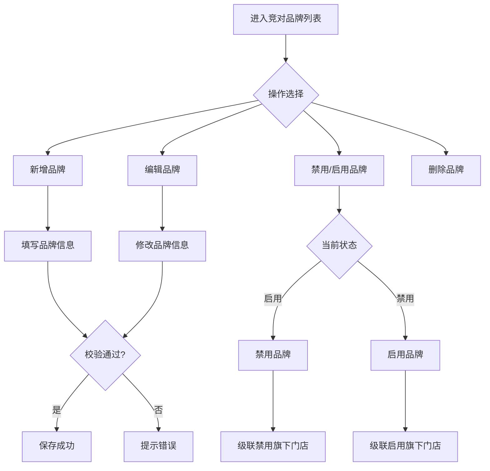
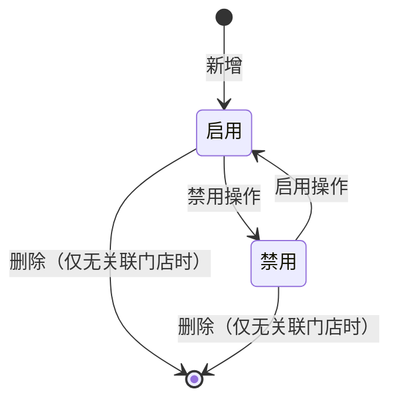

# AI拍照市调系统 · 基础数据管理功能设计

***

## 文档信息

| 项目   | 内容                   |
| ---- | -------------------- |
| 文档编号 | PRD-FN-004-2026-001 |
| 文档版本 | v0.1                 |
| 产品名称 | AI拍照市调系统             |
| 所属系统 | AI拍照市调系统             |
| 编制日期 | 2026-06-12       |
| 编制人员 | 周先虎               |

### 修订记录

| 版本   | 修订日期           | 修订说明 | 修订人    |
| ---- | -------------- | ---- | ------ |
| v0.1 | 2026-06-12 | 初稿创建 | 周先虎 |

***

> **文档使用说明**
>
> - `【替换】` 标记的内容：使用时替换为实际业务内容
> - `【删除】` 标记的内容：仅为填写说明，完成后删除
> - 本模板供 AI 开发智能体读取，请保持结构完整

> **文档撰写规范（重要）**
>
> 1. **严格遵循模板格式**：各章节表格字段必须与模板保持一致
> 2. **聚焦业务规则**：描述业务逻辑、数据约束、权限控制等，不写技术实现细节
> 3. **减少不必要的示例**：不写JSON/XML格式的报文示例
> 4. **页面布局与交互分离**：§四仅描述页面结构，§五描述业务规则

***

## 一、功能角色矩阵说明

### 1.1 功能描述

- **功能名称：** 基础数据管理
- **所属模块：** 系统管理
- **功能描述：** 管理竞对品牌、竞对门店、竞品商品主数据，为市调采集和数据分析提供基础数据支撑。

### 1.2 角色权限总览

| 角色      | 功能权限                        | 数据权限   |
| ------- | --------------------------- | ------ |
| 单品运营 | 查看竞对品牌/门店/商品，新增/编辑竞对品牌/门店    | 全量数据   |
| 系统管理员 | 全功能权限，包括删除和禁用操作            | 全量数据   |
| 市调人员 | 仅查看竞对品牌/门店（用于市调采集时选择）      | 全量数据（只读） |
| 采购人员 | 查看竞对品牌/门店/商品                   | 全量数据（只读） |

### 1.3 功能角色矩阵

| 功能点  | 单品运营 | 系统管理员 | 市调人员 | 采购人员 |
| ---- | :-----: | :-----: | :-----: | :-----: |
| 查看竞对品牌 |    是    |    是    |    是    |    是    |
| 新增/编辑竞对品牌 |    是    |    是    |    否    |    否    |
| 删除/禁用竞对品牌 |    否    |    是    |    否    |    否    |
| 查看竞对门店 |    是    |    是    |    是    |    是    |
| 新增/编辑竞对门店 |    是    |    是    |    否    |    否    |
| 删除/禁用竞对门店 |    否    |    是    |    否    |    否    |
| 查看商品库 |    是    |    是    |    否    |    是    |
| 新增/编辑商品 |    是    |    是    |    否    |    否    |
| 导入/导出 |    是    |    是    |    否    |    否    |

***

## 二、模块路径

钉钉AI表格应用 → AI拍照市调系统 → 系统管理 → 竞对品牌管理/竞对门店管理/商品库管理

***

## 三、状态流转与流程图

### 3.1 竞对品牌管理流程



### 3.2 状态流转图



***

## 四、页面布局

### 4.1 页面清单

|  序号 | 页面名称    | 页面类型   | 描述                           |
| :-: | ------- | ------ | ---------------------------- |
|  1  | 竞对品牌列表页面 | 主页面    | 展示竞对品牌列表，支持查询、新增、编辑、禁用/启用    |
|  2  | 新增/编辑品牌弹窗 | 弹窗     | 新增或编辑竞对品牌信息                  |
|  3  | 竞对门店列表页面 | 主页面    | 展示竞对门店列表，支持查询、新增、编辑、禁用/启用    |
|  4  | 新增/编辑门店弹窗 | 弹窗     | 新增或编辑竞对门店信息                  |
|  5  | 商品库列表页面 | 主页面    | 展示竞品商品列表，支持查询、新增、编辑、导入/导出    |
|  6  | 新增/编辑商品弹窗 | 弹窗     | 新增或编辑竞品商品信息                  |
|  7  | 批量导入弹窗  | 弹窗     | 批量导入竞品商品数据                    |

***

### 4.2 竞对品牌列表页面布局

```
┌─────────────────────────────────────────────────────────────────┐
│  ← 竞对品牌管理                                                   │
├─────────────────────────────────────────────────────────────────┤
│  查询条件区                                                       │
│  ┌─────────────┐ ┌─────────────┐ ┌──────┐ ┌──────┐             │
│  │ 品牌名称    │ │ 状态       │ │ 查询 │ │ 重置 │             │
│  │ [输入框    ]│ │ [下拉框    ]│ │ 按钮 │ │ 按钮 │             │
│  └─────────────┘ └─────────────┘ └──────┘ └──────┘             │
├─────────────────────────────────────────────────────────────────┤
│  工具栏区    [+新增品牌]                                           │
├─────────────────────────────────────────────────────────────────┤
│  列表数据区                                                       │
│  ┌────┬──────────┬──────────┬──────────┬──────────┬────────┐  │
│  │ 序号 │ 品牌名称  │ 品牌编码  │ 状态     │ 关联门店数│ 操作   │  │
│  ├────┼──────────┼──────────┼──────────┼──────────┼────────┤  │
│  │  1  │ 百果园   │ BGY001  │ 启用     │ 15      │ [编辑] [禁用]│  │
│  │  2  │ 鲜丰水果  │ XFS001  │ 启用     │ 12      │ [编辑] [禁用]│  │
│  │  3  │ 叮咚买菜  │ DDM001  │ 禁用     │ 0       │ [编辑] [启用] [删除]│  │
│  └────┴──────────┴──────────┴──────────┴──────────┴────────┘  │
├─────────────────────────────────────────────────────────────────┤
│  分页区    [< 1 2 3 >]  [每页 20 ▼]  共 8 条                     │
└─────────────────────────────────────────────────────────────────┘
```

### 4.2.1 查询条件区

| 组件名称    | 组件类型 | 位置 | 提示语            | 说明        |
| ------- | ---- | -- | -------------- | --------- |
| 品牌名称    | 输入框  | 居左 | 提示"请输入品牌名称" | 模糊查询      |
| 状态      | 下拉框  | 居左 | 提示"请选择状态" | 枚举：启用/禁用/全部 |
| 查询      | 按钮   | 居右 | —              | 主按钮       |
| 重置      | 按钮   | 居右 | —              | 次按钮       |

### 4.2.2 工具栏区

| 组件名称 | 组件类型 | 位置 | 提示语 | 说明          |
| ---- | ---- | -- | --- | ----------- |
| 新增品牌 | 按钮   | 居左 | —   | 打开新增品牌弹窗 |

### 4.2.3 列表展示区

| 字段      | 组件类型 | 位置 | 说明                |
| ------- | ---- | -- | ----------------- |
| 序号      | 文本   | 居中 | —                 |
| 品牌名称    | 文本   | 居左 | —                 |
| 品牌编码    | 文本   | 居左 | 系统自动生成           |
| 状态      | 标签   | 居中 | 绿色=启用，灰色=禁用      |
| 关联门店数   | 文本   | 居中 | 该品牌下门店数量         |
| 操作      | 按钮组  | 居中 | [编辑] [禁用/启用] [删除] |

***

### 4.3 新增/编辑品牌弹窗布局

```
┌─────────────────────────────────────────────────┐
│  新增竞对品牌                              [X]  │
├─────────────────────────────────────────────────┤
│                                                 │
│  品牌名称：[                                    ]  │
│  品牌编码：[系统自动生成        ]                   │
│  品牌Logo：[点击上传图片        ]                   │
│                                                 │
│                              [取消]  [确定]      │
└─────────────────────────────────────────────────┘
```

### 4.3.1 表单字段说明

| 字段      | 组件类型 | 位置   | 提示语            | 说明        |
| ------- | ---- | ---- | -------------- | --------- |
| 品牌名称    | 输入框  | 独占一行 | 提示"请输入品牌名称" | 必填\*，2-50个字符，不可重复 |
| 品牌编码    | 文本   | 独占一行 | —              | 只读，系统自动生成 |
| 品牌Logo   | 图片上传 | 独占一行 | 提示"点击上传Logo" | 非必填，jpg/png格式，≤2MB |

### 4.3.2 按钮区

| 按钮 | 组件类型 | 位置 | 说明       |
| -- | ---- | -- | -------- |
| 取消 | 按钮   | 居右 | 关闭弹窗     |
| 确定 | 按钮   | 居右 | 灰化→合规后可用 |

***

### 4.4 竞对门店列表页面布局

```
┌─────────────────────────────────────────────────────────────────┐
│  ← 竞对门店管理                                                   │
├─────────────────────────────────────────────────────────────────┤
│  查询条件区                                                       │
│  ┌─────────────┐ ┌─────────────┐ ┌───────────┐ ┌──────┐ ┌──────┐│
│  │ 门店名称    │ │ 所属品牌    │ │ 状态      │ │ 查询 │ │ 重置 ││
│  │ [输入框    ]│ │ [下拉框    ]│ │ [下拉框  ]│ │ 按钮 │ │ 按钮 ││
│  └─────────────┘ └─────────────┘ └───────────┘ └──────┘ └──────┘│
├─────────────────────────────────────────────────────────────────┤
│  工具栏区    [+新增门店]                                           │
├─────────────────────────────────────────────────────────────────┤
│  列表数据区                                                       │
│  ┌────┬──────────┬──────────┬──────────┬──────────┬────────┐  │
│  │ 序号 │ 门店名称  │ 所属品牌  │ 门店地址  │ 状态     │ 操作   │  │
│  ├────┼──────────┼──────────┼──────────┼──────────┼────────┤  │
│  │  1  │ 百果园-朝阳│ 百果园   │ 朝阳区xx路 │ 启用     │ [编辑] [禁用]│  │
│  │  2  │ 百果园-海淀│ 百果园   │ 海淀区xx路 │ 启用     │ [编辑] [禁用]│  │
│  └────┴──────────┴──────────┴──────────┴──────────┴────────┘  │
├─────────────────────────────────────────────────────────────────┤
│  分页区    [< 1 2 3 >]  [每页 20 ▼]  共 27 条                    │
└─────────────────────────────────────────────────────────────────┘
```

### 4.4.1 查询条件区

| 组件名称    | 组件类型 | 位置 | 提示语            | 说明        |
| ------- | ---- | -- | -------------- | --------- |
| 门店名称    | 输入框  | 居左 | 提示"请输入门店名称" | 模糊查询      |
| 所属品牌    | 下拉框  | 居左 | 提示"请选择品牌" | 数据源来自竞对品牌表（启用状态） |
| 状态      | 下拉框  | 居左 | 提示"请选择状态" | 枚举：启用/禁用/全部 |
| 查询      | 按钮   | 居右 | —              | 主按钮       |
| 重置      | 按钮   | 居右 | —              | 次按钮       |

### 4.4.2 工具栏区

| 组件名称 | 组件类型 | 位置 | 提示语 | 说明          |
| ---- | ---- | -- | --- | ----------- |
| 新增门店 | 按钮   | 居左 | —   | 打开新增门店弹窗 |

### 4.4.3 列表展示区

| 字段      | 组件类型 | 位置 | 说明                |
| ------- | ---- | -- | ----------------- |
| 序号      | 文本   | 居中 | —                 |
| 门店名称    | 文本   | 居左 | —                 |
| 所属品牌    | 文本   | 居左 | —                 |
| 门店地址    | 文本   | 居左 | 超过20字符截断显示      |
| 状态      | 标签   | 居中 | 绿色=启用，灰色=禁用      |
| 操作      | 按钮组  | 居中 | [编辑] [禁用/启用] [删除] |

***

### 4.5 新增/编辑门店弹窗布局

```
┌─────────────────────────────────────────────────┐
│  新增竞对门店                              [X]  │
├─────────────────────────────────────────────────┤
│                                                 │
│  门店名称：[                                    ]  │
│  所属品牌：[请选择品牌              ▼]              │
│  门店地址：[                                    ]  │
│  所属区域：[请选择区域              ▼]              │
│  经度：    [                                    ]  │
│  纬度：    [                                    ]  │
│                                                 │
│                              [取消]  [确定]      │
└─────────────────────────────────────────────────┘
```

### 4.5.1 表单字段说明

| 字段      | 组件类型 | 位置   | 提示语            | 说明        |
| ------- | ---- | ---- | -------------- | --------- |
| 门店名称    | 输入框  | 独占一行 | 提示"请输入门店名称" | 必填\*，2-100个字符 |
| 所属品牌    | 下拉框  | 独占一行 | 提示"请选择品牌" | 必填\*，数据源来自竞对品牌表（启用状态） |
| 门店地址    | 输入框  | 独占一行 | 提示"请输入门店地址" | 必填\*，5-200个字符 |
| 所属区域    | 下拉框  | 独占一行 | 提示"请选择区域" | 非必填，枚举值见数据字典 |
| 经度      | 输入框  | 独占一行 | 提示"请输入经度" | 非必填，数字类型，-180~180 |
| 纬度      | 输入框  | 独占一行 | 提示"请输入纬度" | 非必填，数字类型，-90~90 |

### 4.5.2 按钮区

| 按钮 | 组件类型 | 位置 | 说明       |
| -- | ---- | -- | -------- |
| 取消 | 按钮   | 居右 | 关闭弹窗     |
| 确定 | 按钮   | 居右 | 灰化→合规后可用 |

***

### 4.6 商品库列表页面布局

```
┌─────────────────────────────────────────────────────────────────┐
│  ← 商品库管理                                                     │
├─────────────────────────────────────────────────────────────────┤
│  查询条件区                                                       │
│  ┌─────────────┐ ┌─────────────┐ ┌───────────┐ ┌──────┐ ┌──────┐│
│  │ 商品名称    │ │ 所属品类    │ │ 关联品牌   │ │ 查询 │ │ 重置 ││
│  │ [输入框    ]│ │ [下拉框    ]│ │ [下拉框  ]│ │ 按钮 │ │ 按钮 ││
│  └─────────────┘ └─────────────┘ └───────────┘ └──────┘ └──────┘│
├─────────────────────────────────────────────────────────────────┤
│  工具栏区    [+新增商品]  [批量导入]  [导出Excel]                   │
├─────────────────────────────────────────────────────────────────┤
│  列表数据区                                                       │
│  ┌────┬──────────┬──────────┬──────────┬──────────┬────────┐  │
│  │ 序号 │ 商品名称  │ 品类     │ 关联品牌  │ 最近价格  │ 操作   │  │
│  ├────┼──────────┼──────────┼──────────┼──────────┼────────┤  │
│  │  1  │ 红颜草莓  │ 水果-莓果类│ 百果园   │ 19.9    │ [编辑] [删除]│  │
│  │  2  │ 智利车厘子 │ 水果-核果类│ 鲜丰水果  │ 59.9    │ [编辑] [删除]│  │
│  └────┴──────────┴──────────┴──────────┴──────────┴────────┘  │
├─────────────────────────────────────────────────────────────────┤
│  分页区    [< 1 2 3 >]  [每页 20 ▼]  共 156 条                   │
└─────────────────────────────────────────────────────────────────┘
```

### 4.6.1 查询条件区

| 组件名称    | 组件类型 | 位置 | 提示语            | 说明        |
| ------- | ---- | -- | -------------- | --------- |
| 商品名称    | 输入框  | 居左 | 提示"请输入商品名称" | 模糊查询      |
| 所属品类    | 下拉框  | 居左 | 提示"请选择品类" | 枚举值见数据字典 |
| 关联品牌    | 下拉框  | 居左 | 提示"请选择品牌" | 数据源来自竞对品牌表 |
| 查询      | 按钮   | 居右 | —              | 主按钮       |
| 重置      | 按钮   | 居右 | —              | 次按钮       |

### 4.6.2 工具栏区

| 组件名称 | 组件类型 | 位置 | 提示语 | 说明          |
| ---- | ---- | -- | --- | ----------- |
| 新增商品 | 按钮   | 居左 | —   | 打开新增商品弹窗 |
| 批量导入 | 按钮   | 居左 | —   | 打开批量导入弹窗 |
| 导出Excel | 按钮   | 居右 | —   | 导出当前查询结果 |

### 4.6.3 列表展示区

| 字段      | 组件类型 | 位置 | 说明                |
| ------- | ---- | -- | ----------------- |
| 序号      | 文本   | 居中 | —                 |
| 商品名称    | 文本   | 居左 | —                 |
| 品类      | 文本   | 居左 | —                 |
| 关联品牌    | 文本   | 居左 | —                 |
| 最近价格    | 文本   | 居右 | 该商品最近一次促销价     |
| 操作      | 按钮组  | 居中 | [编辑] [删除]        |

***

### 4.7 新增/编辑商品弹窗布局

```
┌─────────────────────────────────────────────────┐
│  新增竞品商品                              [X]  │
├─────────────────────────────────────────────────┤
│                                                 │
│  商品名称：[                                    ]  │
│  品类：    [请选择品类              ▼]              │
│  关联品牌：[请选择品牌              ▼]              │
│  规格：    [                                    ]  │
│                                                 │
│                              [取消]  [确定]      │
└─────────────────────────────────────────────────┘
```

### 4.7.1 表单字段说明

| 字段      | 组件类型 | 位置   | 提示语            | 说明        |
| ------- | ---- | ---- | -------------- | --------- |
| 商品名称    | 输入框  | 独占一行 | 提示"请输入商品名称" | 必填\*，2-100个字符 |
| 品类      | 下拉框  | 独占一行 | 提示"请选择品类" | 必填\*，枚举值见数据字典 |
| 关联品牌    | 下拉框  | 独占一行 | 提示"请选择品牌" | 必填\*，数据源来自竞对品牌表（启用状态） |
| 规格      | 输入框  | 独占一行 | 提示"请输入规格" | 非必填，1-50个字符 |

### 4.7.2 按钮区

| 按钮 | 组件类型 | 位置 | 说明       |
| -- | ---- | -- | -------- |
| 取消 | 按钮   | 居右 | 关闭弹窗     |
| 确定 | 按钮   | 居右 | 灰化→合规后可用 |

***

### 4.8 批量导入弹窗布局

```
┌─────────────────────────────────────────────────┐
│  批量导入商品                              [X]  │
├─────────────────────────────────────────────────┤
│                                                 │
│  ┌─────────────────────────────────────────┐    │
│  │           点击或拖拽上传文件              │    │
│  │              [.xlsx 文件]                │    │
│  └─────────────────────────────────────────┘    │
│                                                 │
│  [下载导入模板]                                   │
│                                                 │
│                              [取消]  [导入]      │
└─────────────────────────────────────────────────┘
```

### 4.8.1 表单字段说明

| 字段名称    | 是否必填 | 填写规则     | 填写示例   |
| ------- | :--: | -------- | ------ |
| 商品名称 |   是  | 2-100个字符 | 红颜草莓 |
| 品类 |   是  | 参见数据字典 | 水果-莓果类 |
| 关联品牌 |   是  | 品牌名称需存在于系统中 | 百果园 |
| 规格 |   否  | 1-50个字符 | 300g/盒 |

### 4.8.2 操作交互逻辑

| 操作类型 | 触发操作       | 交互可用性   | 正向输出                          | 异常场景               | 异常处理                         | 日志级别 |
| ---- | ---------- | ------- | ----------------------------- | ------------------ | ---------------------------- | ---- |
| 选择文件 | 点击或拖拽上传    | 始终可用    | 展示文件名及删除按钮                    | 格式非.xlsx           | Toast提示"请上传正确格式的Excel文件"     | 不记录  |
| 确认导入 | 点击"导入"按钮   | 选择文件后可用 | 全部校验通过后一次性导入，展示"导入成功，共导入X条数据" | 文件超10MB            | Toast提示"文件大小不能超过10MB"        | 接口级  |
| 取消   | 点击"取消"按钮   | 始终可用    | 关闭弹窗                          | 数据校验失败（必填/格式/长度/唯一性等） | 遇错即停，Toast提示"第N行：【字段名】+错误原因" | 不记录  |
| 下载模板 | 点击"下载模板"链接 | 始终可用    | 下载批量导入模板.xlsx                 | 模板数据获取失败           | 弹出提示，同时停止下载                  | 不记录  |

### 4.8.3 弹窗说明

| 规则项  | 说明                                               |
| ---- | ------------------------------------------------ |
| 文件格式 | 仅支持 .xlsx 文件                                     |
| 文件大小 | 不超过 10MB                                         |
| 校验方式 | 逐行前置校验，遇错即停，不检查后续行，不执行导入                         |
| 成功提示 | "导入成功，共导入X条数据"                                   |
| 错误提示 | "第N行：【字段名】+错误原因，请修正后重新上传"                        |
| 模板结构 | Sheet1为导入数据（必填）；Sheet2为字典参考（只读，不参与导入）；按需增减 |

***

## 五、页面交互说明

### 5.1 竞对品牌列表页面交互说明

#### 5.1.1 字段交互规则

| 字段        | 类型  | 是否必填 | 约束规则                  | 展示规则 | 举例或枚举       |
| --------- | --- | :--: | --------------------- | ---- | ----------- |
| 品牌名称    | 输入框 |   否  | 支持模糊查询，最大50字符  | 明文   | 百果园          |
| 状态      | 下拉框 |   否  | 精确查询，枚举值见数据字典 | 明文   | 启用/禁用/全部    |

#### 5.1.2 操作交互逻辑

| 操作类型 | 触发操作     | 交互可用性       | 正向输出                                        | 异常场景                                           | 异常处理             | 日志级别 |
| ---- | -------- | ----------- | ------------------------------------------- | ---------------------------------------------- | ---------------- | ---- |
| 查询   | 点击"查询"   | 始终可用        | 按条件筛选，结果在列表中展示，分页同步更新                       | 无                                              | 无                | 接口级  |
| 重置   | 点击"重置"   | 始终可用        | 清空所有筛选条件，恢复初始查询状态                           | 无                                              | 无                | 接口级  |
| 新增   | 点击"新增品牌" | 始终可用        | 打开新增品牌弹窗                                 | 无                                              | 无                | 接口级  |
| 编辑   | 点击"编辑"   | 始终可用        | 打开编辑品牌弹窗，反显当前数据                           | 无                                              | 无                | 接口级  |
| 禁用/启用 | 点击"禁用"/"启用" | 始终可用    | 弹出确认弹窗；确认后切换状态，Toast提示"操作成功"               | 操作失败                                          | Toast提示"操作失败，请重试" | 接口级  |
| 删除   | 点击"删除"   | 无关联门店时可用 | 弹出确认弹窗"是否确认删除该品牌？"；确认后执行删除，刷新列表 | 存在关联门店时按钮灰化不可点击                                  | —                | 接口级  |

#### 5.1.3 弹窗说明

| 规则项  | 说明                                   |
| ---- | ------------------------------------ |
| 打开方式 | 点击"新增品牌"或"编辑"按钮                    |
| 标题   | 新增时显示"新增竞对品牌"；编辑时显示"编辑竞对品牌"      |
| 数据反显 | 编辑时自动回填当前品牌数据；新增时所有字段为空              |
| 校验时机 | 字段失焦时触发单字段校验；点击"确定"时触发全量校验           |
| 保存规则 | 全部校验通过后提交保存；校验失败时字段下方显示红色提示文本，字段边框变红 |
| 关闭确认 | 如有未保存的修改，关闭时弹出二次确认"是否放弃修改？"          |

***

### 5.2 竞对门店列表页面交互说明

#### 5.2.1 字段交互规则

| 字段        | 类型  | 是否必填 | 约束规则                  | 展示规则 | 举例或枚举       |
| --------- | --- | :--: | --------------------- | ---- | ----------- |
| 门店名称    | 输入框 |   否  | 支持模糊查询，最大100字符 | 明文   | 百果园-朝阳      |
| 所属品牌    | 下拉框 |   否  | 精确查询，数据源来自竞对品牌表 | 明文   | 百果园/鲜丰      |
| 状态      | 下拉框 |   否  | 精确查询，枚举值见数据字典 | 明文   | 启用/禁用/全部    |

#### 5.2.2 操作交互逻辑

| 操作类型 | 触发操作     | 交互可用性       | 正向输出                                        | 异常场景                                           | 异常处理             | 日志级别 |
| ---- | -------- | ----------- | ------------------------------------------- | ---------------------------------------------- | ---------------- | ---- |
| 查询   | 点击"查询"   | 始终可用        | 按条件筛选，结果在列表中展示，分页同步更新                       | 无                                              | 无                | 接口级  |
| 重置   | 点击"重置"   | 始终可用        | 清空所有筛选条件，恢复初始查询状态                           | 无                                              | 无                | 接口级  |
| 新增   | 点击"新增门店" | 始终可用        | 打开新增门店弹窗                                 | 无                                              | 无                | 接口级  |
| 编辑   | 点击"编辑"   | 始终可用        | 打开编辑门店弹窗，反显当前数据                           | 无                                              | 无                | 接口级  |
| 禁用/启用 | 点击"禁用"/"启用" | 始终可用    | 弹出确认弹窗；确认后切换状态，Toast提示"操作成功"               | 操作失败                                          | Toast提示"操作失败，请重试" | 接口级  |
| 删除   | 点击"删除"   | 无关联数据时可用 | 弹出确认弹窗"是否确认删除该门店？"；确认后执行删除，刷新列表 | 存在关联数据时按钮灰化不可点击                                  | —                | 接口级  |

#### 5.2.3 弹窗说明

| 规则项  | 说明                                   |
| ---- | ------------------------------------ |
| 打开方式 | 点击"新增门店"或"编辑"按钮                    |
| 标题   | 新增时显示"新增竞对门店"；编辑时显示"编辑竞对门店"      |
| 数据反显 | 编辑时自动回填当前门店数据；新增时所有字段为空              |
| 校验时机 | 字段失焦时触发单字段校验；点击"确定"时触发全量校验           |
| 保存规则 | 全部校验通过后提交保存；校验失败时字段下方显示红色提示文本，字段边框变红 |
| 关闭确认 | 如有未保存的修改，关闭时弹出二次确认"是否放弃修改？"          |

***

### 5.3 商品库列表页面交互说明

#### 5.3.1 字段交互规则

| 字段        | 类型  | 是否必填 | 约束规则                  | 展示规则 | 举例或枚举       |
| --------- | --- | :--: | --------------------- | ---- | ----------- |
| 商品名称    | 输入框 |   否  | 支持模糊查询，最大100字符 | 明文   | 红颜草莓         |
| 所属品类    | 下拉框 |   否  | 精确查询，枚举值见数据字典 | 明文   | 水果-莓果类      |
| 关联品牌    | 下拉框 |   否  | 精确查询，数据源来自竞对品牌表 | 明文   | 百果园/鲜丰      |

#### 5.3.2 操作交互逻辑

| 操作类型 | 触发操作     | 交互可用性       | 正向输出                                        | 异常场景                                           | 异常处理             | 日志级别 |
| ---- | -------- | ----------- | ------------------------------------------- | ---------------------------------------------- | ---------------- | ---- |
| 查询   | 点击"查询"   | 始终可用        | 按条件筛选，结果在列表中展示，分页同步更新                       | 无                                              | 无                | 接口级  |
| 重置   | 点击"重置"   | 始终可用        | 清空所有筛选条件，恢复初始查询状态                           | 无                                              | 无                | 接口级  |
| 新增   | 点击"新增商品" | 始终可用        | 打开新增商品弹窗                                 | 无                                              | 无                | 接口级  |
| 编辑   | 点击"编辑"   | 始终可用        | 打开编辑商品弹窗，反显当前数据                           | 无                                              | 无                | 接口级  |
| 删除   | 点击"删除"   | 始终可用        | 弹出确认弹窗"是否确认删除该商品？"；确认后执行删除，刷新列表       | 删除失败                                          | Toast提示"删除失败，请重试" | 接口级  |
| 导入   | 点击"批量导入" | 始终可用        | 打开批量导入弹窗，支持上传Excel文件完成批量录入；全部数据校验通过后一次性导入 | 存在校验错误时，遇错即停不执行导入，提示"第N行：【字段名】+错误原因"；修正后重新上传校验 | Toast提示第一个错误 | 接口级  |
| 导出   | 点击"导出"   | 始终可用        | 导出当前查询结果Excel文件                            | 无数据                                            | Toast提示"暂无数据可导出" | 接口级  |

> **导出文件命名规范**：
>
> - 格式：`{业务前缀}_{YYYYMMDD}_{HHMMSS}.xlsx`
> - 示例：`商品库_20260612_103045.xlsx`
> - 导入模板：使用固定名称 `商品库批量导入模板.xlsx`（不带时间戳）

#### 5.3.3 弹窗说明

| 规则项  | 说明                                   |
| ---- | ------------------------------------ |
| 打开方式 | 点击"新增商品"或"编辑"按钮                    |
| 标题   | 新增时显示"新增竞品商品"；编辑时显示"编辑竞品商品"      |
| 数据反显 | 编辑时自动回填当前商品数据；新增时所有字段为空              |
| 校验时机 | 字段失焦时触发单字段校验；点击"确定"时触发全量校验           |
| 保存规则 | 全部校验通过后提交保存；校验失败时字段下方显示红色提示文本，字段边框变红 |
| 关闭确认 | 如有未保存的修改，关闭时弹出二次确认"是否放弃修改？"          |

***

## 六、错误处理规范

### 6.1 表单校验错误

- 显示方式：对应字段下方显示红色提示文本，字段边框变红
- 触发时机：表单提交时触发全量校验；字段失去焦点时触发单字段校验

| 字段      | 为空时错误信息     | 格式错误时信息           |
| ------- | ----------- | ----------------- |
| 品牌名称 | 品牌名称不能为空 | 品牌名称长度不能超过50个字符 |
| 门店名称 | 门店名称不能为空 | 门店名称长度不能超过100个字符 |
| 门店地址 | 门店地址不能为空 | 门店地址长度不能超过200个字符 |
| 商品名称 | 商品名称不能为空 | 商品名称长度不能超过100个字符 |
| 品类 | 请选择品类 | — |
| 关联品牌 | 请选择品牌 | — |

### 6.2 操作错误

| 场景      | 触发条件                         | 提示文案                    | 处理方式                       |
| ------- | ---------------------------- | ----------------------- | -------------------------- |
| 品牌保存失败 | 品牌名称已存在                     | 品牌名称已存在，请使用其他名称       | Toast提示，阻断保存              |
| 品牌删除失败 | 存在关联门店                      | 该品牌下存在门店，无法删除         | Toast提示，阻断删除              |
| 门店保存失败 | 接口请求失败                       | 保存失败，请重试！              | Toast提示                   |
| 商品保存失败 | 接口请求失败                       | 保存失败，请重试！              | Toast提示                   |
| 导入格式错误 | 上传非 .xlsx 文件                 | 请上传正确格式的 Excel 文件       | Toast 提示，阻断上传              |
| 导入文件过大 | 文件超过 10MB                    | 文件大小不能超过 10MB           | Toast 提示，阻断上传              |
| 导入校验失败 | 数据存在校验错误（必填/格式/长度/关联数据等） | 第N行：【字段名】+错误原因，请修正后重新上传 | 遇错即停，不执行任何数据导入；用户修正后重新上传校验 |
| 网络异常   | 接口请求超时                       | 网络异常，请稍候再试            | Toast提示                   |

***

## 七、非功能性需求

### 7.1 合规与安全要求

| 适用规范       | 内容摘要              | 本模块特有说明                    |
| ---------- | ----------------- | -------------------------- |
| 访问控制   | RBAC最小权限、数据权限隔离   | 仅单品运营和管理员可管理基础数据；市调人员和采购人员仅可查看 |
| 操作日志   | 字段级日志、保留期限、不可篡改   | 覆盖操作：品牌/门店/商品的新增/编辑/删除/导入/导出 |
| 文件操作安全 | 导出上限、下载鉴权、导出行为记日志 | 单次导出上限1000条；导出记录写入操作日志      |

### 7.2 性能需求

| 需求项       | 指标要求          | 说明            |
| --------- | ------------- | ------------- |
| 列表查询响应时间  | ≤ 2秒          | 正常网络条件下，含分页查询 |
| 保存/提交响应时间 | ≤ 3秒          | 新增/修改/删除等写操作  |
| 导出响应时间    | ≤ 5秒（1000条以内） | 超出时建议提示异步处理   |
| 页面首屏加载时间  | ≤ 3秒          | —             |
| 并发用户数     | 20人           | 同时操作基础数据管理     |

***

## 八、特殊说明

### 8.1 品牌编码规则

| 项目   | 规则说明              |
| ---- | ----------------- |
| 编码格式 | 固定前缀 + 3位序号   |
| 起始序号 | 从"001"开始     |
| 完整示例 | BGY001、XFS001、DDM001 |
| 唯一性  | 唯一标识，不可重复         |
| 生成方式 | 系统自动生成，不可手动输入或修改  |

### 8.2 级联操作规则

1. **禁用品牌**：禁用品牌时，自动级联禁用该品牌下的所有门店
2. **启用品牌**：启用品牌时，自动级联启用该品牌下的所有门店
3. **删除品牌**：仅当品牌下无关联门店时才允许删除
4. **删除门店**：门店下无关联市调任务时才允许删除

### 8.3 删除及修改限制

1. **品牌删除**：已关联门店的品牌，删除按钮灰化不可点击
2. **门店删除**：已关联市调任务的门店，删除按钮灰化不可点击
3. **商品删除**：已关联识别记录的商品，删除按钮灰化不可点击
4. **查看操作**：所有角色查看操作始终可用

### 8.4 批量导入特殊规则

1. **前置校验**：逐行校验所有数据，有错不导入，全部通过才入库
2. **错误提示**：统一格式"第X行，【字段名】：错误原因"
3. **关联校验**：关联品牌字段值必须在系统中存在且为启用状态
4. **字典值校验**：品类字段值必须在有效范围内

### 8.5 钉钉AI表格集成说明

1. **数据存储**：竞对品牌、门店、商品数据存入钉钉AI表格对应数据表
2. **下拉联动**：门店列表根据所选品牌联动加载，商品列表根据所选品牌联动加载
3. **权限控制**：通过钉钉AI表格权限管理控制数据的查看和操作权限
4. **附件存储**：品牌Logo图片存储在钉钉云空间

***

## 九、数据字典

### 9.1 字典项定义

**品牌状态（brandStatus）**

| 枚举值（code） | 显示文本（label） | 说明     |
| :-------: | ----------- | ------ |
|     1     | 启用     | 品牌正常使用中  |
|     0     | 禁用     | 品牌已禁用    |

**门店状态（storeStatus）**

| 枚举值（code） | 显示文本（label） | 说明     |
| :-------: | ----------- | ------ |
|     1     | 启用     | 门店正常使用中  |
|     0     | 禁用     | 门店已禁用    |

**商品品类（productCategory）**

| 枚举值（code） | 显示文本（label） | 说明     |
| :-------: | ----------- | ------ |
|     FRUIT_BERRY     | 水果-莓果类     | 草莓、蓝莓等   |
|     FRUIT_PIT     | 水果-核果类     | 车厘子、桃子等  |
|     FRUIT_CITRUS     | 水果-柑橘类     | 橙子、柚子等   |
|     FRUIT_TROPICAL     | 水果-热带类     | 芒果、菠萝等   |
|     VEGETABLE_LEAF     | 蔬菜-叶菜类     | 生菜、菠菜等   |
|     VEGETABLE_ROOT     | 蔬菜-根茎类     | 土豆、胡萝卜等  |
|     OTHER     | 其他     | 不属于以上品类  |

**区域编码（regionCode）**

| 枚举值（code） | 显示文本（label） | 说明     |
| :-------: | ----------- |------ |
|     BJ_CY     | 北京-朝阳区     | 朝阳区      |
|     BJ_HD     | 北京-海淀区     | 海淀区      |
|     BJ_DC     | 北京-东城区     | 东城区      |
|     BJ_XC     | 北京-西城区     | 西城区      |
|     SH_PD     | 上海-浦东新区    | 浦东新区     |
|     SH_HP     | 上海-黄浦区     | 黄浦区      |

### 9.2 下拉框数据来源说明

| 字段名     | 数据来源类型 | 来源说明                        |
| ------- | ------ | --------------------------- |
| 状态      | 字典项    | 参见 9.1 brandStatus / storeStatus |
| 所属品牌    | 接口动态加载 | 来源：竞对品牌管理接口，仅加载启用状态品牌    |
| 所属品类    | 字典项    | 参见 9.1 productCategory        |
| 所属区域    | 字典项    | 参见 9.1 regionCode             |
| 关联品牌    | 接口动态加载 | 来源：竞对品牌管理接口              |

***

## 十、外部系统接口说明

### 10.1 接口清单

| 接口名称    | 功能描述           | 交互方向     | 依赖系统     | 数据流向                    |
| ------- | -------------- | -------- | -------- | ----------------------- |
| 品牌管理接口 | 品牌CRUD操作       | 调用      | 钉钉AI表格  | 本系统→钉钉AI表格              |
| 门店管理接口 | 门店CRUD操作       | 调用      | 钉钉AI表格  | 本系统→钉钉AI表格              |
| 商品管理接口 | 商品CRUD操作       | 调用      | 钉钉AI表格  | 本系统→钉钉AI表格              |
| 图片上传接口 | 上传品牌Logo至云空间  | 调用      | 钉钉云空间   | 本系统→钉钉云空间              |

### 10.2 接口详细说明

**品牌管理接口**

| 规则项  | 说明                    |
| ---- | --------------------- |
| 触发时机 | 新增/编辑/删除品牌时调用        |
| 请求条件 | 品牌名称不重复，必填字段完整       |
| 成功处理 | 品牌信息保存成功，更新品牌列表      |
| 失败处理 | 记录失败日志，提示用户重试         |
| 重试机制 | 不自动重试，由用户手动重试         |

**门店管理接口**

| 规则项  | 说明                    |
| ---- | --------------------- |
| 触发时机 | 新增/编辑/删除门店时调用        |
| 请求条件 | 所属品牌存在且为启用状态，必填字段完整 |
| 成功处理 | 门店信息保存成功，更新门店列表      |
| 失败处理 | 记录失败日志，提示用户重试         |
| 重试机制 | 不自动重试，由用户手动重试         |

**商品管理接口**

| 规则项  | 说明                    |
| ---- | --------------------- |
| 触发时机 | 新增/编辑/删除商品时调用        |
| 请求条件 | 品类和关联品牌有效，必填字段完整     |
| 成功处理 | 商品信息保存成功，更新商品列表      |
| 失败处理 | 记录失败日志，提示用户重试         |
| 重试机制 | 不自动重试，由用户手动重试         |

***

*文档结束*
