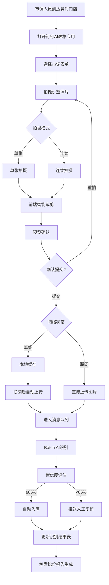
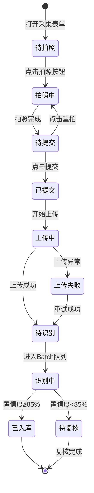

# AI拍照市调系统 · 拍照采集与智能识别功能设计

***

## 文档信息

| 项目   | 内容                   |
| ---- | -------------------- |
| 文档编号 | PRD-FN-001-2026-001 |
| 文档版本 | v0.1                 |
| 产品名称 | AI拍照市调系统             |
| 所属系统 | AI拍照市调系统             |
| 编制日期 | 2026-06-12       |
| 编制人员 | 周先虎               |

### 修订记录

| 版本   | 修订日期           | 修订说明 | 修订人    |
| ---- | -------------- | ---- | ------ |
| v0.1 | 2026-06-12 | 初稿创建 | 周先虎 |

***

> **文档使用说明**
>
> - `【替换】` 标记的内容：使用时替换为实际业务内容
> - `【删除】` 标记的内容：仅为填写说明，完成后删除
> - 本模板供 AI 开发智能体读取，请保持结构完整

> **文档撰写规范（重要）**
>
> 1. **严格遵循模板格式**：各章节表格字段必须与模板保持一致
> 2. **聚焦业务规则**：描述业务逻辑、数据约束、权限控制等，不写技术实现细节（如CSS类名、列宽像素、具体代码逻辑）
> 3. **减少不必要的示例**：不写JSON/XML格式的报文示例，仅描述报文格式以实际接口返回为准
> 4. **页面布局与交互分离**：§四仅描述页面结构（长什么样），§五描述业务规则（怎么操作）；字段说明表中「说明」列仅标注极简展示属性（只读/必填\*/系统自动生成），业务约束写在§五

***

## 一、功能角色矩阵说明

### 1.1 功能描述

- **功能名称：** 拍照采集与智能识别
- **所属模块：** 市调采集
- **功能描述：** 市调人员通过钉钉AI表格表单拍摄竞品价签照片，系统自动裁剪价签区域，通过多模态大模型（qwen3-vl-flash）进行OCR识别，提取商品名称、规格、价格等信息并结构化存储。

### 1.2 角色权限总览

| 角色      | 功能权限                        | 数据权限   |
| ------- | --------------------------- | ------ |
| 市调人员 | 拍照上传、查看识别结果、查看任务状态        | 本人采集的数据 |
| 单品运营 | 查看所有采集数据、查看所有识别结果           | 全量数据   |
| 采购人员 | 查看识别结果、查看比价数据              | 全量数据   |
| 系统管理员 | 全功能权限，包括配置管理               | 全量数据   |

### 1.3 功能角色矩阵

| 功能点  | 市调人员 | 单品运营 | 采购人员 | 系统管理员 |
| ---- | :-----: | :-----: | :-----: | :-----: |
| 拍照上传 |    是    |    否    |    否    |    是    |
| 查看本人采集数据 |    是    |    否    |    否    |    否    |
| 查看所有采集数据 |    否    |    是    |    是    |    是    |
| 查看识别结果 |    是    |    是    |    是    |    是    |
| 配置AI模型参数 |    否    |    否    |    否    |    是    |

***

## 二、模块路径

钉钉AI表格应用 → AI拍照市调系统 → 市调采集表单 → 拍照采集页面

***

## 三、状态流转与流程图

### 3.1 业务流程图



### 3.2 状态流转图



***

## 四、页面布局

### 4.1 页面清单

|  序号 | 页面名称    | 页面类型   | 描述                           |
| :-: | ------- | ------ | ---------------------------- |
|  1  | 拍照采集页面 | 主页面    | 钉钉AI表格表单内拍照采集界面            |
|  2  | 照片预览弹窗 | 弹窗     | 拍照后预览照片，支持重拍                |
|  3  | 识别结果列表页面 | 主页面    | 展示AI识别结果列表                   |
|  4  | 识别结果详情弹窗 | 弹窗     | 查看单条识别结果详情（含原始图片和识别字段）    |

***

### 4.2 拍照采集页面布局

```
┌─────────────────────────────────────────────────────────────────┐
│  ← 拍照市调          📍 已定位                                   │
├─────────────────────────────────────────────────────────────────┤
│  竞对品牌：[百果园 ▼]                                             │
│  竞对门店：[百果园-朝阳店 ▼]                                      │
│  市调日期：[2026-06-12]                                          │
├─────────────────────────────────────────────────────────────────┤
│                                                                 │
│     ┌─────────────────────────────────────────────┐            │
│     │                                             │            │
│     │              取景框（实时预览）                │            │
│     │                                             │            │
│     └─────────────────────────────────────────────┘            │
│                                                                 │
│     [ 📷 拍照 ]    [ 🖼 从相册选择 ]                               │
│                                                                 │
├─────────────────────────────────────────────────────────────────┤
│  已拍照片列表（3张）                                              │
│  ┌──────┐  ┌──────┐  ┌──────┐  [+ 继续拍摄]                    │
│  │ 缩略图1│  │ 缩略图2│  │ 缩略图3│                              │
│  └──────┘  └──────┘  └──────┘                                  │
├─────────────────────────────────────────────────────────────────┤
│  待上传：2张    [提交市调]                                        │
└─────────────────────────────────────────────────────────────────┘
```

### 4.2.1 表单字段说明

| 字段      | 组件类型 | 位置 | 提示语            | 说明        |
| ------- | ---- | -- | -------------- | --------- |
| 竞对品牌   | 下拉框  | 表单行 | 提示"请选择竞对品牌" | 必填\*，数据源来自竞对品牌表 |
| 竞对门店   | 下拉框  | 表单行 | 提示"请选择竞对门店" | 必填\*，根据品牌联动加载 |
| 市调日期   | 日期选择器 | 表单行 | — | 必填\*，默认当天日期 |
| 拍照字段   | 图片上传 | 表单行 | 提示"点击拍摄或选择照片" | 必填\*，支持拍摄和相册选择 |

### 4.2.2 工具栏区

| 组件名称 | 组件类型 | 位置 | 提示语 | 说明          |
| ---- | ---- | -- | --- | ----------- |
| 拍照   | 按钮   | 居中 | —   | 主按钮，打开相机      |
| 从相册选择 | 按钮   | 居中 | —   | 次按钮，从相册选择照片 |
| 提交市调 | 按钮   | 底部 | —   | 主按钮，至少1张照片后可提交 |

### 4.2.3 照片列表区

| 字段      | 组件类型 | 位置 | 说明                |
| ------- | ---- | -- | ----------------- |
| 缩略图     | 图片   | 居左 | 压缩后预览图，点击可放大 |
| 拍摄时间    | 文本   | 居右 | 系统自动生成            |
| 删除按钮    | 按钮   | 居右 | 可删除已拍照片          |

***

### 4.3 照片预览弹窗布局

```
┌─────────────────────────────────────────────────┐
│  照片预览                                  [X]  │
├─────────────────────────────────────────────────┤
│                                                 │
│     ┌─────────────────────────────────────┐    │
│     │                                     │    │
│     │         全屏照片预览                  │    │
│     │                                     │    │
│     └─────────────────────────────────────┘    │
│                                                 │
│     拍摄时间：2026-06-12 14:30:25               │
│     位置：北京市朝阳区xx路xx号                    │
│                                                 │
│                              [重拍]  [确认]      │
└─────────────────────────────────────────────────┘
```

### 4.3.1 按钮区

| 按钮 | 组件类型 | 位置 | 说明       |
| -- | ---- | -- | -------- |
| 重拍 | 按钮   | 居右 | 关闭预览，返回拍照界面 |
| 确认 | 按钮   | 居右 | 确认照片，加入已拍列表 |

***

### 4.4 识别结果列表页面布局

```
┌─────────────────────────────────────────────────────────────────┐
│  ← 识别结果                                                      │
├─────────────────────────────────────────────────────────────────┤
│  查询条件区                                                       │
│  ┌─────────────┐ ┌─────────────┐ ┌──────┐ ┌──────┐             │
│  │ 商品名称    │ │ 复核状态    │ │ 查询 │ │ 重置 │             │
│  │ [输入框    ]│ │ [下拉框    ]│ │ 按钮 │ │ 按钮 │             │
│  └─────────────┘ └─────────────┘ └──────┘ └──────┘             │
├─────────────────────────────────────────────────────────────────┤
│  工具栏区    [导出Excel]                                          │
├─────────────────────────────────────────────────────────────────┤
│  列表数据区                                                       │
│  ┌────┬──────────┬──────┬──────┬──────┬──────────┬────────┐   │
│  │ 序号 │ 商品名称  │ 原价  │ 促销价│ 置信度│ 复核状态  │ 操作   │   │
│  ├────┼──────────┼──────┼──────┼──────┼──────────┼────────┤   │
│  │  1  │ 红颜草莓  │ 29.9 │ 19.9 │ 95%  │ 自动入库  │ [详情] │   │
│  │  2  │ 智利车厘子 │ 59.9 │ 49.9 │ 78%  │ 待复核   │ [详情] │   │
│  └────┴──────────┴──────┴──────┴──────┴──────────┴────────┘   │
├─────────────────────────────────────────────────────────────────┤
│  分页区    [< 1 2 3 >]  [每页 20 ▼]  共 156 条                   │
└─────────────────────────────────────────────────────────────────┘
```

### 4.4.1 查询条件区

| 组件名称    | 组件类型 | 位置 | 提示语            | 说明        |
| ------- | ---- | -- | -------------- | --------- |
| 商品名称    | 输入框  | 居左 | 提示"请输入商品名称" | 模糊查询      |
| 复核状态    | 下拉框  | 居左 | 提示"请选择复核状态" | 枚举：自动入库/人工确认/人工修改/无效 |
| 查询      | 按钮   | 居右 | —              | 主按钮       |
| 重置      | 按钮   | 居右 | —              | 次按钮       |

### 4.4.2 工具栏区

| 组件名称 | 组件类型 | 位置 | 提示语 | 说明          |
| ---- | ---- | -- | --- | ----------- |
| 导出Excel | 按钮   | 居右 | —   | 导出当前查询结果 |

### 4.4.3 列表展示区

| 字段      | 组件类型 | 位置 | 说明                |
| ------- | ---- | -- | ----------------- |
| 序号      | 文本   | 居中 | —                 |
| 商品名称    | 文本   | 居左 | —                 |
| 原价      | 文本   | 居右 | 保留2位小数           |
| 促销价     | 文本   | 居右 | 保留2位小数           |
| 置信度     | 文本   | 居中 | 百分比展示            |
| 复核状态    | 标签   | 居中 | 颜色区分：绿色=自动入库，橙色=人工确认/修改，红色=无效 |
| 操作      | 按钮组  | 居中 | [详情]             |

***

### 4.5 识别结果详情弹窗布局

```
┌─────────────────────────────────────────────────┐
│  识别结果详情                              [X]  │
├─────────────────────────────────────────────────┤
│                                                 │
│  ┌──────────────┐  AI 识别结果                   │
│  │              │  ────────────────             │
│  │  原始图片     │  商品名称：红颜草莓             │
│  │  (可缩放)    │  规格：300g/盒                │
│  │              │  原价：29.9                   │
│  │              │  促销价：19.9                 │
│  │              │  会员价：17.9                 │
│  │              │  促销信息：会员专享价            │
│  │              │  品类：水果-莓果类              │
│  │              │  总体置信度：95%               │
│  └──────────────┘  复核状态：自动入库             │
│                                                 │
│  置信度详情：                                     │
│  商品名称：95%  价格：98%  规格：92%               │
│                                                 │
│                                    [关闭]       │
└─────────────────────────────────────────────────┘
```

### 4.5.1 展示字段说明

| 字段      | 组件类型 | 位置   | 说明         |
| ------- | ---- | ---- | ---------- |
| 原始图片    | 图片   | 居左 | 支持缩放查看     |
| 商品名称    | 文本   | 居右 | 只读         |
| 规格      | 文本   | 居右 | 只读         |
| 原价      | 文本   | 居右 | 只读         |
| 促销价     | 文本   | 居右 | 只读         |
| 会员价     | 文本   | 居右 | 只读，无会员价时显示"—" |
| 促销信息    | 文本   | 居右 | 只读，无促销信息时显示"—" |
| 品类      | 文本   | 居右 | 只读         |
| 总体置信度   | 文本   | 居右 | 百分比展示     |
| 置信度详情   | 文本   | 居右 | 各字段置信度明细 |
| 复核状态    | 标签   | 居右 | 颜色区分       |

***

## 五、页面交互说明

### 5.1 拍照采集页面交互说明

#### 5.1.1 字段交互规则

| 字段        | 类型  | 是否必填 | 约束规则                  | 展示规则 | 举例或枚举       |
| --------- | --- | :--: | --------------------- | ---- | ----------- |
| 竞对品牌   | 下拉框 |   是  | 数据源来自竞对品牌表，仅展示启用状态品牌 | 明文   | 百果园/鲜丰/其他 |
| 竞对门店   | 下拉框 |   是  | 根据所选品牌联动加载，仅展示启用状态门店 | 明文   | 百果园-朝阳店 |
| 市调日期   | 日期选择器 |   是  | 不允许选择未来日期 | 明文   | 2026-06-12 |
| 拍照字段   | 图片上传 |   是  | 单次最多20张照片，单张≤10MB，格式jpg/png | 缩略图 | — |

#### 5.1.2 操作交互逻辑

| 操作类型 | 触发操作     | 交互可用性       | 正向输出                                        | 异常场景                                           | 异常处理             | 日志级别 |
| ---- | -------- | ----------- | ------------------------------------------- | ---------------------------------------------- | ---------------- | ---- |
| 拍照   | 点击"拍照"按钮 | 已选择门店后可用 | 打开相机取景框，拍摄后显示预览                        | 相机权限未授权                                      | Toast提示"请授权相机权限" | 接口级  |
| 从相册选择 | 点击"从相册选择" | 已选择门店后可用 | 打开系统相册，选择照片后加入已拍列表                    | 选择照片超过20张                                     | Toast提示"单次最多拍摄20张照片" | 接口级  |
| 预览照片 | 点击缩略图   | 已拍照片后可用  | 打开全屏预览弹窗                                 | 无                                              | 无                | 不记录  |
| 删除照片 | 点击删除按钮  | 已拍照片后可用  | 从已拍列表中移除照片                               | 无                                              | 无                | 不记录  |
| 提交市调 | 点击"提交市调" | 至少1张照片后可用 | 照片上传至队列，页面显示"提交成功，预计识别时间X分钟"         | 网络异常                                          | Toast提示"网络异常，照片已本地缓存，联网后自动上传" | 接口级  |
| 重拍   | 点击"重拍"按钮 | 预览弹窗中可用  | 关闭预览，返回拍照界面                             | 无                                              | 无                | 不记录  |

***

### 5.2 识别结果列表页面交互说明

#### 5.2.1 字段交互规则

| 字段        | 类型  | 是否必填 | 约束规则                  | 展示规则 | 举例或枚举       |
| --------- | --- | :--: | --------------------- | ---- | ----------- |
| 商品名称    | 输入框 |   否  | 支持模糊查询，最大50字符  | 明文   | 红颜草莓         |
| 复核状态    | 下拉框 |   否  | 精确查询，枚举值见数据字典 | 明文   | 自动入库/待复核    |

#### 5.2.2 操作交互逻辑

| 操作类型 | 触发操作     | 交互可用性       | 正向输出                                        | 异常场景                                           | 异常处理             | 日志级别 |
| ---- | -------- | ----------- | ------------------------------------------- | ---------------------------------------------- | ---------------- | ---- |
| 查询   | 点击"查询"   | 始终可用        | 按条件筛选，结果在列表中展示，分页同步更新                       | 无                                              | 无                | 接口级  |
| 重置   | 点击"重置"   | 始终可用        | 清空所有筛选条件，恢复初始查询状态                           | 无                                              | 无                | 接口级  |
| 查看   | 点击"详情"   | 始终可用        | 打开识别结果详情弹窗，展示原始图片和所有识别字段                    | 无                                              | 无                | 接口级  |
| 导出   | 点击"导出"   | 始终可用        | 勾选数据时导出勾选行；未勾选时导出全量数据，下载Excel文件             | 无数据                                            | Toast提示"暂无数据可导出" | 接口级  |

> **导出文件命名规范**：
>
> - 格式：`{业务前缀}_{YYYYMMDD}_{HHMMSS}.xlsx`
> - 示例：`识别结果_20260612_103045.xlsx`

***

### 5.3 识别结果详情弹窗交互说明

#### 5.3.1 字段交互规则

| 字段      | 组件类型 | 是否必填 | 约束规则       | 展示规则 | 举例或枚举               |
| ------- | ---- | :--: | ---------- | ---- | ------------------- |
| 所有字段    | 文本/图片 |   —  | 只读，不可编辑    | 明文   | — |

#### 5.3.2 操作交互逻辑

| 操作类型 | 触发操作     | 交互可用性 | 正向输出        | 异常场景 | 异常处理 | 日志级别 |
| ---- | -------- | ----- | ----------- | ---- | ---- | ---- |
| 关闭   | 点击"关闭"按钮 | 始终可用  | 关闭弹窗，返回列表页面 | 无    | 无    | 不记录  |
| 缩放图片 | 双击/捏合图片 | 始终可用  | 放大/缩小图片      | 无    | 无    | 不记录  |

***

## 六、错误处理规范

### 6.1 表单校验错误

- 显示方式：对应字段下方显示红色提示文本，字段边框变红
- 触发时机：表单提交时触发全量校验；字段失去焦点时触发单字段校验

| 字段      | 为空时错误信息     | 格式错误时信息           |
| ------- | ----------- | ----------------- |
| 竞对品牌 | 请选择竞对品牌 | — |
| 竞对门店 | 请选择竞对门店 | — |
| 拍照字段 | 请至少拍摄1张照片 | 照片格式不支持，请使用jpg/png格式 |

### 6.2 拍照操作错误

| 场景      | 触发条件                         | 提示文案                    | 处理方式                       |
| ------- | ---------------------------- | ----------------------- | -------------------------- |
| 相机权限未授权 | 首次打开相机                      | 请授权相机权限后重试              | 引导用户至系统设置授权              |
| 照片过大   | 单张照片超过10MB                  | 照片过大，请重新拍摄               | 压缩后重试或提示重新拍摄             |
| 超出连拍限制 | 单次拍摄超过20张                   | 单次最多拍摄20张照片              | 阻断上传                      |
| 上传失败   | 网络异常                        | 照片已本地保存，联网后自动上传        | 本地缓存，联网后自动重试             |
| AI识别超时 | Batch处理超过10分钟                | 识别处理中，请稍后查看结果           | 状态保持"识别中"，完成后自动更新        |

***

## 七、非功能性需求

### 7.1 合规与安全要求

| 适用规范       | 内容摘要              | 本模块特有说明                    |
| ---------- | ----------------- | -------------------------- |
| 访问控制   | RBAC最小权限、数据权限隔离   | 市调人员仅可查看本人采集数据；运营/采购可查看全量    |
| 操作日志   | 字段级日志、保留期限、不可篡改   | 覆盖操作：拍照上传/提交/删除              |
| 文件操作安全 | 导出上限、下载鉴权、导出行为记日志 | 单次导出上限1000条；导出记录写入操作日志      |
| 数据传输安全 | HTTPS传输加密        | 图片上传使用HTTPS加密传输           |

### 7.2 性能需求

| 需求项       | 指标要求          | 说明            |
| --------- | ------------- | ------------- |
| 图片上传响应时间 | ≤ 3秒          | 联网状态，单张图片≤500KB |
| AI识别响应时间 | ≤ 10分钟（100张Batch） | 批量处理模式 |
| 列表查询响应时间  | ≤ 2秒          | 正常网络条件下，含分页查询 |
| 页面首屏加载时间  | ≤ 2秒          | 钉钉客户端内       |
| 并发用户数     | 50人           | 同时操作拍照采集     |

### 7.3 离线支持需求

| 需求项       | 指标要求          | 说明            |
| --------- | ------------- | ------------- |
| 离线缓存容量 | 100张         | 无网络时本地缓存照片 |
| 自动同步     | 联网后30秒内开始上传 | 恢复网络后自动同步   |

***

## 八、特殊说明

### 8.1 拍照采集特殊规则

1. **连拍模式**：支持连续拍摄，连拍间隔≤2秒，单次市调最多20张照片
2. **自动对焦**：打开相机时自动对焦，画面模糊时提示"请稳定手机"
3. **GPS定位**：拍摄时自动记录GPS位置，精度要求≤50米
4. **图片压缩**：前端压缩至1024px以内，控制上传大小≤500KB
5. **智能裁剪**：前端自动识别价签区域并裁剪，去除无关背景
6. **去重机制**：基于图片相似度（pHash）去重，避免重复识别

### 8.2 AI识别特殊规则

1. **模型选择**：使用qwen3-vl-flash多模态大模型
2. **Batch调用**：延迟队列累积至100张触发一次Batch API调用，享受半价优惠
3. **置信度阈值**：默认85%，低于阈值的结果推送人工复核
4. **结果缓存**：Redis缓存30天，重复查询直接返回
5. **识别准确率**：标准价签≥95%，手写价签≥85%，反光/倾斜价签≥80%，综合≥90%

### 8.3 钉钉AI表格集成说明

本产品运行在钉钉AI表格平台上，拍照采集通过钉钉AI表格表单实现：
- 使用钉钉AI表格表单的图片上传字段
- 使用钉钉AI表格自动化流程触发AI识别
- 使用钉钉AI表格AI字段进行图片内容识别
- 使用钉钉AI表格权限管理控制数据访问
- 使用钉钉云空间存储图片文件

***

## 九、数据字典

### 9.1 字典项定义

**复核状态（reviewStatus）**

| 枚举值（code） | 显示文本（label） | 说明     |
| :-------: | ----------- | ------ |
|     AUTO     | 自动入库     | AI识别置信度≥85%，自动入库 |
|     MANUAL_CONFIRMED     | 人工确认     | 人工复核后确认正确 |
|     MANUAL_MODIFIED     | 人工修改     | 人工复核后修改了部分字段 |
|     INVALID     | 无效     | 识别结果完全错误，标记无效 |

**上传状态（uploadStatus）**

| 枚举值（code） | 显示文本（label） | 说明     |
| :-------: | ----------- | ------ |
|     PENDING     | 待上传     | 照片已拍摄，等待上传 |
|     UPLOADING     | 上传中     | 正在上传    |
|     UPLOADED     | 已上传     | 上传成功    |
|     FAILED     | 失败     | 上传失败    |

**任务状态（taskStatus）**

| 枚举值（code） | 显示文本（label） | 说明     |
| :-------: | ----------- | ------ |
|     PENDING     | 待处理     | 任务已创建，等待照片上传 |
|     PROCESSING     | 处理中     | 照片已上传，AI识别进行中 |
|     COMPLETED     | 已完成     | 所有照片识别完成 |

### 9.2 下拉框数据来源说明

| 字段名     | 数据来源类型 | 来源说明                        |
| ------- | ------ | --------------------------- |
| 竞对品牌   | 接口动态加载 | 来源：竞对管理模块接口，仅加载启用状态品牌    |
| 竞对门店   | 接口动态加载 | 来源：竞对管理模块接口，根据品牌ID联动加载   |
| 复核状态   | 字典项    | 参见 9.1 reviewStatus            |

***

## 十、外部系统接口说明

### 10.1 接口清单

| 接口名称    | 功能描述           | 交互方向     | 依赖系统     | 数据流向                    |
| ------- | -------------- | -------- | -------- | ----------------------- |
| 图片上传接口 | 上传照片至队列系统      | 调用      | 钉钉云空间   | 本系统→钉钉云空间              |
| AI识别接口 | 调用多模态模型进行OCR识别 | 调用      | 阿里云百炼   | 本系统→阿里云百炼→本系统（回调）      |
| 结果写入接口 | 识别结果写入AI表格     | 调用      | 钉钉AI表格  | 本系统→钉钉AI表格              |
| 消息通知接口 | 推送识别完成通知      | 调用      | 钉钉消息服务  | 本系统→钉钉消息服务→用户          |

### 10.2 接口详细说明

**图片上传接口**

| 规则项  | 说明                    |
| ---- | --------------------- |
| 触发时机 | 用户点击"提交市调"按钮时调用      |
| 请求条件 | 至少1张照片，照片已压缩至≤500KB   |
| 成功处理 | 照片进入上传队列，状态变更为"上传中"  |
| 失败处理 | 网络异常时本地缓存，联网后自动重试    |
| 重试机制 | 自动重试3次，间隔5秒           |

**AI识别接口**

| 规则项  | 说明                    |
| ---- | --------------------- |
| 触发时机 | 图片上传成功后，进入Batch队列累积至100张 |
| 请求条件 | 图片已上传至钉钉云空间，获取到图片URL  |
| 成功处理 | 返回识别结果，置信度≥85%自动入库   |
| 失败处理 | 记录失败日志，支持手动重新触发识别    |
| 重试机制 | 失败后自动重试2次              |

***

*文档结束*
