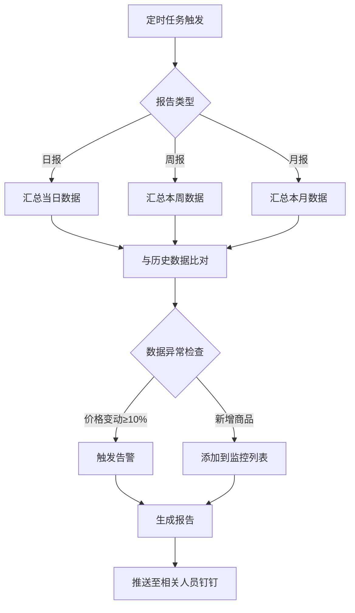
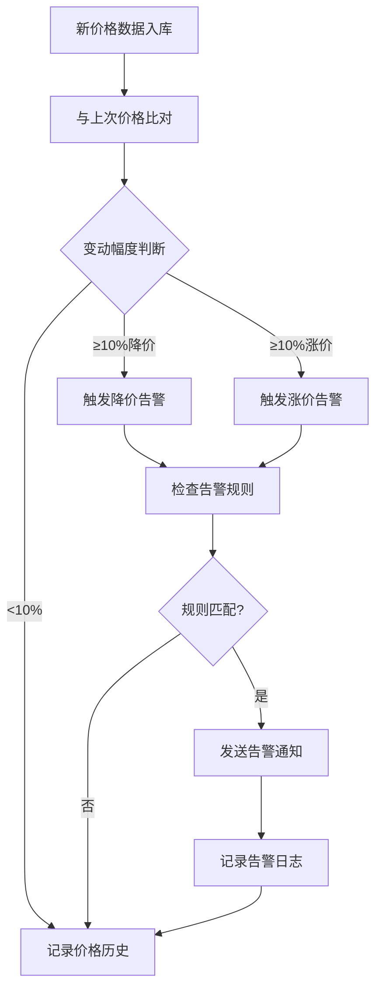
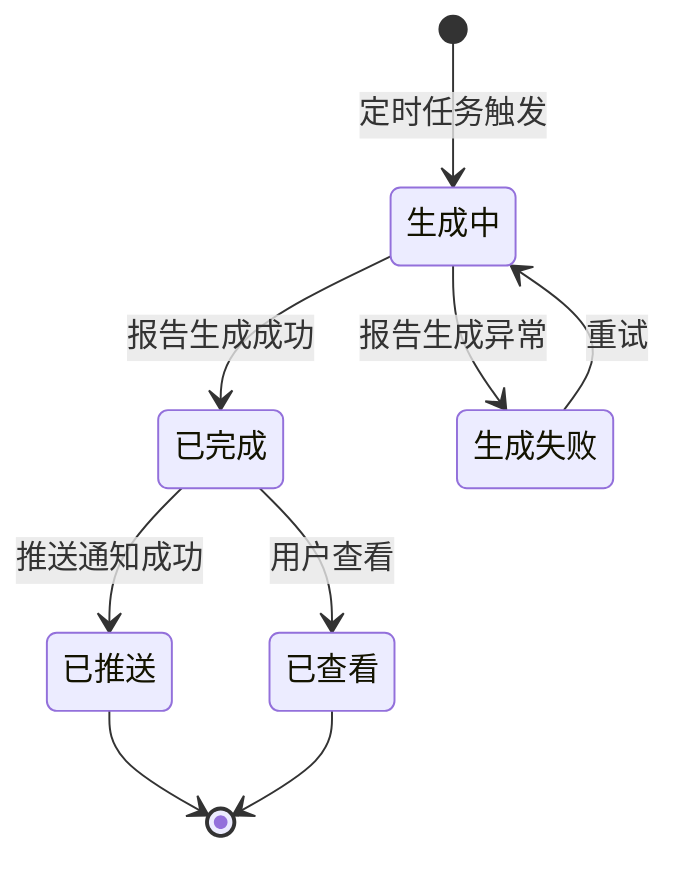

# AI拍照市调系统 · 比价报告与数据分析功能设计

***

## 文档信息

| 项目   | 内容                   |
| ---- | -------------------- |
| 文档编号 | PRD-FN-003-2026-001 |
| 文档版本 | v0.1                 |
| 产品名称 | AI拍照市调系统             |
| 所属系统 | AI拍照市调系统             |
| 编制日期 | 2026-06-12       |
| 编制人员 | 周先虎               |

### 修订记录

| 版本   | 修订日期           | 修订说明 | 修订人    |
| ---- | -------------- | ---- | ------ |
| v0.1 | 2026-06-12 | 初稿创建 | 周先虎 |

***

> **文档使用说明**
>
> - `【替换】` 标记的内容：使用时替换为实际业务内容
> - `【删除】` 标记的内容：仅为填写说明，完成后删除
> - 本模板供 AI 开发智能体读取，请保持结构完整

> **文档撰写规范（重要）**
>
> 1. **严格遵循模板格式**：各章节表格字段必须与模板保持一致
> 2. **聚焦业务规则**：描述业务逻辑、数据约束、权限控制等，不写技术实现细节
> 3. **减少不必要的示例**：不写JSON/XML格式的报文示例
> 4. **页面布局与交互分离**：§四仅描述页面结构，§五描述业务规则

***

## 一、功能角色矩阵说明

### 1.1 功能描述

- **功能名称：** 比价报告与数据分析
- **所属模块：** 数据分析
- **功能描述：** 基于AI识别的结构化市调数据，自动生成竞品比价报告（日/周/月），展示商品历史价格趋势，并在竞品大幅调价时自动告警，支持数据导出。

### 1.2 角色权限总览

| 角色      | 功能权限                        | 数据权限   |
| ------- | --------------------------- | ------ |
| 单品运营 | 查看报告、查看趋势、配置告警规则、导出数据     | 全量数据   |
| 采购人员 | 查看报告、查看趋势、导出数据              | 全量数据   |
| 管理层  | 查看报告概览、导出数据                  | 全量数据（汇总级） |
| 系统管理员 | 全功能权限，包括告警规则管理和系统配置        | 全量数据   |

### 1.3 功能角色矩阵

| 功能点  | 单品运营 | 采购人员 | 管理层 | 系统管理员 |
| ---- | :-----: | :-----: | :-----: | :-----: |
| 查看比价报告 |    是    |    是    |    是（概览） |    是    |
| 生成比价报告 |    是    |    否    |    否    |    是    |
| 查看价格趋势 |    是    |    是    |    是    |    是    |
| 配置告警规则 |    是    |    否    |    否    |    是    |
| 查看告警记录 |    是    |    是    |    是    |    是    |
| 导出数据 |    是    |    是    |    是    |    是    |

***

## 二、模块路径

钉钉AI表格应用 → AI拍照市调系统 → 数据分析 → 比价报告/价格趋势/告警管理

***

## 三、状态流转与流程图

### 3.1 比价报告生成流程



### 3.2 告警触发流程



### 3.3 报告状态流转图



***

## 四、页面布局

### 4.1 页面清单

|  序号 | 页面名称    | 页面类型   | 描述                           |
| :-: | ------- | ------ | ---------------------------- |
|  1  | 比价报告列表页面 | 主页面    | 展示已生成的比价报告列表，支持查询和查看          |
|  2  | 比价报告详情弹窗 | 弹窗     | 查看单份比价报告的详细内容               |
|  3  | 价格趋势页面 | 主页面    | 展示商品历史价格趋势图                  |
|  4  | 告警规则管理页面 | 主页面    | 管理价格异常告警规则                   |
|  5  | 告警记录列表页面 | 主页面    | 展示历史告警记录                     |

***

### 4.2 比价报告列表页面布局

```
┌─────────────────────────────────────────────────────────────────┐
│  ← 比价报告                                                      │
├─────────────────────────────────────────────────────────────────┤
│  查询条件区                                                       │
│  ┌─────────────┐ ┌─────────────┐ ┌───────────┐ ┌──────┐ ┌──────┐│
│  │ 报告类型    │ │ 报告日期    │ │ 竞对品牌   │ │ 查询 │ │ 重置 ││
│  │ [下拉框    ]│ │ [日期范围  ]│ │ [下拉框  ]│ │ 按钮 │ │ 按钮 ││
│  └─────────────┘ └─────────────┘ └───────────┘ └──────┘ └──────┘│
├─────────────────────────────────────────────────────────────────┤
│  工具栏区    [生成报告]  [导出Excel]                                │
├─────────────────────────────────────────────────────────────────┤
│  列表数据区                                                       │
│  ┌────┬──────────┬──────────┬──────────┬──────────┬────────┐   │
│  │ 序号 │ 报告类型  │ 报告周期  │ 竞对品牌  │ 状态     │ 操作   │   │
│  ├────┼──────────┼──────────┼──────────┼──────────┼────────┤   │
│  │  1  │ 日报     │ 06-12    │ 全部     │ 已完成   │ [查看] │   │
│  │  2  │ 周报     │ 06-06~12 │ 全部     │ 已完成   │ [查看] │   │
│  │  3  │ 日报     │ 06-11    │ 百果园   │ 已完成   │ [查看] │   │
│  └────┴──────────┴──────────┴──────────┴──────────┴────────┘   │
├─────────────────────────────────────────────────────────────────┤
│  分页区    [< 1 2 3 >]  [每页 20 ▼]  共 36 条                    │
└─────────────────────────────────────────────────────────────────┘
```

### 4.2.1 查询条件区

| 组件名称    | 组件类型 | 位置 | 提示语            | 说明        |
| ------- | ---- | -- | -------------- | --------- |
| 报告类型    | 下拉框  | 居左 | 提示"请选择报告类型" | 枚举：日报/周报/月报 |
| 报告日期    | 日期范围 | 居左 | — | 精确到日期范围 |
| 竞对品牌    | 下拉框  | 居左 | 提示"请选择竞对品牌" | 全部品牌+单个品牌筛选 |
| 查询      | 按钮   | 居右 | —              | 主按钮       |
| 重置      | 按钮   | 居右 | —              | 次按钮       |

### 4.2.2 工具栏区

| 组件名称 | 组件类型 | 位置 | 提示语 | 说明          |
| ---- | ---- | -- | --- | ----------- |
| 生成报告 | 按钮   | 居左 | —   | 打开生成报告弹窗 |
| 导出Excel | 按钮   | 居右 | —   | 导出当前查询结果 |

### 4.2.3 列表展示区

| 字段      | 组件类型 | 位置 | 说明                |
| ------- | ---- | -- | ----------------- |
| 序号      | 文本   | 居中 | —                 |
| 报告类型    | 标签   | 居中 | 颜色区分：蓝色=日报，绿色=周报，紫色=月报 |
| 报告周期    | 文本   | 居左 | 日报显示单日期，周报/月报显示日期范围 |
| 竞对品牌    | 文本   | 居左 | —                 |
| 状态      | 标签   | 居中 | 生成中/已完成/生成失败 |
| 操作      | 按钮组  | 居中 | [查看]             |

***

### 4.3 比价报告详情弹窗布局

```
┌─────────────────────────────────────────────────────────────────┐
│  比价日报 - 2026-06-12                                     [X]  │
├─────────────────────────────────────────────────────────────────┤
│  ┌─────────────────────────────────────────────────────────┐   │
│  │  报告摘要                                                 │   │
│  │  监控商品总数：150    价格变动：12    平均价差：-5.2%       │   │
│  └─────────────────────────────────────────────────────────┘   │
│                                                                 │
│  ┌─────────────────────────────────────────────────────────┐   │
│  │  价格变动TOP10                                            │   │
│  │  ┌────┬──────────┬──────┬──────┬──────┬──────┐         │   │
│  │  │ 序号 │ 商品名称  │ 门店  │ 昨日价│ 今日价│ 变动  │         │   │
│  │  ├────┼──────────┼──────┼──────┼──────┼──────┤         │   │
│  │  │  1  │ 红颜草莓  │ 百果园│ 25.9 │ 19.9 │ -23% │         │   │
│  │  │  2  │ 智利车厘子 │ 鲜丰  │ 69.9 │ 59.9 │ -14% │         │   │
│  │  └────┴──────────┴──────┴──────┴──────┴──────┘         │   │
│  └─────────────────────────────────────────────────────────┘   │
│                                                                 │
│  [下载完整报告Excel]                                             │
│                                                                 │
│                                    [关闭]                       │
└─────────────────────────────────────────────────────────────────┘
```

### 4.3.1 展示字段说明

| 字段      | 组件类型 | 位置   | 说明         |
| ------- | ---- | ---- | ---------- |
| 报告摘要    | 文本   | 居左 | 只读，汇总统计信息 |
| 价格变动列表  | 表格   | 居左 | 只读，按变动幅度排序 |
| 下载按钮    | 按钮   | 居左 | 下载完整报告Excel |

***

### 4.4 价格趋势页面布局

```
┌─────────────────────────────────────────────────────────────────┐
│  ← 价格趋势                                                      │
├─────────────────────────────────────────────────────────────────┤
│  查询条件区                                                       │
│  ┌─────────────┐ ┌─────────────┐ ┌───────────┐ ┌──────┐ ┌──────┐│
│  │ 商品名称    │ │ 竞对品牌    │ │ 时间范围   │ │ 查询 │ │ 重置 ││
│  │ [输入框    ]│ │ [下拉框    ]│ │ [日期范围  ]│ │ 按钮 │ │ 按钮 ││
│  └─────────────┘ └─────────────┘ └───────────┘ └──────┘ └──────┘│
├─────────────────────────────────────────────────────────────────┤
│  趋势图区域                                                       │
│  ┌─────────────────────────────────────────────────────────┐   │
│  │                                                         │   │
│  │              [价格趋势折线图]                              │   │
│  │                                                         │   │
│  │  原价 ──  促销价 ──  会员价 ──                              │   │
│  │                                                         │   │
│  └─────────────────────────────────────────────────────────┘   │
├─────────────────────────────────────────────────────────────────┤
│  数据明细区域                                                     │
│  ┌────┬──────────┬──────┬──────┬──────┬──────────┐          │
│  │ 日期 │ 原价     │ 促销价│ 会员价│ 数据来源  │ 变动幅度  │          │
│  ├────┼──────────┼──────┼──────┼──────┼──────────┤          │
│  │06-12│ 29.9    │ 19.9 │ 17.9 │ AI识别  │ —        │          │
│  │06-11│ 25.9    │ 25.9 │ 23.9 │ AI识别  │ +15%     │          │
│  └────┴──────────┴──────┴──────┴──────┴──────────┘          │
└─────────────────────────────────────────────────────────────────┘
```

### 4.4.1 查询条件区

| 组件名称    | 组件类型 | 位置 | 提示语            | 说明        |
| ------- | ---- | -- | -------------- | --------- |
| 商品名称    | 输入框  | 居左 | 提示"请输入商品名称" | 模糊查询，支持搜索 |
| 竞对品牌    | 下拉框  | 居左 | 提示"请选择竞对品牌" | 筛选特定品牌 |
| 时间范围    | 日期范围 | 居左 | — | 默认近30天 |
| 查询      | 按钮   | 居右 | —              | 主按钮       |
| 重置      | 按钮   | 居右 | —              | 次按钮       |

### 4.4.2 趋势图区域

| 组件名称    | 组件类型 | 位置 | 说明        |
| ------- | ---- | -- | --------- |
| 价格趋势折线图 | 图表   | 居中 | 展示原价/促销价/会员价三条线 |
| 时间轴     | 轴   | 底部 | 按日期展示    |
| 价格轴     | 轴   | 左侧 | 按金额展示    |

### 4.4.3 数据明细区域

| 字段      | 组件类型 | 位置 | 说明                |
| ------- | ---- | -- | ----------------- |
| 日期      | 文本   | 居左 | 价格记录日期           |
| 原价      | 文本   | 居右 | 保留2位小数           |
| 促销价     | 文本   | 居右 | 保留2位小数           |
| 会员价     | 文本   | 居右 | 保留2位小数           |
| 数据来源    | 标签   | 居中 | AI识别/人工录入        |
| 变动幅度    | 文本   | 居右 | 与上次相比的变动百分比，红色=涨价，绿色=降价 |

***

### 4.5 告警规则管理页面布局

```
┌─────────────────────────────────────────────────────────────────┐
│  ← 告警规则管理                                                   │
├─────────────────────────────────────────────────────────────────┤
│  工具栏区    [+新增规则]                                           │
├─────────────────────────────────────────────────────────────────┤
│  列表数据区                                                       │
│  ┌────┬──────────┬──────────┬──────┬──────────┬────────┐      │
│  │ 序号 │ 规则名称  │ 规则类型  │ 阈值  │ 通知人员  │ 操作   │      │
│  ├────┼──────────┼──────────┼──────┼──────────┼────────┤      │
│  │  1  │ 大幅降价告警│ 降价     │ 10%  │ 单品运营  │ [编辑] [删除]│      │
│  │  2  │ 大幅涨价告警│ 涨价     │ 15%  │ 采购人员  │ [编辑] [删除]│      │
│  │  3  │ 新品上架告警│ 新品     │ —    │ 单品运营  │ [编辑] [删除]│      │
│  └────┴──────────┴──────────┴──────┴──────────┴────────┘      │
└─────────────────────────────────────────────────────────────────┘
```

### 4.5.1 工具栏区

| 组件名称 | 组件类型 | 位置 | 提示语 | 说明          |
| ---- | ---- | -- | --- | ----------- |
| 新增规则 | 按钮   | 居左 | —   | 打开新增/编辑规则弹窗 |

### 4.5.2 列表展示区

| 字段      | 组件类型 | 位置 | 说明                |
| ------- | ---- | -- | ----------------- |
| 序号      | 文本   | 居中 | —                 |
| 规则名称    | 文本   | 居左 | —                 |
| 规则类型    | 标签   | 居中 | 降价/涨价/新品         |
| 阈值      | 文本   | 居中 | 百分比或"—"          |
| 通知人员    | 文本   | 居左 | 角色名称             |
| 操作      | 按钮组  | 居中 | [编辑] [删除]        |

***

### 4.6 告警记录列表页面布局

```
┌─────────────────────────────────────────────────────────────────┐
│  ← 告警记录                                                      │
├─────────────────────────────────────────────────────────────────┤
│  查询条件区                                                       │
│  ┌─────────────┐ ┌─────────────┐ ┌───────────┐ ┌──────┐ ┌──────┐│
│  │ 告警类型    │ │ 告警日期    │ │ 处理状态   │ │ 查询 │ │ 重置 ││
│  │ [下拉框    ]│ │ [日期范围  ]│ │ [下拉框  ]│ │ 按钮 │ │ 按钮 ││
│  └─────────────┘ └─────────────┘ └───────────┘ └──────┘ └──────┘│
├─────────────────────────────────────────────────────────────────┤
│  工具栏区    [导出Excel]                                          │
├─────────────────────────────────────────────────────────────────┤
│  列表数据区                                                       │
│  ┌────┬──────────┬──────────┬──────┬──────────┬────────┐      │
│  │ 序号 │ 告警类型  │ 商品名称  │ 触发值 │ 告警时间  │ 操作   │      │
│  ├────┼──────────┼──────────┼──────┼──────────┼────────┤      │
│  │  1  │ 降价告警  │ 红颜草莓  │ -23% │ 10:30    │ [详情] │      │
│  │  2  │ 涨价告警  │ 新疆香梨  │ +18% │ 09:15    │ [详情] │      │
│  └────┴──────────┴──────────┴──────┴──────────┴────────┘      │
├─────────────────────────────────────────────────────────────────┤
│  分页区    [< 1 2 3 >]  [每页 20 ▼]  共 45 条                    │
└─────────────────────────────────────────────────────────────────┘
```

### 4.6.1 查询条件区

| 组件名称    | 组件类型 | 位置 | 提示语            | 说明        |
| ------- | ---- | -- | -------------- | --------- |
| 告警类型    | 下拉框  | 居左 | 提示"请选择告警类型" | 枚举：降价/涨价/新品 |
| 告警日期    | 日期范围 | 居左 | — | 精确到日期范围 |
| 处理状态    | 下拉框  | 居左 | 提示"请选择处理状态" | 枚举：未处理/已处理 |
| 查询      | 按钮   | 居右 | —              | 主按钮       |
| 重置      | 按钮   | 居右 | —              | 次按钮       |

### 4.6.2 工具栏区

| 组件名称 | 组件类型 | 位置 | 提示语 | 说明          |
| ---- | ---- | -- | --- | ----------- |
| 导出Excel | 按钮   | 居右 | —   | 导出当前查询结果 |

### 4.6.3 列表展示区

| 字段      | 组件类型 | 位置 | 说明                |
| ------- | ---- | -- | ----------------- |
| 序号      | 文本   | 居中 | —                 |
| 告警类型    | 标签   | 居中 | 颜色区分：红色=降价，绿色=涨价，蓝色=新品 |
| 商品名称    | 文本   | 居左 | —                 |
| 触发值     | 文本   | 居中 | 触发告警的变动幅度       |
| 告警时间    | 文本   | 居左 | 格式：MM-DD HH:mm   |
| 操作      | 按钮组  | 居中 | [详情]             |

***

## 五、页面交互说明

### 5.1 比价报告列表页面交互说明

#### 5.1.1 字段交互规则

| 字段        | 类型  | 是否必填 | 约束规则                  | 展示规则 | 举例或枚举       |
| --------- | --- | :--: | --------------------- | ---- | ----------- |
| 报告类型    | 下拉框 |   否  | 精确查询，枚举值见数据字典 | 明文   | 日报/周报/月报    |
| 报告日期    | 日期范围 |   否  | 精确到日期范围 | 明文   | 2026-06-01 ~ 2026-06-12 |
| 竞对品牌    | 下拉框 |   否  | 精确查询，数据源来自竞对品牌表 | 明文   | 全部/百果园/鲜丰  |

#### 5.1.2 操作交互逻辑

| 操作类型 | 触发操作     | 交互可用性       | 正向输出                                        | 异常场景                                           | 异常处理             | 日志级别 |
| ---- | -------- | ----------- | ------------------------------------------- | ---------------------------------------------- | ---------------- | ---- |
| 查询   | 点击"查询"   | 始终可用        | 按条件筛选，结果在列表中展示，分页同步更新                       | 无                                              | 无                | 接口级  |
| 重置   | 点击"重置"   | 始终可用        | 清空所有筛选条件，恢复初始查询状态                           | 无                                              | 无                | 接口级  |
| 查看   | 点击"查看"   | 始终可用        | 打开比价报告详情弹窗                                 | 无                                              | 无                | 接口级  |
| 生成报告 | 点击"生成报告" | 始终可用        | 打开生成报告配置弹窗                                 | 无                                              | 无                | 接口级  |
| 导出   | 点击"导出"   | 始终可用        | 导出当前查询结果Excel文件                            | 无数据                                            | Toast提示"暂无数据可导出" | 接口级  |

> **导出文件命名规范**：
>
> - 格式：`{业务前缀}_{YYYYMMDD}_{HHMMSS}.xlsx`
> - 示例：`比价报告_20260612_103045.xlsx`

***

### 5.2 价格趋势页面交互说明

#### 5.2.1 字段交互规则

| 字段        | 类型  | 是否必填 | 约束规则                  | 展示规则 | 举例或枚举       |
| --------- | --- | :--: | --------------------- | ---- | ----------- |
| 商品名称    | 输入框 |   否  | 支持模糊查询，最大50字符  | 明文   | 红颜草莓         |
| 竞对品牌    | 下拉框 |   否  | 精确查询，数据源来自竞对品牌表 | 明文   | 百果园/鲜丰      |
| 时间范围    | 日期范围 |   否  | 默认近30天，最大可查90天 | 明文   | 2026-05-12 ~ 2026-06-12 |

#### 5.2.2 操作交互逻辑

| 操作类型 | 触发操作     | 交互可用性       | 正向输出                                        | 异常场景                                           | 异常处理             | 日志级别 |
| ---- | -------- | ----------- | ------------------------------------------- | ---------------------------------------------- | ---------------- | ---- |
| 查询   | 点击"查询"   | 始终可用        | 加载趋势图和数据明细                                 | 无历史数据                                          | 图表区显示"暂无数据"   | 接口级  |
| 重置   | 点击"重置"   | 始终可用        | 清空所有筛选条件，恢复默认状态                           | 无                                              | 无                | 接口级  |

***

### 5.3 告警规则管理页面交互说明

#### 5.3.1 操作交互逻辑

| 操作类型 | 触发操作     | 交互可用性       | 正向输出                                        | 异常场景                                           | 异常处理             | 日志级别 |
| ---- | -------- | ----------- | ------------------------------------------- | ---------------------------------------------- | ---------------- | ---- |
| 新增规则 | 点击"新增规则" | 始终可用        | 打开新增规则弹窗                                 | 无                                              | 无                | 接口级  |
| 编辑   | 点击"编辑"   | 始终可用        | 打开编辑规则弹窗，反显当前规则数据                        | 无                                              | 无                | 接口级  |
| 删除   | 点击"删除"   | 始终可用        | 弹出确认弹窗"是否确认删除该告警规则？"                    | 删除失败                                          | Toast提示"删除失败，请重试" | 接口级  |

#### 5.3.2 弹窗说明

| 规则项  | 说明                                   |
| ---- | ------------------------------------ |
| 打开方式 | 点击"新增规则"或"编辑"按钮                    |
| 标题   | 新增时显示"新增告警规则"；编辑时显示"编辑告警规则"      |
| 数据反显 | 编辑时自动回填当前规则数据；新增时所有字段为空              |
| 校验时机 | 字段失焦时触发单字段校验；点击"确定"时触发全量校验           |
| 保存规则 | 全部校验通过后提交保存；校验失败时字段下方显示红色提示文本，字段边框变红 |

***

### 5.4 告警记录列表页面交互说明

#### 5.4.1 字段交互规则

| 字段        | 类型  | 是否必填 | 约束规则                  | 展示规则 | 举例或枚举       |
| --------- | --- | :--: | --------------------- | ---- | ----------- |
| 告警类型    | 下拉框 |   否  | 精确查询，枚举值见数据字典 | 明文   | 降价/涨价/新品    |
| 告警日期    | 日期范围 |   否  | 精确到日期范围 | 明文   | 2026-06-01 ~ 2026-06-12 |
| 处理状态    | 下拉框 |   否  | 精确查询，枚举值见数据字典 | 明文   | 未处理/已处理     |

#### 5.4.2 操作交互逻辑

| 操作类型 | 触发操作     | 交互可用性       | 正向输出                                        | 异常场景                                           | 异常处理             | 日志级别 |
| ---- | -------- | ----------- | ------------------------------------------- | ---------------------------------------------- | ---------------- | ---- |
| 查询   | 点击"查询"   | 始终可用        | 按条件筛选，结果在列表中展示，分页同步更新                       | 无                                              | 无                | 接口级  |
| 重置   | 点击"重置"   | 始终可用        | 清空所有筛选条件，恢复初始查询状态                           | 无                                              | 无                | 接口级  |
| 查看   | 点击"详情"   | 始终可用        | 打开告警详情弹窗                                 | 无                                              | 无                | 接口级  |
| 导出   | 点击"导出"   | 始终可用        | 导出当前查询结果Excel文件                            | 无数据                                            | Toast提示"暂无数据可导出" | 接口级  |

> **导出文件命名规范**：
>
> - 格式：`{业务前缀}_{YYYYMMDD}_{HHMMSS}.xlsx`
> - 示例：`告警记录_20260612_103045.xlsx`

***

## 六、错误处理规范

### 6.1 表单校验错误

- 显示方式：对应字段下方显示红色提示文本，字段边框变红
- 触发时机：表单提交时触发全量校验；字段失去焦点时触发单字段校验

| 字段      | 为空时错误信息     | 格式错误时信息           |
| ------- | ----------- | ----------------- |
| 规则名称 | 规则名称不能为空 | 规则名称长度不能超过100个字符 |
| 阈值 | 阈值不能为空 | 阈值必须为大于0的数字 |

### 6.2 操作错误

| 场景      | 触发条件                         | 提示文案                    | 处理方式                       |
| ------- | ---------------------------- | ----------------------- | -------------------------- |
| 报告生成失败 | 数据量不足或接口异常                  | 报告生成失败，请稍后重试           | Toast提示                   |
| 规则保存失败 | 接口请求失败                       | 保存失败，请重试！              | Toast提示                   |
| 规则删除失败 | 接口请求失败                       | 删除失败，请重试！              | Toast提示                   |
| 网络异常   | 接口请求超时                       | 网络异常，请稍候再试            | Toast提示                   |

***

## 七、非功能性需求

### 7.1 合规与安全要求

| 适用规范       | 内容摘要              | 本模块特有说明                    |
| ---------- | ----------------- | -------------------------- |
| 访问控制   | RBAC最小权限、数据权限隔离   | 仅单品运营和管理员可配置告警规则；管理层仅可查看概览    |
| 操作日志   | 字段级日志、保留期限、不可篡改   | 覆盖操作：生成报告/配置告警/导出数据           |
| 文件操作安全 | 导出上限、下载鉴权、导出行为记日志 | 单次导出上限1000条；导出记录写入操作日志      |

### 7.2 性能需求

| 需求项       | 指标要求          | 说明            |
| --------- | ------------- | ------------- |
| 列表查询响应时间  | ≤ 2秒          | 正常网络条件下，含分页查询 |
| 报告生成时间  | ≤ 5分钟         | 日报/周报/月报全量生成 |
| 趋势图加载时间  | ≤ 3秒          | 30天数据范围      |
| 告警触发延迟  | ≤ 1分钟         | 价格数据入库后触发    |
| 页面首屏加载时间  | ≤ 3秒          | —             |
| 并发用户数     | 30人           | 同时查看报告和分析     |

***

## 八、特殊说明

### 8.1 报告生成规则

1. **日报**：每日18:00自动生成，汇总当日所有市调数据
2. **周报**：每周一18:00自动生成，汇总上一周数据
3. **月报**：每月1日18:00自动生成，汇总上一月数据
4. **手动生成**：支持单品运营手动触发生成指定日期范围的报告
5. **报告内容**：包含价格变动汇总、TOP10变动商品、新增商品列表、价格趋势概览

### 8.2 告警规则说明

1. **降价告警**：竞品价格下降幅度≥阈值时触发（默认10%）
2. **涨价告警**：竞品价格上涨幅度≥阈值时触发（默认10%）
3. **新品告警**：发现竞品新上架商品时触发
4. **通知方式**：通过钉钉机器人推送告警通知
5. **规则配置**：支持按品牌、品类、门店等维度配置不同阈值

### 8.3 价格趋势分析规则

1. **数据聚合**：同一商品同一门店的价格按日期聚合
2. **趋势计算**：支持按日/周/月维度计算价格变动趋势
3. **对比基准**：默认与上次价格对比，支持自定义对比周期
4. **可视化**：使用折线图展示价格走势，支持原价/促销价/会员价三条线

### 8.4 数据导出规则

1. **导出格式**：统一使用Excel（.xlsx）格式
2. **导出内容**：包含报告汇总数据+明细数据，分Sheet展示
3. **文件命名**：`{业务前缀}_{YYYYMMDD}_{HHMMSS}.xlsx`
4. **导出上限**：单次导出不超过1000条数据

### 8.5 钉钉AI表格集成说明

1. **报告存储**：生成的比价报告摘要存入钉钉AI表格报告记录表
2. **价格历史**：价格趋势数据存入钉钉AI表格价格历史表
3. **告警推送**：通过钉钉机器人推送告警通知至相关人员
4. **数据看板**：利用钉钉AI表格的图表功能展示价格趋势

***

## 九、数据字典

### 9.1 字典项定义

**报告类型（reportType）**

| 枚举值（code） | 显示文本（label） | 说明     |
| :-------: | ----------- | ------ |
|     DAILY     | 日报     | 每日生成    |
|     WEEKLY     | 周报     | 每周生成    |
|     MONTHLY     | 月报     | 每月生成    |

**告警类型（alertType）**

| 枚举值（code） | 显示文本（label） | 说明     |
| :-------: | ----------- | ------ |
|     PRICE_DROP     | 降价告警     | 价格大幅下降  |
|     PRICE_RISE     | 涨价告警     | 价格大幅上涨  |
|     NEW_PRODUCT     | 新品告警     | 发现新商品   |

**告警处理状态（alertStatus）**

| 枚举值（code） | 显示文本（label） | 说明     |
| :-------: | ----------- | ------ |
|     PENDING     | 未处理     | 告警已触发，待处理 |
|     PROCESSED     | 已处理     | 已查看并处理  |

**报告状态（reportStatus）**

| 枚举值（code） | 显示文本（label） | 说明     |
| :-------: | ----------- | ------ |
|     GENERATING     | 生成中     | 报告正在生成  |
|     COMPLETED     | 已完成     | 报告生成成功  |
|     FAILED     | 生成失败     | 报告生成失败  |

**数据来源（dataSource）**

| 枚举值（code） | 显示文本（label） | 说明     |
| :-------: | ----------- | ------ |
|     AI     | AI识别     | 通过AI模型识别 |
|     MANUAL     | 人工录入     | 人工复核后录入 |

### 9.2 下拉框数据来源说明

| 字段名     | 数据来源类型 | 来源说明                        |
| ------- | ------ | --------------------------- |
| 报告类型   | 字典项    | 参见 9.1 reportType            |
| 竞对品牌   | 接口动态加载 | 来源：竞对管理模块接口              |
| 告警类型   | 字典项    | 参见 9.1 alertType             |
| 处理状态   | 字典项    | 参见 9.1 alertStatus           |

***

## 十、外部系统接口说明

### 10.1 接口清单

| 接口名称    | 功能描述           | 交互方向     | 依赖系统     | 数据流向                    |
| ------- | -------------- | -------- | -------- | ----------------------- |
| 报告生成接口 | 触发生成比价报告      | 调用      | 报告生成服务  | 本系统→报告生成服务→本系统（回调）    |
| 报告下载接口 | 下载完整报告Excel    | 调用      | 钉钉云空间   | 本系统→钉钉云空间→用户           |
| 告警检查接口 | 检查价格变动并触发告警  | 调用      | 告警服务    | 本系统→告警服务→本系统（回调）      |
| 告警通知接口 | 推送告警通知至钉钉    | 调用      | 钉钉消息服务  | 本系统→钉钉消息服务→用户          |

### 10.2 接口详细说明

**报告生成接口**

| 规则项  | 说明                    |
| ---- | --------------------- |
| 触发时机 | 定时任务触发或手动点击"生成报告"时  |
| 请求条件 | 指定报告类型和日期范围          |
| 成功处理 | 报告生成完成后更新报告状态为"已完成"  |
| 失败处理 | 报告状态更新为"生成失败"，记录失败原因 |
| 重试机制 | 失败后支持手动重新触发           |

**告警检查接口**

| 规则项  | 说明                    |
| ---- | --------------------- |
| 触发时机 | 新价格数据入库后自动触发        |
| 请求条件 | 存在有效的告警规则              |
| 成功处理 | 匹配规则后触发告警通知          |
| 失败处理 | 记录失败日志，不影响数据入库      |
| 重试机制 | 失败后5分钟自动重试            |

***

*文档结束*
