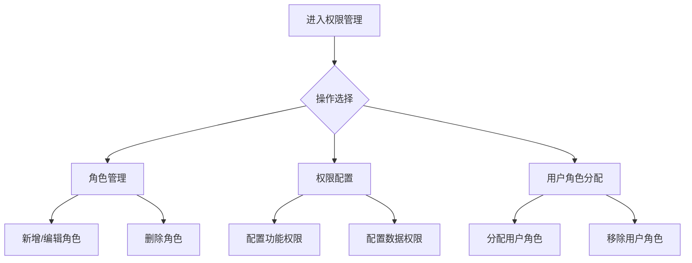

# AI拍照市调系统 · 系统权限管理功能设计

***

## 文档信息

| 项目   | 内容                   |
| ---- | -------------------- |
| 文档编号 | PRD-FN-005-2026-001 |
| 文档版本 | v0.1                 |
| 产品名称 | AI拍照市调系统             |
| 所属系统 | AI拍照市调系统             |
| 编制日期 | 2026-06-12       |
| 编制人员 | 周先虎               |

### 修订记录

| 版本   | 修订日期           | 修订说明 | 修订人    |
| ---- | -------------- | ---- | ------ |
| v0.1 | 2026-06-12 | 初稿创建 | 周先虎 |

***

> **文档使用说明**
>
> - `【替换】` 标记的内容：使用时替换为实际业务内容
> - `【删除】` 标记的内容：仅为填写说明，完成后删除
> - 本模板供 AI 开发智能体读取，请保持结构完整

> **文档撰写规范（重要）**
>
> 1. **严格遵循模板格式**：各章节表格字段必须与模板保持一致
> 2. **聚焦业务规则**：描述业务逻辑、数据约束、权限控制等，不写技术实现细节
> 3. **减少不必要的示例**：不写JSON/XML格式的报文示例
> 4. **页面布局与交互分离**：§四仅描述页面结构，§五描述业务规则

***

## 一、功能角色矩阵说明

### 1.1 功能描述

- **功能名称：** 系统权限管理
- **所属模块：** 系统管理
- **功能描述：** 基于钉钉AI表格的权限管理能力，实现按角色控制AI表格功能和数据权限，包括角色定义、权限分配、用户角色关联等功能。

### 1.2 角色权限总览

| 角色      | 功能权限                        | 数据权限   |
| ------- | --------------------------- | ------ |
| 系统管理员 | 全功能权限，包括角色和权限配置       | 全量数据   |
| 单品运营 | 查看所有数据，配置告警规则，生成报告    | 全量数据   |
| 采购人员 | 查看识别结果、比价报告、价格趋势      | 全量数据（只读） |
| 市调人员 | 拍照上传、查看本人采集数据           | 本人采集的数据 |
| 复核人员 | 复核分配给自己的待复核数据            | 分配给自己的复核数据 |

### 1.3 功能角色矩阵

| 功能点  | 系统管理员 | 单品运营 | 采购人员 | 市调人员 | 复核人员 |
| ---- | :-----: | :-----: | :-----: | :-----: | :-----: |
| 角色管理 |    是    |    否    |    否    |    否    |    否    |
| 权限配置 |    是    |    否    |    否    |    否    |    否    |
| 用户角色分配 |    是    |    否    |    否    |    否    |    否    |
| 查看本人数据 |    是    |    是    |    是    |    是    |    是    |
| 查看全量数据 |    是    |    是    |    是    |    否    |    否    |

***

## 二、模块路径

钉钉AI表格应用 → AI拍照市调系统 → 系统管理 → 权限管理

***

## 三、状态流转与流程图

### 3.1 权限管理流程



***

## 四、页面布局

### 4.1 页面清单

|  序号 | 页面名称    | 页面类型   | 描述                           |
| :-: | ------- | ------ | ---------------------------- |
|  1  | 角色管理页面 | 主页面    | 展示角色列表，支持新增、编辑、删除角色          |
|  2  | 新增/编辑角色弹窗 | 弹窗     | 新增或编辑角色信息，配置功能权限和数据权限        |
|  3  | 用户角色分配页面 | 主页面    | 展示用户列表，支持为用户分配角色              |

***

### 4.2 角色管理页面布局

```
┌─────────────────────────────────────────────────────────────────┐
│  ← 角色管理                                                      │
├─────────────────────────────────────────────────────────────────┤
│  工具栏区    [+新增角色]                                           │
├─────────────────────────────────────────────────────────────────┤
│  列表数据区                                                       │
│  ┌────┬──────────┬──────────┬──────────┬──────────┬────────┐  │
│  │ 序号 │ 角色名称  │ 角色描述  │ 用户数量  │ 状态     │ 操作   │  │
│  ├────┼──────────┼──────────┼──────────┼──────────┼────────┤  │
│  │  1  │ 系统管理员 │ 全功能权限 │ 2       │ 启用     │ [编辑] │  │
│  │  2  │ 单品运营  │ 数据分析权限│ 5       │ 启用     │ [编辑] │  │
│  │  3  │ 采购人员  │ 数据查看权限│ 8       │ 启用     │ [编辑] │  │
│  │  4  │ 市调人员  │ 采集权限   │ 20      │ 启用     │ [编辑] │  │
│  │  5  │ 复核人员  │ 复核权限   │ 6       │ 启用     │ [编辑] │  │
│  └────┴──────────┴──────────┴──────────┴──────────┴────────┘  │
└─────────────────────────────────────────────────────────────────┘
```

### 4.2.1 工具栏区

| 组件名称 | 组件类型 | 位置 | 提示语 | 说明          |
| ---- | ---- | -- | --- | ----------- |
| 新增角色 | 按钮   | 居左 | —   | 打开新增角色弹窗 |

### 4.2.2 列表展示区

| 字段      | 组件类型 | 位置 | 说明                |
| ------- | ---- | -- | ----------------- |
| 序号      | 文本   | 居中 | —                 |
| 角色名称    | 文本   | 居左 | —                 |
| 角色描述    | 文本   | 居左 | —                 |
| 用户数量    | 文本   | 居中 | 该角色下的用户数量      |
| 状态      | 标签   | 居中 | 启用/禁用            |
| 操作      | 按钮组  | 居中 | [编辑]             |

***

### 4.3 新增/编辑角色弹窗布局

```
┌─────────────────────────────────────────────────────────────────┐
│  新增角色                                                  [X]  │
├─────────────────────────────────────────────────────────────────┤
│                                                                 │
│  角色名称：[                                    ]                │
│  角色描述：[                                    ]                │
│                                                                 │
│  功能权限：                                                     │
│  ☑ 拍照采集    ☑ 查看识别结果    ☑ 人工复核                    │
│  ☑ 比价报告    ☑ 价格趋势      ☑ 异常告警                     │
│  ☑ 数据导出    ☑ 竞对管理      ☑ 商品库管理                    │
│  ☐ 权限管理    ☐ 系统配置                                     │
│                                                                 │
│  数据权限：                                                     │
│  ○ 全量数据    ○ 本人数据    ○ 分配数据                       │
│                                                                 │
│                                        [取消]  [确定]            │
└─────────────────────────────────────────────────────────────────┘
```

### 4.3.1 表单字段说明

| 字段      | 组件类型 | 位置   | 提示语            | 说明        |
| ------- | ---- | ---- | -------------- | --------- |
| 角色名称    | 输入框  | 独占一行 | 提示"请输入角色名称" | 必填\*，2-50个字符，不可重复 |
| 角色描述    | 文本域  | 独占一行 | 提示"请输入角色描述" | 非必填，最多200字符 |
| 功能权限    | 复选框组 | 独占一行 | — | 必填\*，至少勾选1项 |
| 数据权限    | 单选按钮组 | 独占一行 | — | 必填\* |

### 4.3.2 按钮区

| 按钮 | 组件类型 | 位置 | 说明       |
| -- | ---- | -- | -------- |
| 取消 | 按钮   | 居右 | 关闭弹窗     |
| 确定 | 按钮   | 居右 | 灰化→合规后可用 |

***

### 4.4 用户角色分配页面布局

```
┌─────────────────────────────────────────────────────────────────┐
│  ← 用户角色分配                                                   │
├─────────────────────────────────────────────────────────────────┤
│  查询条件区                                                       │
│  ┌─────────────┐ ┌─────────────┐ ┌──────┐ ┌──────┐             │
│  │ 用户姓名    │ │ 角色       │ │ 查询 │ │ 重置 │             │
│  │ [输入框    ]│ │ [下拉框    ]│ │ 按钮 │ │ 按钮 │             │
│  └─────────────┘ └─────────────┘ └──────┘ └──────┘             │
├─────────────────────────────────────────────────────────────────┤
│  列表数据区                                                       │
│  ┌────┬──────────┬──────────┬──────────┬────────┐            │
│  │ 序号 │ 用户姓名  │ 钉钉ID   │ 当前角色  │ 操作   │            │
│  ├────┼──────────┼──────────┼──────────┼────────┤            │
│  │  1  │ 张三     │ ding123 │ 单品运营  │ [分配角色]│            │
│  │  2  │ 李四     │ ding456 │ 市调人员  │ [分配角色]│            │
│  │  3  │ 王五     │ ding789 │ 复核人员  │ [分配角色]│            │
│  └────┴──────────┴──────────┴──────────┴────────┘            │
├─────────────────────────────────────────────────────────────────┤
│  分页区    [< 1 2 3 >]  [每页 20 ▼]  共 41 条                    │
└─────────────────────────────────────────────────────────────────┘
```

### 4.4.1 查询条件区

| 组件名称    | 组件类型 | 位置 | 提示语            | 说明        |
| ------- | ---- | -- | -------------- | --------- |
| 用户姓名    | 输入框  | 居左 | 提示"请输入用户姓名" | 模糊查询      |
| 角色      | 下拉框  | 居左 | 提示"请选择角色" | 枚举：全部/系统管理员/单品运营/采购人员/市调人员/复核人员 |
| 查询      | 按钮   | 居右 | —              | 主按钮       |
| 重置      | 按钮   | 居右 | —              | 次按钮       |

### 4.4.2 列表展示区

| 字段      | 组件类型 | 位置 | 说明                |
| ------- | ---- | -- | ----------------- |
| 序号      | 文本   | 居中 | —                 |
| 用户姓名    | 文本   | 居左 | 只读，来自钉钉用户信息   |
| 钉钉ID    | 文本   | 居左 | 只读，来自钉钉用户信息   |
| 当前角色    | 标签   | 居中 | 显示当前分配的角色      |
| 操作      | 按钮组  | 居中 | [分配角色]          |

***

## 五、页面交互说明

### 5.1 角色管理页面交互说明

#### 5.1.1 操作交互逻辑

| 操作类型 | 触发操作     | 交互可用性       | 正向输出                                        | 异常场景                                           | 异常处理             | 日志级别 |
| ---- | -------- | ----------- | ------------------------------------------- | ---------------------------------------------- | ---------------- | ---- |
| 新增   | 点击"新增角色" | 始终可用        | 打开新增角色弹窗                                 | 无                                              | 无                | 接口级  |
| 编辑   | 点击"编辑"   | 始终可用        | 打开编辑角色弹窗，反显当前角色信息和权限配置                  | 无                                              | 无                | 接口级  |
| 删除   | 点击"删除"   | 无用户关联时可用 | 弹出确认弹窗"是否确认删除该角色？"；确认后执行删除               | 存在关联用户时按钮灰化不可点击                                  | —                | 接口级  |

#### 5.1.2 弹窗说明

| 规则项  | 说明                                   |
| ---- | ------------------------------------ |
| 打开方式 | 点击"新增角色"或"编辑"按钮                    |
| 标题   | 新增时显示"新增角色"；编辑时显示"编辑角色"            |
| 数据反显 | 编辑时自动回填当前角色信息和权限配置；新增时所有字段为空        |
| 校验时机 | 字段失焦时触发单字段校验；点击"确定"时触发全量校验           |
| 保存规则 | 全部校验通过后提交保存；校验失败时字段下方显示红色提示文本，字段边框变红 |
| 关闭确认 | 如有未保存的修改，关闭时弹出二次确认"是否放弃修改？"          |

***

### 5.2 用户角色分配页面交互说明

#### 5.2.1 字段交互规则

| 字段        | 类型  | 是否必填 | 约束规则                  | 展示规则 | 举例或枚举       |
| --------- | --- | :--: | --------------------- | ---- | ----------- |
| 用户姓名    | 输入框 |   否  | 支持模糊查询，最大50字符  | 明文   | 张三          |
| 角色      | 下拉框 |   否  | 精确查询，枚举值见数据字典 | 明文   | 单品运营/市调人员  |

#### 5.2.2 操作交互逻辑

| 操作类型 | 触发操作     | 交互可用性       | 正向输出                                        | 异常场景                                           | 异常处理             | 日志级别 |
| ---- | -------- | ----------- | ------------------------------------------- | ---------------------------------------------- | ---------------- | ---- |
| 查询   | 点击"查询"   | 始终可用        | 按条件筛选，结果在列表中展示，分页同步更新                       | 无                                              | 无                | 接口级  |
| 重置   | 点击"重置"   | 始终可用        | 清空所有筛选条件，恢复初始查询状态                           | 无                                              | 无                | 接口级  |
| 分配角色 | 点击"分配角色" | 始终可用        | 打开角色分配弹窗                                 | 无                                              | 无                | 接口级  |

#### 5.2.3 角色分配弹窗说明

| 规则项  | 说明                                   |
| ---- | ------------------------------------ |
| 打开方式 | 点击"分配角色"按钮                         |
| 标题   | 显示"分配角色 - {用户姓名}"                   |
| 角色选择 | 展示所有启用状态的角色，当前角色默认选中                 |
| 保存规则 | 选择角色后点击"确定"保存，弹窗关闭，列表刷新              |

***

## 六、错误处理规范

### 6.1 表单校验错误

- 显示方式：对应字段下方显示红色提示文本，字段边框变红
- 触发时机：表单提交时触发全量校验；字段失去焦点时触发单字段校验

| 字段      | 为空时错误信息     | 格式错误时信息           |
| ------- | ----------- | ----------------- |
| 角色名称 | 角色名称不能为空 | 角色名称长度不能超过50个字符 |
| 功能权限 | 请至少勾选1项功能权限 | — |

### 6.2 操作错误

| 场景      | 触发条件                         | 提示文案                    | 处理方式                       |
| ------- | ---------------------------- | ----------------------- | -------------------------- |
| 角色保存失败 | 接口请求失败                       | 保存失败，请重试！              | Toast提示                   |
| 角色删除失败 | 存在关联用户                      | 该角色下存在用户，无法删除         | Toast提示，阻断删除              |
| 角色分配失败 | 接口请求失败                       | 角色分配失败，请重试！            | Toast提示                   |
| 网络异常   | 接口请求超时                       | 网络异常，请稍候再试            | Toast提示                   |

***

## 七、非功能性需求

### 7.1 合规与安全要求

| 适用规范       | 内容摘要              | 本模块特有说明                    |
| ---------- | ----------------- | -------------------------- |
| 访问控制   | RBAC最小权限、数据权限隔离   | 每个角色仅赋予完成本职工作所需的最小权限集       |
| 操作日志   | 字段级日志、保留期限、不可篡改   | 覆盖操作：角色新增/编辑/删除/权限配置/用户角色分配 |
| 高危操作二次确认 | 删除角色等高危操作需二次确认 | 删除角色前须弹出确认弹窗              |

### 7.2 性能需求

| 需求项       | 指标要求          | 说明            |
| --------- | ------------- | ------------- |
| 列表查询响应时间  | ≤ 2秒          | 正常网络条件下，含分页查询 |
| 保存/提交响应时间 | ≤ 3秒          | 角色新增/编辑/删除等写操作 |
| 页面首屏加载时间  | ≤ 3秒          | —             |
| 并发用户数     | 10人           | 同时操作权限管理（仅管理员） |

***

## 八、特殊说明

### 8.1 预设角色说明

系统预设以下5个角色，不可删除，但可编辑权限配置：

| 角色 | 预设功能权限 | 数据权限 | 说明 |
| ---- | -------- | ---- | ---- |
| 系统管理员 | 全功能 | 全量数据 | 系统最高权限 |
| 单品运营 | 拍照采集、查看识别结果、比价报告、价格趋势、异常告警、数据导出、竞对管理、商品库管理 | 全量数据 | 数据分析和管理 |
| 采购人员 | 查看识别结果、比价报告、价格趋势、数据导出 | 全量数据（只读） | 数据查看和导出 |
| 市调人员 | 拍照采集、查看本人采集数据 | 本人采集的数据 | 数据采集执行 |
| 复核人员 | 人工复核 | 分配给自己的复核数据 | 数据质量保障 |

### 8.2 权限变更生效规则

1. **即时生效**：角色权限变更后，立即对所有关联用户生效
2. **会话刷新**：用户下次操作时自动刷新权限缓存
3. **强制刷新**：管理员可强制刷新所有用户权限缓存

### 8.3 钉钉AI表格权限集成

1. **表格级权限**：通过钉钉AI表格权限配置控制整个表格的访问权限
2. **行级权限**：通过AI表格视图筛选实现行级数据权限控制
3. **列级权限**：通过AI表格字段权限控制敏感字段的可见性
4. **自动化流程**：权限变更时自动触发钉钉AI表格权限同步

### 8.4 数据权限隔离规则

1. **市调人员**：仅可查看和操作本人采集的市调任务、照片和识别结果
2. **复核人员**：仅可查看和操作分配给自己的待复核数据
3. **采购人员**：可查看所有识别结果和比价数据，但不可修改
4. **单品运营**：可查看和操作全量数据
5. **系统管理员**：全功能权限，无限制

***

## 九、数据字典

### 9.1 字典项定义

**角色状态（roleStatus）**

| 枚举值（code） | 显示文本（label） | 说明     |
| :-------: | ----------- | ------ |
|     ENABLED     | 启用     | 角色正常使用中  |
|     DISABLED     | 禁用     | 角色已禁用，关联用户失去该角色权限 |

**数据权限类型（dataPermissionType）**

| 枚举值（code） | 显示文本（label） | 说明     |
| :-------: | ----------- | ------ |
|     ALL     | 全量数据     | 可查看全量数据  |
|     SELF     | 本人数据     | 仅可查看本人数据 |
|     ASSIGNED     | 分配数据     | 仅可查看分配给自己的数据 |

### 9.2 下拉框数据来源说明

| 字段名     | 数据来源类型 | 来源说明                        |
| ------- | ------ | --------------------------- |
| 角色      | 接口动态加载 | 来源：权限管理模块接口，仅加载启用状态角色  |

***

## 十、外部系统接口说明

### 10.1 接口清单

| 接口名称    | 功能描述           | 交互方向     | 依赖系统     | 数据流向                    |
| ------- | -------------- | -------- | -------- | ----------------------- |
| 角色管理接口 | 角色CRUD操作       | 调用      | 钉钉AI表格  | 本系统→钉钉AI表格              |
| 权限配置接口 | 配置角色功能权限和数据权限 | 调用      | 钉钉AI表格  | 本系统→钉钉AI表格              |
| 用户角色接口 | 用户角色分配和查询    | 调用      | 钉钉AI表格  | 本系统→钉钉AI表格              |
| 权限校验接口 | 校验用户是否有权限执行操作 | 调用      | 钉钉AI表格  | 本系统→钉钉AI表格→本系统          |

### 10.2 接口详细说明

**角色管理接口**

| 规则项  | 说明                    |
| ---- | --------------------- |
| 触发时机 | 管理员新增/编辑/删除角色时调用     |
| 请求条件 | 角色名称不重复，必填字段完整       |
| 成功处理 | 角色信息保存成功，权限配置同步更新    |
| 失败处理 | 记录失败日志，提示用户重试         |
| 重试机制 | 不自动重试，由用户手动重试         |

**权限校验接口**

| 规则项  | 说明                    |
| ---- | --------------------- |
| 触发时机 | 用户执行任何功能操作时自动触发      |
| 请求条件 | 用户已登录，获取到用户角色信息      |
| 成功处理 | 返回权限校验结果，有权限则继续执行    |
| 失败处理 | 无权限时返回403，前端拦截提示       |
| 重试机制 | 不自动重试                  |

***

*文档结束*
