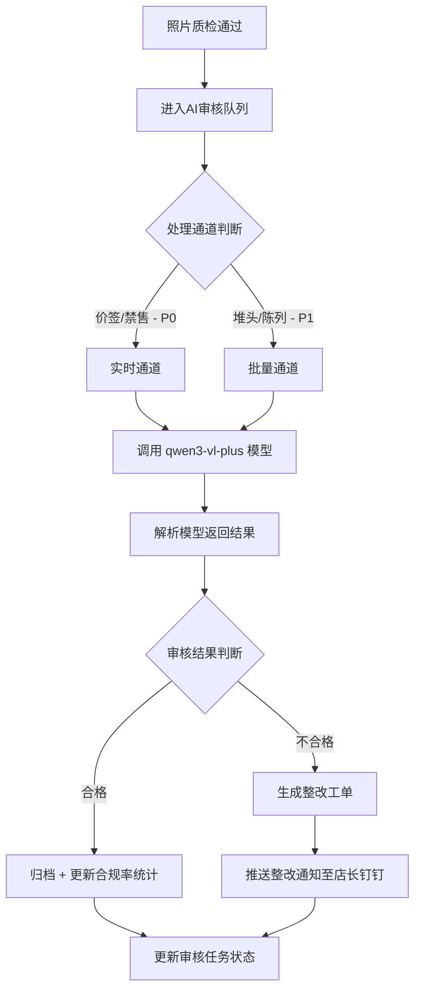
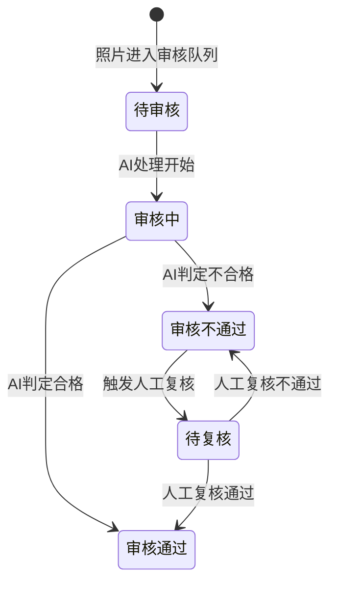

# AI视觉督导系统 · AI审核核心功能设计

***

## 文档信息

| 项目   | 内容                   |
| ---- | -------------------- |
| 文档编号 | PRD-002-M-2026-004 |
| 文档版本 | v0.1                 |
| 产品名称 | AI视觉督导系统（陈列审核） |
| 所属系统 | 钉钉AI表格应用             |
| 编制日期 | 2026-06-12       |
| 编制人员 | 督导部/商学院               |

### 修订记录

| 版本   | 修订日期           | 修订说明 | 修订人    |
| ---- | -------------- | ---- | ------ |
| v0.1 | 2026-06-12 | 初稿创建 | 督导部/商学院 |

***

> **文档使用说明**
>
> - 本模块对应 PRD-002 中 F-003 价签合规检测、F-004 禁售商品检测、F-005 商品摆放检测、F-006 堆头饱满度评估功能
> - 本功能作为钉钉AI表格应用运行，利用钉钉AI字段进行图片识别，通过连接器调用外部AI服务

***

## 一、功能角色矩阵说明

### 1.1 功能描述

- **功能名称：** AI审核核心
- **所属模块：** AI视觉督导系统
- **功能描述：** 利用 qwen3-vl-plus 多模态大模型对门店陈列照片进行智能识别，覆盖价签合规、禁售商品、商品摆放、堆头饱满度四个审核维度，实现从"人眼审核"到"AI审核"的升级。

### 1.2 角色权限总览

| 角色      | 功能权限                        | 数据权限   |
| ------- | --------------------------- | ------ |
| 督导人员 | 查看审核结果、触发复核、查看AI识别详情     | 全量数据   |
| 店长 | 查看本店审核结果、查看问题详情           | 仅本店数据 |
| 运营管理层 | 查看审核结果、查看统计、导出数据         | 全量数据 |

### 1.3 功能角色矩阵

| 功能点  | 督导人员 | 店长 | 运营管理层 |
| ---- | :-----: | :-----: | :-----: |
| 查看审核结果 |    是    |    是    |    是    |
| 查看AI识别详情 |    是    |    是    |    是    |
| 触发人工复核 |    是    |    否    |    否    |
| 导出数据 |    否    |    否    |    是    |

***

## 二、模块路径

系统首页 → AI视觉督导系统 → 审核管理 → 审核结果列表

***

## 三、状态流转与流程图

### 3.1 AI审核主流程



### 3.2 审核结果状态流转图



***

## 四、页面布局

### 4.1 页面清单

|  序号 | 页面名称    | 页面类型   | 描述                           |
| :-: | ------- | ------ | ---------------------------- |
|  1  | 审核结果列表 | 主页面    | 展示审核结果列表，支持查询、筛选、操作       |
|  2  | 审核详情弹窗  | 弹窗     | 查看单张照片的AI审核详情（含模型原始返回）    |
|  3  | 人工复核弹窗  | 弹窗     | 督导对边界案例进行人工复核              |

***

### 4.2 审核结果列表页面布局

```
┌─────────────────────────────────────────────────────────────────┐
│  查询条件区                                                       │
│  ┌─────────────┐ ┌─────────────┐ ┌─────────────┐ ┌──────┐ ┌──────┐ │
│  │ 门店名称    │ │ 审核维度    │ │ 审核结果    │ │ 查询 │ │ 重置 │ │
│  │ [输入框    ]│ │ [下拉框    ]│ │ [下拉框    ]│ │ 按钮 │ │ 按钮 │ │
│  └─────────────┘ └─────────────┘ └─────────────┘ └──────┘ └──────┘ │
├─────────────────────────────────────────────────────────────────┤
│  工具栏区                              [导出]                   │
├─────────────────────────────────────────────────────────────────┤
│  列表数据区                                                       │
│  ┌─────┬──────────┬──────────┬──────────┬──────────┬────────┐  │
│  │ 序号 │ 门店名称 │ 审核维度 │ 审核结果 │ 置信度   │ 操作   │  │
│  ├─────┼──────────┼──────────┼──────────┼──────────┼────────┤  │
│  │  1  │ 成都春熙路店 │ 价签合规 │ 不通过 │ 0.92 │ [详情] [复核]│  │
│  │  2  │ 成都春熙路店 │ 堆头饱满度 │ 通过 │ 0.80 │ [详情] │  │
│  └─────┴──────────┴──────────┴──────────┴──────────┴────────┘  │
├─────────────────────────────────────────────────────────────────┤
│  分页区    [< 1 2 3 ... 10 >]  [每页 10 ▼]  共 500 条            │
└─────────────────────────────────────────────────────────────────┘
```

### 4.2.1 查询条件区

| 组件名称    | 组件类型 | 位置 | 提示语            | 说明        |
| ------- | ---- | -- | -------------- | --------- |
| 门店名称 | 输入框  | 居左 | 请输入门店名称 | 模糊查询 |
| 审核维度 | 下拉框  | 居左 | 请选择审核维度 | 精确查询 |
| 审核结果 | 下拉框  | 居左 | 请选择审核结果 | 精确查询 |
| 查询      | 按钮   | 居右 | —              | 主按钮       |
| 重置      | 按钮   | 居右 | —              | 次按钮       |

### 4.2.2 工具栏区

| 组件名称 | 组件类型 | 位置 | 提示语 | 说明          |
| ---- | ---- | -- | --- | ----------- |
| 导出   | 按钮   | 居右 | —   | 运营管理层权限 |

### 4.2.3 列表展示区

| 字段      | 组件类型 | 位置 | 说明                |
| ------- | ---- | -- | ----------------- |
| 序号      | 文本   | 居中 | —                 |
| 门店名称 | 文本   | 居左 | —                 |
| 照片缩略图 | 图片   | 居中 | 80x80 缩略图 |
| 审核维度 | 标签   | 居中 | 价签合规/禁售商品/商品摆放/堆头饱满度 |
| 审核结果 | 标签   | 居中 | 通过/不通过/待复核 |
| 置信度 | 文本   | 居中 | 0-1，保留两位小数 |
| 操作      | 按钮组  | 居中 | [详情] [复核] |

### 4.2.4 分页控件区

| 控件    | 组件类型 | 位置 | 说明      |
| ----- | ---- | -- | ------- |
| 总条数   | 文本   | 居左 | 共0条记录   |
| 页码按钮  | 按钮组  | 居中 | 1高亮     |
| 向前翻页  | 按钮   | 居中 | <       |
| 向后翻页  | 按钮   | 居中 | >       |
| 每页条目数 | 下拉框  | 居右 | 默认10条/页 |
| 跳转至页码 | 输入框  | 居右 | 默认1     |

***

### 4.3 审核详情弹窗布局

```
┌─────────────────────────────────────────────────┐
│  审核详情                                  [X]  │
├─────────────────────────────────────────────────┤
│  ┌─────────────────────────────────────────┐    │
│  │         [照片预览区域]                    │    │
│  │                                          │    │
│  └─────────────────────────────────────────┘    │
│  ┌──────────────┐ ┌────────────────────────┐    │
│  │ 门店名称     │ │ 成都春熙路店              │    │
│  └──────────────┘ └────────────────────────┘    │
│  ┌──────────────┐ ┌────────────────────────┐    │
│  │ 照片类型     │ │ 陈列                   │    │
│  └──────────────┘ └────────────────────────┘    │
│  ┌──────────────┐ ┌────────────────────────┐    │
│  │ 处理通道     │ │ 实时                   │    │
│  └──────────────┘ └────────────────────────┘    │
│  ┌──────────────┐ ┌────────────────────────┐    │
│  │ 审核结果     │ │ 不通过                  │    │
│  └──────────────┘ └────────────────────────┘    │
│  ┌─────────────────────────────────────────┐    │
│  │ 审核维度结果                              │    │
│  │ ┌──────────┬──────────┬──────────┐      │    │
│  │ │ 维度     │ 结果     │ 置信度   │      │    │
│  │ ├──────────┼──────────┼──────────┤      │    │
│  │ │ 价签合规 │ 不通过   │ 0.92     │      │    │
│  │ │ 禁售商品 │ 通过     │ 0.90     │      │    │
│  │ │ 商品摆放 │ 通过     │ 0.85     │      │    │
│  │ │ 堆头饱满 │ B级      │ 0.80     │      │    │
│  │ └──────────┴──────────┴──────────┘      │    │
│  └─────────────────────────────────────────┘    │
│  ┌──────────────┐ ┌────────────────────────┐    │
│  │ 问题列表     │ │ 价签缺失               │    │
│  └──────────────┘ └────────────────────────┘    │
│  ┌──────────────┐ ┌────────────────────────┐    │
│  │ 建议列表     │ │ 请补充价签             │    │
│  └──────────────┘ └────────────────────────┘    │
│                                                 │
│                                    [关闭]       │
└─────────────────────────────────────────────────┘
```

### 4.3.1 展示字段说明

| 字段      | 组件类型 | 位置   | 说明         |
| ------- | ---- | ---- | ---------- |
| 照片预览 | 图片   | 独占一行 | 支持放大查看 |
| 门店名称 | 文本   | 独占一行 | 只读         |
| 照片类型 | 文本   | 独占一行 | 只读         |
| 处理通道 | 文本   | 独占一行 | 只读 |
| 审核结果 | 文本   | 独占一行 | 只读 |
| 审核维度结果 | 表格   | 独占一行 | 各维度结果+置信度 |
| 问题列表 | 文本   | 独占一行 | 只读 |
| 建议列表 | 文本   | 独占一行 | 只读 |

***

### 4.4 人工复核弹窗布局

```
┌─────────────────────────────────────────────────┐
│  人工复核                                  [X]  │
├─────────────────────────────────────────────────┤
│  ┌─────────────────────────────────────────┐    │
│  │         [照片预览区域]                    │    │
│  │                                          │    │
│  └─────────────────────────────────────────┘    │
│  ┌──────────────┐ ┌────────────────────────┐    │
│  │ AI审核结果   │ │ 不通过                  │    │
│  └──────────────┘ └────────────────────────┘    │
│  ┌──────────────┐ ┌────────────────────────┐    │
│  │ AI识别问题   │ │ 价签缺失               │    │
│  └──────────────┘ └────────────────────────┘    │
│  ┌─────────────────────────────────────────┐    │
│  │ 复核结果                                  │    │
│  │ ○ 通过  ○ 不通过                          │    │
│  └─────────────────────────────────────────┘    │
│  ┌─────────────────────────────────────────┐    │
│  │ 复核意见                                  │    │
│  │ [多行文本框                            ]  │    │
│  └─────────────────────────────────────────┘    │
│                                                 │
│                              [取消]  [确定]      │
└─────────────────────────────────────────────────┘
```

### 4.4.1 表单字段说明

| 字段      | 组件类型 | 位置   | 提示语            | 说明        |
| ------- | ---- | ---- | -------------- | --------- |
| 照片预览 | 图片   | 独占一行 | —              | 只读 |
| AI审核结果 | 文本   | 独占一行 | —              | 只读 |
| AI识别问题 | 文本   | 独占一行 | —              | 只读 |
| 复核结果 | 单选按钮  | 独占一行 | —              | 必填\* |
| 复核意见 | 多行文本  | 独占一行 | 请输入复核意见 | 复核结果为"不通过"时必填 |

### 4.4.2 按钮区

| 按钮 | 组件类型 | 位置 | 说明       |
| -- | ---- | -- | -------- |
| 取消 | 按钮   | 居右 | 关闭弹窗     |
| 确定 | 按钮   | 居右 | 灰化→选择复核结果后可用 |

***

## 五、页面交互说明

### 5.1 审核结果列表页面交互说明

#### 5.1.1 字段交互规则

| 字段        | 类型  | 是否必填 | 约束规则                  | 展示规则 | 举例或枚举       |
| --------- | --- | :--: | --------------------- | ---- | ----------- |
| 门店名称 | 输入框 |   否  | 支持模糊查询；最大50字符  | 明文   | 成都春熙路店 |
| 审核维度 | 下拉框 |   否  | 精确查询；数据源参见第九章数据字典 | 明文   | 价签合规/堆头饱满度 |
| 审核结果 | 下拉框 |   否  | 精确查询 | 明文   | 通过/不通过/待复核 |

#### 5.1.2 操作交互逻辑

| 操作类型 | 触发操作     | 交互可用性       | 正向输出                                        | 异常场景                                           | 异常处理             | 日志级别 |
| ---- | -------- | ----------- | ------------------------------------------- | ---------------------------------------------- | ---------------- | ---- |
| 查询   | 点击"查询"   | 始终可用        | 按条件筛选，结果在列表中展示，分页同步更新                       | —                                              | —                | 接口级  |
| 重置   | 点击"重置"   | 始终可用        | 清空所有筛选条件，恢复初始查询状态                           | 无                                              | 无                | 接口级  |
| 查看   | 点击"详情"   | 始终可用        | 打开审核详情弹窗，展示完整AI识别结果                    | 无                                              | 无                | 接口级  |
| 复核   | 点击"复核"   | 审核结果为"不通过"时可用 | 打开人工复核弹窗，督导对AI结果进行人工确认 | 审核结果为"通过"时按钮灰化不可点击 | — | 接口级  |
| 导出   | 点击"导出"   | 始终可用        | 导出Excel文件             | 无数据                                            | Toast提示"暂无数据可导出" | 接口级  |

> **导出文件命名规范**：
>
> - 格式：`{业务前缀}_{YYYYMMDD}_{HHMMSS}.xlsx`
> - 示例：`审核结果数据_20260612_103045.xlsx`

***

### 5.2 审核详情弹窗交互说明

#### 5.2.1 字段交互规则

| 字段      | 组件类型 | 是否必填 | 约束规则       | 展示规则 | 举例或枚举               |
| ------- | ---- | :--: | ---------- | ---- | ------------------- |
| 照片预览 | 图片   |   —  | 支持点击放大查看 | 明文   | — |
| 门店名称 | 文本   |   —  | 只读，不可编辑    | 明文   | 成都春熙路店 |
| 照片类型 | 文本   |   —  | 只读，不可编辑    | 明文   | 陈列 |
| 处理通道 | 文本   |   —  | 只读 | 明文   | 实时 |
| 审核结果 | 文本   |   —  | 只读 | 明文   | 不通过 |
| 审核维度结果 | 表格   |   —  | 只读 | 明文   | 各维度结果+置信度 |
| 问题列表 | 文本   |   —  | 只读 | 明文   | 价签缺失 |
| 建议列表 | 文本   |   —  | 只读 | 明文   | 请补充价签 |

#### 5.2.2 操作交互逻辑

| 操作类型 | 触发操作     | 交互可用性 | 正向输出        | 异常场景 | 异常处理 | 日志级别 |
| ---- | -------- | ----- | ----------- | ---- | ---- | ---- |
| 关闭   | 点击"关闭"按钮 | 始终可用  | 关闭弹窗，返回列表页面 | 无    | 无    | 不记录  |

***

### 5.3 人工复核弹窗交互说明

#### 5.3.1 字段交互规则

| 字段      | 组件类型 | 是否必填 | 约束规则       | 展示规则 | 举例或枚举               |
| ------- | ---- | :--: | ---------- | ---- | ------------------- |
| 照片预览 | 图片   |   —  | 支持点击放大查看 | 明文   | — |
| 门店名称 | 文本   |   —  | 只读，不可编辑    | 明文   | 成都春熙路店 |
| 审核维度 | 文本   |   —  | 只读，不可编辑    | 明文   | 价签合规 |
| AI审核结果 | 文本   |   —  | 只读 | 明文   | 不通过 |
| AI识别问题 | 文本   |   —  | 只读 | 明文   | 价签缺失 |
| AI置信度 | 文本   |   —  | 只读 | 明文   | 0.92 |
| 复核结果 | 单选按钮  |   是  | 必选 | 明文   | — |
| 复核意见 | 多行文本 |   否  | 最多200字符，复核结果为"不通过"时必填 | 明文   | — |

#### 5.3.2 操作交互逻辑

| 操作类型 | 触发操作      | 交互可用性       | 正向输出                    | 异常场景 | 异常处理               | 日志级别 |
| ---- | --------- | ----------- | ----------------------- | ---- | ------------------ | ---- |
| 确定保存 | 点击"确定"按钮  | 选择复核结果后可用 | 弹窗关闭，列表刷新，Toast提示"复核完成" | 保存失败 | Toast提示"保存失败，请重试！" | 接口级  |
| 取消   | 点击"取消"按钮  | 始终可用        | 关闭弹窗，不保存任何数据            | 无    | 无                  | 不记录  |
| 关闭   | 点击右上角\[X] | 始终可用        | 关闭弹窗，不保存任何数据            | 无    | 无                  | 不记录  |

#### 5.3.3 弹窗说明

| 规则项  | 说明                                   |
| ---- | ------------------------------------ |
| 打开方式 | 点击列表页操作列"复核"按钮            |
| 数据反显 | 自动展示照片、AI审核结果、问题描述、置信度 |
| 校验时机 | 点击"确定"时触发全量校验           |
| 保存规则 | 复核结果必填；复核意见在结果为"不通过"时必填 |
| 能力进化 | 复核结果与AI结果不一致时，自动标记为优化样本纳入能力进化数据集 |

***

## 六、错误处理规范

### 6.1 表单校验错误

- 显示方式：对应字段下方显示红色提示文本，字段边框变红
- 触发时机：提交时触发全量校验

| 字段      | 为空时错误信息     | 格式错误时信息           |
| ------- | ----------- | ----------------- |
| 复核结果 | 请选择复核结果  | —                 |

### 6.2 文件操作错误

| 场景      | 触发条件                         | 提示文案                    | 处理方式                       |
| ------- | ---------------------------- | ----------------------- | -------------------------- |
| 导出-无数据  | 当前查询结果为空                     | 暂无数据可导出                 | Toast 提示                   |
| 网络/服务异常 | 接口请求失败                       | 接口异常，请稍候再试              | Toast 提示                   |

***

## 七、非功能性需求

### 7.1 合规与安全要求

| 适用规范       | 内容摘要              | 本模块特有说明                    |
| ---------- | ----------------- | -------------------------- |
| 访问控制   | RBAC最小权限、数据权限隔离   | 店长仅可查看本店审核结果         |
| 操作日志   | 字段级日志、保留期限、不可篡改   | 覆盖操作：查看/复核/导出 |

### 7.2 性能需求

| 需求项       | 指标要求          | 说明            |
| --------- | ------------- | ------------- |
| 实时通道响应  | ≤ 3s          | 价签/禁售检测 |
| 批量通道处理  | ≤ 2h          | 堆头/陈列审核 |
| 列表查询响应时间  | ≤ 2s          | 正常网络条件下，含分页查询 |
| 页面首屏加载时间  | ≤ 3s          | —             |
| 并发用户数     | 100          | 门店同时上传审核 |

***

## 八、特殊说明

### 8.1 AI模型配置

| 项目 | 方案 |
| ---- | ---- |
| 推荐模型 | qwen3-vl-plus |
| 调用方式 | 实时 + Batch 混合 |
| 输入单价 | 0.0005 元/千 Token（Batch） |
| 输出单价 | 0.005 元/千 Token（Batch） |

### 8.2 审核维度与准确率要求

| 审核维度 | 准确率要求 | 处理通道 |
| -------- | -------- | -------- |
| 价签合规 | ≥ 95% | 实时 |
| 禁售商品检测 | ≥ 95% | 实时 |
| 商品摆放检测 | ≥ 85% | 批量 |
| 堆头饱满度评估 | ≥ 80% | 批量 |

### 8.3 其他特殊规则

1. 关键项（价签/禁售）实时处理，响应≤3秒；次要项（堆头/陈列）批量处理，响应≤2小时
2. 前置过滤规则引擎处理简单问题（模糊、非标格式），减少60% AI调用
3. 人工复核结果与AI结果不一致时，自动纳入能力进化数据集

***

## 九、数据字典

### 9.1 字典项定义

**审核维度（auditDimension）**

| 枚举值（code） | 显示文本（label） | 说明     |
| :-------: | ----------- | ------ |
|     1     | 价签合规     | 价签是否存在、对应、可读 |
|     2     | 禁售商品     | 非授权品牌/过期商品检测 |
|     3     | 商品摆放     | 指定商品位置检测 |
|     4     | 堆头饱满度     | 堆头填充程度评估 |
|     5     | 陈列标准     | 总部陈列规范符合度 |

**审核结果（auditResult）**

| 枚举值（code） | 显示文本（label） | 说明     |
| :-------: | ----------- | ------ |
|     0     | 待审核     | 照片进入审核队列 |
|     1     | 审核通过     | AI判定合格 |
|     2     | 审核不通过     | AI判定不合格 |
|     3     | 待复核     | 触发人工复核 |
|     4     | 复核通过     | 人工复核合格 |
|     5     | 复核不通过     | 人工复核不合格 |

**处理通道（processingChannel）**

| 枚举值（code） | 显示文本（label） | 说明     |
| :-------: | ----------- | ------ |
|     1     | 实时     | 关键项实时处理，响应≤3秒 |
|     2     | 批量     | 非关键项批量处理，响应≤2小时 |

### 9.2 下拉框数据来源说明

| 字段名     | 数据来源类型 | 来源说明                        |
| ------- | ------ | --------------------------- |
| 审核维度 | 字典项    | 参见 9.1 auditDimension            |
| 审核结果 | 字典项    | 参见 9.1 auditResult            |

***

*文档结束*