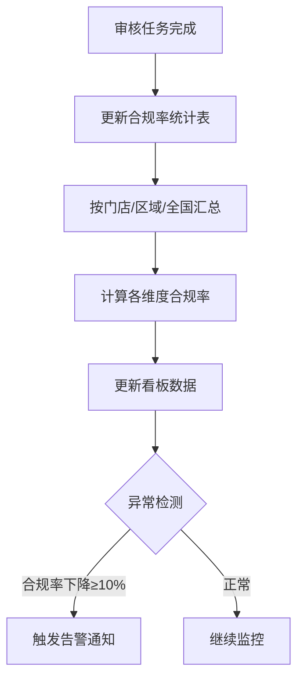
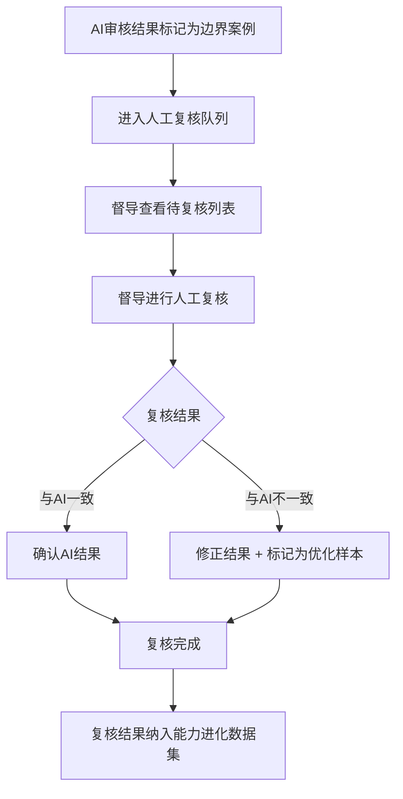

# AI视觉督导系统 · 合规率看板与人工复核工作台功能设计

***

## 文档信息

| 项目   | 内容                   |
| ---- | -------------------- |
| 文档编号 | PRD-002-M-2026-006 |
| 文档版本 | v0.1                 |
| 产品名称 | AI视觉督导系统（陈列审核） |
| 所属系统 | 钉钉AI表格应用             |
| 编制日期 | 2026-06-12       |
| 编制人员 | 督导部/商学院               |

### 修订记录

| 版本   | 修订日期           | 修订说明 | 修订人    |
| ---- | -------------- | ---- | ------ |
| v0.1 | 2026-06-12 | 初稿创建 | 督导部/商学院 |

***

> **文档使用说明**
>
> - 本模块对应 PRD-002 中 F-009 合规率看板、F-010 人工复核工作台、F-011 能力进化机制功能
> - 本功能作为钉钉AI表格应用运行，利用钉钉多维表格进行数据存储和统计

***

## 一、功能角色矩阵说明

### 1.1 功能描述

- **功能名称：** 合规率看板与人工复核工作台
- **所属模块：** AI视觉督导系统
- **功能描述：** 提供门店/区域/全国维度的合规率统计看板，支持督导对AI审核边界案例进行人工复核，并通过收集复核结果持续优化AI审核能力。

### 1.2 角色权限总览

| 角色      | 功能权限                        | 数据权限   |
| ------- | --------------------------- | ------ |
| 运营管理层 | 查看看板、查看趋势、导出报告、查看排名     | 全量数据   |
| 督导人员 | 查看看板、人工复核、查看复核记录         | 全量数据   |
| 商学院 | 查看看板、导出培训报告              | 全量数据 |
| 店长 | 查看本店合规趋势                   | 仅本店数据 |

### 1.3 功能角色矩阵

| 功能点  | 运营管理层 | 督导人员 | 商学院 | 店长 |
| ---- | :-----: | :-----: | :-----: | :-----: |
| 查看全国看板 |    是    |    是    |    是    |    否    |
| 查看区域看板 |    是    |    是    |    是    |    否    |
| 查看本店合规 |    是    |    是    |    是    |    是    |
| 人工复核 |    否    |    是    |    否    |    否    |
| 导出报告 |    是    |    否    |    是    |    否    |
| 查看排名 |    是    |    是    |    是    |    否    |

***

## 二、模块路径

系统首页 → AI视觉督导系统 → 合规看板 → 看板主页

系统首页 → AI视觉督导系统 → 人工复核 → 复核列表

***

## 三、状态流转与流程图

### 3.1 合规率统计流程



### 3.2 人工复核流程



***

## 四、页面布局

### 4.1 页面清单

|  序号 | 页面名称    | 页面类型   | 描述                           |
| :-: | ------- | ------ | ---------------------------- |
|  1  | 合规率看板主页 | 主页面    | 展示全国/区域/门店合规率统计看板          |
|  2  | 人工复核列表 | 主页面    | 展示待复核的边界案例列表               |
|  3  | 复核详情弹窗  | 弹窗     | 督导对单条审核结果进行人工复核            |
|  4  | 合规报告导出弹窗 | 弹窗     | 选择导出范围和格式                   |

***

### 4.2 合规率看板主页布局

```
┌─────────────────────────────────────────────────────────────────┐
│  筛选条件区                                                       │
│  ┌─────────────┐ ┌─────────────┐ ┌─────────────┐              │
│  │ 时间范围    │ │ 区域        │ │ 门店        │              │
│  │ [日期范围  ]│ │ [下拉框    ]│ │ [下拉框    ]│              │
│  └─────────────┘ └─────────────┘ └─────────────┘              │
├─────────────────────────────────────────────────────────────────┤
│  核心指标区                                                       │
│  ┌──────────┐ ┌──────────┐ ┌──────────┐ ┌──────────┐          │
│  │ 总审核数  │ │ 合规率   │ │ 较上期   │ │ 门店覆盖  │          │
│  │ 3,600    │ │ 82.5%    │ │ ↑ 5.2%  │ │ 300家    │          │
│  └──────────┘ └──────────┘ └──────────┘ └──────────┘          │
├─────────────────────────────────────────────────────────────────┤
│  趋势图区                                                         │
│  ┌─────────────────────────────────────────────────────────┐    │
│  │                                                          │    │
│  │              [合规率趋势折线图]                            │    │
│  │                                                          │    │
│  └─────────────────────────────────────────────────────────┘    │
├─────────────────────────────────────────────────────────────────┤
│  区域排名区                                                       │
│  ┌─────┬──────────┬──────────┬──────────┬──────────┐          │
│  │ 排名 │ 区域     │ 合规率   │ 审核数   │ 趋势     │          │
│  ├─────┼──────────┼──────────┼──────────┼──────────┤          │
│  │  1  │ 成都     │ 88.0%    │ 1,200    │ ↑        │          │
│  │  2  │ 重庆     │ 85.0%    │ 1,000    │ →        │          │
│  │  3  │ 贵阳     │ 75.0%    │ 800      │ ↓        │          │
│  └─────┴──────────┴──────────┴──────────┴──────────┘          │
├─────────────────────────────────────────────────────────────────┤
│  问题分布区                                                       │
│  ┌─────────────────────────────────────────────────────────┐    │
│  │                                                          │    │
│  │              [问题类型分布饼图]                            │    │
│  │                                                          │    │
│  └─────────────────────────────────────────────────────────┘    │
├─────────────────────────────────────────────────────────────────┤
│  工具栏区                              [导出报告]               │
└─────────────────────────────────────────────────────────────────┘
```

### 4.2.1 筛选条件区

| 组件名称    | 组件类型 | 位置 | 提示语            | 说明        |
| ------- | ---- | -- | -------------- | --------- |
| 时间范围 | 日期范围  | 居左 | 开始日期 - 结束日期 | 必填，默认近30天 |
| 区域 | 下拉框  | 居左 | 请选择区域 | 可选，全部区域 |
| 门店 | 下拉框  | 居左 | 请选择门店 | 可选，全部门店 |

### 4.2.2 核心指标区

| 指标      | 组件类型 | 位置 | 说明                |
| ------- | ---- | -- | ----------------- |
| 总审核数 | 数字卡片  | 居左 | 统计周期内审核任务总数 |
| 合规率 | 数字卡片  | 居左 | 通过数/总数，百分比 |
| 较上期 | 数字卡片  | 居左 | 与上一统计周期对比，↑/↓/→ |
| 门店覆盖 | 数字卡片  | 居左 | 参与审核的门店数量 |

### 4.2.3 趋势图区

| 图表类型 | 说明 |
| ---- | ---- |
| 合规率趋势折线图 | 按日/周展示合规率变化趋势，支持切换时间粒度 |

### 4.2.4 区域排名区

| 字段      | 组件类型 | 位置 | 说明                |
| ------- | ---- | -- | ----------------- |
| 排名      | 文本   | 居中 | 1/2/3... |
| 区域 | 文本   | 居左 | 区域名称 |
| 合规率 | 文本   | 居左 | 百分比 |
| 审核数 | 文本   | 居左 | 审核任务总数 |
| 趋势      | 图标   | 居中 | ↑上升/↓下降/→持平 |

### 4.2.5 问题分布区

| 图表类型 | 说明 |
| ---- | ---- |
| 问题类型分布饼图 | 展示各问题类型占比（价签缺失/堆头空缺/禁售商品等） |

### 4.2.6 工具栏区

| 组件名称 | 组件类型 | 位置 | 提示语 | 说明          |
| ---- | ---- | -- | --- | ----------- |
| 导出报告 | 按钮   | 居右 | —   | 打开导出弹窗 |

***

### 4.3 人工复核列表页面布局

```
┌─────────────────────────────────────────────────────────────────┐
│  查询条件区                                                       │
│  ┌─────────────┐ ┌─────────────┐ ┌──────┐ ┌──────┐             │
│  │ 门店名称    │ │ 审核维度    │ │ 查询 │ │ 重置 │             │
│  │ [输入框    ]│ │ [下拉框    ]│ │ 按钮 │ │ 按钮 │             │
│  └─────────────┘ └─────────────┘ └──────┘ └──────┘             │
├─────────────────────────────────────────────────────────────────┤
│  工具栏区    [批量复核]                                           │
├─────────────────────────────────────────────────────────────────┤
│  列表数据区                                                       │
│  ┌────┬─────┬──────────┬──────────┬──────────┬────────┐        │
│  │ □  │ 序号 │ 门店名称 │ 审核维度 │ AI结果   │ 操作   │        │
│  ├────┼─────┼──────────┼──────────┼──────────┼────────┤        │
│  │ □  │  1  │ 成都春熙路店 │ 价签合规 │ 不通过 │ [复核] │        │
│  │ □  │  2  │ 重庆解放碑店 │ 堆头饱满 │ 通过 │ [复核] │        │
│  └────┴─────┴──────────┴──────────┴──────────┴────────┘        │
├─────────────────────────────────────────────────────────────────┤
│  分页区    [< 1 2 3 ... 10 >]  [每页 10 ▼]  共 50 条             │
└─────────────────────────────────────────────────────────────────┘
```

### 4.3.1 查询条件区

| 组件名称    | 组件类型 | 位置 | 提示语            | 说明        |
| ------- | ---- | -- | -------------- | --------- |
| 门店名称 | 输入框  | 居左 | 请输入门店名称 | 模糊查询 |
| 审核维度 | 下拉框  | 居左 | 请选择审核维度 | 精确查询 |
| 查询      | 按钮   | 居右 | —              | 主按钮       |
| 重置      | 按钮   | 居右 | —              | 次按钮       |

### 4.3.2 工具栏区

| 组件名称 | 组件类型 | 位置 | 提示语 | 说明          |
| ---- | ---- | -- | --- | ----------- |
| 批量复核 | 按钮   | 居左 | —   | 灰化，选中后启用 |

### 4.3.3 列表展示区

| 字段      | 组件类型 | 位置 | 说明                |
| ------- | ---- | -- | ----------------- |
| 复选框     | 复选框  | 首列 | 批量操作时勾选           |
| 序号      | 文本   | 居中 | —                 |
| 门店名称 | 文本   | 居左 | —                 |
| 照片缩略图 | 图片   | 居中 | 80x80 缩略图 |
| 审核维度 | 标签   | 居中 | 价签合规/禁售商品/商品摆放/堆头饱满度 |
| AI结果 | 标签   | 居中 | 通过/不通过 |
| 置信度 | 文本   | 居中 | 0-1，保留两位小数 |
| 操作      | 按钮组  | 居中 | [复核] |

### 4.3.4 分页控件区

| 控件    | 组件类型 | 位置 | 说明      |
| ----- | ---- | -- | ------- |
| 总条数   | 文本   | 居左 | 共0条记录   |
| 页码按钮  | 按钮组  | 居中 | 1高亮     |
| 向前翻页  | 按钮   | 居中 | <       |
| 向后翻页  | 按钮   | 居中 | >       |
| 每页条目数 | 下拉框  | 居右 | 默认10条/页 |
| 跳转至页码 | 输入框  | 居右 | 默认1     |

***

### 4.4 复核详情弹窗布局

```
┌─────────────────────────────────────────────────┐
│  人工复核                                  [X]  │
├─────────────────────────────────────────────────┤
│  ┌─────────────────────────────────────────┐    │
│  │         [照片预览区域]                    │    │
│  │                                          │    │
│  └─────────────────────────────────────────┘    │
│  ┌──────────────┐ ┌────────────────────────┐    │
│  │ 门店名称     │ │ 成都春熙路店              │    │
│  └──────────────┘ └────────────────────────┘    │
│  ┌──────────────┐ ┌────────────────────────┐    │
│  │ 审核维度     │ │ 价签合规                │    │
│  └──────────────┘ └────────────────────────┘    │
│  ┌──────────────┐ ┌────────────────────────┐    │
│  │ AI审核结果   │ │ 不通过                  │    │
│  └──────────────┘ └────────────────────────┘    │
│  ┌──────────────┐ ┌────────────────────────┐    │
│  │ AI识别问题   │ │ 价签缺失               │    │
│  └──────────────┘ └────────────────────────┘    │
│  ┌──────────────┐ ┌────────────────────────┐    │
│  │ AI置信度     │ │ 0.92                   │    │
│  └──────────────┘ └────────────────────────┘    │
│  ┌─────────────────────────────────────────┐    │
│  │ 复核结果                                  │    │
│  │ ○ 通过  ○ 不通过                          │    │
│  └─────────────────────────────────────────┘    │
│  ┌─────────────────────────────────────────┐    │
│  │ 复核意见                                  │    │
│  │ [多行文本框                            ]  │    │
│  └─────────────────────────────────────────┘    │
│                                                 │
│                              [取消]  [确定]      │
└─────────────────────────────────────────────────┘
```

### 4.4.1 表单字段说明

| 字段      | 组件类型 | 位置   | 提示语            | 说明        |
| ------- | ---- | ---- | -------------- | --------- |
| 照片预览 | 图片   | 独占一行 | —              | 只读，支持放大 |
| 门店名称 | 文本   | 独占一行 | —              | 只读 |
| 审核维度 | 文本   | 独占一行 | —              | 只读 |
| AI审核结果 | 文本   | 独占一行 | —              | 只读 |
| AI识别问题 | 文本   | 独占一行 | —              | 只读 |
| AI置信度 | 文本   | 独占一行 | —              | 只读 |
| 复核结果 | 单选按钮  | 独占一行 | —              | 必填\* |
| 复核意见 | 多行文本  | 独占一行 | 请输入复核意见 | 复核结果为"不通过"时必填 |

### 4.4.2 按钮区

| 按钮 | 组件类型 | 位置 | 说明       |
| -- | ---- | -- | -------- |
| 取消 | 按钮   | 居右 | 关闭弹窗     |
| 确定 | 按钮   | 居右 | 灰化→选择复核结果后可用 |

***

### 4.5 合规报告导出弹窗布局

```
┌─────────────────────────────────────────────────┐
│  导出合规报告                              [X]  │
├─────────────────────────────────────────────────┤
│  ┌─────────────────────────────────────────┐    │
│  │ 导出范围                                  │    │
│  │ ○ 全国  ○ 指定区域  ○ 指定门店            │    │
│  └─────────────────────────────────────────┘    │
│  ┌─────────────────────────────────────────┐    │
│  │ 时间范围                                  │    │
│  │ [日期范围选择器                        ]  │    │
│  └─────────────────────────────────────────┘    │
│  ┌─────────────────────────────────────────┐    │
│  │ 导出格式                                  │    │
│  │ ○ Excel  ○ PDF                           │    │
│  └─────────────────────────────────────────┘    │
│                                                 │
│                              [取消]  [导出]      │
└─────────────────────────────────────────────────┘
```

### 4.5.1 表单字段说明

| 字段      | 组件类型 | 位置   | 提示语            | 说明        |
| ------- | ---- | ---- | -------------- | --------- |
| 导出范围 | 单选按钮  | 独占一行 | —              | 必填\* |
| 时间范围 | 日期范围  | 独占一行 | 开始日期 - 结束日期 | 必填 |
| 导出格式 | 单选按钮  | 独占一行 | —              | 必填\* |

### 4.5.2 按钮区

| 按钮 | 组件类型 | 位置 | 说明       |
| -- | ---- | -- | -------- |
| 取消 | 按钮   | 居右 | 关闭弹窗     |
| 导出 | 按钮   | 居右 | 触发文件下载 |

***

## 五、页面交互说明

### 5.1 合规率看板主页交互说明

#### 5.1.1 字段交互规则

| 字段        | 类型  | 是否必填 | 约束规则                  | 展示规则 | 举例或枚举       |
| --------- | --- | :--: | --------------------- | ---- | ----------- |
| 时间范围 | 日期范围 |   是  | 必选，默认近30天  | 明文   | 2026-05-12 ~ 2026-06-12 |
| 区域 | 下拉框 |   否  | 可选，全部区域 | 明文   | 成都/重庆/贵阳 |
| 门店 | 下拉框 |   否  | 可选，全部门店 | 明文   | 成都春熙路店 |

#### 5.1.2 操作交互逻辑

| 操作类型 | 触发操作     | 交互可用性       | 正向输出                                        | 异常场景                                           | 异常处理             | 日志级别 |
| ---- | -------- | ----------- | ------------------------------------------- | ---------------------------------------------- | ---------------- | ---- |
| 筛选   | 选择筛选条件后   | 始终可用        | 按条件筛选，看板数据实时更新                       | —                                              | —                | 接口级  |
| 导出报告 | 点击"导出报告" | 始终可用        | 打开导出弹窗，选择范围和格式后导出文件 | 无数据                                            | Toast提示"暂无数据可导出" | 接口级  |

***

### 5.2 人工复核列表页面交互说明

#### 5.2.1 字段交互规则

| 字段        | 类型  | 是否必填 | 约束规则                  | 展示规则 | 举例或枚举       |
| --------- | --- | :--: | --------------------- | ---- | ----------- |
| 门店名称 | 输入框 |   否  | 支持模糊查询；最大50字符  | 明文   | 成都春熙路店 |
| 审核维度 | 下拉框 |   否  | 精确查询；数据源参见第九章数据字典 | 明文   | 价签合规/堆头饱满度 |

#### 5.2.2 操作交互逻辑

| 操作类型 | 触发操作     | 交互可用性       | 正向输出                                        | 异常场景                                           | 异常处理             | 日志级别 |
| ---- | -------- | ----------- | ------------------------------------------- | ---------------------------------------------- | ---------------- | ---- |
| 查询   | 点击"查询"   | 始终可用        | 按条件筛选，结果在列表中展示，分页同步更新                       | —                                              | —                | 接口级  |
| 重置   | 点击"重置"   | 始终可用        | 清空所有筛选条件，恢复初始查询状态                           | 无                                              | 无                | 接口级  |
| 复核   | 点击"复核"   | 始终可用        | 打开复核详情弹窗，督导对AI结果进行人工确认                    | 无                                              | 无                | 接口级  |
| 批量复核 | 点击"批量复核" | 选中多条后可用 | 打开批量复核界面，逐条复核 | 未选中时按钮灰化不可点击 | — | 接口级  |

***

### 5.3 复核详情弹窗交互说明

#### 5.3.1 字段交互规则

| 字段      | 组件类型 | 是否必填 | 约束规则       | 展示规则 | 举例或枚举               |
| ------- | ---- | :--: | ---------- | ---- | ------------------- |
| 照片预览 | 图片   |   —  | 支持点击放大查看 | 明文   | — |
| 门店名称 | 文本   |   —  | 只读，不可编辑    | 明文   | 成都春熙路店 |
| 审核维度 | 文本   |   —  | 只读，不可编辑    | 明文   | 价签合规 |
| AI审核结果 | 文本   |   —  | 只读 | 明文   | 不通过 |
| AI识别问题 | 文本   |   —  | 只读 | 明文   | 价签缺失 |
| AI置信度 | 文本   |   —  | 只读 | 明文   | 0.92 |
| 复核结果 | 单选按钮  |   是  | 必选 | 明文   | — |
| 复核意见 | 多行文本 |   否  | 最多200字符，复核结果为"不通过"时必填 | 明文   | — |

#### 5.3.2 操作交互逻辑

| 操作类型 | 触发操作      | 交互可用性       | 正向输出                    | 异常场景 | 异常处理               | 日志级别 |
| ---- | --------- | ----------- | ----------------------- | ---- | ------------------ | ---- |
| 确定保存 | 点击"确定"按钮  | 选择复核结果后可用 | 弹窗关闭，列表刷新，Toast提示"复核完成" | 保存失败 | Toast提示"保存失败，请重试！" | 接口级  |
| 取消   | 点击"取消"按钮  | 始终可用        | 关闭弹窗，不保存任何数据            | 无    | 无                  | 不记录  |
| 关闭   | 点击右上角\[X] | 始终可用        | 关闭弹窗，不保存任何数据            | 无    | 无                  | 不记录  |

#### 5.3.3 弹窗说明

| 规则项  | 说明                                   |
| ---- | ------------------------------------ |
| 打开方式 | 点击列表页操作列"复核"按钮            |
| 数据反显 | 自动展示照片、AI审核结果、问题描述、置信度 |
| 校验时机 | 点击"确定"时触发全量校验           |
| 保存规则 | 复核结果必填；复核意见在结果为"不通过"时必填 |
| 能力进化 | 复核结果与AI结果不一致时，自动标记为优化样本纳入能力进化数据集 |

***

### 5.4 合规报告导出弹窗交互说明

#### 5.4.1 字段交互规则

| 字段      | 组件类型 | 是否必填 | 约束规则       | 展示规则 | 举例或枚举               |
| ------- | ---- | :--: | ---------- | ---- | ------------------- |
| 导出范围 | 单选按钮  |   是  | 必选 | 明文   | 全国/指定区域/指定门店 |
| 时间范围 | 日期范围 |   是  | 必选 | 明文   | 2026-05-12 ~ 2026-06-12 |
| 导出格式 | 单选按钮  |   是  | 必选 | 明文   | Excel/PDF |

#### 5.4.2 操作交互逻辑

| 操作类型 | 触发操作      | 交互可用性       | 正向输出                    | 异常场景 | 异常处理               | 日志级别 |
| ---- | --------- | ----------- | ----------------------- | ---- | ------------------ | ---- |
| 导出   | 点击"导出"按钮  | 必填字段全部合规后可用 | 文件下载，Toast提示"导出成功" | 导出失败 | Toast提示"导出失败，请重试" | 接口级  |
| 取消   | 点击"取消"按钮  | 始终可用        | 关闭弹窗，不保存任何数据            | 无    | 无                  | 不记录  |

#### 5.4.3 弹窗说明

| 规则项  | 说明                                   |
| ---- | ------------------------------------ |
| 打开方式 | 点击看板主页"导出报告"按钮           |
| 导出规则 | 全部校验通过后触发文件下载 |
| 文件命名 | `{业务前缀}_{YYYYMMDD}_{HHMMSS}.xlsx/.pdf` |
| 示例 | `合规报告_20260612_103045.xlsx` |

***

## 六、错误处理规范

### 6.1 表单校验错误

- 显示方式：对应字段下方显示红色提示文本，字段边框变红
- 触发时机：提交时触发全量校验

| 字段      | 为空时错误信息     | 格式错误时信息           |
| ------- | ----------- | ----------------- |
| 时间范围 | 请选择时间范围 | 结束日期不能早于开始日期 |
| 导出范围 | 请选择导出范围  | —                 |
| 导出格式 | 请选择导出格式 | — |
| 复核结果 | 请选择复核结果  | — |

### 6.2 文件操作错误

| 场景      | 触发条件                         | 提示文案                    | 处理方式                       |
| ------- | ---------------------------- | ----------------------- | -------------------------- |
| 导出-无数据  | 当前筛选结果为空                     | 暂无数据可导出                 | Toast 提示                   |
| 网络/服务异常 | 接口请求失败                       | 接口异常，请稍候再试              | Toast 提示                   |

***

## 七、非功能性需求

### 7.1 合规与安全要求

| 适用规范       | 内容摘要              | 本模块特有说明                    |
| ---------- | ----------------- | -------------------------- |
| 访问控制   | RBAC最小权限、数据权限隔离   | 店长仅可查看本店合规数据         |
| 操作日志   | 字段级日志、保留期限、不可篡改   | 覆盖操作：查看/复核/导出 |
| 文件操作安全 | 导出上限、下载鉴权、导出行为记日志 | 单次导出上限10000条          |

### 7.2 性能需求

| 需求项       | 指标要求          | 说明            |
| --------- | ------------- | ------------- |
| 看板查询响应时间  | ≤ 3s          | 含多维度聚合统计 |
| 列表查询响应时间  | ≤ 2s          | 正常网络条件下，含分页查询 |
| 导出响应时间    | ≤ 10s（10000条以内） | 超出时建议提示异步处理   |
| 页面首屏加载时间  | ≤ 3s          | —             |
| 并发用户数     | 50           | 运营管理层+督导人员+商学院并发 |

***

## 八、特殊说明

### 8.1 合规率计算规则

- 合规率 = 通过审核任务数 / 总审核任务数 × 100%
- 统计维度：按门店/区域/全国，按日/周/月
- 异常告警：合规率较上期下降 ≥ 10% 时触发告警通知

### 8.2 能力进化机制

- 人工复核结果与AI结果不一致的样本自动纳入优化数据集
- 每月汇总优化样本，更新Prompt模板
- 能力进化效果跟踪：每月AI识别精度提升3-5%

### 8.3 其他特殊规则

1. 看板数据每日凌晨自动更新，支持手动刷新
2. 区域排名按合规率降序排列，相同合规率按审核数降序
3. 问题分布统计周期与看板筛选时间范围一致

***

## 九、数据字典

### 9.1 字典项定义

**审核维度（auditDimension）**

| 枚举值（code） | 显示文本（label） | 说明     |
| :-------: | ----------- | ------ |
|     1     | 价签合规     | 价签是否存在、对应、可读 |
|     2     | 禁售商品     | 非授权品牌/过期商品检测 |
|     3     | 商品摆放     | 指定商品位置检测 |
|     4     | 堆头饱满度     | 堆头填充程度评估 |
|     5     | 陈列标准     | 总部陈列规范符合度 |

**时间粒度（timeGranularity）**

| 枚举值（code） | 显示文本（label） | 说明     |
| :-------: | ----------- | ------ |
|     1     | 日     | 按天统计 |
|     2     | 周     | 按周统计 |
|     3     | 月     | 按月统计 |

### 9.2 下拉框数据来源说明

| 字段名     | 数据来源类型 | 来源说明                        |
| ------- | ------ | --------------------------- |
| 审核维度 | 字典项    | 参见 9.1 auditDimension            |
| 区域 | 接口动态加载 | 来源：区域管理模块接口 /api/region/list |
| 门店 | 接口动态加载 | 来源：门店管理模块接口 /api/store/list |

***

*文档结束*
