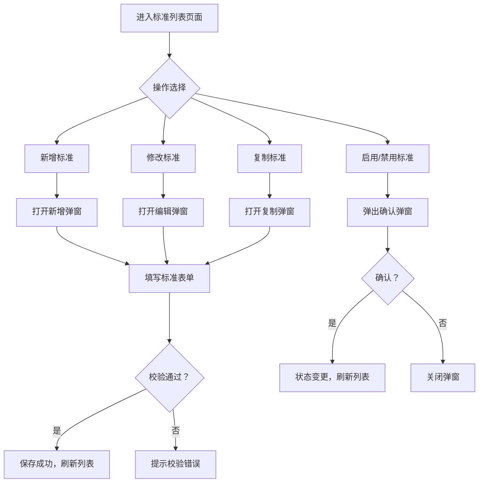
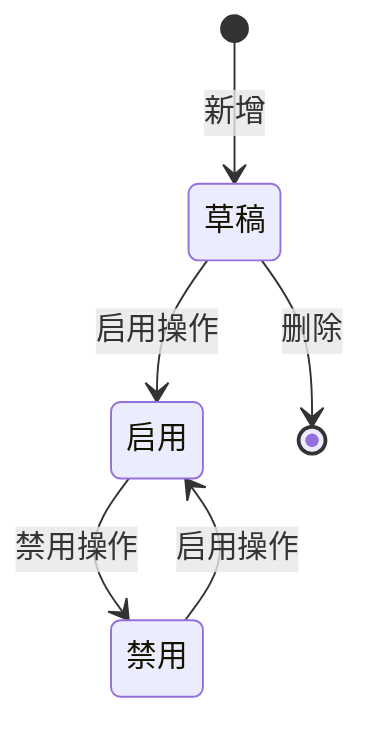

# AI视觉督导系统 · 审核标准管理功能设计

***

## 文档信息

| 项目   | 内容                   |
| ---- | -------------------- |
| 文档编号 | PRD-002-M-2026-002 |
| 文档版本 | v0.1                 |
| 产品名称 | AI视觉督导系统（陈列审核） |
| 所属系统 | 钉钉AI表格应用             |
| 编制日期 | 2026-06-12       |
| 编制人员 | 督导部/商学院               |

### 修订记录

| 版本   | 修订日期           | 修订说明 | 修订人    |
| ---- | -------------- | ---- | ------ |
| v0.1 | 2026-06-12 | 初稿创建 | 督导部/商学院 |

***

> **文档使用说明**
>
> - 本模块对应 PRD-002 中 F-013 审核标准管理功能
> - 本功能作为钉钉AI表格应用运行，利用钉钉多维表格进行数据存储

***

## 一、功能角色矩阵说明

### 1.1 功能描述

- **功能名称：** 审核标准管理
- **所属模块：** AI视觉督导系统
- **功能描述：** 管理各审核维度的规则配置、评分标准、阈值参数，为AI审核提供可量化的评判依据，支持按区域、门店类型差异化配置。

### 1.2 角色权限总览

| 角色      | 功能权限                        | 数据权限   |
| ------- | --------------------------- | ------ |
| 运营管理层 | 查看列表、查看详情、新增、修改、复制、启用/禁用 | 全量数据   |
| 督导人员 | 查看列表、查看详情                | 全量数据   |
| 商学院 | 查看列表、查看详情、新增、修改        | 全量数据   |

### 1.3 功能角色矩阵

| 功能点  | 运营管理层 | 督导人员 | 商学院 |
| ---- | :-----: | :-----: | :-----: |
| 查看列表 |    是    |    是    |    是    |
| 查看详情 |    是    |    是    |    是    |
| 新增   |    是    |    否    |    是    |
| 修改   |    是    |    否    |    是    |
| 复制   |    是    |    否    |    是    |
| 启用/禁用 |    是    |    否    |    否    |

***

## 二、模块路径

系统首页 → AI视觉督导系统 → 审核标准管理 → 标准列表

***

## 三、状态流转与流程图

### 3.1 业务流程图



### 3.2 状态流转图



***

## 四、页面布局

### 4.1 页面清单

|  序号 | 页面名称    | 页面类型   | 描述                           |
| :-: | ------- | ------ | ---------------------------- |
|  1  | 标准列表页面 | 主页面    | 展示审核标准列表，支持查询、筛选、操作            |
|  2  | 新增/编辑弹窗 | 弹窗     | 新增或编辑单条审核标准                    |
|  3  | 查看详情弹窗  | 弹窗     | 查看单条审核标准详情（只读）                 |

***

### 4.2 标准列表页面布局

```
┌─────────────────────────────────────────────────────────────────┐
│  查询条件区                                                       │
│  ┌─────────────┐ ┌─────────────┐ ┌──────┐ ┌──────┐             │
│  │ 标准名称    │ │ 审核维度    │ │ 查询 │ │ 重置 │             │
│  │ [输入框    ]│ │ [下拉框    ]│ │ 按钮 │ │ 按钮 │             │
│  └─────────────┘ └─────────────┘ └──────┘ └──────┘             │
├─────────────────────────────────────────────────────────────────┤
│  工具栏区    [+新增]  [复制]  [启用]  [禁用]                      │
├─────────────────────────────────────────────────────────────────┤
│  列表数据区                                                       │
│  ┌─────┬──────────┬──────────┬──────────┬──────────┬────────┐  │
│  │ 序号 │ 标准名称 │ 审核维度 │ 优先级   │ 状态     │ 操作   │  │
│  ├─────┼──────────┼──────────┼──────────┼──────────┼────────┤  │
│  │  1  │ 价签合规标准 │ 价签合规 │ P0 │ 启用 │ [详情] [修改] [禁用]│  │
│  │  2  │ 堆头饱满度标准 │ 堆头饱满度 │ P1 │ 启用 │ [详情] [修改] [禁用]│  │
│  └─────┴──────────┴──────────┴──────────┴──────────┴────────┘  │
├─────────────────────────────────────────────────────────────────┤
│  分页区    [< 1 2 3 ... 10 >]  [每页 10 ▼]  共 20 条            │
└─────────────────────────────────────────────────────────────────┘
```

### 4.2.1 查询条件区

| 组件名称    | 组件类型 | 位置 | 提示语            | 说明        |
| ------- | ---- | -- | -------------- | --------- |
| 标准名称 | 输入框  | 居左 | 请输入标准名称 | 模糊查询 |
| 审核维度 | 下拉框  | 居左 | 请选择审核维度 | 精确查询 |
| 查询      | 按钮   | 居右 | —              | 主按钮       |
| 重置      | 按钮   | 居右 | —              | 次按钮       |

### 4.2.2 工具栏区

| 组件名称 | 组件类型 | 位置 | 提示语 | 说明          |
| ---- | ---- | -- | --- | ----------- |
| 新增   | 按钮   | 居左 | —   | 运营管理层/商学院权限 |
| 复制   | 按钮   | 居左 | —   | 灰化，选中后启用 |
| 启用   | 按钮   | 居左 | —   | 灰化，选中禁用项后启用 |
| 禁用   | 按钮   | 居左 | —   | 灰化，选中启用项后启用 |

### 4.2.3 列表展示区

| 字段      | 组件类型 | 位置 | 说明                |
| ------- | ---- | -- | ----------------- |
| 序号      | 文本   | 居中 | —                 |
| 标准名称 | 文本   | 居左 | —                 |
| 审核维度 | 标签   | 居中 | 价签合规/禁售商品/商品摆放/堆头饱满度/陈列标准 |
| 优先级 | 标签   | 居中 | P0/P1/P2 |
| 状态      | 标签   | 居中 | 草稿/启用/禁用 |
| 操作      | 按钮组  | 居中 | [详情] [修改] [复制] [启用/禁用] |

### 4.2.4 分页控件区

| 控件    | 组件类型 | 位置 | 说明      |
| ----- | ---- | -- | ------- |
| 总条数   | 文本   | 居左 | 共0条记录   |
| 页码按钮  | 按钮组  | 居中 | 1高亮     |
| 向前翻页  | 按钮   | 居中 | <       |
| 向后翻页  | 按钮   | 居中 | >       |
| 每页条目数 | 下拉框  | 居右 | 默认10条/页 |
| 跳转至页码 | 输入框  | 居右 | 默认1     |

***

### 4.3 新增/编辑弹窗布局

```
┌─────────────────────────────────────────────────┐
│  新增审核标准                              [X]  │
├─────────────────────────────────────────────────┤
│  ┌─────────────────────────────────────────┐    │
│  │ 标准名称                                  │    │
│  │ [输入框                                ]  │    │
│  └─────────────────────────────────────────┘    │
│  ┌─────────────────────────────────────────┐    │
│  │ 审核维度                                  │    │
│  │ [下拉框                                ▼]  │    │
│  └─────────────────────────────────────────┘    │
│  ┌─────────────────────────────────────────┐    │
│  │ 优先级                                  │    │
│  │ [下拉框                                ▼]  │    │
│  └─────────────────────────────────────────┘    │
│  ┌─────────────────────────────────────────┐    │
│  │ 处理通道                                  │    │
│  │ [下拉框                                ▼]  │    │
│  └─────────────────────────────────────────┘    │
│  ┌─────────────────────────────────────────┐    │
│  │ 准确率要求                                  │    │
│  │ [输入框                                ]  │    │
│  └─────────────────────────────────────────┘    │
│  ┌─────────────────────────────────────────┐    │
│  │ 审核规则描述                              │    │
│  │ [多行文本框                            ]  │    │
│  └─────────────────────────────────────────┘    │
│  ┌─────────────────────────────────────────┐    │
│  │ Prompt 模板                              │    │
│  │ [多行文本框                            ]  │    │
│  └─────────────────────────────────────────┘    │
│                                                 │
│                              [取消]  [确定]      │
└─────────────────────────────────────────────────┘
```

### 4.3.1 表单字段说明

| 字段      | 组件类型 | 位置   | 提示语            | 说明        |
| ------- | ---- | ---- | -------------- | --------- |
| 标准名称 | 输入框  | 独占一行 | 请输入标准名称 | 必填\*，1-50个字符 |
| 审核维度 | 下拉框  | 独占一行 | 请选择审核维度 | 必填\* |
| 优先级 | 下拉框  | 独占一行 | 请选择优先级 | 必填\* |
| 处理通道 | 下拉框  | 独占一行 | 请选择处理通道 | 必填\* |
| 准确率要求 | 输入框  | 独占一行 | 请输入准确率要求 | 必填\*，百分比数字 |
| 审核规则描述 | 多行文本  | 独占一行 | 请输入审核规则描述 | 必填\*，1-500个字符 |
| Prompt 模板 | 多行文本  | 独占一行 | 请输入Prompt模板 | 可选，1-2000个字符 |

### 4.3.2 按钮区

| 按钮 | 组件类型 | 位置 | 说明       |
| -- | ---- | -- | -------- |
| 取消 | 按钮   | 居右 | 关闭弹窗     |
| 确定 | 按钮   | 居右 | 灰化→合规后可用 |

***

### 4.4 查看详情弹窗布局

```
┌─────────────────────────────────────────────────┐
│  查看审核标准详情                          [X]  │
├─────────────────────────────────────────────────┤
│  ┌──────────────┐ ┌────────────────────────┐    │
│  │ 标准名称     │ │ 价签合规标准              │    │
│  └──────────────┘ └────────────────────────┘    │
│  ┌──────────────┐ ┌────────────────────────┐    │
│  │ 审核维度     │ │ 价签合规                │    │
│  └──────────────┘ └────────────────────────┘    │
│  ┌──────────────┐ ┌────────────────────────┐    │
│  │ 优先级       │ │ P0                     │    │
│  └──────────────┘ └────────────────────────┘    │
│  ┌──────────────┐ ┌────────────────────────┐    │
│  │ 处理通道     │ │ 实时                   │    │
│  └──────────────┘ └────────────────────────┘    │
│  ┌──────────────┐ ┌────────────────────────┐    │
│  │ 准确率要求   │ │ ≥ 95%                  │    │
│  └──────────────┘ └────────────────────────┘    │
│  ┌──────────────┐ ┌────────────────────────┐    │
│  │ 状态         │ │ 启用                   │    │
│  └──────────────┘ └────────────────────────┘    │
│                                                 │
│                                    [关闭]       │
└─────────────────────────────────────────────────┘
```

### 4.4.1 展示字段说明

| 字段      | 组件类型 | 位置   | 说明         |
| ------- | ---- | ---- | ---------- |
| 标准名称 | 文本   | 独占一行 | 只读         |
| 审核维度 | 文本   | 独占一行 | 只读         |
| 优先级 | 文本   | 独占一行 | 只读         |
| 处理通道 | 文本   | 独占一行 | 只读         |
| 准确率要求 | 文本   | 独占一行 | 只读 |
| 审核规则描述 | 文本   | 独占一行 | 只读 |
| Prompt 模板 | 文本   | 独占一行 | 只读 |
| 状态 | 文本   | 独占一行 | 只读 |

***

## 五、页面交互说明

### 5.1 标准列表页面交互说明

#### 5.1.1 字段交互规则

| 字段        | 类型  | 是否必填 | 约束规则                  | 展示规则 | 举例或枚举       |
| --------- | --- | :--: | --------------------- | ---- | ----------- |
| 标准名称 | 输入框 |   否  | 支持模糊查询；最大50字符  | 明文   | 价签合规标准 |
| 审核维度 | 下拉框 |   否  | 精确查询；数据源参见第九章数据字典 | 明文   | 价签合规/堆头饱满度 |

#### 5.1.2 操作交互逻辑

| 操作类型 | 触发操作     | 交互可用性       | 正向输出                                        | 异常场景                                           | 异常处理             | 日志级别 |
| ---- | -------- | ----------- | ------------------------------------------- | ---------------------------------------------- | ---------------- | ---- |
| 查询   | 点击"查询"   | 始终可用        | 按条件筛选，结果在列表中展示，分页同步更新                       | —                                              | —                | 接口级  |
| 重置   | 点击"重置"   | 始终可用        | 清空所有筛选条件，恢复初始查询状态                           | 无                                              | 无                | 接口级  |
| 新增   | 点击"新增"   | 始终可用        | 打开"新增审核标准"弹窗                                | 无                                              | 无                | 接口级  |
| 查看   | 点击"详情"   | 始终可用        | 打开查看弹窗，所有字段只读                               | 无                                              | 无                | 接口级  |
| 修改   | 点击"修改"   | 始终可用 | 打开"编辑审核标准"弹窗，反显当前数据，支持编辑                    | —                                              | —                | 接口级  |
| 复制   | 点击"复制"   | 选中一条后可用 | 打开"新增审核标准"弹窗，自动填充选中记录数据（名称加"副本"后缀） | 未选中记录时按钮灰化不可点击 | — | 接口级  |
| 启用   | 点击"启用"   | 选中禁用项后可用 | 状态变更为"启用"，刷新列表 | 未选中或选中启用项时按钮灰化不可点击 | — | 接口级  |
| 禁用   | 点击"禁用"   | 选中启用项后可用 | 弹出确认弹窗；确认后状态变更为"禁用"，刷新列表 | 未选中或选中禁用项时按钮灰化不可点击 | — | 接口级  |

***

### 5.2 新增/编辑弹窗交互说明

#### 5.2.1 字段交互规则

| 字段            | 类型 | 是否必填 | 约束规则                       | 展示规则                | 举例或枚举       |
| ------------- | -- | :--: | -------------------------- | ------------------- | ----------- |
| 标准名称 | 文本 |   是  | 1-50个汉字，无特殊符号 | 明文                  | 价签合规标准 |
| 审核维度 | 下拉框 |   是  | 必选，同一维度下标准名称不可重复 | 明文 | 价签合规 |
| 优先级 | 下拉框 |   是  | 必选 | 明文 | P0 |
| 处理通道 | 下拉框 |   是  | 必选 | 明文 | 实时 |
| 准确率要求 | 文本 |   是  | 百分比数字，1-100 | 明文 | 95 |
| 审核规则描述 | 多行文本 |   是  | 1-500个字符 | 明文 | 检测价签是否存在... |
| Prompt 模板 | 多行文本 |   否  | 1-2000个字符 | 明文 | 你是一个专业的... |

#### 5.2.2 操作交互逻辑

| 操作类型 | 触发操作      | 交互可用性       | 正向输出                    | 异常场景 | 异常处理               | 日志级别 |
| ---- | --------- | ----------- | ----------------------- | ---- | ------------------ | ---- |
| 确定保存 | 点击"确定"按钮  | 必填字段全部合规后可用 | 弹窗关闭，列表刷新，Toast提示"保存成功" | 保存失败 | Toast提示"保存失败，请重试！" | 接口级  |
| 取消   | 点击"取消"按钮  | 始终可用        | 关闭弹窗，不保存任何数据            | 无    | 无                  | 不记录  |
| 关闭   | 点击右上角\[X] | 始终可用        | 关闭弹窗，不保存任何数据            | 无    | 无                  | 不记录  |

#### 5.2.3 弹窗说明

| 规则项  | 说明                                   |
| ---- | ------------------------------------ |
| 打开方式 | 点击列表页工具栏"新增"按钮，或操作列"修改"/"复制"按钮            |
| 标题   | 新增时显示"新增审核标准"；编辑时显示"编辑审核标准"；复制时显示"新增审核标准"（数据预填） |
| 数据反显 | 编辑时自动回填当前记录数据；复制时回填数据但标准名称加"副本"后缀；新增时所有字段为空 |
| 校验时机 | 字段失焦时触发单字段校验；点击"确定"时触发全量校验           |
| 保存规则 | 全部校验通过后提交保存；校验失败时字段下方显示红色提示文本，字段边框变红 |
| 关闭确认 | 如有未保存的修改，关闭时弹出二次确认"是否放弃编辑？"          |

***

### 5.3 查看详情弹窗交互说明

#### 5.3.1 字段交互规则

| 字段      | 组件类型 | 是否必填 | 约束规则       | 展示规则 | 举例或枚举               |
| ------- | ---- | :--: | ---------- | ---- | ------------------- |
| 标准名称 | 文本   |   —  | 只读，不可编辑    | 明文   | 价签合规标准 |
| 审核维度 | 文本   |   —  | 只读，不可编辑    | 明文   | 价签合规 |
| 优先级 | 文本   |   —  | 只读，不可编辑    | 明文   | P0 |
| 处理通道 | 文本   |   —  | 只读，不可编辑    | 明文   | 实时 |
| 准确率要求 | 文本   |   —  | 只读 | 明文   | ≥ 95% |
| 审核规则描述 | 文本   |   —  | 只读 | 明文   | 检测价签是否存在... |
| Prompt 模板 | 文本   |   —  | 只读 | 明文   | 你是一个专业的... |
| 状态 | 文本   |   —  | 只读 | 明文   | 启用/禁用/草稿 |

#### 5.3.2 操作交互逻辑

| 操作类型 | 触发操作     | 交互可用性 | 正向输出        | 异常场景 | 异常处理 | 日志级别 |
| ---- | -------- | ----- | ----------- | ---- | ---- | ---- |
| 关闭   | 点击"关闭"按钮 | 始终可用  | 关闭弹窗，返回列表页面 | 无    | 无    | 不记录  |

***

## 六、错误处理规范

### 6.1 表单校验错误

- 显示方式：对应字段下方显示红色提示文本，字段边框变红
- 触发时机：表单提交时触发全量校验；字段失去焦点时触发单字段校验

| 字段      | 为空时错误信息     | 格式错误时信息           |
| ------- | ----------- | ----------------- |
| 标准名称 | 标准名称不能为空 | 标准名称长度应为1-50个字符 |
| 审核维度 | 请选择审核维度  | —                 |
| 优先级 | 请选择优先级 | — |
| 处理通道 | 请选择处理通道 | — |
| 准确率要求 | 准确率要求不能为空 | 准确率要求应为1-100的数字 |
| 审核规则描述 | 审核规则描述不能为空 | 审核规则描述长度应为1-500个字符 |

### 6.2 文件操作错误

| 场景      | 触发条件                         | 提示文案                    | 处理方式                       |
| ------- | ---------------------------- | ----------------------- | -------------------------- |
| 网络/服务异常 | 接口请求失败                       | 接口异常，请稍候再试              | Toast 提示                   |

***

## 七、非功能性需求

### 7.1 合规与安全要求

| 适用规范       | 内容摘要              | 本模块特有说明                    |
| ---------- | ----------------- | -------------------------- |
| 访问控制   | RBAC最小权限、数据权限隔离   | 督导人员仅可查看，不可编辑         |
| 操作日志   | 字段级日志、保留期限、不可篡改   | 覆盖操作：新增/修改/启用/禁用/复制 |

### 7.2 性能需求

| 需求项       | 指标要求          | 说明            |
| --------- | ------------- | ------------- |
| 列表查询响应时间  | ≤ 2s          | 正常网络条件下，含分页查询 |
| 保存/提交响应时间 | ≤ 3s          | 新增/修改等写操作  |
| 页面首屏加载时间  | ≤ 3s          | —             |
| 并发用户数     | 30           | 运营管理层+督导人员+商学院并发 |

***

## 八、特殊说明

### 8.1 删除及修改限制

- 已关联审核任务的标准不可删除，仅可禁用
- 已启用标准的审核维度不可修改
- 查看操作始终可用

### 8.2 其他特殊规则

1. 同一审核维度下标准名称不可重复
2. 标准变更后，新审核任务使用新标准，已进行中的审核任务不受影响
3. Prompt 模板变更需经过测试验证后方可启用

***

## 九、数据字典

### 9.1 字典项定义

**审核维度（auditDimension）**

| 枚举值（code） | 显示文本（label） | 说明     |
| :-------: | ----------- | ------ |
|     1     | 价签合规     | 价签是否存在、对应、可读 |
|     2     | 禁售商品     | 非授权品牌/过期商品检测 |
|    3     | 商品摆放     | 指定商品位置检测 |
|     4     | 堆头饱满度     | 堆头填充程度评估 |
|     5     | 陈列标准     | 总部陈列规范符合度 |

**优先级（priority）**

| 枚举值（code） | 显示文本（label） | 说明     |
| :-------: | ----------- | ------ |
|     0     | P0     | 关键项，实时处理 |
|     1     | P1     | 重要项，批量处理 |
|     2     | P2     | 一般项，批量处理 |

**处理通道（processingChannel）**

| 枚举值（code） | 显示文本（label） | 说明     |
| :-------: | ----------- | ------ |
|     1     | 实时     | 关键项实时处理，响应≤3秒 |
|     2     | 批量     | 非关键项批量处理，响应≤2小时 |

**标准状态（standardStatus）**

| 枚举值（code） | 显示文本（label） | 说明     |
| :-------: | ----------- | ------ |
|     0     | 草稿     | 新建后未启用 |
|     1     | 启用     | 正常使用中 |
|     2     | 禁用     | 暂停使用 |

### 9.2 下拉框数据来源说明

| 字段名     | 数据来源类型 | 来源说明                        |
| ------- | ------ | --------------------------- |
| 审核维度 | 字典项    | 参见 9.1 auditDimension            |
| 优先级 | 字典项    | 参见 9.1 priority            |
| 处理通道 | 字典项    | 参见 9.1 processingChannel            |
| 状态 | 字典项    | 参见 9.1 standardStatus            |

***

*文档结束*
