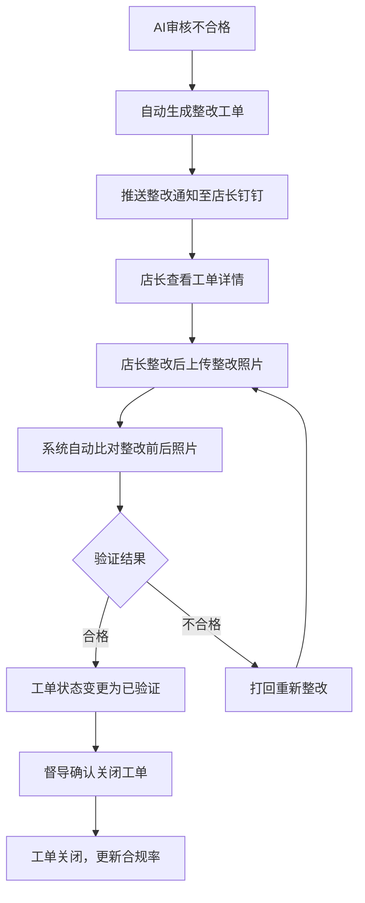
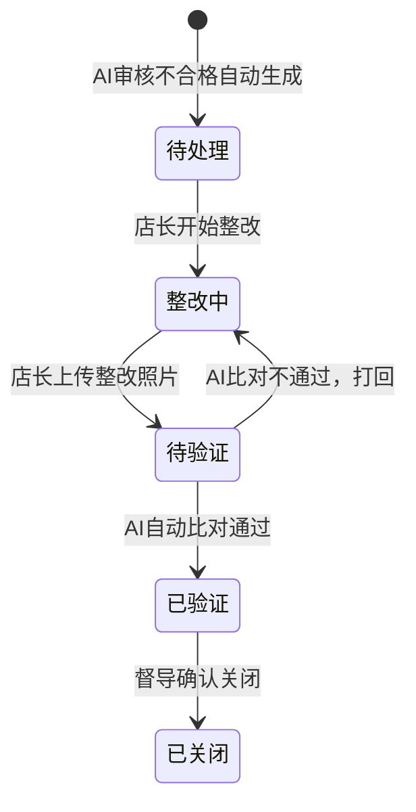

# AI视觉督导系统 · 整改工单管理功能设计

***

## 文档信息

| 项目   | 内容                   |
| ---- | -------------------- |
| 文档编号 | PRD-002-M-2026-005 |
| 文档版本 | v0.1                 |
| 产品名称 | AI视觉督导系统（陈列审核） |
| 所属系统 | 钉钉AI表格应用             |
| 编制日期 | 2026-06-12       |
| 编制人员 | 督导部/商学院               |

### 修订记录

| 版本   | 修订日期           | 修订说明 | 修订人    |
| ---- | -------------- | ---- | ------ |
| v0.1 | 2026-06-12 | 初稿创建 | 督导部/商学院 |

***

> **文档使用说明**
>
> - 本模块对应 PRD-002 中 F-007 整改工单生成、F-008 整改闭环追踪功能
> - 本功能作为钉钉AI表格应用运行，利用钉钉多维表格进行数据存储和自动化流程

***

## 一、功能角色矩阵说明

### 1.1 功能描述

- **功能名称：** 整改工单管理
- **所属模块：** AI视觉督导系统
- **功能描述：** 对AI审核不合格的照片自动生成整改工单，推送至店长钉钉，店长上传整改照片后系统自动比对验证，实现整改闭环管理。

### 1.2 角色权限总览

| 角色      | 功能权限                        | 数据权限   |
| ------- | --------------------------- | ------ |
| 店长 | 查看工单、上传整改照片、查看验证结果         | 仅本店工单 |
| 督导人员 | 查看工单、指派工单、验证整改、关闭工单        | 全量数据 |
| 运营管理层 | 查看工单、查看整改进度看板、导出数据         | 全量数据 |

### 1.3 功能角色矩阵

| 功能点  | 店长 | 督导人员 | 运营管理层 |
| ---- | :-----: | :-----: | :-----: |
| 查看工单 |    是    |    是    |    是    |
| 上传整改照片 |    是    |    否    |    否    |
| 指派工单 |    否    |    是    |    否    |
| 验证整改 |    否    |    是    |    否    |
| 关闭工单 |    否    |    是    |    否    |
| 导出数据 |    否    |    否    |    是    |

***

## 二、模块路径

系统首页 → AI视觉督导系统 → 整改管理 → 工单列表

***

## 三、状态流转与流程图

### 3.1 整改工单主流程



### 3.2 工单状态流转图



***

## 四、页面布局

### 4.1 页面清单

|  序号 | 页面名称    | 页面类型   | 描述                           |
| :-: | ------- | ------ | ---------------------------- |
|  1  | 工单列表页面 | 主页面    | 展示整改工单列表，支持查询、筛选、操作       |
|  2  | 工单详情弹窗  | 弹窗     | 查看工单详情（含问题照片和整改照片）         |
|  3  | 上传整改照片弹窗 | 弹窗     | 店长上传整改后照片                  |
|  4  | 验证关闭弹窗  | 弹窗     | 督导确认关闭工单                   |

***

### 4.2 工单列表页面布局

```
┌─────────────────────────────────────────────────────────────────┐
│  查询条件区                                                       │
│  ┌─────────────┐ ┌─────────────┐ ┌─────────────┐ ┌──────┐ ┌──────┐ │
│  │ 门店名称    │ │ 问题类型    │ │ 工单状态    │ │ 查询 │ │ 重置 │ │
│  │ [输入框    ]│ │ [下拉框    ]│ │ [下拉框    ]│ │ 按钮 │ │ 按钮 │ │
│  └─────────────┘ └─────────────┘ └─────────────┘ └──────┘ └──────┘ │
├─────────────────────────────────────────────────────────────────┤
│  工具栏区                              [导出]                   │
├─────────────────────────────────────────────────────────────────┤
│  列表数据区                                                       │
│  ┌─────┬──────────┬──────────┬──────────┬──────────┬────────┐  │
│  │ 序号 │ 工单编号 │ 门店名称 │ 问题类型 │ 状态     │ 操作   │  │
│  ├─────┼──────────┼──────────┼──────────┼──────────┼────────┤  │
│  │  1  │ R20260612001 │ 成都春熙路店 │ 价签缺失 │ 待处理 │ [详情] │  │
│  │  2  │ R20260612002 │ 重庆解放碑店 │ 堆头空缺 │ 整改中 │ [详情] │  │
│  └─────┴──────────┴──────────┴──────────┴──────────┴────────┘  │
├─────────────────────────────────────────────────────────────────┤
│  分页区    [< 1 2 3 ... 10 >]  [每页 10 ▼]  共 150 条            │
└─────────────────────────────────────────────────────────────────┘
```

### 4.2.1 查询条件区

| 组件名称    | 组件类型 | 位置 | 提示语            | 说明        |
| ------- | ---- | -- | -------------- | --------- |
| 门店名称 | 输入框  | 居左 | 请输入门店名称 | 模糊查询 |
| 问题类型 | 下拉框  | 居左 | 请选择问题类型 | 精确查询 |
| 工单状态 | 下拉框  | 居左 | 请选择工单状态 | 精确查询 |
| 查询      | 按钮   | 居右 | —              | 主按钮       |
| 重置      | 按钮   | 居右 | —              | 次按钮       |

### 4.2.2 工具栏区

| 组件名称 | 组件类型 | 位置 | 提示语 | 说明          |
| ---- | ---- | -- | --- | ----------- |
| 导出   | 按钮   | 居右 | —   | 运营管理层权限 |

### 4.2.3 列表展示区

| 字段      | 组件类型 | 位置 | 说明                |
| ------- | ---- | -- | ----------------- |
| 序号      | 文本   | 居中 | —                 |
| 工单编号 | 文本   | 居左 | —                 |
| 门店名称 | 文本   | 居左 | —                 |
| 问题类型 | 标签   | 居中 | 价签缺失/禁售商品/堆头空缺等 |
| 严重程度 | 标签   | 居中 | 紧急/重要/一般 |
| 状态      | 标签   | 居中 | 待处理/整改中/待验证/已验证/已关闭 |
| 操作      | 按钮组  | 居中 | [详情] |

### 4.2.4 分页控件区

| 控件    | 组件类型 | 位置 | 说明      |
| ----- | ---- | -- | ------- |
| 总条数   | 文本   | 居左 | 共0条记录   |
| 页码按钮  | 按钮组  | 居中 | 1高亮     |
| 向前翻页  | 按钮   | 居中 | <       |
| 向后翻页  | 按钮   | 居中 | >       |
| 每页条目数 | 下拉框  | 居右 | 默认10条/页 |
| 跳转至页码 | 输入框  | 居右 | 默认1     |

***

### 4.3 工单详情弹窗布局

```
┌─────────────────────────────────────────────────┐
│  工单详情                                  [X]  │
├─────────────────────────────────────────────────┤
│  ┌──────────────┐ ┌────────────────────────┐    │
│  │ 工单编号     │ │ R20260612001           │    │
│  └──────────────┘ └────────────────────────┘    │
│  ┌──────────────┐ ┌────────────────────────┐    │
│  │ 门店名称     │ │ 成都春熙路店              │    │
│  └──────────────┘ └────────────────────────┘    │
│  ┌──────────────┐ ┌────────────────────────┐    │
│  │ 问题类型     │ │ 价签缺失               │    │
│  └──────────────┘ └────────────────────────┘    │
│  ┌──────────────┐ ┌────────────────────────┐    │
│  │ 严重程度     │ │ 紧急                   │    │
│  └──────────────┘ └────────────────────────┘    │
│  ┌──────────────┐ ┌────────────────────────┐    │
│  │ 状态         │ │ 待处理                  │    │
│  └──────────────┘ └────────────────────────┘    │
│  ┌─────────────────────────────────────────┐    │
│  │ 问题照片                                  │    │
│  │ ┌─────────────────────────────────────┐ │    │
│  │ │         [问题照片预览]               │ │    │
│  │ └─────────────────────────────────────┘ │    │
│  └─────────────────────────────────────────┘    │
│  ┌─────────────────────────────────────────┐    │
│  │ 整改照片（整改后展示）                     │    │
│  │ ┌─────────────────────────────────────┐ │    │
│  │ │         [整改照片预览]               │ │    │
│  │ └─────────────────────────────────────┘ │    │
│  └─────────────────────────────────────────┘    │
│                                                 │
│                                    [关闭]       │
└─────────────────────────────────────────────────┘
```

### 4.3.1 展示字段说明

| 字段      | 组件类型 | 位置   | 说明         |
| ------- | ---- | ---- | ---------- |
| 工单编号 | 文本   | 独占一行 | 只读         |
| 门店名称 | 文本   | 独占一行 | 只读         |
| 问题类型 | 文本   | 独占一行 | 只读         |
| 严重程度 | 文本   | 独占一行 | 只读         |
| 状态 | 文本   | 独占一行 | 只读 |
| 问题照片 | 图片   | 独占一行 | 只读，支持放大 |
| 整改照片 | 图片   | 独占一行 | 只读，整改后展示 |
| 问题描述 | 文本   | 独占一行 | 只读 |
| 整改时间 | 文本   | 独占一行 | 只读 |
| 验证结果 | 文本   | 独占一行 | 只读 |

***

### 4.4 上传整改照片弹窗布局

```
┌─────────────────────────────────────────────────┐
│  上传整改照片                              [X]  │
├─────────────────────────────────────────────────┤
│  ┌──────────────┐ ┌────────────────────────┐    │
│  │ 工单编号     │ │ R20260612001           │    │
│  └──────────────┘ └────────────────────────┘    │
│  ┌──────────────┐ ┌────────────────────────┐    │
│  │ 问题类型     │ │ 价签缺失               │    │
│  └──────────────┘ └────────────────────────┘    │
│  ┌─────────────────────────────────────────┐    │
│  │ 问题照片                                  │    │
│  │ ┌─────────────────────────────────────┐ │    │
│  │ │         [问题照片预览]               │ │    │
│  │ └─────────────────────────────────────┘ │    │
│  └─────────────────────────────────────────┘    │
│  ┌─────────────────────────────────────────┐    │
│  │ 上传整改照片                              │    │
│  │ ┌─────────────────────────────────────┐ │    │
│  │ │        点击或拖拽上传照片             │ │    │
│  │ │    支持 JPG/PNG，单张 ≤ 10MB        │ │    │
│  │ └─────────────────────────────────────┘ │    │
│  └─────────────────────────────────────────┘    │
│                                                 │
│                              [取消]  [提交]      │
└─────────────────────────────────────────────────┘
```

### 4.4.1 表单字段说明

| 字段      | 组件类型 | 位置   | 提示语            | 说明        |
| ------- | ---- | ---- | -------------- | --------- |
| 工单编号 | 文本   | 独占一行 | —              | 只读 |
| 问题类型 | 文本   | 独占一行 | —              | 只读 |
| 问题照片 | 图片   | 独占一行 | —              | 只读 |
| 上传整改照片 | 附件上传 | 独占一行 | 点击或拖拽上传照片 | 必填\*，JPG/PNG，≤10MB |

### 4.4.2 按钮区

| 按钮 | 组件类型 | 位置 | 说明       |
| -- | ---- | -- | -------- |
| 取消 | 按钮   | 居右 | 关闭弹窗     |
| 提交 | 按钮   | 居右 | 灰化→选择照片后可用 |

***

### 4.5 验证关闭弹窗布局

```
┌─────────────────────────────────────────────────┐
│  验证关闭工单                              [X]  │
├─────────────────────────────────────────────────┤
│  ┌──────────────┐ ┌────────────────────────┐    │
│  │ 工单编号     │ │ R20260612001           │    │
│  └──────────────┘ └────────────────────────┘    │
│  ┌─────────────────────────────────────────┐    │
│  │ 整改前后照片对比                          │    │
│  │ ┌──────────────┐ ┌──────────────┐       │    │
│  │ │ 整改前       │ │ 整改后       │       │    │
│  │ │ [问题照片]   │ │ [整改照片]   │       │    │
│  │ └──────────────┘ └──────────────┘       │    │
│  └─────────────────────────────────────────┘    │
│  ┌─────────────────────────────────────────┐    │
│  │ AI验证结果                               │    │
│  │ 比对相似度：92%，判定：合格               │    │
│  └─────────────────────────────────────────┘    │
│  ┌─────────────────────────────────────────┐    │
│  │ 验证结论                                  │    │
│  │ ○ 确认关闭  ○ 打回重改                    │    │
│  └─────────────────────────────────────────┘    │
│  ┌─────────────────────────────────────────┐    │
│  │ 备注                                     │    │
│  │ [多行文本框                            ]  │    │
│  └─────────────────────────────────────────┘    │
│                                                 │
│                              [取消]  [确定]      │
└─────────────────────────────────────────────────┘
```

### 4.5.1 表单字段说明

| 字段      | 组件类型 | 位置   | 提示语            | 说明        |
| ------- | ---- | ---- | -------------- | --------- |
| 工单编号 | 文本   | 独占一行 | —              | 只读 |
| 照片对比 | 图片组  | 独占一行 | —              | 只读，左右对比 |
| AI验证结果 | 文本   | 独占一行 | —              | 只读 |
| 验证结论 | 单选按钮  | 独占一行 | —              | 必填\* |
| 备注 | 多行文本  | 独占一行 | 请输入备注 | 可选 |

### 4.5.2 按钮区

| 按钮 | 组件类型 | 位置 | 说明       |
| -- | ---- | -- | -------- |
| 取消 | 按钮   | 居右 | 关闭弹窗     |
| 确定 | 按钮   | 居右 | 灰化→选择结论后可用 |

***

## 五、页面交互说明

### 5.1 工单列表页面交互说明

#### 5.1.1 字段交互规则

| 字段        | 类型  | 是否必填 | 约束规则                  | 展示规则 | 举例或枚举       |
| --------- | --- | :--: | --------------------- | ---- | ----------- |
| 门店名称 | 输入框 |   否  | 支持模糊查询；最大50字符  | 明文   | 成都春熙路店 |
| 问题类型 | 下拉框 |   否  | 精确查询；数据源参见第九章数据字典 | 明文   | 价签缺失/堆头空缺 |
| 工单状态 | 下拉框 |   否  | 精确查询 | 明文   | 待处理/整改中/待验证/已验证/已关闭 |

#### 5.1.2 操作交互逻辑

| 操作类型 | 触发操作     | 交互可用性       | 正向输出                                        | 异常场景                                           | 异常处理             | 日志级别 |
| ---- | -------- | ----------- | ------------------------------------------- | ---------------------------------------------- | ---------------- | ---- |
| 查询   | 点击"查询"   | 始终可用        | 按条件筛选，结果在列表中展示，分页同步更新                       | —                                              | —                | 接口级  |
| 重置   | 点击"重置"   | 始终可用        | 清空所有筛选条件，恢复初始查询状态                           | 无                                              | 无                | 接口级  |
| 查看   | 点击"详情"   | 始终可用        | 打开工单详情弹窗，展示问题照片和整改照片                    | 无                                              | 无                | 接口级  |
| 导出   | 点击"导出"   | 始终可用        | 导出Excel文件             | 无数据                                            | Toast提示"暂无数据可导出" | 接口级  |

> **导出文件命名规范**：
>
> - 格式：`{业务前缀}_{YYYYMMDD}_{HHMMSS}.xlsx`
> - 示例：`整改工单数据_20260612_103045.xlsx`

***

### 5.2 工单详情弹窗交互说明

#### 5.2.1 字段交互规则

| 字段      | 组件类型 | 是否必填 | 约束规则       | 展示规则 | 举例或枚举               |
| ------- | ---- | :--: | ---------- | ---- | ------------------- |
| 工单编号 | 文本   |   —  | 只读，不可编辑    | 明文   | R20260612001 |
| 门店名称 | 文本   |   —  | 只读，不可编辑    | 明文   | 成都春熙路店 |
| 问题类型 | 文本   |   —  | 只读，不可编辑    | 明文   | 价签缺失 |
| 严重程度 | 文本   |   —  | 只读 | 明文   | 紧急 |
| 状态 | 文本   |   —  | 只读 | 明文   | 待处理 |
| 问题照片 | 图片   |   —  | 只读，支持点击放大 | 明文   | — |
| 整改照片 | 图片   |   —  | 只读，支持点击放大 | 明文   | — |

#### 5.2.2 操作交互逻辑

| 操作类型 | 触发操作     | 交互可用性 | 正向输出        | 异常场景 | 异常处理 | 日志级别 |
| ---- | -------- | ----- | ----------- | ---- | ---- | ---- |
| 关闭   | 点击"关闭"按钮 | 始终可用  | 关闭弹窗，返回列表页面 | 无    | 无    | 不记录  |

***

### 5.3 上传整改照片弹窗交互说明

#### 5.3.1 字段交互规则

| 字段      | 组件类型 | 是否必填 | 约束规则       | 展示规则 | 举例或枚举               |
| ------- | ---- | :--: | ---------- | ---- | ------------------- |
| 工单编号 | 文本   |   —  | 只读    | 明文   | R20260612001 |
| 问题类型 | 文本   |   —  | 只读    | 明文   | 价签缺失 |
| 问题照片 | 图片   |   —  | 只读，支持放大 | 明文   | — |
| 上传整改照片 | 附件上传 |   是  | JPG/PNG，≤10MB | 缩略图预览 | — |

#### 5.3.2 操作交互逻辑

| 操作类型 | 触发操作      | 交互可用性       | 正向输出                    | 异常场景 | 异常处理               | 日志级别 |
| ---- | --------- | ----------- | ----------------------- | ---- | ------------------ | ---- |
| 提交   | 点击"提交"按钮  | 选择照片后可用 | 照片上传，AI自动比对，Toast提示"整改照片已提交，正在进行AI验证" | 上传失败 | Toast提示"上传失败，请重试" | 接口级  |
| 取消   | 点击"取消"按钮  | 始终可用        | 关闭弹窗，不保存任何数据            | 无    | 无                  | 不记录  |

#### 5.3.3 弹窗说明

| 规则项  | 说明                                   |
| ---- | ------------------------------------ |
| 打开方式 | 店长在工单详情中点击"上传整改照片"按钮           |
| 自动验证 | 照片上传后系统自动比对整改前后照片特征向量，判断整改效果 |
| 验证通过 | 工单状态自动变更为"待验证"，督导收到通知 |
| 验证不通过 | 工单状态回到"整改中"，店长收到打回通知 |

***

### 5.4 验证关闭弹窗交互说明

#### 5.4.1 字段交互规则

| 字段      | 组件类型 | 是否必填 | 约束规则       | 展示规则 | 举例或枚举               |
| ------- | ---- | :--: | ---------- | ---- | ------------------- |
| 工单编号 | 文本   |   —  | 只读    | 明文   | R20260612001 |
| 照片对比 | 图片组  |   —  | 只读 | 明文   | — |
| AI验证结果 | 文本   |   —  | 只读 | 明文   | 比对相似度：92%，判定：合格 |
| 验证结论 | 单选按钮  |   是  | 必选 | 明文   | — |
| 备注 | 多行文本 |   否  | 最多200字符 | 明文   | — |

#### 5.4.2 操作交互逻辑

| 操作类型 | 触发操作      | 交互可用性       | 正向输出                    | 异常场景 | 异常处理               | 日志级别 |
| ---- | --------- | ----------- | ----------------------- | ---- | ------------------ | ---- |
| 确定   | 点击"确定"按钮  | 选择结论后可用 | 工单状态变更，弹窗关闭，Toast提示操作成功 | 操作失败 | Toast提示"操作失败，请重试" | 接口级  |
| 取消   | 点击"取消"按钮  | 始终可用        | 关闭弹窗，不保存任何数据            | 无    | 无                  | 不记录  |

#### 5.4.3 弹窗说明

| 规则项  | 说明                                   |
| ---- | ------------------------------------ |
| 打开方式 | 督导在工单详情中点击"验证关闭"按钮           |
| 确认关闭 | 工单状态变更为"已关闭"，合规率统计更新 |
| 打回重改 | 工单状态变更为"整改中"，店长收到重新整改通知 |

***

## 六、错误处理规范

### 6.1 表单校验错误

- 显示方式：对应字段下方显示红色提示文本，字段边框变红
- 触发时机：提交时触发全量校验

| 字段      | 为空时错误信息     | 格式错误时信息           |
| ------- | ----------- | ----------------- |
| 上传整改照片 | 请上传整改照片 | 照片格式仅支持JPG/PNG；单张大小不超过10MB |
| 验证结论 | 请选择验证结论  | —                 |

### 6.2 文件操作错误

| 场景      | 触发条件                         | 提示文案                    | 处理方式                       |
| ------- | ---------------------------- | ----------------------- | -------------------------- |
| 上传-格式错误 | 上传非 JPG/PNG 文件                 | 照片格式仅支持 JPG/PNG       | Toast 提示，阻断上传              |
| 上传-超大文件 | 单张超过 10MB                    | 单张照片大小不能超过 10MB       | Toast 提示，阻断上传              |
| 导出-无数据  | 当前查询结果为空                     | 暂无数据可导出                 | Toast 提示                   |
| 网络/服务异常 | 接口请求失败                       | 接口异常，请稍候再试              | Toast 提示                   |

***

## 七、非功能性需求

### 7.1 合规与安全要求

| 适用规范       | 内容摘要              | 本模块特有说明                    |
| ---------- | ----------------- | -------------------------- |
| 访问控制   | RBAC最小权限、数据权限隔离   | 店长仅可查看/操作本店工单         |
| 操作日志   | 字段级日志、保留期限、不可篡改   | 覆盖操作：生成/指派/上传/验证/关闭 |

### 7.2 性能需求

| 需求项       | 指标要求          | 说明            |
| --------- | ------------- | ------------- |
| 列表查询响应时间  | ≤ 2s          | 正常网络条件下，含分页查询 |
| 照片比对响应时间 | ≤ 5s          | AI自动比对整改前后照片 |
| 页面首屏加载时间  | ≤ 3s          | —             |
| 并发用户数     | 100          | 门店同时整改上传 |

***

## 八、特殊说明

### 8.1 工单生成规则

- AI审核不合格时自动生成整改工单，无需人工干预
- 同一张照片的多个问题合并为一个工单
- 工单编号格式：R + 日期(8位) + 序号(4位)

### 8.2 整改照片比对逻辑

- 使用特征向量比对技术，计算整改前后照片的相似度
- 相似度 ≥ 85% 判定为整改合格
- 比对不通过的工单自动打回，店长收到重新整改通知

### 8.3 其他特殊规则

1. 工单状态流转严格按照"待处理→整改中→待验证→已验证→已关闭"顺序，不可跳跃
2. 已关闭的工单不可再次修改
3. 店长上传整改照片后，系统自动触发AI验证，无需人工触发

***

## 九、数据字典

### 9.1 字典项定义

**问题类型（issueType）**

| 枚举值（code） | 显示文本（label） | 说明     |
| :-------: | ----------- | ------ |
|     1     | 价签缺失     | 价签不存在或不可读 |
|     2     | 价签不对应     | 价签与商品不匹配 |
|     3     | 禁售商品     | 检测到非授权品牌/过期商品 |
|     4     | 堆头空缺     | 堆头空置率超标 |
|     5     | 商品摆放错误     | 指定商品未在正确位置 |
|     6     | 陈列不合规     | 不符合总部陈列规范 |

**严重程度（severity）**

| 枚举值（code） | 显示文本（label） | 说明     |
| :-------: | ----------- | ------ |
|     1     | 紧急     | P0级问题，需立即整改 |
|     2     | 重要     | P1级问题，需尽快整改 |
|     3     | 一般     | P2级问题，常规整改 |

**工单状态（orderStatus）**

| 枚举值（code） | 显示文本（label） | 说明     |
| :-------: | ----------- | ------ |
|     0     | 待处理     | AI审核不合格自动生成 |
|     1     | 整改中     | 店长开始整改 |
|     2     | 待验证     | 店长上传整改照片，AI验证通过 |
|     3     | 已验证     | 督导确认整改合格 |
|     4     | 已关闭     | 工单关闭 |

### 9.2 下拉框数据来源说明

| 字段名     | 数据来源类型 | 来源说明                        |
| ------- | ------ | --------------------------- |
| 问题类型 | 字典项    | 参见 9.1 issueType            |
| 严重程度 | 字典项    | 参见 9.1 severity            |
| 工单状态 | 字典项    | 参见 9.1 orderStatus            |

***

*文档结束*
