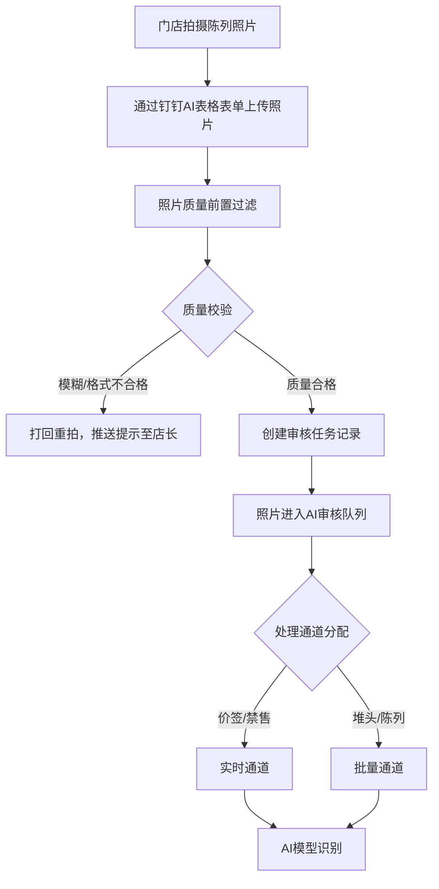
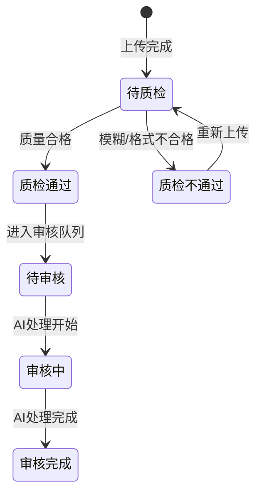

# AI视觉督导系统 · 照片上传与质量过滤功能设计

***

## 文档信息

| 项目   | 内容                   |
| ---- | -------------------- |
| 文档编号 | PRD-002-M-2026-003 |
| 文档版本 | v0.1                 |
| 产品名称 | AI视觉督导系统（陈列审核） |
| 所属系统 | 钉钉AI表格应用             |
| 编制日期 | 2026-06-12       |
| 编制人员 | 督导部/商学院               |

### 修订记录

| 版本   | 修订日期           | 修订说明 | 修订人    |
| ---- | -------------- | ---- | ------ |
| v0.1 | 2026-06-12 | 初稿创建 | 督导部/商学院 |

***

> **文档使用说明**
>
> - 本模块对应 PRD-002 中 F-001 照片上传、F-002 照片质量过滤功能
> - 本功能作为钉钉AI表格应用运行，利用钉钉多维表格的附件字段存储照片

***

## 一、功能角色矩阵说明

### 1.1 功能描述

- **功能名称：** 照片上传与质量过滤
- **所属模块：** AI视觉督导系统
- **功能描述：** 门店通过钉钉AI表格上传陈列照片，系统自动进行照片质量前置过滤（模糊检测、格式校验），合格照片进入AI审核队列，不合格照片打回重拍。

### 1.2 角色权限总览

| 角色      | 功能权限                        | 数据权限   |
| ------- | --------------------------- | ------ |
| 店长 | 上传照片、查看上传记录、查看审核结果         | 仅本店数据 |
| 督导人员 | 查看上传记录、查看照片、查看审核结果         | 全量数据 |
| 运营管理层 | 查看上传记录、查看照片、导出数据           | 全量数据 |

### 1.3 功能角色矩阵

| 功能点  | 店长 | 督导人员 | 运营管理层 |
| ---- | :-----: | :-----: | :-----: |
| 上传照片 |    是    |    否    |    否    |
| 查看上传记录 |    是    |    是    |    是    |
| 查看照片 |    是    |    是    |    是    |
| 查看审核结果 |    是    |    是    |    是    |
| 导出数据 |    否    |    否    |    是    |

***

## 二、模块路径

系统首页 → AI视觉督导系统 → 照片管理 → 照片上传记录

***

## 三、状态流转与流程图

### 3.1 业务流程图



### 3.2 照片状态流转图



***

## 四、页面布局

### 4.1 页面清单

|  序号 | 页面名称    | 页面类型   | 描述                           |
| :-: | ------- | ------ | ---------------------------- |
|  1  | 照片上传表单 | 表单页面  | 门店通过钉钉AI表格表单上传照片          |
|  2  | 上传记录列表 | 主页面    | 展示照片上传记录，支持查询、筛选、操作       |
|  3  | 照片详情弹窗  | 弹窗     | 查看照片详情及质量/审核结果              |

***

### 4.2 照片上传表单布局

```
┌─────────────────────────────────────────────────┐
│  陈列照片上传                                  │
├─────────────────────────────────────────────────┤
│  ┌─────────────────────────────────────────┐    │
│  │ 门店名称                                  │    │
│  │ [自动填充          ]                      │    │
│  └─────────────────────────────────────────┘    │
│  ┌─────────────────────────────────────────┐    │
│  │ 照片类型                                  │    │
│  │ [下拉框                                ▼]  │    │
│  └─────────────────────────────────────────┘    │
│  ┌─────────────────────────────────────────┐    │
│  │ 上传照片（支持多张）                       │    │
│  │ ┌─────────────────────────────────────┐ │    │
│  │ │        点击或拖拽上传照片             │ │    │
│  │ │    支持 JPG/PNG，单张 ≤ 10MB        │ │    │
│  │ │    最多 10 张/次                     │ │    │
│  │ └─────────────────────────────────────┘ │    │
│  └─────────────────────────────────────────┘    │
│                                                 │
│                              [取消]  [提交上传]   │
└─────────────────────────────────────────────────┘
```

### 4.2.1 表单字段说明

| 字段      | 组件类型 | 位置   | 提示语            | 说明        |
| ------- | ---- | ---- | -------------- | --------- |
| 门店名称 | 文本   | 独占一行 | —              | 只读，自动从登录用户关联门店填充 |
| 照片类型 | 下拉框  | 独占一行 | 请选择照片类型 | 必填\* |
| 上传照片 | 附件上传 | 独占一行 | 点击或拖拽上传照片 | 必填\*，支持多选，最多10张 |

### 4.2.2 按钮区

| 按钮 | 组件类型 | 位置 | 说明       |
| -- | ---- | -- | -------- |
| 取消 | 按钮   | 居右 | 清空表单     |
| 提交上传 | 按钮   | 居右 | 灰化→选择照片后可用 |

***

### 4.3 上传记录列表页面布局

```
┌─────────────────────────────────────────────────────────────────┐
│  查询条件区                                                       │
│  ┌─────────────┐ ┌─────────────┐ ┌─────────────┐ ┌──────┐ ┌──────┐ │
│  │ 门店名称    │ │ 照片类型    │ │ 质量状态    │ │ 查询 │ │ 重置 │ │
│  │ [输入框    ]│ │ [下拉框    ]│ │ [下拉框    ]│ │ 按钮 │ │ 按钮 │ │
│  └─────────────┘ └─────────────┘ └─────────────┘ └──────┘ └──────┘ │
├─────────────────────────────────────────────────────────────────┤
│  工具栏区                              [导出]                   │
├─────────────────────────────────────────────────────────────────┤
│  列表数据区                                                       │
│  ┌─────┬──────────┬──────────┬──────────┬──────────┬────────┐  │
│  │ 序号 │ 门店名称 │ 照片类型 │ 质量评分 │ 质量状态 │ 操作   │  │
│  ├─────┼──────────┼──────────┼──────────┼──────────┼────────┤  │
│  │  1  │ 成都春熙路店 │ 陈列 │ 0.92 │ 质检通过 │ [查看] │  │
│  │  2  │ 成都春熙路店 │ 价签 │ 0.45 │ 质检不通过 │ [查看] │  │
│  └─────┴──────────┴──────────┴──────────┴──────────┴────────┘  │
├─────────────────────────────────────────────────────────────────┤
│  分页区    [< 1 2 3 ... 10 >]  [每页 10 ▼]  共 200 条            │
└─────────────────────────────────────────────────────────────────┘
```

### 4.3.1 查询条件区

| 组件名称    | 组件类型 | 位置 | 提示语            | 说明        |
| ------- | ---- | -- | -------------- | --------- |
| 门店名称 | 输入框  | 居左 | 请输入门店名称 | 模糊查询 |
| 照片类型 | 下拉框  | 居左 | 请选择照片类型 | 精确查询 |
| 质量状态 | 下拉框  | 居左 | 请选择质量状态 | 精确查询 |
| 查询      | 按钮   | 居右 | —              | 主按钮       |
| 重置      | 按钮   | 居右 | —              | 次按钮       |

### 4.3.2 工具栏区

| 组件名称 | 组件类型 | 位置 | 提示语 | 说明          |
| ---- | ---- | -- | --- | ----------- |
| 导出   | 按钮   | 居右 | —   | 运营管理层权限 |

### 4.3.3 列表展示区

| 字段      | 组件类型 | 位置 | 说明                |
| ------- | ---- | -- | ----------------- |
| 序号      | 文本   | 居中 | —                 |
| 门店名称 | 文本   | 居左 | —                 |
| 照片类型 | 标签   | 居中 | 陈列/价签/堆头 |
| 质量评分 | 文本   | 居中 | 0-1，保留两位小数 |
| 质量状态 | 标签   | 居中 | 待质检/质检通过/质检不通过 |
| 操作      | 按钮组  | 居中 | [查看] |

### 4.3.4 分页控件区

| 控件    | 组件类型 | 位置 | 说明      |
| ----- | ---- | -- | ------- |
| 总条数   | 文本   | 居左 | 共0条记录   |
| 页码按钮  | 按钮组  | 居中 | 1高亮     |
| 向前翻页  | 按钮   | 居中 | <       |
| 向后翻页  | 按钮   | 居中 | >       |
| 每页条目数 | 下拉框  | 居右 | 默认10条/页 |
| 跳转至页码 | 输入框  | 居右 | 默认1     |

***

### 4.4 照片详情弹窗布局

```
┌─────────────────────────────────────────────────┐
│  照片详情                                  [X]  │
├─────────────────────────────────────────────────┤
│  ┌─────────────────────────────────────────┐    │
│  │         [照片预览区域]                    │    │
│  │                                          │    │
│  └─────────────────────────────────────────┘    │
│  ┌──────────────┐ ┌────────────────────────┐    │
│  │ 门店名称     │ │ 成都春熙路店              │    │
│  └──────────────┘ └────────────────────────┘    │
│  ┌──────────────┐ ┌────────────────────────┐    │
│  │ 照片类型     │ │ 陈列                   │    │
│  └──────────────┘ └────────────────────────┘    │
│  ┌──────────────┐ ┌────────────────────────┐    │
│  │ 质量评分     │ │ 0.92                   │    │
│  └──────────────┘ └────────────────────────┘    │
│  ┌──────────────┐ ┌────────────────────────┐    │
│  │ 质量状态     │ │ 质检通过                │    │
│  └──────────────┘ └────────────────────────┘    │
│  ┌──────────────┐ ┌────────────────────────┐    │
│  │ 不通过原因   │ │ —                      │    │
│  └──────────────┘ └────────────────────────┘    │
│                                                 │
│                                    [关闭]       │
└─────────────────────────────────────────────────┘
```

### 4.4.1 展示字段说明

| 字段      | 组件类型 | 位置   | 说明         |
| ------- | ---- | ---- | ---------- |
| 照片预览 | 图片   | 独占一行 | 支持放大查看 |
| 门店名称 | 文本   | 独占一行 | 只读         |
| 照片类型 | 文本   | 独占一行 | 只读         |
| 质量评分 | 文本   | 独占一行 | 只读 |
| 质量状态 | 文本   | 独占一行 | 只读 |
| 不通过原因 | 文本   | 独占一行 | 只读，质检不通过时展示 |

***

## 五、页面交互说明

### 5.1 照片上传表单交互说明

#### 5.1.1 字段交互规则

| 字段            | 类型 | 是否必填 | 约束规则                       | 展示规则                | 举例或枚举       |
| ------------- | -- | :--: | -------------------------- | ------------------- | ----------- |
| 门店名称 | 文本 |   —  | 自动填充，不可修改              | 只读                  | 成都春熙路店 |
| 照片类型 | 下拉框 |   是  | 必选 | 明文 | 陈列 |
| 上传照片 | 附件上传 |   是  | JPG/PNG格式，单张≤10MB，最多10张/次 | 缩略图预览 | — |

#### 5.1.2 操作交互逻辑

| 操作类型 | 触发操作      | 交互可用性       | 正向输出                    | 异常场景 | 异常处理               | 日志级别 |
| ---- | --------- | ----------- | ----------------------- | ---- | ------------------ | ---- |
| 提交上传 | 点击"提交上传"按钮 | 选择照片后可用 | 照片上传，质量校验，Toast提示"上传成功，正在进行质量校验" | 上传失败 | Toast提示"上传失败，请重试" | 接口级  |
| 取消   | 点击"取消"按钮  | 始终可用        | 清空表单                    | 无    | 无                  | 不记录  |

#### 5.1.3 弹窗说明

| 规则项  | 说明                                   |
| ---- | ------------------------------------ |
| 打开方式 | 门店通过钉钉AI表格表单入口进入           |
| 门店填充 | 自动关联当前登录用户的门店信息           |
| 上传规则 | 照片上传后自动触发质量校验，校验结果实时反馈 |
| 质量不合格 | 弹窗提示具体原因（模糊/格式不合格），附带示例说明 |

***

### 5.2 上传记录列表页面交互说明

#### 5.2.1 字段交互规则

| 字段        | 类型  | 是否必填 | 约束规则                  | 展示规则 | 举例或枚举       |
| --------- | --- | :--: | --------------------- | ---- | ----------- |
| 门店名称 | 输入框 |   否  | 支持模糊查询；最大50字符  | 明文   | 成都春熙路店 |
| 照片类型 | 下拉框 |   否  | 精确查询；数据源参见第九章数据字典 | 明文   | 陈列/价签/堆头 |
| 质量状态 | 下拉框 |   否  | 精确查询 | 明文   | 待质检/质检通过/质检不通过 |

#### 5.2.2 操作交互逻辑

| 操作类型 | 触发操作     | 交互可用性       | 正向输出                                        | 异常场景                                           | 异常处理             | 日志级别 |
| ---- | -------- | ----------- | ------------------------------------------- | ---------------------------------------------- | ---------------- | ---- |
| 查询   | 点击"查询"   | 始终可用        | 按条件筛选，结果在列表中展示，分页同步更新                       | —                                              | —                | 接口级  |
| 重置   | 点击"重置"   | 始终可用        | 清空所有筛选条件，恢复初始查询状态                           | 无                                              | 无                | 接口级  |
| 查看   | 点击"查看"   | 始终可用        | 打开照片详情弹窗，展示照片及质量/审核信息                    | 无                                              | 无                | 接口级  |
| 导出   | 点击"导出"   | 始终可用        | 导出Excel文件             | 无数据                                            | Toast提示"暂无数据可导出" | 接口级  |

> **导出文件命名规范**：
>
> - 格式：`{业务前缀}_{YYYYMMDD}_{HHMMSS}.xlsx`
> - 示例：`照片上传记录_20260612_103045.xlsx`

***

### 5.3 照片详情弹窗交互说明

#### 5.3.1 字段交互规则

| 字段      | 组件类型 | 是否必填 | 约束规则       | 展示规则 | 举例或枚举               |
| ------- | ---- | :--: | ---------- | ---- | ------------------- |
| 照片预览 | 图片   |   —  | 支持点击放大查看 | 明文   | — |
| 门店名称 | 文本   |   —  | 只读，不可编辑    | 明文   | 成都春熙路店 |
| 照片类型 | 文本   |   —  | 只读，不可编辑    | 明文   | 陈列 |
| 质量评分 | 文本   |   —  | 只读 | 明文   | 0.92 |
| 质量状态 | 文本   |   —  | 只读 | 明文   | 质检通过 |
| 不通过原因 | 文本   |   —  | 只读，质检不通过时展示 | 明文   | 照片模糊，清晰度低于阈值 |

#### 5.3.2 操作交互逻辑

| 操作类型 | 触发操作     | 交互可用性 | 正向输出        | 异常场景 | 异常处理 | 日志级别 |
| ---- | -------- | ----- | ----------- | ---- | ---- | ---- |
| 关闭   | 点击"关闭"按钮 | 始终可用  | 关闭弹窗，返回列表页面 | 无    | 无    | 不记录  |

***

## 六、错误处理规范

### 6.1 表单校验错误

- 显示方式：对应字段下方显示红色提示文本，字段边框变红
- 触发时机：提交时触发全量校验

| 字段      | 为空时错误信息     | 格式错误时信息           |
| ------- | ----------- | ----------------- |
| 照片类型 | 请选择照片类型  | —                 |
| 上传照片 | 请至少上传一张照片 | 照片格式仅支持JPG/PNG；单张大小不超过10MB；最多10张/次 |

### 6.2 文件操作错误

| 场景      | 触发条件                         | 提示文案                    | 处理方式                       |
| ------- | ---------------------------- | ----------------------- | -------------------------- |
| 上传-格式错误 | 上传非 JPG/PNG 文件                 | 照片格式仅支持 JPG/PNG       | Toast 提示，阻断上传              |
| 上传-超大文件 | 单张超过 10MB                    | 单张照片大小不能超过 10MB       | Toast 提示，阻断上传              |
| 上传-数量超限 | 超过10张/次                    | 单次最多上传10张照片       | Toast 提示，阻断上传              |
| 导出-无数据  | 当前查询结果为空                     | 暂无数据可导出                 | Toast 提示                   |
| 网络/服务异常 | 接口请求失败                       | 接口异常，请稍候再试              | Toast 提示                   |

***

## 七、非功能性需求

### 7.1 合规与安全要求

| 适用规范       | 内容摘要              | 本模块特有说明                    |
| ---------- | ----------------- | -------------------------- |
| 访问控制   | RBAC最小权限、数据权限隔离   | 店长仅可查看本店照片         |
| 操作日志   | 字段级日志、保留期限、不可篡改   | 覆盖操作：上传/查看/导出 |
| 文件操作安全 | 导出上限、下载鉴权、导出行为记日志 | 单次导出上限1000条          |

### 7.2 性能需求

| 需求项       | 指标要求          | 说明            |
| --------- | ------------- | ------------- |
| 照片上传响应时间  | ≤ 5s（单张） | 正常网络条件下 |
| 质量校验响应时间 | ≤ 3s          | 单张质量校验 |
| 列表查询响应时间  | ≤ 2s          | 正常网络条件下，含分页查询 |
| 并发上传     | 支持100家门店同时上传 | — |

***

## 八、特殊说明

### 8.1 照片质量过滤规则

| 检测项 | 阈值 | 处理方式 |
| ---- | ---- | ---- |
| 照片模糊度 | 清晰度 < 0.6 | 打回重拍，提示"照片模糊，请重新拍摄" |
| 照片格式 | 非 JPG/PNG | 打回重拍，提示"照片格式不支持，请使用JPG或PNG格式" |
| 照片大小 | 单张 > 10MB | 打回重拍，提示"照片过大，请压缩后重新上传" |
| 照片尺寸 | 最短边 < 800px | 打回重拍，提示"照片分辨率过低，请提高拍摄清晰度" |

### 8.2 其他特殊规则

1. 照片上传后自动触发质量校验，无需人工干预
2. 质量不合格的照片不进入AI审核队列，减少无效API调用
3. 门店可查看不合格原因和示例，指导正确拍摄
4. 照片存储在钉钉云空间，保留期限30天

***

## 九、数据字典

### 9.1 字典项定义

**照片类型（photoType）**

| 枚举值（code） | 显示文本（label） | 说明     |
| :-------: | ----------- | ------ |
|     1     | 陈列     | 门店陈列整体照片 |
|     2     | 价签     | 价签特写照片 |
|     3     | 堆头     | 堆头区域照片 |

**照片质量状态（qualityStatus）**

| 枚举值（code） | 显示文本（label） | 说明     |
| :-------: | ----------- | ------ |
|     0     | 待质检     | 上传后等待质量校验 |
|     1     | 质检通过     | 质量校验通过，进入审核队列 |
|     2     | 质检不通过     | 质量校验不通过，需重拍 |

### 9.2 下拉框数据来源说明

| 字段名     | 数据来源类型 | 来源说明                        |
| ------- | ------ | --------------------------- |
| 照片类型 | 字典项    | 参见 9.1 photoType            |
| 质量状态 | 字典项    | 参见 9.1 qualityStatus            |

***

*文档结束*
