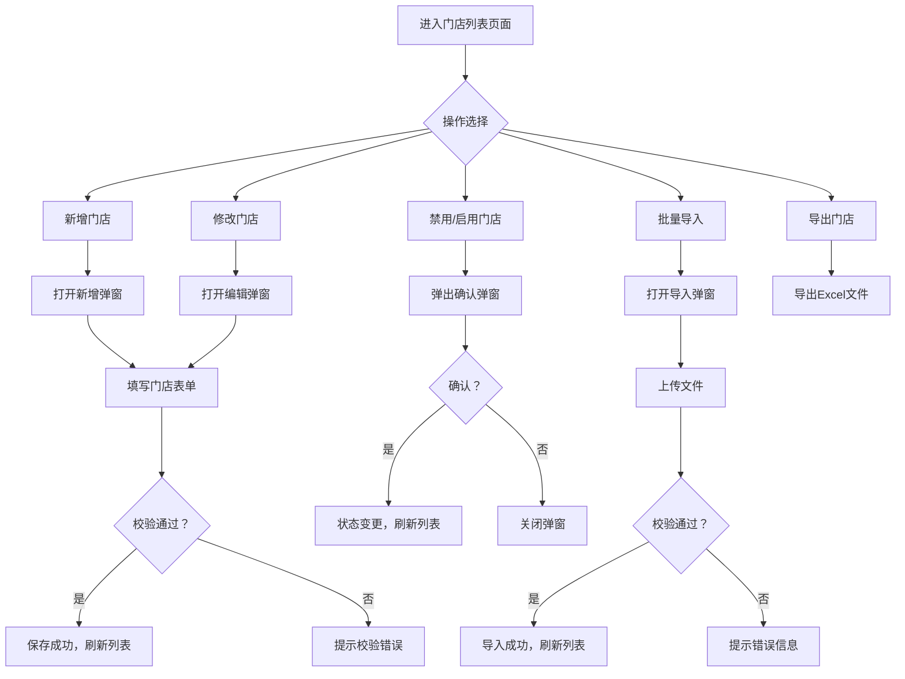
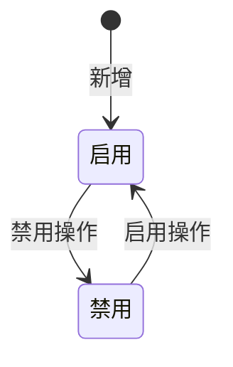

# AI视觉督导系统 · 门店管理功能设计

***

## 文档信息

| 项目   | 内容                   |
| ---- | -------------------- |
| 文档编号 | PRD-002-M-2026-001 |
| 文档版本 | v0.1                 |
| 产品名称 | AI视觉督导系统（陈列审核） |
| 所属系统 | 钉钉AI表格应用             |
| 编制日期 | 2026-06-12       |
| 编制人员 | 督导部/商学院               |

### 修订记录

| 版本   | 修订日期           | 修订说明 | 修订人    |
| ---- | -------------- | ---- | ------ |
| v0.1 | 2026-06-12 | 初稿创建 | 督导部/商学院 |

***

> **文档使用说明**
>
> - 本模块对应 PRD-002 中 F-012 门店管理功能
> - 本功能作为钉钉AI表格应用运行，利用钉钉多维表格进行数据存储

***

## 一、功能角色矩阵说明

### 1.1 功能描述

- **功能名称：** 门店管理
- **所属模块：** AI视觉督导系统
- **功能描述：** 管理督导门店的基本信息、区域归属、状态及照片上传规则配置，为审核任务提供门店维度数据支撑。

### 1.2 角色权限总览

| 角色      | 功能权限                        | 数据权限   |
| ------- | --------------------------- | ------ |
| 运营管理层 | 查看列表、查看详情、新增、修改、导入、导出、启用/禁用 | 全量数据   |
| 督导人员 | 查看列表、查看详情                | 全量数据   |
| 店长 | 查看详情（仅本店）                | 仅本店数据 |

### 1.3 功能角色矩阵

| 功能点  | 运营管理层 | 督导人员 | 店长 |
| ---- | :-----: | :-----: | :-----: |
| 查看列表 |    是    |    是    |    否    |
| 查看详情 |    是    |    是    |    是    |
| 新增   |    是    |    否    |    否    |
| 修改   |    是    |    否    |    否    |
| 导入   |    是    |    否    |    否    |
| 导出   |    是    |    否    |    否    |
| 启用/禁用 |    是    |    否    |    否    |

***

## 二、模块路径

系统首页 → AI视觉督导系统 → 门店管理 → 门店列表

***

## 三、状态流转与流程图

### 3.1 业务流程图



### 3.2 状态流转图



***

## 四、页面布局

### 4.1 页面清单

|  序号 | 页面名称    | 页面类型   | 描述                           |
| :-: | ------- | ------ | ---------------------------- |
|  1  | 门店列表页面 | 主页面    | 展示门店数据列表，支持查询、筛选、操作            |
|  2  | 新增/编辑弹窗 | 弹窗     | 新增或编辑单条门店数据                    |
|  3  | 查看详情弹窗  | 弹窗     | 查看单条门店数据详情（只读）                 |
|  4  | 批量导入弹窗  | 弹窗     | 上传 Excel 文件完成批量录入             |
|  5  | 删除确认弹窗  | 弹窗     | 禁用操作二次确认                     |

***

### 4.2 门店列表页面布局

```
┌─────────────────────────────────────────────────────────────────┐
│  查询条件区                                                       │
│  ┌─────────────┐ ┌─────────────┐ ┌─────────────┐ ┌──────┐ ┌──────┐ │
│  │ 门店名称    │ │ 区域名称    │ │ 状态        │ │ 查询 │ │ 重置 │ │
│  │ [输入框    ]│ │ [下拉框    ]│ │ [下拉框    ]│ │ 按钮 │ │ 按钮 │ │
│  └─────────────┘ └─────────────┘ └─────────────┘ └──────┘ └──────┘ │
├─────────────────────────────────────────────────────────────────┤
│  工具栏区    [+新增]  [导入]  [批量删除]         [导出]          │
├─────────────────────────────────────────────────────────────────┤
│  列表数据区                                                       │
│  ┌────┬─────┬──────────┬──────────┬──────────┬──────────┬────────┐ │
│  │ □  │ 序号 │ 门店名称 │ 区域名称 │ 店长姓名 │ 状态     │ 操作   │ │
│  ├────┼─────┼──────────┼──────────┼──────────┼──────────┼────────┤ │
│  │ □  │  1  │ 成都春熙路店 │ 成都 │ 张三 │ 启用 │ [详情] [修改] [禁用]│ │
│  │ □  │  2  │ 重庆解放碑店 │ 重庆 │ 李四 │ 启用 │ [详情] [修改] [禁用]│ │
│  └────┴─────┴──────────┴──────────┴──────────┴──────────┴────────┘ │
├─────────────────────────────────────────────────────────────────┤
│  分页区    [< 1 2 3 ... 10 >]  [每页 10 ▼]  共 95 条            │
└─────────────────────────────────────────────────────────────────┘
```

### 4.2.1 查询条件区

| 组件名称    | 组件类型 | 位置 | 提示语            | 说明        |
| ------- | ---- | -- | -------------- | --------- |
| 门店名称 | 输入框  | 居左 | 请输入门店名称 | 模糊查询 |
| 区域名称 | 下拉框  | 居左 | 请选择区域名称 | 精确查询 |
| 状态 | 下拉框  | 居左 | 请选择状态 | 精确查询 |
| 查询      | 按钮   | 居右 | —              | 主按钮       |
| 重置      | 按钮   | 居右 | —              | 次按钮       |

### 4.2.2 工具栏区

| 组件名称 | 组件类型 | 位置 | 提示语 | 说明          |
| ---- | ---- | -- | --- | ----------- |
| 新增   | 按钮   | 居左 | —   | 运营管理层权限 |
| 导入   | 按钮   | 居左 | —   | 运营管理层权限 |
| 批量删除 | 按钮   | 居左 | —   | 灰化，选中数据后启用  |
| 导出   | 按钮   | 居右 | —   | 运营管理层权限 |

### 4.2.3 列表展示区

| 字段      | 组件类型 | 位置 | 说明                |
| ------- | ---- | -- | ----------------- |
| 复选框     | 复选框  | 首列 | 批量操作时勾选           |
| 序号      | 文本   | 居中 | —                 |
| 门店编码 | 文本   | 居左 | —                 |
| 门店名称 | 文本   | 居左 | —                 |
| 区域名称 | 文本   | 居左 | —                 |
| 店长姓名 | 文本   | 居左 | —                 |
| 店长电话 | 文本   | 居左 | 脱敏（138****1234） |
| 状态      | 标签   | 居中 | 启用/禁用 |
| 操作      | 按钮组  | 居中 | [详情] [修改] [禁用/启用] |

### 4.2.4 分页控件区

| 控件    | 组件类型 | 位置 | 说明      |
| ----- | ---- | -- | ------- |
| 总条数   | 文本   | 居左 | 共0条记录   |
| 页码按钮  | 按钮组  | 居中 | 1高亮     |
| 向前翻页  | 按钮   | 居中 | <       |
| 向后翻页  | 按钮   | 居中 | >       |
| 每页条目数 | 下拉框  | 居右 | 默认10条/页 |
| 跳转至页码 | 输入框  | 居右 | 默认1     |

***

### 4.3 新增/编辑弹窗布局

```
┌─────────────────────────────────────────────────┐
│  新增门店                                  [X]  │
├─────────────────────────────────────────────────┤
│  ┌─────────────────────────────────────────┐    │
│  │ 门店编码                                  │    │
│  │ [系统自动生成    ]                        │    │
│  └─────────────────────────────────────────┘    │
│  ┌─────────────────────────────────────────┐    │
│  │ 门店名称                                  │    │
│  │ [输入框                                ]  │    │
│  └─────────────────────────────────────────┘    │
│  ┌─────────────────────────────────────────┐    │
│  │ 区域名称                                  │    │
│  │ [下拉框                                ▼]  │    │
│  └─────────────────────────────────────────┘    │
│  ┌─────────────────────────────────────────┐    │
│  │ 店长姓名                                  │    │
│  │ [输入框                                ]  │    │
│  └─────────────────────────────────────────┘    │
│  ┌─────────────────────────────────────────┐    │
│  │ 店长电话                                  │    │
│  │ [输入框                                ]  │    │
│  └─────────────────────────────────────────┘    │
│                                                 │
│                              [取消]  [确定]      │
└─────────────────────────────────────────────────┘
```

### 4.3.1 表单字段说明

| 字段      | 组件类型 | 位置   | 提示语            | 说明        |
| ------- | ---- | ---- | -------------- | --------- |
| 门店编码 | 文本   | 独占一行 | —              | 只读，系统自动生成 |
| 门店名称 | 输入框  | 独占一行 | 请输入门店名称 | 必填\*，1-50个字符 |
| 区域名称 | 下拉框  | 独占一行 | 请选择区域名称 | 必填\* |
| 店长姓名 | 输入框  | 独占一行 | 请输入店长姓名 | 必填\*，1-20个字符 |
| 店长电话 | 输入框  | 独占一行 | 请输入店长电话 | 必填\*，11位手机号 |

### 4.3.2 按钮区

| 按钮 | 组件类型 | 位置 | 说明       |
| -- | ---- | -- | -------- |
| 取消 | 按钮   | 居右 | 关闭弹窗     |
| 确定 | 按钮   | 居右 | 灰化→合规后可用 |

***

### 4.4 查看详情弹窗布局

```
┌─────────────────────────────────────────────────┐
│  查看门店信息                              [X]  │
├─────────────────────────────────────────────────┤
│  ┌──────────────┐ ┌────────────────────────┐    │
│  │ 门店编码     │ │ CD0001                 │    │
│  └──────────────┘ └────────────────────────┘    │
│  ┌──────────────┐ ┌────────────────────────┐    │
│  │ 门店名称     │ │ 成都春熙路店              │    │
│  └──────────────┘ └────────────────────────┘    │
│  ┌──────────────┐ ┌────────────────────────┐    │
│  │ 区域名称     │ │ 成都                   │    │
│  └──────────────┘ └────────────────────────┘    │
│  ┌──────────────┐ ┌────────────────────────┐    │
│  │ 店长姓名     │ │ 张三                   │    │
│  └──────────────┘ └────────────────────────┘    │
│  ┌──────────────┐ ┌────────────────────────┐    │
│  │ 状态         │ │ 启用                   │    │
│  └──────────────┘ └────────────────────────┘    │
│                                                 │
│                                    [关闭]       │
└─────────────────────────────────────────────────┘
```

### 4.4.1 展示字段说明

| 字段      | 组件类型 | 位置   | 说明         |
| ------- | ---- | ---- | ---------- |
| 门店编码 | 文本   | 独占一行 | 只读         |
| 门店名称 | 文本   | 独占一行 | 只读         |
| 区域名称 | 文本   | 独占一行 | 只读         |
| 店长姓名 | 文本   | 独占一行 | 只读         |
| 店长电话 | 文本   | 独占一行 | 只读，脱敏显示 |
| 状态 | 文本   | 独占一行 | 只读 |

***

### 4.5 批量导入弹窗布局

```
┌─────────────────────────────────────────────────┐
│  批量导入门店                              [X]  │
├─────────────────────────────────────────────────┤
│  ┌─────────────────────────────────────────┐    │
│  │           点击或拖拽上传文件              │    │
│  │              [.xlsx 文件]                │    │
│  └─────────────────────────────────────────┘    │
│                                                 │
│                              [取消]  [导入]      │
└─────────────────────────────────────────────────┘
```

***

### 4.6 禁用确认弹窗布局

```
┌─────────────────────────────────────────────────┐
│  提示                                      [X]  │
├─────────────────────────────────────────────────┤
│                                                 │
│         是否确认禁用该门店？                      │
│         禁用后该门店将不再参与审核。               │
│                                                 │
│                              [取消]  [确定]      │
└─────────────────────────────────────────────────┘
```

<br />

***

## 五、页面交互说明

### 5.1 门店列表页面交互说明

#### 5.1.1 字段交互规则

| 字段        | 类型  | 是否必填 | 约束规则                  | 展示规则 | 举例或枚举       |
| --------- | --- | :--: | --------------------- | ---- | ----------- |
| 门店名称 | 输入框 |   否  | 支持模糊查询；最大50字符  | 明文   | 成都春熙路店 |
| 区域名称 | 下拉框 |   否  | 精确查询；数据源参见第九章数据字典 | 明文   | 成都/重庆/贵阳 |
| 状态 | 下拉框 |   否  | 精确查询 | 明文   | 启用/禁用 |

#### 5.1.2 操作交互逻辑

| 操作类型 | 触发操作     | 交互可用性       | 正向输出                                        | 异常场景                                           | 异常处理             | 日志级别 |
| ---- | -------- | ----------- | ------------------------------------------- | ---------------------------------------------- | ---------------- | ---- |
| 查询   | 点击"查询"   | 始终可用        | 按条件筛选，结果在列表中展示，分页同步更新                       | —                                              | —                | 接口级  |
| 重置   | 点击"重置"   | 始终可用        | 清空所有筛选条件，恢复初始查询状态                           | 无                                              | 无                | 接口级  |
| 新增   | 点击"新增"   | 始终可用        | 打开"新增门店"弹窗                                | 无                                              | 无                | 接口级  |
| 查看   | 点击"详情"   | 始终可用        | 打开查看弹窗，所有字段只读                               | 无                                              | 无                | 接口级  |
| 修改   | 点击"修改"   | 始终可用 | 打开"编辑门店"弹窗，反显当前数据，支持编辑                    | —                                              | —                | 接口级  |
| 禁用   | 点击"禁用"   | 门店状态为"启用"时可用 | 弹出确认弹窗；确认后状态变更为"禁用"，刷新列表 | 门店状态为"禁用"时按钮灰化不可点击 | — | 接口级  |
| 启用   | 点击"启用"   | 门店状态为"禁用"时可用 | 弹出确认弹窗；确认后状态变更为"启用"，刷新列表 | 门店状态为"启用"时按钮灰化不可点击 | — | 接口级  |
| 导入   | 点击"导入"   | 始终可用        | 打开"批量导入"弹窗，上传Excel完成批量录入；全部校验通过后一次性导入 | 存在校验错误时，遇错即停不执行导入，提示"第N行：【字段名】+错误原因" | Toast提示 | 接口级  |
| 导出   | 点击"导出"   | 始终可用        | 勾选数据时导出勾选行；未勾选时导出全量数据，下载Excel文件             | 无数据                                            | Toast提示"暂无数据可导出" | 接口级  |

> **导出文件命名规范**：
>
> - 格式：`{业务前缀}_{YYYYMMDD}_{HHMMSS}.xlsx`
> - 示例：`门店信息_20260612_103045.xlsx`
> - 时间戳：年月日(8位) + 时分秒(6位)，确保文件名唯一性
> - 导入模板：使用固定名称 `门店批量导入模板.xlsx`（不带时间戳）

***

### 5.2 新增/编辑弹窗交互说明

#### 5.2.1 字段交互规则

| 字段            | 类型 | 是否必填 | 约束规则                       | 展示规则                | 举例或枚举       |
| ------------- | -- | :--: | -------------------------- | ------------------- | ----------- |
| 门店编码 | 文本 |   —  | 系统自动生成，不可手动输入              | 明文                  | CD0001 |
| 门店名称 | 文本 |   是  | 1-50个汉字，无特殊符号 | 明文                  | 成都春熙路店 |
| 区域名称 | 下拉框 |   是  | 必选 | 明文 | 成都 |
| 店长姓名 | 文本 |   是  | 1-20个汉字 | 明文 | 张三 |
| 店长电话 | 文本 |   是  | 11位数字，手机号格式 | 脱敏（138****1234） | 13800001234 |

#### 5.2.2 操作交互逻辑

| 操作类型 | 触发操作      | 交互可用性       | 正向输出                    | 异常场景 | 异常处理               | 日志级别 |
| ---- | --------- | ----------- | ----------------------- | ---- | ------------------ | ---- |
| 确定保存 | 点击"确定"按钮  | 必填字段全部合规后可用 | 弹窗关闭，列表刷新，Toast提示"保存成功" | 保存失败 | Toast提示"保存失败，请重试！" | 接口级  |
| 取消   | 点击"取消"按钮  | 始终可用        | 关闭弹窗，不保存任何数据            | 无    | 无                  | 不记录  |
| 关闭   | 点击右上角\[X] | 始终可用        | 关闭弹窗，不保存任何数据            | 无    | 无                  | 不记录  |

#### 5.2.3 弹窗说明

| 规则项  | 说明                                   |
| ---- | ------------------------------------ |
| 打开方式 | 点击列表页工具栏"新增"按钮，或操作列"修改"按钮            |
| 标题   | 新增时显示"新增门店"；编辑时显示"编辑门店"          |
| 数据反显 | 编辑时自动回填当前记录数据；新增时门店编码由系统自动生成，其余字段为空 |
| 校验时机 | 字段失焦时触发单字段校验；点击"确定"时触发全量校验           |
| 保存规则 | 全部校验通过后提交保存；校验失败时字段下方显示红色提示文本，字段边框变红 |
| 关闭确认 | 如有未保存的修改，关闭时弹出二次确认"是否放弃编辑？"          |

***

### 5.3 查看详情弹窗交互说明

#### 5.3.1 字段交互规则

| 字段      | 组件类型 | 是否必填 | 约束规则       | 展示规则 | 举例或枚举               |
| ------- | ---- | :--: | ---------- | ---- | ------------------- |
| 门店编码 | 文本   |   —  | 只读，不可编辑    | 明文   | CD0001 |
| 门店名称 | 文本   |   —  | 只读，不可编辑    | 明文   | 成都春熙路店 |
| 区域名称 | 文本   |   —  | 只读，不可编辑    | 明文   | 成都 |
| 店长姓名 | 文本   |   —  | 只读，不可编辑    | 明文   | 张三 |
| 店长电话 | 文本   |   —  | 只读，不可编辑    | 脱敏   | 138****1234 |
| 状态 | 文本   |   —  | 只读 | 明文   | 启用/禁用 |

#### 5.3.2 操作交互逻辑

| 操作类型 | 触发操作     | 交互可用性 | 正向输出        | 异常场景 | 异常处理 | 日志级别 |
| ---- | -------- | ----- | ----------- | ---- | ---- | ---- |
| 关闭   | 点击"关闭"按钮 | 始终可用  | 关闭弹窗，返回列表页面 | 无    | 无    | 不记录  |

***

### 5.4 批量导入弹窗交互说明

#### 5.4.1 字段交互规则

| 字段名称    | 是否必填 | 填写规则     | 填写示例   |
| ------- | :--: | -------- | ------ |
| 门店名称 |   是  | 1-50个汉字 | 成都春熙路店 |
| 区域名称 |   是  | 必须在有效区域列表中 | 成都 |
| 店长姓名 |   是  | 1-20个汉字 | 张三 |
| 店长电话 |   是  | 11位手机号 | 13800001234 |

#### 5.4.2 操作交互逻辑

| 操作类型 | 触发操作       | 交互可用性   | 正向输出                          | 异常场景               | 异常处理                         | 日志级别 |
| ---- | ---------- | ------- | ----------------------------- | ------------------ | ---------------------------- | ---- |
| 选择文件 | 点击或拖拽上传    | 始终可用    | 展示文件名及删除按钮                    | 格式非.xlsx           | Toast提示"请上传正确格式的Excel文件"     | 不记录  |
| 确认导入 | 点击"导入"按钮   | 选择文件后可用 | 全部校验通过后一次性导入，展示"导入成功，共导入X条数据" | 文件超10MB            | Toast提示"文件大小不能超过10MB"        | 接口级  |
| 取消   | 点击"取消"按钮   | 始终可用    | 关闭弹窗                          | 数据校验失败（必填/格式/长度/唯一性等） | 遇错即停，Toast提示"第N行：【字段名】+错误原因" | 不记录  |
| 下载模板 | 点击"下载模板"链接 | 始终可用    | 下载批量导入模板.xlsx                 | 模板数据获取失败           | 弹出提示，同时停止下载                  | 不记录  |

#### 5.4.3 弹窗说明

| 规则项  | 说明                                               |
| ---- | ------------------------------------------------ |
| 文件格式 | 仅支持 .xlsx 文件                                     |
| 文件大小 | 不超过 10MB                                         |
| 校验方式 | 逐行前置校验，遇错即停，不检查后续行，不执行导入                         |
| 成功提示 | "导入成功，共导入X条数据"                                   |
| 错误提示 | "第N行：【字段名】+错误原因，请修正后重新上传"                        |
| 模板结构 | Sheet1为导入数据（必填）；Sheet2为区域名称字典参考（只读，不参与导入） |

***

### 5.5 禁用确认弹窗交互说明

#### 5.5.1 操作交互逻辑

| 操作类型 | 触发操作     | 交互可用性 | 正向输出             | 异常场景 | 异常处理    | 日志级别 |
| ---- | -------- | ----- | ---------------- | ---- | ------- | ---- |
| 确认禁用 | 点击"确定"按钮 | 始终可用  | 执行禁用，弹窗关闭，列表自动刷新 | 禁用失败 | Toast提示 | 接口级  |
| 取消   | 点击"取消"按钮 | 始终可用  | 关闭弹窗，不做任何操作      | 无    | 无       | 不记录  |

#### 5.5.2 弹窗说明

| 规则项  | 说明              |
| ---- | --------------- |
| 触发条件 | 点击列表行操作列的"禁用"按钮 |
| 提示文案 | "是否确认禁用该门店？禁用后该门店将不再参与审核。"   |
| 确认操作 | 执行禁用，弹窗关闭，列表刷新  |
| 取消操作 | 关闭弹窗不做任何操作      |

***

## 六、错误处理规范

### 6.1 表单校验错误

- 显示方式：对应字段下方显示红色提示文本，字段边框变红
- 触发时机：表单提交时触发全量校验；字段失去焦点时触发单字段校验

| 字段      | 为空时错误信息     | 格式错误时信息           |
| ------- | ----------- | ----------------- |
| 门店名称 | 门店名称不能为空 | 门店名称长度应为1-50个字符 |
| 区域名称 | 请选择区域名称  | —                 |
| 店长姓名 | 店长姓名不能为空 | 店长姓名长度应为1-20个字符 |
| 店长电话 | 店长电话不能为空 | 店长电话格式不正确，应为11位手机号 |

### 6.2 文件操作错误

| 场景      | 触发条件                         | 提示文案                    | 处理方式                       |
| ------- | ---------------------------- | ----------------------- | -------------------------- |
| 导入-格式错误 | 上传非 .xlsx 文件                 | 请上传正确格式的 Excel 文件       | Toast 提示，阻断上传              |
| 导入-超大文件 | 文件超过 10MB                    | 文件大小不能超过 10MB           | Toast 提示，阻断上传              |
| 导入-校验失败 | 数据存在校验错误（必填/格式/长度/唯一性等） | 第N行：【字段名】+错误原因，请修正后重新上传 | 遇错即停，不执行任何数据导入；用户修正后重新上传校验 |
| 导出-无数据  | 当前查询结果为空                     | 暂无数据可导出                 | Toast 提示                   |
| 网络/服务异常 | 接口请求失败                       | 接口异常，请稍候再试              | Toast 提示                   |

***

## 七、非功能性需求

### 7.1 合规与安全要求

| 适用规范       | 内容摘要              | 本模块特有说明                    |
| ---------- | ----------------- | -------------------------- |
| 访问控制   | RBAC最小权限、数据权限隔离   | 店长仅可查看本店信息         |
| 操作日志   | 字段级日志、保留期限、不可篡改   | 覆盖操作：新增/修改/禁用/启用/导入/导出 |
| 敏感数据脱敏 | 各字段脱敏规则           | 店长电话脱敏（138****1234） |
| 文件操作安全 | 导出上限、下载鉴权、导出行为记日志 | 单次导出上限1000条          |

### 7.2 性能需求

| 需求项       | 指标要求          | 说明            |
| --------- | ------------- | ------------- |
| 列表查询响应时间  | ≤ 2s          | 正常网络条件下，含分页查询 |
| 保存/提交响应时间 | ≤ 3s          | 新增/修改/删除等写操作  |
| 导出响应时间    | ≤ 5s（1000条以内） | 超出时建议提示异步处理   |
| 页面首屏加载时间  | ≤ 3s          | —             |
| 并发用户数     | 50           | 运营管理层+督导人员并发 |

***

## 八、特殊说明

### 8.1 编码规则

| 项目   | 规则说明              |
| ---- | ----------------- |
| 编码格式 | 固定前缀"CD" + 4位序号   |
| 起始序号 | 从"0001"开始     |
| 完整示例 | CD0001、CD0002 |
| 唯一性  | 唯一标识，不可重复         |
| 生成方式 | 系统自动生成，不可手动输入或修改  |

### 8.2 删除及修改限制

- 门店数据采用启用/禁用机制，不提供物理删除
- 已关联审核任务的门店仍可修改基本信息，但不可禁用（需先处理未完成审核任务）
- 查看操作始终可用

### 8.3 其他特殊规则

1. 门店编码全局唯一，新增时系统自动生成，不可手动修改
2. 门店名称在同一区域内不可重复
3. 禁用门店后，该门店的审核任务暂停，已生成的整改工单不受影响

***

## 九、数据字典

### 9.1 字典项定义

**门店状态（storeStatus）**

| 枚举值（code） | 显示文本（label） | 说明     |
| :-------: | ----------- | ------ |
|     0     | 禁用     | 门店暂停参与审核 |
|     1     | 启用     | 门店正常参与审核 |

### 9.2 下拉框数据来源说明

| 字段名     | 数据来源类型 | 来源说明                        |
| ------- | ------ | --------------------------- |
| 区域名称 | 接口动态加载 | 来源：区域管理模块接口 /api/region/list |
| 状态 | 字典项    | 参见 9.1 storeStatus            |

***

## 十、外部系统接口说明

### 10.1 接口清单

| 接口名称    | 功能描述           | 交互方向     | 依赖系统     | 数据流向                    |
| ------- | -------------- | -------- | -------- | ----------------------- |
| 区域列表查询 | 获取有效区域列表 | 调用 | 区域管理模块 | 外部系统→本系统 |

### 10.2 接口详细说明

**区域列表查询**

| 规则项  | 说明                    |
| ---- | --------------------- |
| 触发时机 | 打开新增/编辑弹窗时加载区域下拉框           |
| 请求条件 | 无 |
| 成功处理 | 下拉框展示区域列表         |
| 失败处理 | 下拉框展示空列表，Toast提示"区域数据加载失败"      |
| 重试机制 | 无自动重试，用户刷新页面后重新加载       |

***

*文档结束*
