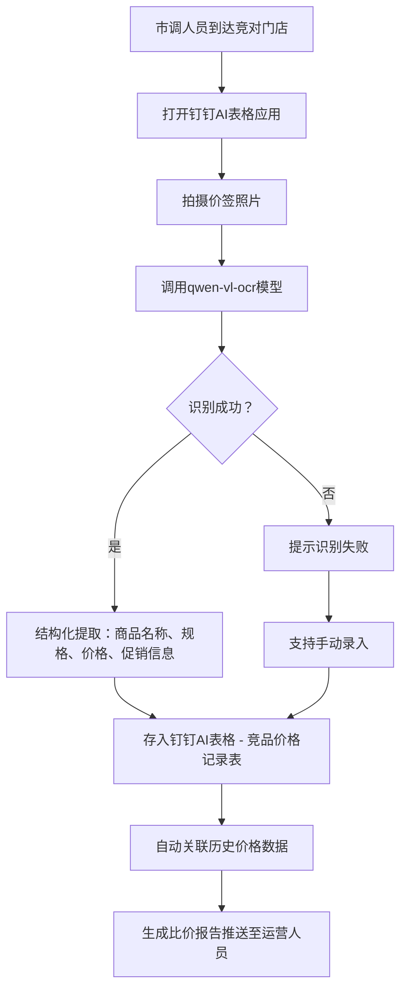
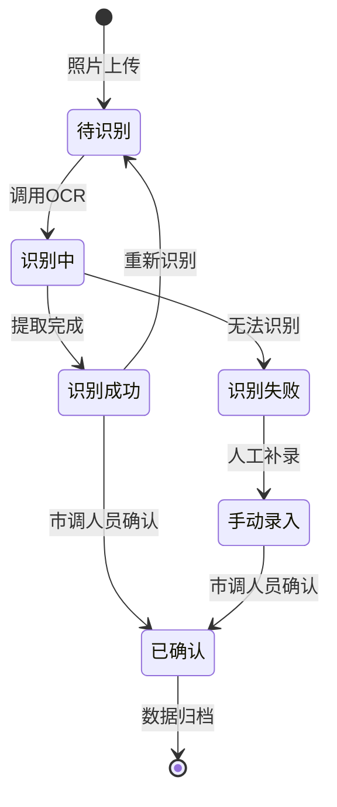

# PRD-004 产品 · 拍照识别功能设计

***

## 文档信息

| 项目   | 内容                   |
| ---- | -------------------- |
| 文档编号 | PRD-004-F001-2026-001 |
| 文档版本 | v0.1                 |
| 产品名称 | AI市调助手与智能定价系统             |
| 所属系统 | 钉钉AI表格应用             |
| 编制日期 | 2026-06-12       |
| 编制人员 | PRD-004 编制组               |

### 修订记录

| 版本   | 修订日期           | 修订说明 | 修订人    |
| ---- | -------------- | ---- | ------ |
| v0.1 | 2026-06-12 | 初稿创建 | PRD-004 编制组 |

***

> **文档使用说明**
>
> - `【替换】` 标记的内容：使用时替换为实际业务内容
> - `【删除】` 标记的内容：仅为填写说明，完成后删除
> - 本模板供 AI 开发智能体读取，请保持结构完整

> **文档撰写规范（重要）**
>
> 1. **严格遵循模板格式**：各章节表格字段必须与模板保持一致
> 2. **聚焦业务规则**：描述业务逻辑、数据约束、权限控制等，不写技术实现细节（如CSS类名、列宽像素、具体代码逻辑）
> 3. **减少不必要的示例**：不写JSON/XML格式的报文示例，仅描述报文格式以实际接口返回为准
> 4. **页面布局与交互分离**：§四仅描述页面结构（长什么样），§五描述业务规则（怎么操作）；字段说明表中「说明」列仅标注极简展示属性（只读/必填\*/系统自动生成），业务约束写在§五

***

## 一、功能角色矩阵说明

### 1.1 功能描述

- **功能名称：** 拍照识别
- **所属模块：** 竞品价格采集
- **功能描述：** 市调人员通过钉钉AI表格应用拍摄竞品价签照片，系统自动调用OCR模型提取商品名称、规格、价格、促销信息，并结构化存储至钉钉AI表格。

### 1.2 角色权限总览

| 角色      | 功能权限                        | 数据权限   |
| ------- | --------------------------- | ------ |
| 市调人员 | 拍照上传、查看识别结果、重新识别、删除   | 本人录入数据 |
| 单品运营 | 查看全部识别记录、查看识别置信度、标记修正 | 全量数据   |
| 采购人员 | 查看识别记录、查看识别结果             | 全量数据   |
| 管理层   | 查看识别统计、查看识别准确率报表         | 全量数据   |

### 1.3 功能角色矩阵

| 功能点  | 市调人员 | 单品运营 | 采购人员 | 管理层 |
| ---- | :-----: | :-----: | :-----: | :-----: |
| 拍照上传 |    是    |    否    |    否    |    否    |
| 查看识别结果 |    是    |    是    |    是    |    是    |
| 重新识别 |    是    |    是    |    否    |    否    |
| 标记修正 |    是    |    是    |    否    |    否    |
| 删除记录 |    是    |    是    |    否    |    否    |
| 查看识别统计 |    否    |    是    |    是    |    是    |

***

## 二、模块路径

钉钉AI表格应用 → 竞品价格采集 → 拍照识别入口（AI表格内置AI字段触发）

***

## 三、状态流转与流程图

### 3.1 业务流程图



### 3.2 状态流转图



***

## 四、页面布局

### 4.1 页面清单

|  序号 | 页面名称    | 页面类型   | 描述                           |
| :-: | ------- | ------ | ---------------------------- |
|  1  | 拍照识别入口    | 主页面    | 钉钉AI表格内置拍照入口，支持拍照和上传图片            |
|  2  | 识别结果展示页  | 弹窗     | 展示OCR识别的结构化结果，支持确认和修正 |
|  3  | 手动录入弹窗  | 弹窗     | 识别失败时，支持手动录入价签信息       |

***

### 4.2 拍照识别入口布局

```
┌─────────────────────────────────────────────────────────────────┐
│  竞品价格采集 - 拍照识别                                          │
├─────────────────────────────────────────────────────────────────┤
│                                                                 │
│           ┌─────────────────────────────┐                       │
│           │                             │                       │
│           │      [ 📷 点击拍照 ]         │                       │
│           │                             │                       │
│           └─────────────────────────────┘                       │
│                                                                 │
│           ── 或 ──                                              │
│                                                                 │
│           ┌─────────────────────────────┐                       │
│           │    [ 📁 从相册选择 ]          │                       │
│           └─────────────────────────────┘                       │
│                                                                 │
├─────────────────────────────────────────────────────────────────┤
│  最近识别记录                                                    │
│  ┌─────┬──────────┬──────────┬──────────┬──────────┐          │
│  │ 序号 │ 商品名称  │ 识别价格  │ 置信度   │ 操作     │          │
│  ├─────┼──────────┼──────────┼──────────┼──────────┤          │
│  │  1  │ 红颜草莓  │ ¥25.9    │ 95%     │ [查看]   │          │
│  │  2  │ 进口蓝莓  │ ¥39.9    │ 88%     │ [查看]   │          │
│  └─────┴──────────┴──────────┴──────────┴──────────┘          │
└─────────────────────────────────────────────────────────────────┘
```

### 4.2.1 功能区说明

| 组件名称    | 组件类型 | 位置 | 提示语            | 说明        |
| ------- | ---- | -- | -------------- | --------- |
| 拍照按钮    | 按钮   | 居中 | 点击拍照          | 调用相机    |
| 相册选择    | 按钮   | 居中 | 从相册选择        | 选择已有照片 |
| 最近记录列表 | 列表   | 底部 | —              | 展示最近10条识别记录 |

***

### 4.3 识别结果展示页布局

本弹窗为标准表单式弹窗，由三部分组成：

- **标题栏**：顶部显示"识别结果"，右侧为关闭按钮
- **内容区**：中部展示原图缩略和识别的结构化字段
- **按钮区**：底部右侧排列"重新识别"、"手动修正"和"确认"三个操作按钮

```
┌─────────────────────────────────────────────────┐
│  识别结果                                  [X]  │
├─────────────────────────────────────────────────┤
│  ┌─────────────────────────────────────────┐    │
│  │  [原图缩略]                               │    │
│  └─────────────────────────────────────────┘    │
│                                                 │
│  商品名称：  红颜草莓                             │
│  规    格：  300g/盒                             │
│  原    价：  ¥29.9                              │
│  促销价：    ¥25.9                              │
│  促销信息：  限时特惠                             │
│  置信度：    95%                                │
│                                                 │
│              [重新识别]  [手动修正]  [确认]        │
└─────────────────────────────────────────────────┘
```

### 4.3.1 识别结果字段说明

| 字段      | 组件类型 | 位置   | 提示语            | 说明        |
| ------- | ---- | ---- | -------------- | --------- |
| 原图缩略   | 图片   | 顶部 | —              | 只读，展示上传的照片 |
| 商品名称   | 文本   | 独占一行 | —              | 可编辑，OCR识别结果 |
| 规格      | 文本   | 独占一行 | —              | 可编辑，OCR识别结果 |
| 原价      | 文本   | 独占一行 | —              | 可编辑，OCR识别结果 |
| 促销价    | 文本   | 独占一行 | —              | 可编辑，OCR识别结果 |
| 促销信息   | 文本   | 独占一行 | —              | 可编辑，OCR识别结果 |
| 置信度    | 文本   | 独占一行 | —              | 只读，系统自动生成 |

***

### 4.4 手动录入弹窗布局

```
┌─────────────────────────────────────────────────┐
│  手动录入价签信息                          [X]  │
├─────────────────────────────────────────────────┤
│  竞对品牌：  [下拉选择 ▼]                         │
│  商品名称：  [输入框                            ]  │
│  规    格：  [输入框                            ]  │
│  原    价：  [输入框                            ]  │
│  促销价：    [输入框                            ]  │
│  促销信息：  [输入框                            ]  │
│                                                 │
│                              [取消]  [确定]      │
└─────────────────────────────────────────────────┘
```

### 4.4.1 表单字段说明

| 字段      | 组件类型 | 位置   | 提示语            | 说明        |
| ------- | ---- | ---- | -------------- | --------- |
| 竞对品牌   | 下拉框  | 独占一行 | 请选择竞对品牌 | 必填\*      |
| 商品名称   | 输入框  | 独占一行 | 请输入商品名称 | 必填\*      |
| 规格      | 输入框  | 独占一行 | 请输入规格 | 必填\*      |
| 原价      | 输入框  | 独占一行 | 请输入原价 | 必填\*      |
| 促销价    | 输入框  | 独占一行 | 请输入促销价 | 可选       |
| 促销信息   | 输入框  | 独占一行 | 请输入促销信息 | 可选       |

***

## 五、页面交互说明

### 5.1 拍照识别入口交互说明

#### 5.1.1 操作交互逻辑

| 操作类型 | 触发操作     | 交互可用性       | 正向输出                                        | 异常场景                                           | 异常处理             | 日志级别 |
| ---- | -------- | ----------- | ------------------------------------------- | ---------------------------------------------- | ---------------- | ---- |
| 拍照   | 点击"拍照"按钮 | 始终可用        | 调用相机，获取照片后自动触发OCR识别                               | 无相机权限 | Toast提示"请开启相机权限" | 接口级  |
| 相册选择 | 点击"从相册选择" | 始终可用        | 选择照片后自动触发OCR识别                               | 无相册权限 | Toast提示"请开启相册权限" | 接口级  |
| 查看记录 | 点击"查看"   | 始终可用        | 打开识别结果展示页，展示结构化结果和置信度                        | 记录不存在 | Toast提示"记录不存在" | 接口级  |

***

### 5.2 识别结果展示页交互说明

#### 5.2.1 字段交互规则

| 字段      | 类型  | 是否必填 | 约束规则                  | 展示规则 | 举例或枚举       |
| --------- | --- | :--: | --------------------- | ---- | ----------- |
| 商品名称   | 文本 |   是  | 1-100个字符，支持中英文和数字       | 明文   | 红颜草莓 300g/盒    |
| 规格      | 文本 |   是  | 1-50个字符                | 明文   | 300g/盒        |
| 原价      | 文本 |   是  | 数字格式，支持小数点后两位，大于0     | 明文   | 29.90          |
| 促销价    | 文本 |   否  | 数字格式，支持小数点后两位，大于等于0  | 明文   | 25.90          |
| 促销信息   | 文本 |   否  | 0-200个字符               | 明文   | 限时特惠          |
| 置信度    | 文本 |   —  | 系统自动生成，不可编辑            | 明文   | 95%            |

#### 5.2.2 操作交互逻辑

| 操作类型 | 触发操作      | 交互可用性       | 正向输出                    | 异常场景 | 异常处理               | 日志级别 |
| ---- | --------- | ----------- | ----------------------- | ---- | ------------------ | ---- |
| 确认保存 | 点击"确认"按钮  | 必填字段全部合规后可用 | 弹窗关闭，数据写入钉钉AI表格，Toast提示"保存成功" | 保存失败 | Toast提示"保存失败，请重试！" | 接口级  |
| 重新识别 | 点击"重新识别"按钮 | 始终可用        | 重新调用OCR模型识别当前照片           | 识别失败 | Toast提示"识别失败，请手动录入" | 接口级  |
| 手动修正 | 点击"手动修正"按钮 | 始终可用        | 所有字段变为可编辑状态，竞对品牌变为可下拉选择 | 无    | 无                  | 不记录  |
| 取消   | 点击右上角\[X] | 始终可用        | 关闭弹窗，不保存任何数据            | 无    | 无                  | 不记录  |

#### 5.2.3 弹窗说明

| 规则项  | 说明                                   |
| ---- | ------------------------------------ |
| 打开方式 | 拍照或选择相册后自动触发OCR，识别完成后自动打开结果展示弹窗 |
| 标题   | 固定显示"识别结果"                         |
| 数据填充 | OCR识别结果自动填充到各字段；置信度低于80%时字段背景标黄提示人工复核 |
| 校验时机 | 点击"确认"时触发全量校验                           |
| 保存规则 | 全部校验通过后提交保存；校验失败时字段下方显示红色提示文本          |

***

### 5.3 手动录入弹窗交互说明

#### 5.3.1 字段交互规则

| 字段      | 类型 | 是否必填 | 约束规则                       | 展示规则                | 举例或枚举       |
| ------------- | -- | :--: | -------------------------- | ------------------- | ----------- |
| 竞对品牌       | 下拉框 |   是  | 从竞对品牌表关联           | 下拉选择                | 百果园/鲜丰水果 |
| 商品名称       | 文本 |   是  | 1-100个字符，支持中英文和数字 | 明文                  | 红颜草莓 300g/盒    |
| 规格          | 文本 |   是  | 1-50个字符                | 明文                  | 300g/盒        |
| 原价          | 文本 |   是  | 数字格式，支持小数点后两位，大于0 | 明文                  | 29.90          |
| 促销价        | 文本 |   否  | 数字格式，支持小数点后两位，大于等于0 | 明文                  | 25.90          |
| 促销信息       | 文本 |   否  | 0-200个字符               | 明文                  | 限时特惠          |

#### 5.3.2 操作交互逻辑

| 操作类型 | 触发操作      | 交互可用性       | 正向输出                    | 异常场景 | 异常处理               | 日志级别 |
| ---- | --------- | ----------- | ----------------------- | ---- | ------------------ | ---- |
| 确定保存 | 点击"确定"按钮  | 必填字段全部合规后可用 | 弹窗关闭，数据以"MANUAL"来源写入钉钉AI表格 | 保存失败 | Toast提示"保存失败，请重试！" | 接口级  |
| 取消   | 点击"取消"按钮  | 始终可用        | 关闭弹窗，不保存任何数据            | 无    | 无                  | 不记录  |

#### 5.3.3 弹窗说明

| 规则项  | 说明                                   |
| ---- | ------------------------------------ |
| 打开方式 | 识别失败时点击"手动录入"；或从识别结果页点击"手动修正"后切换到手动模式 |
| 标题   | 固定显示"手动录入价签信息"                    |
| 数据来源 | 数据来源字段固定为"MANUAL"（人工录入）              |
| 校验时机 | 字段失焦时触发单字段校验；点击"确定"时触发全量校验           |

***

## 六、错误处理规范

### 6.1 表单校验错误

- 显示方式：对应字段下方显示红色提示文本，字段边框变红
- 触发时机：表单提交时触发全量校验；字段失去焦点时触发单字段校验

| 字段      | 为空时错误信息     | 格式错误时信息           |
| ------- | ----------- | ----------------- |
| 竞对品牌   | 请选择竞对品牌  | —                 |
| 商品名称   | 商品名称不能为空 | 商品名称长度不能超过100个字符 |
| 规格      | 规格不能为空   | 规格长度不能超过50个字符   |
| 原价      | 原价不能为空   | 原价格式不正确，应为正数     |

### 6.2 文件操作错误

| 场景      | 触发条件                         | 提示文案                    | 处理方式                       |
| ------- | ---------------------------- | ----------------------- | -------------------------- |
| 图片过大 | 上传照片超过10MB                    | 照片大小不能超过10MB          | Toast 提示，阻断上传              |
| 图片格式错误 | 上传非JPG/PNG/HEIC格式             | 请上传JPG/PNG格式照片        | Toast 提示，阻断上传              |
| OCR识别失败 | 模型返回置信度低于阈值              | 无法识别价签信息，请手动录入     | 跳转手动录入弹窗              |
| 网络/服务异常 | 接口请求失败                       | 接口异常，请稍候再试              | Toast 提示                   |

***

## 七、非功能性需求

### 7.1 合规与安全要求

| 适用规范       | 内容摘要              | 本模块特有说明                    |
| ---------- | ----------------- | -------------------------- |
| 操作日志   | 字段级日志、保留期限、不可篡改   | 覆盖操作：拍照、识别、修正、删除 |
| 敏感数据脱敏 | 各字段脱敏规则           | 照片中的个人信息需脱敏处理（如门店地址） |
| 文件操作安全 | 导出上限、下载鉴权、导出行为记日志 | 照片存储需加密，保留期限90天 |

### 7.2 性能需求

| 需求项       | 指标要求          | 说明            |
| --------- | ------------- | ------------- |
| OCR识别响应时间 | ≤ 5s          | 单张照片从上传到返回结果 |
| 保存响应时间 | ≤ 3s          | 确认保存操作  |
| 页面首屏加载时间  | ≤ 3s          | —             |
| 并发用户数     | 50           | 同时使用拍照识别的市调人员数 |

***

## 八、特殊说明

### 8.1 识别置信度分级规则

1. **高置信度（≥90%）**：识别结果自动填充，字段正常显示
2. **中置信度（80%-89%）**：识别结果自动填充，字段背景标黄提示人工复核
3. **低置信度（<80%）**：识别结果自动填充，字段背景标红，强制要求人工复核确认

### 8.2 照片留存规则

1. 原始照片存储至钉钉AI表格附件字段，保留90天
2. 超过90天的照片自动归档，保留缩略图
3. 删除记录时同步删除关联照片

### 8.3 其他特殊规则

1. 拍照时自动记录GPS位置和时间戳，不可手动修改
2. 同一商品同一门店同一天仅保留一条最新记录，历史记录自动归档

***

## 九、数据字典

### 9.1 字典项定义

**识别状态（ocrStatus）**

| 枚举值（code） | 显示文本（label） | 说明     |
| :-------: | ----------- | ------ |
|     0     | 待识别     | 照片已上传，等待OCR |
|     1     | 识别中     | OCR处理中 |
|     2     | 识别成功     | OCR识别完成 |
|     3     | 识别失败     | OCR无法识别 |

**数据来源（dataSource）**

| 枚举值（code） | 显示文本（label） | 说明     |
| :-------: | ----------- | ------ |
|     AI     | AI识别     | OCR自动识别 |
|     MANUAL     | 人工录入     | 手动补录 |

### 9.2 下拉框数据来源说明

| 字段名     | 数据来源类型 | 来源说明                        |
| ------- | ------ | --------------------------- |
| 竞对品类 | 字典项    | 参见竞对品牌管理模块 |

***

## 十、外部系统接口说明

### 10.1 接口清单

| 接口名称    | 功能描述           | 交互方向     | 依赖系统     | 数据流向                    |
| ------- | -------------- | -------- | -------- | ----------------------- |
| qwen-vl-ocr接口 | 调用OCR模型识别价签文字 | 调用 | 通义千问 | 本系统→通义千问 / 通义千问→本系统 |

### 10.2 接口详细说明

**qwen-vl-ocr接口**

| 规则项  | 说明                    |
| ---- | --------------------- |
| 触发时机 | 照片上传后自动调用           |
| 请求条件 | 照片格式为JPG/PNG/HEIC，大小≤10MB |
| 成功处理 | 返回结构化JSON（商品名称、规格、价格、促销信息、置信度） |
| 失败处理 | 返回错误码和错误信息，前端提示用户手动录入 |
| 重试机制 | 不自动重试，由用户手动触发重新识别 |

***

*文档结束*
