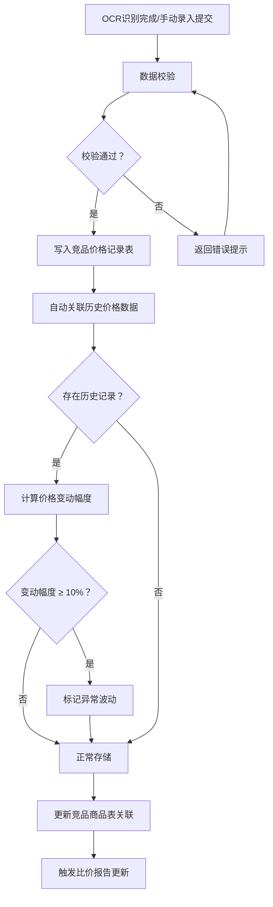
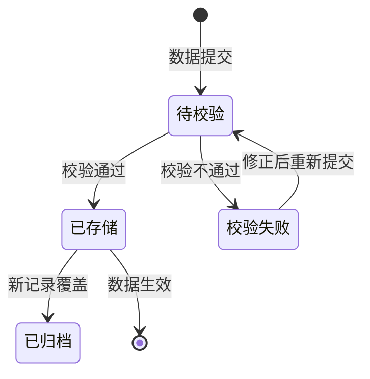

# PRD-004 产品 · 数据结构化存储功能设计

***

## 文档信息

| 项目   | 内容                   |
| ---- | -------------------- |
| 文档编号 | PRD-004-F002-2026-001 |
| 文档版本 | v0.1                 |
| 产品名称 | AI市调助手与智能定价系统             |
| 所属系统 | 钉钉AI表格应用             |
| 编制日期 | 2026-06-12       |
| 编制人员 | PRD-004 编制组               |

### 修订记录

| 版本   | 修订日期           | 修订说明 | 修订人    |
| ---- | -------------- | ---- | ------ |
| v0.1 | 2026-06-12 | 初稿创建 | PRD-004 编制组 |

***

> **文档撰写规范（重要）**
>
> 1. **严格遵循模板格式**：各章节表格字段必须与模板保持一致
> 2. **聚焦业务规则**：描述业务逻辑、数据约束、权限控制等，不写技术实现细节
> 3. **减少不必要的示例**：不写JSON/XML格式的报文示例
> 4. **页面布局与交互分离**：§四仅描述页面结构，§五描述业务规则

***

## 一、功能角色矩阵说明

### 1.1 功能描述

- **功能名称：** 数据结构化存储
- **所属模块：** 竞品价格采集
- **功能描述：** 将OCR识别或人工录入的竞品价格数据自动结构化存储至钉钉AI表格的竞品价格记录表，支持与历史数据自动关联、价格变动计算和异常波动检测。

### 1.2 角色权限总览

| 角色      | 功能权限                        | 数据权限   |
| ------- | --------------------------- | ------ |
| 市调人员 | 查看本人录入数据、新增数据             | 本人录入数据 |
| 单品运营 | 查看全部数据、新增、修改、删除、导出      | 全量数据   |
| 采购人员 | 查看全部数据、导出                  | 全量数据   |
| 管理层   | 查看全部数据、导出、查看数据质量报表      | 全量数据   |

### 1.3 功能角色矩阵

| 功能点  | 市调人员 | 单品运营 | 采购人员 | 管理层 |
| ---- | :-----: | :-----: | :-----: | :-----: |
| 查看列表 |    是    |    是    |    是    |    是    |
| 查看详情 |    是    |    是    |    是    |    是    |
| 新增   |    是    |    是    |    否    |    否    |
| 修改   |    否    |    是    |    否    |    否    |
| 删除   |    否    |    是    |    否    |    否    |
| 导出   |    否    |    是    |    是    |    是    |

***

## 二、模块路径

钉钉AI表格应用 → 竞品价格采集 → 竞品价格记录表

***

## 三、状态流转与流程图

### 3.1 业务流程图



### 3.2 状态流转图



***

## 四、页面布局

### 4.1 页面清单

|  序号 | 页面名称    | 页面类型   | 描述                           |
| :-: | ------- | ------ | ---------------------------- |
|  1  | 竞品价格记录列表 | 主页面    | 展示所有竞品价格记录，支持查询、筛选、操作            |
|  2  | 新增/编辑弹窗 | 弹窗     | 新增或编辑单条竞品价格记录                    |
|  3  | 查看详情弹窗  | 弹窗     | 查看单条记录详情（只读）                 |
|  4  | 批量导入弹窗  | 弹窗     | 上传 Excel 文件完成批量录入       |
|  5  | 删除确认弹窗  | 弹窗     | 删除操作二次确认                     |

***

### 4.2 竞品价格记录列表布局

```
┌─────────────────────────────────────────────────────────────────┐
│  竞品价格记录表                                                   │
├─────────────────────────────────────────────────────────────────┤
│  查询条件区                                                       │
│  ┌─────────────┐ ┌─────────────┐ ┌──────┐ ┌──────┐             │
│  │ 竞对品牌   │ │ 商品名称   │ │ 查询 │ │ 重置 │             │
│  │ [下拉框    ]│ │ [输入框    ]│ │ 按钮 │ │ 按钮 │             │
│  └─────────────┘ └─────────────┘ └──────┘ └──────┘             │
├─────────────────────────────────────────────────────────────────┤
│  工具栏区    [+新增]  [导入]  [批量删除]         [导出]          │
├─────────────────────────────────────────────────────────────────┤
│  列表数据区                                                       │
│  ┌────┬─────┬──────────┬──────────┬──────────┬──────────┬────────┐      │
│  │ □  │ 序号 │ 竞对品牌  │ 商品名称  │ 价格     │ 数据来源 │ 操作   │      │
│  ├────┼─────┼──────────┼──────────┼──────────┼──────────┼────────┤      │
│  │ □  │  1  │ 百果园   │ 红颜草莓  │ ¥25.9   │ AI识别  │ [详情] [修改] [删除]│      │
│  │ □  │  2  │ 鲜丰水果  │ 进口蓝莓  │ ¥39.9   │ 人工录入 │ [详情] [修改] [删除]│      │
│  └────┴─────┴──────────┴──────────┴──────────┴──────────┴────────┘      │
├─────────────────────────────────────────────────────────────────┤
│  分页区    [< 1 2 3 ... 10 >]  [每页 10 ▼]  共 95 条            │
└─────────────────────────────────────────────────────────────────┘
```

### 4.2.1 查询条件区

| 组件名称    | 组件类型 | 位置 | 提示语            | 说明        |
| ------- | ---- | -- | -------------- | --------- |
| 竞对品牌    | 下拉框  | 居左 | 请选择竞对品牌 | 精确查询 |
| 商品名称    | 输入框  | 居左 | 请输入商品名称 | 模糊查询 |
| 价格日期范围 | 日期范围 | 居左 | 请选择日期范围 | 精确查询 |
| 数据来源    | 下拉框  | 居左 | 请选择数据来源 | 精确查询 |
| 查询      | 按钮   | 居右 | —              | 主按钮       |
| 重置      | 按钮   | 居右 | —              | 次按钮       |

### 4.2.2 工具栏区

| 组件名称 | 组件类型 | 位置 | 提示语 | 说明          |
| ---- | ---- | -- | --- | ----------- |
| 新增   | 按钮   | 居左 | —   | 权限控制时显示 |
| 导入   | 按钮   | 居左 | —   | —          |
| 批量删除 | 按钮   | 居左 | —   | 灰化，选中数据后启用  |
| 导出   | 按钮   | 居右 | —   | —           |

### 4.2.3 列表展示区

| 字段      | 组件类型 | 位置 | 说明                |
| ------- | ---- | -- | ----------------- |
| 复选框     | 复选框  | 首列 | 批量操作时勾选           |
| 序号      | 文本   | 居中 | —                 |
| 竞对品牌    | 文本   | 居左 | 关联竞对品牌表         |
| 商品名称    | 文本   | 居左 | 关联竞品商品表         |
| 规格      | 文本   | 居左 | —                 |
| 价格日期    | 文本   | 居左 | 格式：YYYY-MM-DD    |
| 原价      | 文本   | 居左 | 格式：¥XX.XX        |
| 促销价    | 文本   | 居左 | 格式：¥XX.XX        |
| 数据来源    | 标签   | 居中 | AI识别/人工录入 badge样式 |
| 置信度    | 文本   | 居中 | 仅AI识别时显示        |
| 价格变动    | 标签   | 居中 | ↑/↓ + 百分比，红绿配色 |
| 操作      | 按钮组  | 居中 | \[详情] \[修改] \[删除] |

### 4.2.4 分页控件区

| 控件    | 组件类型 | 位置 | 说明      |
| ----- | ---- | -- | ------- |
| 总条数   | 文本   | 居左 | 共0条记录   |
| 页码按钮  | 按钮组  | 居中 | 1高亮     |
| 向前翻页  | 按钮   | 居中 | <       |
| 向后翻页  | 按钮   | 居中 | >       |
| 每页条目数 | 下拉框  | 居右 | 默认10条/页 |
| 跳转至页码 | 输入框  | 居右 | 默认1     |

***

### 4.3 新增/编辑弹窗布局

```
┌─────────────────────────────────────────────────┐
│  新增竞品价格记录                           [X]  │
├─────────────────────────────────────────────────┤
│  竞对品牌：  [下拉选择 ▼]                         │
│  竞品商品：  [下拉选择 ▼]                         │
│  竞对门店：  [下拉选择 ▼]                         │
│  价格日期：  [日期选择器                          ]  │
│  原    价：  [输入框                            ]  │
│  促销价：    [输入框                            ]  │
│  会员价：    [输入框                            ]  │
│  促销信息：  [输入框                            ]  │
│  来源照片：  [附件上传                            ]  │
│                                                 │
│                              [取消]  [确定]      │
└─────────────────────────────────────────────────┘
```

### 4.3.1 表单字段说明

| 字段      | 组件类型 | 位置   | 提示语            | 说明        |
| ------- | ---- | ---- | -------------- | --------- |
| 竞对品牌   | 下拉框  | 独占一行 | 请选择竞对品牌 | 必填\*，关联竞对品牌表 |
| 竞品商品   | 下拉框  | 独占一行 | 请选择竞品商品 | 必填\*，关联竞品商品表，依赖竞对品牌选择 |
| 竞对门店   | 下拉框  | 独占一行 | 请选择竞对门店 | 必填\*，关联竞对门店表 |
| 价格日期   | 日期选择器 | 独占一行 | 请选择价格日期 | 必填\*，默认今天 |
| 原价      | 输入框  | 独占一行 | 请输入原价 | 必填\*，数字格式 |
| 促销价    | 输入框  | 独占一行 | 请输入促销价 | 可选，数字格式 |
| 会员价    | 输入框  | 独占一行 | 请输入会员价 | 可选，数字格式 |
| 促销信息   | 输入框  | 独占一行 | 请输入促销信息 | 可选，0-500字符 |
| 来源照片   | 附件   | 独占一行 | 点击上传照片 | 可选，JPG/PNG |

***

### 4.4 查看详情弹窗布局

```
┌─────────────────────────────────────────────────┐
│  查看竞品价格记录详情                       [X]  │
├─────────────────────────────────────────────────┤
│  竞对品牌：  百果园                              │
│  竞品商品：  红颜草莓 300g/盒                     │
│  竞对门店：  百果园（朝阳店）                      │
│  价格日期：  2026-06-12                         │
│  原    价：  ¥29.9                              │
│  促销价：    ¥25.9                              │
│  会员价：    ¥27.9                              │
│  促销信息：  限时特惠                             │
│  数据来源：  AI识别                              │
│  置信度：    95%                                │
│  价格变动：  ↓5.2%                              │
│  创建时间：  2026-06-12 10:30:00                │
│                                                 │
│                                    [关闭]       │
└─────────────────────────────────────────────────┘
```

### 4.4.1 展示字段说明

| 字段      | 组件类型 | 位置   | 说明         |
| ------- | ---- | ---- | ---------- |
| 竞对品牌   | 文本   | 独占一行 | 只读         |
| 竞品商品   | 文本   | 独占一行 | 只读         |
| 竞对门店   | 文本   | 独占一行 | 只读         |
| 价格日期   | 文本   | 独占一行 | 只读         |
| 原价      | 文本   | 独占一行 | 只读         |
| 促销价    | 文本   | 独占一行 | 只读         |
| 会员价    | 文本   | 独占一行 | 只读         |
| 促销信息   | 文本   | 独占一行 | 只读         |
| 数据来源   | 文本   | 独占一行 | 只读         |
| 置信度    | 文本   | 独占一行 | 只读         |
| 价格变动   | 文本   | 独占一行 | 只读         |
| 创建时间    | 文本   | 独占一行 | 只读         |

***

### 4.5 批量导入弹窗布局

```
┌─────────────────────────────────────────────────┐
│  批量导入                                  [X]  │
├─────────────────────────────────────────────────┤
│  ┌─────────────────────────────────────────┐    │
│  │           点击或拖拽上传文件              │    │
│  │              [.xlsx 文件]                │    │
│  └─────────────────────────────────────────┘    │
│                                                 │
│                              [取消]  [导入]      │
└─────────────────────────────────────────────────┘
```

### 4.5.1 导入字段说明

| 字段名称    | 是否必填 | 填写规则     | 填写示例   |
| ------- | :--: | -------- | ------ |
| 竞对品牌 |   是  | 1-50个字符 | 百果园 |
| 商品名称 |   是  | 1-500个字符 | 红颜草莓 300g/盒 |
| 规格 |   是  | 1-200个字符 | 300g/盒 |
| 门店名称 |   是  | 1-200个字符 | 朝阳店 |
| 价格日期 |   是  | YYYY-MM-DD | 2026-06-12 |
| 原价 |   是  | 正数，小数点后两位 | 29.90 |
| 促销价 |   否  | 正数，小数点后两位 | 25.90 |
| 会员价 |   否  | 正数，小数点后两位 | 27.90 |
| 促销信息 |   否  | 0-500字符 | 限时特惠 |

***

### 4.6 删除确认弹窗布局

```
┌─────────────────────────────────────────────────┐
│  提示                                      [X]  │
├─────────────────────────────────────────────────┤
│                                                 │
│         是否确认删除该竞品价格记录？               │
│                                                 │
│                              [取消]  [确定]      │
└─────────────────────────────────────────────────┘
```

***

## 五、页面交互说明

### 5.1 列表页面交互说明

#### 5.1.1 字段交互规则

| 字段        | 类型  | 是否必填 | 约束规则                  | 展示规则 | 举例或枚举       |
| --------- | --- | :--: | --------------------- | ---- | ----------- |
| 竞对品牌    | 下拉框 |   否  | 精确查询；数据源参见竞对品牌表 | 明文   | 百果园/鲜丰水果 |
| 商品名称    | 输入框 |   否  | 模糊查询；最大50字符  | 明文   | 红颜草莓 |
| 价格日期范围 | 日期范围 |   否  | 精确查询 | 明文   | 2026-06-01 ~ 2026-06-12 |
| 数据来源    | 下拉框 |   否  | 精确查询 | 明文   | AI识别/人工录入 |

#### 5.1.2 操作交互逻辑

| 操作类型 | 触发操作     | 交互可用性       | 正向输出                                        | 异常场景                                           | 异常处理             | 日志级别 |
| ---- | -------- | ----------- | ------------------------------------------- | ---------------------------------------------- | ---------------- | ---- |
| 查询   | 点击"查询"   | 始终可用        | 按条件筛选，结果在列表中展示，分页同步更新                       | — | — | 接口级  |
| 重置   | 点击"重置"   | 始终可用        | 清空所有筛选条件，恢复初始查询状态                           | 无                                              | 无                | 接口级  |
| 新增   | 点击"新增"   | 始终可用        | 打开"新增竞品价格记录"弹窗                                | 无                                              | 无                | 接口级  |
| 查看   | 点击"详情"   | 始终可用        | 打开查看弹窗，所有字段只读                               | 无                                              | 无                | 接口级  |
| 修改   | 点击"修改"   | 始终可用 | 打开编辑弹窗，反显当前数据，支持编辑                    | — | — | 接口级  |
| 删除   | 点击"删除"   | 始终可用 | 弹出确认弹窗；确认后执行删除，自动刷新列表              | — | — | 接口级  |
| 导入   | 点击"导入"   | 始终可用        | 打开批量导入弹窗；全部数据校验通过后一次性导入 | 存在校验错误时，遇错即停不执行导入，提示"第N行：【字段名】+错误原因" | Toast提示 | 接口级  |
| 导出   | 点击"导出"   | 始终可用        | 勾选数据时导出勾选行；未勾选时导出全量数据，下载Excel文件             | 无数据                                            | Toast提示"暂无数据可导出" | 接口级  |

> **导出文件命名规范**：
> - 格式：`竞品价格记录_{YYYYMMDD}_{HHMMSS}.xlsx`
> - 示例：`竞品价格记录_20260612_103045.xlsx`
> - 导入模板：`竞品价格记录批量导入模板.xlsx`

***

### 5.2 新增/编辑弹窗交互说明

#### 5.2.1 字段交互规则

| 字段            | 类型 | 是否必填 | 约束规则                       | 展示规则                | 举例或枚举       |
| ------------- | -- | :--: | -------------------------- | ------------------- | ----------- |
| 竞对品牌       | 下拉框 |   是  | 关联竞对品牌表 | 下拉选择                | 百果园 |
| 竞品商品       | 下拉框 |   是  | 关联竞品商品表，依赖品牌选择 | 下拉选择                | 红颜草莓 300g/盒 |
| 竞对门店       | 下拉框 |   是  | 关联竞对门店表 | 下拉选择                | 朝阳店 |
| 价格日期       | 日期选择器 |   是  | 不可选择未来日期 | 日期选择                | 2026-06-12 |
| 原价          | 输入框 |   是  | 正数，小数点后两位，大于0 | 明文                  | 29.90 |
| 促销价        | 输入框 |   否  | 正数，小数点后两位，大于等于0 | 明文                  | 25.90 |
| 会员价        | 输入框 |   否  | 正数，小数点后两位，大于等于0 | 明文                  | 27.90 |
| 促销信息       | 输入框 |   否  | 0-500字符 | 明文                  | 限时特惠 |
| 来源照片       | 附件 |   否  | JPG/PNG，≤10MB | 附件上传 | — |

#### 5.2.2 操作交互逻辑

| 操作类型 | 触发操作      | 交互可用性       | 正向输出                    | 异常场景 | 异常处理               | 日志级别 |
| ---- | --------- | ----------- | ----------------------- | ---- | ------------------ | ---- |
| 确定保存 | 点击"确定"按钮  | 必填字段全部合规后可用 | 弹窗关闭，列表刷新，Toast提示"保存成功" | 保存失败 | Toast提示"保存失败，请重试！" | 接口级  |
| 取消   | 点击"取消"按钮  | 始终可用        | 关闭弹窗，不保存任何数据            | 无    | 无                  | 不记录  |
| 关闭   | 点击右上角\[X] | 始终可用        | 关闭弹窗，不保存任何数据            | 无    | 无                  | 不记录  |

#### 5.2.3 弹窗说明

| 规则项  | 说明                                   |
| ---- | ------------------------------------ |
| 打开方式 | 点击列表页工具栏"新增"按钮，或操作列"修改"按钮            |
| 标题   | 新增时显示"新增竞品价格记录"；编辑时显示"编辑竞品价格记录"          |
| 数据反显 | 编辑时自动回填当前记录数据；新增时所有字段为空              |
| 校验时机 | 字段失焦时触发单字段校验；点击"确定"时触发全量校验           |
| 保存规则 | 全部校验通过后提交保存；校验失败时字段下方显示红色提示文本，字段边框变红 |
| 关闭确认 | 如有未保存的修改，关闭时弹出二次确认"是否放弃编辑？"          |

***

### 5.3 查看详情弹窗交互说明

#### 5.3.1 操作交互逻辑

| 操作类型 | 触发操作     | 交互可用性 | 正向输出        | 异常场景 | 异常处理 | 日志级别 |
| ---- | -------- | ----- | ----------- | ---- | ---- | ---- |
| 关闭   | 点击"关闭"按钮 | 始终可用  | 关闭弹窗，返回列表页面 | 无    | 无    | 不记录  |

***

### 5.4 批量导入弹窗交互说明

#### 5.4.1 操作交互逻辑

| 操作类型 | 触发操作       | 交互可用性   | 正向输出                          | 异常场景               | 异常处理                         | 日志级别 |
| ---- | ---------- | ------- | ----------------------------- | ------------------ | ---------------------------- | ---- |
| 选择文件 | 点击或拖拽上传    | 始终可用    | 展示文件名及删除按钮                    | 格式非.xlsx           | Toast提示"请上传正确格式的Excel文件"     | 不记录  |
| 确认导入 | 点击"导入"按钮   | 选择文件后可用 | 全部校验通过后一次性导入，展示"导入成功，共导入X条数据" | 文件超10MB            | Toast提示"文件大小不能超过10MB"        | 接口级  |
| 取消   | 点击"取消"按钮   | 始终可用    | 关闭弹窗                          | 数据校验失败（必填/格式/唯一性等） | 遇错即停，Toast提示"第N行：【字段名】+错误原因" | 不记录  |
| 下载模板 | 点击"下载模板"链接 | 始终可用    | 下载批量导入模板.xlsx                 | 模板数据获取失败           | 弹出提示，同时停止下载                  | 不记录  |

#### 5.4.2 弹窗说明

| 规则项  | 说明                                               |
| ---- | ------------------------------------------------ |
| 文件格式 | 仅支持 .xlsx 文件                                     |
| 文件大小 | 不超过 10MB                                         |
| 校验方式 | 逐行前置校验，遇错即停，不检查后续行，不执行导入                         |
| 成功提示 | "导入成功，共导入X条数据"                                   |
| 错误提示 | "第N行：【字段名】+错误原因，请修正后重新上传"                        |
| 模板结构 | Sheet1为导入数据（必填）；Sheet2为字典参考（只读，不参与导入） |

***

### 5.5 删除确认弹窗交互说明

#### 5.5.1 操作交互逻辑

| 操作类型 | 触发操作     | 交互可用性 | 正向输出             | 异常场景 | 异常处理    | 日志级别 |
| ---- | -------- | ----- | ---------------- | ---- | ------- | ---- |
| 确认删除 | 点击"确定"按钮 | 始终可用  | 执行删除，弹窗关闭，列表自动刷新 | 删除失败 | Toast提示 | 接口级  |
| 取消   | 点击"取消"按钮 | 始终可用  | 关闭弹窗，不做任何操作      | 无    | 无       | 不记录  |

#### 5.5.2 弹窗说明

| 规则项  | 说明              |
| ---- | --------------- |
| 触发条件 | 点击列表行操作列的"删除"按钮 |
| 提示文案 | "是否确认删除该竞品价格记录？"   |
| 确认操作 | 执行删除，弹窗关闭，列表刷新  |
| 取消操作 | 关闭弹窗不做任何操作      |

***

## 六、错误处理规范

### 6.1 表单校验错误

- 显示方式：对应字段下方显示红色提示文本，字段边框变红
- 触发时机：表单提交时触发全量校验；字段失去焦点时触发单字段校验

| 字段      | 为空时错误信息     | 格式错误时信息           |
| ------- | ----------- | ----------------- |
| 竞对品牌   | 请选择竞对品牌  | —                 |
| 竞品商品   | 请选择竞品商品  | —                 |
| 竞对门店   | 请选择竞对门店  | —                 |
| 价格日期   | 请选择价格日期  | 不能选择未来日期         |
| 原价      | 原价不能为空   | 原价格式不正确，应为正数     |
| 促销价    | —         | 促销价格式不正确，应为正数   |

### 6.2 文件操作错误

| 场景      | 触发条件                         | 提示文案                    | 处理方式                       |
| ------- | ---------------------------- | ----------------------- | -------------------------- |
| 导入-格式错误 | 上传非 .xlsx 文件                 | 请上传正确格式的 Excel 文件       | Toast 提示，阻断上传              |
| 导入-超大文件 | 文件超过 10MB                    | 文件大小不能超过 10MB           | Toast 提示，阻断上传              |
| 导入-校验失败 | 数据存在校验错误（必填/格式/长度/唯一性/关联数据等） | 第N行：【字段名】+错误原因，请修正后重新上传 | 遇错即停，不执行任何数据导入；用户修正后重新上传校验 |
| 导出-无数据  | 当前查询结果为空                     | 暂无数据可导出                 | Toast 提示                   |
| 网络/服务异常 | 接口请求失败                       | 接口异常，请稍候再试              | Toast 提示                   |

***

## 七、非功能性需求

### 7.1 合规与安全要求

| 适用规范       | 内容摘要              | 本模块特有说明                    |
| ---------- | ----------------- | -------------------------- |
| 操作日志   | 字段级日志、保留期限、不可篡改   | 覆盖操作：新增/修改/删除/导入/导出 |
| 文件操作安全 | 导出上限、下载鉴权、导出行为记日志 | 单次导出上限10000条 |

### 7.2 性能需求

| 需求项       | 指标要求          | 说明            |
| --------- | ------------- | ------------- |
| 列表查询响应时间  | ≤ 2s          | 正常网络条件下，含分页查询 |
| 保存/提交响应时间 | ≤ 3s          | 新增/修改/删除等写操作  |
| 导出响应时间    | ≤ 5s（1000条以内） | 超出时建议提示异步处理   |
| 页面首屏加载时间  | ≤ 3s          | —             |
| 并发用户数     | 100           | —       |

***

## 八、特殊说明

### 8.1 价格变动计算规则

1. 价格变动幅度 = (本次价格 - 上次价格) / 上次价格 × 100%
2. 变动幅度 ≥ 10% 时标记为异常波动，触发告警通知
3. 首次录入的商品无历史数据，不计算变动幅度

### 8.2 数据去重规则

1. 同一竞对品牌 + 同一商品 + 同一门店 + 同一价格日期 = 唯一记录
2. 重复录入时自动覆盖旧记录，旧记录移入历史归档表
3. 数据来源为"AI识别"的记录可被"人工录入"覆盖，反之亦然

### 8.3 其他特殊规则

1. 数据写入后自动触发历史价格关联和比价报告更新
2. 删除记录时同步删除关联的异常告警记录
3. 导出数据时自动脱敏处理（隐藏具体门店地址）

***

## 九、数据字典

### 9.1 字典项定义

**数据来源（dataSource）**

| 枚举值（code） | 显示文本（label） | 说明     |
| :-------: | ----------- | ------ |
|     AI     | AI识别     | OCR自动识别 |
|     MANUAL     | 人工录入     | 手动补录 |

**价格变动方向（priceChangeDirection）**

| 枚举值（code） | 显示文本（label） | 说明     |
| :-------: | ----------- | ------ |
|     UP     | 价格上涨     | 本次价格 > 上次价格 |
|     DOWN     | 价格下降     | 本次价格 < 上次价格 |
|     STABLE     | 价格持平     | 本次价格 = 上次价格 |

### 9.2 下拉框数据来源说明

| 字段名     | 数据来源类型 | 来源说明                        |
| ------- | ------ | --------------------------- |
| 竞对品牌 | 接口动态加载 | 来源：竞对品牌管理模块 |
| 竞品商品 | 接口动态加载 | 来源：竞品商品管理模块，依赖品牌选择 |
| 竞对门店 | 接口动态加载 | 来源：竞对门店管理模块 |
| 数据来源 | 字典项    | 参见 9.1 dataSource |

***

## 十、外部系统接口说明

### 10.1 接口清单

| 接口名称    | 功能描述           | 交互方向     | 依赖系统     | 数据流向                    |
| ------- | -------------- | -------- | -------- | ----------------------- |
| 历史价格查询接口 | 查询指定商品的历史价格记录 | 被调用 | 本模块数据 | 本模块→本模块数据表 |
| 比价报告更新接口 | 触发比价报告重新生成 | 被调用 | 比价报告模块 | 本模块→比价报告模块 |
| 异常告警触发接口 | 价格异常波动时触发告警 | 被调用 | 异常价格告警模块 | 本模块→异常价格告警模块 |

### 10.2 接口详细说明

**历史价格查询接口**

| 规则项  | 说明                    |
| ---- | --------------------- |
| 触发时机 | 数据写入成功后自动调用           |
| 请求条件 | 竞品商品ID + 竞对门店ID |
| 成功处理 | 返回最近一次价格记录，计算变动幅度 |
| 失败处理 | 无历史记录时返回空，不触发变动计算 |

**比价报告更新接口**

| 规则项  | 说明                    |
| ---- | --------------------- |
| 触发时机 | 数据写入成功后自动调用           |
| 请求条件 | 竞品商品ID |
| 成功处理 | 比价报告模块重新生成该商品的比价报告 |
| 失败处理 | 异步重试3次，仍失败则记录日志 |

**异常告警触发接口**

| 规则项  | 说明                    |
| ---- | --------------------- |
| 触发时机 | 价格变动幅度 ≥ 10% 时触发           |
| 请求条件 | 竞品商品ID + 变动幅度 |
| 成功处理 | 异常价格告警模块生成告警并推送通知 |
| 失败处理 | 异步重试3次，仍失败则记录日志 |

***

*文档结束*
