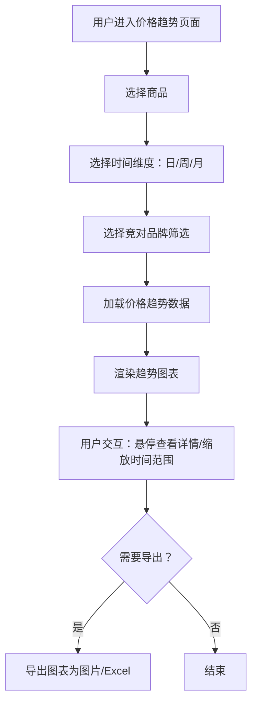

# PRD-004 产品 · 竞品价格趋势功能设计

***

## 文档信息

| 项目   | 内容                   |
| ---- | -------------------- |
| 文档编号 | PRD-004-F003-2026-001 |
| 文档版本 | v0.1                 |
| 产品名称 | AI市调助手与智能定价系统             |
| 所属系统 | 钉钉AI表格应用             |
| 编制日期 | 2026-06-12       |
| 编制人员 | PRD-004 编制组               |

### 修订记录

| 版本   | 修订日期           | 修订说明 | 修订人    |
| ---- | -------------- | ---- | ------ |
| v0.1 | 2026-06-12 | 初稿创建 | PRD-004 编制组 |

***

> **文档撰写规范（重要）**
>
> 1. **严格遵循模板格式**：各章节表格字段必须与模板保持一致
> 2. **聚焦业务规则**：描述业务逻辑、数据约束、权限控制等，不写技术实现细节
> 3. **减少不必要的示例**：不写JSON/XML格式的报文示例
> 4. **页面布局与交互分离**：§四仅描述页面结构，§五描述业务规则

***

## 一、功能角色矩阵说明

### 1.1 功能描述

- **功能名称：** 竞品价格趋势
- **所属模块：** 竞品价格采集
- **功能描述：** 以可视化图表展示指定商品在不同竞对品牌下的历史价格变化趋势，支持按日/周/月维度切换，帮助运营人员快速掌握竞品价格动态。

### 1.2 角色权限总览

| 角色      | 功能权限                        | 数据权限   |
| ------- | --------------------------- | ------ |
| 市调人员 | 查看本人负责商品的趋势图             | 本人录入数据 |
| 单品运营 | 查看全部商品趋势图、切换时间维度、导出图表  | 全量数据   |
| 采购人员 | 查看全部商品趋势图、导出图表           | 全量数据   |
| 管理层   | 查看全部商品趋势图、导出图表、查看趋势汇总  | 全量数据   |

### 1.3 功能角色矩阵

| 功能点  | 市调人员 | 单品运营 | 采购人员 | 管理层 |
| ---- | :-----: | :-----: | :-----: | :-----: |
| 查看趋势图 |    是    |    是    |    是    |    是    |
| 切换时间维度 |    否    |    是    |    是    |    是    |
| 筛选竞对品牌 |    否    |    是    |    是    |    是    |
| 导出图表 |    否    |    是    |    是    |    是    |
| 查看趋势汇总 |    否    |    否    |    否    |    是    |

***

## 二、模块路径

钉钉AI表格应用 → 竞品价格采集 → 竞品价格趋势

***

## 三、状态流转与流程图

### 3.1 业务流程图



***

## 四、页面布局

### 4.1 页面清单

|  序号 | 页面名称    | 页面类型   | 描述                           |
| :-: | ------- | ------ | ---------------------------- |
|  1  | 价格趋势主页面 | 主页面    | 展示价格趋势图表，支持筛选和交互            |

***

### 4.2 价格趋势主页面布局

```
┌─────────────────────────────────────────────────────────────────┐
│  竞品价格趋势                                                   │
├─────────────────────────────────────────────────────────────────┤
│  筛选条件区                                                       │
│  ┌─────────────┐ ┌─────────────┐ ┌─────────────┐ ┌──────┐     │
│  │ 商品名称   │ │ 竞对品牌   │ │ 时间范围   │ │ 查询 │     │
│  │ [下拉搜索 ▼]│ │ [多选下拉▼]│ │ [日期范围  ]│ │ 按钮 │     │
│  └─────────────┘ └─────────────┘ └─────────────┘ └──────┘     │
│  时间维度切换：  ○ 日  ○ 周  ○ 月                                  │
├─────────────────────────────────────────────────────────────────┤
│  图表展示区                                                       │
│  ┌─────────────────────────────────────────────────────────┐    │
│  │                                                         │    │
│  │              [ 价格趋势折线图 ]                           │    │
│  │                                                         │    │
│  │   ¥35 ┤        ╭─╮                                      │    │
│  │   ¥30 ┤   ╭───╯  ╰──╮    ╭── 百果园                     │    │
│  │   ¥25 ┤──╯          ╰────╯    ── 鲜丰水果               │    │
│  │   ¥20 ┤                       ·· 叮咚买菜               │    │
│  │       └───────────────────────────────────────────      │    │
│  │         6/1   6/3   6/5   6/7   6/9   6/11              │    │
│  └─────────────────────────────────────────────────────────┘    │
├─────────────────────────────────────────────────────────────────┤
│  数据汇总区                                                       │
│  ┌──────────┬──────────┬──────────┬──────────┐               │
│  │ 竞对品牌  │ 最新价格  │ 近30天涨跌 │ 最低价   │               │
│  ├──────────┼──────────┼──────────┼──────────┤               │
│  │ 百果园   │ ¥25.9   │ ↓5.2%   │ ¥24.9   │               │
│  │ 鲜丰水果  │ ¥27.9   │ ↑3.1%   │ ¥26.9   │               │
│  │ 叮咚买菜  │ ¥24.9   │ ↓8.5%   │ ¥23.9   │               │
│  └──────────┴──────────┴──────────┴──────────┘               │
├─────────────────────────────────────────────────────────────────┤
│  工具栏区                                          [导出图表]    │
└─────────────────────────────────────────────────────────────────┘
```

### 4.2.1 筛选条件区

| 组件名称    | 组件类型 | 位置 | 提示语            | 说明        |
| ------- | ---- | -- | -------------- | --------- |
| 商品名称    | 下拉搜索 | 居左 | 请选择或搜索商品 | 必填\*，支持模糊搜索 |
| 竞对品牌    | 多选下拉 | 居左 | 请选择竞对品牌 | 可选，默认全选 |
| 时间范围    | 日期范围 | 居左 | 请选择时间范围 | 可选，默认近30天 |
| 时间维度    | 单选按钮组 | 居左 | — | 日/周/月，默认日 |
| 查询      | 按钮   | 居右 | — | 主按钮 |

### 4.2.2 图表展示区

| 组件名称    | 组件类型 | 位置 | 说明            |
| ------- | ---- | -- | ------------- |
| 趋势折线图   | 图表   | 居中 | 多折线展示各竞对品牌价格走势 |
| 图例      | 图例   | 图表右侧 | 各竞对品牌对应颜色 |
| 数据点提示   | 悬浮提示 | 图表上 | 悬停显示具体日期和价格 |

### 4.2.3 数据汇总区

| 字段      | 组件类型 | 位置 | 说明                |
| ------- | ---- | -- | ----------------- |
| 竞对品牌    | 文本   | 居左 | —                 |
| 最新价格    | 文本   | 居左 | 格式：¥XX.XX        |
| 近30天涨跌  | 标签   | 居左 | ↑/↓ + 百分比，红绿配色 |
| 最低价     | 文本   | 居左 | 时间范围内的最低价格     |
| 最高价     | 文本   | 居左 | 时间范围内的最高价格     |
| 平均价     | 文本   | 居左 | 时间范围内的平均价格     |

***

## 五、页面交互说明

### 5.1 价格趋势主页面交互说明

#### 5.1.1 字段交互规则

| 字段        | 类型  | 是否必填 | 约束规则                  | 展示规则 | 举例或枚举       |
| --------- | --- | :--: | --------------------- | ---- | ----------- |
| 商品名称    | 下拉搜索 |   是  | 精确查询；数据源参见竞品商品表 | 明文   | 红颜草莓 300g/盒 |
| 竞对品牌    | 多选下拉 |   否  | 精确查询；数据源参见竞对品牌表 | 明文   | 百果园/鲜丰水果 |
| 时间范围    | 日期范围 |   否  | 可选范围：近7天/近30天/近90天/自定义 | 明文   | 2026-05-12 ~ 2026-06-12 |
| 时间维度    | 单选按钮 |   是  | 日/周/月 | 明文   | 日 |

#### 5.1.2 操作交互逻辑

| 操作类型 | 触发操作     | 交互可用性       | 正向输出                                        | 异常场景                                           | 异常处理             | 日志级别 |
| ---- | -------- | ----------- | ------------------------------------------- | ---------------------------------------------- | ---------------- | ---- |
| 查询   | 点击"查询"   | 始终可用        | 按条件筛选，渲染趋势图表，数据汇总区同步更新                       | 无数据 | 图表区显示"暂无数据" | 接口级  |
| 切换时间维度 | 点击日/周/月 | 始终可用        | 重新加载对应维度数据，重新渲染图表                          | — | — | 接口级  |
| 导出图表 | 点击"导出图表" | 有数据时可用        | 导出图表为PNG图片，下载到本地                             | 无数据 | Toast提示"暂无数据可导出" | 接口级  |

> **导出文件命名规范**：
> - 格式：`竞品价格趋势_{YYYYMMDD}_{HHMMSS}.png`
> - 示例：`竞品价格趋势_20260612_103045.png`

***

## 六、错误处理规范

### 6.1 错误处理

| 场景      | 触发条件                         | 提示文案                    | 处理方式                       |
| ------- | ---------------------------- | ----------------------- | -------------------------- |
| 无数据   | 查询结果为空                     | 暂无数据，请调整查询条件          | 图表区显示空状态图               |
| 数据加载失败 | 接口请求失败                       | 数据加载失败，请稍候再试          | Toast 提示                   |
| 导出失败 | 图表导出异常                     | 导出失败，请重试              | Toast 提示                   |

***

## 七、非功能性需求

### 7.1 合规与安全要求

| 适用规范       | 内容摘要              | 本模块特有说明                    |
| ---------- | ----------------- | -------------------------- |
| 操作日志   | 字段级日志、保留期限、不可篡改   | 覆盖操作：查询、导出 |

### 7.2 性能需求

| 需求项       | 指标要求          | 说明            |
| --------- | ------------- | ------------- |
| 图表加载响应时间 | ≤ 3s          | 含数据查询和图表渲染 |
| 切换维度响应时间 | ≤ 2s          | 日/周/月切换   |
| 导出响应时间    | ≤ 5s          | 图表导出为图片   |
| 页面首屏加载时间  | ≤ 3s          | —             |
| 并发用户数     | 100           | —       |

***

## 八、特殊说明

### 8.1 图表展示规则

1. 日维度：展示每日价格点，X轴为日期
2. 周维度：展示每周均价，X轴为周起始日
3. 月维度：展示每月均价，X轴为月份
4. 最多同时展示5个竞对品牌的折线，超出时默认展示前5个

### 8.2 价格汇总统计规则

1. 最新价格：取最近一次录入的价格
2. 近30天涨跌：(最新价 - 30天前价格) / 30天前价格 × 100%
3. 最低价/最高价/平均价：基于时间范围内的所有价格记录计算

### 8.3 其他特殊规则

1. 图表支持鼠标滚轮缩放和拖拽平移
2. 悬停数据点时显示详细信息的浮层提示
3. 图例支持点击切换显示/隐藏对应品牌折线

***

## 九、数据字典

### 9.1 字典项定义

**时间维度（timeDimension）**

| 枚举值（code） | 显示文本（label） | 说明     |
| :-------: | ----------- | ------ |
|     DAY     | 日     | 按天展示价格趋势 |
|     WEEK     | 周     | 按周展示均价趋势 |
|     MONTH     | 月     | 按月展示均价趋势 |

### 9.2 下拉框数据来源说明

| 字段名     | 数据来源类型 | 来源说明                        |
| ------- | ------ | --------------------------- |
| 商品名称 | 接口动态加载 | 来源：竞品商品管理模块 |
| 竞对品牌 | 接口动态加载 | 来源：竞对品牌管理模块 |

***

## 十、外部系统接口说明

### 10.1 接口清单

| 接口名称    | 功能描述           | 交互方向     | 依赖系统     | 数据流向                    |
| ------- | -------------- | -------- | -------- | ----------------------- |
| 价格趋势数据查询接口 | 查询指定商品在各竞对品牌下的历史价格 | 被调用 | 数据结构化存储模块 | 本模块→数据结构化存储模块 |

### 10.2 接口详细说明

**价格趋势数据查询接口**

| 规则项  | 说明                    |
| ---- | --------------------- |
| 触发时机 | 页面加载或查询条件变更时调用           |
| 请求条件 | 商品ID + 竞对品牌列表 + 时间范围 + 时间维度 |
| 成功处理 | 返回各竞对品牌在各时间点的价格数据序列 |
| 失败处理 | 返回错误信息，前端展示空状态 |

***

*文档结束* 