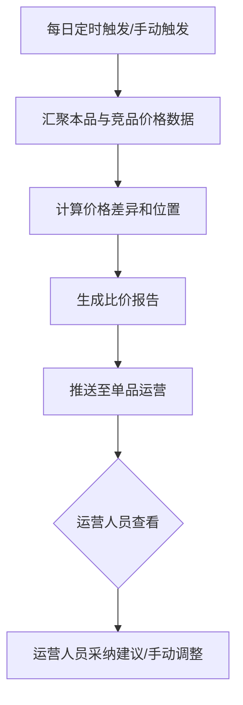

# PRD-004 产品 · 比价报告功能设计

***

## 文档信息

| 项目   | 内容                   |
| ---- | -------------------- |
| 文档编号 | PRD-004-F004-2026-001 |
| 文档版本 | v0.1                 |
| 产品名称 | AI市调助手与智能定价系统             |
| 所属系统 | 钉钉AI表格应用             |
| 编制日期 | 2026-06-12       |
| 编制人员 | PRD-004 编制组               |

### 修订记录

| 版本   | 修订日期           | 修订说明 | 修订人    |
| ---- | -------------- | ---- | ------ |
| v0.1 | 2026-06-12 | 初稿创建 | PRD-004 编制组 |

***

> **文档撰写规范（重要）**
>
> 1. **严格遵循模板格式**：各章节表格字段必须与模板保持一致
> 2. **聚焦业务规则**：描述业务逻辑、数据约束、权限控制等，不写技术实现细节
> 3. **减少不必要的示例**：不写JSON/XML格式的报文示例
> 4. **页面布局与交互分离**：§四仅描述页面结构，§五描述业务规则

***

## 一、功能角色矩阵说明

### 1.1 功能描述

- **功能名称：** 比价报告
- **所属模块：** 竞品价格采集
- **功能描述：** 自动汇总竞品价格数据，生成竞品比价报告，展示本品与竞品的价格对比、价格位置分析和调价建议，报告可推送至运营人员。

### 1.2 角色权限总览

| 角色      | 功能权限                        | 数据权限   |
| ------- | --------------------------- | ------ |
| 市调人员 | 查看本人负责商品的比价报告             | 本人录入数据 |
| 单品运营 | 查看全部比价报告、生成报告、推送报告、导出  | 全量数据   |
| 采购人员 | 查看全部比价报告、导出               | 全量数据   |
| 管理层   | 查看全部比价报告、导出、查看报告汇总     | 全量数据   |

### 1.3 功能角色矩阵

| 功能点  | 市调人员 | 单品运营 | 采购人员 | 管理层 |
| ---- | :-----: | :-----: | :-----: | :-----: |
| 查看报告 |    是    |    是    |    是    |    是    |
| 生成报告 |    否    |    是    |    否    |    否    |
| 推送报告 |    否    |    是    |    否    |    否    |
| 导出报告 |    否    |    是    |    是    |    是    |
| 查看报告汇总 |    否    |    否    |    否    |    是    |

***

## 二、模块路径

钉钉AI表格应用 → 竞品价格采集 → 比价报告

***

## 三、状态流转与流程图

### 3.1 业务流程图



***

## 四、页面布局

### 4.1 页面清单

|  序号 | 页面名称    | 页面类型   | 描述                           |
| :-: | ------- | ------ | ---------------------------- |
|  1  | 比价报告列表 | 主页面    | 展示所有比价报告，支持查询、筛选、操作            |
|  2  | 报告详情页  | 弹窗     | 展示完整的比价报告内容，含价格对比和建议            |
|  3  | 推送确认弹窗  | 弹窗     | 确认推送比价报告给指定人员           |

***

### 4.2 比价报告列表布局

```
┌─────────────────────────────────────────────────────────────────┐
│  比价报告                                                      │
├─────────────────────────────────────────────────────────────────┤
│  查询条件区                                                       │
│  ┌─────────────┐ ┌─────────────┐ ┌──────┐ ┌──────┐             │
│  │ 报告日期   │ │ 商品名称   │ │ 查询 │ │ 重置 │             │
│  │ [日期选择  ]│ │ [输入框    ]│ │ 按钮 │ │ 按钮 │             │
│  └─────────────┘ └─────────────┘ └──────┘ └──────┘             │
├─────────────────────────────────────────────────────────────────┤
│  工具栏区    [+生成报告]                        [导出]          │
├─────────────────────────────────────────────────────────────────┤
│  列表数据区                                                       │
│  ┌────┬─────┬──────────┬──────────┬──────────┬────────┐      │
│  │ 序号 │ 报告日期 │ 商品名称  │ 竞对数量  │ 价格位置 │ 操作   │      │
│  ├────┼─────┼──────────┼──────────┼──────────┼────────┤      │
│  │  1  │ 06-12 │ 红颜草莓  │ 3家     │ 偏高    │ [查看] [推送]│      │
│  │  2  │ 06-12 │ 进口蓝莓  │ 2家     │ 持平    │ [查看] [推送]│      │
│  └────┴─────┴──────────┴──────────┴──────────┴────────┘      │
├─────────────────────────────────────────────────────────────────┤
│  分页区    [< 1 2 3 ... 10 >]  [每页 10 ▼]  共 95 条            │
└─────────────────────────────────────────────────────────────────┘
```

### 4.2.1 查询条件区

| 组件名称    | 组件类型 | 位置 | 提示语            | 说明        |
| ------- | ---- | -- | -------------- | --------- |
| 报告日期    | 日期选择 | 居左 | 请选择报告日期 | 精确查询 |
| 商品名称    | 输入框  | 居左 | 请输入商品名称 | 模糊查询 |
| 价格位置    | 下拉框  | 居左 | 请选择价格位置 | 精确查询 |
| 查询      | 按钮   | 居右 | —              | 主按钮       |
| 重置      | 按钮   | 居右 | —              | 次按钮       |

### 4.2.2 工具栏区

| 组件名称 | 组件类型 | 位置 | 提示语 | 说明          |
| ---- | ---- | -- | --- | ----------- |
| 生成报告 | 按钮   | 居左 | —   | 触发生成新报告 |
| 导出   | 按钮   | 居右 | —   | —           |

### 4.2.3 列表展示区

| 字段      | 组件类型 | 位置 | 说明                |
| ------- | ---- | -- | ----------------- |
| 序号      | 文本   | 居中 | —                 |
| 报告日期    | 文本   | 居左 | 格式：MM-DD        |
| 商品名称    | 文本   | 居左 | —                 |
| 竞对数量    | 文本   | 居中 | 参与比价的竞对品牌数     |
| 价格位置    | 标签   | 居中 | 偏高/持平/偏低 badge样式 |
| 建议价格    | 文本   | 居左 | 格式：¥XX.XX        |
| 操作      | 按钮组  | 居中 | \[查看] \[推送] |

***

### 4.3 报告详情页布局

```
┌─────────────────────────────────────────────────────────────────┐
│  比价报告详情 - 红颜草莓 300g/盒                    [X]          │
├─────────────────────────────────────────────────────────────────┤
│  报告日期：2026-06-12                                           │
│                                                                 │
│  ┌─────────────────────────────────────────────────────────┐    │
│  │  价格竞争力分析                                           │    │
│  │  ┌──────────┬──────────┬──────────┬──────────┐          │    │
│  │  │ 竞对品牌  │ 价格     │ 差异     │ 差异%    │          │    │
│  │  ├──────────┼──────────┼──────────┼──────────┤          │    │
│  │  │ 百果园   │ ¥25.9   │ -¥4.0   │ -13.4%  │          │    │
│  │  │ 鲜丰水果  │ ¥27.9   │ -¥2.0   │ -6.7%   │          │    │
│  │  │ 叮咚买菜  │ ¥24.9   │ -¥5.0   │ -16.7%  │          │    │
│  │  ├──────────┼──────────┼──────────┼──────────┤          │    │
│  │  │ 竞品均价  │ ¥26.9   │ -¥3.0   │ -10.0%  │          │    │
│  │  │ 本品售价  │ ¥29.9   │ —       │ —       │          │    │
│  │  └──────────┴──────────┴──────────┴──────────┘          │    │
│  └─────────────────────────────────────────────────────────┘    │
│                                                                 │
│  ┌─────────────────────────────────────────────────────────┐    │
│  │  定价建议                                                 │    │
│  │  建议调至 ¥26.9，与竞品均价持平                             │    │
│  │  理由：本品价格高于竞品均价10%，存在价格竞争力风险            │    │
│  └─────────────────────────────────────────────────────────┘    │
│                                                                 │
│  ┌─────────────────────────────────────────────────────────┐    │
│  │  风险提示                                                 │    │
│  │  ⚠ 叮咚买菜近30天降价8.5%，需关注价格动态                  │    │
│  └─────────────────────────────────────────────────────────┘    │
│                                                                 │
│                                    [推送]  [导出]  [关闭]       │
└─────────────────────────────────────────────────────────────────┘
```

### 4.3.1 报告详情字段说明

| 字段      | 组件类型 | 位置   | 说明         |
| ------- | ---- | ---- | ---------- |
| 报告日期   | 文本   | 顶部 | 只读         |
| 价格对比表 | 表格   | 中部 | 只读，展示各竞对价格差异 |
| 竞品均价   | 文本   | 表格内 | 只读，计算值    |
| 本品售价   | 文本   | 表格内 | 只读         |
| 定价建议   | 文本   | 下部 | 只读，AI生成    |
| 风险提示   | 文本   | 下部 | 只读，AI生成    |

***

### 4.4 推送确认弹窗布局

```
┌─────────────────────────────────────────────────┐
│  推送比价报告                              [X]  │
├─────────────────────────────────────────────────┤
│  推送至：    [人员选择器 ▼]                       │
│  备注：      [输入框                            ]  │
│                                                 │
│                              [取消]  [确定]      │
└─────────────────────────────────────────────────┘
```

### 4.4.1 推送字段说明

| 字段      | 组件类型 | 位置   | 提示语            | 说明        |
| ------- | ---- | ---- | -------------- | --------- |
| 推送至    | 人员选择器 | 独占一行 | 请选择推送对象 | 必填\*，支持多选 |
| 备注      | 输入框  | 独占一行 | 请输入备注 | 可选，0-200字符 |

***

## 五、页面交互说明

### 5.1 比价报告列表交互说明

#### 5.1.1 字段交互规则

| 字段        | 类型  | 是否必填 | 约束规则                  | 展示规则 | 举例或枚举       |
| --------- | --- | :--: | --------------------- | ---- | ----------- |
| 报告日期    | 日期选择 |   否  | 精确查询 | 明文   | 2026-06-12 |
| 商品名称    | 输入框 |   否  | 模糊查询；最大50字符  | 明文   | 红颜草莓 |
| 价格位置    | 下拉框 |   否  | 精确查询 | 明文   | 偏高/持平/偏低 |

#### 5.1.2 操作交互逻辑

| 操作类型 | 触发操作     | 交互可用性       | 正向输出                                        | 异常场景                                           | 异常处理             | 日志级别 |
| ---- | -------- | ----------- | ------------------------------------------- | ---------------------------------------------- | ---------------- | ---- |
| 查询   | 点击"查询"   | 始终可用        | 按条件筛选，结果在列表中展示，分页同步更新                       | — | — | 接口级  |
| 重置   | 点击"重置"   | 始终可用        | 清空所有筛选条件，恢复初始查询状态                           | 无                                              | 无                | 接口级  |
| 生成报告 | 点击"生成报告" | 始终可用        | 触发生成任务，Toast提示"报告生成中"，完成后刷新列表              | 数据不足 | Toast提示"数据不足，无法生成报告" | 接口级  |
| 查看   | 点击"查看"   | 始终可用        | 打开报告详情页，展示完整比价分析                             | 无                                              | 无                | 接口级  |
| 推送   | 点击"推送"   | 始终可用        | 打开推送确认弹窗                                    | 无                                              | 无                | 接口级  |
| 导出   | 点击"导出"   | 始终可用        | 导出Excel文件                                   | 无数据                                            | Toast提示"暂无数据可导出" | 接口级  |

> **导出文件命名规范**：
> - 格式：`比价报告_{YYYYMMDD}_{HHMMSS}.xlsx`
> - 示例：`比价报告_20260612_103045.xlsx`

***

### 5.2 报告详情页交互说明

#### 5.2.1 操作交互逻辑

| 操作类型 | 触发操作      | 交互可用性       | 正向输出                    | 异常场景 | 异常处理               | 日志级别 |
| ---- | --------- | ----------- | ----------------------- | ---- | ------------------ | ---- |
| 推送   | 点击"推送"按钮  | 始终可用        | 打开推送确认弹窗                | 无    | 无                  | 不记录  |
| 导出   | 点击"导出"按钮  | 始终可用        | 导出当前报告为Excel文件          | 导出失败 | Toast提示"导出失败，请重试" | 接口级  |
| 关闭   | 点击"关闭"按钮  | 始终可用        | 关闭详情页，返回列表               | 无    | 无                  | 不记录  |

***

### 5.3 推送确认弹窗交互说明

#### 5.3.1 操作交互逻辑

| 操作类型 | 触发操作      | 交互可用性       | 正向输出                    | 异常场景 | 异常处理               | 日志级别 |
| ---- | --------- | ----------- | ----------------------- | ---- | ------------------ | ---- |
| 确定推送 | 点击"确定"按钮  | 必填字段合规后可用 | 推送成功，弹窗关闭，Toast提示"推送成功" | 推送失败 | Toast提示"推送失败，请重试" | 接口级  |
| 取消   | 点击"取消"按钮  | 始终可用        | 关闭弹窗，不做任何操作            | 无    | 无                  | 不记录  |

#### 5.3.2 弹窗说明

| 规则项  | 说明                                   |
| ---- | ------------------------------------ |
| 打开方式 | 点击列表或详情页的"推送"按钮                    |
| 推送渠道 | 通过钉钉机器人消息推送                        |
| 推送内容 | 报告摘要（商品名、价格位置、建议价格）+ 详情链接           |

***

## 六、错误处理规范

### 6.1 错误处理

| 场景      | 触发条件                         | 提示文案                    | 处理方式                       |
| ------- | ---------------------------- | ----------------------- | -------------------------- |
| 数据不足 | 竞品价格数据少于2条               | 数据不足，至少需要2条竞品价格数据才能生成报告 | Toast 提示，阻断生成              |
| 生成失败 | 报告生成过程中发生异常             | 报告生成失败，请重试              | Toast 提示                   |
| 推送失败 | 钉钉消息发送失败                 | 推送失败，请重试              | Toast 提示                   |
| 导出失败 | 文件导出异常                     | 导出失败，请重试              | Toast 提示                   |

***

## 七、非功能性需求

### 7.1 合规与安全要求

| 适用规范       | 内容摘要              | 本模块特有说明                    |
| ---------- | ----------------- | -------------------------- |
| 操作日志   | 字段级日志、保留期限、不可篡改   | 覆盖操作：生成、推送、导出 |

### 7.2 性能需求

| 需求项       | 指标要求          | 说明            |
| --------- | ------------- | ------------- |
| 报告生成时间  | ≤ 10s         | 单份报告生成 |
| 列表查询响应时间  | ≤ 2s          | 正常网络条件下   |
| 导出响应时间    | ≤ 5s          | —             |
| 页面首屏加载时间  | ≤ 3s          | —             |
| 并发用户数     | 50           | —       |

***

## 八、特殊说明

### 8.1 价格位置判定规则

1. **偏高**：本品价格 > 竞品均价 × 1.1
2. **持平**：竞品均价 × 0.9 ≤ 本品价格 ≤ 竞品均价 × 1.1
3. **偏低**：本品价格 < 竞品均价 × 0.9

### 8.2 报告生成触发方式

1. **自动触发**：每日 7:00 自动为所有有数据的商品生成比价报告
2. **手动触发**：运营人员可手动点击"生成报告"按钮触发
3. **事件触发**：当竞品价格数据更新后，自动重新生成该商品的比价报告

### 8.3 推送规则

1. 报告通过钉钉机器人推送给指定人员
2. 推送内容包含报告摘要和详情链接
3. 同一份报告对同一人员不重复推送

***

## 九、数据字典

### 9.1 字典项定义

**价格位置（pricePosition）**

| 枚举值（code） | 显示文本（label） | 说明     |
| :-------: | ----------- | ------ |
|     HIGH     | 偏高     | 本品价格高于竞品均价10%以上 |
|     EQUAL     | 持平     | 本品价格在竞品均价±10%范围内 |
|     LOW     | 偏低     | 本品价格低于竞品均价10%以上 |

**报告状态（reportStatus）**

| 枚举值（code） | 显示文本（label） | 说明     |
| :-------: | ----------- | ------ |
|     GENERATING     | 生成中     | 报告正在生成 |
|     COMPLETED     | 已完成     | 报告生成完成 |
|     FAILED     | 生成失败     | 报告生成失败 |

### 9.2 下拉框数据来源说明

| 字段名     | 数据来源类型 | 来源说明                        |
| ------- | ------ | --------------------------- |
| 商品名称 | 接口动态加载 | 来源：竞品商品管理模块 |
| 价格位置 | 字典项    | 参见 9.1 pricePosition |
| 推送至 | 接口动态加载 | 来源：钉钉用户列表 |

***

## 十、外部系统接口说明

### 10.1 接口清单

| 接口名称    | 功能描述           | 交互方向     | 依赖系统     | 数据流向                    |
| ------- | -------------- | -------- | -------- | ----------------------- |
| 比价报告生成接口 | 根据竞品价格数据生成比价报告 | 被调用 | 数据结构化存储模块 | 本模块→数据结构化存储模块 |
| 钉钉消息推送接口 | 通过钉钉机器人推送报告摘要 | 调用 | 钉钉开放平台 | 本系统→钉钉开放平台 |

### 10.2 接口详细说明

**比价报告生成接口**

| 规则项  | 说明                    |
| ---- | --------------------- |
| 触发时机 | 每日定时触发或手动触发           |
| 请求条件 | 商品ID |
| 成功处理 | 生成比价报告，包含价格对比、定价建议、风险提示 |
| 失败处理 | 返回错误信息，标记报告状态为"生成失败" |

**钉钉消息推送接口**

| 规则项  | 说明                    |
| ---- | --------------------- |
| 触发时机 | 用户确认推送后调用           |
| 请求条件 | 接收人钉钉ID + 报告摘要内容 |
| 成功处理 | 消息推送成功，记录推送日志 |
| 失败处理 | 返回错误信息，提示用户重试 |

***

*文档结束*
