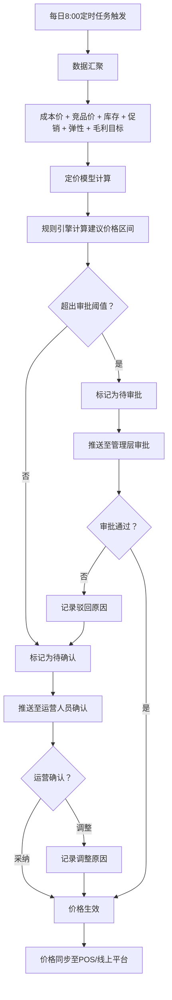
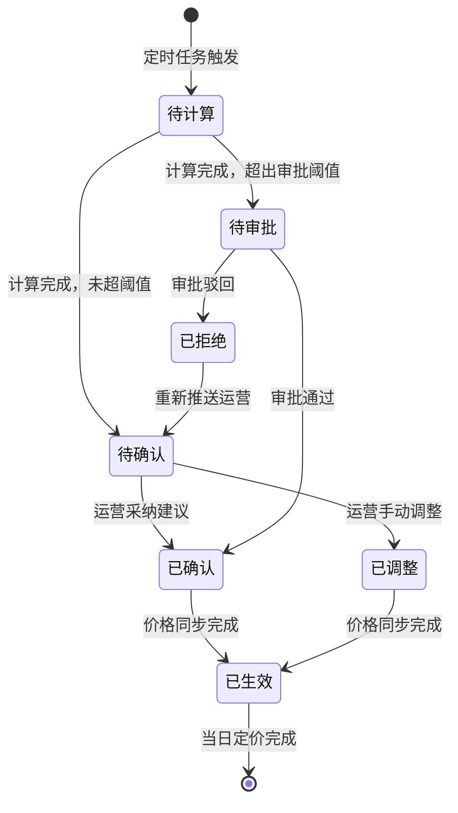
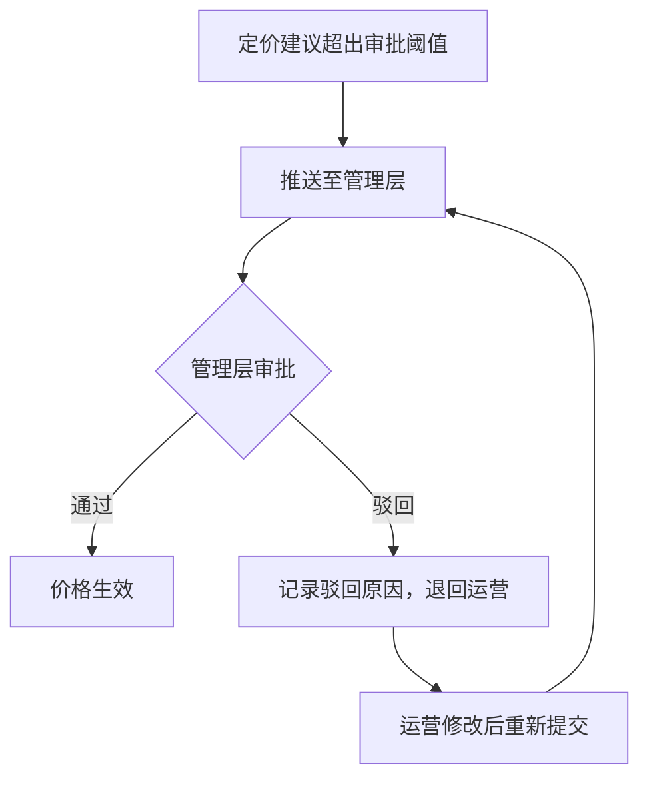

# PRD-004 产品 · 智能定价建议功能设计

***

## 文档信息

| 项目   | 内容                   |
| ---- | -------------------- |
| 文档编号 | PRD-004-F005-2026-001 |
| 文档版本 | v0.1                 |
| 产品名称 | AI市调助手与智能定价系统             |
| 所属系统 | 钉钉AI表格应用             |
| 编制日期 | 2026-06-12       |
| 编制人员 | PRD-004 编制组               |

### 修订记录

| 版本   | 修订日期           | 修订说明 | 修订人    |
| ---- | -------------- | ---- | ------ |
| v0.1 | 2026-06-12 | 初稿创建 | PRD-004 编制组 |

***

> **文档撰写规范（重要）**
>
> 1. **严格遵循模板格式**：各章节表格字段必须与模板保持一致
> 2. **聚焦业务规则**：描述业务逻辑、数据约束、权限控制等，不写技术实现细节
> 3. **减少不必要的示例**：不写JSON/XML格式的报文示例
> 4. **页面布局与交互分离**：§四仅描述页面结构，§五描述业务规则

***

## 一、功能角色矩阵说明

### 1.1 功能描述

- **功能名称：** 智能定价建议
- **所属模块：** 智能定价
- **功能描述：** 基于成本价、竞品价格、库存周转压力、价格弹性、促销计划等多维因子，通过规则引擎自动计算并推荐最优零售价区间，每日 8:00 前推送至运营人员审核。

### 1.2 角色权限总览

| 角色      | 功能权限                        | 数据权限   |
| ------- | --------------------------- | ------ |
| 单品运营 | 查看定价建议、确认/拒绝建议、调整价格、查看因子详情 | 全量数据   |
| 采购人员 | 查看定价建议、查看成本价对比           | 全量数据   |
| 管理层   | 查看定价建议、查看定价报表、审批超限价格    | 全量数据   |

### 1.3 功能角色矩阵

| 功能点  | 单品运营 | 采购人员 | 管理层 |
| ---- | :-----: | :-----: | :-----: |
| 查看定价建议 |    是    |    是    |    是    |
| 确认/拒绝建议 |    是    |    否    |    否    |
| 调整价格 |    是    |    否    |    否    |
| 查看因子详情 |    是    |    是    |    是    |
| 审批超限价格 |    否    |    否    |    是    |
| 查看定价报表 |    否    |    否    |    是    |

***

## 二、模块路径

钉钉AI表格应用 → 智能定价 → 定价建议

***

## 三、状态流转与流程图

### 3.1 业务流程图



### 3.2 状态流转图



### 3.3 审批流程图



***

## 四、页面布局

### 4.1 页面清单

|  序号 | 页面名称    | 页面类型   | 描述                           |
| :-: | ------- | ------ | ---------------------------- |
|  1  | 定价建议列表 | 主页面    | 展示所有定价建议，支持查询、筛选、操作            |
|  2  | 定价详情页  | 弹窗     | 展示定价建议详情，含因子明细和计算过程            |
|  3  | 价格确认弹窗  | 弹窗     | 运营人员确认或调整价格              |
|  4  | 价格审批弹窗  | 弹窗     | 管理层审批超限价格               |

***

### 4.2 定价建议列表布局

```
┌─────────────────────────────────────────────────────────────────┐
│  智能定价建议                                                   │
├─────────────────────────────────────────────────────────────────┤
│  查询条件区                                                       │
│  ┌─────────────┐ ┌─────────────┐ ┌──────┐ ┌──────┐             │
│  │ 建议日期   │ │ 商品名称   │ │ 查询 │ │ 重置 │             │
│  │ [日期选择  ]│ │ [输入框    ]│ │ 按钮 │ │ 按钮 │             │
│  └─────────────┘ └─────────────┘ └──────┘ └──────┘             │
│  状态筛选：  ○ 全部  ○ 待确认  ○ 待审批  ○ 已确认  ○ 已拒绝      │
├─────────────────────────────────────────────────────────────────┤
│  工具栏区                                        [导出]          │
├─────────────────────────────────────────────────────────────────┤
│  列表数据区                                                       │
│  ┌────┬─────┬──────────┬──────────┬──────────┬──────────┬────────┐      │
│  │ 序号 │ 建议日期 │ 商品名称  │ 当前售价  │ 建议价格  │ 状态     │ 操作   │      │
│  ├────┼─────┼──────────┼──────────┼──────────┼──────────┼────────┤      │
│  │  1  │ 06-12 │ 红颜草莓  │ ¥29.9   │ ¥27.9   │ 待确认  │ [详情] [确认]│      │
│  │  2  │ 06-12 │ 进口蓝莓  │ ¥39.9   │ ¥35.9   │ 待审批  │ [详情]      │      │
│  └────┴─────┴──────────┴──────────┴──────────┴──────────┴────────┘      │
├─────────────────────────────────────────────────────────────────┤
│  分页区    [< 1 2 3 ... 10 >]  [每页 10 ▼]  共 95 条            │
└─────────────────────────────────────────────────────────────────┘
```

### 4.2.1 查询条件区

| 组件名称    | 组件类型 | 位置 | 提示语            | 说明        |
| ------- | ---- | -- | -------------- | --------- |
| 建议日期    | 日期选择 | 居左 | 请选择建议日期 | 精确查询 |
| 商品名称    | 输入框  | 居左 | 请输入商品名称 | 模糊查询 |
| 状态筛选    | 单选按钮组 | 居左 | — | 全部/待确认/待审批/已确认/已拒绝 |
| 查询      | 按钮   | 居右 | —              | 主按钮       |
| 重置      | 按钮   | 居右 | —              | 次按钮       |

### 4.2.2 工具栏区

| 组件名称 | 组件类型 | 位置 | 提示语 | 说明          |
| ---- | ---- | -- | --- | ----------- |
| 导出   | 按钮   | 居右 | —   | —           |

### 4.2.3 列表展示区

| 字段      | 组件类型 | 位置 | 说明                |
| ------- | ---- | -- | ----------------- |
| 序号      | 文本   | 居中 | —                 |
| 建议日期    | 文本   | 居左 | 格式：MM-DD        |
| 商品名称    | 文本   | 居左 | —                 |
| 成本价      | 文本   | 居左 | 格式：¥XX.XX        |
| 竞品均价    | 文本   | 居左 | 格式：¥XX.XX        |
| 当前售价    | 文本   | 居左 | 格式：¥XX.XX        |
| 建议价格    | 文本   | 居左 | 格式：¥XX.XX，加粗高亮 |
| 建议区间    | 文本   | 居左 | 格式：¥XX.XX ~ ¥XX.XX |
| 预期毛利率    | 文本   | 居中 | 百分比格式           |
| 状态      | 标签   | 居中 | badge样式           |
| 操作      | 按钮组  | 居中 | \[详情] \[确认/审批] |

***

### 4.3 定价详情页布局

```
┌─────────────────────────────────────────────────────────────────┐
│  定价建议详情 - 红颜草莓 300g/盒                    [X]          │
├─────────────────────────────────────────────────────────────────┤
│  建议日期：2026-06-12    状态：待确认                               │
│                                                                 │
│  ┌─────────────────────────────────────────────────────────┐    │
│  │  定价因子明细                                             │    │
│  │  ┌──────────┬──────────┬──────────┬──────────┐          │    │
│  │  │ 因子     │ 权重     │ 值       │ 影响     │          │    │
│  │  ├──────────┼──────────┼──────────┼──────────┤          │    │
│  │  │ 成本价   │ 40%     │ ¥18.0   │ —       │          │    │
│  │  │ 竞品价格  │ 25%     │ ¥26.9   │ ↓降价压力 │          │    │
│  │  │ 库存周转  │ 15%     │ 4天     │ 正常     │          │    │
│  │  │ 价格弹性  │ 10%     │ -1.2    │ 弹性高   │          │    │
│  │  │ 促销计划  │ 10%     │ 无      │ —       │          │    │
│  │  └──────────┴──────────┴──────────┴──────────┘          │    │
│  └─────────────────────────────────────────────────────────┘    │
│                                                                 │
│  ┌─────────────────────────────────────────────────────────┐    │
│  │  定价计算过程                                             │    │
│  │  建议售价 = 成本价 × (1 + 目标毛利率) × 竞争系数 × 库存系数  │    │
│  │  建议售价 = 18.0 × 1.35 × 0.95 × 1.0 = ¥23.1           │    │
│  │  建议区间 = [¥25.9, ¥27.9, ¥29.9]                        │    │
│  │  预期毛利率 = 35.5%                                      │    │
│  └─────────────────────────────────────────────────────────┘    │
│                                                                 │
│  ┌─────────────────────────────────────────────────────────┐    │
│  │  风险提示                                                 │    │
│  │  ⚠ 竞品均价低于本品当前售价10%，建议适当降价               │    │
│  └─────────────────────────────────────────────────────────┘    │
│                                                                 │
│                                    [确认]  [调整]  [拒绝]       │
└─────────────────────────────────────────────────────────────────┘
```

### 4.3.1 详情字段说明

| 字段      | 组件类型 | 位置   | 说明         |
| ------- | ---- | ---- | ---------- |
| 建议日期   | 文本   | 顶部 | 只读         |
| 状态      | 标签   | 顶部 | 只读         |
| 定价因子表 | 表格   | 中部 | 只读，展示各因子权重和值 |
| 计算过程   | 文本   | 中部 | 只读，展示公式和计算步骤 |
| 建议区间   | 文本   | 中部 | 只读，[最低价, 建议价, 最高价] |
| 预期毛利率   | 文本   | 中部 | 只读         |
| 风险提示   | 文本   | 下部 | 只读，AI生成    |

***

### 4.4 价格确认弹窗布局

```
┌─────────────────────────────────────────────────┐
│  确认定价建议                              [X]  │
├─────────────────────────────────────────────────┤
│  商品名称：  红颜草莓 300g/盒                     │
│  建议价格：  ¥27.9                              │
│  建议区间：  ¥25.9 ~ ¥29.9                      │
│  确认价格：  [输入框                            ]  │
│  调整原因：  [输入框                            ]  │
│                                                 │
│                              [取消]  [确定]      │
└─────────────────────────────────────────────────┘
```

### 4.4.1 确认弹窗字段说明

| 字段      | 组件类型 | 位置   | 提示语            | 说明        |
| ------- | ---- | ---- | -------------- | --------- |
| 商品名称   | 文本   | 独占一行 | —              | 只读         |
| 建议价格   | 文本   | 独占一行 | —              | 只读         |
| 建议区间   | 文本   | 独占一行 | —              | 只读         |
| 确认价格   | 输入框  | 独占一行 | 请输入确认价格 | 必填\*，默认填入建议价格 |
| 调整原因   | 输入框  | 独占一行 | 请输入调整原因 | 当确认价格≠建议价格时必填 |

***

### 4.5 价格审批弹窗布局

```
┌─────────────────────────────────────────────────┐
│  审批定价建议                              [X]  │
├─────────────────────────────────────────────────┤
│  商品名称：  进口蓝莓 125g/盒                     │
│  建议价格：  ¥35.9                              │
│  建议区间：  ¥33.9 ~ ¥39.9                      │
│  当前售价：  ¥39.9                              │
│  审批意见：  [输入框                            ]  │
│                                                 │
│                              [驳回]  [通过]      │
└─────────────────────────────────────────────────┘
```

### 4.5.1 审批弹窗字段说明

| 字段      | 组件类型 | 位置   | 提示语            | 说明        |
| ------- | ---- | ---- | -------------- | --------- |
| 商品名称   | 文本   | 独占一行 | —              | 只读         |
| 建议价格   | 文本   | 独占一行 | —              | 只读         |
| 建议区间   | 文本   | 独占一行 | —              | 只读         |
| 当前售价   | 文本   | 独占一行 | —              | 只读         |
| 审批意见   | 输入框  | 独占一行 | 请输入审批意见 | 必填\* |

***

## 五、页面交互说明

### 5.1 定价建议列表交互说明

#### 5.1.1 字段交互规则

| 字段        | 类型  | 是否必填 | 约束规则                  | 展示规则 | 举例或枚举       |
| --------- | --- | :--: | --------------------- | ---- | ----------- |
| 建议日期    | 日期选择 |   否  | 精确查询 | 明文   | 2026-06-12 |
| 商品名称    | 输入框 |   否  | 模糊查询；最大50字符  | 明文   | 红颜草莓 |
| 状态筛选    | 单选按钮 |   否  | 精确查询 | 明文   | 待确认/待审批/已确认/已拒绝 |

#### 5.1.2 操作交互逻辑

| 操作类型 | 触发操作     | 交互可用性       | 正向输出                                        | 异常场景                                           | 异常处理             | 日志级别 |
| ---- | -------- | ----------- | ------------------------------------------- | ---------------------------------------------- | ---------------- | ---- |
| 查询   | 点击"查询"   | 始终可用        | 按条件筛选，结果在列表中展示，分页同步更新                       | — | — | 接口级  |
| 重置   | 点击"重置"   | 始终可用        | 清空所有筛选条件，恢复初始查询状态                           | 无                                              | 无                | 接口级  |
| 详情   | 点击"详情"   | 始终可用        | 打开定价详情页，展示因子明细和计算过程                        | 无                                              | 无                | 接口级  |
| 确认   | 点击"确认"   | 状态为待确认时可用 | 打开价格确认弹窗                                | — | — | 接口级  |
| 导出   | 点击"导出"   | 始终可用        | 导出Excel文件                                   | 无数据                                            | Toast提示"暂无数据可导出" | 接口级  |

> **导出文件命名规范**：
> - 格式：`定价建议_{YYYYMMDD}_{HHMMSS}.xlsx`
> - 示例：`定价建议_20260612_103045.xlsx`

***

### 5.2 定价详情页交互说明

#### 5.2.1 操作交互逻辑

| 操作类型 | 触发操作      | 交互可用性       | 正向输出                    | 异常场景 | 异常处理               | 日志级别 |
| ---- | --------- | ----------- | ----------------------- | ---- | ------------------ | ---- |
| 确认   | 点击"确认"按钮  | 状态为待确认时可用 | 打开价格确认弹窗                | — | — | 不记录  |
| 调整   | 点击"调整"按钮  | 状态为待确认时可用 | 打开价格确认弹窗（可修改价格）       | — | — | 不记录  |
| 拒绝   | 点击"拒绝"按钮  | 状态为待确认时可用 | 弹出确认弹窗，确认后状态变为"已拒绝"   | — | Toast提示"已拒绝该建议" | 接口级  |
| 关闭   | 点击"关闭"按钮  | 始终可用        | 关闭详情页，返回列表               | 无    | 无                  | 不记录  |

***

### 5.3 价格确认弹窗交互说明

#### 5.3.1 字段交互规则

| 字段            | 类型 | 是否必填 | 约束规则                       | 展示规则                | 举例或枚举       |
| ------------- | -- | :--: | -------------------------- | ------------------- | ----------- |
| 确认价格       | 输入框 |   是  | 正数，小数点后两位，大于0 | 默认填入建议价格 | 27.90 |
| 调整原因       | 输入框 |   条件必填 | 当确认价格≠建议价格时必填，0-500字符 | 明文 | 促销策略调整 |

#### 5.3.2 操作交互逻辑

| 操作类型 | 触发操作      | 交互可用性       | 正向输出                    | 异常场景 | 异常处理               | 日志级别 |
| ---- | --------- | ----------- | ----------------------- | ---- | ------------------ | ---- |
| 确定保存 | 点击"确定"按钮  | 必填字段合规后可用 | 弹窗关闭，状态变为"已确认"，触发价格同步 | 保存失败 | Toast提示"保存失败，请重试！" | 接口级  |
| 取消   | 点击"取消"按钮  | 始终可用        | 关闭弹窗，不保存任何数据            | 无    | 无                  | 不记录  |

#### 5.3.3 弹窗说明

| 规则项  | 说明                                   |
| ---- | ------------------------------------ |
| 打开方式 | 从详情页点击"确认"或"调整"按钮                    |
| 确认价格 | 默认填入建议价格；当确认价格≠建议价格时，调整原因必填 |
| 保存规则 | 校验通过后更新定价建议状态为"已确认"，触发价格同步至POS/线上平台 |

***

### 5.4 价格审批弹窗交互说明

#### 5.4.1 操作交互逻辑

| 操作类型 | 触发操作      | 交互可用性       | 正向输出                    | 异常场景 | 异常处理               | 日志级别 |
| ---- | --------- | ----------- | ----------------------- | ---- | ------------------ | ---- |
| 通过   | 点击"通过"按钮  | 始终可用        | 状态变为"已确认"，触发价格同步       | 审批失败 | Toast提示"审批失败，请重试" | 接口级  |
| 驳回   | 点击"驳回"按钮  | 始终可用        | 状态变为"已拒绝"，退回运营重新处理     | 审批失败 | Toast提示"审批失败，请重试" | 接口级  |

#### 5.4.2 弹窗说明

| 规则项  | 说明                                   |
| ---- | ------------------------------------ |
| 打开方式 | 管理层从列表或详情页点击"审批"按钮                 |
| 审批阈值 | 建议价格与当前售价偏差超过20%时触发审批流程            |
| 通过操作 | 更新状态为"已确认"，触发价格同步                  |
| 驳回操作 | 更新状态为"已拒绝"，记录审批意见，退回运营人员            |

***

## 六、错误处理规范

### 6.1 表单校验错误

| 字段      | 为空时错误信息     | 格式错误时信息           |
| ------- | ----------- | ----------------- |
| 确认价格   | 确认价格不能为空 | 价格格式不正确，应为正数     |
| 调整原因   | 请填写调整原因  | 调整原因长度不能超过500字符 |
| 审批意见   | 请填写审批意见  | 审批意见长度不能超过500字符 |

### 6.2 操作错误

| 场景      | 触发条件                         | 提示文案                    | 处理方式                       |
| ------- | ---------------------------- | ----------------------- | -------------------------- |
| 价格同步失败 | POS/线上平台接口调用失败              | 价格同步失败，请手动同步至POS系统    | Toast 提示，记录日志              |
| 数据缺失 | 缺少成本价或竞品价格数据               | 数据缺失，无法生成定价建议         | 标记该商品为"数据缺失"，跳过      |
| 网络/服务异常 | 接口请求失败                       | 接口异常，请稍候再试              | Toast 提示                   |

***

## 七、非功能性需求

### 7.1 合规与安全要求

| 适用规范       | 内容摘要              | 本模块特有说明                    |
| ---------- | ----------------- | -------------------------- |
| 操作日志   | 字段级日志、保留期限、不可篡改   | 覆盖操作：确认/拒绝/审批/调整/同步 |
| 审批权限   | 超限价格需管理层审批       | 偏差超过20%的价格建议需审批 |

### 7.2 性能需求

| 需求项       | 指标要求          | 说明            |
| --------- | ------------- | ------------- |
| 定价计算时间  | ≤ 30s         | 全量商品定价计算 |
| 列表查询响应时间  | ≤ 2s          | 正常网络条件下   |
| 价格同步延迟   | ≤ 5min        | 确认后同步至POS/线上平台 |
| 页面首屏加载时间  | ≤ 3s          | —             |
| 并发用户数     | 50           | —       |

***

## 八、特殊说明

### 8.1 定价公式

```
建议售价 = 成本价 × (1 + 目标毛利率) × 竞争系数 × 库存系数

其中：
- 目标毛利率 = 品类默认值 + 人工调整
- 竞争系数 = f(本品价格/竞品价格)
  - 竞品价格 < 本品价格 × 0.9 → 系数 = 0.95（降价竞争）
  - 竞品价格 > 本品价格 × 1.1 → 系数 = 1.05（适度提价）
  - 其他 → 系数 = 1.0
- 库存系数 = f(库存周转天数)
  - 周转天数 > 7 → 系数 = 0.95（降价促销）
  - 周转天数 < 2 → 系数 = 1.05（适度提价）
  - 其他 → 系数 = 1.0
```

### 8.2 审批阈值规则

1. 建议价格与当前售价偏差超过20%时，触发审批流程
2. 审批流程：推送至管理层 → 管理层审批 → 通过/驳回
3. 驳回后退回运营人员重新处理

### 8.3 价格同步规则

1. 价格确认后自动同步至POS系统和线上平台
2. 同步延迟不超过5分钟
3. 同步失败时记录日志，支持手动重试

### 8.4 其他特殊规则

1. 每日 8:00 前完成当日定价建议的生成和推送
2. 无历史数据的新品，参考竞品价格定价
3. 已绑定促销计划的商品，定价建议需考虑促销影响

***

## 九、数据字典

### 9.1 字典项定义

**定价建议状态（suggestionStatus）**

| 枚举值（code） | 显示文本（label） | 说明     |
| :-------: | ----------- | ------ |
|     PENDING     | 待确认     | 等待运营确认 |
|     APPROVING     | 待审批     | 等待管理层审批 |
|     CONFIRMED     | 已确认     | 运营已确认或审批通过 |
|     REJECTED     | 已拒绝     | 运营拒绝或审批驳回 |
|     EFFECTED     | 已生效     | 价格已同步 |

**定价因子（pricingFactor）**

| 枚举值（code） | 显示文本（label） | 权重     |
| :-------: | ----------- | ------ |
|     COST     | 成本价     | 40% |
|     COMPETITOR     | 竞品价格     | 25% |
|     INVENTORY     | 库存周转     | 15% |
|     ELASTICITY     | 价格弹性     | 10% |
|     PROMOTION     | 促销计划     | 10% |

### 9.2 下拉框数据来源说明

| 字段名     | 数据来源类型 | 来源说明                        |
| ------- | ------ | --------------------------- |
| 商品名称 | 接口动态加载 | 来源：本品商品管理模块 |
| 状态筛选 | 字典项    | 参见 9.1 suggestionStatus |

***

## 十、外部系统接口说明

### 10.1 接口清单

| 接口名称    | 功能描述           | 交互方向     | 依赖系统     | 数据流向                    |
| ------- | -------------- | -------- | -------- | ----------------------- |
| 成本价查询接口 | 获取商品当日成本价 | 调用 | 李富美系统（供应链） | 李富美系统→本系统 |
| 库存数据接口 | 获取商品库存周转天数 | 调用 | 库存系统 | 库存系统→本系统 |
| 销售数据接口 | 获取历史销售数据 | 调用 | 销售系统 | 销售系统→本系统 |
| 促销计划接口 | 获取营销日历数据 | 调用 | 营销系统 | 营销系统→本系统 |
| 价格同步接口 | 将确认价格同步至POS/线上平台 | 调用 | POS/线上平台 | 本系统→POS/线上平台 |

### 10.2 接口详细说明

**成本价查询接口**

| 规则项  | 说明                    |
| ---- | --------------------- |
| 触发时机 | 每日定价任务触发时调用           |
| 请求条件 | 商品ID |
| 成功处理 | 返回当日成本价（真实配送价） |
| 失败处理 | 返回错误信息，该商品跳过定价 |

**价格同步接口**

| 规则项  | 说明                    |
| ---- | --------------------- |
| 触发时机 | 价格确认后自动调用           |
| 请求条件 | 商品ID + 确认价格 |
| 成功处理 | 价格同步至POS和线上平台 |
| 失败处理 | 记录失败日志，支持手动重试 |

***

*文档结束*
