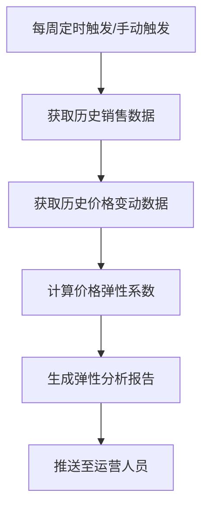

# PRD-004 产品 · 价格弹性分析功能设计

***

## 文档信息

| 项目   | 内容                   |
| ---- | -------------------- |
| 文档编号 | PRD-004-F006-2026-001 |
| 文档版本 | v0.1                 |
| 产品名称 | AI市调助手与智能定价系统             |
| 所属系统 | 钉钉AI表格应用             |
| 编制日期 | 2026-06-12       |
| 编制人员 | PRD-004 编制组               |

### 修订记录

| 版本   | 修订日期           | 修订说明 | 修订人    |
| ---- | -------------- | ---- | ------ |
| v0.1 | 2026-06-12 | 初稿创建 | PRD-004 编制组 |

***

> **文档撰写规范（重要）**
>
> 1. **严格遵循模板格式**：各章节表格字段必须与模板保持一致
> 2. **聚焦业务规则**：描述业务逻辑、数据约束、权限控制等，不写技术实现细节
> 3. **减少不必要的示例**：不写JSON/XML格式的报文示例
> 4. **页面布局与交互分离**：§四仅描述页面结构，§五描述业务规则

***

## 一、功能角色矩阵说明

### 1.1 功能描述

- **功能名称：** 价格弹性分析
- **所属模块：** 智能定价
- **功能描述：** 基于历史销售数据，分析商品价格变动对销量的影响程度，计算价格弹性系数，为定价决策提供数据支撑。

### 1.2 角色权限总览

| 角色      | 功能权限                        | 数据权限   |
| ------- | --------------------------- | ------ |
| 单品运营 | 查看弹性分析结果、触发分析、导出报告     | 全量数据   |
| 采购人员 | 查看弹性分析结果                  | 全量数据   |
| 管理层   | 查看弹性分析结果、查看弹性报表         | 全量数据   |

### 1.3 功能角色矩阵

| 功能点  | 单品运营 | 采购人员 | 管理层 |
| ---- | :-----: | :-----: | :-----: |
| 查看弹性分析结果 |    是    |    是    |    是    |
| 触发弹性分析 |    是    |    否    |    否    |
| 导出分析报告 |    是    |    否    |    是    |
| 查看弹性报表 |    否    |    否    |    是    |

***

## 二、模块路径

钉钉AI表格应用 → 智能定价 → 价格弹性分析

***

## 三、状态流转与流程图

### 3.1 业务流程图



***

## 四、页面布局

### 4.1 页面清单

|  序号 | 页面名称    | 页面类型   | 描述                           |
| :-: | ------- | ------ | ---------------------------- |
|  1  | 弹性分析列表 | 主页面    | 展示所有商品的弹性分析结果，支持查询、筛选、操作            |
|  2  | 弹性分析详情页  | 弹窗     | 展示单个商品的弹性分析详情，含弹性系数和变化趋势            |

***

### 4.2 弹性分析列表布局

```
┌─────────────────────────────────────────────────────────────────┐
│  价格弹性分析                                                   │
├─────────────────────────────────────────────────────────────────┤
│  查询条件区                                                       │
│  ┌─────────────┐ ┌─────────────┐ ┌──────┐ ┌──────┐             │
│  │ 商品名称   │ │ 分析日期   │ │ 查询 │ │ 重置 │             │
│  │ [输入框    ]│ │ [日期选择  ]│ │ 按钮 │ │ 按钮 │             │
│  └─────────────┘ └─────────────┘ └──────┘ └──────┘             │
├─────────────────────────────────────────────────────────────────┤
│  工具栏区    [+触发分析]                        [导出]          │
├─────────────────────────────────────────────────────────────────┤
│  列表数据区                                                       │
│  ┌────┬─────┬──────────┬──────────┬──────────┬────────┐      │
│  │ 序号 │ 商品名称 │ 弹性系数  │ 价格变动% │ 销量变动% │ 操作   │      │
│  ├────┼─────┼──────────┼──────────┼──────────┼────────┤      │
│  │  1  │ 红颜草莓  │ -1.2    │ +10%    │ -12%   │ [详情] │      │
│  │  2  │ 进口蓝莓  │ -0.8    │ +5%    │ -4%    │ [详情] │      │
│  └────┴─────┴──────────┴──────────┴──────────┴────────┘      │
├─────────────────────────────────────────────────────────────────┤
│  分页区    [< 1 2 3 ... 10 >]  [每页 10 ▼]  共 95 条            │
└─────────────────────────────────────────────────────────────────┘
```

### 4.2.1 查询条件区

| 组件名称    | 组件类型 | 位置 | 提示语            | 说明        |
| ------- | ---- | -- | -------------- | --------- |
| 商品名称    | 输入框  | 居左 | 请输入商品名称 | 模糊查询 |
| 分析日期    | 日期选择 | 居左 | 请选择分析日期 | 精确查询 |
| 弹性等级    | 下拉框  | 居左 | 请选择弹性等级 | 精确查询 |
| 查询      | 按钮   | 居右 | —              | 主按钮       |
| 重置      | 按钮   | 居右 | —              | 次按钮       |

### 4.2.2 工具栏区

| 组件名称 | 组件类型 | 位置 | 提示语 | 说明          |
| ---- | ---- | -- | --- | ----------- |
| 触发分析 | 按钮   | 居左 | —   | 手动触发弹性分析 |
| 导出   | 按钮   | 居右 | —   | —           |

### 4.2.3 列表展示区

| 字段      | 组件类型 | 位置 | 说明                |
| ------- | ---- | -- | ----------------- |
| 序号      | 文本   | 居中 | —                 |
| 商品名称    | 文本   | 居左 | —                 |
| 弹性系数    | 文本   | 居左 | 保留1位小数，负值红色 |
| 弹性等级    | 标签   | 居中 | 高弹性/中弹性/低弹性 badge |
| 价格变动%  | 文本   | 居中 | 百分比格式           |
| 销量变动%  | 文本   | 居中 | 百分比格式           |
| 置信度    | 文本   | 居中 | 百分比格式           |
| 操作      | 按钮组  | 居中 | \[详情] |

***

### 4.3 弹性分析详情页布局

```
┌─────────────────────────────────────────────────────────────────┐
│  弹性分析详情 - 红颜草莓 300g/盒                    [X]          │
├─────────────────────────────────────────────────────────────────┤
│  分析日期：2026-06-12    置信度：85%                               │
│                                                                 │
│  ┌─────────────────────────────────────────────────────────┐    │
│  │  弹性分析结果                                             │    │
│  │  弹性系数：-1.2（高弹性）                                  │    │
│  │  含义：价格每上涨1%，销量下降1.2%                           │    │
│  │  建议：该商品对价格敏感，定价需谨慎                          │    │
│  └─────────────────────────────────────────────────────────┘    │
│                                                                 │
│  ┌─────────────────────────────────────────────────────────┐    │
│  │  历史价格-销量变化记录                                     │    │
│  │  ┌──────────┬──────────┬──────────┬──────────┐          │    │
│  │  │ 日期     │ 价格     │ 价格变动% │ 销量变动% │          │    │
│  │  ├──────────┼──────────┼──────────┼──────────┤          │    │
│  │  │ 06-01   │ ¥25.9   │ —       │ —       │          │    │
│  │  │ 06-05   │ ¥27.9   │ +7.7%   │ -9.2%   │          │    │
│  │  │ 06-10   │ ¥29.9   │ +7.2%   │ -8.7%   │          │    │
│  │  └──────────┴──────────┴──────────┴──────────┘          │    │
│  └─────────────────────────────────────────────────────────┘    │
│                                                                 │
│                                    [导出]  [关闭]                │
└─────────────────────────────────────────────────────────────────┘
```

### 4.3.1 详情字段说明

| 字段      | 组件类型 | 位置   | 说明         |
| ------- | ---- | ---- | ---------- |
| 分析日期   | 文本   | 顶部 | 只读         |
| 置信度    | 文本   | 顶部 | 只读         |
| 弹性系数   | 文本   | 中部 | 只读         |
| 弹性等级   | 标签   | 中部 | 只读         |
| 弹性含义   | 文本   | 中部 | 只读，文字说明    |
| 定价建议   | 文本   | 中部 | 只读，基于弹性给出 |
| 历史记录表 | 表格   | 下部 | 只读，价格-销量变化明细 |

***

## 五、页面交互说明

### 5.1 弹性分析列表交互说明

#### 5.1.1 字段交互规则

| 字段        | 类型  | 是否必填 | 约束规则                  | 展示规则 | 举例或枚举       |
| --------- | --- | :--: | --------------------- | ---- | ----------- |
| 商品名称    | 输入框 |   否  | 模糊查询；最大50字符  | 明文   | 红颜草莓 |
| 分析日期    | 日期选择 |   否  | 精确查询 | 明文   | 2026-06-12 |
| 弹性等级    | 下拉框 |   否  | 精确查询 | 明文   | 高弹性/中弹性/低弹性 |

#### 5.1.2 操作交互逻辑

| 操作类型 | 触发操作     | 交互可用性       | 正向输出                                        | 异常场景                                           | 异常处理             | 日志级别 |
| ---- | -------- | ----------- | ------------------------------------------- | ---------------------------------------------- | ---------------- | ---- |
| 查询   | 点击"查询"   | 始终可用        | 按条件筛选，结果在列表中展示，分页同步更新                       | — | — | 接口级  |
| 重置   | 点击"重置"   | 始终可用        | 清空所有筛选条件，恢复初始查询状态                           | 无                                              | 无                | 接口级  |
| 触发分析 | 点击"触发分析" | 始终可用        | 触发分析任务，Toast提示"分析中"，完成后刷新列表              | 数据不足 | Toast提示"历史数据不足，无法分析" | 接口级  |
| 详情   | 点击"详情"   | 始终可用        | 打开弹性分析详情页                             | 无                                              | 无                | 接口级  |
| 导出   | 点击"导出"   | 始终可用        | 导出Excel文件                                   | 无数据                                            | Toast提示"暂无数据可导出" | 接口级  |

> **导出文件命名规范**：
> - 格式：`价格弹性分析_{YYYYMMDD}_{HHMMSS}.xlsx`
> - 示例：`价格弹性分析_20260612_103045.xlsx`

***

### 5.2 弹性分析详情页交互说明

#### 5.2.1 操作交互逻辑

| 操作类型 | 触发操作      | 交互可用性       | 正向输出                    | 异常场景 | 异常处理               | 日志级别 |
| ---- | --------- | ----------- | ----------------------- | ---- | ------------------ | ---- |
| 导出   | 点击"导出"按钮  | 始终可用        | 导出当前分析报告为Excel文件          | 导出失败 | Toast提示"导出失败，请重试" | 接口级  |
| 关闭   | 点击"关闭"按钮  | 始终可用        | 关闭详情页，返回列表               | 无    | 无                  | 不记录  |

***

## 六、错误处理规范

### 6.1 错误处理

| 场景      | 触发条件                         | 提示文案                    | 处理方式                       |
| ------- | ---------------------------- | ----------------------- | -------------------------- |
| 数据不足 | 历史销售数据少于7天               | 历史数据不足，至少需要7天数据才能分析 | Toast 提示，阻断分析              |
| 分析失败 | 分析过程中发生异常               | 分析失败，请重试              | Toast 提示                   |
| 导出失败 | 文件导出异常                     | 导出失败，请重试              | Toast 提示                   |

***

## 七、非功能性需求

### 7.1 合规与安全要求

| 适用规范       | 内容摘要              | 本模块特有说明                    |
| ---------- | ----------------- | -------------------------- |
| 操作日志   | 字段级日志、保留期限、不可篡改   | 覆盖操作：触发分析、导出 |

### 7.2 性能需求

| 需求项       | 指标要求          | 说明            |
| --------- | ------------- | ------------- |
| 弹性分析时间  | ≤ 60s         | 单商品弹性分析 |
| 列表查询响应时间  | ≤ 2s          | 正常网络条件下   |
| 导出响应时间    | ≤ 5s          | —             |
| 页面首屏加载时间  | ≤ 3s          | —             |
| 并发用户数     | 50           | —       |

***

## 八、特殊说明

### 8.1 弹性系数计算规则

1. 弹性系数 = 销量变动% / 价格变动%
2. 弹性系数为负值（价格涨→销量降），绝对值越大越敏感
3. 使用XGBoost回归模型计算，基于近90天历史数据

### 8.2 弹性等级划分

| 弹性等级 | 弹性系数绝对值范围 | 含义 |
| ------- | ----------- | --- |
| 高弹性 | ≥ 1.0 | 价格敏感，小幅调价即可显著影响销量 |
| 中弹性 | 0.5 ~ 1.0 | 价格中等敏感 |
| 低弹性 | < 0.5 | 价格不敏感，调价对销量影响较小 |

### 8.3 分析触发方式

1. **自动触发**：每周一 8:00 自动分析所有有足够数据的商品
2. **手动触发**：运营人员可手动点击"触发分析"按钮
3. **数据要求**：至少7天的历史销售数据和价格变动记录

***

## 九、数据字典

### 9.1 字典项定义

**弹性等级（elasticityLevel）**

| 枚举值（code） | 显示文本（label） | 说明     |
| :-------: | ----------- | ------ |
|     HIGH     | 高弹性     | 弹性系数绝对值 ≥ 1.0 |
|     MEDIUM     | 中弹性     | 弹性系数绝对值 0.5 ~ 1.0 |
|     LOW     | 低弹性     | 弹性系数绝对值 < 0.5 |

### 9.2 下拉框数据来源说明

| 字段名     | 数据来源类型 | 来源说明                        |
| ------- | ------ | --------------------------- |
| 商品名称 | 接口动态加载 | 来源：本品商品管理模块 |
| 弹性等级 | 字典项    | 参见 9.1 elasticityLevel |

***

## 十、外部系统接口说明

### 10.1 接口清单

| 接口名称    | 功能描述           | 交互方向     | 依赖系统     | 数据流向                    |
| ------- | -------------- | -------- | -------- | ----------------------- |
| 历史销售数据接口 | 获取商品历史销售数据 | 调用 | 销售系统 | 销售系统→本系统 |
| 弹性分析计算接口 | 调用XGBoost模型计算弹性系数 | 被调用 | 本模块计算引擎 | 本模块数据→计算引擎→本模块 |

### 10.2 接口详细说明

**历史销售数据接口**

| 规则项  | 说明                    |
| ---- | --------------------- |
| 触发时机 | 弹性分析触发时调用           |
| 请求条件 | 商品ID + 时间范围（近90天） |
| 成功处理 | 返回每日销量和价格数据 |
| 失败处理 | 返回错误信息，标记分析失败 |

**弹性分析计算接口**

| 规则项  | 说明                    |
| ---- | --------------------- |
| 触发时机 | 获取历史数据后调用           |
| 请求条件 | 价格序列 + 销量序列 |
| 成功处理 | 返回弹性系数、置信度、弹性等级 |
| 失败处理 | 返回错误信息，标记分析失败 |

***

*文档结束*
