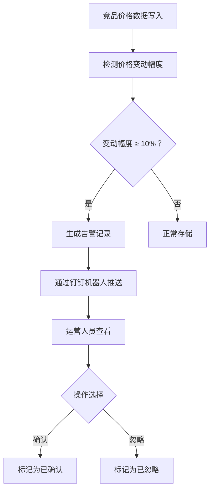
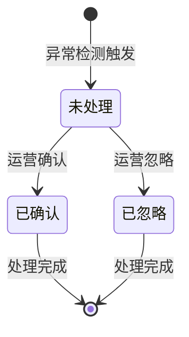

# PRD-004 产品 · 异常价格告警功能设计

***

## 文档信息

| 项目   | 内容                   |
| ---- | -------------------- |
| 文档编号 | PRD-004-F007-2026-001 |
| 文档版本 | v0.1                 |
| 产品名称 | AI市调助手与智能定价系统             |
| 所属系统 | 钉钉AI表格应用             |
| 编制日期 | 2026-06-12       |
| 编制人员 | PRD-004 编制组               |

### 修订记录

| 版本   | 修订日期           | 修订说明 | 修订人    |
| ---- | -------------- | ---- | ------ |
| v0.1 | 2026-06-12 | 初稿创建 | PRD-004 编制组 |

***

> **文档撰写规范（重要）**
>
> 1. **严格遵循模板格式**：各章节表格字段必须与模板保持一致
> 2. **聚焦业务规则**：描述业务逻辑、数据约束、权限控制等，不写技术实现细节
> 3. **减少不必要的示例**：不写JSON/XML格式的报文示例
> 4. **页面布局与交互分离**：§四仅描述页面结构，§五描述业务规则

***

## 一、功能角色矩阵说明

### 1.1 功能描述

- **功能名称：** 异常价格告警
- **所属模块：** 竞品价格采集
- **功能描述：** 当竞品价格出现大幅调价（≥10%）时，系统自动检测并生成告警记录，通过钉钉机器人推送至相关人员，帮助运营快速响应市场变化。

### 1.2 角色权限总览

| 角色      | 功能权限                        | 数据权限   |
| ------- | --------------------------- | ------ |
| 单品运营 | 查看全部告警、确认告警、忽略告警、配置阈值 | 全量数据   |
| 采购人员 | 查看全部告警                     | 全量数据   |
| 管理层   | 查看全部告警、查看告警统计            | 全量数据   |

### 1.3 功能角色矩阵

| 功能点  | 单品运营 | 采购人员 | 管理层 |
| ---- | :-----: | :-----: | :-----: |
| 查看全部告警 |    是    |    是    |    是    |
| 确认告警 |    是    |    否    |    否    |
| 忽略告警 |    是    |    否    |    否    |
| 配置阈值 |    是    |    否    |    否    |
| 查看告警统计 |    否    |    否    |    是    |

***

## 二、模块路径

钉钉AI表格应用 → 竞品价格采集 → 异常价格告警

***

## 三、状态流转与流程图

### 3.1 业务流程图



### 3.2 状态流转图



***

## 四、页面布局

### 4.1 页面清单

|  序号 | 页面名称    | 页面类型   | 描述                           |
| :-: | ------- | ------ | ---------------------------- |
|  1  | 告警列表 | 主页面    | 展示所有异常价格告警，支持查询、筛选、操作            |
|  2  | 告警详情弹窗  | 弹窗     | 展示告警详情，含价格变动信息和关联数据            |
|  3  | 阈值配置弹窗  | 弹窗     | 配置异常价格告警的触发阈值            |

***

### 4.2 告警列表布局

```
┌─────────────────────────────────────────────────────────────────┐
│  异常价格告警                                                   │
├─────────────────────────────────────────────────────────────────┤
│  查询条件区                                                       │
│  ┌─────────────┐ ┌─────────────┐ ┌──────┐ ┌──────┐             │
│  │ 商品名称   │ │ 状态   │ │ 查询 │ │ 重置 │             │
│  │ [输入框    ]│ │ [下拉框▼]│ │ 按钮 │ │ 按钮 │             │
│  └─────────────┘ └─────────────┘ └──────┘ └──────┘             │
├─────────────────────────────────────────────────────────────────┤
│  工具栏区    [配置阈值]                          [导出]          │
├─────────────────────────────────────────────────────────────────┤
│  列表数据区                                                       │
│  ┌────┬─────┬──────────┬──────────┬──────────┬──────────┬────────┐      │
│  │ 序号 │ 告警时间 │ 商品名称  │ 竞对品牌  │ 变动幅度  │ 状态     │ 操作   │      │
│  ├────┼─────┼──────────┼──────────┼──────────┼──────────┼────────┤      │
│  │  1  │ 10:30 │ 红颜草莓  │ 百果园   │ ↓15.2%  │ 未处理  │ [详情] [确认] [忽略]│      │
│  │  2  │ 09:15 │ 进口蓝莓  │ 鲜丰水果  │ ↑12.5%  │ 已确认  │ [详情]│      │
│  └────┴─────┴──────────┴──────────┴──────────┴──────────┴────────┘      │
├─────────────────────────────────────────────────────────────────┤
│  分页区    [< 1 2 3 ... 10 >]  [每页 10 ▼]  共 95 条            │
└─────────────────────────────────────────────────────────────────┘
```

### 4.2.1 查询条件区

| 组件名称    | 组件类型 | 位置 | 提示语            | 说明        |
| ------- | ---- | -- | -------------- | --------- |
| 商品名称    | 输入框  | 居左 | 请输入商品名称 | 模糊查询 |
| 状态      | 下拉框  | 居左 | 请选择状态 | 精确查询 |
| 变动类型    | 下拉框  | 居左 | 请选择变动类型 | 上涨/下跌 |
| 查询      | 按钮   | 居右 | —              | 主按钮       |
| 重置      | 按钮   | 居右 | —              | 次按钮       |

### 4.2.2 工具栏区

| 组件名称 | 组件类型 | 位置 | 提示语 | 说明          |
| ---- | ---- | -- | --- | ----------- |
| 配置阈值 | 按钮   | 居左 | —   | 打开阈值配置弹窗 |
| 导出   | 按钮   | 居右 | —   | —           |

### 4.2.3 列表展示区

| 字段      | 组件类型 | 位置 | 说明                |
| ------- | ---- | -- | ----------------- |
| 序号      | 文本   | 居中 | —                 |
| 告警时间    | 文本   | 居左 | 格式：HH:mm        |
| 商品名称    | 文本   | 居左 | —                 |
| 竞对品牌    | 文本   | 居左 | —                 |
| 变动前价格   | 文本   | 居左 | 格式：¥XX.XX        |
| 变动后价格   | 文本   | 居左 | 格式：¥XX.XX        |
| 变动幅度    | 标签   | 居中 | ↑/↓ + 百分比，红绿配色 |
| 状态      | 标签   | 居中 | 未处理/已确认/已忽略 badge |
| 操作      | 按钮组  | 居中 | \[详情] \[确认] \[忽略] |

***

### 4.3 告警详情弹窗布局

```
┌─────────────────────────────────────────────────────────────────┐
│  告警详情 - 红颜草莓 300g/盒                        [X]          │
├─────────────────────────────────────────────────────────────────┤
│  告警时间：2026-06-12 10:30:25                                   │
│  状态：未处理                                                     │
│                                                                 │
│  ┌─────────────────────────────────────────────────────────┐    │
│  │  价格变动信息                                             │    │
│  │  竞对品牌：百果园（朝阳店）                                 │    │
│  │  变动前价格：¥29.9                                       │    │
│  │  变动后价格：¥25.4                                       │    │
│  │  变动幅度：↓15.2%                                        │    │
│  │  触发规则：价格下跌超过10%阈值                              │    │
│  └─────────────────────────────────────────────────────────┘    │
│                                                                 │
│  ┌─────────────────────────────────────────────────────────┐    │
│  │  关联信息                                                │    │
│  │  本品当前售价：¥29.9                                    │    │
│  │  价差：本品高于竞品 ¥4.5（17.7%）                          │    │
│  │  建议：关注竞品动态，考虑跟进降价                             │    │
│  └─────────────────────────────────────────────────────────┘    │
│                                                                 │
│                                    [确认]  [忽略]  [关闭]        │
└─────────────────────────────────────────────────────────────────┘
```

### 4.3.1 详情字段说明

| 字段      | 组件类型 | 位置   | 说明         |
| ------- | ---- | ---- | ---------- |
| 告警时间   | 文本   | 顶部 | 只读         |
| 状态      | 标签   | 顶部 | 只读         |
| 价格变动信息 | 文本组  | 中部 | 只读，含竞对品牌、变动前后价格、幅度 |
| 触发规则   | 文本   | 中部 | 只读         |
| 关联信息   | 文本组  | 下部 | 只读，含本品售价、价差、建议 |

***

### 4.4 阈值配置弹窗布局

```
┌─────────────────────────────────────────────────┐
│  告警阈值配置                              [X]  │
├─────────────────────────────────────────────────┤
│  价格变动阈值：  [输入框    ] %                   │
│  默认值：10%                                     │
│  推送人员：    [人员选择器 ▼]                     │
│  推送频率：    ○ 实时  ○ 每小时汇总  ○ 每日汇总    │
│                                                 │
│                              [取消]  [确定]      │
└─────────────────────────────────────────────────┘
```

### 4.4.1 配置字段说明

| 字段      | 组件类型 | 位置   | 提示语            | 说明        |
| ------- | ---- | ---- | -------------- | --------- |
| 价格变动阈值 | 输入框  | 独占一行 | 请输入阈值百分比 | 必填\*，范围1-50% |
| 推送人员   | 人员选择器 | 独占一行 | 请选择推送人员 | 必填\*，支持多选 |
| 推送频率   | 单选按钮组 | 独占一行 | — | 必填\* |

***

## 五、页面交互说明

### 5.1 告警列表交互说明

#### 5.1.1 字段交互规则

| 字段        | 类型  | 是否必填 | 约束规则                  | 展示规则 | 举例或枚举       |
| --------- | --- | :--: | --------------------- | ---- | ----------- |
| 商品名称    | 输入框 |   否  | 模糊查询；最大50字符  | 明文   | 红颜草莓 |
| 状态      | 下拉框 |   否  | 精确查询 | 明文   | 未处理/已确认/已忽略 |
| 变动类型    | 下拉框 |   否  | 精确查询 | 明文   | 上涨/下跌 |

#### 5.1.2 操作交互逻辑

| 操作类型 | 触发操作     | 交互可用性       | 正向输出                                        | 异常场景                                           | 异常处理             | 日志级别 |
| ---- | -------- | ----------- | ------------------------------------------- | ---------------------------------------------- | ---------------- | ---- |
| 查询   | 点击"查询"   | 始终可用        | 按条件筛选，结果在列表中展示，分页同步更新                       | — | — | 接口级  |
| 重置   | 点击"重置"   | 始终可用        | 清空所有筛选条件，恢复初始查询状态                           | 无                                              | 无                | 接口级  |
| 详情   | 点击"详情"   | 始终可用        | 打开告警详情弹窗                                    | 无                                              | 无                | 接口级  |
| 确认   | 点击"确认"   | 状态为未处理时可用 | 标记为"已确认"，刷新列表                                | — | — | 接口级  |
| 忽略   | 点击"忽略"   | 状态为未处理时可用 | 标记为"已忽略"，刷新列表                                | — | — | 接口级  |
| 配置阈值 | 点击"配置阈值" | 始终可用        | 打开阈值配置弹窗                                    | 无                                              | 无                | 不记录  |
| 导出   | 点击"导出"   | 始终可用        | 导出Excel文件                                   | 无数据                                            | Toast提示"暂无数据可导出" | 接口级  |

> **导出文件命名规范**：
> - 格式：`异常价格告警_{YYYYMMDD}_{HHMMSS}.xlsx`
> - 示例：`异常价格告警_20260612_103045.xlsx`

***

### 5.2 告警详情弹窗交互说明

#### 5.2.1 操作交互逻辑

| 操作类型 | 触发操作      | 交互可用性       | 正向输出                    | 异常场景 | 异常处理               | 日志级别 |
| ---- | --------- | ----------- | ----------------------- | ---- | ------------------ | ---- |
| 确认   | 点击"确认"按钮  | 状态为未处理时可用 | 标记为"已确认"，弹窗关闭，列表刷新 | 操作失败 | Toast提示"操作失败，请重试" | 接口级  |
| 忽略   | 点击"忽略"按钮  | 状态为未处理时可用 | 标记为"已忽略"，弹窗关闭，列表刷新 | 操作失败 | Toast提示"操作失败，请重试" | 接口级  |
| 关闭   | 点击"关闭"按钮  | 始终可用        | 关闭弹窗，返回列表               | 无    | 无                  | 不记录  |

***

### 5.3 阈值配置弹窗交互说明

#### 5.3.1 字段交互规则

| 字段            | 类型 | 是否必填 | 约束规则                       | 展示规则                | 举例或枚举       |
| ------------- | -- | :--: | -------------------------- | ------------------- | ----------- |
| 价格变动阈值       | 输入框 |   是  | 1-50之间的整数 | 默认10 | 10 |
| 推送人员       | 人员选择器 |   是  | 支持多选 | 多选 | 张三/李四 |
| 推送频率       | 单选按钮 |   是  | 实时/每小时汇总/每日汇总 | 默认实时 | 实时 |

#### 5.3.2 操作交互逻辑

| 操作类型 | 触发操作      | 交互可用性       | 正向输出                    | 异常场景 | 异常处理               | 日志级别 |
| ---- | --------- | ----------- | ----------------------- | ---- | ------------------ | ---- |
| 确定保存 | 点击"确定"按钮  | 必填字段合规后可用 | 保存配置，弹窗关闭，Toast提示"保存成功" | 保存失败 | Toast提示"保存失败，请重试" | 接口级  |
| 取消   | 点击"取消"按钮  | 始终可用        | 关闭弹窗，不保存任何数据            | 无    | 无                  | 不记录  |

***

## 六、错误处理规范

### 6.1 表单校验错误

| 字段      | 为空时错误信息     | 格式错误时信息           |
| ------- | ----------- | ----------------- |
| 价格变动阈值 | 请输入价格变动阈值 | 请输入1-50之间的整数     |
| 推送人员   | 请选择推送人员  | —                 |

### 6.2 操作错误

| 场景      | 触发条件                         | 提示文案                    | 处理方式                       |
| ------- | ---------------------------- | ----------------------- | -------------------------- |
| 推送失败 | 钉钉消息发送失败                 | 告警推送失败，请检查推送配置      | Toast 提示，记录日志              |
| 网络/服务异常 | 接口请求失败                       | 接口异常，请稍候再试              | Toast 提示                   |

***

## 七、非功能性需求

### 7.1 合规与安全要求

| 适用规范       | 内容摘要              | 本模块特有说明                    |
| ---------- | ----------------- | -------------------------- |
| 操作日志   | 字段级日志、保留期限、不可篡改   | 覆盖操作：确认/忽略/配置阈值 |

### 7.2 性能需求

| 需求项       | 指标要求          | 说明            |
| --------- | ------------- | ------------- |
| 异常检测响应时间 | ≤ 1s          | 价格写入后触发检测 |
| 推送延迟      | ≤ 30s         | 检测到异常后推送告警 |
| 列表查询响应时间  | ≤ 2s          | 正常网络条件下   |
| 页面首屏加载时间  | ≤ 3s          | —             |
| 并发用户数     | 50           | —       |

***

## 八、特殊说明

### 8.1 异常检测规则

1. 价格变动幅度 = |本次价格 - 上次价格| / 上次价格 × 100%
2. 变动幅度 ≥ 阈值（默认10%）时触发告警
3. 价格上涨和下跌均触发告警
4. 同一商品同一门店同一天仅触发一次告警

### 8.2 推送规则

1. 告警通过钉钉机器人推送给配置的人员
2. 推送内容包含：商品名称、竞对品牌、变动前后价格、变动幅度
3. 支持实时/每小时汇总/每日汇总三种推送频率

### 8.3 其他特殊规则

1. 告警记录保留180天
2. 已确认/已忽略的告警不再重复推送
3. 阈值配置变更后，新告警按新阈值执行

***

## 九、数据字典

### 9.1 字典项定义

**告警状态（alertStatus）**

| 枚举值（code） | 显示文本（label） | 说明     |
| :-------: | ----------- | ------ |
|     PENDING     | 未处理     | 告警已生成，等待处理 |
|     CONFIRMED     | 已确认     | 运营已确认告警 |
|     IGNORED     | 已忽略     | 运营已忽略告警 |

**变动类型（changeType）**

| 枚举值（code） | 显示文本（label） | 说明     |
| :-------: | ----------- | ------ |
|     UP     | 上涨     | 价格上涨 |
|     DOWN     | 下跌     | 价格下跌 |

**推送频率（pushFrequency）**

| 枚举值（code） | 显示文本（label） | 说明     |
| :-------: | ----------- | ------ |
|     REALTIME     | 实时     | 检测到异常立即推送 |
|     HOURLY     | 每小时汇总     | 每小时汇总推送一次 |
|     DAILY     | 每日汇总     | 每日汇总推送一次 |

### 9.2 下拉框数据来源说明

| 字段名     | 数据来源类型 | 来源说明                        |
| ------- | ------ | --------------------------- |
| 状态 | 字典项    | 参见 9.1 alertStatus |
| 变动类型 | 字典项    | 参见 9.1 changeType |
| 推送人员 | 接口动态加载 | 来源：钉钉用户列表 |

***

## 十、外部系统接口说明

### 10.1 接口清单

| 接口名称    | 功能描述           | 交互方向     | 依赖系统     | 数据流向                    |
| ------- | -------------- | -------- | -------- | ----------------------- |
| 价格变动检测接口 | 检测价格变动是否超过阈值 | 被调用 | 数据结构化存储模块 | 本模块→数据结构化存储模块 |
| 钉钉消息推送接口 | 通过钉钉机器人推送告警 | 调用 | 钉钉开放平台 | 本系统→钉钉开放平台 |

### 10.2 接口详细说明

**价格变动检测接口**

| 规则项  | 说明                    |
| ---- | --------------------- |
| 触发时机 | 竞品价格数据写入后自动调用           |
| 请求条件 | 竞品商品ID + 新价格 |
| 成功处理 | 返回是否超过阈值、变动幅度 |
| 失败处理 | 返回错误信息，不触发告警 |

**钉钉消息推送接口**

| 规则项  | 说明                    |
| ---- | --------------------- |
| 触发时机 | 检测到异常价格变动后调用           |
| 请求条件 | 接收人钉钉ID + 告警内容 |
| 成功处理 | 消息推送成功，记录推送日志 |
| 失败处理 | 返回错误信息，记录失败日志 |

***

*文档结束*
