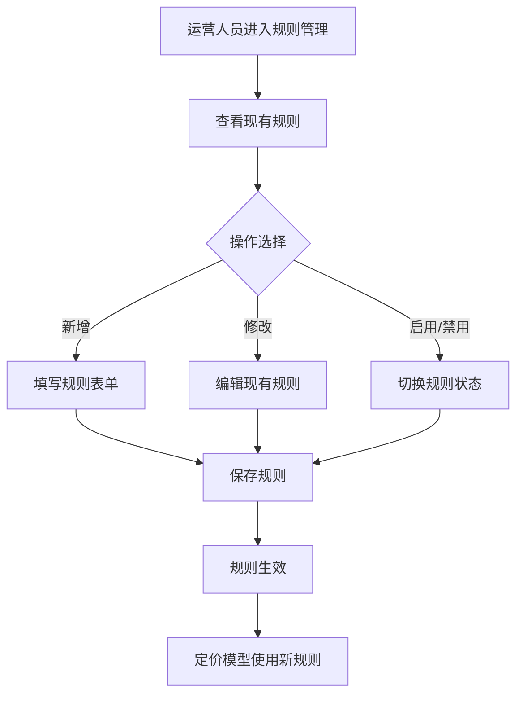
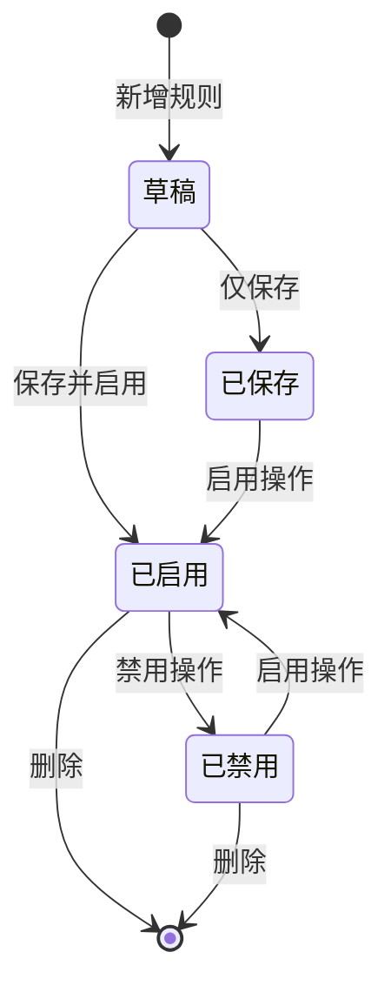

# PRD-004 产品 · 定价规则管理功能设计

***

## 文档信息

| 项目   | 内容                   |
| ---- | -------------------- |
| 文档编号 | PRD-004-F009-2026-001 |
| 文档版本 | v0.1                 |
| 产品名称 | AI市调助手与智能定价系统             |
| 所属系统 | 钉钉AI表格应用             |
| 编制日期 | 2026-06-12       |
| 编制人员 | PRD-004 编制组               |

### 修订记录

| 版本   | 修订日期           | 修订说明 | 修订人    |
| ---- | -------------- | ---- | ------ |
| v0.1 | 2026-06-12 | 初稿创建 | PRD-004 编制组 |

***

> **文档撰写规范（重要）**
>
> 1. **严格遵循模板格式**：各章节表格字段必须与模板保持一致
> 2. **聚焦业务规则**：描述业务逻辑、数据约束、权限控制等，不写技术实现细节
> 3. **减少不必要的示例**：不写JSON/XML格式的报文示例
> 4. **页面布局与交互分离**：§四仅描述页面结构，§五描述业务规则

***

## 一、功能角色矩阵说明

### 1.1 功能描述

- **功能名称：** 定价规则管理
- **所属模块：** 智能定价
- **功能描述：** 管理智能定价的规则和参数，包括保底毛利规则、竞品跟价规则、库存清仓规则、新品定价规则等，支持运营人员灵活配置定价策略。

### 1.2 角色权限总览

| 角色      | 功能权限                        | 数据权限   |
| ------- | --------------------------- | ------ |
| 单品运营 | 查看规则、新增、修改、启用/禁用、删除      | 全量数据   |
| 采购人员 | 查看规则                        | 全量数据   |
| 管理层   | 查看规则、审批规则变更               | 全量数据   |

### 1.3 功能角色矩阵

| 功能点  | 单品运营 | 采购人员 | 管理层 |
| ---- | :-----: | :-----: | :-----: |
| 查看规则列表 |    是    |    是    |    是    |
| 新增规则 |    是    |    否    |    否    |
| 修改规则 |    是    |    否    |    否    |
| 启用/禁用 |    是    |    否    |    否    |
| 删除规则 |    是    |    否    |    否    |
| 审批规则变更 |    否    |    否    |    是    |

***

## 二、模块路径

钉钉AI表格应用 → 智能定价 → 定价规则管理

***

## 三、状态流转与流程图

### 3.1 业务流程图



### 3.2 状态流转图



***

## 四、页面布局

### 4.1 页面清单

|  序号 | 页面名称    | 页面类型   | 描述                           |
| :-: | ------- | ------ | ---------------------------- |
|  1  | 规则列表 | 主页面    | 展示所有定价规则，支持查询、筛选、操作            |
|  2  | 新增/编辑弹窗 | 弹窗     | 新增或编辑定价规则                    |
|  3  | 查看详情弹窗  | 弹窗     | 查看规则详情（只读）                 |
|  4  | 删除确认弹窗  | 弹窗     | 删除操作二次确认                     |

***

### 4.2 规则列表布局

```
┌─────────────────────────────────────────────────────────────────┐
│  定价规则管理                                                   │
├─────────────────────────────────────────────────────────────────┤
│  查询条件区                                                       │
│  ┌─────────────┐ ┌─────────────┐ ┌──────┐ ┌──────┐             │
│  │ 规则名称   │ │ 状态   │ │ 查询 │ │ 重置 │             │
│  │ [输入框    ]│ │ [下拉框▼]│ │ 按钮 │ │ 按钮 │             │
│  └─────────────┘ └─────────────┘ └──────┘ └──────┘             │
├─────────────────────────────────────────────────────────────────┤
│  工具栏区    [+新增规则]                                        │
├─────────────────────────────────────────────────────────────────┤
│  列表数据区                                                       │
│  ┌────┬─────┬──────────┬──────────┬──────────┬──────────┬────────┐      │
│  │ 序号 │ 规则名称 │ 规则类型  │ 优先级   │ 状态     │ 更新时间 │ 操作   │      │
│  ├────┼─────┼──────────┼──────────┼──────────┼──────────┼────────┤      │
│  │  1  │ 保底毛利  │ 保底规则  │ 高      │ 已启用   │ 06-10  │ [详情] [修改] [禁用] [删除]│      │
│  │  2  │ 竞品跟价  │ 跟价规则  │ 中      │ 已启用   │ 06-08  │ [详情] [修改] [禁用] [删除]│      │
│  └────┴─────┴──────────┴──────────┴──────────┴──────────┴────────┘      │
├─────────────────────────────────────────────────────────────────┤
│  分页区    [< 1 2 3 ... 10 >]  [每页 10 ▼]  共 95 条            │
└─────────────────────────────────────────────────────────────────┘
```

### 4.2.1 查询条件区

| 组件名称    | 组件类型 | 位置 | 提示语            | 说明        |
| ------- | ---- | -- | -------------- | --------- |
| 规则名称    | 输入框  | 居左 | 请输入规则名称 | 模糊查询 |
| 规则类型    | 下拉框  | 居左 | 请选择规则类型 | 精确查询 |
| 状态      | 下拉框  | 居左 | 请选择状态 | 精确查询 |
| 查询      | 按钮   | 居右 | —              | 主按钮       |
| 重置      | 按钮   | 居右 | —              | 次按钮       |

### 4.2.2 工具栏区

| 组件名称 | 组件类型 | 位置 | 提示语 | 说明          |
| ---- | ---- | -- | --- | ----------- |
| 新增规则 | 按钮   | 居左 | —   | 打开新增弹窗 |

### 4.2.3 列表展示区

| 字段      | 组件类型 | 位置 | 说明                |
| ------- | ---- | -- | ----------------- |
| 序号      | 文本   | 居中 | —                 |
| 规则名称    | 文本   | 居左 | —                 |
| 规则类型    | 标签   | 居中 | 保底/跟价/清仓/新品 badge |
| 优先级    | 标签   | 居中 | 高/中/低 badge |
| 状态      | 标签   | 居中 | 已启用/已禁用/草稿 badge |
| 更新时间    | 文本   | 居左 | 格式：MM-DD        |
| 操作      | 按钮组  | 居中 | \[详情] \[修改] \[启用/禁用] \[删除] |

***

### 4.3 新增/编辑弹窗布局

```
┌─────────────────────────────────────────────────┐
│  新增定价规则                              [X]  │
├─────────────────────────────────────────────────┤
│  规则名称：  [输入框                            ]  │
│  规则类型：  [下拉选择 ▼]                         │
│  优先级：    ○ 高  ○ 中  ○ 低                      │
│  规则条件：  [条件编辑器                          ]  │
│  规则动作：  [动作编辑器                          ]  │
│  规则描述：  [输入框                            ]  │
│                                                 │
│                              [取消]  [确定]      │
└─────────────────────────────────────────────────┘
```

### 4.3.1 表单字段说明

| 字段      | 组件类型 | 位置   | 提示语            | 说明        |
| ------- | ---- | ---- | -------------- | --------- |
| 规则名称   | 输入框  | 独占一行 | 请输入规则名称 | 必填\*，1-100字符 |
| 规则类型   | 下拉框  | 独占一行 | 请选择规则类型 | 必填\* |
| 优先级    | 单选按钮组 | 独占一行 | — | 必填\*，高/中/低 |
| 规则条件   | 条件编辑器 | 独占一行 | 请配置条件 | 必填\*，可视化条件配置 |
| 规则动作   | 动作编辑器 | 独占一行 | 请配置动作 | 必填\*，可视化动作配置 |
| 规则描述   | 输入框  | 独占一行 | 请输入规则描述 | 可选，0-500字符 |

***

### 4.4 查看详情弹窗布局

```
┌─────────────────────────────────────────────────┐
│  查看定价规则详情                          [X]  │
├─────────────────────────────────────────────────┤
│  规则名称：  保底毛利                             │
│  规则类型：  保底规则                             │
│  优先级：    高                                 │
│  状态：      已启用                              │
│  创建时间：  2026-06-10 10:00:00                │
│  更新时间：  2026-06-10 10:00:00                │
│                                                 │
│  规则条件：  毛利率 < 15%                        │
│  规则动作：  自动设为成本价 × 1.18                │
│  规则描述：  确保商品不低于保底毛利率              │
│                                                 │
│                                    [关闭]       │
└─────────────────────────────────────────────────┘
```

### 4.4.1 展示字段说明

| 字段      | 组件类型 | 位置   | 说明         |
| ------- | ---- | ---- | ---------- |
| 规则名称   | 文本   | 独占一行 | 只读         |
| 规则类型   | 文本   | 独占一行 | 只读         |
| 优先级    | 文本   | 独占一行 | 只读         |
| 状态      | 标签   | 独占一行 | 只读         |
| 创建时间   | 文本   | 独占一行 | 只读         |
| 更新时间   | 文本   | 独占一行 | 只读         |
| 规则条件   | 文本   | 独占一行 | 只读         |
| 规则动作   | 文本   | 独占一行 | 只读         |
| 规则描述   | 文本   | 独占一行 | 只读         |

***

### 4.5 删除确认弹窗布局

```
┌─────────────────────────────────────────────────┐
│  提示                                      [X]  │
├─────────────────────────────────────────────────┤
│                                                 │
│         是否确认删除该定价规则？                  │
│                                                 │
│                              [取消]  [确定]      │
└─────────────────────────────────────────────────┘
```

***

## 五、页面交互说明

### 5.1 规则列表交互说明

#### 5.1.1 字段交互规则

| 字段        | 类型  | 是否必填 | 约束规则                  | 展示规则 | 举例或枚举       |
| --------- | --- | :--: | --------------------- | ---- | ----------- |
| 规则名称    | 输入框 |   否  | 模糊查询；最大50字符  | 明文   | 保底毛利 |
| 规则类型    | 下拉框 |   否  | 精确查询 | 明文   | 保底规则/跟价规则/清仓规则/新品定价 |
| 状态      | 下拉框 |   否  | 精确查询 | 明文   | 已启用/已禁用/草稿 |

#### 5.1.2 操作交互逻辑

| 操作类型 | 触发操作     | 交互可用性       | 正向输出                                        | 异常场景                                           | 异常处理             | 日志级别 |
| ---- | -------- | ----------- | ------------------------------------------- | ---------------------------------------------- | ---------------- | ---- |
| 查询   | 点击"查询"   | 始终可用        | 按条件筛选，结果在列表中展示，分页同步更新                       | — | — | 接口级  |
| 重置   | 点击"重置"   | 始终可用        | 清空所有筛选条件，恢复初始查询状态                           | 无                                              | 无                | 接口级  |
| 新增   | 点击"新增规则" | 始终可用        | 打开新增定价规则弹窗                                | 无                                              | 无                | 接口级  |
| 详情   | 点击"详情"   | 始终可用        | 打开查看弹窗，所有字段只读                               | 无                                              | 无                | 接口级  |
| 修改   | 点击"修改"   | 始终可用 | 打开编辑弹窗，反显当前数据，支持编辑                    | — | — | 接口级  |
| 启用   | 点击"启用"   | 状态为已禁用时可用 | 状态变为"已启用"，刷新列表                          | — | — | 接口级  |
| 禁用   | 点击"禁用"   | 状态为已启用时可用 | 状态变为"已禁用"，刷新列表                          | — | — | 接口级  |
| 删除   | 点击"删除"   | 状态为草稿或已禁用时可用 | 弹出确认弹窗；确认后执行删除，刷新列表              | 已启用状态不可删除 | 按钮灰化不可点击 | 接口级  |

***

### 5.2 新增/编辑弹窗交互说明

#### 5.2.1 字段交互规则

| 字段            | 类型 | 是否必填 | 约束规则                       | 展示规则                | 举例或枚举       |
| ------------- | -- | :--: | -------------------------- | ------------------- | ----------- |
| 规则名称       | 输入框 |   是  | 1-100个字符，支持中英文和数字 | 明文                  | 保底毛利 |
| 规则类型       | 下拉框 |   是  | 保底规则/跟价规则/清仓规则/新品定价 | 下拉选择                | 保底规则 |
| 优先级       | 单选按钮 |   是  | 高/中/低 | 单选                  | 高 |
| 规则条件       | 条件编辑器 |   是  | 可视化配置，支持多条件组合 | 条件编辑器              | 毛利率 < 15% |
| 规则动作       | 动作编辑器 |   是  | 可视化配置 | 动作编辑器              | 自动设为成本价 × 1.18 |
| 规则描述       | 输入框 |   否  | 0-500字符 | 明文                  | 确保商品不低于保底毛利率 |

#### 5.2.2 操作交互逻辑

| 操作类型 | 触发操作      | 交互可用性       | 正向输出                    | 异常场景 | 异常处理               | 日志级别 |
| ---- | --------- | ----------- | ----------------------- | ---- | ------------------ | ---- |
| 确定保存 | 点击"确定"按钮  | 必填字段全部合规后可用 | 弹窗关闭，列表刷新，Toast提示"保存成功" | 保存失败 | Toast提示"保存失败，请重试！" | 接口级  |
| 取消   | 点击"取消"按钮  | 始终可用        | 关闭弹窗，不保存任何数据            | 无    | 无                  | 不记录  |
| 关闭   | 点击右上角\[X] | 始终可用        | 关闭弹窗，不保存任何数据            | 无    | 无                  | 不记录  |

#### 5.2.3 弹窗说明

| 规则项  | 说明                                   |
| ---- | ------------------------------------ |
| 打开方式 | 点击列表页工具栏"新增规则"按钮，或操作列"修改"按钮            |
| 标题   | 新增时显示"新增定价规则"；编辑时显示"编辑定价规则"          |
| 数据反显 | 编辑时自动回填当前记录数据；新增时所有字段为空              |
| 校验时机 | 字段失焦时触发单字段校验；点击"确定"时触发全量校验           |
| 保存规则 | 全部校验通过后提交保存；校验失败时字段下方显示红色提示文本，字段边框变红 |
| 关闭确认 | 如有未保存的修改，关闭时弹出二次确认"是否放弃编辑？"          |

***

### 5.3 查看详情弹窗交互说明

#### 5.3.1 操作交互逻辑

| 操作类型 | 触发操作     | 交互可用性 | 正向输出        | 异常场景 | 异常处理 | 日志级别 |
| ---- | -------- | ----- | ----------- | ---- | ---- | ---- |
| 关闭   | 点击"关闭"按钮 | 始终可用  | 关闭弹窗，返回列表页面 | 无    | 无    | 不记录  |

***

### 5.4 删除确认弹窗交互说明

#### 5.4.1 操作交互逻辑

| 操作类型 | 触发操作     | 交互可用性 | 正向输出             | 异常场景 | 异常处理    | 日志级别 |
| ---- | -------- | ----- | ---------------- | ---- | ------- | ---- |
| 确认删除 | 点击"确定"按钮 | 始终可用  | 执行删除，弹窗关闭，列表自动刷新 | 删除失败 | Toast提示 | 接口级  |
| 取消   | 点击"取消"按钮 | 始终可用  | 关闭弹窗，不做任何操作      | 无    | 无       | 不记录  |

#### 5.4.2 弹窗说明

| 规则项  | 说明              |
| ---- | --------------- |
| 触发条件 | 点击列表行操作列的"删除"按钮 |
| 提示文案 | "是否确认删除该定价规则？"   |
| 确认操作 | 执行删除，弹窗关闭，列表刷新  |
| 取消操作 | 关闭弹窗不做任何操作      |

***

## 六、错误处理规范

### 6.1 表单校验错误

- 显示方式：对应字段下方显示红色提示文本，字段边框变红
- 触发时机：表单提交时触发全量校验；字段失去焦点时触发单字段校验

| 字段      | 为空时错误信息     | 格式错误时信息           |
| ------- | ----------- | ----------------- |
| 规则名称   | 规则名称不能为空 | 规则名称长度不能超过100个字符 |
| 规则类型   | 请选择规则类型  | —                 |
| 规则条件   | 请配置规则条件  | 条件配置不完整，请检查     |
| 规则动作   | 请配置规则动作  | 动作配置不完整，请检查     |

### 6.2 操作错误

| 场景      | 触发条件                         | 提示文案                    | 处理方式                       |
| ------- | ---------------------------- | ----------------------- | -------------------------- |
| 删除已启用 | 尝试删除已启用状态的规则            | 已启用的规则不能删除，请先禁用       | 按钮灰化，不可点击              |
| 网络/服务异常 | 接口请求失败                       | 接口异常，请稍候再试              | Toast 提示                   |

***

## 七、非功能性需求

### 7.1 合规与安全要求

| 适用规范       | 内容摘要              | 本模块特有说明                    |
| ---------- | ----------------- | -------------------------- |
| 操作日志   | 字段级日志、保留期限、不可篡改   | 覆盖操作：新增/修改/删除/启用/禁用 |

### 7.2 性能需求

| 需求项       | 指标要求          | 说明            |
| --------- | ------------- | ------------- |
| 列表查询响应时间  | ≤ 2s          | 正常网络条件下   |
| 保存/提交响应时间 | ≤ 3s          | 新增/修改等写操作  |
| 页面首屏加载时间  | ≤ 3s          | —             |
| 并发用户数     | 50           | —       |

***

## 八、特殊说明

### 8.1 预置规则

系统预置以下4条默认规则，不可删除，可修改和禁用：

| 规则名称 | 条件 | 动作 | 优先级 |
| ------- | --- | --- | --- |
| 保底毛利 | 毛利率 < 15% | 自动设为成本价 × 1.18 | 高 |
| 竞品跟价 | 竞品降价 > 15% | 建议跟进降价 | 中 |
| 库存清仓 | 周转天数 > 10 且保质期 < 3天 | 建议特价清仓 | 高 |
| 新品定价 | 无历史数据 | 参考竞品价格定价 | 中 |

### 8.2 规则执行顺序

1. 按优先级从高到低执行（高 → 中 → 低）
2. 同一优先级按创建时间倒序执行（新规则优先）
3. 每条规则独立执行，不互斥

### 8.3 规则变更影响

1. 规则变更后，下一次定价计算使用新规则
2. 已生成的定价建议不受影响
3. 规则变更记录保留在操作日志中

***

## 九、数据字典

### 9.1 字典项定义

**规则类型（ruleType）**

| 枚举值（code） | 显示文本（label） | 说明     |
| :-------: | ----------- | ------ |
|     MARGIN     | 保底规则     | 保底毛利相关规则 |
|     COMPETITOR     | 跟价规则     | 竞品跟价相关规则 |
|     CLEARANCE     | 清仓规则     | 库存清仓相关规则 |
|     NEW_PRODUCT     | 新品定价     | 新品定价相关规则 |

**优先级（priority）**

| 枚举值（code） | 显示文本（label） | 说明     |
| :-------: | ----------- | ------ |
|     HIGH     | 高     | 优先执行 |
|     MEDIUM     | 中     | 次优先执行 |
|     LOW     | 低     | 最后执行 |

**规则状态（ruleStatus）**

| 枚举值（code） | 显示文本（label） | 说明     |
| :-------: | ----------- | ------ |
|     DRAFT     | 草稿     | 规则已保存但未启用 |
|     ENABLED     | 已启用     | 规则已启用，参与定价计算 |
|     DISABLED     | 已禁用     | 规则已禁用，不参与定价计算 |

### 9.2 下拉框数据来源说明

| 字段名     | 数据来源类型 | 来源说明                        |
| ------- | ------ | --------------------------- |
| 规则类型 | 字典项    | 参见 9.1 ruleType |
| 状态 | 字典项    | 参见 9.1 ruleStatus |

***

## 十、外部系统接口说明

### 10.1 接口清单

| 接口名称    | 功能描述           | 交互方向     | 依赖系统     | 数据流向                    |
| ------- | -------------- | -------- | -------- | ----------------------- |
| 定价规则查询接口 | 查询当前启用的定价规则 | 被调用 | 智能定价模块 | 本模块→智能定价模块 |

### 10.2 接口详细说明

**定价规则查询接口**

| 规则项  | 说明                    |
| ---- | --------------------- |
| 触发时机 | 每日定价计算时调用           |
| 请求条件 | 无 |
| 成功处理 | 返回所有已启用的定价规则列表，按优先级排序 |
| 失败处理 | 返回空列表，使用默认规则 |

***

*文档结束*
