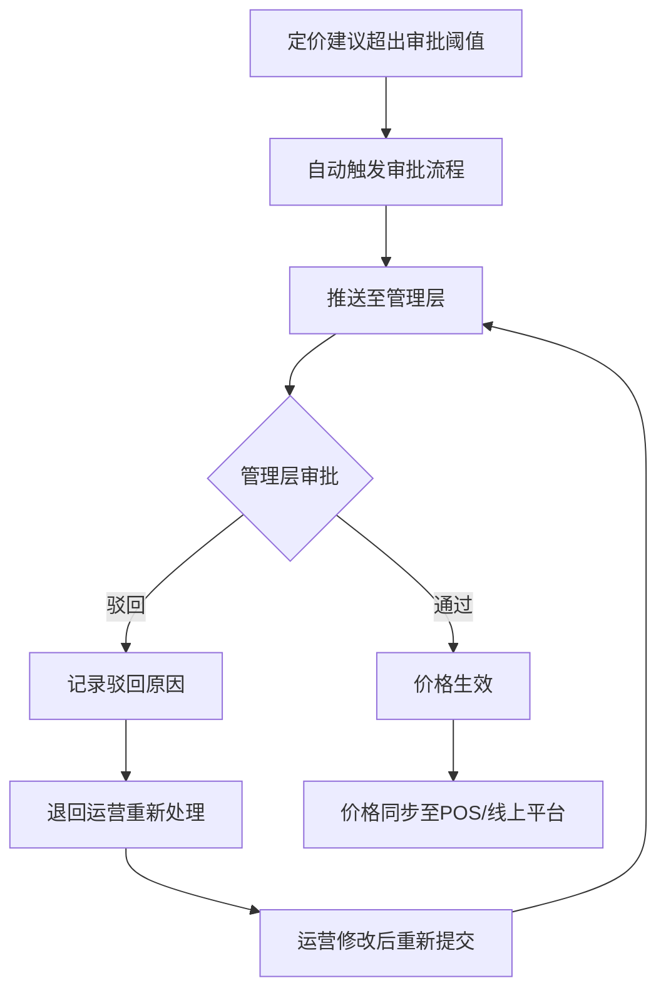
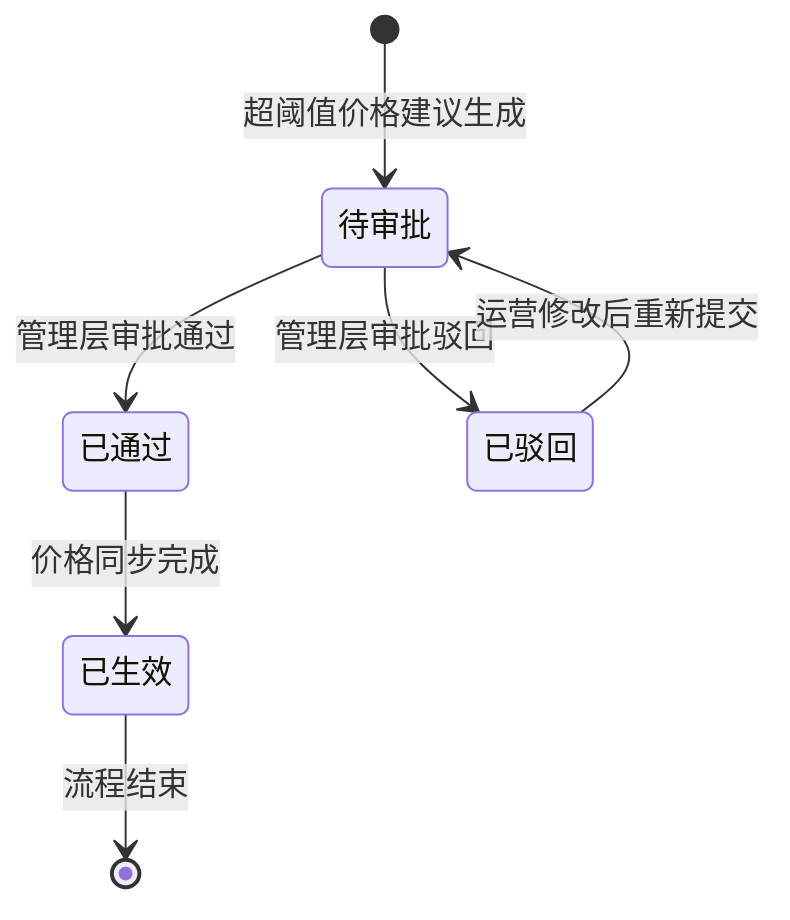

# PRD-004 产品 · 价格审批流程功能设计

***

## 文档信息

| 项目   | 内容                   |
| ---- | -------------------- |
| 文档编号 | PRD-004-F010-2026-001 |
| 文档版本 | v0.1                 |
| 产品名称 | AI市调助手与智能定价系统             |
| 所属系统 | 钉钉AI表格应用             |
| 编制日期 | 2026-06-12       |
| 编制人员 | PRD-004 编制组               |

### 修订记录

| 版本   | 修订日期           | 修订说明 | 修订人    |
| ---- | -------------- | ---- | ------ |
| v0.1 | 2026-06-12 | 初稿创建 | PRD-004 编制组 |

***

> **文档撰写规范（重要）**
>
> 1. **严格遵循模板格式**：各章节表格字段必须与模板保持一致
> 2. **聚焦业务规则**：描述业务逻辑、数据约束、权限控制等，不写技术实现细节
> 3. **减少不必要的示例**：不写JSON/XML格式的报文示例
> 4. **页面布局与交互分离**：§四仅描述页面结构，§五描述业务规则

***

## 一、功能角色矩阵说明

### 1.1 功能描述

- **功能名称：** 价格审批流程
- **所属模块：** 智能定价
- **功能描述：** 当定价建议超出审批阈值（与当前售价偏差超过20%）时，自动触发审批流程，推送至管理层审批，确保重大价格变更有据可查。

### 1.2 角色权限总览

| 角色      | 功能权限                        | 数据权限   |
| ------- | --------------------------- | ------ |
| 单品运营 | 提交审批、查看本人提交的审批          | 本人数据   |
| 管理层   | 查看全部待审批、审批通过/驳回、查看审批统计  | 全量数据   |

### 1.3 功能角色矩阵

| 功能点  | 单品运营 | 管理层 |
| ---- | :-----: | :-----: |
| 提交审批 |    是    |    否    |
| 查看待审批 |    否    |    是    |
| 审批通过/驳回 |    否    |    是    |
| 查看审批统计 |    否    |    是    |

***

## 二、模块路径

钉钉AI表格应用 → 智能定价 → 价格审批

***

## 三、状态流转与流程图

### 3.1 审批流程图



### 3.2 状态流转图



***

## 四、页面布局

### 4.1 页面清单

|  序号 | 页面名称    | 页面类型   | 描述                           |
| :-: | ------- | ------ | ---------------------------- |
|  1  | 待审批列表 | 主页面    | 展示所有待审批的价格建议，支持查询、筛选            |
|  2  | 审批详情弹窗 | 弹窗     | 展示审批详情，含价格对比和审批操作              |

***

### 4.2 待审批列表布局

```
┌─────────────────────────────────────────────────────────────────┐
│  待审批价格建议                                                  │
├─────────────────────────────────────────────────────────────────┤
│  查询条件区                                                       │
│  ┌─────────────┐ ┌─────────────┐ ┌──────┐ ┌──────┐             │
│  │ 商品名称   │ │ 提交日期   │ │ 查询 │ │ 重置 │             │
│  │ [输入框    ]│ │ [日期选择  ]│ │ 按钮 │ │ 按钮 │             │
│  └─────────────┘ └─────────────┘ └──────┘ └──────┘             │
├─────────────────────────────────────────────────────────────────┤
│  列表数据区                                                       │
│  ┌────┬─────┬──────────┬──────────┬──────────┬──────────┬────────┐      │
│  │ 序号 │ 提交日期 │ 商品名称  │ 当前售价  │ 建议价格  │ 偏差%    │ 操作   │      │
│  ├────┼─────┼──────────┼──────────┼──────────┼──────────┼────────┤      │
│  │  1  │ 06-12 │ 进口蓝莓  │ ¥39.9   │ ¥35.9   │ -10.0% │ [审批] │      │
│  │  2  │ 06-11 │ 金枕榴莲  │ ¥59.9   │ ¥49.9   │ -16.7% │ [审批] │      │
│  └────┴─────┴──────────┴──────────┴──────────┴──────────┴────────┘      │
├─────────────────────────────────────────────────────────────────┤
│  分页区    [< 1 2 3 ... 10 >]  [每页 10 ▼]  共 12 条            │
└─────────────────────────────────────────────────────────────────┘
```

### 4.2.1 查询条件区

| 组件名称    | 组件类型 | 位置 | 提示语            | 说明        |
| ------- | ---- | -- | -------------- | --------- |
| 商品名称    | 输入框  | 居左 | 请输入商品名称 | 模糊查询 |
| 提交日期    | 日期选择 | 居左 | 请选择提交日期 | 精确查询 |
| 偏差范围    | 下拉框  | 居左 | 请选择偏差范围 | 精确查询 |
| 查询      | 按钮   | 居右 | —              | 主按钮       |
| 重置      | 按钮   | 居右 | —              | 次按钮       |

### 4.2.2 列表展示区

| 字段      | 组件类型 | 位置 | 说明                |
| ------- | ---- | -- | ----------------- |
| 序号      | 文本   | 居中 | —                 |
| 提交日期    | 文本   | 居左 | 格式：MM-DD        |
| 商品名称    | 文本   | 居左 | —                 |
| 当前售价    | 文本   | 居左 | 格式：¥XX.XX        |
| 建议价格    | 文本   | 居左 | 格式：¥XX.XX，加粗高亮 |
| 偏差%     | 标签   | 居中 | 百分比，红绿配色       |
| 提交人    | 文本   | 居左 | —                 |
| 操作      | 按钮   | 居中 | \[审批] |

***

### 4.3 审批详情弹窗布局

```
┌─────────────────────────────────────────────────────────────────┐
│  审批详情 - 进口蓝莓 125g/盒                        [X]          │
├─────────────────────────────────────────────────────────────────┤
│  提交日期：2026-06-12    提交人：张三                               │
│                                                                 │
│  ┌─────────────────────────────────────────────────────────┐    │
│  │  价格信息                                                │    │
│  │  当前售价：¥39.9                                        │    │
│  │  建议价格：¥35.9                                        │    │
│  │  偏差：-10.0%（超过20%审批阈值）                           │    │
│  │  成本价：¥22.0                                          │    │
│  │  竞品均价：¥34.9                                        │    │
│  │  预期毛利率：35.5%                                       │    │
│  └─────────────────────────────────────────────────────────┘    │
│                                                                 │
│  ┌─────────────────────────────────────────────────────────┐    │
│  │  定价因子摘要                                             │    │
│  │  成本价权重40% | 竞品价格权重25% | 库存周转权重15%            │    │
│  │  价格弹性权重10% | 促销计划权重10%                          │    │
│  └─────────────────────────────────────────────────────────┘    │
│                                                                 │
│  审批意见：  [输入框                                    ]        │
│                                                                 │
│                                    [驳回]  [通过]                │
└─────────────────────────────────────────────────────────────────┘
```

### 4.3.1 审批弹窗字段说明

| 字段      | 组件类型 | 位置   | 提示语            | 说明        |
| ------- | ---- | ---- | -------------- | --------- |
| 提交日期   | 文本   | 顶部 | —              | 只读         |
| 提交人    | 文本   | 顶部 | —              | 只读         |
| 价格信息   | 文本组  | 中部 | —              | 只读，含当前售价、建议价格、偏差、成本价、竞品均价、预期毛利率 |
| 定价因子摘要 | 文本   | 中部 | —              | 只读         |
| 审批意见   | 输入框  | 下部 | 请输入审批意见 | 必填\*，0-500字符 |

***

## 五、页面交互说明

### 5.1 待审批列表交互说明

#### 5.1.1 字段交互规则

| 字段        | 类型  | 是否必填 | 约束规则                  | 展示规则 | 举例或枚举       |
| --------- | --- | :--: | --------------------- | ---- | ----------- |
| 商品名称    | 输入框 |   否  | 模糊查询；最大50字符  | 明文   | 进口蓝莓 |
| 提交日期    | 日期选择 |   否  | 精确查询 | 明文   | 2026-06-12 |
| 偏差范围    | 下拉框 |   否  | 精确查询 | 明文   | >20%/>30%/>50% |

#### 5.1.2 操作交互逻辑

| 操作类型 | 触发操作     | 交互可用性       | 正向输出                                        | 异常场景                                           | 异常处理             | 日志级别 |
| ---- | -------- | ----------- | ------------------------------------------- | ---------------------------------------------- | ---------------- | ---- |
| 查询   | 点击"查询"   | 始终可用        | 按条件筛选，结果在列表中展示，分页同步更新                       | — | — | 接口级  |
| 重置   | 点击"重置"   | 始终可用        | 清空所有筛选条件，恢复初始查询状态                           | 无                                              | 无                | 接口级  |
| 审批   | 点击"审批"   | 始终可用        | 打开审批详情弹窗                                    | 无                                              | 无                | 接口级  |

***

### 5.2 审批详情弹窗交互说明

#### 5.2.1 字段交互规则

| 字段            | 类型 | 是否必填 | 约束规则                       | 展示规则                | 举例或枚举       |
| ------------- | -- | :--: | -------------------------- | ------------------- | ----------- |
| 审批意见       | 输入框 |   是  | 0-500字符 | 明文 | 同意降价，竞品价格压力较大 |

#### 5.2.2 操作交互逻辑

| 操作类型 | 触发操作      | 交互可用性       | 正向输出                    | 异常场景 | 异常处理               | 日志级别 |
| ---- | --------- | ----------- | ----------------------- | ---- | ------------------ | ---- |
| 通过   | 点击"通过"按钮  | 审批意见填写后可用 | 状态变为"已通过"，触发价格同步 | 审批失败 | Toast提示"审批失败，请重试" | 接口级  |
| 驳回   | 点击"驳回"按钮  | 审批意见填写后可用 | 状态变为"已驳回"，退回运营 | 审批失败 | Toast提示"审批失败，请重试" | 接口级  |
| 关闭   | 点击右上角\[X] | 始终可用        | 关闭弹窗，返回列表               | 无    | 无                  | 不记录  |

#### 5.2.3 弹窗说明

| 规则项  | 说明                                   |
| ---- | ------------------------------------ |
| 打开方式 | 点击列表行的"审批"按钮                          |
| 审批阈值 | 建议价格与当前售价偏差超过20%时触发审批流程            |
| 通过操作 | 更新定价建议状态为"已确认"，触发价格同步至POS/线上平台      |
| 驳回操作 | 更新定价建议状态为"已拒绝"，记录审批意见，退回运营人员重新处理  |

***

## 六、错误处理规范

### 6.1 表单校验错误

| 字段      | 为空时错误信息     | 格式错误时信息           |
| ------- | ----------- | ----------------- |
| 审批意见   | 请填写审批意见  | 审批意见长度不能超过500字符 |

### 6.2 操作错误

| 场景      | 触发条件                         | 提示文案                    | 处理方式                       |
| ------- | ---------------------------- | ----------------------- | -------------------------- |
| 价格同步失败 | POS/线上平台接口调用失败              | 价格同步失败，请手动同步至POS系统    | Toast 提示，记录日志              |
| 网络/服务异常 | 接口请求失败                       | 接口异常，请稍候再试              | Toast 提示                   |

***

## 七、非功能性需求

### 7.1 合规与安全要求

| 适用规范       | 内容摘要              | 本模块特有说明                    |
| ---------- | ----------------- | -------------------------- |
| 操作日志   | 字段级日志、保留期限、不可篡改   | 覆盖操作：审批通过/驳回 |
| 审批留痕   | 审批人、审批意见、审批时间永久保存 | 不可删除、不可修改 |

### 7.2 性能需求

| 需求项       | 指标要求          | 说明            |
| --------- | ------------- | ------------- |
| 列表查询响应时间  | ≤ 2s          | 正常网络条件下   |
| 审批操作响应时间 | ≤ 3s          | 通过/驳回操作 |
| 页面首屏加载时间  | ≤ 3s          | —             |
| 并发用户数     | 50           | —       |

***

## 八、特殊说明

### 8.1 审批触发条件

1. 建议价格与当前售价偏差超过20%时，自动触发审批流程
2. 审批流程：推送至管理层 → 管理层审批 → 通过/驳回
3. 驳回后退回运营人员重新处理

### 8.2 审批规则

1. 仅管理层有审批权限
2. 审批意见必填
3. 审批通过：价格生效，同步至POS/线上平台
4. 审批驳回：记录驳回原因，退回运营修改

### 8.3 审批统计

1. 管理层可查看审批统计报表
2. 统计维度：待审批数/已通过数/已驳回数/平均审批时长

***

## 九、数据字典

### 9.1 字典项定义

**审批状态（approvalStatus）**

| 枚举值（code） | 显示文本（label） | 说明     |
| :-------: | ----------- | ------ |
|     PENDING     | 待审批     | 等待管理层审批 |
|     APPROVED     | 已通过     | 审批通过 |
|     REJECTED     | 已驳回     | 审批驳回 |

### 9.2 下拉框数据来源说明

| 字段名     | 数据来源类型 | 来源说明                        |
| ------- | ------ | --------------------------- |
| 商品名称 | 接口动态加载 | 来源：本品商品管理模块 |
| 偏差范围 | 字典项    | >20%/>30%/>50% |

***

## 十、外部系统接口说明

### 10.1 接口清单

| 接口名称    | 功能描述           | 交互方向     | 依赖系统     | 数据流向                    |
| ------- | -------------- | -------- | -------- | ----------------------- |
| 价格同步接口 | 将确认价格同步至POS/线上平台 | 调用 | POS/线上平台 | 本系统→POS/线上平台 |

### 10.2 接口详细说明

**价格同步接口**

| 规则项  | 说明                    |
| ---- | --------------------- |
| 触发时机 | 审批通过后自动调用           |
| 请求条件 | 商品ID + 确认价格 |
| 成功处理 | 价格同步至POS和线上平台 |
| 失败处理 | 记录失败日志，支持手动重试 |

***

*文档结束*