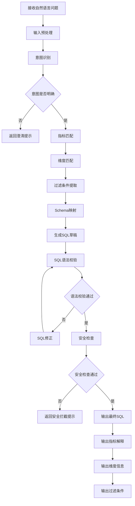
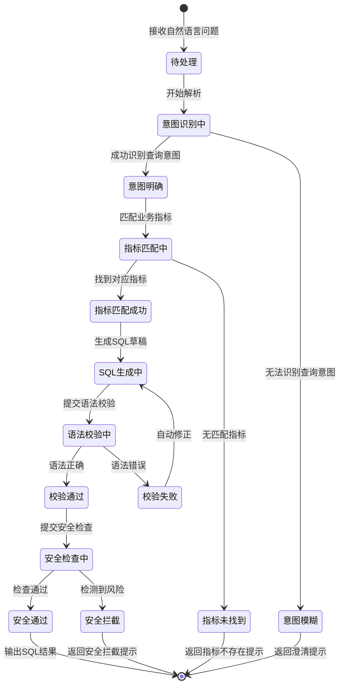

# 智能问数 ChatBI 系统 · NL2SQL 转换功能设计

***

## 文档信息

| 项目   | 内容                   |
| ---- | -------------------- |
| 文档编号 | PRD-CHATBI-2026-002 |
| 文档版本 | v0.1                 |
| 产品名称 | 智能问数 ChatBI 系统       |
| 所属系统 | 智能问数 ChatBI 系统       |
| 编制日期 | 2026-06-12       |
| 编制人员 | -               |

### 修订记录

| 版本   | 修订日期           | 修订说明 | 修订人    |
| ---- | -------------- | ---- | ------ |
| v0.1 | 2026-06-12 | 初稿创建 | - |

***

> **文档撰写规范（重要）**
>
> 1. **严格遵循模板格式**：各章节表格字段必须与模板保持一致
> 2. **聚焦业务规则**：描述业务逻辑、数据约束、权限控制等，不写技术实现细节
> 3. **减少不必要的示例**：不写JSON/XML格式的报文示例，仅描述报文格式以实际接口返回为准
> 4. **页面布局与交互分离**：§四仅描述页面结构（长什么样），§五描述业务规则（怎么操作）

***

## 一、功能角色矩阵说明

### 1.1 功能描述

- **功能名称：** NL2SQL 转换
- **所属模块：** 智能问数主流程
- **功能描述：** 接收用户自然语言问题，结合数据库 Schema 和业务指标字典，通过 NL2SQL 模型将自然语言转换为可执行的 SQL 语句。

### 1.2 角色权限总览

| 角色      | 功能权限                        | 数据权限   |
| ------- | --------------------------- | ------ |
| 业务运营 | 无直接访问，作为主流程内部组件        | 无       |
| 管理层 | 无直接访问，作为主流程内部组件        | 无       |
| 数据分析师 | 查看转换结果、管理Prompt模板、查看准确率统计 | 全量数据   |
| 系统管理员 | 全部配置管理                    | 全量数据   |

### 1.3 功能角色矩阵

| 功能点  | 业务运营 | 管理层 | 数据分析师 | 系统管理员 |
| ---- | :-----: | :-----: | :-----: | :-----: |
| NL2SQL转换执行 |    否    |    否    |    否（自动触发）    |    否（自动触发）    |
| 查看转换结果 |    否    |    否    |    是    |    是    |
| 管理Prompt模板 |    否    |    否    |    是    |    是    |
| 查看准确率统计 |    否    |    否    |    是    |    是    |

***

## 二、模块路径

系统首页 → 智能问数 ChatBI → 系统管理 → NL2SQL 配置管理

***

## 三、状态流转与流程图

### 3.1 业务流程图



### 3.2 状态流转图



***

## 四、页面布局

### 4.1 页面清单

|  序号 | 页面名称    | 页面类型   | 描述                           |
| :-: | ------- | ------ | ---------------------------- |
|  1  | NL2SQL 配置管理页面 | 主页面    | 管理 Prompt 模板、Schema 配置、模型参数 |
|  2  | 准确率统计页面  | 子页面    | 展示 NL2SQL 转换准确率统计数据          |

***

### 4.2 NL2SQL 配置管理页面布局

```
┌─────────────────────────────────────────────────────────────────┐
│  NL2SQL 配置管理                                          [用户头像]  │
├─────────────────────────────────────────────────────────────────┤
│  ┌─────────────┐ ┌─────────────┐ ┌──────┐ ┌──────┐             │
│  │ Prompt模板  │ │ Schema配置  │ │ 模型参数│ │ 准确率│             │
│  └─────────────┘ └─────────────┘ └──────┘ └──────┘             │
├─────────────────────────────────────────────────────────────────┤
│  工具栏区    [+新增模板]  [导入]              [导出]  [保存]     │
├─────────────────────────────────────────────────────────────────┤
│  配置列表区                                                       │
│  ┌────┬──────────┬──────────┬──────────┬──────────┬────────┐  │
│  │ 序号 │ 模板名称  │ 适用场景   │ 模型选择  │ 状态     │ 操作   │  │
│  ├────┼──────────┼──────────┼──────────┼──────────┼────────┤  │
│  │  1  │ 销售指标查询│ 销售类问题 │ qwen-max │ 已启用   │ [编辑] [禁用]│  │
│  │  2  │ 库存查询   │ 库存类问题 │ qwen-max │ 已启用   │ [编辑] [禁用]│  │
│  └────┴──────────┴──────────┴──────────┴──────────┴────────┘  │
├─────────────────────────────────────────────────────────────────┤
│  分页区    [< 1 2 3 ... 5 >]  [每页 10 ▼]  共 48 条            │
└─────────────────────────────────────────────────────────────────┘
```

### 4.2.1 查询条件区

| 组件名称    | 组件类型 | 位置 | 提示语            | 说明        |
| ------- | ---- | -- | -------------- | --------- |
| 模板名称    | 输入框  | 居左 | 请输入模板名称   | 模糊查询     |
| 适用场景    | 下拉框  | 居左 | 请选择适用场景   | 精确查询     |
| 状态      | 下拉框  | 居左 | 请选择状态       | 精确查询     |
| 查询      | 按钮   | 居右 | —              | 主按钮       |
| 重置      | 按钮   | 居右 | —              | 次按钮       |

### 4.2.2 工具栏区

| 组件名称 | 组件类型 | 位置 | 提示语 | 说明          |
| ---- | ---- | -- | --- | ----------- |
| 新增模板   | 按钮   | 居左 | —   | 打开新增/编辑弹窗 |
| 导入   | 按钮   | 居左 | —   | 批量导入模板     |
| 导出   | 按钮   | 居右 | —   | 导出配置列表     |
| 保存   | 按钮   | 居右 | —   | 保存当前配置     |

### 4.2.3 配置列表展示区

| 字段      | 组件类型 | 位置 | 说明                |
| ------- | ---- | -- | ----------------- |
| 序号      | 文本   | 居中 | —                 |
| 模板名称   | 文本   | 居左 | —                 |
| 适用场景   | 文本   | 居左 | —                 |
| 模型选择   | 文本   | 居左 | —                 |
| 状态      | 标签   | 居中 | 已启用/已禁用        |
| 操作      | 按钮组  | 居中 | [编辑] [禁用/启用] [删除] |

### 4.2.4 分页控件区

| 控件    | 组件类型 | 位置 | 说明      |
| ----- | ---- | -- | ------- |
| 总条数   | 文本   | 居左 | 共0条记录   |
| 页码按钮  | 按钮组  | 居中 | 1高亮     |
| 向前翻页  | 按钮   | 居中 | <       |
| 向后翻页  | 按钮   | 居中 | >       |
| 每页条目数 | 下拉框  | 居右 | 默认10条/页 |
| 跳转至页码 | 输入框  | 居右 | 默认1     |

***

### 4.3 新增/编辑模板弹窗布局

```
┌─────────────────────────────────────────────────┐
│  新增 Prompt 模板                          [X]  │
├─────────────────────────────────────────────────┤
│  模板名称*                                      │
│  [输入框                                    ]   │
│                                                 │
│  适用场景*                                      │
│  [下拉框                                      ▼] │
│                                                 │
│  模型选择*                                      │
│  [下拉框                                      ▼] │
│                                                 │
│  系统提示词*                                    │
│  ┌─────────────────────────────────────────┐    │
│  │ [多行文本输入框                            ] │    │
│  │                                           │    │
│  └─────────────────────────────────────────┘    │
│                                                 │
│  Schema 描述                                    │
│  ┌─────────────────────────────────────────┐    │
│  │ [多行文本输入框                            ] │    │
│  │                                           │    │
│  └─────────────────────────────────────────┘    │
│                                                 │
│  指标字典引用                                    │
│  ┌─────────────────────────────────────────┐    │
│  │ [多行文本输入框                            ] │    │
│  └─────────────────────────────────────────┘    │
│                                                 │
│                              [取消]  [确定]      │
└─────────────────────────────────────────────────┘
```

### 4.3.1 表单字段说明

| 字段      | 组件类型 | 位置   | 提示语            | 说明        |
| ------- | ---- | ---- | -------------- | --------- |
| 模板名称   | 输入框  | 独占一行 | 请输入模板名称     | 必填\*，最大50字符 |
| 适用场景   | 下拉框  | 独占一行 | 请选择适用场景     | 必填\*，枚举：销售/库存/财务/综合 |
| 模型选择   | 下拉框  | 独占一行 | 请选择模型        | 必填\*，枚举：qwen-max/qwen-plus |
| 系统提示词  | 多行文本  | 独占一行 | 请输入系统提示词    | 必填\*，最大2000字符 |
| Schema描述 | 多行文本  | 独占一行 | 请输入Schema描述   | 可选，最大5000字符 |
| 指标字典引用 | 多行文本  | 独占一行 | 请输入指标字典内容  | 可选，最大3000字符 |

### 4.3.2 按钮区

| 按钮 | 组件类型 | 位置 | 说明       |
| -- | ---- | -- | -------- |
| 取消 | 按钮   | 居右 | 关闭弹窗     |
| 确定 | 按钮   | 居右 | 灰化→合规后可用 |

***

### 4.4 准确率统计页面布局

```
┌─────────────────────────────────────────────────────────────────┐
│  NL2SQL 准确率统计                                               │
├─────────────────────────────────────────────────────────────────┤
│  ┌─────────────┐ ┌─────────────┐ ┌─────────────┐               │
│  │ 总查询数    │ │ 成功数      │ │ 准确率      │               │
│  │   1,256     │ │   1,068     │ │   85.0%    │               │
│  └─────────────┘ └─────────────┘ └─────────────┘               │
├─────────────────────────────────────────────────────────────────┤
│  趋势图区域                                                       │
│  ┌─────────────────────────────────────────────────────────┐    │
│  │ [折线图：近30天准确率趋势]                                  │    │
│  └─────────────────────────────────────────────