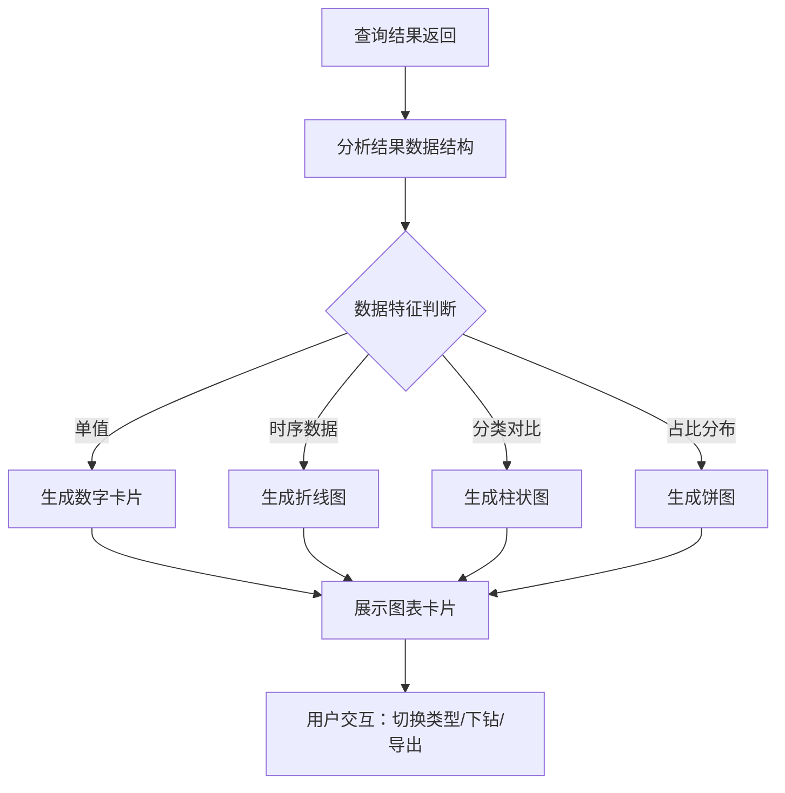
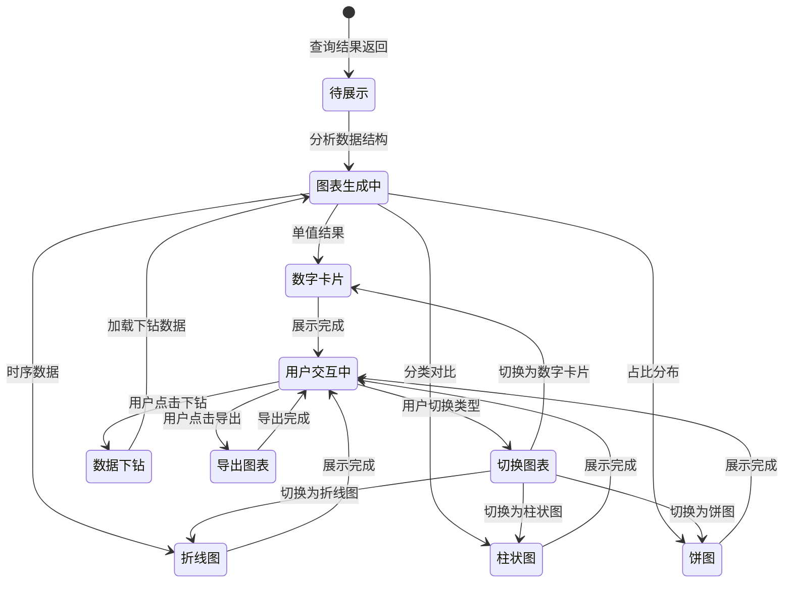

# 智能问数 ChatBI 系统 · 可视化展示功能设计

***

## 文档信息

| 项目   | 内容                   |
| ---- | -------------------- |
| 文档编号 | PRD-CHATBI-2026-004 |
| 文档版本 | v0.1                 |
| 产品名称 | 智能问数 ChatBI 系统       |
| 所属系统 | 智能问数 ChatBI 系统       |
| 编制日期 | 2026-06-12       |
| 编制人员 | -               |

### 修订记录

| 版本   | 修订日期           | 修订说明 | 修订人    |
| ---- | -------------- | ---- | ------ |
| v0.1 | 2026-06-12 | 初稿创建 | - |

***

> **文档撰写规范（重要）**
>
> 1. **严格遵循模板格式**：各章节表格字段必须与模板保持一致
> 2. **聚焦业务规则**：描述业务逻辑、数据约束、权限控制等，不写技术实现细节
> 3. **减少不必要的示例**：不写JSON/XML格式的报文示例，仅描述报文格式以实际接口返回为准
> 4. **页面布局与交互分离**：§四仅描述页面结构（长什么样），§五描述业务规则（怎么操作）

***

## 一、功能角色矩阵说明

### 1.1 功能描述

- **功能名称：** 可视化展示
- **所属模块：** 智能问数主流程
- **功能描述：** 根据查询结果自动生成数据图表（数字卡片、柱状图、折线图、饼图），并支持图表类型切换、数据下钻和图表导出。

### 1.2 角色权限总览

| 角色      | 功能权限                        | 数据权限   |
| ------- | --------------------------- | ------ |
| 业务运营 | 查看图表、切换图表类型、导出图表      | 权限范围内数据   |
| 管理层 | 查看图表、切换图表类型、导出图表、数据下钻 | 全量汇总数据   |
| 数据分析师 | 查看图表、切换图表类型、导出图表、数据下钻、配置图表 | 全量数据   |
| 系统管理员 | 全部功能                    | 全量数据   |

### 1.3 功能角色矩阵

| 功能点  | 业务运营 | 管理层 | 数据分析师 | 系统管理员 |
| ---- | :-----: | :-----: | :-----: | :-----: |
| 查看数字卡片 |    是    |    是    |    是    |    是    |
| 查看柱状图 |    是    |    是    |    是    |    是    |
| 查看折线图 |    是    |    是    |    是    |    是    |
| 查看饼图  |    是    |    是    |    是    |    是    |
| 切换图表类型 |    是    |    是    |    是    |    是    |
| 数据下钻  |    否    |    是    |    是    |    是    |
| 导出图表  |    是    |    是    |    是    |    是    |
| 配置图表模板 |    否    |    否    |    是    |    是    |

***

## 二、模块路径

系统首页 → 智能问数 ChatBI → 对话查询页面 → 可视化展示卡片

***

## 三、状态流转与流程图

### 3.1 业务流程图



### 3.2 状态流转图



***

## 四、页面布局

### 4.1 页面清单

|  序号 | 页面名称    | 页面类型   | 描述                           |
| :-: | ------- | ------ | ---------------------------- |
|  1  | 图表展示卡片 | 组件     | 嵌入对话区的图表展示组件              |
|  2  | 图表配置页面 | 配置页面   | 管理员配置图表模板和默认展示规则         |

***

### 4.2 图表展示卡片布局

```
┌─────────────────────────────────────────────────┐
│  查询结果                                    [⚙设置] │
├─────────────────────────────────────────────────┤
│  ┌─────────────────────────────────────────┐    │
│  │ 📊 今日成都区域销售额                      │    │
│  │                                          │    │
│  │         ¥125,680.00                      │    │
│  │         ↑ 5.2% 较昨日                    │    │
│  │                                          │    │
│  │ [数字] [柱状图] [折线图] [饼图]  [📥导出]  │    │
│  └─────────────────────────────────────────┘    │
│                                                 │
│  ┌─────────────────────────────────────────┐    │
│  │ 📈 近7天销售趋势                          │    │
│  │                                          │    │
│  │  150k ┤                                  │    │
│  │       │    ╭─╮                           │    │
│  │  100k ┤╭──╯  ╰──╮                       │    │
│  │       │          ╰──╮                    │    │
│  │   50k ┤             ╰──╮                │    │
│  │       │                ╰──              │    │
│  │    0  ┼──┬──┬──┬──┬──┬──┬──             │    │
│  │       周一 周二 周三 周四 周五 周六 周日    │    │
│  │                                          │    │
│  │ [数字] [柱状图] [折线图] [饼图]  [📥导出]  │    │
│  │                                          │    │
│  │ 💡 点击柱状图可下钻查看门店明细              │    │
│  └─────────────────────────────────────────┘    │
└─────────────────────────────────────────────────┘
```

### 4.2.1 图表卡片组件

| 组件名称    | 组件类型 | 位置 | 提示语            | 说明        |
| ------- | ---- | -- | -------------- | --------- |
| 图表标题    | 文本   | 顶部居左 | —              | 只读，根据查询结果自动生成 |
| 图表内容区  | 图表组件 | 居中 | —              | 根据图表类型展示对应图表 |
| 图表类型切换 | 按钮组  | 底部居左 | —              | 数字/柱状图/折线图/饼图 |
| 导出按钮    | 按钮   | 底部居右 | 导出            | 导出图表为图片 |
| 设置按钮    | 按钮   | 右上角 | —              | 打开图表配置（仅管理员可见） |

### 4.2.2 图表类型切换说明

| 图表类型 | 适用场景 | 展示内容 |
| ------- | ------- | ------- |
| 数字卡片 | 单值结果（如总销售额） | 数值 + 同比/环比变化 |
| 柱状图 | 分类对比（如各区域销售对比） | 各分类的数值对比 |
| 折线图 | 趋势变化（如近7天趋势） | 时间序列数据的变化趋势 |
| 饼图 | 占比分布（如各品类占比） | 各部分占总体的比例 |

***

### 4.3 图表配置页面布局

```
┌─────────────────────────────────────────────────────────────────┐
│  图表配置管理                                                    │
├─────────────────────────────────────────────────────────────────┤
│  工具栏区    [+新增配置]              [导出]  [保存]              │
├─────────────────────────────────────────────────────────────────┤
│  配置列表区                                                       │
│  ┌────┬──────────┬──────────┬──────────┬──────────┬────────┐  │
│  │ 序号 │ 配置名称  │ 适用场景   │ 默认图表  │ 状态     │ 操作   │  │
│  ├────┼──────────┼──────────┼──────────┼──────────┼────────┤  │
│  │  1  │ 销售指标   │ 销售类查询 │ 数字卡片  │ 已启用   │ [编辑] [禁用]│  │
│  │  2  │ 趋势分析   │ 趋势类查询 │ 折线图   │ 已启用   │ [编辑] [禁用]│  │
│  │  3  │ 对比分析   │ 对比类查询 │ 柱状图   │ 已启用   │ [编辑] [禁用]│  │
│  └────┴──────────┴──────────┴──────────┴──────────┴────────┘  │
├─────────────────────────────────────────────────────────────────┤
│  分页区    [< 1 2 3 ... 5 >]  [每页 10 ▼]  共 15 条            │
└─────────────────────────────────────────────────────────────────┘
```

### 4.3.1 工具栏区

| 组件名称 | 组件类型 | 位置 | 提示语 | 说明          |
| ---- | ---- | -- | --- | ----------- |
| 新增配置   | 按钮   | 居左 | —   | 打开新增/编辑弹窗 |
| 导出   | 按钮   | 居右 | —   | 导出配置列表     |
| 保存   | 按钮   | 居右 | —   | 保存当前配置     |

### 4.3.2 配置列表展示区

| 字段      | 组件类型 | 位置 | 说明                |
| ------- | ---- | -- | ----------------- |
| 序号      | 文本   | 居中 | —                 |
| 配置名称   | 文本   | 居左 | —                 |
| 适用场景   | 文本   | 居左 | —                 |
| 默认图表类型 | 文本   | 居左 | 数字卡片/柱状图/折线图/饼图 |
| 状态      | 标签   | 居中 | 已启用/已禁用        |
| 操作      | 按钮组  | 居中 | [编辑] [禁用/启用] [删除] |

***

### 4.4 新增/编辑图表配置弹窗布局

```
┌─────────────────────────────────────────────────┐
│  新增图表配置                              [X]  │
├─────────────────────────────────────────────────┤
│  配置名称*                                      │
│  [输入框                                    ]   │
│                                                 │
│  适用场景*                                      │
│  [下拉框                                      ▼] │
│                                                 │
│  默认图表类型*                                   │
│  [下拉框                                      ▼] │
│                                                 │
│  数据字段映射                                    │
│  ┌─────────────────────────────────────────┐    │
│  │ X轴字段：[下拉框 ▼]                       │    │
│  │ Y轴字段：[下拉框 ▼]                       │    │
│  │ 分组字段：[下拉框 ▼]（可选）                │    │
│  └─────────────────────────────────────────┘    │
│                                                 │
│                              [取消]  [确定]      │
└─────────────────────────────────────────────────┘
```

### 4.4.1 表单字段说明

| 字段      | 组件类型 | 位置   | 提示语            | 说明        |
| ------- | ---- | ---- | -------------- | --------- |
| 配置名称   | 输入框  | 独占一行 | 请输入配置名称     | 必填\*，最大50字符 |
| 适用场景   | 下拉框  | 独占一行 | 请选择适用场景     | 必填\*，枚举：销售/库存/财务/综合 |
| 默认图表类型 | 下拉框  | 独占一行 | 请选择默认图表类型  | 必填\*，枚举：数字卡片/柱状图/折线图/饼图 |
| X轴字段   | 下拉框  | 独占一行 | 请选择X轴字段     | 必填\*，从查询结果字段列表选择 |
| Y轴字段   | 下拉框  | 独占一行 | 请选择Y轴字段     | 必填\*，从查询结果字段列表选择 |
| 分组字段   | 下拉框  | 独占一行 | 请选择分组字段     | 可选，从查询结果字段列表选择 |

***

## 五、页面交互说明

### 5.1 图表展示卡片交互说明

#### 5.1.1 操作交互逻辑

| 操作类型 | 触发操作     | 交互可用性       | 正向输出                                        | 异常场景                                           | 异常处理             | 日志级别 |
| ---- | -------- | ----------- | ------------------------------------------- | ---------------------------------------------- | ---------------- | ---- |
| 切换图表类型 | 点击图表类型按钮 | 始终可用 | 切换为对应类型的图表展示 | 当前数据不支持该图表类型 | 按钮灰化不可点击 | 不记录  |
| 数据下钻 | 点击图表数据点 | 有下钻维度时可用 | 加载下钻数据，更新图表展示 | 无下钻维度 | 按钮不显示 | 接口级  |
| 导出图表 | 点击"导出"按钮 | 始终可用 | 下载图表为PNG图片到本地 | 无图表数据 | 按钮灰化不可点击 | 接口级  |

> **导出文件命名规范**：
>
> - 格式：`{业务前缀}_{YYYYMMDD}_{HHMMSS}.png`
> - 示例：`ChatBI销售趋势_20260612_103045.png`
> - 时间戳：年月日(8位) + 时分秒(6位)，确保文件名唯一性

#### 5.1.2 图表展示规则

| 规则项  | 说明                                   |
| ---- | ------------------------------------ |
| 自动推荐  | 系统根据数据特征自动推荐最合适的图表类型作为默认展示       |
| 数据标签  | 图表上显示数据标签，鼠标悬停显示详细数值              |
| 下钻提示  | 有下钻维度时，图表底部显示"点击可下钻查看明细"提示       |
| 空数据  | 查询结果为空时，显示"暂无数据可展示"提示              |

***

### 5.2 图表配置页面交互说明

#### 5.2.1 字段交互规则

| 字段        | 类型  | 是否必填 | 约束规则                  | 展示规则 | 举例或枚举       |
| --------- | --- | :--: | --------------------- | ---- | ----------- |
| 配置名称   | 输入框 |   是  | 最大50字符               | 明文   | 销售指标配置     |
| 适用场景   | 下拉框 |   是  | 精确查询                  | 明文   | 销售/库存/财务/综合 |
| 默认图表类型 | 下拉框 |   是  | 精确查询                  | 明文   | 数字卡片/柱状图/折线图/饼图 |
| X轴字段   | 下拉框 |   是  | 从查询结果字段列表选择         | 明文   | 日期/区域/门店   |
| Y轴字段   | 下拉框 |   是  | 从查询结果字段列表选择         | 明文   | 销售额/订单量    |
| 分组字段   | 下拉框 |   否  | 从查询结果字段列表选择         | 明文   | 品类/品牌       |

#### 5.2.2 操作交互逻辑

| 操作类型 | 触发操作     | 交互可用性       | 正向输出                                        | 异常场景                                           | 异常处理             | 日志级别 |
| ---- | -------- | ----------- | ------------------------------------------- | ---------------------------------------------- | ---------------- | ---- |
| 新增配置 | 点击"新增配置" | 始终可用 | 打开新增配置弹窗 | 无 | 无 | 接口级  |
| 编辑配置 | 点击"编辑" | 始终可用 | 打开编辑配置弹窗，反显当前数据 | 无 | 无 | 接口级  |
| 删除配置 | 点击"删除" | 始终可用 | 弹出确认弹窗"是否确认删除？"；确认后删除，刷新列表 | 删除失败 | Toast提示"删除失败" | 接口级  |
| 启用/禁用 | 点击"启用/禁用" | 始终可用 | 切换配置状态，刷新列表 | 无 | 无 | 接口级  |
| 保存 | 点击"保存" | 必填字段全部合规后可用 | 保存成功，Toast提示"保存成功" | 保存失败 | Toast提示"保存失败" | 接口级  |

#### 5.2.3 弹窗说明

| 规则项  | 说明                                   |
| ---- | ------------------------------------ |
| 打开方式 | 点击"新增配置"或"编辑"按钮                    |
| 标题   | 新增时显示"新增图表配置"；编辑时显示"编辑图表配置"     |
| 数据反显 | 编辑时自动回填当前配置数据；新增时所有字段为空           |
| 校验时机 | 字段失焦时触发单字段校验；点击"确定"时触发全量校验        |
| 保存规则 | 全部校验通过后提交保存；校验失败时字段下方显示红色提示文本    |

***

## 六、错误处理规范

### 6.1 图表展示错误

| 场景      | 触发条件                         | 提示文案                    | 处理方式                       |
| ------- | ---------------------------- | ----------------------- | -------------------------- |
| 数据为空  | 查询结果无数据                     | 暂无数据可展示                | 显示空状态提示                  |
| 图表渲染失败 | 数据格式不支持图表渲染               | 图表渲染失败，请尝试其他图表类型     | 自动降级为表格展示                |
| 导出失败  | 图片生成失败                     | 导出失败，请稍后重试            | Toast提示                    |

### 6.2 配置校验错误

| 字段      | 为空时错误信息     | 格式错误时信息           |
| ------- | ----------- | ----------------- |
| 配置名称   | 请输入配置名称 | 配置名称不能超过50字符 |
| 适用场景   | 请选择适用场景 | — |
| 默认图表类型 | 请选择默认图表类型 | — |
| X轴字段   | 请选择X轴字段 | — |
| Y轴字段   | 请选择Y轴字段 | — |

***

## 七、非功能性需求

### 7.1 合规与安全要求

| 适用规范       | 内容摘要              | 本模块特有说明                    |
| ---------- | ----------------- | -------------------------- |
| 访问控制   | RBAC最小权限、数据权限隔离   | 图表展示的数据范围受用户数据权限控制       |
| 操作日志   | 字段级日志、保留期限、不可篡改   | 覆盖操作：查看图表、导出图表、配置图表       |

### 7.2 性能需求

| 需求项       | 指标要求          | 说明            |
| --------- | ------------- | ------------- |
| 图表渲染时间  | ≤ 2s          | 1000条以内数据的图表渲染 |
| 图表切换时间  | ≤ 1s          | 同数据不同图表类型切换   |
| 导出图片时间  | ≤ 3s          | 单张图表导出为图片     |

***

## 八、特殊说明

### 8.1 图表自动推荐规则

1. 单值结果（1行1列）→ 数字卡片
2. 时间序列数据（X轴为日期）→ 折线图
3. 分类对比数据（X轴为分类）→ 柱状图
4. 占比分布数据（各部分占比）→ 饼图

### 8.2 数据下钻规则

1. 下钻维度由查询结果中的层级关系决定
2. 例如：区域 → 门店 → 订单明细
3. 下钻后自动更新图表标题和数据
4. 支持返回上一级查看

### 8.3 其他特殊规则

1. 图表颜色方案统一使用企业标准色板
2. 图表支持响应式布局，适配不同屏幕尺寸
3. 饼图最多展示10个分类，超出部分合并为"其他"

***

## 九、数据字典

### 9.1 字典项定义

**图表类型（chartType）**

| 枚举值（code） | 显示文本（label） | 说明     |
| :-------: | ----------- | ------ |
|     1     | 数字卡片     | 单值展示   |
|     2     | 柱状图      | 分类对比   |
|     3     | 折线图      | 趋势变化   |
|     4     | 饼图       | 占比分布   |

**图表配置状态（chartConfigStatus）**

| 枚举值（code） | 显示文本（label） | 说明     |
| :-------: | ----------- | ------ |
|     0     | 已禁用     | 配置已禁用   |
|     1     | 已启用     | 配置已启用   |

**适用场景（applicableScene）**

| 枚举值（code） | 显示文本（label） | 说明     |
| :-------: | ----------- | ------ |
|     1     | 销售       | 销售类查询   |
|     2     | 库存       | 库存类查询   |
|     3     | 财务       | 财务类查询   |
|     4     | 综合       | 综合类查询   |

***

## 十、外部系统接口说明

### 10.1 接口清单

| 接口名称    | 功能描述           | 交互方向     | 依赖系统     | 数据流向                    |
| ------- | -------------- | -------- | -------- | ----------------------- |
| 图表配置查询接口 | 获取图表配置列表 | 调用 | 图表配置模块 | 本系统→图表配置模块→本系统 |
| 图表配置保存接口 | 保存图表配置 | 调用 | 图表配置模块 | 本系统→图表配置模块 |
| 下钻数据接口 | 获取下钻数据 | 调用 | 数据查询模块 | 本系统→数据查询模块→本系统 |

### 10.2 接口详细说明

**图表配置查询接口**

| 规则项  | 说明                    |
| ---- | --------------------- |
| 触发时机 | 查询结果返回后，根据查询类型匹配图表配置 |
| 请求条件 | 查询类型已确定              |
| 成功处理 | 返回匹配的图表配置，确定默认图表类型   |
| 失败处理 | 使用系统默认配置              |
| 重试机制 | 不自动重试                  |

**下钻数据接口**

| 规则项  | 说明                    |
| ---- | --------------------- |
| 触发时机 | 用户点击图表数据点时调用         |
| 请求条件 | 存在下钻维度，点击数据点有效       |
| 成功处理 | 返回下钻数据，更新图表           |
| 失败处理 | 返回下钻失败提示              |
| 重试机制 | 不自动重试                  |

***

*文档结束*
