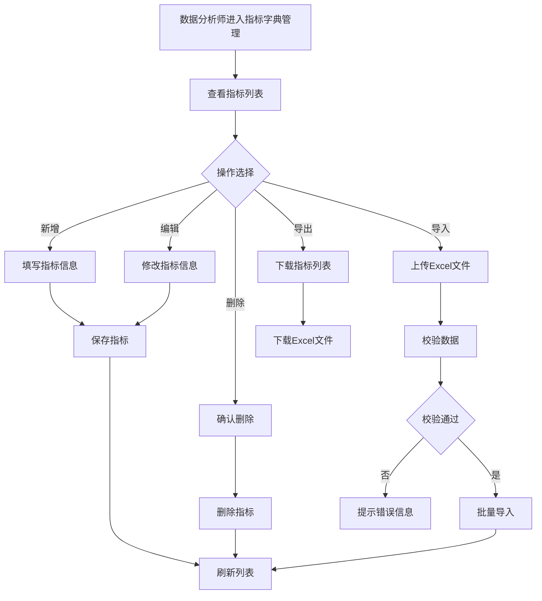
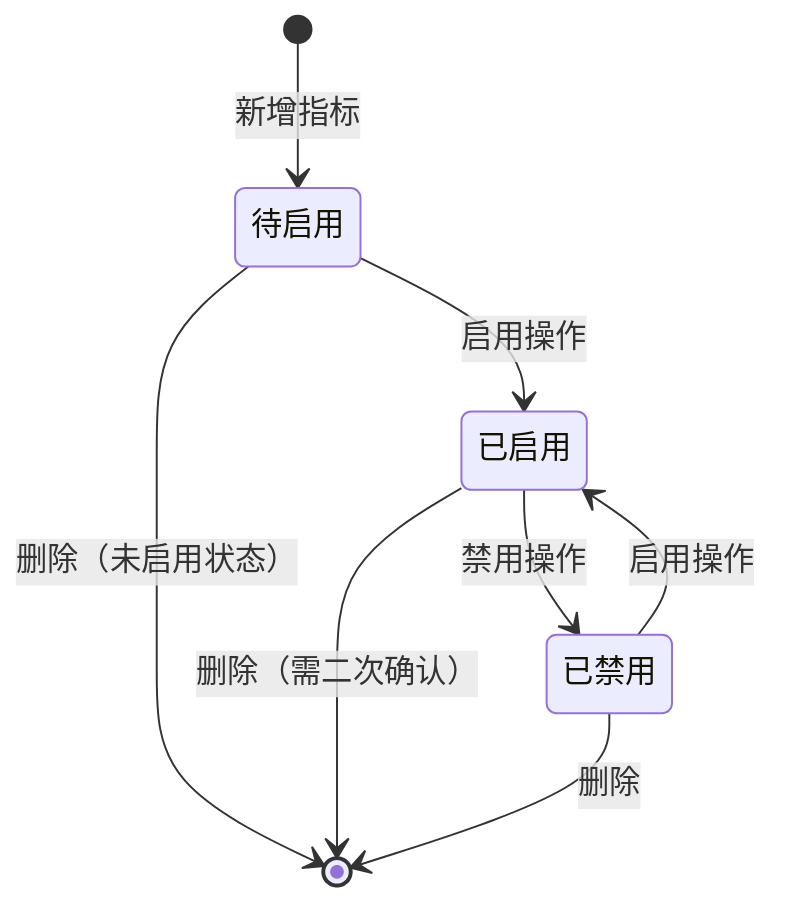

# 智能问数 ChatBI 系统 · 指标字典管理功能设计

***

## 文档信息

| 项目   | 内容                   |
| ---- | -------------------- |
| 文档编号 | PRD-CHATBI-2026-009 |
| 文档版本 | v0.1                 |
| 产品名称 | 智能问数 ChatBI 系统       |
| 所属系统 | 智能问数 ChatBI 系统       |
| 编制日期 | 2026-06-12       |
| 编制人员 | -               |

### 修订记录

| 版本   | 修订日期           | 修订说明 | 修订人    |
| ---- | -------------- | ---- | ------ |
| v0.1 | 2026-06-12 | 初稿创建 | - |

***

> **文档撰写规范（重要）**
>
> 1. **严格遵循模板格式**：各章节表格字段必须与模板保持一致
> 2. **聚焦业务规则**：描述业务逻辑、数据约束、权限控制等，不写技术实现细节
> 3. **减少不必要的示例**：不写JSON/XML格式的报文示例，仅描述报文格式以实际接口返回为准
> 4. **页面布局与交互分离**：§四仅描述页面结构（长什么样），§五描述业务规则（怎么操作）

***

## 一、功能角色矩阵说明

### 1.1 功能描述

- **功能名称：** 指标字典管理
- **所属模块:** 系统管理
- **功能描述：** 管理业务指标的名称、编码、定义、计算公式、数据源等元数据，为 NL2SQL 转换提供业务语义支撑，确保自然语言问题能准确映射到业务指标。

### 1.2 角色权限总览

| 角色      | 功能权限                        | 数据权限   |
| ------- | --------------------------- | ------ |
| 业务运营 | 查看指标字典                    | 已启用指标   |
| 管理层 | 查看指标字典                    | 已启用指标   |
| 数据分析师 | 查看、新增、编辑、删除、启用/禁用指标字典 | 全量数据   |
| 系统管理员 | 全部功能                    | 全量数据   |

### 1.3 功能角色矩阵

| 功能点  | 业务运营 | 管理层 | 数据分析师 | 系统管理员 |
| ---- | :-----: | :-----: | :-----: | :-----: |
| 查看指标字典 |    是    |    是    |    是    |    是    |
| 新增指标 |    否    |    否    |    是    |    是    |
| 编辑指标 |    否    |    否    |    是    |    是    |
| 删除指标 |    否    |    否    |    是    |    是    |
| 启用/禁用指标 |    否    |    否    |    是    |    是    |
| 导入指标 |    否    |    否    |    是    |    是    |
| 导出指标 |    否    |    否    |    是    |    是    |

***

## 二、模块路径

系统首页 → 智能问数 ChatBI → 系统管理 → 指标字典管理

***

## 三、状态流转与流程图

### 3.1 业务流程图



### 3.2 状态流转图



***

## 四、页面布局

### 4.1 页面清单

|  序号 | 页面名称    | 页面类型   | 描述                           |
| :-: | ------- | ------ | ---------------------------- |
|  1  | 指标字典列表页面 | 主页面    | 展示指标字典列表，支持增删改查和导入导出    |

***

### 4.2 指标字典列表页面布局

```
┌─────────────────────────────────────────────────────────────────┐
│  指标字典管理                                                    │
├─────────────────────────────────────────────────────────────────┤
│  ┌─────────────┐ ┌─────────────┐ ┌─────────────┐ ┌──────┐     │
│  │ 指标名称    │ │ 指标编码    │ │ 状态        │ │ 查询 │     │
│  │ [输入      ]│ │ [输入      ]│ │ [下拉框    ▼]│ │ 按钮 │     │
│  └─────────────┘ └─────────────┘ └─────────────┘ └──────┘     │
├─────────────────────────────────────────────────────────────────┤
│  工具栏区    [+新增]  [导入]  [导出]              [保存]        │
├─────────────────────────────────────────────────────────────────┤
│  指标字典列表                                                     │
│  ┌────┬──────────┬──────────┬──────────┬──────────┬────────┐  │
│  │ 序号 │ 指标名称  │ 指标编码  │ 更新频率  │ 状态     │ 操作   │  │
│  ├────┼──────────┼──────────┼──────────┼──────────┼────────┤  │
│  │  1  │ 销售额   │ SALES_AMT│ 每日     │ 已启用   │ [编辑] [禁用]│  │
│  │  2  │ 订单量   │ ORDER_CNT│ 实时     │ 已启用   │ [编辑] [禁用]│  │
│  │  3  │ 客单价   │ AVG_PRICE│ 每日     │ 已禁用   │ [编辑] [启用]│  │
│  └────┴──────────┴──────────┴──────────┴──────────┴────────┘  │
├─────────────────────────────────────────────────────────────────┤
│  分页区    [< 1 2 3 ... 5 >]  [每页 10 ▼]  共 85 条            │
└─────────────────────────────────────────────────────────────────┘
```

### 4.2.1 查询条件区

| 组件名称    | 组件类型 | 位置 | 提示语            | 说明        |
| ------- | ---- | -- | -------------- | --------- |
| 指标名称    | 输入框  | 居左 | 请输入指标名称   | 模糊查询     |
| 指标编码    | 输入框  | 居左 | 请输入指标编码   | 模糊查询     |
| 状态      | 下拉框  | 居左 | 请选择状态       | 精确查询     |
| 查询      | 按钮   | 居右 | —              | 主按钮       |

### 4.2.2 工具栏区

| 组件名称 | 组件类型 | 位置 | 提示语 | 说明          |
| ---- | ---- | -- | --- | ----------- |
| 新增   | 按钮   | 居左 | —   | 打开新增/编辑弹窗 |
| 导入   | 按钮   | 居左 | —   | 批量导入指标     |
| 导出   | 按钮   | 居左 | —   | 导出指标列表     |
| 保存   | 按钮   | 居右 | —   | 保存当前配置     |

### 4.2.3 指标字典列表展示区

| 字段      | 组件类型 | 位置 | 说明                |
| ------- | ---- | -- | ----------------- |
| 序号      | 文本   | 居中 | —                 |
| 指标名称   | 文本   | 居左 | —                 |
| 指标编码   | 文本   | 居左 | —                 |
| 更新频率   | 文本   | 居左 | 实时/每日/每周       |
| 状态      | 标签   | 居中 | 已启用/已禁用        |
| 操作      | 按钮组  | 居中 | [编辑] [禁用/启用] [删除] |

***

### 4.3 新增/编辑指标弹窗布局

```
┌─────────────────────────────────────────────────┐
│  新增指标                                  [X]  │
├─────────────────────────────────────────────────┤
│  指标名称*                                      │
│  [输入框                                    ]   │
│                                                 │
│  指标编码*                                      │
│  [输入框                                    ]   │
│                                                 │
│  指标定义*                                      │
│  ┌─────────────────────────────────────────┐    │
│  │ [多行文本输入框                            ] │    │
│  └─────────────────────────────────────────┘    │
│                                                 │
│  计算公式                                       │
│  ┌─────────────────────────────────────────┐    │
│  │ [多行文本输入框                            ] │    │
│  └─────────────────────────────────────────┘    │
│                                                 │
│  数据源*                                        │
│  [输入框                                    ]   │
│                                                 │
│  更新频率*                                      │
│  [下拉框                                      ▼] │
│                                                 │
│  负责人*                                        │
│  [人员选择器                                  ▼] │
│                                                 │
│  状态*                                          │
│  [下拉框                                      ▼] │
│                                                 │
│                              [取消]  [确定]      │
└─────────────────────────────────────────────────┘
```

### 4.3.1 表单字段说明

| 字段      | 组件类型 | 位置   | 提示语            | 说明        |
| ------- | ---- | ---- | -------------- | --------- |
| 指标名称   | 输入框  | 独占一行 | 请输入指标名称     | 必填\*，最大100字符 |
| 指标编码   | 输入框  | 独占一行 | 请输入指标编码     | 必填\*，最大50字符，唯一 |
| 指标定义   | 多行文本  | 独占一行 | 请输入指标定义     | 必填\*，最大500字符 |
| 计算公式   | 多行文本  | 独占一行 | 请输入计算公式     | 可选，最大1000字符 |
| 数据源    | 输入框  | 独占一行 | 请输入数据源      | 必填\*，最大200字符 |
| 更新频率   | 下拉框  | 独占一行 | 请选择更新频率     | 必填\*，枚举：实时/每日/每周 |
| 负责人    | 人员选择器 | 独占一行 | 请选择负责人      | 必填\*，从钉钉用户列表选择 |
| 状态      | 下拉框  | 独占一行 | 请选择状态        | 必填\*，枚举：启用/禁用 |

### 4.3.2 按钮区

| 按钮 | 组件类型 | 位置 | 说明       |
| -- | ---- | -- | -------- |
| 取消 | 按钮   | 居右 | 关闭弹窗     |
| 确定 | 按钮   | 居右 | 灰化→合规后可用 |

***

### 4.4 批量导入弹窗布局

```
┌─────────────────────────────────────────────────┐
│  批量导入指标                              [X]  │
├─────────────────────────────────────────────────┤
│  ┌─────────────────────────────────────────┐    │
│  │           点击或拖拽上传文件              │    │
│  │              [.xlsx 文件]                │    │
│  └─────────────────────────────────────────┘    │
│                                                 │
│  导入说明：                                      │
│  - 仅支持 .xlsx 格式                             │
│  - 文件大小不超过 10MB                           │
│  - 单次导入不超过 500 条                          │
│  - [下载导入模板]                                │
│                                                 │
│                              [取消]  [导入]      │
└─────────────────────────────────────────────────┘
```

### 4.4.1 导入字段说明

| 字段名称    | 是否必填 | 填写规则     | 填写示例   |
| ------- | :--: | -------- | ------ |
| 指标名称   |   是  | 最大100字符 | 销售额   |
| 指标编码   |   是  | 最大50字符，唯一 | SALES_AMT |
| 指标定义   |   是  | 最大500字符 | 销售订单的总金额 |
| 计算公式   |   否  | 最大1000字符 | SUM(amount) |
| 数据源    |   是  | 最大200字符 | sales表   |
| 更新频率   |   是  | 实时/每日/每周 | 每日    |
| 负责人    |   是  | 钉钉用户ID  | user123  |
| 状态      |   是  | 启用/禁用   | 启用    |

***

## 五、页面交互说明

### 5.1 指标字典列表页面交互说明

#### 5.1.1 字段交互规则

| 字段        | 类型  | 是否必填 | 约束规则                  | 展示规则 | 举例或枚举       |
| --------- | --- | :--: | --------------------- | ---- | ----------- |
| 指标名称   | 输入框 |   否  | 最大100字符，模糊搜索        | 明文   | 销售额        |
| 指标编码   | 输入框 |   否  | 最大50字符，模糊搜索         | 明文   | SALES_AMT   |
| 状态      | 下拉框 |   否  | 精确查询                  | 明文   | 已启用/已禁用    |

#### 5.1.2 操作交互逻辑

| 操作类型 | 触发操作     | 交互可用性       | 正向输出                                        | 异常场景                                           | 异常处理             | 日志级别 |
| ---- | -------- | ----------- | ------------------------------------------- | ---------------------------------------------- | ---------------- | ---- |
| 查询   | 点击"查询"按钮 | 始终可用        | 按条件筛选指标列表，结果在列表中展示，分页同步更新 | 无 | 无 | 接口级  |
| 新增   | 点击"新增"   | 始终可用        | 打开新增指标弹窗 | 无 | 无 | 接口级  |
| 编辑   | 点击"编辑"   | 始终可用        | 打开编辑指标弹窗，反显当前数据 | 无 | 无 | 接口级  |
| 删除   | 点击"删除"   | 始终可用        | 弹出确认弹窗"是否确认删除？"；确认后删除，刷新列表 | 删除失败 | Toast提示"删除失败" | 接口级  |
| 启用/禁用 | 点击"启用/禁用" | 始终可用    | 切换状态，刷新列表 | 无 | 无 | 接口级  |
| 导入   | 点击"导入"   | 始终可用        | 打开批量导入弹窗 | 无 | 无 | 接口级  |
| 导出   | 点击"导出"   | 始终可用        | 下载Excel文件到本地 | 无数据 | Toast提示"暂无数据可导出" | 接口级  |

> **导出文件命名规范**：
>
> - 格式：`{业务前缀}_{YYYYMMDD}_{HHMMSS}.xlsx`
> - 示例：`ChatBI指标字典_20260612_103045.xlsx`
> - 时间戳：年月日(8位) + 时分秒(6位)，确保文件名唯一性
> - 导入模板：使用固定名称 `指标字典批量导入模板.xlsx`（不带时间戳）

#### 5.1.3 弹窗说明

| 规则项  | 说明                                   |
| ---- | ------------------------------------ |
| 打开方式 | 点击"新增"或"编辑"按钮                    |
| 标题