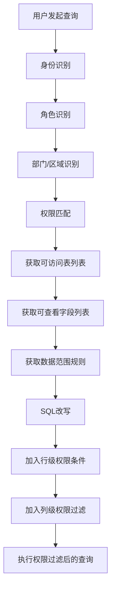
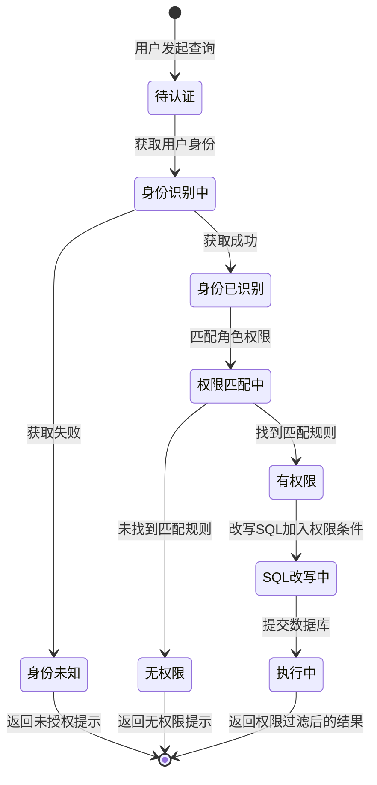
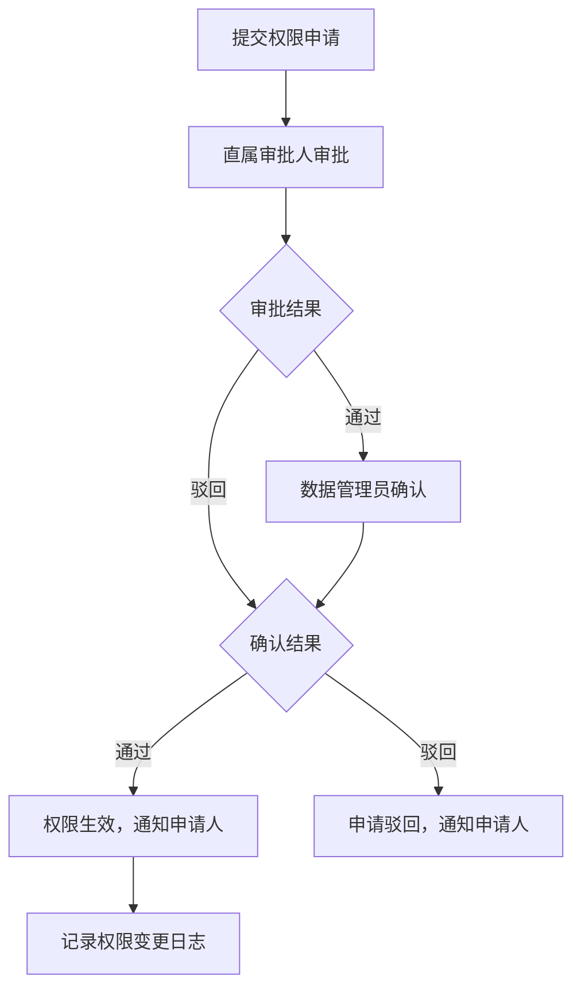

> **文档快照** | 版本 v0.1 | 生成时间 20260612
> 本文档由智能体需求文档生成skill自动生成

---

# 智能问数 ChatBI 系统 · 数据权限控制功能设计

***

## 文档信息

| 项目   | 内容                   |
| ---- | -------------------- |
| 文档编号 | PRD-CHATBI-2026-005 |
| 文档版本 | v0.1                 |
| 产品名称 | 智能问数 ChatBI 系统       |
| 所属系统 | 智能问数 ChatBI 系统       |
| 编制日期 | 2026-06-12       |
| 编制人员 | -               |

### 修订记录

| 版本   | 修订日期           | 修订说明 | 修订人    |
| ---- | -------------- | ---- | ------ |
| v0.1 | 2026-06-12 | 初稿创建 | - |

***

> **文档撰写规范（重要）**
>
> 1. **严格遵循模板格式**：各章节表格字段必须与模板保持一致
> 2. **聚焦业务规则**：描述业务逻辑、数据约束、权限控制等，不写技术实现细节
> 3. **减少不必要的示例**：不写JSON/XML格式的报文示例，仅描述报文格式以实际接口返回为准
> 4. **页面布局与交互分离**：§四仅描述页面结构（长什么样），§五描述业务规则（怎么操作）

***

## 一、功能角色矩阵说明

### 1.1 功能描述

- **功能名称：** 数据权限控制
- **所属模块：** 权限与安全
- **功能描述：** 基于用户角色和部门/区域，控制用户可访问的数据表、数据字段和数据范围，确保查询结果仅返回权限内的数据。

### 1.2 角色权限总览

| 角色      | 功能权限                        | 数据权限   |
| ------- | --------------------------- | ------ |
| 业务运营 | 无直接访问，作为主流程内部组件        | 本部门/本区域数据 |
| 管理层 | 无直接访问，作为主流程内部组件        | 全量汇总数据   |
| 数据分析师 | 查看权限配置、申请数据权限        | 授权范围内数据   |
| 系统管理员 | 全部权限管理功能               | 全量数据   |

### 1.3 功能角色矩阵

| 功能点  | 业务运营 | 管理层 | 数据分析师 | 系统管理员 |
| ---- | :-----: | :-----: | :-----: | :-----: |
| 权限过滤（自动） |    否（自动生效）    |    否（自动生效）    |    否（自动生效）    |    否（自动生效）    |
| 查看权限配置 |    否    |    否    |    是    |    是    |
| 申请数据权限 |    否    |    否    |    是    |    否    |
| 管理权限配置 |    否    |    否    |    否    |    是    |
| 查看审计日志 |    否    |    否    |    否    |    是    |

***

## 二、模块路径

系统首页 → 智能问数 ChatBI → 系统管理 → 数据权限管理

***

## 三、状态流转与流程图

### 3.1 业务流程图



### 3.2 状态流转图



### 3.3 权限申请审核流程图



***

## 四、页面布局

### 4.1 页面清单

|  序号 | 页面名称    | 页面类型   | 描述                           |
| :-: | ------- | ------ | ---------------------------- |
|  1  | 权限配置列表页面 | 主页面    | 管理角色与数据表、字段、数据范围的权限映射     |
|  2  | 权限申请列表页面 | 子页面    | 查看和审批数据权限申请                |
|  3  | 审计日志页面  | 子页面    | 查看数据查询审计日志                  |

***

### 4.2 权限配置列表页面布局

```
┌─────────────────────────────────────────────────────────────────┐
│  数据权限配置                                                    │
├─────────────────────────────────────────────────────────────────┤
│  ┌─────────────┐ ┌─────────────┐ ┌──────┐ ┌──────┐             │
│  │ 角色        │ │ 数据表      │ │ 查询 │ │ 重置 │             │
│  │ [下拉框    ▼]│ │ [下拉框    ▼]│ │ 按钮 │ │ 按钮 │             │
│  └─────────────┘ └─────────────┘ └──────┘ └──────┘             │
├─────────────────────────────────────────────────────────────────┤
│  工具栏区    [+新增配置]  [批量导入]              [导出]  [保存]  │
├─────────────────────────────────────────────────────────────────┤
│  权限配置列表                                                     │
│  ┌────┬──────────┬──────────┬──────────┬──────────┬────────┐  │
│  │ 序号 │ 角色     │ 数据表    │ 数据范围   │ 状态     │ 操作   │  │
│  ├────┼──────────┼──────────┼──────────┼──────────┼────────┤  │
│  │  1  │ 业务运营  │ sales    │ 本区域    │ 已启用   │ [编辑] [禁用]│  │
│  │  2  │ 业务运营  │ orders   │ 本部门    │ 已启用   │ [编辑] [禁用]│  │
│  │  3  │ 管理层   │ sales    │ 全量     │ 已启用   │ [编辑] [禁用]│  │
│  └────┴──────────┴──────────┴──────────┴──────────┴────────┘  │
├─────────────────────────────────────────────────────────────────┤
│  分页区    [< 1 2 3 ... 5 >]  [每页 10 ▼]  共 32 条            │
└─────────────────────────────────────────────────────────────────┘
```

### 4.2.1 查询条件区

| 组件名称    | 组件类型 | 位置 | 提示语            | 说明        |
| ------- | ---- | -- | -------------- | --------- |
| 角色      | 下拉框  | 居左 | 请选择角色       | 精确查询     |
| 数据表    | 下拉框  | 居左 | 请选择数据表     | 精确查询     |
| 查询      | 按钮   | 居右 | —              | 主按钮       |
| 重置      | 按钮   | 居右 | —              | 次按钮       |

### 4.2.2 工具栏区

| 组件名称 | 组件类型 | 位置 | 提示语 | 说明          |
| ---- | ---- | -- | --- | ----------- |
| 新增配置   | 按钮   | 居左 | —   | 打开新增/编辑弹窗 |
| 批量导入   | 按钮   | 居左 | —   | 批量导入权限配置   |
| 导出   | 按钮   | 居右 | —   | 导出配置列表     |
| 保存   | 按钮   | 居右 | —   | 保存当前配置     |

### 4.2.3 权限配置列表展示区

| 字段      | 组件类型 | 位置 | 说明                |
| ------- | ---- | -- | ----------------- |
| 序号      | 文本   | 居中 | —                 |
| 角色      | 文本   | 居左 | —                 |
| 数据表    | 文本   | 居左 | —                 |
| 数据范围   | 文本   | 居左 | 全量/本部门/本区域/自定义  |
| 状态      | 标签   | 居中 | 已启用/已禁用        |
| 操作      | 按钮组  | 居中 | [编辑] [禁用/启用] [删除] |

***

### 4.3 新增/编辑权限配置弹窗布局

```
┌─────────────────────────────────────────────────┐
│  新增权限配置                              [X]  │
├─────────────────────────────────────────────────┤
│  角色*                                          │
│  [下拉框                                      ▼] │
│                                                 │
│  数据表*                                        │
│  [下拉框                                      ▼] │
│                                                 │
│  数据范围类型*                                   │
│  [下拉框                                      ▼] │
│                                                 │
│  允许查看的字段                                  │
│  ┌─────────────────────────────────────────┐    │
│  │ ☑ 字段1  ☑ 字段2  ☐ 字段3  ☑ 字段4      │    │
│  └─────────────────────────────────────────┘    │
│                                                 │
│  行级权限条件（自定义范围时填写）                    │
│  ┌─────────────────────────────────────────┐    │
│  │ [多行文本输入框                            ] │    │
│  └─────────────────────────────────────────┘    │
│                                                 │
│                              [取消]  [确定]      │
└─────────────────────────────────────────────────┘
```

### 4.3.1 表单字段说明

| 字段      | 组件类型 | 位置   | 提示语            | 说明        |
| ------- | ---- | ---- | -------------- | --------- |
| 角色      | 下拉框  | 独占一行 | 请选择角色        | 必填\*，枚举：业务运营/管理层/数据分析师/财务人员 |
| 数据表    | 下拉框  | 独占一行 | 请选择数据表      | 必填\*，从系统数据表列表选择 |
| 数据范围类型 | 下拉框  | 独占一行 | 请选择数据范围类型   | 必填\*，枚举：全量/本部门/本区域/自定义 |
| 允许查看的字段 | 复选框组 | 独占一行 | —              | 必填，至少勾选一个字段 |
| 行级权限条件 | 多行文本  | 独占一行 | 请输入行级权限条件   | 数据范围类型为"自定义"时必填 |

### 4.3.2 按钮区

| 按钮 | 组件类型 | 位置 | 说明       |
| -- | ---- | -- | -------- |
| 取消 | 按钮   | 居右 | 关闭弹窗     |
| 确定 | 按钮   | 居右 | 灰化→合规后可用 |

***

### 4.4 权限申请列表页面布局

```
┌─────────────────────────────────────────────────────────────────┐
│  权限申请管理                                                    │
├─────────────────────────────────────────────────────────────────┤
│  ┌─────────────┐ ┌─────────────┐ ┌─────────────┐ ┌──────┐     │
│  │ 申请人      │ │ 申请时间    │ │ 状态        │ │ 查询 │     │
│  │ [输入      ]│ │ [日期选择  ]│ │ [下拉框    ▼]│ │ 按钮 │     │
│  └─────────────┘ └─────────────┘ └─────────────┘ └──────┘     │
├─────────────────────────────────────────────────────────────────┤
│  申请列表                                                        │
│  ┌────┬──────────┬──────────┬──────────┬──────────┬────────┐  │
│  │ 序号 │ 申请人   │ 申请内容   │ 申请时间  │ 状态     │ 操作   │  │
│  ├────┼──────────┼──────────┼──────────┼──────────┼────────┤  │
│  │  1  │ 张三     │ orders表  │ 2026-06-12│ 待审批   │ [审批] │  │
│  │  2  │ 李四     │ sales表   │ 2026-06-11│ 已通过   │ [查看] │  │
│  └────┴──────────┴──────────┴──────────┴──────────┴────────┘  │
├─────────────────────────────────────────────────────────────────┤
│  分页区    [< 1 2 3 ... 5 >]  [每页 10 ▼]  共 8 条             │
└─────────────────────────────────────────────────────────────────┘
```

### 4.4.1 查询条件区

| 组件名称    | 组件类型 | 位置 | 提示语            | 说明        |
| ------- | ---- | -- | -------------- | --------- |
| 申请人    | 输入框  | 居左 | 请输入申请人名称   | 模糊查询     |
| 申请时间   | 日期选择器 | 居左 | 请选择申请时间范围 | 精确查询     |
| 状态      | 下拉框  | 居左 | 请选择状态       | 精确查询     |
| 查询      | 按钮   | 居右 | —              | 主按钮       |

### 4.4.2 申请列表展示区

| 字段      | 组件类型 | 位置 | 说明                |
| ------- | ---- | -- | ----------------- |
| 序号      | 文本   | 居中 | —                 |
| 申请人    | 文本   | 居左 | —                 |
| 申请内容   | 文本   | 居左 | 数据表名 + 数据范围    |
| 申请时间   | 文本   | 居中 | 格式：YYYY-MM-DD HH:mm |
| 状态      | 标签   | 居中 | 待审批/已通过/已驳回    |
| 操作      | 按钮   | 居中 | [审批]（待审批）/[查看]（其他） |

***

### 4.5 审计日志页面布局

```
┌─────────────────────────────────────────────────────────────────┐
│  数据查询审计日志                                                 │
├─────────────────────────────────────────────────────────────────┤
│  ┌─────────────┐ ┌─────────────┐ ┌─────────────┐ ┌──────┐     │
│  │ 用户        │ │ 查询时间    │ │ 操作类型    │ │ 查询 │     │
│  │ [输入      ]│ │ [日期选择  ]│ │ [下拉框    ▼]│ │ 按钮 │     │
│  └─────────────┘ └─────────────┘ └─────────────┘ └──────┘     │
├─────────────────────────────────────────────────────────────────┤
│  日志列表                                                        │
│  ┌────┬──────────┬──────────┬──────────┬──────────┬────────┐  │
│  │ 序号 │ 用户     │ 操作     │ 查询内容  │ 查询时间  │ 结果   │  │
│  ├────┼──────────┼──────────┼──────────┼──────────┼────────┤  │
│  │  1  │ 张三     │ 数据查询  │ 成都销售..│ 10:30:00 │ 成功   │  │
│  │  2  │ 李四     │ 数据导出  │ 订单数据..│ 10:25:00 │ 成功   │  │
│  └────┴──────────┴──────────┴──────────┴──────────┴────────┘  │
├─────────────────────────────────────────────────────────────────┤
│  分页区    [< 1 2 3 ... 5 >]  [每页 20 ▼]  共 1,256 条         │
└─────────────────────────────────────────────────────────────────┘
```

### 4.5.1 查询条件区

| 组件名称    | 组件类型 | 位置 | 提示语            | 说明        |
| ------- | ---- | -- | -------------- | --------- |
| 用户      | 输入框  | 居左 | 请输入用户名称   | 模糊查询     |
| 查询时间   | 日期选择器 | 居左 | 请选择查询时间范围 | 精确查询     |
| 操作类型   | 下拉框  | 居左 | 请选择操作类型   | 精确查询     |
| 查询      | 按钮   | 居右 | —              | 主按钮       |

### 4.5.2 日志列表展示区

| 字段      | 组件类型 | 位置 | 说明                |
| ------- | ---- | -- | ----------------- |
| 序号      | 文本   | 居中 | —                 |
| 用户      | 文本   | 居左 | —                 |
| 操作      | 文本   | 居左 | 数据查询/数据导出/查看SQL |
| 查询内容   | 文本   | 居左 | 截取前30字符，超出显示... |
| 查询时间   | 文本   | 居中 | 格式：HH:mm:ss     |
| 结果      | 标签   | 居中 | 成功/失败           |

***

## 五、页面交互说明

### 5.1 权限配置列表页面交互说明

#### 5.1.1 字段交互规则

| 字段        | 类型  | 是否必填 | 约束规则                  | 展示规则 | 举例或枚举       |
| --------- | --- | :--: | --------------------- | ---- | ----------- |
| 角色      | 下拉框 |   是  | 精确查询                  | 明文   | 业务运营/管理层/数据分析师/财务人员 |
| 数据表    | 下拉框 |   是  | 精确查询                  | 明文   | sales/orders/products |

#### 5.1.2 操作交互逻辑

| 操作类型 | 触发操作     | 交互可用性       | 正向输出                                        | 异常场景                                           | 异常处理             | 日志级别 |
| ---- | -------- | ----------- | ------------------------------------------- | ---------------------------------------------- | ---------------- | ---- |
| 查询   | 点击"查询"按钮 | 始终可用        | 按条件筛选权限配置，结果在列表中展示，分页同步更新 | 无 | 无 | 接口级  |
| 重置   | 点击"重置"按钮 | 始终可用        | 清空所有筛选条件，恢复初始查询状态 | 无 | 无 | 接口级  |
| 新增配置 | 点击"新增配置" | 始终可用        | 打开新增配置弹窗 | 无 | 无 | 接口级  |
| 编辑配置 | 点击"编辑"   | 始终可用        | 打开编辑配置弹窗，反显当前数据 | 无 | 无 | 接口级  |
| 删除配置 | 点击"删除"   | 始终可用        | 弹出确认弹窗"是否确认删除？"；确认后删除，刷新列表 | 删除失败 | Toast提示"删除失败" | 接口级  |
| 启用/禁用 | 点击"启用/禁用" | 始终可用    | 切换配置状态，刷新列表 | 无 | 无 | 接口级  |

#### 5.1.3