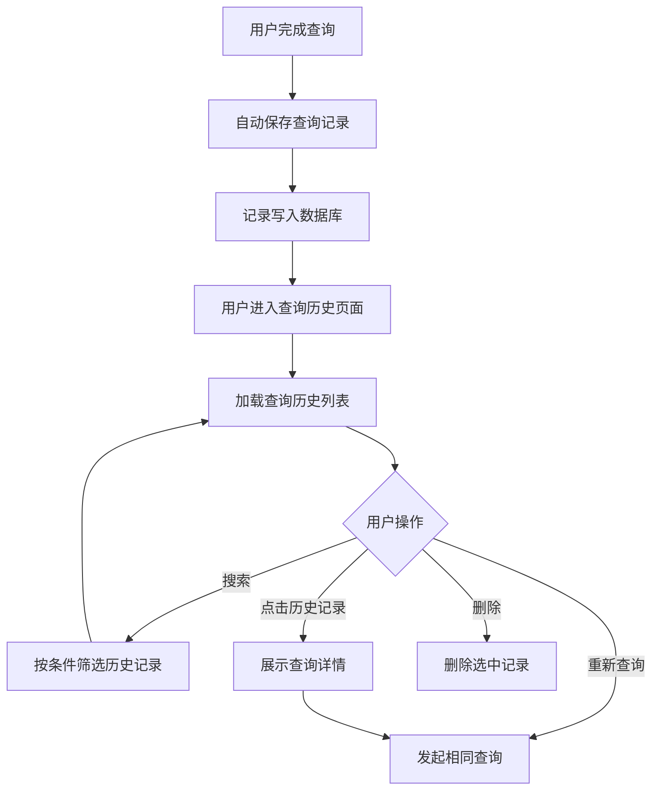

# 智能问数 ChatBI 系统 · 查询历史功能设计

***

## 文档信息

| 项目   | 内容                   |
| ---- | -------------------- |
| 文档编号 | PRD-CHATBI-2026-007 |
| 文档版本 | v0.1                 |
| 产品名称 | 智能问数 ChatBI 系统       |
| 所属系统 | 智能问数 ChatBI 系统       |
| 编制日期 | 2026-06-12       |
| 编制人员 | -               |

### 修订记录

| 版本   | 修订日期           | 修订说明 | 修订人    |
| ---- | -------------- | ---- | ------ |
| v0.1 | 2026-06-12 | 初稿创建 | - |

***

> **文档撰写规范（重要）**
>
> 1. **严格遵循模板格式**：各章节表格字段必须与模板保持一致
> 2. **聚焦业务规则**：描述业务逻辑、数据约束、权限控制等，不写技术实现细节
> 3. **减少不必要的示例**：不写JSON/XML格式的报文示例，仅描述报文格式以实际接口返回为准
> 4. **页面布局与交互分离**：§四仅描述页面结构（长什么样），§五描述业务规则（怎么操作）

***

## 一、功能角色矩阵说明

### 1.1 功能描述

- **功能名称：** 查询历史
- **所属模块：** 辅助功能
- **功能描述：** 记录和展示用户的查询历史，支持按时间、关键词搜索历史查询，并允许用户重新发起历史查询。

### 1.2 角色权限总览

| 角色      | 功能权限                        | 数据权限   |
| ------- | --------------------------- | ------ |
| 业务运营 | 查看本人查询历史、重新查询、删除本人历史 | 本人查询记录   |
| 管理层 | 查看本人查询历史、重新查询、删除本人历史 | 本人查询记录   |
| 数据分析师 | 查看本人查询历史、重新查询、删除本人历史、查看所有用户查询历史 | 全量查询记录   |
| 系统管理员 | 查看全量查询历史、删除任意查询历史 | 全量查询记录   |

### 1.3 功能角色矩阵

| 功能点  | 业务运营 | 管理层 | 数据分析师 | 系统管理员 |
| ---- | :-----: | :-----: | :-----: | :-----: |
| 查看本人查询历史 |    是    |    是    |    是    |    是    |
| 搜索查询历史 |    是    |    是    |    是    |    是    |
| 重新发起查询 |    是    |    是    |    是    |    是    |
| 删除本人查询历史 |    是    |    是    |    是    |    是    |
| 查看全量查询历史 |    否    |    否    |    是    |    是    |
| 删除任意查询历史 |    否    |    否    |    否    |    是    |

***

## 二、模块路径

系统首页 → 智能问数 ChatBI → 查询历史页面

***

## 三、状态流转与流程图

### 3.1 业务流程图



***

## 四、页面布局

### 4.1 页面清单

|  序号 | 页面名称    | 页面类型   | 描述                           |
| :-: | ------- | ------ | ---------------------------- |
|  1  | 查询历史列表页面 | 主页面    | 展示查询历史列表，支持搜索和操作       |

***

### 4.2 查询历史列表页面布局

```
┌─────────────────────────────────────────────────────────────────┐
│  查询历史                                                        │
├─────────────────────────────────────────────────────────────────┤
│  ┌─────────────┐ ┌─────────────┐ ┌─────────────┐ ┌──────┐     │
│  │ 关键词      │ │ 时间范围    │ │ 查询状态    │ │ 查询 │     │
│  │ [输入      ]│ │ [日期选择  ]│ │ [下拉框    ▼]│ │ 按钮 │     │
│  └─────────────┘ └─────────────┘ └─────────────┘ └──────┘     │
├─────────────────────────────────────────────────────────────────┤
│  工具栏区    [批量删除]              [导出]                      │
├─────────────────────────────────────────────────────────────────┤
│  历史记录列表                                                     │
│  ┌────┬──────────┬──────────┬──────────┬──────────┬────────┐  │
│  │ □  │ 问题文本  │ 查询状态  │ 查询耗时  │ 查询时间  │ 操作   │  │
│  ├────┼──────────┼──────────┼──────────┼──────────┼────────┤  │
│  │ □  │ 今天成都..│ 成功     │ 1.2s    │ 10:30:00 │ [查看] [重查] [删除]│  │
│  │ □  │ 最近7天.. │ 成功     │ 2.5s    │ 10:25:00 │ [查看] [重查] [删除]│  │
│  │ □  │ 成都和重..│ 超时     │ 30s     │ 10:20:00 │ [查看] [重查] [删除]│  │
│  └────┴──────────┴──────────┴──────────┴──────────┴────────┘  │
├─────────────────────────────────────────────────────────────────┤
│  分页区    [< 1 2 3 ... 5 >]  [每页 20 ▼]  共 156 条           │
└─────────────────────────────────────────────────────────────────┘
```

### 4.2.1 查询条件区

| 组件名称    | 组件类型 | 位置 | 提示语            | 说明        |
| ------- | ---- | -- | -------------- | --------- |
| 关键词      | 输入框  | 居左 | 请输入关键词   | 模糊搜索问题文本 |
| 时间范围    | 日期选择器 | 居左 | 请选择时间范围 | 精确查询     |
| 查询状态    | 下拉框  | 居左 | 请选择查询状态   | 精确查询     |
| 查询      | 按钮   | 居右 | —              | 主按钮       |

### 4.2.2 工具栏区

| 组件名称 | 组件类型 | 位置 | 提示语 | 说明          |
| ---- | ---- | -- | --- | ----------- |
| 批量删除 | 按钮   | 居左 | —   | 灰化，选中记录后启用 |
| 导出   | 按钮   | 居右 | —   | 导出查询历史     |

### 4.2.3 历史记录列表展示区

| 字段      | 组件类型 | 位置 | 说明                |
| ------- | ---- | -- | ----------------- |
| 复选框     | 复选框  | 首列 | 批量操作时勾选           |
| 问题文本   | 文本   | 居左 | 截取前40字符，超出显示... |
| 查询状态   | 标签   | 居中 | 成功/失败/超时        |
| 查询耗时   | 文本   | 居中 | 格式：Xs            |
| 查询时间   | 文本   | 居中 | 格式：HH:mm:ss      |
| 操作      | 按钮组  | 居中 | [查看] [重查] [删除]  |

***

### 4.3 查询详情弹窗布局

```
┌─────────────────────────────────────────────────┐
│  查询详情                                  [X]  │
├─────────────────────────────────────────────────┤
│  问题：今天成都区域的销售额是多少？                  │
│                                                 │
│  SQL：                                           │
│  ┌─────────────────────────────────────────┐    │
│  │ SELECT SUM(sales_amount) FROM sales ...  │    │
│  └─────────────────────────────────────────┘    │
│                                                 │
│  查询状态：成功                                   │
│  查询耗时：1.2s                                  │
│  返回行数：1                                     │
│  查询时间：2026-06-12 10:30:00                   │
│                                                 │
│  查询结果：                                       │
│  ┌─────────────────────────────────────────┐    │
│  │ 销售额：¥125,680.00                      │    │
│  └─────────────────────────────────────────┘    │
│                                                 │
│              [重新查询]  [复制SQL]  [关闭]         │
└─────────────────────────────────────────────────┘
```

### 4.3.1 展示字段说明

| 字段      | 组件类型 | 位置   | 说明         |
| ------- | ---- | ---- | ---------- |
| 问题文本   | 文本   | 独占一行 | 只读         |
| SQL 语句 | 代码块  | 独占一行 | 只读         |
| 查询状态   | 文本   | 独占一行 | 只读         |
| 查询耗时   | 文本   | 独占一行 | 只读         |
| 返回行数   | 文本   | 独占一行 | 只读         |
| 查询时间   | 文本   | 独占一行 | 只读         |
| 查询结果   | 文本   | 独占一行 | 只读，展示结果摘要 |

### 4.3.2 按钮区

| 按钮 | 组件类型 | 位置 | 说明       |
| -- | ---- | -- | -------- |
| 重新查询 | 按钮   | 居右 | 发起相同查询   |
| 复制SQL | 按钮   | 居右 | 复制SQL到剪贴板 |
| 关闭   | 按钮   | 居右 | 关闭弹窗     |

***

## 五、页面交互说明

### 5.1 查询历史列表页面交互说明

#### 5.1.1 字段交互规则

| 字段        | 类型  | 是否必填 | 约束规则                  | 展示规则 | 举例或枚举       |
| --------- | --- | :--: | --------------------- | ---- | ----------- |
| 关键词      | 输入框 |   否  | 最大100字符，模糊搜索问题文本  | 明文   | 成都销售额    |
| 时间范围    | 日期选择器 |   否  | —                      | —    | 2026-06-01 至 2026-06-12 |
| 查询状态    | 下拉框 |   否  | 精确查询                  | 明文   | 成功/失败/超时  |

#### 5.1.2 操作交互逻辑

| 操作类型 | 触发操作     | 交互可用性       | 正向输出                                        | 异常场景                                           | 异常处理             | 日志级别 |
| ---- | -------- | ----------- | ------------------------------------------- | ---------------------------------------------- | ---------------- | ---- |
| 查询   | 点击"查询"按钮 | 始终可用        | 按条件筛选历史记录，结果在列表中展示，分页同步更新 | 无 | 无 | 接口级  |
| 查看详情 | 点击"查看"   | 始终可用        | 打开查询详情弹窗，展示完整查询信息 | 无 | 无 | 接口级  |
| 重新查询 | 点击"重查"   | 始终可用        | 跳转到对话页面并自动发送该问题 | 无 | 无 | 接口级  |
| 删除   | 点击"删除"   | 始终可用        | 弹出确认弹窗"是否确认删除？"；确认后删除，刷新列表 | 删除失败 | Toast提示"删除失败" | 接口级  |
| 批量删除 | 点击"批量删除" | 选中记录后可用 | 弹出确认弹窗"是否确认删除选中的N条记录？"；确认后删除 | 删除失败 | Toast提示"删除失败" | 接口级  |
| 导出   | 点击"导出"   | 始终可用        | 下载Excel文件到本地 | 无数据 | Toast提示"暂无数据可导出" | 接口级  |

> **导出文件命名规范**：
>
> - 格式：`{业务前缀}_{YYYYMMDD}_{HHMMSS}.xlsx`
> - 示例：`ChatBI查询历史_20260612_103045.xlsx`
> - 时间戳：年月日(8位) + 时分秒(6位)，确保文件名唯一性

#### 5.1.3 列表交互规则

| 规则项  | 说明                                   |
| ---- | ------------------------------------ |
| 默认排序  | 按查询时间降序排列，最新查询在最前面               |
| 数据隔离  | 普通用户仅可查看和操作本人的查询历史，管理员可查看全量       |
| 批量操作  | 勾选多条记录后可批量删除，每次最多删除100条            |

***

### 5.2 查询详情弹窗交互说明

#### 5.2.1 操作交互逻辑

| 操作类型 | 触发操作     | 交互可用性 | 正向输出        | 异常场景 | 异常处理 | 日志级别 |
| ---- | -------- | ----- | ----------- | ---- | ---- | ---- |
| 关闭   | 点击"关闭"按钮或右上角[X] | 始终可用  | 关闭弹窗，返回列表页面 | 无    | 无    | 不记录  |
| 重新查询 | 点击"重新查询"按钮 | 始终可用  | 跳转到对话页面并发送该问题 | 无    | 无    | 接口级  |
| 复制SQL | 点击"复制SQL"按钮 | 始终可用  | SQL复制到剪贴板 | 浏览器不支持 | Toast提示"复制失败" | 不记录  |

***

## 六、错误处理规范

### 6.1 列表操作错误

| 场景      | 触发条件                         | 提示文案                    | 处理方式                       |
| ------- | ---------------------------- | ----------------------- | -------------------------- |
| 加载失败  | 接口请求失败                       | 加载失败，请刷新页面重试          | Toast提示                    |
| 删除失败  | 数据库删除异常                     | 删除失败，请稍后重试            | Toast提示                    |
| 导出-无数据  | 当前查询结果为空                     | 暂无数据可导出                 | Toast提示                    |

***

## 七、非功能性需求

### 7.1 合规与安全要求

| 适用规范       | 内容摘要              | 本模块特有说明                    |
| ---------- | ----------------- | -------------------------- |
| 访问控制   | RBAC最小权限、数据权限隔离   | 普通用户仅可查看和操作本人查询历史         |
| 操作日志   | 字段级日志、保留期限、不可篡改   | 覆盖操作：查看历史、删除历史、重新查询       |
| 数据保留   | 查询历史保留期限          | 查询历史默认保留6个月，到期自动清理        |

### 7.2 性能需求

| 需求项       | 指标要求          | 说明            |
| --------- | ------------- | ------------- |
| 历史列表加载时间 | ≤ 2s          | 分页查询，每页20条   |
| 详情弹窗加载时间 | ≤ 1s          | 单条记录查询       |
| 导出响应时间    | ≤ 5s（1000条以内） | 超出时建议提示异步处理 |

***

## 八、特殊说明

### 8.1 数据保留规则

1. 查询历史默认保留6个月
2. 超过6个月的记录自动清理
3. 用户可手动删除单条或批量历史记录
4. 删除的记录不可恢复

### 8.2 重新查询规则

1. 点击"重新查询"后跳转到对话页面
2. 自动将历史问题填入输入框并发送
3. 查询结果展示在对话页面中

### 8.3 其他特殊规则

1. 查询历史中的敏感数据（如SQL中的参数）不做脱敏处理
2. 导出文件包含问题文本、SQL、查询状态、耗时、时间等信息
3. 批量删除每次最多100条，超出需分批操作

***

## 九、数据字典

### 9.1 字典项定义

**查询状态（queryStatus）**

| 枚举值（code） | 显示文本（label） | 说明     |
| :-------: | ----------- | ------ |
|     1     | 成功       | 查询成功返回结果   |
|     2     | 失败       | 查询失败      |
|     3     | 超时       | 查询超时      |

***

## 十、外部系统接口说明

### 10.1 接口清单

| 接口名称    | 功能描述           | 交互方向     | 依赖系统     | 数据流向                    |
| ------- | -------------- | -------- | -------- | ----------------------- |
| 查询历史列表接口 | 获取查询历史列表 | 调用 | 查询历史模块 | 本系统→查询历史模块→本系统 |
| 查询历史详情接口 | 获取单条查询详情 | 调用 | 查询历史模块 | 本系统→查询历史模块→本系统 |
| 删除历史接口 | 删除查询历史记录 | 调用 | 查询历史模块 | 本系统→查询历史模块 |

### 10.2 接口详细说明

**查询历史列表接口**

| 规则项  | 说明                    |
| ---- | --------------------- |
| 触发时机 | 用户进入查询历史页面或点击查询按钮时调用 |
| 请求条件 | 用户已登录               |
| 成功处理 | 返回分页的查询历史列表        |
| 失败处理 | 返回空列表               |
| 重试机制 | 不自动重试                  |

**删除历史接口**

| 规则项  | 说明                    |
| ---- | --------------------- |
| 触发时机 | 用户点击删除按钮时调用         |
| 请求条件 | 用户有权限删除该记录           |
| 成功处理 | 记录删除，返回成功            |
| 失败处理 | 返回删除失败提示             |
| 重试机制 | 不自动重试                  |

***

*文档结束*
