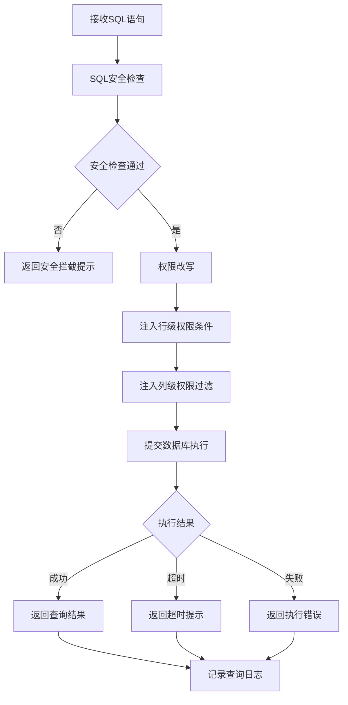
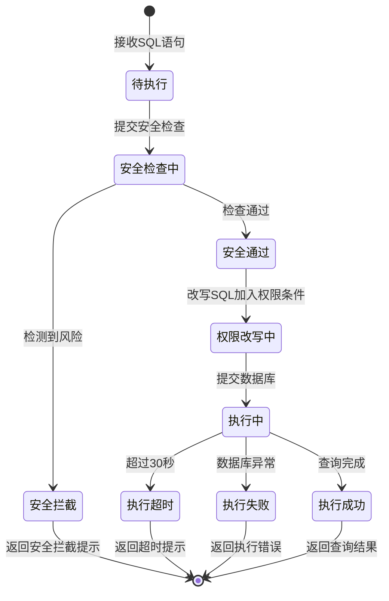

# 智能问数 ChatBI 系统 · 查询执行功能设计

***

## 文档信息

| 项目   | 内容                   |
| ---- | -------------------- |
| 文档编号 | PRD-CHATBI-2026-003 |
| 文档版本 | v0.1                 |
| 产品名称 | 智能问数 ChatBI 系统       |
| 所属系统 | 智能问数 ChatBI 系统       |
| 编制日期 | 2026-06-12       |
| 编制人员 | -               |

### 修订记录

| 版本   | 修订日期           | 修订说明 | 修订人    |
| ---- | -------------- | ---- | ------ |
| v0.1 | 2026-06-12 | 初稿创建 | - |

***

> **文档撰写规范（重要）**
>
> 1. **严格遵循模板格式**：各章节表格字段必须与模板保持一致
> 2. **聚焦业务规则**：描述业务逻辑、数据约束、权限控制等，不写技术实现细节
> 3. **减少不必要的示例**：不写JSON/XML格式的报文示例，仅描述报文格式以实际接口返回为准
> 4. **页面布局与交互分离**：§四仅描述页面结构（长什么样），§五描述业务规则（怎么操作）

***

## 一、功能角色矩阵说明

### 1.1 功能描述

- **功能名称：** 查询执行
- **所属模块：** 智能问数主流程
- **功能描述：** 接收 NL2SQL 转换生成的 SQL 语句，结合用户数据权限进行 SQL 改写后提交数据库执行，返回查询结果并进行超时和异常处理。

### 1.2 角色权限总览

| 角色      | 功能权限                        | 数据权限   |
| ------- | --------------------------- | ------ |
| 业务运营 | 无直接访问，作为主流程内部组件        | 权限范围内数据   |
| 管理层 | 无直接访问，作为主流程内部组件        | 全量汇总数据   |
| 数据分析师 | 查看执行计划、查看耗时统计          | 全量数据   |
| 系统管理员 | 全部配置管理                    | 全量数据   |

### 1.3 功能角色矩阵

| 功能点  | 业务运营 | 管理层 | 数据分析师 | 系统管理员 |
| ---- | :-----: | :-----: | :-----: | :-----: |
| SQL执行 |    否（自动触发）    |    否（自动触发）    |    否（自动触发）    |    否（自动触发）    |
| 查看执行计划 |    否    |    否    |    是    |    是    |
| 查看耗时统计 |    否    |    否    |    是    |    是    |
| 管理执行配置 |    否    |    否    |    否    |    是    |

***

## 二、模块路径

系统首页 → 智能问数 ChatBI → 系统管理 → 查询执行配置

***

## 三、状态流转与流程图

### 3.1 业务流程图



### 3.2 状态流转图



***

## 四、页面布局

### 4.1 页面清单

|  序号 | 页面名称    | 页面类型   | 描述                           |
| :-: | ------- | ------ | ---------------------------- |
|  1  | 查询执行配置页面 | 主页面    | 管理查询超时、并发数、缓存等执行参数      |
|  2  | 执行监控页面  | 子页面    | 实时监控正在执行的查询和查询耗时统计       |

***

### 4.2 查询执行配置页面布局

```
┌─────────────────────────────────────────────────────────────────┐
│  查询执行配置                                            [用户头像]  │
├─────────────────────────────────────────────────────────────────┤
│  基本配置                                                        │
│  ┌─────────────────────────────────────────────────────────┐    │
│  │ 查询超时时间（秒）*     [30        ]                       │    │
│  │ 最大并发查询数*         [50        ]                       │    │
│  │ 最大返回行数*           [1000      ]                       │    │
│  │ 缓存启用               [是 ○ 否 ●]                        │    │
│  │ 缓存有效期（秒）       [300       ]                       │    │
│  └─────────────────────────────────────────────────────────┘    │
│                                                                 │
│  高级配置                                                        │
│  ┌─────────────────────────────────────────────────────────┐    │
│  │ 慢查询阈值（秒）       [5        ]                        │    │
│  │ 查询重试次数           [0        ]                        │    │
│  │ 查询重试间隔（毫秒）   [1000     ]                        │    │
│  └─────────────────────────────────────────────────────────┘    │
│                                                                 │
│                                        [重置]  [保存]            │
└─────────────────────────────────────────────────────────────────┘
```

### 4.2.1 基本配置区

| 字段      | 组件类型 | 位置   | 提示语            | 说明        |
| ------- | ---- | ---- | -------------- | --------- |
| 查询超时时间 | 数字输入框 | 独占一行 | 请输入超时时间（秒） | 必填\*，默认30，范围1-120 |
| 最大并发查询数 | 数字输入框 | 独占一行 | 请输入最大并发数 | 必填\*，默认50，范围1-200 |
| 最大返回行数 | 数字输入框 | 独占一行 | 请输入最大返回行数 | 必填\*，默认1000，范围10-10000 |
| 缓存启用   | 单选按钮组 | 独占一行 | —              | 必填\*，默认启用 |
| 缓存有效期  | 数字输入框 | 独占一行 | 请输入缓存有效期（秒） | 缓存启用时必填，默认300 |

### 4.2.2 高级配置区

| 字段      | 组件类型 | 位置   | 提示语            | 说明        |
| ------- | ---- | ---- | -------------- | --------- |
| 慢查询阈值  | 数字输入框 | 独占一行 | 请输入慢查询阈值（秒） | 可选，默认5 |
| 查询重试次数 | 数字输入框 | 独占一行 | 请输入重试次数 | 可选，默认0，范围0-3 |
| 查询重试间隔 | 数字输入框 | 独占一行 | 请输入重试间隔（毫秒） | 可选，默认1000 |

### 4.2.3 按钮区

| 按钮 | 组件类型 | 位置 | 说明       |
| -- | ---- | -- | -------- |
| 重置 | 按钮   | 居右 | 恢复默认配置     |
| 保存 | 按钮   | 居右 | 保存当前配置     |

***

### 4.3 执行监控页面布局

```
┌─────────────────────────────────────────────────────────────────┐
│  查询执行监控                                                    │
├─────────────────────────────────────────────────────────────────┤
│  ┌─────────────┐ ┌─────────────┐ ┌─────────────┐ ┌───────────┐ │
│  │ 正在执行    │ │ 今日总查询  │ │ 平均耗时    │ │ 成功率    │ │
│  │    12      │ │   1,256     │ │   2.3s     │ │  95.2%   │ │
│  └─────────────┘ └─────────────┘ └─────────────┘ └───────────┘ │
├─────────────────────────────────────────────────────────────────┤
│  ┌─────────────┐ ┌─────────────┐ ┌──────┐ ┌──────┐             │
│  │ 时间范围    │ │ 用户        │ │ 查询 │ │ 重置 │             │
│  │ [日期选择  ]│ │ [输入      ]│ │ 按钮 │ │ 按钮 │             │
│  └─────────────┘ └─────────────┘ └──────┘ └──────┘             │
├─────────────────────────────────────────────────────────────────┤
│  执行中查询列表                                                   │
│  ┌────┬──────────┬──────────┬──────────┬──────────┬────────┐  │
│  │ 序号 │ 用户     │ SQL摘要  │ 已执行时间 │ 状态     │ 操作   │  │
│  ├────┼──────────┼──────────┼──────────┼──────────┼────────┤  │
│  │  1  │ 张三     │ SELECT...│ 15s      │ 执行中   │ [终止] │  │
│  │  2  │ 李四     │ SELECT...│ 28s      │ 执行中   │ [终止] │  │
│  └────┴──────────┴──────────┴──────────┴──────────┴────────┘  │
├─────────────────────────────────────────────────────────────────┤
│  分页区    [< 1 2 3 ... 5 >]  [每页 10 ▼]  共 12 条            │
└─────────────────────────────────────────────────────────────────┘
```

### 4.3.1 统计卡片区

| 组件名称    | 组件类型 | 位置 | 提示语            | 说明        |
| ------- | ---- | -- | -------------- | --------- |
| 正在执行数   | 统计卡片 | 居左 | —              | 只读，实时更新   |
| 今日总查询数 | 统计卡片 | 居左 | —              | 只读        |
| 平均耗时    | 统计卡片 | 居左 | —              | 只读        |
| 成功率     | 统计卡片 | 居左 | —              | 只读        |

### 4.3.2 查询条件区

| 组件名称    | 组件类型 | 位置 | 提示语            | 说明        |
| ------- | ---- | -- | -------------- | --------- |
| 时间范围    | 日期选择器 | 居左 | 请选择时间范围   | 精确查询     |
| 用户      | 输入框  | 居左 | 请输入用户名称   | 模糊查询     |
| 查询      | 按钮   | 居右 | —              | 主按钮       |
| 重置      | 按钮   | 居右 | —              | 次按钮       |

### 4.3.3 监控列表展示区

| 字段      | 组件类型 | 位置 | 说明                |
| ------- | ---- | -- | ----------------- |
| 序号      | 文本   | 居中 | —                 |
| 用户      | 文本   | 居左 | —                 |
| SQL摘要   | 文本   | 居左 | 截取前50字符，超出显示... |
| 已执行时间  | 文本   | 居中 | 格式：Xs           |
| 状态      | 标签   | 居中 | 执行中/已完成/超时/失败 |
| 操作      | 按钮   | 居中 | [终止]（仅执行中状态显示） |

***

## 五、页面交互说明

### 5.1 查询执行配置页面交互说明

#### 5.1.1 字段交互规则

| 字段        | 类型  | 是否必填 | 约束规则                  | 展示规则 | 举例或枚举       |
| --------- | --- | :--: | --------------------- | ---- | ----------- |
| 查询超时时间 | 数字输入框 |   是  | 范围1-120，整数             | 明文   | 30          |
| 最大并发查询数 | 数字输入框 |   是  | 范围1-200，整数             | 明文   | 50          |
| 最大返回行数 | 数字输入框 |   是  | 范围10-10000，整数           | 明文   | 1000        |
| 缓存启用    | 单选按钮组 |   是  | —                      | —    | 是/否        |
| 缓存有效期   | 数字输入框 |   条件必填 | 缓存启用时必填，范围60-3600     | 明文   | 300         |
| 慢查询阈值   | 数字输入框 |   否  | 范围1-60，整数              | 明文   | 5           |
| 查询重试次数  | 数字输入框 |   否  | 范围0-3，整数               | 明文   | 0           |
| 查询重试间隔  | 数字输入框 |   否  | 范围100-10000，整数          | 明文   | 1000        |

#### 5.1.2 操作交互逻辑

| 操作类型 | 触发操作     | 交互可用性       | 正向输出                                        | 异常场景                                           | 异常处理             | 日志级别 |
| ---- | -------- | ----------- | ------------------------------------------- | ---------------------------------------------- | ---------------- | ---- |
| 保存配置 | 点击"保存"按钮 | 必填字段全部合规后可用 | 保存成功，Toast提示"保存成功" | 保存失败 | Toast提示"保存失败，请重试" | 接口级  |
| 重置配置 | 点击"重置"按钮 | 始终可用 | 恢复默认值 | 无 | 无 | 接口级  |

#### 5.1.3 配置说明

| 规则项  | 说明                                   |
| ---- | ------------------------------------ |
| 缓存启用 | 启用后，相同SQL语句的查询将直接从缓存返回结果，缓存过期后重新查询 |
| 缓存有效期 | 仅在缓存启用时生效，超过有效期后缓存失效          |
| 慢查询阈值 | 超过此阈值的查询将被记录为慢查询，用于性能分析         |

***

### 5.2 执行监控页面交互说明

#### 5.2.1 操作交互逻辑

| 操作类型 | 触发操作     | 交互可用性       | 正向输出                                        | 异常场景                                           | 异常处理             | 日志级别 |
| ---- | -------- | ----------- | ------------------------------------------- | ---------------------------------------------- | ---------------- | ---- |
| 查询   | 点击"查询"按钮 | 始终可用        | 按条件筛选监控记录，结果在列表中展示，分页同步更新 | 无 | 无 | 接口级  |
| 重置   | 点击"重置"按钮 | 始终可用        | 清空所有筛选条件，恢复初始查询状态 | 无 | 无 | 接口级  |
| 终止查询 | 点击"终止"按钮 | 查询状态为"执行中"时可用 | 终止正在执行的查询，刷新列表 | 终止失败 | Toast提示"终止失败，请重试" | 接口级  |

#### 5.2.2 监控规则

| 规则项  | 说明                                   |
| ---- | ------------------------------------ |
| 自动刷新  | 页面每10秒自动刷新一次，实时更新执行状态           |
| 终止确认  | 点击终止后弹出确认弹窗"是否确认终止该查询？"，确认后才执行终止 |

***

## 六、错误处理规范

### 6.1 配置校验错误

- 显示方式：对应字段下方显示红色提示文本，字段边框变红
- 触发时机：保存时触发全量校验

| 字段      | 为空时错误信息     | 格式错误时信息           |
| ------- | ----------- | ----------------- |
| 查询超时时间 | 请输入查询超时时间 | 请输入1-120之间的整数 |
| 最大并发查询数 | 请输入最大并发查询数 | 请输入1-200之间的整数 |
| 最大返回行数 | 请输入最大返回行数 | 请输入10-10000之间的整数 |
| 缓存有效期 | 请输入缓存有效期 | 请输入60-3600之间的整数 |

### 6.2 查询执行错误

| 场景      | 触发条件                         | 提示文案                    | 处理方式                       |
| ------- | ---------------------------- | ----------------------- | -------------------------- |
| SQL注入风险 | 检测到SQL注入特征                   | 查询存在安全风险，已被拦截      | 阻断执行，记录安全日志             |
| 查询超时  | SQL执行超过配置的超时时间              | 查询超时，请缩小查询范围或简化问题  | 终止查询，返回超时提示              |
| 数据库异常  | 数据库连接失败或执行异常                | 查询失败，请稍后重试或联系管理员   | 返回执行错误提示                  |
| 并发超限  | 当前并发查询数超过配置上限               | 系统繁忙，请稍后重试          | 排队等待或返回繁忙提示              |

***

## 七、非功能性需求

### 7.1 合规与安全要求

| 适用规范       | 内容摘要              | 本模块特有说明                    |
| ---------- | ----------------- | -------------------------- |
| 访问控制   | RBAC最小权限、数据权限隔离   | SQL执行前必须经过权限改写，确保仅返回权限内数据 |
| 操作日志   | 字段级日志、保留期限、不可篡改   | 覆盖操作：查询执行、查询终止              |
| 接口防护   | 输入过滤、防SQL注入      | SQL安全检查拦截恶意输入               |

### 7.2 性能需求

| 需求项       | 指标要求          | 说明            |
| --------- | ------------- | ------------- |
| 简单查询响应时间 | ≤ 5s          | 单表聚合查询        |
| 复杂查询响应时间 | ≤ 30s         | 多表关联查询        |
| 最大并发查询数   | ≥ 50          | 同时执行的查询数      |
| 缓存命中率     | ≥ 60%         | 热门查询的缓存命中比例 |

***

## 八、特殊说明

### 8.1 权限改写规则

1. 系统自动在 SQL 的 WHERE 条件中加入用户数据范围限制
2. 行级权限：根据用户所属部门/区域，自动添加部门/区域过滤条件
3. 列级权限：根据用户角色，自动过滤敏感字段（如薪资字段对非管理层隐藏）
4. 权限改写不改变原 SQL 语义，仅追加过滤条件

### 8.2 缓存规则

1. 缓存键由 SQL 语句 + 用户权限范围组合生成
2. 缓存命中时直接返回结果，不执行数据库查询
3. 数据更新后相关缓存自动失效
4. 缓存过期后重新查询并更新缓存

### 8.3 其他特殊规则

1. 查询执行全程记录审计日志
2. 慢查询自动记录，用于后续性能优化分析
3. 系统管理员可实时终止异常查询

***

## 九、数据字典

### 9.1 字典项定义

**查询状态（queryStatus）**

| 枚举值（code） | 显示文本（label） | 说明     |
| :-------: | ----------- | ------ |
|     0     | 执行中     | 查询正在执行   |
|     1     | 成功       | 查询成功返回结果   |
|     2     | 失败       | 查询失败      |
|     3     | 超时       | 查询超时      |
|     4     | 已终止     | 查询被管理员终止  |

**查询复杂度（queryComplexity）**

| 枚举值（code） | 显示文本（label） | 说明     |
| :-------: | ----------- | ------ |
|     1     | 低        | 单表简单聚合  |
|     2     | 中        | 多表关联或分组 |
|     3     | 高        | 复杂嵌套查询   |

***

## 十、外部系统接口说明

### 10.1 接口清单

| 接口名称    | 功能描述           | 交互方向     | 依赖系统     | 数据流向                    |
| ------- | -------------- | -------- | -------- | ----------------------- |
| SQL 执行接口 | 提交SQL并获取结果 | 调用 | 数据库/数据仓库 | 本系统→数据库→本系统 |
| 查询终止接口 | 终止正在执行的查询 | 调用 | 数据库/数据仓库 | 本系统→数据库 |
| 缓存读写接口 | 读写查询缓存 | 调用 | 缓存服务 | 本系统→缓存服务→本系统 |

### 10.2 接口详细说明

**SQL 执行接口**

| 规则项  | 说明                    |
| ---- | --------------------- |
| 触发时机 | 权限改写完成后调用           |
| 请求条件 | SQL已通过安全检查，权限条件已加入  |
| 成功处理 | 返回查询结果              |
| 失败处理 | 返回错误信息（超时/异常）      |
| 重试机制 | 根据配置的重试次数自动重试      |

**查询终止接口**

| 规则项  | 说明                    |
| ---- | --------------------- |
| 触发时机 | 管理员点击终止按钮或查询超时自动触发 |
| 请求条件 | 查询状态为"执行中"           |
| 成功处理 | 查询终止，释放数据库连接        |
| 失败处理 | 返回终止失败提示             |
| 重试机制 | 不自动重试                  |

***

*文档结束*
