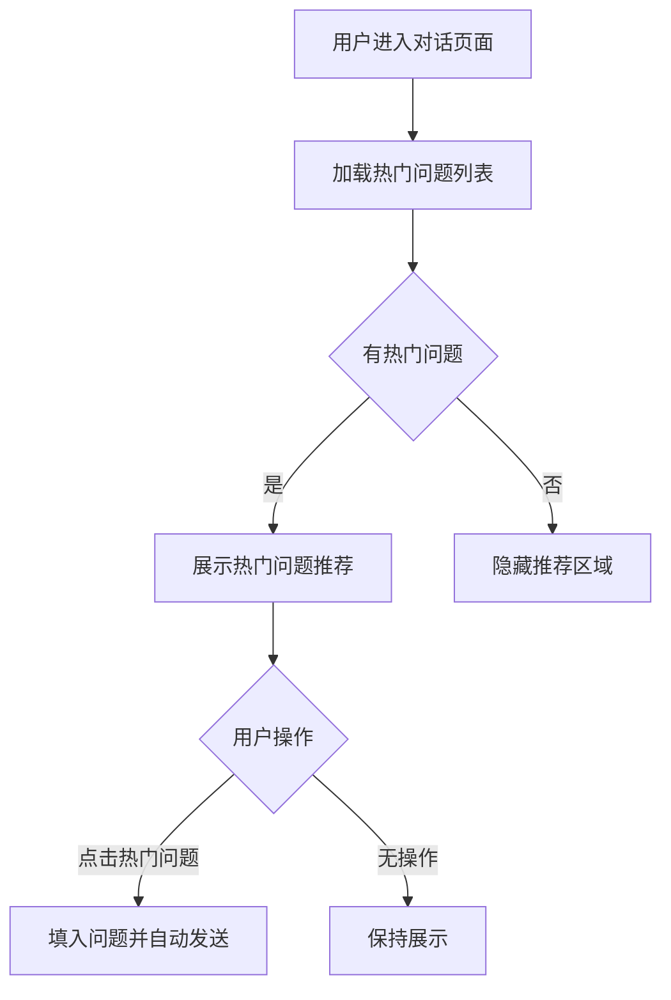
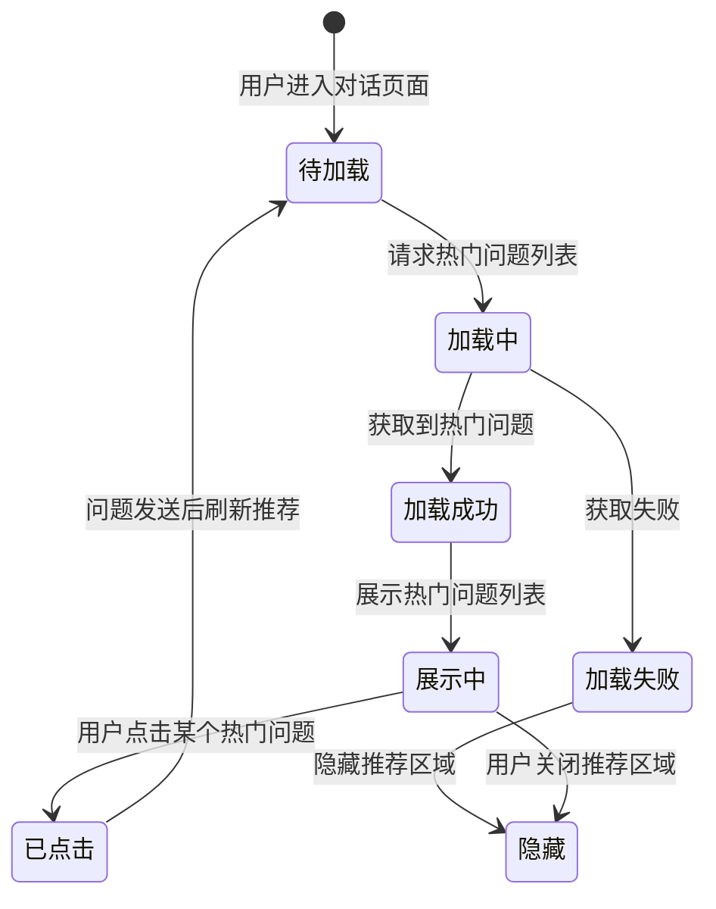

> **文档快照** | 版本 v0.1 | 生成时间 20260612
> 本文档由智能体需求文档生成skill自动生成

---

# 智能问数 ChatBI 系统 · 热门问题推荐功能设计

***

## 文档信息

| 项目   | 内容                   |
| ---- | -------------------- |
| 文档编号 | PRD-CHATBI-2026-006 |
| 文档版本 | v0.1                 |
| 产品名称 | 智能问数 ChatBI 系统       |
| 所属系统 | 智能问数 ChatBI 系统       |
| 编制日期 | 2026-06-12       |
| 编制人员 | -               |

### 修订记录

| 版本   | 修订日期           | 修订说明 | 修订人    |
| ---- | -------------- | ---- | ------ |
| v0.1 | 2026-06-12 | 初稿创建 | - |

***

> **文档撰写规范（重要）**
>
> 1. **严格遵循模板格式**：各章节表格字段必须与模板保持一致
> 2. **聚焦业务规则**：描述业务逻辑、数据约束、权限控制等，不写技术实现细节
> 3. **减少不必要的示例**：不写JSON/XML格式的报文示例，仅描述报文格式以实际接口返回为准
> 4. **页面布局与交互分离**：§四仅描述页面结构（长什么样），§五描述业务规则（怎么操作）

***

## 一、功能角色矩阵说明

### 1.1 功能描述

- **功能名称：** 热门问题推荐
- **所属模块** 辅助功能
- **功能描述：** 基于历史查询数据，统计和推荐高频查询问题，帮助新用户快速发起常见查询，降低使用门槛。

### 1.2 角色权限总览

| 角色      | 功能权限                        | 数据权限   |
| ------- | --------------------------- | ------ |
| 业务运营 | 查看热门问题、点击提问              | 通用热门问题   |
| 管理层 | 查看热门问题、点击提问              | 通用热门问题   |
| 数据分析师 | 查看热门问题、点击提问、管理热门问题   | 全量数据   |
| 系统管理员 | 全部功能                    | 全量数据   |

### 1.3 功能角色矩阵

| 功能点  | 业务运营 | 管理层 | 数据分析师 | 系统管理员 |
| ---- | :-----: | :-----: | :-----: | :-----: |
| 查看热门问题推荐 |    是    |    是    |    是    |    是    |
| 点击热门问题提问 |    是    |    是    |    是    |    是    |
| 管理热门问题 |    否    |    否    |    是    |    是    |
| 查看查询统计 |    否    |    否    |    是    |    是    |

***

## 二、模块路径

系统首页 → 智能问数 ChatBI → 系统管理 → 热门问题管理

***

## 三、状态流转与流程图

### 3.1 业务流程图



### 3.2 状态流转图



***

## 四、页面布局

### 4.1 页面清单

|  序号 | 页面名称    | 页面类型   | 描述                           |
| :-: | ------- | ------ | ---------------------------- |
|  1  | 热门问题管理页面 | 主页面    | 管理热门问题的增删改查和推荐排序         |

***

### 4.2 热门问题管理页面布局

```
┌─────────────────────────────────────────────────────────────────┐
│  热门问题管理                                                    │
├─────────────────────────────────────────────────────────────────┤
│  ┌─────────────┐ ┌─────────────┐ ┌─────────────┐ ┌──────┐     │
│  │ 问题文本    │ │ 问题分类    │ │ 状态        │ │ 查询 │     │
│  │ [输入      ]│ │ [下拉框    ▼]│ │ [下拉框    ▼]│ │ 按钮 │     │
│  └─────────────┘ └─────────────┘ └─────────────┘ └──────┘     │
├─────────────────────────────────────────────────────────────────┤
│  工具栏区    [+新增]  [批量导入]  [批量导出]       [保存]        │
├─────────────────────────────────────────────────────────────────┤
│  热门问题列表                                                     │
│  ┌────┬──────────┬──────────┬──────────┬──────────┬────────┐  │
│  │ 序号 │ 问题文本  │ 问题分类  │ 查询次数  │ 状态     │ 操作   │  │
│  ├────┼──────────┼──────────┼──────────┼──────────┼────────┤  │
│  │  1  │ 今天的销售额是多少？│ 销售  │ 1,256   │ 已启用   │ [编辑] [禁用]│  │
│  │  2  │ 最近7天的销售趋势？ │ 销售  │ 986    │ 已启用   │ [编辑] [禁用]│  │
│  │  3  │ 成都和重庆的销售对比│ 销售  │ 756    │ 已启用   │ [编辑] [禁用]│  │
│  └────┴──────────┴──────────┴──────────┴──────────┴────────┘  │
├─────────────────────────────────────────────────────────────────┤
│  分页区    [< 1 2 3 ... 5 >]  [每页 10 ▼]  共 50 条            │
└─────────────────────────────────────────────────────────────────┘
```

### 4.2.1 查询条件区

| 组件名称    | 组件类型 | 位置 | 提示语            | 说明        |
| ------- | ---- | -- | -------------- | --------- |
| 问题文本    | 输入框  | 居左 | 请输入问题文本   | 模糊查询     |
| 问题分类    | 下拉框  | 居左 | 请选择问题分类   | 精确查询     |
| 状态      | 下拉框  | 居左 | 请选择状态       | 精确查询     |
| 查询      | 按钮   | 居右 | —              | 主按钮       |

### 4.2.2 工具栏区

| 组件名称 | 组件类型 | 位置 | 提示语 | 说明          |
| ---- | ---- | -- | --- | ----------- |
| 新增   | 按钮   | 居左 | —   | 打开新增/编辑弹窗 |
| 批量导入   | 按钮   | 居左 | —   | 批量导入热门问题   |
| 批量导出   | 按钮   | 居左 | —   | 批量导出热门问题   |
| 保存   | 按钮   | 居右 | —   | 保存排序变更     |

### 4.2.3 热门问题列表展示区

| 字段      | 组件类型 | 位置 | 说明                |
| ------- | ---- | -- | ----------------- |
| 序号      | 文本   | 居中 | —                 |
| 问题文本   | 文本   | 居左 | —                 |
| 问题分类   | 文本   | 居左 | 销售/库存/财务/其他    |
| 查询次数   | 数字   | 居中 | 累计查询次数           |
| 状态      | 标签   | 居中 | 已启用/已禁用        |
| 操作      | 按钮组  | 居中 | [编辑] [禁用/启用] [删除] |

***

### 4.3 新增/编辑热门问题弹窗布局

```
┌─────────────────────────────────────────────────┐
│  新增热门问题                              [X]  │
├─────────────────────────────────────────────────┤
│  问题文本*                                      │
│  [输入框                                    ]   │
│                                                 │
│  问题分类*                                      │
│  [下拉框                                      ▼] │
│                                                 │
│  推荐优先级*                                    │
│  [数字输入框                                ]   │
│                                                 │
│  状态*                                          │
│  [下拉框                                      ▼] │
│                                                 │
│                              [取消]  [确定]      │
└─────────────────────────────────────────────────┘
```

### 4.3.1 表单字段说明

| 字段      | 组件类型 | 位置   | 提示语            | 说明        |
| ------- | ---- | ---- | -------------- | --------- |
| 问题文本   | 输入框  | 独占一行 | 请输入问题文本     | 必填\*，最大200字符 |
| 问题分类   | 下拉框  | 独占一行 | 请选择问题分类     | 必填\*，枚举：销售/库存/财务/其他 |
| 推荐优先级  | 数字输入框 | 独占一行 | 请输入推荐优先级   | 必填\*，数字越大优先级越高，默认0 |
| 状态      | 下拉框  | 独占一行 | 请选择状态        | 必填\*，枚举：启用/禁用 |

***

## 五、页面交互说明

### 5.1 热门问题管理页面交互说明

#### 5.1.1 字段交互规则

| 字段        | 类型  | 是否必填 | 约束规则                  | 展示规则 | 举例或枚举       |
| --------- | --- | :--: | --------------------- | ---- | ----------- |
| 问题文本   | 输入框 |   是  | 最大200字符              | 明文   | 今天的销售额是多少？ |
| 问题分类   | 下拉框 |   是  | 精确查询                  | 明文   | 销售/库存/财务/其他 |
| 推荐优先级  | 数字输入框 |   是  | 正整数，范围0-999         | 明文   | 10          |
| 状态      | 下拉框 |   是  | —                      | 明文   | 启用/禁用      |

#### 5.1.2 操作交互逻辑

| 操作类型 | 触发操作     | 交互可用性       | 正向输出                                        | 异常场景                                           | 异常处理             | 日志级别 |
| ---- | -------- | ----------- | ------------------------------------------- | ---------------------------------------------- | ---------------- | ---- |
| 查询   | 点击"查询"按钮 | 始终可用        | 按条件筛选热门问题，结果在列表中展示，分页同步更新 | 无 | 无 | 接口级  |
| 重置   | 点击"重置"按钮 | 始终可用        | 清空所有筛选条件，恢复初始查询状态 | 无 | 无 | 不记录  |
| 新增   | 点击"新增"   | 始终可用        | 打开新增热门问题弹窗 | 无 | 无 | 接口级  |
| 编辑   | 点击"编辑"   | 始终可用        | 打开编辑热门问题弹窗，反显当前数据 | 无 | 无 | 接口级  |
| 删除   | 点击"删除"   | 始终可用        | 弹出确认弹窗"是否确认删除？"；确认后删除，刷新列表 | 删除失败 | Toast提示"删除失败" | 接口级  |
| 启用/禁用 | 点击"启用/禁用" | 始终可用    | 切换状态，刷新列表 | 无 | 无 | 接口级  |
| 保存排序 | 点击"保存"   | 始终可用        | 保存推荐优先级变更，Toast提示"保存成功" | 保存失败 | Toast提示"保存失败" | 接口级  |

#### 5.1.3 弹窗说明

| 规则项  | 说明                                   |
| ---- | ------------------------------------ |
| 打开方式 | 点击"新增"或"编辑"按钮                    |
| 标题   | 新增时显示"新增热门问题"；编辑时显示"编辑热门问题"     |
| 数据反显 | 编辑时自动回填当前数据；新增时所有字段为空           |
| 校验时机 | 字段失焦时触发单字段校验；点击"确定"时触发全量校验        |
| 保存规则 | 全部校验通过后提交保存；校验失败时字段下方显示红色提示文本    |

***

## 六、错误处理规范

### 6.1 表单校验错误

| 字段      | 为空时错误信息     | 格式错误时信息           |
| ------- | ----------- | ----------------- |
| 问题文本   | 请输入问题文本 | 问题文本不能超过200字符 |
| 问题分类   | 请选择问题分类 | — |
| 推荐优先级  | 请输入推荐优先级 | 请输入0-999之间的正整数 |
| 状态      | 请选择状态     | — |

### 6.2 列表操作错误

| 场景      | 触发条件                         | 提示文案                    | 处理方式                       |
| ------- | ---------------------------- | ----------------------- | -------------------------- |
| 删除失败  | 数据库删除异常                     | 删除失败，请稍后重试            | Toast提示                    |
| 保存失败  | 数据库保存异常                     | 保存失败，请稍后重试            | Toast提示                    |
| 加载失败  | 接口请求失败                       | 加载失败，请刷新页面重试          | Toast提示                    |

***

## 七、非功能性需求

### 7.1 合规与安全要求

| 适用规范       | 内容摘要              | 本模块特有说明                    |
| ---------- | ----------------- | -------------------------- |
| 操作日志   | 字段级日志、保留期限、不可篡改   | 覆盖操作：新增/编辑/删除/启用/禁用热门问题 |

### 7.2 性能需求

| 需求项       | 指标要求          | 说明            |
| --------- | ------------- | ------------- |
| 热门问题加载时间 | ≤ 1s          | 从缓存加载热门问题列表 |
| 保存响应时间    | ≤ 2s          | 保存热门问题配置     |
| 推荐问题数量    | ≤ 10条         | 每次推荐最多展示10条  |

***

## 八、特殊说明

### 8.1 热门问题推荐规则

1. 推荐优先级越高的问题排在越前面
2. 相同优先级按查询次数降序排列
3. 仅展示状态为"已启用"的热门问题
4. 每24小时自动更新一次热门问题列表

### 8.2 自动统计规则

1. 每次用户提问后，系统自动统计该问题的查询次数
2. 当某个问题的查询次数达到阈值（默认100次）时，自动将其纳入热门问题候选
3. 数据分析师可手动将候选问题添加为热门问题

### 8.3 其他特殊规则

1. 热门问题展示在对话页面输入框下方
2. 用户可关闭热门问题推荐区域
3. 禁用状态的热门问题不在对话页面展示

***

## 九、数据字典

### 9.1 字典项定义

**问题分类（questionCategory）**

| 枚举值（code） | 显示文本（label） | 说明     |
| :-------: | ----------- | ------ |
|     1     | 销售       | 销售类问题   |
|     2     | 库存       | 库存类问题   |
|     3     | 财务       | 财务类问题   |
|     4     | 其他       | 其他类问题   |

**热门问题状态（hotQuestionStatus）**

| 枚举值（code） | 显示文本（label） | 说明     |
| :-------: | ----------- | ------ |
|     0     | 已禁用     | 热门问题已禁用，不在对话页面展示 |
|     1     | 已启用     | 热门问题已启用，在对话页面展示 |

***

## 十、外部系统接口说明

### 10.1 接口清单

| 接口名称    | 功能描述           | 交互方向     | 依赖系统     | 数据流向                    |
| ------- | -------------- | -------- | -------- | ----------------------- |
| 热门问题查询接口 | 获取热门问题列表 | 调用 | 热门问题模块 | 本系统→热门问题模块→本系统 |
| 热门问题管理接口 | 增删改查热门问题 | 调用 | 热门问题模块 | 本系统→热门问题模块 |
| 查询统计接口 | 更新查询次数 | 调用 | 热门问题模块 | 本系统→热门问题模块 |

### 10.2 接口详细说明

**热门问题查询接口**

| 规则项  | 说明                    |
| ---- | --------------------- |
| 触发时机 | 用户进入对话页面时调用         |
| 请求条件 | 用户已登录               |
| 成功处理 | 返回按推荐优先级排序的热门问题列表  |
| 失败处理 | 返回空列表，隐藏推荐区域       |
| 重试机制 | 不自动重试                  |

**查询统计接口**

| 规则项  | 说明                    |
| ---- | --------------------- |
| 触发时机 | 用户每次提问后调用           |
| 请求条件 | 用户问题非空               |
| 成功处理 | 更新该问题的查询次数          |
| 失败处理 | 静默失败，不影响主流程        |
| 重试机制 | 不自动重试                  |

***

*文档结束*
