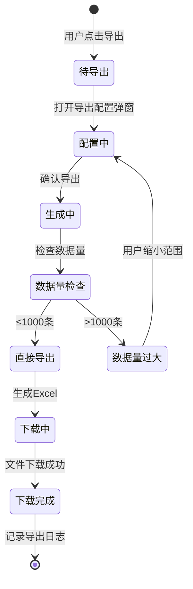

# 智能问数 ChatBI 系统 · 结果导出功能设计

***

## 文档信息

| 项目   | 内容                   |
| ---- | -------------------- |
| 文档编号 | PRD-CHATBI-2026-008 |
| 文档版本 | v0.1                 |
| 产品名称 | 智能问数 ChatBI 系统       |
| 所属系统 | 智能问数 ChatBI 系统       |
| 编制日期 | 2026-06-12       |
| 编制人员 | -               |

### 修订记录

| 版本   | 修订日期           | 修订说明 | 修订人    |
| ---- | -------------- | ---- | ------ |
| v0.1 | 2026-06-12 | 初稿创建 | - |

***

> **文档撰写规范（重要）**
>
> 1. **严格遵循模板格式**：各章节表格字段必须与模板保持一致
> 2. **聚焦业务规则**：描述业务逻辑、数据约束、权限控制等，不写技术实现细节
> 3. **减少不必要的示例**：不写JSON/XML格式的报文示例，仅描述报文格式以实际接口返回为准
> 4. **页面布局与交互分离**：§四仅描述页面结构（长什么样），§五描述业务规则（怎么操作）

***

## 一、功能角色矩阵说明

### 1.1 功能描述

- **功能名称：** 结果导出
- **所属模块：** 辅助功能
- **功能描述：** 支持将查询结果导出为 Excel 文件，支持选择导出字段和导出范围，导出行为记录审计日志。

### 1.2 角色权限总览

| 角色      | 功能权限                        | 数据权限   |
| ------- | --------------------------- | ------ |
| 业务运营 | 导出查询结果（权限范围内数据）       | 权限范围内数据   |
| 管理层 | 导出查询结果（全量汇总数据）        | 全量汇总数据   |
| 数据分析师 | 导出查询结果、导出全量数据          | 全量数据   |
| 系统管理员 | 全部导出功能                    | 全量数据   |

### 1.3 功能角色矩阵

| 功能点  | 业务运营 | 管理层 | 数据分析师 | 系统管理员 |
| ---- | :-----: | :-----: | :-----: | :-----: |
| 导出当前查询结果 |    是    |    是    |    是    |    是    |
| 选择导出字段 |    是    |    是    |    是    |    是    |
| 导出全量数据 |    否    |    否    |    是    |    是    |
| 查看导出历史 |    否    |    否    |    是    |    是    |

***

## 二、模块路径

系统首页 → 智能问数 ChatBI → 对话查询页面 → 导出功能

***

## 三、状态流转与流程图

### 3.1 业务流程图

```mermaid
flowchart TD
    A[用户点击导出] B[弹出导出配置弹窗]
    B --> C[选择导出字段]
    C --> D[选择导出范围]
    D --> E[确认导出]
    E --> F{数据量检查}
    F -->|≤1000条| G[直接导出]
    F -->|>1000条| H[提示数据量过大]
    G --> I[生成Excel文件]
    I --> J[下载到本地]
    J --> K[记录导出日志]
```

### 3.2 状态流转图



***

## 四、页面布局

### 4.1 页面清单

|  序号 | 页面名称    | 页面类型   | 描述                           |
| :-: | ------- | ------ | ---------------------------- |
|  1  | 导出配置弹窗 | 弹窗     | 配置导出字段、导出范围，确认导出          |

***

### 4.2 导出配置弹窗布局

```
┌─────────────────────────────────────────────────┐
│  导出查询结果                              [X]  │
├─────────────────────────────────────────────────┤
│  数据预览：共 156 条数据，10 个字段               │
│                                                 │
│  导出字段选择*                                   │
│  ┌─────────────────────────────────────────┐    │
│  │ ☑ 日期  ☑ 区域  ☑ 门店  ☑ 销售额          │    │
│  │ ☑ 订单量  ☐ 客单价  ☐ 折扣  ☑ 利润         │    │
│  └─────────────────────────────────────────┘    │
│  [全选]  [全不选]                                 │
│                                                 │
│  导出范围*                                      │
│  ○ 当前页数据（20条）                             │
│  ● 全部数据（156条）                              │
│                                                 │
│  文件格式*                                      │
│  ● .xlsx                                        │
│                                                 │
│                              [取消]  [导出]      │
└─────────────────────────────────────────────────┘
```

### 4.2.1 导出字段选择区

| 组件名称    | 组件类型 | 位置 | 提示语            | 说明        |
| ------- | ---- | -- | -------------- | --------- |
| 字段列表    | 复选框组 | 独占一行 | —              | 必填，至少勾选一个字段 |
| 全选      | 按钮   | 居左 | —              | 勾选所有字段     |
| 全不选    | 按钮   | 居左 | —              | 取消所有勾选     |

### 4.2.2 导出范围选择区

| 组件名称    | 组件类型 | 位置 | 提示语            | 说明        |
| ------- | ---- | -- | -------------- | --------- |
| 当前页数据   | 单选按钮 | 独占一行 | —              | 导出当前页面展示的20条数据 |
| 全部数据    | 单选按钮 | 独占一行 | —              | 导出全部查询结果（最多1000条） |

### 4.2.3 文件格式选择区

| 组件名称    | 组件类型 | 位置 | 提示语            | 说明        |
| ------- | ---- | -- | -------------- | --------- |
| .xlsx  | 单选按钮 | 独占一行 | —              | 默认选中，固定格式 |

### 4.2.4 按钮区

| 按钮 | 组件类型 | 位置 | 说明       |
| -- | ---- | -- | -------- |
| 取消 | 按钮   | 居右 | 关闭弹窗     |
| 导出 | 按钮   | 居右 | 灰化→选中字段后可用 |

***

## 五、页面交互说明

### 5.1 导出配置弹窗交互说明

#### 5.1.1 字段交互规则

| 字段        | 类型  | 是否必填 | 约束规则                  | 展示规则 | 举例或枚举       |
| --------- | --- | :--: | --------------------- | ---- | ----------- |
| 导出字段   | 复选框组 |   是  | 至少勾选一个字段            | —    | 日期/区域/销售额  |
| 导出范围   | 单选按钮组 |   是  | —                      | —    | 当前页数据/全部数据 |
| 文件格式   | 单选按钮组 |   是  | 固定.xlsx                | —    | .xlsx         |

#### 5.1.2 操作交互逻辑

| 操作类型 | 触发操作     | 交互可用性       | 正向输出                                        | 异常场景                                           | 异常处理             | 日志级别 |
| ---- | -------- | ----------- | ------------------------------------------- | ---------------------------------------------- | ---------------- | ---- |
| 全选   | 点击"全选"   | 始终可用        | 勾选所有字段 | 无 | 无 | 不记录  |
| 全不选  | 点击"全不选" | 始终可用        | 取消所有勾选 | 无 | 无 | 不记录  |
| 导出   | 点击"导出"按钮 | 至少勾选一个字段后可用 | 生成Excel文件并下载到本地 | 无数据可导出 | Toast提示"暂无数据可导出" | 接口级  |
| 取消   | 点击"取消"按钮 | 始终可用        | 关闭弹窗，不执行导出 | 无 | 无 | 不记录  |

> **导出文件命名规范**：
>
> - 格式：`{业务前缀}_{YYYYMMDD}_{HHMMSS}.xlsx`
> - 示例：`ChatBI查询结果_20260612_103045.xlsx`
> - 时间戳：年月日(8位) + 时分秒(6位)，确保文件名唯一性

#### 5.1.3 弹窗说明

| 规则项  | 说明                                   |
| ---- | ------------------------------------ |
| 打开方式 | 用户点击对话区结果卡片上的"导出"按钮              |
| 标题   | 显示"导出查询结果"                        |
| 数据预览 | 弹窗顶部展示数据条数和字段数量                   |
| 校验规则 | 至少勾选一个字段才可导出，否则导出按钮灰化            |
| 数据量限制 | 单次导出最多1000条，超出时提示"数据量过大，请缩小导出范围" |

***

## 六、错误处理规范

### 6.1 导出错误

| 场景      | 触发条件                         | 提示文案                    | 处理方式                       |
| ------- | ---------------------------- | ----------------------- | -------------------------- |
| 无数据可导出 | 查询结果为空                     | 暂无数据可导出                 | Toast提示，阻断导出              |
| 数据量过大  | 导出数据超过1000条                 | 数据量过大，请缩小导出范围后重新导出   | Toast提示，阻断导出              |
| 导出失败  | 文件生成失败                     | 导出失败，请稍后重试            | Toast提示                    |
| 网络异常  | 接口请求失败                     | 网络异常，请稍后重试            | Toast提示                    |

### 6.2 字段校验错误

| 场景      | 触发条件                         | 提示文案                    | 处理方式                       |
| ------- | ---------------------------- | ----------------------- | -------------------------- |
| 未勾选字段  | 点击导出时未勾选任何字段              | 请至少选择一个导出字段           | 导出按钮灰化不可点击              |

***

## 七、非功能性需求

### 7.1 合规与安全要求

| 适用规范       | 内容摘要              | 本模块特有说明                    |
| ---------- | ----------------- | -------------------------- |
| 访问控制   | RBAC最小权限、数据权限隔离   | 导出数据范围受用户数据权限控制           |
| 操作日志   | 字段级日志、保留期限、不可篡改   | 导出行为须记录操作日志（含导出人、时间、数据量） |
| 文件操作安全 | 导出上限、导出行为记日志     | 单次导出上限1000条；导出行为记录审计日志   |

### 7.2 性能需求

| 需求项       | 指标要求          | 说明            |
| --------- | ------------- | ------------- |
| 导出响应时间    | ≤ 5s（1000条以内） | 超出时建议提示异步处理 |
| 文件生成时间    | ≤ 3s          | 1000条数据的Excel生成 |

***

## 八、特殊说明

### 8.1 导出数据范围

1. 当前页数据：导出当前页面展示的最多20条数据
2. 全部数据：导出全部查询结果，最多1000条
3. 超出1000条时提示用户缩小查询范围

### 8.2 导出字段规则

1. 默认勾选所有字段
2. 用户可自由选择需要导出的字段
3. 至少勾选一个字段才可导出

### 8.3 其他特殊规则

1. 导出行为全程记录审计日志
2. 导出文件自动下载到用户本地默认下载目录
3. 导出完成后Toast提示"导出成功，共导出X条数据"

***

## 九、数据字典

### 9.1 字典项定义

**导出范围（exportRange）**

| 枚举值（code） | 显示文本（label） | 说明     |
| :-------: | ----------- | ------ |
|     1     | 当前页数据     | 导出当前页面展示的数据 |
|     2     | 全部数据      | 导出全部查询结果   |

**导出状态（exportStatus）**

| 枚举值（code） | 显示文本（label） | 说明     |
| :-------: | ----------- | ------ |
|     0     | 失败       | 导出失败      |
|     1     | 成功       | 导出成功      |

***

## 十、外部系统接口说明

### 10.1 接口清单

| 接口名称    | 功能描述           | 交互方向     | 依赖系统     | 数据流向                    |
| ------- | -------------- | -------- | -------- | ----------------------- |
| 数据导出接口 | 根据配置导出数据为Excel | 调用 | 数据查询模块 | 本系统→数据查询模块→本系统 |
| 导出日志接口 | 记录导出行为日志 | 调用 | 审计日志模块 | 本系统→审计日志模块 |

### 10.2 接口详细说明

**数据导出接口**

| 规则项  | 说明                    |
| ---- | --------------------- |
| 触发时机 | 用户点击导出按钮时调用         |
| 请求条件 | 已选择导出字段，数据量在限制范围内  |
| 成功处理 | 生成Excel文件并返回下载链接     |
| 失败处理 | 返回导出失败提示             |
| 重试机制 | 不自动重试                  |

**导出日志接口**

| 规则项  | 说明                    |
| ---- | --------------------- |
| 触发时机 | 导出完成后异步调用            |
| 请求条件 | 导出操作已完成               |
| 成功处理 | 日志记录成功               |
| 失败处理 | 静默失败，不影响导出流程        |
| 重试机制 | 不自动重试                  |

***

*文档结束*
