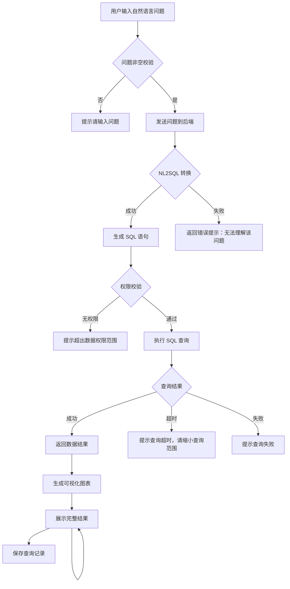
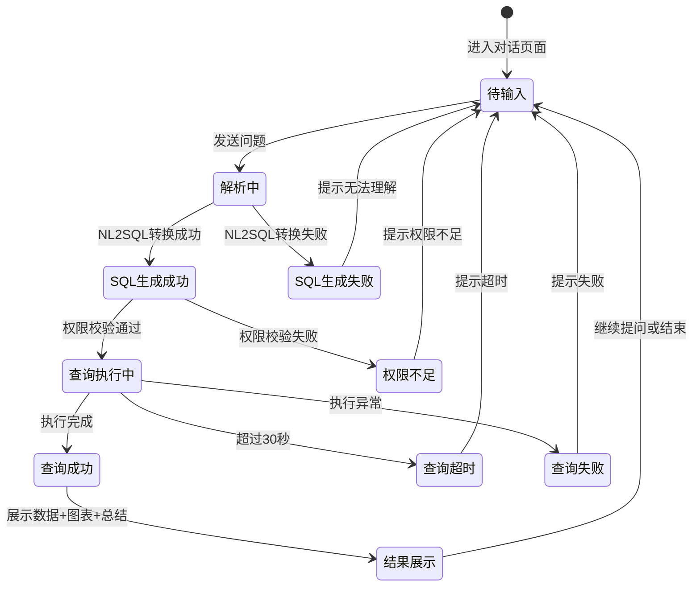

> **文档快照** | 版本 v0.1 | 生成时间 20260612
> 本文档由智能体需求文档生成skill自动生成

---

# 智能问数 ChatBI 系统 · 自然语言提问功能设计

***

## 文档信息

| 项目   | 内容                   |
| ---- | -------------------- |
| 文档编号 | PRD-CHATBI-2026-001 |
| 文档版本 | v0.1                 |
| 产品名称 | 智能问数 ChatBI 系统       |
| 所属系统 | 智能问数 ChatBI 系统       |
| 编制日期 | 2026-06-12       |
| 编制人员 | -               |

### 修订记录

| 版本   | 修订日期           | 修订说明 | 修订人    |
| ---- | -------------- | ---- | ------ |
| v0.1 | 2026-06-12 | 初稿创建 | - |

***

> **文档使用说明**
>
> - `【替换】` 标记的内容：使用时替换为实际业务内容
> - `【删除】` 标记的内容：仅为填写说明，完成后删除
> - 本模板供 AI 开发智能体读取，请保持结构完整

> **文档撰写规范（重要）**
>
> 1. **严格遵循模板格式**：各章节表格字段必须与模板保持一致
> 2. **聚焦业务规则**：描述业务逻辑、数据约束、权限控制等，不写技术实现细节（如CSS类名、列宽像素、具体代码逻辑）
> 3. **减少不必要的示例**：不写JSON/XML格式的报文示例，仅描述报文格式以实际接口返回为准
> 4. **页面布局与交互分离**：§四仅描述页面结构（长什么样），§五描述业务规则（怎么操作）；字段说明表中「说明」列仅标注极简展示属性（只读/必填\*/系统自动生成），业务约束写在§五

***

## 一、功能角色矩阵说明

### 1.1 功能描述

- **功能名称：** 自然语言提问
- **所属模块：** 智能问数主流程
- **功能描述：** 业务人员通过对话界面使用中文自然语言提出数据查询问题，系统接收问题后触发 NL2SQL 转换和查询执行，最终返回结构化结果。

### 1.2 角色权限总览

| 角色      | 功能权限                        | 数据权限   |
| ------- | --------------------------- | ------ |
| 业务运营 | 提问、查看结果、查看SQL、查看历史、导出结果 | 权限范围内数据   |
| 管理层 | 提问、查看结果、查看SQL、查看历史、导出结果 | 全量汇总数据   |
| 数据分析师 | 提问、查看结果、查看SQL、查看历史、导出结果、管理指标字典 | 全量数据   |
| 财务人员 | 提问、查看结果、查看SQL、查看历史、导出结果 | 财务相关数据   |
| 系统管理员 | 全部功能，含配置管理               | 全量数据   |

### 1.3 功能角色矩阵

| 功能点  | 业务运营 | 管理层 | 数据分析师 | 财务人员 | 系统管理员 |
| ---- | :-----: | :-----: | :-----: | :-----: | :-----: |
| 自然语言提问 |    是    |    是    |    是    |    是    |    是    |
| 查看生成SQL |    是    |    是    |    是    |    是    |    是    |
| 查看查询结果 |    是    |    是    |    是    |    是    |    是    |
| 查看可视化图表 |    是    |    是    |    是    |    是    |    是    |
| 导出查询结果 |    是    |    是    |    是    |    是    |    是    |
| 查看热门问题 |    是    |    是    |    是    |    是    |    是    |
| 管理指标字典 |    否    |    否    |    是    |    否    |    是    |

***

## 二、模块路径

系统首页 → 智能问数 ChatBI → 对话查询页面

***

## 三、状态流转与流程图

### 3.1 业务流程图



### 3.2 状态流转图



***

## 四、页面布局

### 4.1 页面清单

|  序号 | 页面名称    | 页面类型   | 描述                           |
| :-: | ------- | ------ | ---------------------------- |
|  1  | 对话查询页面 | 主页面    | 对话式交互界面，包含问题输入、历史对话、结果展示 |
|  2  | SQL 详情弹窗 | 弹窗     | 展示生成的 SQL 语句，支持复制            |
|  3  | 结果详情弹窗  | 弹窗     | 以表格形式展示完整的查询结果数据            |

***

### 4.2 对话查询页面布局

```
┌─────────────────────────────────────────────────────────────────┐
│  头部区域：智能问数 ChatBI                          [用户头像]    │
├─────────────────────────────────────────────────────────────────┤
│  对话区域（可滚动）                                                │
│                                                                 │
│  ┌──────────────────────────────────────┐                      │
│  │ [用户] 今天成都区域的销售额是多少？          │                      │
│  └──────────────────────────────────────┘                      │
│                                                                 │
│  ┌──────────────────────────────────────┐                      │
│  │ [AI助手]                              │                      │
│  │ 正在解析您的问题...                     │                      │
│  │                                       │                      │
│  │ 📊 查询结果：                          │                      │
│  │ 今日成都区域销售额：¥125,680.00         │                      │
│  │                                       │                      │
│  │ [查看SQL] [查看图表] [查看详情] [导出]    │                      │
│  └──────────────────────────────────────┘                      │
│                                                                 │
│  ┌──────────────────────────────────────┐                      │
│  │ [用户] 和昨天相比怎么样？                │                      │
│  └──────────────────────────────────────┘                      │
│  ...                                                            │
│                                                                 │
├─────────────────────────────────────────────────────────────────┤
│  快捷提问区                                                       │
│  [今天销售额] [本周趋势] [Top10门店] [热门问题▼]                  │
├─────────────────────────────────────────────────────────────────┤
│  输入区域                                                         │
│  ┌────────────────────────────────────────────┐ ┌──────┐      │
│  │ [请输入您的问题...                          ] │ │ 发送 │      │
│  └────────────────────────────────────────────┘ └──────┘      │
│  ┌────────────────────────────────────────────┐               │
│  │ [热门问题推荐]                               │               │
│  │ 1. 今天的销售额是多少？                       │               │
│  │ 2. 最近7天的销售趋势？                        │               │
│  │ 3. 成都和重庆的销售对比                       │               │
│  └────────────────────────────────────────────┘               │
└─────────────────────────────────────────────────────────────────┘
```

### 4.2.1 头部区域

| 组件名称    | 组件类型 | 位置 | 提示语            | 说明        |
| ------- | ---- | -- | -------------- | --------- |
| 页面标题    | 文本   | 居左 | 智能问数 ChatBI  | 只读        |
| 用户头像    | 图片   | 居右 | —              | 只读，当前登录用户 |

### 4.2.2 对话区域

| 组件名称    | 组件类型 | 位置 | 提示语            | 说明        |
| ------- | ---- | -- | -------------- | --------- |
| 用户消息气泡 | 文本   | 居右 | —              | 右对齐展示用户问题   |
| AI回复气泡  | 文本   | 居左 | —              | 左对齐展示AI回复结果 |
| 结果展示卡片 | 卡片   | 居左 | —              | 包含数据摘要和快捷操作按钮 |
| 加载状态    | 加载动画 | 居左 | 正在解析中...      | NL2SQL转换和查询执行中显示 |

### 4.2.3 快捷提问区

| 组件名称    | 组件类型 | 位置 | 提示语            | 说明        |
| ------- | ---- | -- | -------------- | --------- |
| 快捷提问按钮组 | 按钮组  | 水平排列 | —           | 点击后自动填入输入框并发送 |
| 热门问题下拉 | 下拉框  | 居右 | 热门问题          | 选择后自动填入输入框     |

### 4.2.4 输入区域

| 组件名称    | 组件类型 | 位置 | 提示语            | 说明        |
| ------- | ---- | -- | -------------- | --------- |
| 问题输入框   | 文本输入框 | 居左 | 请输入您的问题...   | 支持多行，最大500字符 |
| 发送按钮    | 按钮   | 居右 | 发送              | 输入非空后启用          |

***

### 4.3 SQL 详情弹窗布局

```
┌─────────────────────────────────────────────────┐
│  生成 SQL 详情                              [X]  │
├─────────────────────────────────────────────────┤
│                                                 │
│  您的问题：今天成都区域的销售额是多少？              │
│                                                 │
│  ┌─────────────────────────────────────────┐    │
│  │ SELECT SUM(sales_amount)                │    │
│  │ FROM sales                              │    │
│  │ WHERE date = '2026-06-12'               │    │
│  │   AND region = '成都'                    │    │
│  └─────────────────────────────────────────┘    │
│                                                 │
│  指标：销售额                                    │
│  维度：区域（成都）                                │
│  过滤条件：日期 = 今天                             │
│                                                 │
│                              [复制SQL]  [关闭]    │
└─────────────────────────────────────────────────┘
```

### 4.3.1 展示字段说明

| 字段      | 组件类型 | 位置   | 说明         |
| ------- | ---- | ---- | ---------- |
| 用户问题   | 文本   | 独占一行 | 只读         |
| SQL 语句 | 代码块  | 独占一行 | 只读，支持语法高亮 |
| 指标解释   | 文本   | 独占一行 | 只读         |
| 维度信息   | 文本   | 独占一行 | 只读         |
| 过滤条件   | 文本   | 独占一行 | 只读         |

### 4.3.2 按钮区

| 按钮 | 组件类型 | 位置 | 说明       |
| -- | ---- | -- | -------- |
| 复制SQL | 按钮   | 居右 | 复制SQL到剪贴板 |
| 关闭   | 按钮   | 居右 | 关闭弹窗     |

***

### 4.4 结果详情弹窗布局

```
┌─────────────────────────────────────────────────┐
│  查询结果详情                              [X]  │
├─────────────────────────────────────────────────┤
│  ┌────┬────────────┬────────────┬────────────┐ │
│  │ 序号 │ 字段1      │ 字段2      │ 字段3      │ │
│  ├────┼────────────┼────────────┼────────────┤ │
│  │  1  │ xxx        │ xxx        │ xxx        │ │
│  │  2  │ xxx        │ xxx        │ xxx        │ │
│  └────┴────────────┴────────────┴────────────┘ │
│                                                 │
│  共 10 条数据                                    │
│                                                 │
│                              [导出]  [关闭]      │
└─────────────────────────────────────────────────┘
```

### 4.4.1 展示字段说明

| 字段      | 组件类型 | 位置   | 说明         |
| ------- | ---- | ---- | ---------- |
| 结果表格   | 表格   | 独占一行 | 只读，展示完整查询结果 |
| 数据条数   | 文本   | 居左 | 只读，格式：共X条数据 |

### 4.4.2 按钮区

| 按钮 | 组件类型 | 位置 | 说明       |
| -- | ---- | -- | -------- |
| 导出   | 按钮   | 居右 | 导出为Excel |
| 关闭   | 按钮   | 居右 | 关闭弹窗     |

***

## 五、页面交互说明

### 5.1 对话查询页面交互说明

#### 5.1.1 字段交互规则

| 字段        | 类型  | 是否必填 | 约束规则                  | 展示规则 | 举例或枚举       |
| --------- | --- | :--: | --------------------- | ---- | ----------- |
| 问题输入框   | 文本输入框 |   是  | 最大500字符，不支持SQL注入字符 | 明文   | "今天成都区域的销售额是多少？" |

#### 5.1.2 操作交互逻辑

| 操作类型 | 触发操作     | 交互可用性       | 正向输出                                        | 异常场景                                           | 异常处理             | 日志级别 |
| ---- | -------- | ----------- | ------------------------------------------- | ---------------------------------------------- | ---------------- | ---- |
| 发送问题 | 点击"发送"按钮或按回车 | 输入框非空时可用 | 用户消息显示在对话区右侧，AI回复显示在左侧，包含查询结果、图表和总结 | 输入内容为空                                       | 发送按钮灰化不可点击    | 接口级  |
| 快捷提问 | 点击快捷提问按钮 | 始终可用        | 填入对应问题并自动发送                              | 无                                              | 无                | 接口级  |
| 选择热门问题 | 从下拉框选择热门问题 | 始终可用        | 填入对应问题并自动发送                              | 无                                              | 无                | 接口级  |
| 查看SQL | 点击"查看SQL"按钮 | 查询成功后可用    | 打开SQL详情弹窗，展示生成的SQL语句                     | 查询失败无SQL可展示                                   | 按钮不显示           | 接口级  |
| 查看图表 | 点击"查看图表"按钮 | 查询成功后可用    | 在对话区展示可视化图表                                | 查询失败无可视化数据                                   | 按钮不显示           | 接口级  |
| 查看详情 | 点击"查看详情"按钮 | 查询成功后可用    | 打开结果详情弹窗，以表格形式展示完整数据                     | 无                                              | 无                | 接口级  |
| 导出结果 | 点击"导出"按钮   | 查询成功后可用    | 下载Excel文件到本地                                | 无数据                                              | Toast提示"暂无数据可导出" | 接口级  |
| 复制SQL | 点击"复制SQL"按钮 | SQL详情弹窗中可用 | SQL语句复制到剪贴板，Toast提示"复制成功"                  | 浏览器不支持复制                                      | Toast提示"复制失败，请手动复制" | 接口级  |

> **导出文件命名规范**：
>
> - 格式：`{业务前缀}_{YYYYMMDD}_{HHMMSS}.xlsx`
> - 示例：`ChatBI查询结果_20260612_103045.xlsx`
> - 时间戳：年月日(8位) + 时分秒(6位)，确保文件名唯一性

#### 5.1.3 对话交互规则

| 规则项  | 说明                                   |
| ---- | ------------------------------------ |
| 上下文保持 | 系统支持多轮对话，后续问题可引用前文上下文（如"和昨天相比"） |
| 对话清空  | 用户可清空当前对话，清空后上下文重置，历史记录保留在查询历史模块 |
| 加载提示  | NL2SQL转换和查询执行期间显示"正在解析中..."加载动画   |
| 超时提示  | 查询超过30秒时，提示"查询超时，请缩小查询范围或简化问题"   |
| 错误提示  | NL2SQL转换失败时，提示"无法理解您的问题，请换一种方式描述" |

***

### 5.2 SQL 详情弹窗交互说明

#### 5.2.1 操作交互逻辑

| 操作类型 | 触发操作     | 交互可用性 | 正向输出        | 异常场景 | 异常处理 | 日志级别 |
| ---- | -------- | ----- | ----------- | ---- | ---- | ---- |
| 关闭   | 点击"关闭"按钮或右上角[X] | 始终可用  | 关闭弹窗，返回对话页面 | 无    | 无    | 不记录  |
| 复制SQL | 点击"复制SQL"按钮 | 始终可用  | SQL复制到剪贴板 | 浏览器不支持 | Toast提示"复制失败" | 不记录  |

***

### 5.3 结果详情弹窗交互说明

#### 5.3.1 操作交互逻辑

| 操作类型 | 触发操作     | 交互可用性 | 正向输出        | 异常场景 | 异常处理 | 日志级别 |
| ---- | -------- | ----- | ----------- | ---- | ---- | ---- |
| 关闭   | 点击"关闭"按钮或右上角[X] | 始终可用  | 关闭弹窗，返回对话页面 | 无    | 无    | 不记录  |
| 导出   | 点击"导出"按钮 | 始终可用  | 下载Excel文件   | 无数据 | Toast提示"暂无数据" | 接口级  |

***

## 六、错误处理规范

### 6.1 表单校验错误

- 显示方式：对应字段下方显示红色提示文本，字段边框变红
- 触发时机：发送时触发校验

| 字段      | 为空时错误信息     | 格式错误时信息           |
| ------- | ----------- | ----------------- |
| 问题输入框 | 请输入您的问题 | 问题描述不能超过500字符 |

### 6.2 查询错误

| 场景      | 触发条件                         | 提示文案                    | 处理方式                       |
| ------- | ---------------------------- | ----------------------- | -------------------------- |
| NL2SQL转换失败 | 模型无法解析用户问题                  | 无法理解您的问题，请换一种方式描述       | 在对话区显示错误提示，用户可修改问题重新发送     |
| 权限不足  | 用户查询超出其数据权限范围              | 您没有权限查询该数据，请联系管理员      | 在对话区显示权限提示               |
| 查询超时  | SQL执行超过30秒                   | 查询超时，请缩小查询范围或简化问题      | 在对话区显示超时提示               |
| 查询失败  | 数据库执行异常                     | 查询失败，请稍后重试或联系管理员      | 在对话区显示失败提示               |
| 网络异常  | 接口请求失败                       | 网络异常，请稍后重试            | Toast提示                    |

***

## 七、非功能性需求

### 7.1 合规与安全要求

| 适用规范       | 内容摘要              | 本模块特有说明                    |
| ---------- | ----------------- | -------------------------- |
| 访问控制   | RBAC最小权限、数据权限隔离   | 用户仅可提问其权限范围内的数据，SQL执行前须经过权限过滤 |
| 操作日志   | 字段级日志、保留期限、不可篡改   | 覆盖操作：提问、查看SQL、导出结果         |
| 接口防护   | 输入过滤、防SQL注入      | 用户输入须做过滤和转义，防止恶意输入         |

### 7.2 性能需求

| 需求项       | 指标要求          | 说明            |
| --------- | ------------- | ------------- |
| NL2SQL转换时间 | ≤ 3s          | 简单问题的模型推理时间 |
| 简单查询响应时间 | ≤ 5s          | 单表聚合查询        |
| 复杂查询响应时间 | ≤ 30s         | 多表关联查询，超时则提示 |
| 页面首屏加载时间  | ≤ 3s          | 对话页面初始加载      |
| 并发用户数     | ≥ 50           | 支持50人同时在线查询    |

***

## 八、特殊说明

### 8.1 问题输入规则

1. 支持中文自然语言提问，支持口语化表达
2. 系统自动识别指标、维度、过滤条件
3. 支持指代消解（如"它"、"这个"等上下文引用）

### 8.2 上下文保持规则

1. 同一对话内支持多轮提问
2. 后续问题可省略已提及的维度或条件（如"和昨天相比"自动继承上一轮的"成都区域"）
3. 对话清空后上下文重置

### 8.3 其他特殊规则

1. 发送按钮在输入框为空时灰化不可点击
2. 网络断开时提示"网络已断开，请检查网络连接"
3. 查询结果最多展示前100条数据的预览，完整数据需导出查看

***

## 九、数据字典

### 9.1 字典项定义

**查询状态（queryStatus）**

| 枚举值（code） | 显示文本（label） | 说明     |
| :-------: | ----------- | ------ |
|     0     | 解析中     | NL2SQL转换进行中 |
|     1     | 成功       | 查询成功返回结果   |
|     2     | 失败       | 查询失败      |
|     3     | 超时       | 查询超时      |
|     4     | 权限不足    | 超出数据权限范围   |

**消息发送方（messageSender）**

| 枚举值（code） | 显示文本（label） | 说明     |
| :-------: | ----------- | ------ |
|     1     | 用户       | 用户发送的消息   |
|     2     | AI助手     | AI助手回复的消息 |

### 9.2 下拉框数据来源说明

| 字段名     | 数据来源类型 | 来源说明                        |
| ------- | ------ | --------------------------- |
| 热门问题下拉 | 接口动态加载 | 来源：热门问题推荐模块接口，按推荐优先级排序 |

***

## 十、外部系统接口说明

### 10.1 接口清单

| 接口名称    | 功能描述           | 交互方向     | 依赖系统     | 数据流向                    |
| ------- | -------------- | -------- | -------- | ----------------------- |
| NL2SQL 转换接口 | 将自然语言转换为SQL | 调用 | NL2SQL 服务 | 本系统→NL2SQL服务→本系统 |
| SQL 执行接口 | 执行SQL查询并返回结果 | 调用 | 数据仓库/数据库 | 本系统→数据库→本系统 |
| 热门问题查询接口 | 获取热门问题列表 | 调用 | 热门问题推荐模块 | 本系统→热门问题模块→本系统 |
| 查询记录保存接口 | 保存查询记录 | 调用 | 查询历史模块 | 本系统→查询历史模块 |
| 指标字典查询接口 | 获取指标定义 | 调用 | 指标字典管理模块 | 本系统→指标字典模块→本系统 |

### 10.2 接口详细说明

**NL2SQL 转换接口**

| 规则项  | 说明                    |
| ---- | --------------------- |
| 触发时机 | 用户发送问题后调用           |
| 请求条件 | 用户问题非空，已通过权限认证     |
| 成功处理 | 生成SQL语句，触发SQL执行      |
| 失败处理 | 返回NL2SQL转换失败提示        |
| 重试机制 | 不自动重试，用户修改问题重新发送   |

**SQL 执行接口**

| 规则项  | 说明                    |
| ---- | --------------------- |
| 触发时机 | NL2SQL转换成功后调用         |
| 请求条件 | SQL语句已生成，权限过滤条件已加入  |
| 成功处理 | 返回查询结果，触发可视化和总结生成  |
| 失败处理 | 返回查询失败或超时提示         |
| 重试机制 | 不自动重试                   |

***

*文档结束*
