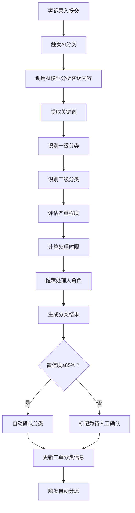
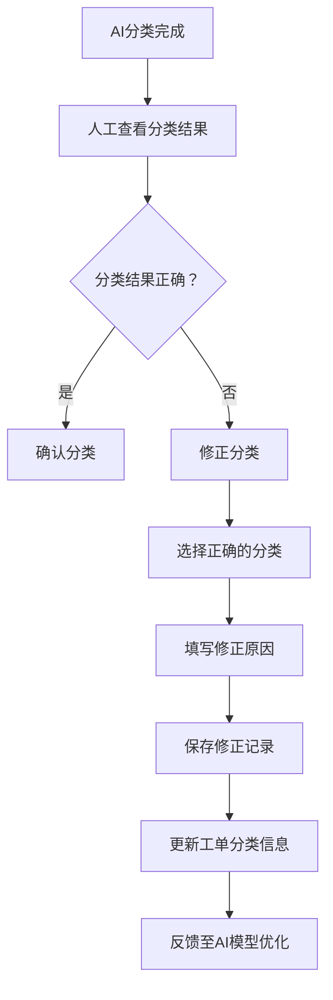

# 客诉工单系统 · AI智能分类功能设计

***

## 文档信息

| 项目   | 内容                   |
| ---- | -------------------- |
| 文档编号 | PRD-006-FD-2026-002 |
| 文档版本 | v0.1                 |
| 产品名称 | 客诉工单自动化与智能分类系统 |
| 所属系统 | 客诉工单系统（钉钉AI表格应用） |
| 编制日期 | 2026-06-12       |
| 编制人员 | AI 智能体               |

### 修订记录

| 版本   | 修订日期           | 修订说明 | 修订人    |
| ---- | -------------- | ---- | ------ |
| v0.1 | 2026-06-12 | 初稿创建 | AI 智能体 |

***

> **文档撰写规范（重要）**
>
> 1. **严格遵循模板格式**：各章节表格字段必须与模板保持一致
> 2. **聚焦业务规则**：描述业务逻辑、数据约束、权限控制等，不写技术实现细节
> 3. **减少不必要的示例**：不写JSON/XML格式的报文示例，仅描述报文格式以实际接口返回为准
> 4. **页面布局与交互分离**：§四仅描述页面结构（长什么样），§五描述业务规则（怎么操作）

***

## 一、功能角色矩阵说明

### 1.1 功能描述

- **功能名称：** AI智能分类
- **所属模块：** 客诉受理
- **功能描述：** 系统自动分析客诉内容，识别问题类型（商品质量/服务态度/配送问题/其他）、评估严重程度、提取关键词，并推荐处理方案和处理人角色。

### 1.2 角色权限总览

| 角色      | 功能权限                        | 数据权限   |
| ------- | --------------------------- | ------ |
| 客服人员 | 查看分类结果、修正分类              | 全量数据   |
| 店长 | 查看分类结果、修正分类              | 本门店数据  |
| 品控人员 | 查看分类结果、修正分类、管理分类规则     | 全量数据   |
| 运营管理层 | 查看分类结果、修正分类、管理分类规则    | 全量数据   |

### 1.3 功能角色矩阵

| 功能点  | 客服人员 | 店长 | 品控人员 | 运营管理层 |
| ---- | :-----: | :-----: | :-----: | :-----: |
| 查看分类结果 |    是    |    是    |    是    |    是    |
| 修正分类 |    是    |    是    |    是    |    是    |
| 管理分类规则 |    否    |    否    |    是    |    是    |
| 查看分类统计 |    否    |    否    |    是    |    是    |

***

## 二、模块路径

系统首页 → 客诉管理 → AI分类管理 → 分类结果查看 / 分类规则配置

***

## 三、状态流转与流程图

### 3.1 业务流程图



### 3.2 分类修正流程



***

## 四、页面布局

### 4.1 页面清单

|  序号 | 页面名称    | 页面类型   | 描述                           |
| :-: | ------- | ------ | ---------------------------- |
|  1  | 分类结果查看 | 弹窗     | 展示AI分类详情，支持人工修正           |
|  2  | 分类规则列表 | 主页面    | 管理AI分类规则（关键词、分类映射）       |
|  3  | 分类规则编辑弹窗 | 弹窗     | 新增或编辑分类规则                  |
|  4  | 分类统计页面 | 页面     | 展示AI分类准确率统计                |

***

### 4.2 分类结果查看弹窗布局

```
┌─────────────────────────────────────────────────┐
│  AI分类结果                               [X]  │
├─────────────────────────────────────────────────┤
│  ┌─────────────────────────────────────────┐    │
│  │ 工单编号：C20260612001                   │    │
│  └─────────────────────────────────────────┘    │
│  ┌─────────────────────────────────────────┐    │
│  │ 客诉内容：                                │    │
│  │ 今天买的草莓不新鲜了，都有点烂了            │    │
│  └─────────────────────────────────────────┘    │
│  ┌──────────────┐ ┌────────────────────────┐    │
│  │ 一级分类     │ │ 商品质量               │    │
│  └──────────────┘ └────────────────────────┘    │
│  ┌──────────────┐ ┌────────────────────────┐    │
│  │ 二级分类     │ │ 新鲜度问题              │    │
│  └──────────────┘ └────────────────────────┘    │
│  ┌──────────────┐ ┌────────────────────────┐    │
│  │ 严重程度     │ │ P1-紧急               │    │
│  └──────────────┘ └────────────────────────┘    │
│  ┌──────────────┐ ┌────────────────────────┐    │
│  │ 置信度       │ │ 92%                   │    │
│  └──────────────┘ └────────────────────────┘    │
│  ┌──────────────┐ ┌────────────────────────┐    │
│  │ 关键词       │ │ 草莓、不新鲜            │    │
│  └──────────────┘ └────────────────────────┘    │
│  ┌──────────────┐ ┌────────────────────────┐    │
│  │ 建议处理时限  │ │ 4小时                  │    │
│  └──────────────┘ └────────────────────────┘    │
│  ┌──────────────┐ ┌────────────────────────┐    │
│  │ 建议处理人    │ │ 店长                   │    │
│  └──────────────┘ └────────────────────────┘    │
│                                                 │
│              [修正分类]  [确认分类]  [关闭]       │
└─────────────────────────────────────────────────┘
```

### 4.2.1 展示字段说明

| 字段      | 组件类型 | 位置   | 说明         |
| ------- | ---- | ---- | ---------- |
| 工单编号 | 文本   | 独占一行 | 只读，系统自动生成 |
| 客诉内容 | 文本   | 独占一行 | 只读         |
| 一级分类 | 标签   | 独占一行 | 可点击修正     |
| 二级分类 | 标签   | 独占一行 | 可点击修正     |
| 严重程度 | 标签   | 独占一行 | 可点击修正     |
| 置信度 | 文本   | 独占一行 | 只读，百分比格式  |
| 关键词 | 标签组  | 独占一行 | 只读         |
| 建议处理时限 | 文本   | 独占一行 | 只读         |
| 建议处理人 | 文本   | 独占一行 | 只读         |

### 4.2.2 按钮区

| 按钮 | 组件类型 | 位置 | 说明       |
| -- | ---- | -- | -------- |
| 修正分类 | 按钮   | 居左 | 打开分类修正面板 |
| 确认分类 | 按钮   | 居右 | 确认AI分类结果 |
| 关闭 | 按钮   | 居右 | 关闭弹窗     |

***

### 4.3 分类规则列表页面布局

```
┌─────────────────────────────────────────────────────────────────┐
│  查询条件区                                                       │
│  ┌─────────────┐ ┌─────────────┐ ┌──────┐ ┌──────┐             │
│  │ 规则名称    │ │ 一级分类    │ │ 查询 │ │ 重置 │             │
│  │ [输入框    ]│ │ [下拉框   ▼]│ │ 按钮 │ │ 按钮 │             │
│  └─────────────┘ └─────────────┘ └──────┘ └──────┘             │
├─────────────────────────────────────────────────────────────────┤
│  工具栏区    [+新增规则]  [导出]                                  │
├─────────────────────────────────────────────────────────────────┤
│  列表数据区                                                       │
│  ┌─────┬──────────┬──────────┬────────┬──────────┬────────┬──────────┐ │
│  │ 序号 │ 规则名称  │ 关键词    │ 一级分类│ 二级分类  │ 优先级 │ 操作     │ │
│  ├─────┼──────────┼──────────┼────────┼──────────┼────────┼──────────┤ │
│  │  1  │ 新鲜度规则 │ 不新鲜,烂 │ 商品质量│ 新鲜度问题 │  10   │ [编辑][删除]│ │
│  │  2  │ 配送延迟规则│ 延迟,没送到│ 配送问题│ 配送延迟  │  10   │ [编辑][删除]│ │
│  └─────┴──────────┴──────────┴────────┴──────────┴────────┴──────────┘ │
├─────────────────────────────────────────────────────────────────┤
│  分页区    [< 1 2 3 ... 10 >]  [每页 10 ▼]  共 20 条            │
└─────────────────────────────────────────────────────────────────┘
```

### 4.3.1 查询条件区

| 组件名称    | 组件类型 | 位置 | 提示语            | 说明        |
| ------- | ---- | -- | -------------- | --------- |
| 规则名称 | 输入框  | 居左 | 请输入规则名称        | 模糊查询    |
| 一级分类 | 下拉框  | 居左 | 请选择一级分类       | 精确查询    |
| 查询      | 按钮   | 居右 | —              | 主按钮       |
| 重置      | 按钮   | 居右 | —              | 次按钮       |

### 4.3.2 工具栏区

| 组件名称 | 组件类型 | 位置 | 提示语 | 说明          |
| ---- | ---- | -- | --- | ----------- |
| 新增规则 | 按钮   | 居左 | —   | 品控/运营可见  |
| 导出   | 按钮   | 居右 | —   | —           |

### 4.3.3 列表展示区

| 字段      | 组件类型 | 位置 | 说明                |
| ------- | ---- | -- | ----------------- |
| 序号      | 文本   | 居中 | —                 |
| 规则名称 | 文本   | 居左 | —                 |
| 关键词 | 文本   | 居左 | 截断展示，hover显示完整  |
| 一级分类 | 标签   | 居左 | 枚举-badge样式        |
| 二级分类 | 标签   | 居左 | 枚举-badge样式        |
| 优先级 | 文本   | 居中 | 数字越大优先级越高      |
| 操作      | 按钮组  | 居中 | [编辑] [删除]       |

***

### 4.4 分类规则编辑弹窗布局

```
┌─────────────────────────────────────────────────┐
│  分类规则编辑                              [X]  │
├─────────────────────────────────────────────────┤
│  ┌─────────────────────────────────────────┐    │
│  │ 规则名称                                  │    │
│  │ [输入框                                ]  │    │
│  └─────────────────────────────────────────┘    │
│  ┌─────────────────────────────────────────┐    │
│  │ 关键词（逗号分隔）                         │    │
│  │ [多行文本框                           ]  │    │
│  └─────────────────────────────────────────┘    │
│  ┌─────────────────────────────────────────┐    │
│  │ 一级分类                                  │    │
│  │ [下拉框                                ▼]  │    │
│  └─────────────────────────────────────────┘    │
│  ┌─────────────────────────────────────────┐    │
│  │ 二级分类                                  │    │
│  │ [下拉框                                ▼]  │    │
│  └─────────────────────────────────────────┘    │
│  ┌─────────────────────────────────────────┐    │
│  │ 严重程度                                  │    │
│  │ [下拉框                                ▼]  │    │
│  └─────────────────────────────────────────┘    │
│  ┌─────────────────────────────────────────┐    │
│  │ 优先级                                    │    │
│  │ [数字输入框                            ]  │    │
│  └─────────────────────────────────────────┘    │
│                                                 │
│                              [取消]  [确定]      │
└─────────────────────────────────────────────────┘
```

### 4.4.1 表单字段说明

| 字段      | 组件类型 | 位置   | 提示语            | 说明        |
| ------- | ---- | ---- | -------------- | --------- |
| 规则名称 | 输入框  | 独占一行 | 请输入规则名称        | 必填\*      |
| 关键词 | 多行文本框 | 独占一行 | 请输入关键词，逗号分隔   | 必填\*      |
| 一级分类 | 下拉框  | 独占一行 | 请选择一级分类       | 必填\*      |
| 二级分类 | 下拉框  | 独占一行 | 请选择二级分类       | 必填\*      |
| 严重程度 | 下拉框  | 独占一行 | 请选择严重程度       | 必填\*      |
| 优先级 | 数字输入框 | 独占一行 | 请输入优先级（1-100）  | 必填\*      |

***

## 五、页面交互说明

### 5.1 分类结果查看弹窗交互说明

#### 5.1.1 字段交互规则

| 字段            | 类型 | 是否必填 | 约束规则                       | 展示规则                | 举例或枚举       |
| ------------- | -- | :--: | -------------------------- | ------------------- | ----------- |
| 一级分类       | 标签 |   —  | 点击可打开修正下拉框              | 可编辑                | 商品质量     |
| 二级分类       | 标签 |   —  | 点击可打开修正下拉框              | 可编辑                | 新鲜度问题     |
| 严重程度       | 标签 |   —  | 点击可打开修正下拉框              | 可编辑                | P1-紧急     |

#### 5.1.2 操作交互逻辑

| 操作类型 | 触发操作      | 交互可用性       | 正向输出                    | 异常场景 | 异常处理               | 日志级别 |
| ---- | --------- | ----------- | ----------------------- | ---- | ------------------ | ---- |
| 确认分类 | 点击"确认分类" | 始终可用        | 关闭弹窗，分类结果生效，触发自动分派     | 无    | 无                  | 接口级  |
| 修正分类 | 点击"修正分类" | 始终可用        | 展开修正面板，允许修改分类和填写修正原因 | 无    | 无                  | 接口级  |
| 关闭   | 点击"关闭"   | 始终可用        | 关闭弹窗，分类结果暂不生效（下次打开可继续修正） | 无    | 无                  | 不记录  |

#### 5.1.3 修正分类规则

| 规则项  | 说明                                   |
| ---- | ------------------------------------ |
| 修正权限 | 客服人员、店长、品控人员、运营管理层均可修正           |
| 修正记录 | 每次修正需记录：修正人、修正时间、修正前值、修正后值、修正原因 |
| 修正原因 | 必填，最少5字符，最多200字符                    |
| 反馈机制 | 修正记录自动反馈至AI模型优化训练集                |

***

### 5.2 分类规则列表页面交互说明

#### 5.2.1 字段交互规则

| 字段        | 类型  | 是否必填 | 约束规则                  | 展示规则 | 举例或枚举       |
| --------- | --- | :--: | --------------------- | ---- | ----------- |
| 规则名称 | 输入框 |   否  | 支持模糊查询；最大50字符       | 明文   | 新鲜度规则 |
| 一级分类 | 下拉框 |   否  | 精确查询；数据源参见第九章数据字典 | 明文   | 商品质量/服务态度/配送问题/其他 |

#### 5.2.2 操作交互逻辑

| 操作类型 | 触发操作     | 交互可用性       | 正向输出                                        | 异常场景                                           | 异常处理             | 日志级别 |
| ---- | -------- | ----------- | ------------------------------------------- | ---------------------------------------------- | ---------------- | ---- |
| 查询   | 点击"查询"   | 始终可用        | 按条件筛选，结果在列表中展示，分页同步更新                       | 无                                              | 无                | 接口级  |
| 重置   | 点击"重置"   | 始终可用        | 清空所有筛选条件，恢复初始查询状态                           | 无                                              | 无                | 接口级  |
| 新增规则 | 点击"新增规则" | 品控/运营可用    | 打开"分类规则编辑"弹窗                             | 无                                              | 无                | 接口级  |
| 编辑   | 点击"编辑"   | 品控/运营可用    | 打开"分类规则编辑"弹窗，反显当前数据                       | 无                                              | 无                | 接口级  |
| 删除   | 点击"删除"   | 品控/运营可用    | 弹出确认弹窗；确认后执行删除，自动刷新列表                    | 已被引用的规则                                        | 提示"该规则已被引用，无法删除" | 接口级  |
| 导出   | 点击"导出"   | 品控/运营可用    | 导出全量数据，下载Excel文件                          | 无数据                                            | Toast提示"暂无数据可导出" | 接口级  |

> **导出文件命名规范**：
>
> - 格式：`{业务前缀}_{YYYYMMDD}_{HHMMSS}.xlsx`
> - 示例：`分类规则_20260612_103045.xlsx`

***

### 5.3 分类规则编辑弹窗交互说明

#### 5.3.1 字段交互规则

| 字段            | 类型 | 是否必填 | 约束规则                       | 展示规则                | 举例或枚举       |
| ------------- | -- | :--: | -------------------------- | ------------------- | ----------- |
| 规则名称       | 文本 |   是  | 支持1-50个字符                | 明文                  | 新鲜度规则     |
| 关键词       | 多行文本框 |   是  | 至少1个关键词，逗号分隔；最多200字符     | 明文                  | 不新鲜,烂,坏了 |
| 一级分类       | 下拉框 |   是  | 精确选择；数据源参见第九章数据字典      | 明文                  | 商品质量     |
| 二级分类       | 下拉框 |   是  | 依赖一级分类动态加载              | 明文                  | 新鲜度问题     |
| 严重程度       | 下拉框 |   是  | 精确选择；数据源参见第九章数据字典      | 明文                  | P1-紧急     |
| 优先级       | 数字 |   是  | 1-100之间的整数               | 明文                  | 10         |

#### 5.3.2 操作交互逻辑

| 操作类型 | 触发操作      | 交互可用性       | 正向输出                    | 异常场景 | 异常处理               | 日志级别 |
| ---- | --------- | ----------- | ----------------------- | ---- | ------------------ | ---- |
| 确定保存 | 点击"确定"按钮  | 必填字段全部合规后可用 | 弹窗关闭，列表刷新，Toast提示"保存成功" | 保存失败 | Toast提示"保存失败，请重试！" | 接口级  |
| 取消   | 点击"取消"按钮  | 始终可用        | 关闭弹窗，不保存任何数据            | 无    | 无                  | 不记录  |
| 关闭   | 点击右上角\[X] | 始终可用        | 关闭弹窗，不保存任何数据            | 无    | 无                  | 不记录  |

#### 5.3.3 弹窗说明

| 规则项  | 说明                                   |
| ---- | ------------------------------------ |
| 打开方式 | 点击列表页工具栏"新增规则"按钮，或操作列"编辑"按钮          |
| 标题   | 新增时显示"新增分类规则"；编辑时显示"编辑分类规则"          |
| 数据反显 | 编辑时自动回填当前记录数据；新增时所有字段为空              |
| 校验时机 | 字段失焦时触发单字段校验；点击"确定"时触发全量校验           |
| 保存规则 | 全部校验通过后提交保存；校验失败时字段下方显示红色提示文本，字段边框变红 |
| 关闭确认 | 如有未保存的修改，关闭时弹出二次确认"是否放弃编辑？"          |

***

### 5.4 删除确认弹窗交互说明

#### 5.4.1 操作交互逻辑

| 操作类型 | 触发操作     | 交互可用性 | 正向输出             | 异常场景 | 异常处理    | 日志级别 |
| ---- | -------- | ----- | ---------------- | ---- | ------- | ---- |
| 确认删除 | 点击"确定"按钮 | 始终可用  | 执行删除，弹窗关闭，列表自动刷新 | 删除失败 | Toast提示 | 接口级  |
| 取消   | 点击"取消"按钮 | 始终可用  | 关闭弹窗，不做任何操作      | 无    | 无       | 不记录  |

#### 5.4.2 弹窗说明

| 规则项  | 说明              |
| ---- | --------------- |
| 触发条件 | 点击列表行操作列的"删除"按钮 |
| 提示文案 | "是否确认删除该分类规则？" |
| 确认操作 | 执行删除，弹窗关闭，列表刷新  |
| 取消操作 | 关闭弹窗不做任何操作      |

***

## 六、错误处理规范

### 6.1 表单校验错误

- 显示方式：对应字段下方显示红色提示文本，字段边框变红
- 触发时机：表单提交时触发全量校验；字段失去焦点时触发单字段校验

| 字段      | 为空时错误信息     | 格式错误时信息           |
| ------- | ----------- | ----------------- |
| 规则名称 | 规则名称不能为空 | 规则名称长度应在1-50个字符之间 |
| 关键词 | 关键词不能为空 | 至少输入1个关键词 |
| 一级分类 | 请选择一级分类  | —                 |
| 二级分类 | 请选择二级分类  | —                 |
| 严重程度 | 请选择严重程度  | —                 |
| 优先级 | 优先级不能为空 | 优先级应为1-100之间的整数 |

### 6.2 AI分类异常处理

| 场景      | 触发条件                         | 提示文案                    | 处理方式                       |
| ------- | ---------------------------- | ----------------------- | -------------------------- |
| AI服务不可用 | AI模型调用失败                    | AI分类服务暂不可用，已转人工分类      | 工单标记为"待人工分类"，通知客服人员    |
| 分类超时   | AI模型调用超过10秒                 | AI分类超时，已转人工分类         | 工单标记为"待人工分类"，通知客服人员    |
| 低置信度   | 分类置信度低于85%                  | AI分类置信度较低，请人工确认       | 展示分类结果，标记为"待人工确认"      |

***

## 七、非功能性需求

### 7.1 合规与安全要求

| 适用规范       | 内容摘要              | 本模块特有说明                    |
| ---------- | ----------------- | -------------------------- |
| 访问控制   | RBAC最小权限、数据权限隔离   | 仅品控和运营可管理分类规则；所有角色可查看和修正分类 |
| 操作日志   | 字段级日志、保留期限、不可篡改   | 覆盖操作：修正分类/新增规则/编辑规则/删除规则 |
| 敏感数据脱敏 | 各字段脱敏规则           | 本模块无敏感字段             |
| 文件操作安全 | 导出上限、下载鉴权、导出行为记日志 | 单次导出上限1000条          |

### 7.2 性能需求

| 需求项       | 指标要求          | 说明            |
| --------- | ------------- | ------------- |
| AI分类响应时间  | ≤ 10s         | 正常网络条件下，调用AI模型 |
| 列表查询响应时间  | ≤ 2s          | 正常网络条件下，含分页查询 |
| 保存/提交响应时间 | ≤ 3s          | 新增/修改/删除等写操作  |
| 导出响应时间    | ≤ 5s（1000条以内） | 超出时建议提示异步处理   |
| 页面首屏加载时间  | ≤ 3s          | —             |
| 并发用户数     | 50人同时操作      | 按实际业务填写       |

***

## 八、特殊说明

### 8.1 AI分类模型选择

| 组件 | 推荐模型 | 理由 |
|------|----------|------|
| 文本分类 | qwen-plus | 中文文本分类准确率高 |
| 情感分析 | qwen-plus | 判断客户情绪，辅助严重程度评估 |
| 关键词提取 | qwen-flash | 快速提取关键信息 |

### 8.2 分类准确率要求

| 指标 | 目标值 | 验收方法 |
|------|--------|----------|
| 一级分类准确率 | ≥ 90% | 200条测试集 |
| 二级分类准确率 | ≥ 85% | 200条测试集 |
| 严重程度准确率 | ≥ 80% | 200条测试集 |

### 8.3 分类规则优先级规则

1. 多条规则同时匹配时，优先级高的规则生效
2. 优先级相同时，匹配关键词数量多的规则生效
3. 优先级和关键词数量都相同时，最近创建的规则生效
4. 规则匹配后，AI模型进行二次校验，综合输出最终分类结果

### 8.4 二级分类联动规则

1. 一级分类选择后，二级分类下拉框动态加载对应的二级分类选项
2. 修改一级分类时，二级分类自动清空
3. 二级分类选项与一级分类的映射关系参见第九章数据字典

***

## 九、数据字典

### 9.1 字典项定义

**一级分类（category1）**

| 枚举值（code） | 显示文本（label） | 说明     |
| :-------: | ----------- | ------ |
|     1     | 商品质量        | 商品相关问题 |
|     2     | 服务态度        | 服务相关问题 |
|     3     | 配送问题        | 配送相关问题 |
|     4     | 其他          | 其他问题   |

**二级分类（category2）**

| 枚举值（code） | 显示文本（label） | 所属一级分类 | 说明     |
| :-------: | ----------- | :-------: | ------ |
|     1     | 新鲜度问题        | 商品质量 | 商品不新鲜   |
|     2     | 包装破损        | 商品质量 | 包装损坏    |
|     3     | 缺斤少两        | 商品质量 | 分量不足    |
|     4     | 态度恶劣        | 服务态度 | 服务态度差   |
|     5     | 响应慢         | 服务态度 | 响应不及时   |
|     6     | 配送延迟        | 配送问题 | 配送超时    |
|     7     | 配送错误        | 配送问题 | 送错商品    |
|     8     | 价格争议        | 其他   | 价格问题    |

**严重程度（severity）**

| 枚举值（code） | 显示文本（label） | 处理时限 | 说明     |
| :-------: | ----------- | ---- | ------ |
|     1     | P1-紧急       | 4小时 | 需立即处理 |
|     2     | P2-重要       | 12小时 | 需优先处理 |
|     3     | P3-一般       | 24小时 | 常规处理   |

### 9.2 下拉框数据来源说明

| 字段名     | 数据来源类型 | 来源说明                        |
| ------- | ------ | --------------------------- |
| 一级分类 | 字典项    | 参见 9.1 category1            |
| 二级分类 | 字典项    | 参见 9.1 category2，依赖一级分类动态过滤 |
| 严重程度 | 字典项    | 参见 9.1 severity            |

***

## 十、外部系统接口说明

### 10.1 接口清单

| 接口名称    | 功能描述           | 交互方向     | 依赖系统     | 数据流向                    |
| ------- | -------------- | -------- | -------- | ----------------------- |
| AI分类接口 | 调用AI模型进行客诉分类 | 调用 | AI模型服务 | 本系统→AI模型服务，AI模型服务→本系统 |
| 分类修正记录接口 | 保存人工修正记录 | 调用 | AI模型服务 | 本系统→AI模型服务（反馈优化） |

### 10.2 接口详细说明

**AI分类接口**

| 规则项  | 说明                    |
| ---- | --------------------- |
| 触发时机 | 客诉录入提交成功后自动调用        |
| 请求条件 | 客诉内容不为空              |
| 成功处理 | 返回分类结果（一级分类/二级分类/严重程度/置信度/关键词） |
| 失败处理 | 标记为"待人工分类"，通知客服人员   |
| 重试机制 | 不自动重试，转人工处理          |

**分类修正记录接口**

| 规则项  | 说明                    |
| ---- | --------------------- |
| 触发时机 | 人工修正分类后保存时调用        |
| 请求条件 | 修正前后值不一致              |
| 成功处理 | 修正记录保存成功，反馈至AI模型优化   |
| 失败处理 | 本地记录保存成功，异步重试同步至AI服务 |
| 重试机制 | 自动重试3次，间隔5秒          |

***

*文档结束*
