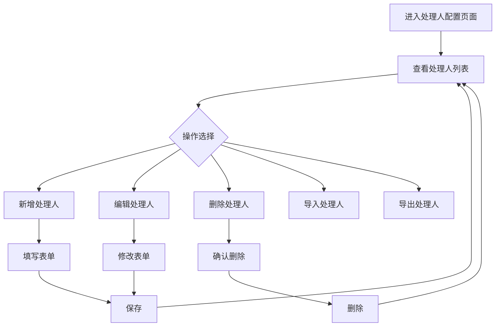
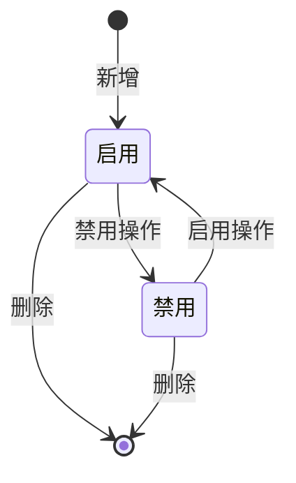

# 客诉工单系统 · 处理人配置管理功能设计

***

## 文档信息

| 项目   | 内容                   |
| ---- | -------------------- |
| 文档编号 | PRD-006-FD-2026-006 |
| 文档版本 | v0.1                 |
| 产品名称 | 客诉工单自动化与智能分类系统 |
| 所属系统 | 客诉工单系统（钉钉AI表格应用） |
| 编制日期 | 2026-06-12       |
| 编制人员 | AI 智能体               |

### 修订记录

| 版本   | 修订日期           | 修订说明 | 修订人    |
| ---- | -------------- | ---- | ------ |
| v0.1 | 2026-06-12 | 初稿创建 | AI 智能体 |

***

> **文档撰写规范（重要）**
>
> 1. **严格遵循模板格式**：各章节表格字段必须与模板保持一致
> 2. **聚焦业务规则**：描述业务逻辑、数据约束、权限控制等，不写技术实现细节
> 3. **减少不必要的示例**：不写JSON/XML格式的报文示例，仅描述报文格式以实际接口返回为准
> 4. **页面布局与交互分离**：§四仅描述页面结构（长什么样），§五描述业务规则（怎么操作）

***

## 一、功能角色矩阵说明

### 1.1 功能描述

- **功能名称：** 处理人配置管理
- **所属模块：** 系统管理
- **功能描述：** 管理客诉工单处理人的基本信息、角色、负责分类、最大工单负载等配置，支持处理人的启用/禁用和负载均衡配置。

### 1.2 角色权限总览

| 角色      | 功能权限                        | 数据权限   |
| ------- | --------------------------- | ------ |
| 客服人员 | 无权限                         | 无权限    |
| 店长 | 查看列表                        | 全量数据   |
| 品控人员 | 查看列表、查看详情                | 全量数据   |
| 运营管理层 | 查看列表、查看详情、新增、修改、删除、导入、导出 | 全量数据   |

### 1.3 功能角色矩阵

| 功能点  | 客服人员 | 店长 | 品控人员 | 运营管理层 |
| ---- | :-----: | :-----: | :-----: | :-----: |
| 查看列表 |    否    |    是    |    是    |    是    |
| 查看详情 |    否    |    否    |    是    |    是    |
| 新增   |    否    |    否    |    否    |    是    |
| 修改   |    否    |    否    |    否    |    是    |
| 删除   |    否    |    否    |    否    |    是    |
| 导入   |    否    |    否    |    否    |    是    |
| 导出   |    否    |    否    |    否    |    是    |

***

## 二、模块路径

系统首页 → 系统管理 → 处理人配置 → 处理人列表

***

## 三、状态流转与流程图

### 3.1 处理人配置流程



### 3.2 状态流转图



***

## 四、页面布局

### 4.1 页面清单

|  序号 | 页面名称    | 页面类型   | 描述                           |
| :-: | ------- | ------ | ---------------------------- |
|  1  | 处理人列表 | 主页面    | 展示所有处理人配置，支持查询、筛选、操作       |
|  2  | 新增/编辑弹窗 | 弹窗     | 新增或编辑处理人配置                  |
|  3  | 查看详情弹窗 | 弹窗     | 查看处理人完整信息（只读）              |
|  4  | 批量导入弹窗 | 弹窗     | 上传 Excel 文件完成批量录入           |
|  5  | 删除确认弹窗 | 弹窗     | 删除操作二次确认                   |

***

### 4.2 处理人列表页面布局

```
┌─────────────────────────────────────────────────────────────────┐
│  查询条件区                                                       │
│  ┌─────────────┐ ┌─────────────┐ ┌──────────┐ ┌──────┐ ┌──────┐ │
│  │ 处理人姓名  │ │ 角色       │ │ 状态     │ │ 查询 │ │ 重置 │ │
│  │ [输入框    ]│ │ [下拉框   ▼]│ │ [下拉框 ▼]│ │ 按钮 │ │ 按钮 │ │
│  └─────────────┘ └─────────────┘ └──────────┘ └──────┘ └──────┘ │
├─────────────────────────────────────────────────────────────────┤
│  工具栏区    [+新增]  [导入]  [批量删除]         [导出]          │
├─────────────────────────────────────────────────────────────────┤
│  列表数据区                                                       │
│  ┌────┬─────┬──────────┬──────────┬──────────┬──────────┬──────────┐ │
│  │ □  │ 序号 │ 处理人    │ 角色      │ 负责分类  │ 当前工单数│ 操作     │ │
│  ├────┼─────┼──────────┼──────────┼──────────┼──────────┼──────────┤ │
│  │ □  │  1  │ 店长-李四 │ 店长      │ 商品质量  │ 5/10     │ [详情][编辑][删除]│ │
│  │ □  │  2  │ 客服-王五 │ 客服      │ 服务态度  │ 8/15     │ [详情][编辑][删除]│ │
│  └────┴─────┴──────────┴──────────┴──────────┴──────────┴──────────┘ │
├─────────────────────────────────────────────────────────────────┤
│  分页区    [< 1 2 3 ... 10 >]  [每页 10 ▼]  共 15 条            │
└─────────────────────────────────────────────────────────────────┘
```

### 4.2.1 查询条件区

| 组件名称    | 组件类型 | 位置 | 提示语            | 说明        |
| ------- | ---- | -- | -------------- | --------- |
| 处理人姓名 | 输入框  | 居左 | 请输入处理人姓名       | 模糊查询    |
| 角色 | 下拉框  | 居左 | 请选择角色         | 精确查询    |
| 状态 | 下拉框  | 居左 | 请选择状态         | 精确查询    |
| 查询      | 按钮   | 居右 | —              | 主按钮       |
| 重置      | 按钮   | 居右 | —              | 次按钮       |

### 4.2.2 工具栏区

| 组件名称 | 组件类型 | 位置 | 提示语 | 说明          |
| ---- | ---- | -- | --- | ----------- |
| 新增   | 按钮   | 居左 | —   | 运营管理层可见 |
| 导入   | 按钮   | 居左 | —   | 运营管理层可见 |
| 批量删除 | 按钮   | 居左 | —   | 灰化，选中数据后启用  |
| 导出   | 按钮   | 居右 | —   | 运营管理层可见 |

### 4.2.3 列表展示区

| 字段      | 组件类型 | 位置 | 说明                |
| ------- | ---- | -- | ----------------- |
| 复选框     | 复选框  | 首列 | 批量操作时勾选           |
| 序号      | 文本   | 居中 | —                 |
| 处理人 | 文本   | 居左 | —                 |
| 角色      | 标签   | 居左 | 枚举-badge样式        |
| 负责分类 | 标签组  | 居左 | 多标签展示           |
| 当前工单数 | 文本   | 居左 | 格式：当前数/最大数      |
| 操作      | 按钮组  | 居中 | [详情] [编辑] [删除] |

### 4.2.4 分页控件区

| 控件    | 组件类型 | 位置 | 说明      |
| ----- | ---- | -- | ------- |
| 总条数   | 文本   | 居左 | 共0条记录   |
| 页码按钮  | 按钮组  | 居中 | 1高亮     |
| 向前翻页  | 按钮   | 居中 | <       |
| 向后翻页  | 按钮   | 居中 | >       |
| 每页条目数 | 下拉框  | 居右 | 默认10条/页 |
| 跳转至页码 | 输入框  | 居右 | 默认1     |

***

### 4.3 新增/编辑弹窗布局

```
┌─────────────────────────────────────────────────┐
│  新增处理人配置                            [X]  │
├─────────────────────────────────────────────────┤
│  ┌─────────────────────────────────────────┐    │
│  │ 处理人                                  │    │
│  │ [下拉搜索框（钉钉用户）               ▼]  │    │
│  └─────────────────────────────────────────┘    │
│  ┌─────────────────────────────────────────┐    │
│  │ 角色                                    │    │
│  │ [下拉框                                ▼]  │    │
│  └─────────────────────────────────────────┘    │
│  ┌─────────────────────────────────────────┐    │
│  │ 负责分类（可多选）                        │    │
│  │ [多选下拉框                           ▼]  │    │
│  └─────────────────────────────────────────┘    │
│  ┌─────────────────────────────────────────┐    │
│  │ 最大工单数                                │    │
│  │ [数字输入框                            ]  │    │
│  └─────────────────────────────────────────┘    │
│  ┌─────────────────────────────────────────┐    │
│  │ 状态                                    │    │
│  │ ○ 启用  ○ 禁用                           │    │
│  └─────────────────────────────────────────┘    │
│                                                 │
│                              [取消]  [确定]      │
└─────────────────────────────────────────────────┘
```

### 4.3.1 表单字段说明

| 字段      | 组件类型 | 位置   | 提示语            | 说明        |
| ------- | ---- | ---- | -------------- | --------- |
| 处理人 | 下拉搜索框 | 独占一行 | 请选择处理人（钉钉用户） | 必填\*      |
| 角色 | 下拉框  | 独占一行 | 请选择角色         | 必填\*      |
| 负责分类 | 多选下拉框 | 独占一行 | 请选择负责分类       | 必填\*      |
| 最大工单数 | 数字输入框 | 独占一行 | 请输入最大工单数      | 必填\*      |
| 状态 | 单选按钮组 | 独占一行 | —              | 必填\*      |

***

### 4.4 查看详情弹窗布局

```
┌─────────────────────────────────────────────────┐
│  查看处理人配置                            [X]  │
├─────────────────────────────────────────────────┤
│  ┌──────────────┐ ┌────────────────────────┐    │
│  │ 处理人       │ │ 店长-李四              │    │
│  └──────────────┘ └────────────────────────┘    │
│  ┌──────────────┐ ┌────────────────────────┐    │
│  │ 角色         │ │ 店长                   │    │
│  └──────────────┘ └────────────────────────┘    │
│  ┌──────────────┐ ┌────────────────────────┐    │
│  │ 负责分类     │ │ 商品质量, 配送问题       │    │
│  └──────────────┘ └────────────────────────┘    │
│  ┌──────────────┐ ┌────────────────────────┐    │
│  │ 最大工单数   │ │ 10                     │    │
│  └──────────────┘ └────────────────────────┘    │
│  ┌──────────────┐ ┌────────────────────────┐    │
│  │ 当前工单数   │ │ 5                      │    │
│  └──────────────┘ └────────────────────────┘    │
│  ┌──────────────┐ ┌────────────────────────┐    │
│  │ 状态         │ │ 启用                   │    │
│  └──────────────┘ └────────────────────────┘    │
│  ┌──────────────┐ ┌────────────────────────┐    │
│  │ 创建时间     │ │ 2026-06-01 10:00:00    │    │
│  └──────────────┘ └────────────────────────┘    │
│                                                 │
│                                    [关闭]       │
└─────────────────────────────────────────────────┘
```

### 4.4.1 展示字段说明

| 字段      | 组件类型 | 位置   | 说明         |
| ------- | ---- | ---- | ---------- |
| 处理人 | 文本   | 独占一行 | 只读         |
| 角色 | 标签   | 独占一行 | 只读         |
| 负责分类 | 标签组  | 独占一行 | 只读         |
| 最大工单数 | 文本   | 独占一行 | 只读         |
| 当前工单数 | 文本   | 独占一行 | 只读         |
| 状态 | 标签   | 独占一行 | 只读         |
| 创建时间 | 文本   | 独占一行 | 只读，格式见数据字典 |

***

### 4.5 批量导入弹窗布局

```
┌─────────────────────────────────────────────────┐
│  批量导入                                  [X]  │
├─────────────────────────────────────────────────┤
│  ┌─────────────────────────────────────────┐    │
│  │           点击或拖拽上传文件              │    │
│  │              [.xlsx 文件]                │    │
│  └─────────────────────────────────────────┘    │
│  [下载模板]                                     │
│                                                 │
│                              [取消]  [导入]      │
└─────────────────────────────────────────────────┘
```

### 4.5.1 表单字段说明

| 字段名称    | 是否必填 | 填写规则     | 填写示例   |
| ------- | :--: | -------- | ------ |
| 处理人ID |   是  | 钉钉用户ID   | user001 |
| 角色 |   是  | 参见数据字典   | 店长   |
| 负责分类 |   是  | 多个用逗号分隔 | 商品质量,配送问题 |
| 最大工单数 |   是  | 正整数，默认10 | 10     |

***

### 4.6 删除确认弹窗布局

```
┌─────────────────────────────────────────────────┐
│  提示                                      [X]  │
├─────────────────────────────────────────────────┤
│                                                 │
│         是否确认删除该处理人配置？                    │
│                                                 │
│                              [取消]  [确定]      │
└─────────────────────────────────────────────────┘
```

***

## 五、页面交互说明

### 5.1 列表页面交互说明

#### 5.1.1 字段交互规则

| 字段        | 类型  | 是否必填 | 约束规则                  | 展示规则 | 举例或枚举       |
| --------- | --- | :--: | --------------------- | ---- | ----------- |
| 处理人姓名 | 输入框 |   否  | 支持模糊查询；最大50字符       | 明文   | 李四     |
| 角色 | 下拉框 |   否  | 精确查询；数据源参见第九章数据字典 | 明文   | 客服/店长/品控/其他 |
| 状态 | 下拉框 |   否  | 精确查询；数据源参见第九章数据字典 | 明文   | 启用/禁用 |

#### 5.1.2 操作交互逻辑

| 操作类型 | 触发操作     | 交互可用性       | 正向输出                                        | 异常场景                                           | 异常处理             | 日志级别 |
| ---- | -------- | ----------- | ------------------------------------------- | ---------------------------------------------- | ---------------- | ---- |
| 查询   | 点击"查询"   | 始终可用        | 按条件筛选，结果在列表中展示，分页同步更新                       | 无                                              | 无                | 接口级  |
| 重置   | 点击"重置"   | 始终可用        | 清空所有筛选条件，恢复初始查询状态                           | 无                                              | 无                | 接口级  |
| 新增   | 点击"新增"   | 运营管理层可用     | 打开"新增处理人配置"弹窗                             | 无                                              | 无                | 接口级  |
| 查看详情 | 点击"详情"   | 品控/运营可用     | 打开查看弹窗，所有字段只读                            | 无                                              | 无                | 接口级  |
| 修改   | 点击"编辑"   | 运营管理层可用     | 打开"编辑处理人配置"弹窗，反显当前数据，支持编辑                    | 无                                              | 无                | 接口级  |
| 删除   | 点击"删除"   | 运营管理层可用     | 弹出确认弹窗"是否确认删除该处理人配置？"；确认后执行删除，自动刷新列表  | 当前工单数>0                                      | Toast提示"该处理人名下有工单，无法删除" | 接口级  |
| 导入   | 点击"导入"   | 运营管理层可用     | 打开"批量导入"弹窗，支持上传Excel文件完成批量录入；全部数据校验通过后一次性导入 | 存在校验错误时，遇错即停不执行导入，提示"第N行：【字段名】+错误原因"；修正后重新上传校验 | Toast提示第一个错误     | 接口级  |
| 下载模板 | 点击"下载模板" | 运营管理层可用     | 触发本地文件管理弹窗，下载批量导入模板.xlsx                    | 模板关联数据获取失败                                     | 弹出提示，同时停止下载      | 不记录  |
| 导出   | 点击"导出"   | 运营管理层可用     | 导出全量数据，下载Excel文件                          | 无数据                                            | Toast提示"暂无数据可导出" | 接口级  |

> **导出文件命名规范**：
>
> - 格式：`{业务前缀}_{YYYYMMDD}_{HHMMSS}.xlsx`
> - 示例：`处理人配置_20260612_103045.xlsx`
> - 导入模板：使用固定名称 `处理人配置批量导入模板.xlsx`（不带时间戳）

***

### 5.2 新增/编辑弹窗交互说明

#### 5.2.1 字段交互规则

| 字段            | 类型 | 是否必填 | 约束规则                       | 展示规则                | 举例或枚举       |
| ------------- | -- | :--: | -------------------------- | ------------------- | ----------- |
| 处理人       | 下拉搜索框 |   是  | 支持模糊搜索钉钉用户              | 明文                  | 店长-李四     |
| 角色       | 下拉框 |   是  | 精确选择；数据源参见第九章数据字典      | 明文                  | 店长         |
| 负责分类       | 多选下拉框 |   是  | 至少选择1个；数据源参见第九章数据字典    | 明文                  | 商品质量,配送问题 |
| 最大工单数       | 数字输入框 |   是  | 1-100之间的整数，默认10           | 明文                  | 10         |
| 状态       | 单选按钮组 |   是  | 二选一                        | 明文                  | 启用/禁用     |

#### 5.2.2 操作交互逻辑

| 操作类型 | 触发操作      | 交互可用性       | 正向输出                    | 异常场景 | 异常处理               | 日志级别 |
| ---- | --------- | ----------- | ----------------------- | ---- | ------------------ | ---- |
| 确定保存 | 点击"确定"按钮  | 必填字段全部合规后可用 | 弹窗关闭，列表刷新，Toast提示"保存成功" | 保存失败 | Toast提示"保存失败，请重试！" | 接口级  |
| 取消   | 点击"取消"按钮  | 始终可用        | 关闭弹窗，不保存任何数据            | 无    | 无                  | 不记录  |
| 关闭   | 点击右上角\[X] | 始终可用        | 关闭弹窗，不保存任何数据            | 无    | 无                  | 不记录  |

#### 5.2.3 弹窗说明

| 规则项  | 说明                                   |
| ---- | ------------------------------------ |
| 打开方式 | 点击列表页工具栏"新增"按钮，或操作列"编辑"按钮            |
| 标题   | 新增时显示"新增处理人配置"；编辑时显示"编辑处理人配置"          |
| 数据反显 | 编辑时自动回填当前记录数据；新增时所有字段为空（状态默认启用）      |
| 校验时机 | 字段失焦时触发单字段校验；点击"确定"时触发全量校验           |
| 保存规则 | 全部校验通过后提交保存；校验失败时字段下方显示红色提示文本，字段边框变红 |
| 关闭确认 | 如有未保存的修改，关闭时弹出二次确认"是否放弃编辑？"          |

***

### 5.3 查看详情弹窗交互说明

#### 5.3.1 字段交互规则

| 字段      | 组件类型 | 是否必填 | 约束规则       | 展示规则 | 举例或枚举               |
| ------- | ---- | :--: | ---------- | ---- | ------------------- |
| 处理人 | 文本   |   —  | 只读，不可编辑    | 明文   | 店长-李四               |
| 角色 | 标签   |   —  | 只读，不可编辑    | 标签   | 店长                  |
| 负责分类 | 标签组  |   —  | 只读，不可编辑    | 标签组  | 商品质量, 配送问题          |
| 最大工单数 | 文本   |   —  | 只读，不可编辑    | 明文   | 10                    |
| 当前工单数 | 文本   |   —  | 只读，不可编辑    | 明文   | 5                     |
| 状态 | 标签   |   —  | 只读，不可编辑    | 标签   | 启用                  |
| 创建时间 | 文本   |   —  | 只读，格式见数据字典 | 明文   | 2026-06-01 10:00:00 |

#### 5.3.2 操作交互逻辑

| 操作类型 | 触发操作     | 交互可用性 | 正向输出        | 异常场景 | 异常处理 | 日志级别 |
| ---- | -------- | ----- | ----------- | ---- | ---- | ---- |
| 关闭   | 点击"关闭"按钮 | 始终可用  | 关闭弹窗，返回列表页面 | 无    | 无    | 不记录  |

***

### 5.4 批量导入弹窗交互说明

#### 5.4.1 字段交互规则

| 字段名称    | 是否必填 | 填写规则     | 填写示例   |
| ------- | :--: | -------- | ------ |
| 处理人ID |   是  | 钉钉用户ID   | user001 |
| 角色 |   是  | 参见数据字典   | 店长   |
| 负责分类 |   是  | 多个用逗号分隔 | 商品质量,配送问题 |
| 最大工单数 |   是  | 正整数，默认10 | 10     |

#### 5.4.2 操作交互逻辑

| 操作类型 | 触发操作       | 交互可用性   | 正向输出                          | 异常场景               | 异常处理                         | 日志级别 |
| ---- | ---------- | ------- | ----------------------------- | ------------------ | ---------------------------- | ---- |
| 选择文件 | 点击或拖拽上传    | 始终可用    | 展示文件名及删除按钮                    | 格式非.xlsx           | Toast提示"请上传正确格式的Excel文件"     | 不记录  |
| 确认导入 | 点击"导入"按钮   | 选择文件后可用 | 全部校验通过后一次性导入，展示"导入成功，共导入X条数据" | 文件超10MB            | Toast提示"文件大小不能超过10MB"        | 接口级  |
| 取消   | 点击"取消"按钮   | 始终可用    | 关闭弹窗                          | 数据校验失败（必填/格式/长度/唯一性等） | 遇错即停，Toast提示"第N行：【字段名】+错误原因" | 不记录  |
| 下载模板 | 点击"下载模板"链接 | 始终可用    | 下载批量导入模板.xlsx                 | 模板数据获取失败           | 弹出提示，同时停止下载                  | 不记录  |

#### 5.4.3 弹窗说明

| 规则项  | 说明                                               |
| ---- | ------------------------------------------------ |
| 文件格式 | 仅支持 .xlsx 文件                                     |
| 文件大小 | 不超过 10MB                                         |
| 校验方式 | 逐行前置校验，遇错即停，不检查后续行，不执行导入                         |
| 成功提示 | "导入成功，共导入X条数据"                                   |
| 错误提示 | "第N行：【字段名】+错误原因，请修正后重新上传"                        |
| 模板结构 | Sheet1为导入数据（必填）；Sheet2为字典参考（只读，不参与导入）；按需增减 |

***

### 5.5 删除确认弹窗交互说明

#### 5.5.1 操作交互逻辑

| 操作类型 | 触发操作     | 交互可用性 | 正向输出             | 异常场景 | 异常处理    | 日志级别 |
| ---- | -------- | ----- | ---------------- | ---- | ------- | ---- |
| 确认删除 | 点击"确定"按钮 | 始终可用  | 执行删除，弹窗关闭，列表自动刷新 | 删除失败 | Toast提示 | 接口级  |
| 取消   | 点击"取消"按钮 | 始终可用  | 关闭弹窗，不做任何操作      | 无    | 无       | 不记录  |

#### 5.5.2 弹窗说明

| 规则项  | 说明              |
| ---- | --------------- |
| 触发条件 | 点击列表行操作列的"删除"按钮 |
| 提示文案 | "是否确认删除该处理人配置？" |
| 确认操作 | 执行删除，弹窗关闭，列表刷新  |
| 取消操作 | 关闭弹窗不做任何操作      |

***

## 六、错误处理规范

### 6.1 表单校验错误

- 显示方式：对应字段下方显示红色提示文本，字段边框变红
- 触发时机：表单提交时触发全量校验；字段失去焦点时触发单字段校验

| 字段      | 为空时错误信息     | 格式错误时信息           |
| ------- | ----------- | ----------------- |
| 处理人 | 请选择处理人   | —                 |
| 角色 | 请选择角色     | —                 |
| 负责分类 | 请选择负责分类  | 至少选择1个分类         |
| 最大工单数 | 最大工单数不能为空 | 最大工单数应为1-100之间的整数 |

### 6.2 文件操作错误

| 场景      | 触发条件                         | 提示文案                    | 处理方式                       |
| ------- | ---------------------------- | ----------------------- | -------------------------- |
| 导入-格式错误 | 上传非 .xlsx 文件                 | 请上传正确格式的 Excel 文件       | Toast 提示，阻断上传              |
| 导入-超大文件 | 文件超过 10MB                    | 文件大小不能超过 10MB           | Toast 提示，阻断上传              |
| 导入-校验失败 | 数据存在校验错误（必填/格式/长度/唯一性等） | 第N行：【字段名】+错误原因，请修正后重新上传 | 遇错即停，不执行任何数据导入；用户修正后重新上传校验 |
| 导出-无数据  | 当前查询结果为空                     | 暂无数据可导出                 | Toast 提示                   |
| 网络/服务异常 | 接口请求失败                       | 接口异常，请稍候再试              | Toast 提示                   |

***

## 七、非功能性需求

### 7.1 合规与安全要求

| 适用规范       | 内容摘要              | 本模块特有说明                    |
| ---------- | ----------------- | -------------------------- |
| 访问控制   | RBAC最小权限、数据权限隔离   | 仅运营管理层可增删改；店长仅可查看       |
| 操作日志   | 字段级日志、保留期限、不可篡改   | 覆盖操作：新增/修改/删除/导入/导出      |
| 敏感数据脱敏 | 各字段脱敏规则           | 本模块无敏感字段             |
| 文件操作安全 | 导出上限、下载鉴权、导出行为记日志 | 单次导出上限1000条          |

### 7.2 性能需求

| 需求项       | 指标要求          | 说明            |
| --------- | ------------- | ------------- |
| 列表查询响应时间  | ≤ 2s          | 正常网络条件下，含分页查询 |
| 保存/提交响应时间 | ≤ 3s          | 新增/修改/删除等写操作  |
| 导出响应时间    | ≤ 5s（1000条以内） | 超出时建议提示异步处理   |
| 页面首屏加载时间  | ≤ 3s          | —             |
| 并发用户数     | 30人同时操作      | 按实际业务填写       |

***

## 八、特殊说明

### 8.1 删除及修改限制

1. 当前工单数>0的处理人，删除按钮灰化不可操作
2. 处理人关联的钉钉用户被删除时，系统自动将该处理人状态变更为"禁用"
3. 编辑时，处理人字段不可修改（钉钉用户唯一绑定），如需更换处理人需新增配置

### 8.2 负责分类联动规则

1. 负责分类支持多选，至少选择1个
2. 负责分类选项与客诉分类体系一致（参见第九章数据字典）
3. 修改负责分类后，不影响已分派的工单，仅影响新分派的工单

### 8.3 最大工单数说明

1. 最大工单数用于负载均衡，控制同时分派给该处理人的工单上限
2. 当处理人当前工单数达到上限时，自动分派将跳过该处理人
3. 最大工单数不影响手动分派操作

### 8.4 其他特殊规则

1. 同一钉钉用户只能配置一条处理人记录
2. 处理人配置变更后，自动触发负载均衡重新计算
3. 禁用状态的处理人不会收到新的自动分派工单，但已分派的工单不受影响

***

## 九、数据字典

### 9.1 字典项定义

**角色（assigneeRole）**

| 枚举值（code） | 显示文本（label） | 说明     |
| :-------: | ----------- | ------ |
|     1     | 客服          | 一线客服人员 |
|     2     | 店长          | 门店管理人员 |
|     3     | 品控          | 质量管控人员 |
|     4     | 其他          | 其他角色   |

**负责分类（category）**

| 枚举值（code） | 显示文本（label） | 说明     |
| :-------: | ----------- | ------ |
|     1     | 商品质量        | 商品相关问题 |
|     2     | 服务态度        | 服务相关问题 |
|     3     | 配送问题        | 配送相关问题 |
|     4     | 其他          | 其他问题   |

**状态（assigneeStatus）**

| 枚举值（code） | 显示文本（label） | 说明     |
| :-------: | ----------- | ------ |
|     1     | 启用          | 正常状态，可接收分派 |
|     2     | 禁用          | 暂停接收分派 |

### 9.2 下拉框数据来源说明

| 字段名     | 数据来源类型 | 来源说明                        |
| ------- | ------ | --------------------------- |
| 角色 | 字典项    | 参见 9.1 assigneeRole            |
| 负责分类 | 字典项    | 参见 9.1 category            |
| 状态 | 字典项    | 参见 9.1 assigneeStatus            |
| 处理人 | 接口动态加载 | 来源：钉钉用户接口 /api/v1/user/list |

***

## 十、外部系统接口说明

### 10.1 接口清单

| 接口名称    | 功能描述           | 交互方向     | 依赖系统     | 数据流向                    |
| ------- | -------------- | -------- | -------- | ----------------------- |
| 钉钉用户列表接口 | 获取钉钉用户列表 | 调用 | 钉钉开放平台 | 钉钉开放平台→本系统 |
| 工单负载查询接口 | 查询处理人当前工单数 | 调用 | 工单管理系统 | 工单管理系统→本系统 |

### 10.2 接口详细说明

**钉钉用户列表接口**

| 规则项  | 说明                    |
| ---- | --------------------- |
| 触发时机 | 打开新增/编辑弹窗时加载处理人下拉框 |
| 请求条件 | 无                     |
| 成功处理 | 返回钉钉用户列表（仅启用状态用户）   |
| 失败处理 | Toast提示"用户数据加载失败"  |
| 重试机制 | 自动重试1次               |

**工单负载查询接口**

| 规则项  | 说明                    |
| ---- | --------------------- |
| 触发时机 | 保存处理人配置时调用           |
| 请求条件 | 处理人ID                |
| 成功处理 | 返回该处理人当前工单数        |
| 失败处理 | 返回0，不影响保存操作       |
| 重试机制 | 不自动重试               |

***

*文档结束*
