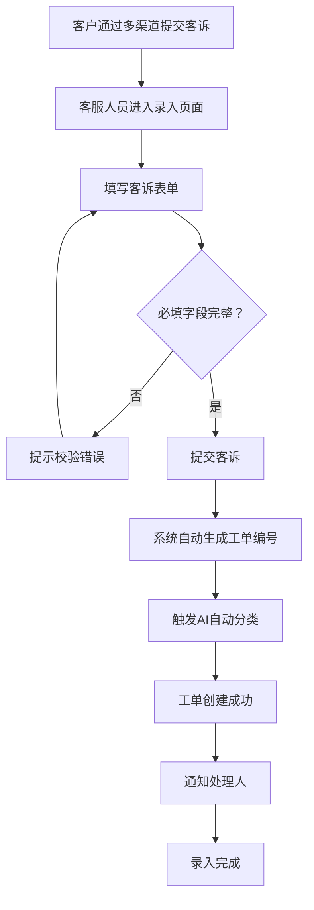

# 客诉工单系统 · 客诉录入功能设计

***

## 文档信息

| 项目   | 内容                   |
| ---- | -------------------- |
| 文档编号 | PRD-006-FD-2026-001 |
| 文档版本 | v0.1                 |
| 产品名称 | 客诉工单自动化与智能分类系统 |
| 所属系统 | 客诉工单系统（钉钉AI表格应用） |
| 编制日期 | 2026-06-12       |
| 编制人员 | AI 智能体               |

### 修订记录

| 版本   | 修订日期           | 修订说明 | 修订人    |
| ---- | -------------- | ---- | ------ |
| v0.1 | 2026-06-12 | 初稿创建 | AI 智能体 |

***

> **文档使用说明**
>
> - 本模板供 AI 开发智能体读取，请保持结构完整
> - 运行环境：钉钉客户端（iOS/Android）内置浏览器，钉钉AI表格小程序框架

> **文档撰写规范（重要）**
>
> 1. **严格遵循模板格式**：各章节表格字段必须与模板保持一致
> 2. **聚焦业务规则**：描述业务逻辑、数据约束、权限控制等，不写技术实现细节
> 3. **减少不必要的示例**：不写JSON/XML格式的报文示例，仅描述报文格式以实际接口返回为准
> 4. **页面布局与交互分离**：§四仅描述页面结构（长什么样），§五描述业务规则（怎么操作）

***

## 一、功能角色矩阵说明

### 1.1 功能描述

- **功能名称：** 客诉录入
- **所属模块：** 客诉受理
- **功能描述：** 客服人员通过表单快速录入客户客诉信息，支持多渠道（电话/在线/微信/门店）来源的客诉记录，录入后自动触发AI分类流程。

### 1.2 角色权限总览

| 角色      | 功能权限                        | 数据权限   |
| ------- | --------------------------- | ------ |
| 客服人员 | 查看列表、查看详情、新增、查询、导出 | 全量数据   |
| 店长 | 查看列表、查看详情、查询             | 本门店数据  |
| 品控人员 | 查看列表、查看详情、查询、导出        | 全量数据   |
| 运营管理层 | 查看列表、查看详情、查询、导出       | 全量数据   |

### 1.3 功能角色矩阵

| 功能点  | 客服人员 | 店长 | 品控人员 | 运营管理层 |
| ---- | :-----: | :-----: | :-----: | :-----: |
| 查看列表 |    是    |    是    |    是    |    是    |
| 查看详情 |    是    |    是    |    是    |    是    |
| 新增   |    是    |    否    |    否    |    否    |
| 查询   |    是    |    是    |    是    |    是    |
| 导出   |    是    |    否    |    是    |    是    |

***

## 二、模块路径

系统首页 → 客诉管理 → 客诉工单 → 客诉录入

***

## 三、状态流转与流程图

### 3.1 业务流程图



### 3.2 状态流转图

本功能为录入入口，工单状态流转参见《工单管理功能设计》模块。

***

## 四、页面布局

### 4.1 页面清单

|  序号 | 页面名称    | 页面类型   | 描述                           |
| :-: | ------- | ------ | ---------------------------- |
|  1  | 客诉工单列表 | 主页面    | 展示所有客诉工单，支持查询、筛选、操作       |
|  2  | 客诉录入弹窗 | 弹窗     | 填写客户信息和客诉内容                  |
|  3  | 工单详情弹窗 | 弹窗     | 查看工单完整信息（含AI分类结果，只读）        |

***

### 4.2 客诉工单列表页面布局

```
┌─────────────────────────────────────────────────────────────────┐
│  查询条件区                                                       │
│  ┌─────────────┐ ┌─────────────┐ ┌──────────┐ ┌──────┐ ┌──────┐ │
│  │ 工单编号    │ │ 一级分类    │ │ 严重程度  │ │ 查询 │ │ 重置 │ │
│  │ [输入框    ]│ │ [下拉框   ▼]│ │ [下拉框 ▼]│ │ 按钮 │ │ 按钮 │ │
│  └─────────────┘ └─────────────┘ └──────────┘ └──────┘ └──────┘ │
├─────────────────────────────────────────────────────────────────┤
│  工具栏区    [+新增客诉]  [导出]                                  │
├─────────────────────────────────────────────────────────────────┤
│  列表数据区                                                       │
│  ┌─────┬────────┬──────────┬────────┬──────────┬────────┬──────────┐ │
│  │ 序号 │ 工单编号│ 客户名称  │ 一级分类│ 严重程度  │ 状态   │ 操作     │ │
│  ├─────┼────────┼──────────┼────────┼──────────┼────────┼──────────┤ │
│  │  1  │ C2026..│ 张先生   │ 商品质量│ P1-紧急  │ 待处理 │ [详情]   │ │
│  │  2  │ C2026..│ 李女士   │ 配送问题│ P2-重要  │ 处理中 │ [详情]   │ │
│  └─────┴────────┴──────────┴────────┴──────────┴────────┴──────────┘ │
├─────────────────────────────────────────────────────────────────┤
│  分页区    [< 1 2 3 ... 10 >]  [每页 10 ▼]  共 95 条            │
└─────────────────────────────────────────────────────────────────┘
```

### 4.2.1 查询条件区

| 组件名称    | 组件类型 | 位置 | 提示语            | 说明        |
| ------- | ---- | -- | -------------- | --------- |
| 工单编号 | 输入框  | 居左 | 请输入工单编号        | 模糊查询    |
| 一级分类 | 下拉框  | 居左 | 请选择一级分类       | 精确查询    |
| 严重程度 | 下拉框  | 居左 | 请选择严重程度       | 精确查询    |
| 查询      | 按钮   | 居右 | —              | 主按钮       |
| 重置      | 按钮   | 居右 | —              | 次按钮       |

### 4.2.2 工具栏区

| 组件名称 | 组件类型 | 位置 | 提示语 | 说明          |
| ---- | ---- | -- | --- | ----------- |
| 新增客诉 | 按钮   | 居左 | —   | 仅客服人员可见 |
| 导出   | 按钮   | 居右 | —   | 按权限控制     |

### 4.2.3 列表展示区

| 字段      | 组件类型 | 位置 | 说明                |
| ------- | ---- | -- | ----------------- |
| 序号      | 文本   | 居中 | —                 |
| 工单编号 | 文本   | 居左 | —                 |
| 客户名称 | 文本   | 居左 | —                 |
| 一级分类 | 标签   | 居左 | 枚举-badge样式        |
| 严重程度 | 标签   | 居中 | P1红色/P2橙色/P3灰色 |
| 状态      | 标签   | 居中 | 枚举-badge样式        |
| 操作      | 按钮组  | 居中 | [详情]             |

### 4.2.4 分页控件区

| 控件    | 组件类型 | 位置 | 说明      |
| ----- | ---- | -- | ------- |
| 总条数   | 文本   | 居左 | 共0条记录   |
| 页码按钮  | 按钮组  | 居中 | 1高亮     |
| 向前翻页  | 按钮   | 居中 | <       |
| 向后翻页  | 按钮   | 居中 | >       |
| 每页条目数 | 下拉框  | 居右 | 默认10条/页 |
| 跳转至页码 | 输入框  | 居右 | 默认1     |

***

### 4.3 客诉录入弹窗布局

```
┌─────────────────────────────────────────────────┐
│  客诉录入                                  [X]  │
├─────────────────────────────────────────────────┤
│  ┌─────────────────────────────────────────┐    │
│  │ 客户名称                                  │    │
│  │ [输入框                                ]  │    │
│  └─────────────────────────────────────────┘    │
│  ┌─────────────────────────────────────────┐    │
│  │ 客户电话                                  │    │
│  │ [输入框                                ]  │    │
│  └─────────────────────────────────────────┘    │
│  ┌─────────────────────────────────────────┐    │
│  │ 关联门店                                  │    │
│  │ [下拉搜索框                           ▼]  │    │
│  └─────────────────────────────────────────┘    │
│  ┌─────────────────────────────────────────┐    │
│  │ 客诉内容                                  │    │
│  │ [多行文本框                           ]  │    │
│  │ [                                    ]  │    │
│  └─────────────────────────────────────────┘    │
│  ┌─────────────────────────────────────────┐    │
│  │ 来源渠道                                  │    │
│  │ [下拉框                                ▼]  │    │
│  └─────────────────────────────────────────┘    │
│                                                 │
│                              [取消]  [提交]      │
└─────────────────────────────────────────────────┘
```

### 4.3.1 表单字段说明

| 字段      | 组件类型 | 位置   | 提示语            | 说明        |
| ------- | ---- | ---- | -------------- | --------- |
| 客户名称 | 输入框  | 独占一行 | 请输入客户名称        | 必填\*      |
| 客户电话 | 输入框  | 独占一行 | 请输入客户电话        | 必填\*      |
| 关联门店 | 下拉搜索框 | 独占一行 | 请选择关联门店       | 必填\*      |
| 客诉内容 | 多行文本框 | 独占一行 | 请输入客诉详细内容     | 必填\*      |
| 来源渠道 | 下拉框  | 独占一行 | 请选择来源渠道       | 必填\*      |

### 4.3.2 按钮区

| 按钮 | 组件类型 | 位置 | 说明       |
| -- | ---- | -- | -------- |
| 取消 | 按钮   | 居右 | 关闭弹窗     |
| 提交 | 按钮   | 居右 | 灰化→合规后可用 |

***

### 4.4 工单详情弹窗布局

```
┌─────────────────────────────────────────────────┐
│  工单详情                                  [X]  │
├─────────────────────────────────────────────────┤
│  ┌──────────────┐ ┌────────────────────────┐    │
│  │ 工单编号     │ │ C20260612001           │    │
│  └──────────────┘ └────────────────────────┘    │
│  ┌──────────────┐ ┌────────────────────────┐    │
│  │ 客户名称     │ │ 张先生                  │    │
│  └──────────────┘ └────────────────────────┘    │
│  ┌──────────────┐ ┌────────────────────────┐    │
│  │ 客户电话     │ │ 138****8000            │    │
│  └──────────────┘ └────────────────────────┘    │
│  ┌──────────────┐ ┌────────────────────────┐    │
│  │ 关联门店     │ │ 朝阳路店               │    │
│  └──────────────┘ └────────────────────────┘    │
│  ┌──────────────┐ ┌────────────────────────┐    │
│  │ 客诉内容     │ │ 今天买的草莓不新鲜了...  │    │
│  └──────────────┘ └────────────────────────┘    │
│  ┌──────────────┐ ┌────────────────────────┐    │
│  │ AI分类结果   │ │ 商品质量 - 新鲜度问题    │    │
│  └──────────────┘ └────────────────────────┘    │
│  ┌──────────────┐ ┌────────────────────────┐    │
│  │ 严重程度     │ │ P1-紧急               │    │
│  └──────────────┘ └────────────────────────┘    │
│  ┌──────────────┐ ┌────────────────────────┐    │
│  │ 处理人       │ │ 店长-李四              │    │
│  └──────────────┘ └────────────────────────┘    │
│  ┌──────────────┐ ┌────────────────────────┐    │
│  │ 创建时间     │ │ 2026-06-12 10:00:00    │    │
│  └──────────────┘ └────────────────────────┘    │
│                                                 │
│                                    [关闭]       │
└─────────────────────────────────────────────────┘
```

### 4.4.1 展示字段说明

| 字段      | 组件类型 | 位置   | 说明         |
| ------- | ---- | ---- | ---------- |
| 工单编号 | 文本   | 独占一行 | 只读，系统自动生成 |
| 客户名称 | 文本   | 独占一行 | 只读         |
| 客户电话 | 文本   | 独占一行 | 脱敏（138****8000） |
| 关联门店 | 文本   | 独占一行 | 只读         |
| 客诉内容 | 文本   | 独占一行 | 只读         |
| AI分类结果 | 文本   | 独占一行 | 只读         |
| 严重程度 | 标签   | 独占一行 | 只读         |
| 处理人 | 文本   | 独占一行 | 只读         |
| 创建时间 | 文本   | 独占一行 | 只读，格式见数据字典 |

***

## 五、页面交互说明

### 5.1 列表页面交互说明

#### 5.1.1 字段交互规则

| 字段        | 类型  | 是否必填 | 约束规则                  | 展示规则 | 举例或枚举       |
| --------- | --- | :--: | --------------------- | ---- | ----------- |
| 工单编号 | 输入框 |   否  | 支持模糊查询；最大50字符       | 明文   | C20260612001 |
| 一级分类 | 下拉框 |   否  | 精确查询；数据源参见第九章数据字典 | 明文   | 商品质量/服务态度/配送问题/其他 |
| 严重程度 | 下拉框 |   否  | 精确查询；数据源参见第九章数据字典 | 明文   | P1-紧急/P2-重要/P3-一般 |

#### 5.1.2 操作交互逻辑

| 操作类型 | 触发操作     | 交互可用性       | 正向输出                                        | 异常场景                                           | 异常处理             | 日志级别 |
| ---- | -------- | ----------- | ------------------------------------------- | ---------------------------------------------- | ---------------- | ---- |
| 查询   | 点击"查询"   | 始终可用        | 按条件筛选，结果在列表中展示，分页同步更新                       | 无                                              | 无                | 接口级  |
| 重置   | 点击"重置"   | 始终可用        | 清空所有筛选条件，恢复初始查询状态                           | 无                                              | 无                | 接口级  |
| 新增客诉 | 点击"新增客诉" | 客服人员可用     | 打开"客诉录入"弹窗                                | 无                                              | 无                | 接口级  |
| 查看详情 | 点击"详情"   | 始终可用        | 打开工单详情弹窗，所有字段只读                            | 无                                              | 无                | 接口级  |
| 导出   | 点击"导出"   | 有导出权限时可用   | 勾选数据时导出勾选行；未勾选时导出全量数据，下载Excel文件             | 无数据                                            | Toast提示"暂无数据可导出" | 接口级  |

> **导出文件命名规范**：
>
> - 格式：`{业务前缀}_{YYYYMMDD}_{HHMMSS}.xlsx`
> - 示例：`客诉工单_20260612_103045.xlsx`
> - 时间戳：年月日(8位) + 时分秒(6位)，确保文件名唯一性

***

### 5.2 客诉录入弹窗交互说明

#### 5.2.1 字段交互规则

| 字段            | 类型 | 是否必填 | 约束规则                       | 展示规则                | 举例或枚举       |
| ------------- | -- | :--: | -------------------------- | ------------------- | ----------- |
| 客户名称       | 文本 |   是  | 支持1-50个字符，无特殊符号           | 明文                  | 张先生     |
| 客户电话       | 文本 |   是  | 11位数字，符合手机号格式            | 明文（录入时）/脱敏（列表展示） | 13800138000 |
| 关联门店       | 下拉搜索框 |   是  | 支持模糊搜索门店名称              | 明文                  | 朝阳路店     |
| 客诉内容       | 多行文本框 |   是  | 最少10字符，最多500字符            | 明文                  | 今天买的草莓不新鲜了... |
| 来源渠道       | 下拉框 |   是  | 精确选择；数据源参见第九章数据字典      | 明文                  | 电话/在线/微信/门店 |

#### 5.2.2 操作交互逻辑

| 操作类型 | 触发操作      | 交互可用性       | 正向输出                    | 异常场景 | 异常处理               | 日志级别 |
| ---- | --------- | ----------- | ----------------------- | ---- | ------------------ | ---- |
| 确定提交 | 点击"提交"按钮  | 必填字段全部合规后可用 | 弹窗关闭，列表刷新，Toast提示"客诉录入成功，已触发AI分类" | 保存失败 | Toast提示"保存失败，请重试！" | 接口级  |
| 取消   | 点击"取消"按钮  | 始终可用        | 关闭弹窗，不保存任何数据            | 无    | 无                  | 不记录  |
| 关闭   | 点击右上角\[X] | 始终可用        | 关闭弹窗，不保存任何数据            | 无    | 无                  | 不记录  |

#### 5.2.3 弹窗说明

| 规则项  | 说明                                   |
| ---- | ------------------------------------ |
| 打开方式 | 点击列表页工具栏"新增客诉"按钮                    |
| 标题   | 显示"客诉录入"                             |
| 数据反显 | 新增时所有字段为空                             |
| 校验时机 | 字段失焦时触发单字段校验；点击"提交"时触发全量校验           |
| 保存规则 | 全部校验通过后提交保存；校验失败时字段下方显示红色提示文本，字段边框变红 |
| 关闭确认 | 如有未保存的修改，关闭时弹出二次确认"是否放弃编辑？"          |

***

### 5.3 工单详情弹窗交互说明

#### 5.3.1 字段交互规则

| 字段      | 组件类型 | 是否必填 | 约束规则       | 展示规则 | 举例或枚举               |
| ------- | ---- | :--: | ---------- | ---- | ------------------- |
| 工单编号 | 文本   |   —  | 只读，不可编辑    | 明文   | C20260612001         |
| 客户名称 | 文本   |   —  | 只读，不可编辑    | 明文   | 张先生                  |
| 客户电话 | 文本   |   —  | 只读，不可编辑    | 脱敏   | 138****8000            |
| 关联门店 | 文本   |   —  | 只读，不可编辑    | 明文   | 朝阳路店                |
| 客诉内容 | 文本   |   —  | 只读，不可编辑    | 明文   | 今天买的草莓不新鲜了，都有点烂了 |
| AI分类结果 | 文本   |   —  | 只读，不可编辑    | 明文   | 商品质量 - 新鲜度问题         |
| 严重程度 | 标签   |   —  | 只读，不可编辑    | 标签   | P1-紧急               |
| 处理人 | 文本   |   —  | 只读，不可编辑    | 明文   | 店长-李四               |
| 创建时间 | 文本   |   —  | 只读，格式见数据字典 | 明文   | 2026-06-12 10:00:00 |

#### 5.3.2 操作交互逻辑

| 操作类型 | 触发操作     | 交互可用性 | 正向输出        | 异常场景 | 异常处理 | 日志级别 |
| ---- | -------- | ----- | ----------- | ---- | ---- | ---- |
| 关闭   | 点击"关闭"按钮 | 始终可用  | 关闭弹窗，返回列表页面 | 无    | 无    | 不记录  |

***

### 5.4 删除确认弹窗交互说明

本模块不涉及删除操作。

***

## 六、错误处理规范

### 6.1 表单校验错误

- 显示方式：对应字段下方显示红色提示文本，字段边框变红
- 触发时机：表单提交时触发全量校验；字段失去焦点时触发单字段校验

| 字段      | 为空时错误信息     | 格式错误时信息           |
| ------- | ----------- | ----------------- |
| 客户名称 | 客户名称不能为空 | 客户名称长度应在1-50个字符之间 |
| 客户电话 | 客户电话不能为空 | 客户电话格式不正确，应为11位手机号 |
| 关联门店 | 请选择关联门店  | —                 |
| 客诉内容 | 客诉内容不能为空 | 客诉内容最少10字符，最多500字符 |
| 来源渠道 | 请选择来源渠道  | —                 |

### 6.2 文件操作错误

| 场景      | 触发条件                         | 提示文案                    | 处理方式                       |
| ------- | ---------------------------- | ----------------------- | -------------------------- |
| 导出-无数据  | 当前查询结果为空                     | 暂无数据可导出                 | Toast 提示                   |
| 网络/服务异常 | 接口请求失败                       | 接口异常，请稍候再试              | Toast 提示                   |

***

## 七、非功能性需求

### 7.1 合规与安全要求

| 适用规范       | 内容摘要              | 本模块特有说明                    |
| ---------- | ----------------- | -------------------------- |
| 访问控制   | RBAC最小权限、数据权限隔离   | 客服人员可录入和查看全量数据；店长仅可查看本门店数据 |
| 操作日志   | 字段级日志、保留期限、不可篡改   | 覆盖操作：新增/查询/导出（按实际填写） |
| 敏感数据脱敏 | 各字段脱敏规则           | 客户电话在列表展示时脱敏（138****8000） |
| 文件操作安全 | 导出上限、下载鉴权、导出行为记日志 | 单次导出上限1000条          |

### 7.2 性能需求

| 需求项       | 指标要求          | 说明            |
| --------- | ------------- | ------------- |
| 列表查询响应时间  | ≤ 2s          | 正常网络条件下，含分页查询 |
| 保存/提交响应时间 | ≤ 3s          | 新增客诉提交操作     |
| 导出响应时间    | ≤ 5s（1000条以内） | 超出时建议提示异步处理   |
| 页面首屏加载时间  | ≤ 3s          | —             |
| 并发用户数     | 50人同时操作      | 按实际业务填写       |

***

## 八、特殊说明

### 8.1 工单编号编码规则

| 项目   | 规则说明              |
| ---- | ----------------- |
| 编码格式 | 固定前缀"C" + 年月日 + 4位序号 |
| 起始序号 | 从"0001"开始，每日重置     |
| 完整示例 | C202606120001、C202606120002 |
| 唯一性  | 唯一标识，不可重复         |
| 生成方式 | 系统自动生成，不可手动输入或修改  |

### 8.2 客诉录入后自动触发机制

1. 客诉录入成功后，系统自动触发AI智能分类流程
2. AI分类完成后，工单状态自动变更为"待处理"
3. 系统根据分类结果自动分派处理人，并发送钉钉通知
4. 处理时限根据严重程度自动计算：P1=4小时，P2=12小时，P3=24小时

### 8.3 其他特殊规则

1. 客户电话录入后不可修改，如需修改需联系管理员
2. 关联门店必须为已启用状态的门店
3. 客诉内容提交后不可修改，但可在工单处理过程中追加处理记录

***

## 九、数据字典

### 9.1 字典项定义

**来源渠道（sourceChannel）**

| 枚举值（code） | 显示文本（label） | 说明     |
| :-------: | ----------- | ------ |
|     1     | 电话          | 客户来电   |
|     2     | 在线          | 在线客服   |
|     3     | 微信          | 微信渠道   |
|     4     | 门店          | 门店现场   |

**一级分类（category1）**

| 枚举值（code） | 显示文本（label） | 说明     |
| :-------: | ----------- | ------ |
|     1     | 商品质量        | 商品相关问题 |
|     2     | 服务态度        | 服务相关问题 |
|     3     | 配送问题        | 配送相关问题 |
|     4     | 其他          | 其他问题   |

**严重程度（severity）**

| 枚举值（code） | 显示文本（label） | 说明     |
| :-------: | ----------- | ------ |
|     1     | P1-紧急       | 需4小时内处理 |
|     2     | P2-重要       | 需12小时内处理 |
|     3     | P3-一般       | 需24小时内处理 |

### 9.2 下拉框数据来源说明

| 字段名     | 数据来源类型 | 来源说明                        |
| ------- | ------ | --------------------------- |
| 一级分类 | 字典项    | 参见 9.1 category1            |
| 严重程度 | 字典项    | 参见 9.1 severity            |
| 来源渠道 | 字典项    | 参见 9.1 sourceChannel       |
| 关联门店 | 接口动态加载 | 来源：门店管理接口 /api/v1/store/list |

***

## 十、外部系统接口说明

### 10.1 接口清单

| 接口名称    | 功能描述           | 交互方向     | 依赖系统     | 数据流向                    |
| ------- | -------------- | -------- | -------- | ----------------------- |
| 客诉提交接口 | 提交客诉信息，触发AI分类 | 调用 | AI分类服务 | 本系统→AI分类服务 |
| 门店列表接口 | 获取门店下拉数据 | 调用 | 门店管理系统 | 门店管理系统→本系统 |

### 10.2 接口详细说明

**客诉提交接口**

| 规则项  | 说明                    |
| ---- | --------------------- |
| 触发时机 | 点击"提交"按钮时调用           |
| 请求条件 | 必填字段全部合规            |
| 成功处理 | 工单创建成功，触发AI分类，返回工单编号和分类结果 |
| 失败处理 | 返回错误信息，表单保持不变      |
| 重试机制 | 不自动重试，用户修正后重新提交     |

**门店列表接口**

| 规则项  | 说明                    |
| ---- | --------------------- |
| 触发时机 | 打开录入弹窗时加载           |
| 请求条件 | 无                     |
| 成功处理 | 返回门店列表（仅启用状态门店）   |
| 失败处理 | Toast提示"门店数据加载失败"  |
| 重试机制 | 自动重试1次               |

***

*文档结束*
