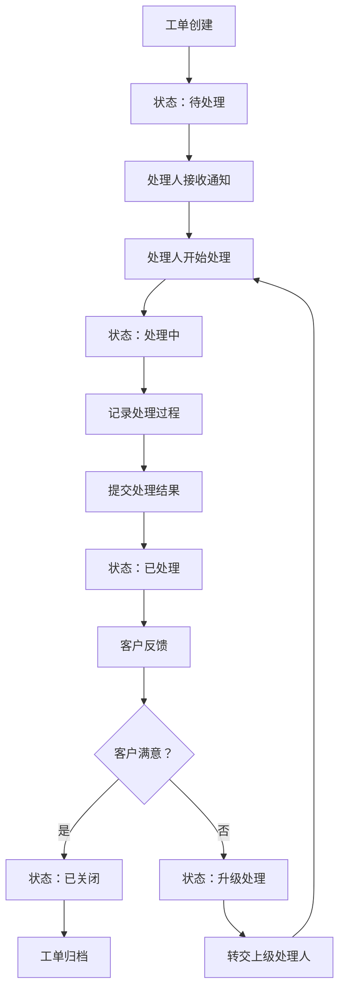
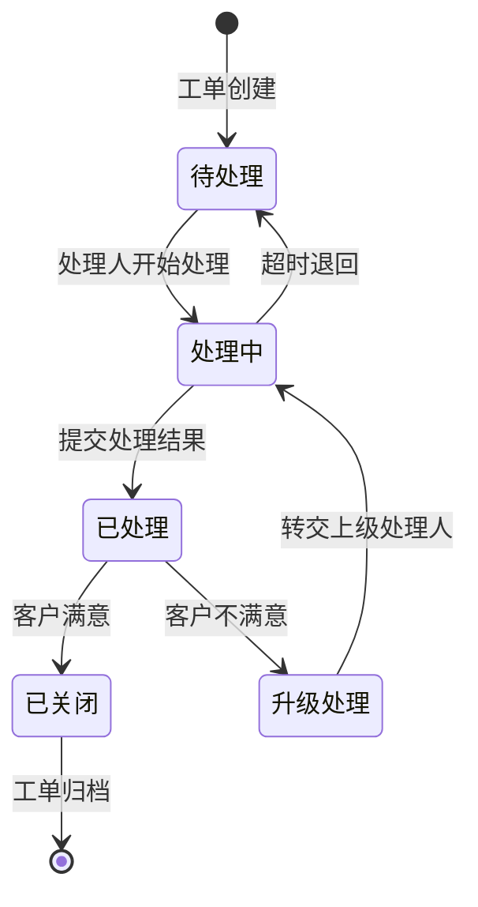
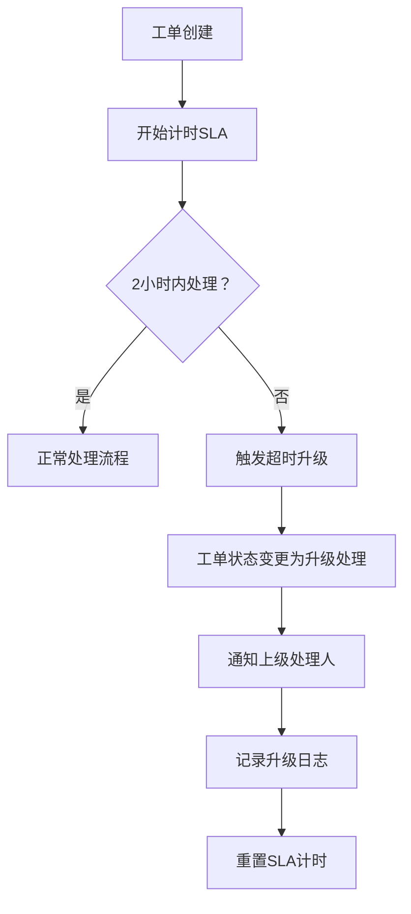

# 客诉工单系统 · 工单管理功能设计

***

## 文档信息

| 项目   | 内容                   |
| ---- | -------------------- |
| 文档编号 | PRD-006-FD-2026-003 |
| 文档版本 | v0.1                 |
| 产品名称 | 客诉工单自动化与智能分类系统 |
| 所属系统 | 客诉工单系统（钉钉AI表格应用） |
| 编制日期 | 2026-06-12       |
| 编制人员 | AI 智能体               |

### 修订记录

| 版本   | 修订日期           | 修订说明 | 修订人    |
| ---- | -------------- | ---- | ------ |
| v0.1 | 2026-06-12 | 初稿创建 | AI 智能体 |

***

> **文档撰写规范（重要）**
>
> 1. **严格遵循模板格式**：各章节表格字段必须与模板保持一致
> 2. **聚焦业务规则**：描述业务逻辑、数据约束、权限控制等，不写技术实现细节
> 3. **减少不必要的示例**：不写JSON/XML格式的报文示例，仅描述报文格式以实际接口返回为准
> 4. **页面布局与交互分离**：§四仅描述页面结构（长什么样），§五描述业务规则（怎么操作）

***

## 一、功能角色矩阵说明

### 1.1 功能描述

- **功能名称：** 工单管理
- **所属模块：** 工单处理
- **功能描述：** 管理客诉工单的全生命周期，包括工单查看、处理、进度追踪、处理结果提交、客户满意度回访及工单关闭归档。

### 1.2 角色权限总览

| 角色      | 功能权限                        | 数据权限   |
| ------- | --------------------------- | ------ |
| 客服人员 | 查看列表、查看详情、处理工单、提交处理结果 | 全量数据   |
| 店长 | 查看列表、查看详情、处理工单、提交处理结果 | 本门店数据  |
| 品控人员 | 查看列表、查看详情、处理工单、导出        | 全量数据   |
| 运营管理层 | 查看列表、查看详情、处理工单、导出、关闭工单 | 全量数据   |

### 1.3 功能角色矩阵

| 功能点  | 客服人员 | 店长 | 品控人员 | 运营管理层 |
| ---- | :-----: | :-----: | :-----: | :-----: |
| 查看列表 |    是    |    是    |    是    |    是    |
| 查看详情 |    是    |    是    |    是    |    是    |
| 处理工单 |    是    |    是    |    是    |    是    |
| 提交处理结果 |    是    |    是    |    是    |    是    |
| 关闭工单 |    否    |    否    |    否    |    是    |
| 导出   |    否    |    否    |    是    |    是    |

***

## 二、模块路径

系统首页 → 客诉管理 → 工单管理 → 工单列表

***

## 三、状态流转与流程图

### 3.1 工单处理主流程



### 3.2 状态流转图



### 3.3 超时升级流程



***

## 四、页面布局

### 4.1 页面清单

|  序号 | 页面名称    | 页面类型   | 描述                           |
| :-: | ------- | ------ | ---------------------------- |
|  1  | 工单列表 | 主页面    | 展示所有工单，支持查询、筛选、操作          |
|  2  | 工单详情弹窗 | 弹窗     | 查看工单完整信息，支持处理操作             |
|  3  | 处理记录弹窗 | 弹窗     | 记录处理过程，提交处理结果               |
|  4  | 满意度回访弹窗 | 弹窗     | 记录客户满意度反馈                   |

***

### 4.2 工单列表页面布局

```
┌─────────────────────────────────────────────────────────────────┐
│  查询条件区                                                       │
│  ┌─────────────┐ ┌─────────────┐ ┌──────────┐ ┌──────────┐ ┌──────┐ ┌──────┐ │
│  │ 工单编号    │ │ 状态       │ │ 一级分类  │ │ 处理人    │ │ 查询 │ │ 重置 │ │
│  │ [输入框    ]│ │ [下拉框   ▼]│ │ [下拉框 ▼]│ │ [下拉框 ▼]│ │ 按钮 │ │ 按钮 │ │
│  └─────────────┘ └─────────────┘ └──────────┘ └──────────┘ └──────┘ └──────┘ │
├─────────────────────────────────────────────────────────────────┤
│  工具栏区    [导出]                                                │
├─────────────────────────────────────────────────────────────────┤
│  列表数据区                                                       │
│  ┌─────┬────────┬──────────┬────────┬──────────┬────────┬──────────┬──────────┐ │
│  │ 序号 │ 工单编号│ 客户名称  │ 一级分类│ 处理人   │ 状态   │ 处理时限  │ 操作     │ │
│  ├─────┼────────┼──────────┼────────┼──────────┼────────┼──────────┼──────────┤ │
│  │  1  │ C2026..│ 张先生   │ 商品质量│ 店长-李四 │ 处理中 │ 16:00    │ [详情]   │ │
│  │  2  │ C2026..│ 李女士   │ 配送问题│ 客服-王五 │ 待处理 │ 14:00    │ [详情]   │ │
│  └─────┴────────┴──────────┴────────┴──────────┴────────┴──────────┴──────────┘ │
├─────────────────────────────────────────────────────────────────┤
│  分页区    [< 1 2 3 ... 10 >]  [每页 10 ▼]  共 95 条            │
└─────────────────────────────────────────────────────────────────┘
```

### 4.2.1 查询条件区

| 组件名称    | 组件类型 | 位置 | 提示语            | 说明        |
| ------- | ---- | -- | -------------- | --------- |
| 工单编号 | 输入框  | 居左 | 请输入工单编号        | 模糊查询    |
| 状态 | 下拉框  | 居左 | 请选择状态         | 精确查询    |
| 一级分类 | 下拉框  | 居左 | 请选择一级分类       | 精确查询    |
| 处理人 | 下拉框  | 居左 | 请选择处理人        | 精确查询    |
| 查询      | 按钮   | 居右 | —              | 主按钮       |
| 重置      | 按钮   | 居右 | —              | 次按钮       |

### 4.2.2 工具栏区

| 组件名称 | 组件类型 | 位置 | 提示语 | 说明          |
| ---- | ---- | -- | --- | ----------- |
| 导出   | 按钮   | 居右 | —   | 品控/运营可见  |

### 4.2.3 列表展示区

| 字段      | 组件类型 | 位置 | 说明                |
| ------- | ---- | -- | ----------------- |
| 序号      | 文本   | 居中 | —                 |
| 工单编号 | 文本   | 居左 | —                 |
| 客户名称 | 文本   | 居左 | —                 |
| 一级分类 | 标签   | 居左 | 枚举-badge样式        |
| 处理人 | 文本   | 居左 | —                 |
| 状态      | 标签   | 居中 | 枚举-badge样式，含超时高亮 |
| 处理时限 | 文本   | 居左 | 超时标红显示          |
| 操作      | 按钮组  | 居中 | [详情]             |

### 4.2.4 分页控件区

| 控件    | 组件类型 | 位置 | 说明      |
| ----- | ---- | -- | ------- |
| 总条数   | 文本   | 居左 | 共0条记录   |
| 页码按钮  | 按钮组  | 居中 | 1高亮     |
| 向前翻页  | 按钮   | 居中 | <       |
| 向后翻页  | 按钮   | 居中 | >       |
| 每页条目数 | 下拉框  | 居右 | 默认10条/页 |
| 跳转至页码 | 输入框  | 居右 | 默认1     |

***

### 4.3 工单详情弹窗布局

```
┌─────────────────────────────────────────────────┐
│  工单详情                                  [X]  │
├─────────────────────────────────────────────────┤
│  ┌──────────────┐ ┌────────────────────────┐    │
│  │ 工单编号     │ │ C20260612001           │    │
│  └──────────────┘ └────────────────────────┘    │
│  ┌──────────────┐ ┌────────────────────────┐    │
│  │ 客户名称     │ │ 张先生                  │    │
│  └──────────────┘ └────────────────────────┘    │
│  ┌──────────────┐ ┌────────────────────────┐    │
│  │ 客户电话     │ │ 138****8000            │    │
│  └──────────────┘ └────────────────────────┘    │
│  ┌──────────────┐ ┌────────────────────────┐    │
│  │ 关联门店     │ │ 朝阳路店               │    │
│  └──────────────┘ └────────────────────────┘    │
│  ┌──────────────┐ ┌────────────────────────┐    │
│  │ 客诉内容     │ │ 今天买的草莓不新鲜了...  │    │
│  └──────────────┘ └────────────────────────┘    │
│  ┌──────────────┐ ┌────────────────────────┐    │
│  │ 一级分类     │ │ 商品质量               │    │
│  └──────────────┘ └────────────────────────┘    │
│  ┌──────────────┐ ┌────────────────────────┐    │
│  │ 二级分类     │ │ 新鲜度问题              │    │
│  └──────────────┘ └────────────────────────┘    │
│  ┌──────────────┐ ┌────────────────────────┐    │
│  │ 严重程度     │ │ P1-紧急               │    │
│  └──────────────┘ └────────────────────────┘    │
│  ┌──────────────┐ ┌────────────────────────┐    │
│  │ 处理人       │ │ 店长-李四              │    │
│  └──────────────┘ └────────────────────────┘    │
│  ┌──────────────┐ ┌────────────────────────┐    │
│  │ 状态         │ │ 处理中                 │    │
│  └──────────────┘ └────────────────────────┘    │
│  ┌──────────────┐ ┌────────────────────────┐    │
│  │ 处理时限     │ │ 2026-06-12 16:00:00    │    │
│  └──────────────┘ └────────────────────────┘    │
│  ┌─────────────────────────────────────────┐    │
│  │ 处理记录                              │    │
│  │ 2026-06-12 14:00 店长-李四：已联系客户... │    │
│  └─────────────────────────────────────────┘    │
│                                                 │
│              [处理工单]  [满意度回访]  [关闭工单]  [关闭]  │
└─────────────────────────────────────────────────┘
```

### 4.3.1 展示字段说明

| 字段      | 组件类型 | 位置   | 说明         |
| ------- | ---- | ---- | ---------- |
| 工单编号 | 文本   | 独占一行 | 只读，系统自动生成 |
| 客户名称 | 文本   | 独占一行 | 只读         |
| 客户电话 | 文本   | 独占一行 | 脱敏         |
| 关联门店 | 文本   | 独占一行 | 只读         |
| 客诉内容 | 文本   | 独占一行 | 只读         |
| 一级分类 | 标签   | 独占一行 | 只读         |
| 二级分类 | 标签   | 独占一行 | 只读         |
| 严重程度 | 标签   | 独占一行 | 只读         |
| 处理人 | 文本   | 独占一行 | 只读         |
| 状态      | 标签   | 独占一行 | 只读         |
| 处理时限 | 文本   | 独占一行 | 超时标红       |
| 处理记录 | 文本   | 独占一行 | 只读，按时间倒序 |

### 4.3.2 按钮区

| 按钮 | 组件类型 | 位置 | 说明       |
| -- | ---- | -- | -------- |
| 处理工单 | 按钮   | 居左 | 打开处理记录弹窗 |
| 满意度回访 | 按钮   | 居左 | 已处理状态可用 |
| 关闭工单 | 按钮   | 居左 | 运营管理层可见 |
| 关闭 | 按钮   | 居右 | 关闭弹窗     |

***

### 4.4 处理记录弹窗布局

```
┌─────────────────────────────────────────────────┐
│  处理工单                                  [X]  │
├─────────────────────────────────────────────────┤
│  ┌─────────────────────────────────────────┐    │
│  │ 工单编号：C20260612001                   │    │
│  └─────────────────────────────────────────┘    │
│  ┌─────────────────────────────────────────┐    │
│  │ 处理过程记录                              │    │
│  │ [多行文本框                           ]  │    │
│  │ [                                    ]  │    │
│  └─────────────────────────────────────────┘    │
│  ┌─────────────────────────────────────────┐    │
│  │ 处理结果                                  │    │
│  │ [下拉框                                ▼]  │    │
│  └─────────────────────────────────────────┘    │
│                                                 │
│                              [取消]  [提交]      │
└─────────────────────────────────────────────────┘
```

### 4.4.1 表单字段说明

| 字段      | 组件类型 | 位置   | 提示语            | 说明        |
| ------- | ---- | ---- | -------------- | --------- |
| 工单编号 | 文本   | 独占一行 | —              | 只读，系统自动生成 |
| 处理过程记录 | 多行文本框 | 独占一行 | 请输入处理过程记录     | 必填\*      |
| 处理结果 | 下拉框  | 独占一行 | 请选择处理结果       | 必填\*      |

***

### 4.5 满意度回访弹窗布局

```
┌─────────────────────────────────────────────────┐
│  满意度回访                                [X]  │
├─────────────────────────────────────────────────┤
│  ┌─────────────────────────────────────────┐    │
│  │ 工单编号：C20260612001                   │    │
│  └─────────────────────────────────────────┘    │
│  ┌─────────────────────────────────────────┐    │
│  │ 客户满意度                                │    │
│  │ ○ 满意  ○ 一般  ○ 不满意                  │    │
│  └─────────────────────────────────────────┘    │
│  ┌─────────────────────────────────────────┐    │
│  │ 回访备注                                  │    │
│  │ [多行文本框                           ]  │    │
│  └─────────────────────────────────────────┘    │
│                                                 │
│                              [取消]  [提交]      │
└─────────────────────────────────────────────────┘
```

### 4.5.1 表单字段说明

| 字段      | 组件类型 | 位置   | 提示语            | 说明        |
| ------- | ---- | ---- | -------------- | --------- |
| 工单编号 | 文本   | 独占一行 | —              | 只读，系统自动生成 |
| 客户满意度 | 单选按钮组 | 独占一行 | —              | 必填\*      |
| 回访备注 | 多行文本框 | 独占一行 | 请输入回访备注       | 必填\*      |

***

## 五、页面交互说明

### 5.1 工单列表页面交互说明

#### 5.1.1 字段交互规则

| 字段        | 类型  | 是否必填 | 约束规则                  | 展示规则 | 举例或枚举       |
| --------- | --- | :--: | --------------------- | ---- | ----------- |
| 工单编号 | 输入框 |   否  | 支持模糊查询；最大50字符       | 明文   | C20260612001 |
| 状态 | 下拉框 |   否  | 精确查询；数据源参见第九章数据字典 | 明文   | 待处理/处理中/已处理/已关闭/升级处理 |
| 一级分类 | 下拉框 |   否  | 精确查询；数据源参见第九章数据字典 | 明文   | 商品质量/服务态度/配送问题/其他 |
| 处理人 | 下拉框 |   否  | 精确查询；数据源为处理人配置表    | 明文   | 店长-李四/客服-王五 |

#### 5.1.2 操作交互逻辑

| 操作类型 | 触发操作     | 交互可用性       | 正向输出                                        | 异常场景                                           | 异常处理             | 日志级别 |
| ---- | -------- | ----------- | ------------------------------------------- | ---------------------------------------------- | ---------------- | ---- |
| 查询   | 点击"查询"   | 始终可用        | 按条件筛选，结果在列表中展示，分页同步更新                       | 无                                              | 无                | 接口级  |
| 重置   | 点击"重置"   | 始终可用        | 清空所有筛选条件，恢复初始查询状态                           | 无                                              | 无                | 接口级  |
| 查看详情 | 点击"详情"   | 始终可用        | 打开工单详情弹窗，展示完整工单信息                        | 无                                              | 无                | 接口级  |
| 导出   | 点击"导出"   | 品控/运营可用    | 导出全量数据，下载Excel文件                          | 无数据                                            | Toast提示"暂无数据可导出" | 接口级  |

> **导出文件命名规范**：
>
> - 格式：`{业务前缀}_{YYYYMMDD}_{HHMMSS}.xlsx`
> - 示例：`工单管理_20260612_103045.xlsx`

***

### 5.2 工单详情弹窗交互说明

#### 5.2.1 字段交互规则

| 字段      | 组件类型 | 是否必填 | 约束规则       | 展示规则 | 举例或枚举               |
| ------- | ---- | :--: | ---------- | ---- | ------------------- |
| 工单编号 | 文本   |   —  | 只读，不可编辑    | 明文   | C20260612001         |
| 客户名称 | 文本   |   —  | 只读，不可编辑    | 明文   | 张先生                  |
| 客户电话 | 文本   |   —  | 只读，不可编辑    | 脱敏   | 138****8000            |
| 关联门店 | 文本   |   —  | 只读，不可编辑    | 明文   | 朝阳路店                |
| 客诉内容 | 文本   |   —  | 只读，不可编辑    | 明文   | 今天买的草莓不新鲜了...     |
| 一级分类 | 标签   |   —  | 只读，不可编辑    | 标签   | 商品质量               |
| 二级分类 | 标签   |   —  | 只读，不可编辑    | 标签   | 新鲜度问题              |
| 严重程度 | 标签   |   —  | 只读，不可编辑    | 标签   | P1-紧急               |
| 处理人 | 文本   |   —  | 只读，不可编辑    | 明文   | 店长-李四               |
| 状态      | 标签   |   —  | 只读，不可编辑    | 标签   | 处理中                 |
| 处理时限 | 文本   |   —  | 只读，不可编辑    | 明文   | 2026-06-12 16:00:00 |
| 处理记录 | 文本   |   —  | 只读，不可编辑    | 明文   | 2026-06-12 14:00 店长-李四：... |

#### 5.2.2 操作交互逻辑

| 操作类型 | 触发操作      | 交互可用性       | 正向输出                    | 异常场景 | 异常处理               | 日志级别 |
| ---- | --------- | ----------- | ----------------------- | ---- | ------------------ | ---- |
| 处理工单 | 点击"处理工单" | 工单状态为待处理或处理中时可用 | 打开"处理记录"弹窗              | 无    | 无                  | 接口级  |
| 满意度回访 | 点击"满意度回访" | 工单状态为已处理时可用 | 打开"满意度回访"弹窗              | 无    | 无                  | 接口级  |
| 关闭工单 | 点击"关闭工单" | 运营管理层可用     | 弹出确认弹窗；确认后关闭工单，状态变更为已关闭 | 无    | Toast提示"关闭失败，请重试" | 接口级  |
| 关闭   | 点击"关闭"   | 始终可用        | 关闭弹窗，返回列表页面             | 无    | 无                  | 不记录  |

***

### 5.3 处理记录弹窗交互说明

#### 5.3.1 字段交互规则

| 字段            | 类型 | 是否必填 | 约束规则                       | 展示规则                | 举例或枚举       |
| ------------- | -- | :--: | -------------------------- | ------------------- | ----------- |
| 工单编号       | 文本 |   —  | 只读，不可编辑                    | 明文                  | C20260612001 |
| 处理过程记录       | 多行文本框 |   是  | 最少10字符，最多500字符            | 明文                  | 已联系客户，办理退款... |
| 处理结果       | 下拉框 |   是  | 精确选择；数据源参见第九章数据字典      | 明文                  | 已解决/部分解决/无法解决 |

#### 5.3.2 操作交互逻辑

| 操作类型 | 触发操作      | 交互可用性       | 正向输出                    | 异常场景 | 异常处理               | 日志级别 |
| ---- | --------- | ----------- | ----------------------- | ---- | ------------------ | ---- |
| 确定提交 | 点击"提交"按钮  | 必填字段全部合规后可用 | 弹窗关闭，列表刷新，Toast提示"处理结果提交成功" | 保存失败 | Toast提示"保存失败，请重试！" | 接口级  |
| 取消   | 点击"取消"按钮  | 始终可用        | 关闭弹窗，不保存任何数据            | 无    | 无                  | 不记录  |
| 关闭   | 点击右上角\[X] | 始终可用        | 关闭弹窗，不保存任何数据            | 无    | 无                  | 不记录  |

#### 5.3.3 弹窗说明

| 规则项  | 说明                                   |
| ---- | ------------------------------------ |
| 打开方式 | 点击工单详情弹窗"处理工单"按钮                    |
| 标题   | 显示"处理工单"                             |
| 数据反显 | 工单编号自动填充，其余字段为空                     |
| 校验时机 | 字段失焦时触发单字段校验；点击"提交"时触发全量校验           |
| 保存规则 | 全部校验通过后提交保存；校验失败时字段下方显示红色提示文本，字段边框变红 |
| 关闭确认 | 如有未保存的修改，关闭时弹出二次确认"是否放弃编辑？"          |

***

### 5.4 满意度回访弹窗交互说明

#### 5.4.1 字段交互规则

| 字段            | 类型 | 是否必填 | 约束规则                       | 展示规则                | 举例或枚举       |
| ------------- | -- | :--: | -------------------------- | ------------------- | ----------- |
| 工单编号       | 文本 |   —  | 只读，不可编辑                    | 明文                  | C20260612001 |
| 客户满意度       | 单选按钮组 |   是  | 必选一项；数据源参见第九章数据字典      | 明文                  | 满意/一般/不满意 |
| 回访备注       | 多行文本框 |   是  | 最少5字符，最多200字符            | 明文                  | 客户对处理结果表示满意 |

#### 5.4.2 操作交互逻辑

| 操作类型 | 触发操作      | 交互可用性       | 正向输出                    | 异常场景 | 异常处理               | 日志级别 |
| ---- | --------- | ----------- | ----------------------- | ---- | ------------------ | ---- |
| 确定提交 | 点击"提交"按钮  | 必填字段全部合规后可用 | 弹窗关闭，列表刷新，Toast提示"回访记录提交成功" | 保存失败 | Toast提示"保存失败，请重试！" | 接口级  |
| 取消   | 点击"取消"按钮  | 始终可用        | 关闭弹窗，不保存任何数据            | 无    | 无                  | 不记录  |
| 关闭   | 点击右上角\[X] | 始终可用        | 关闭弹窗，不保存任何数据            | 无    | 无                  | 不记录  |

#### 5.4.3 弹窗说明

| 规则项  | 说明                                   |
| ---- | ------------------------------------ |
| 打开方式 | 点击工单详情弹窗"满意度回访"按钮                    |
| 标题   | 显示"满意度回访"                           |
| 满意度选择 | 单选按钮组，三选一：满意/一般/不满意                |
| 提交规则 | 满意度为"不满意"时，工单状态自动变更为"升级处理"         |

***

### 5.5 关闭工单确认弹窗交互说明

#### 5.5.1 操作交互逻辑

| 操作类型 | 触发操作     | 交互可用性 | 正向输出             | 异常场景 | 异常处理    | 日志级别 |
| ---- | -------- | ----- | ---------------- | ---- | ------- | ---- |
| 确认关闭 | 点击"确定"按钮 | 始终可用  | 执行关闭，弹窗关闭，列表自动刷新 | 关闭失败 | Toast提示 | 接口级  |
| 取消   | 点击"取消"按钮 | 始终可用  | 关闭弹窗，不做任何操作      | 无    | 无       | 不记录  |

#### 5.5.2 弹窗说明

| 规则项  | 说明              |
| ---- | --------------- |
| 触发条件 | 点击工单详情弹窗"关闭工单"按钮 |
| 提示文案 | "是否确认关闭该工单？" |
| 确认操作 | 执行关闭，弹窗关闭，列表刷新  |
| 取消操作 | 关闭弹窗不做任何操作      |

***

## 六、错误处理规范

### 6.1 表单校验错误

- 显示方式：对应字段下方显示红色提示文本，字段边框变红
- 触发时机：表单提交时触发全量校验；字段失去焦点时触发单字段校验

| 字段      | 为空时错误信息     | 格式错误时信息           |
| ------- | ----------- | ----------------- |
| 处理过程记录 | 处理过程记录不能为空 | 处理过程记录最少10字符，最多500字符 |
| 处理结果 | 请选择处理结果  | —                 |
| 客户满意度 | 请选择客户满意度  | —                 |
| 回访备注 | 回访备注不能为空 | 回访备注最少5字符，最多200字符 |

### 6.2 文件操作错误

| 场景      | 触发条件                         | 提示文案                    | 处理方式                       |
| ------- | ---------------------------- | ----------------------- | -------------------------- |
| 导出-无数据  | 当前查询结果为空                     | 暂无数据可导出                 | Toast 提示                   |
| 网络/服务异常 | 接口请求失败                       | 接口异常，请稍候再试              | Toast 提示                   |

***

## 七、非功能性需求

### 7.1 合规与安全要求

| 适用规范       | 内容摘要              | 本模块特有说明                    |
| ---------- | ----------------- | -------------------------- |
| 访问控制   | RBAC最小权限、数据权限隔离   | 仅运营管理层可关闭工单；店长仅可处理本门店工单 |
| 操作日志   | 字段级日志、保留期限、不可篡改   | 覆盖操作：处理工单/提交结果/满意度回访/关闭工单 |
| 敏感数据脱敏 | 各字段脱敏规则           | 客户电话在详情展示时脱敏（138****8000） |
| 文件操作安全 | 导出上限、下载鉴权、导出行为记日志 | 单次导出上限1000条          |

### 7.2 性能需求

| 需求项       | 指标要求          | 说明            |
| --------- | ------------- | ------------- |
| 列表查询响应时间  | ≤ 2s          | 正常网络条件下，含分页查询 |
| 保存/提交响应时间 | ≤ 3s          | 处理结果提交/满意度回访提交 |
| 导出响应时间    | ≤ 5s（1000条以内） | 超出时建议提示异步处理   |
| 页面首屏加载时间  | ≤ 3s          | —             |
| 并发用户数     | 50人同时操作      | 按实际业务填写       |

***

## 八、特殊说明

### 8.1 工单状态说明

| 状态 | 说明 | 可执行操作 |
|------|------|-----------|
| 待处理 | AI分类完成，等待处理人处理 | 开始处理 |
| 处理中 | 处理人正在处理 | 提交处理结果 |
| 已处理 | 处理人提交结果，等待客户反馈 | 满意度回访 |
| 已关闭 | 客户满意或管理员强制关闭 | 无（只读） |
| 升级处理 | 超时未处理或客户不满意 | 转交上级处理人 |

### 8.2 超时升级规则

1. P1级工单超过2小时未处理，自动触发升级
2. P2级工单超过4小时未处理，自动触发升级
3. P3级工单超过8小时未处理，自动触发升级
4. 升级后通知上级处理人，并记录升级日志
5. 升级后重置SLA计时

### 8.3 处理记录追加规则

1. 每次提交处理记录，自动追加到工单详情的处理记录区
2. 记录包含：操作人、操作时间、处理内容
3. 处理记录不可修改或删除
4. 处理记录按时间倒序展示（最新在前）

### 8.4 满意度回访规则

1. 满意度为"满意"：工单状态变更为"已关闭"
2. 满意度为"一般"：工单状态变更为"已关闭"
3. 满意度为"不满意"：工单状态变更为"升级处理"，转交上级处理人

***

## 九、数据字典

### 9.1 字典项定义

**工单状态（ticketStatus）**

| 枚举值（code） | 显示文本（label） | 说明     |
| :-------: | ----------- | ------ |
|     1     | 待处理        | AI分类完成，等待处理 |
|     2     | 处理中        | 处理人正在处理 |
|     3     | 已处理        | 处理完成，等待客户反馈 |
|     4     | 已关闭        | 工单关闭归档 |
|     5     | 升级处理        | 超时或客户不满意升级 |

**处理结果（resolution）**

| 枚举值（code） | 显示文本（label） | 说明     |
| :-------: | ----------- | ------ |
|     1     | 已解决        | 问题已完全解决 |
|     2     | 部分解决        | 问题部分解决 |
|     3     | 无法解决        | 问题无法解决 |

**客户满意度（satisfaction）**

| 枚举值（code） | 显示文本（label） | 说明     |
| :-------: | ----------- | ------ |
|     1     | 满意          | 客户对处理结果满意 |
|     2     | 一般          | 客户对处理结果基本满意 |
|     3     | 不满意        | 客户对处理结果不满意 |

### 9.2 下拉框数据来源说明

| 字段名     | 数据来源类型 | 来源说明                        |
| ------- | ------ | --------------------------- |
| 状态 | 字典项    | 参见 9.1 ticketStatus            |
| 一级分类 | 字典项    | 参见《客诉录入功能设计》9.1 category1 |
| 处理结果 | 字典项    | 参见 9.1 resolution            |
| 客户满意度 | 字典项    | 参见 9.1 satisfaction         |
| 处理人 | 接口动态加载 | 来源：处理人配置接口 /api/v1/assignee/list |

***

## 十、外部系统接口说明

### 10.1 接口清单

| 接口名称    | 功能描述           | 交互方向     | 依赖系统     | 数据流向                    |
| ------- | -------------- | -------- | -------- | ----------------------- |
| 工单处理接口 | 提交处理结果 | 调用 | 工单管理系统 | 本系统→工单管理系统 |
| 满意度回访接口 | 提交满意度反馈 | 调用 | 工单管理系统 | 本系统→工单管理系统 |
| 工单关闭接口 | 关闭工单 | 调用 | 工单管理系统 | 本系统→工单管理系统 |

### 10.2 接口详细说明

**工单处理接口**

| 规则项  | 说明                    |
| ---- | --------------------- |
| 触发时机 | 点击"提交"按钮时调用           |
| 请求条件 | 必填字段全部合规            |
| 成功处理 | 工单状态变更为"已处理"，处理记录追加成功 |
| 失败处理 | 返回错误信息，表单保持不变      |
| 重试机制 | 不自动重试，用户修正后重新提交     |

**满意度回访接口**

| 规则项  | 说明                    |
| ---- | --------------------- |
| 触发时机 | 点击"提交"按钮时调用           |
| 请求条件 | 必填字段全部合规            |
| 成功处理 | 根据满意度更新工单状态（满意→已关闭，不满意→升级处理） |
| 失败处理 | 返回错误信息，表单保持不变      |
| 重试机制 | 不自动重试，用户修正后重新提交     |

**工单关闭接口**

| 规则项  | 说明                    |
| ---- | --------------------- |
| 触发时机 | 运营管理层点击"关闭工单"确认时调用  |
| 请求条件 | 工单状态为"已处理"           |
| 成功处理 | 工单状态变更为"已关闭"        |
| 失败处理 | 返回错误信息，工单状态不变      |
| 重试机制 | 不自动重试，用户重新操作        |

***

*文档结束*
