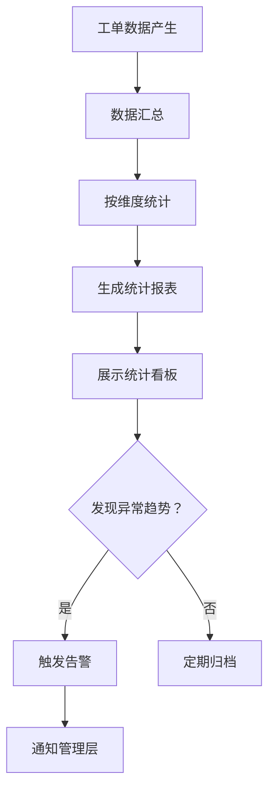
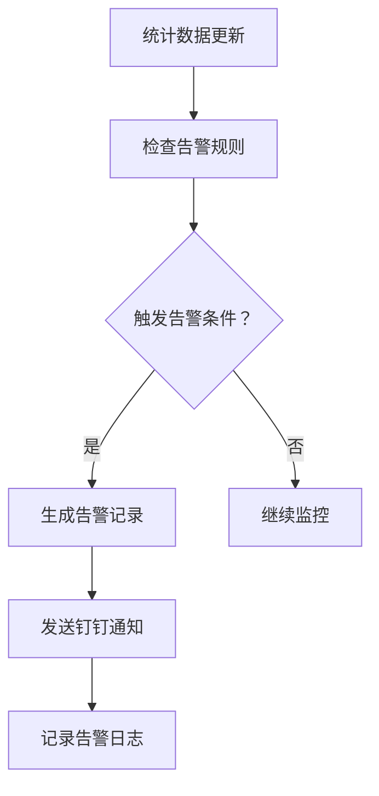

# 客诉工单系统 · 数据分析与统计功能设计

***

## 文档信息

| 项目   | 内容                   |
| ---- | -------------------- |
| 文档编号 | PRD-006-FD-2026-005 |
| 文档版本 | v0.1                 |
| 产品名称 | 客诉工单自动化与智能分类系统 |
| 所属系统 | 客诉工单系统（钉钉AI表格应用） |
| 编制日期 | 2026-06-12       |
| 编制人员 | AI 智能体               |

### 修订记录

| 版本   | 修订日期           | 修订说明 | 修订人    |
| ---- | -------------- | ---- | ------ |
| v0.1 | 2026-06-12 | 初稿创建 | AI 智能体 |

***

> **文档撰写规范（重要）**
>
> 1. **严格遵循模板格式**：各章节表格字段必须与模板保持一致
> 2. **聚焦业务规则**：描述业务逻辑、数据约束、权限控制等，不写技术实现细节
> 3. **减少不必要的示例**：不写JSON/XML格式的报文示例，仅描述报文格式以实际接口返回为准
> 4. **页面布局与交互分离**：§四仅描述页面结构（长什么样），§五描述业务规则（怎么操作）

***

## 一、功能角色矩阵说明

### 1.1 功能描述

- **功能名称：** 数据分析与统计
- **所属模块：** 数据管理
- **功能描述：** 对客诉工单数据进行多维度统计分析，包括分类统计、趋势分析、处理时效统计、满意度统计等，帮助管理层发现系统性问题。

### 1.2 角色权限总览

| 角色      | 功能权限                        | 数据权限   |
| ------- | --------------------------- | ------ |
| 客服人员 | 无权限                         | 无权限    |
| 店长 | 查看本门店统计看板                | 本门店数据  |
| 品控人员 | 查看全量统计看板、导出报表           | 全量数据   |
| 运营管理层 | 查看全量统计看板、导出报表、配置告警规则 | 全量数据   |

### 1.3 功能角色矩阵

| 功能点  | 客服人员 | 店长 | 品控人员 | 运营管理层 |
| ---- | :-----: | :-----: | :-----: | :-----: |
| 查看统计看板 |    否    |    是    |    是    |    是    |
| 查看趋势分析 |    否    |    否    |    是    |    是    |
| 导出报表 |    否    |    否    |    是    |    是    |
| 配置告警规则 |    否    |    否    |    否    |    是    |

***

## 二、模块路径

系统首页 → 数据管理 → 统计分析 → 统计看板 / 趋势分析 / 告警配置

***

## 三、状态流转与流程图

### 3.1 数据分析流程



### 3.2 告警触发流程



***

## 四、页面布局

### 4.1 页面清单

|  序号 | 页面名称    | 页面类型   | 描述                           |
| :-: | ------- | ------ | ---------------------------- |
|  1  | 统计看板 | 主页面    | 展示核心指标和图表                  |
|  2  | 趋势分析页面 | 页面     | 展示客诉趋势变化图表                |
|  3  | 告警配置页面 | 页面     | 配置异常趋势告警规则（仅运营管理层）      |
|  4  | 告警记录列表 | 页面     | 展示历史告警记录                   |

***

### 4.2 统计看板页面布局

```
┌─────────────────────────────────────────────────────────────────┐
│  筛选条件区                                                       │
│  ┌─────────────┐ ┌─────────────┐ ┌─────────────┐ ┌──────┐ ┌──────┐ │
│  │ 开始日期    │ │ 结束日期    │ │ 门店       │ │ 查询 │ │ 重置 │ │
│  │ [日期选择  ]│ │ [日期选择  ]│ │ [下拉框   ▼]│ │ 按钮 │ │ 按钮 │ │
│  └─────────────┘ └─────────────┘ └─────────────┘ └──────┘ └──────┘ │
├─────────────────────────────────────────────────────────────────┤
│  核心指标卡片区                                                    │
│  ┌──────────┐ ┌──────────┐ ┌──────────┐ ┌──────────┐ ┌──────────┐ │
│  │ 工单总数  │ │ 待处理数  │ │ 平均处理  │ │ 超时率   │ │ 满意度   │ │
│  │   156    │ │   12    │ │  8.5h    │ │  5.2%   │ │  88%    │ │
│  └──────────┘ └──────────┘ └──────────┘ └──────────┘ └──────────┘ │
├─────────────────────────────────────────────────────────────────┤
│  图表区                                                           │
│  ┌─────────────────────────┐ ┌─────────────────────────┐        │
│  │  分类统计（饼图）         │ │  趋势分析（折线图）        │        │
│  │                         │ │                         │        │
│  └─────────────────────────┘ └─────────────────────────┘        │
│  ┌─────────────────────────┐ ┌─────────────────────────┐        │
│  │  严重程度分布（柱状图）    │ │  处理时效分布（柱状图）     │        │
│  │                         │ │                         │        │
│  └─────────────────────────┘ └─────────────────────────┘        │
├─────────────────────────────────────────────────────────────────┤
│  排行榜区                                                          │
│  ┌─────────────────────────┐ ┌─────────────────────────┐        │
│  │  门店工单量TOP10         │ │  高频问题TOP10            │        │
│  │  1. 朝阳路店  35        │ │  1. 新鲜度问题  45       │        │
│  │  2. 建国路店  28        │ │  2. 配送延迟    32       │        │
│  └─────────────────────────┘ └─────────────────────────┘        │
└─────────────────────────────────────────────────────────────────┘
```

### 4.2.1 筛选条件区

| 组件名称    | 组件类型 | 位置 | 提示语            | 说明        |
| ------- | ---- | -- | -------------- | --------- |
| 开始日期 | 日期选择器 | 居左 | 请选择开始日期       | 必填\*      |
| 结束日期 | 日期选择器 | 居左 | 请选择结束日期       | 必填\*      |
| 门店 | 下拉框  | 居左 | 请选择门店（全部）    | 精确查询，店长仅看本门店 |
| 查询      | 按钮   | 居右 | —              | 主按钮       |
| 重置      | 按钮   | 居右 | —              | 次按钮       |

### 4.2.2 核心指标卡片区

| 指标名称 | 组件类型 | 说明                    |
| ------- | ---- | --------------------- |
| 工单总数 | 数字卡片 | 筛选时间范围内的工单总数         |
| 待处理数 | 数字卡片 | 当前待处理状态的工单数          |
| 平均处理时效 | 数字卡片 | 已关闭工单的平均处理时长（小时）    |
| 超时率 | 数字卡片 | 超时工单占比（百分比）          |
| 客户满意度 | 数字卡片 | 满意工单占比（百分比）          |

### 4.2.3 图表区

| 图表名称 | 图表类型 | 说明                    |
| ------- | ---- | --------------------- |
| 分类统计 | 饼图 | 按一级分类统计工单数量分布       |
| 趋势分析 | 折线图 | 按日/周/月统计工单数量变化趋势    |
| 严重程度分布 | 柱状图 | 按P1/P2/P3统计工单数量分布     |
| 处理时效分布 | 柱状图 | 按时间段统计工单处理时长分布     |

### 4.2.4 排行榜区

| 排行榜名称 | 组件类型 | 说明                    |
| ------- | ---- | --------------------- |
| 门店工单量TOP10 | 列表 | 按工单数量降序排列的门店排行榜    |
| 高频问题TOP10 | 列表 | 按出现次数降序排列的问题类型排行榜  |

***

### 4.3 趋势分析页面布局

```
┌─────────────────────────────────────────────────────────────────┐
│  筛选条件区                                                       │
│  ┌─────────────┐ ┌─────────────┐ ┌──────────┐ ┌──────┐ ┌──────┐ │
│  │ 开始日期    │ │ 结束日期    │ │ 时间粒度  │ │ 查询 │ │ 重置 │ │
│  │ [日期选择  ]│ │ [日期选择  ]│ │ [下拉框 ▼]│ │ 按钮 │ │ 按钮 │ │
│  └─────────────┘ └─────────────┘ └──────────┘ └──────┘ └──────┘ │
├─────────────────────────────────────────────────────────────────┤
│  趋势图表区                                                       │
│  ┌─────────────────────────────────────────────────────────┐    │
│  │  工单数量趋势（折线图）                                      │    │
│  │                                                         │    │
│  └─────────────────────────────────────────────────────────┘    │
│  ┌─────────────────────────────────────────────────────────┐    │
│  │  分类趋势对比（多线折线图）                                   │    │
│  │                                                         │    │
│  └─────────────────────────────────────────────────────────┘    │
│  ┌─────────────────────────────────────────────────────────┐    │
│  │  处理时效趋势（折线图）                                      │    │
│  │                                                         │    │
│  └─────────────────────────────────────────────────────────┘    │
├─────────────────────────────────────────────────────────────────┤
│  导出区    [导出Excel]  [导出PDF]                                │
└─────────────────────────────────────────────────────────────────┘
```

### 4.3.1 筛选条件区

| 组件名称    | 组件类型 | 位置 | 提示语            | 说明        |
| ------- | ---- | -- | -------------- | --------- |
| 开始日期 | 日期选择器 | 居左 | 请选择开始日期       | 必填\*      |
| 结束日期 | 日期选择器 | 居左 | 请选择结束日期       | 必填\*      |
| 时间粒度 | 下拉框  | 居左 | 请选择时间粒度       | 日/周/月    |
| 查询      | 按钮   | 居右 | —              | 主按钮       |
| 重置      | 按钮   | 居右 | —              | 次按钮       |

### 4.3.2 导出区

| 组件名称 | 组件类型 | 位置 | 提示语 | 说明          |
| ---- | ---- | -- | --- | ----------- |
| 导出Excel | 按钮   | 居右 | —   | 导出趋势数据Excel |
| 导出PDF | 按钮   | 居右 | —   | 导出趋势报告PDF   |

***

### 4.4 告警配置页面布局

```
┌─────────────────────────────────────────────────────────────────┐
│  工具栏区    [+新增告警规则]  [导出]                               │
├─────────────────────────────────────────────────────────────────┤
│  列表数据区                                                       │
│  ┌─────┬──────────┬──────────┬──────────┬──────────┬────────┬──────────┐ │
│  │ 序号 │ 规则名称  │ 监控指标  │ 告警条件  │ 通知对象  │ 状态   │ 操作     │ │
│  ├─────┼──────────┼──────────┼──────────┼──────────┼────────┼──────────┤ │
│  │  1  │ 超时率告警 │ 超时率   │ >10%     │ 运营管理层 │ 启用   │ [编辑][删除]│ │
│  │  2  │ 满意度告警 │ 满意度   │ <80%     │ 品控人员  │ 启用   │ [编辑][删除]│ │
│  └─────┴──────────┴──────────┴──────────┴──────────┴────────┴──────────┘ │
├─────────────────────────────────────────────────────────────────┤
│  分页区    [< 1 2 3 ... 10 >]  [每页 10 ▼]  共 5 条             │
└─────────────────────────────────────────────────────────────────┘
```

### 4.4.1 工具栏区

| 组件名称 | 组件类型 | 位置 | 提示语 | 说明          |
| ---- | ---- | -- | --- | ----------- |
| 新增告警规则 | 按钮   | 居左 | —   | 运营管理层可见 |
| 导出   | 按钮   | 居右 | —   | —           |

### 4.4.2 列表展示区

| 字段      | 组件类型 | 位置 | 说明                |
| ------- | ---- | -- | ----------------- |
| 序号      | 文本   | 居中 | —                 |
| 规则名称 | 文本   | 居左 | —                 |
| 监控指标 | 标签   | 居左 | 枚举-badge样式        |
| 告警条件 | 文本   | 居左 | 如：>10%、<80%      |
| 通知对象 | 文本   | 居左 | —                 |
| 状态      | 标签   | 居中 | 启用/禁用            |
| 操作      | 按钮组  | 居中 | [编辑] [删除]       |

***

### 4.5 告警记录列表页面布局

```
┌─────────────────────────────────────────────────────────────────┐
│  查询条件区                                                       │
│  ┌─────────────┐ ┌─────────────┐ ┌──────┐ ┌──────┐             │
│  │ 规则名称    │ │ 告警级别    │ │ 查询 │ │ 重置 │             │
│  │ [下拉框   ▼]│ │ [下拉框   ▼]│ │ 按钮 │ │ 按钮 │             │
│  └─────────────┘ └─────────────┘ └──────┘ └──────┘             │
├─────────────────────────────────────────────────────────────────┤
│  列表数据区                                                       │
│  ┌─────┬──────────┬──────────┬──────────┬──────────┬──────────┐ │
│  │ 序号 │ 规则名称  │ 告警内容  │ 告警级别  │ 触发时间  │ 状态     │ │
│  ├─────┼──────────┼──────────┼──────────┼──────────┼──────────┤ │
│  │  1  │ 超时率告警 │ 超时率12% │ 警告     │ 06-12 10:00│ 已处理  │ │
│  │  2  │ 满意度告警 │ 满意度75% │ 严重     │ 06-11 14:00│ 已处理  │ │
│  └─────┴──────────┴──────────┴──────────┴──────────┴──────────┘ │
├─────────────────────────────────────────────────────────────────┤
│  分页区    [< 1 2 3 ... 10 >]  [每页 10 ▼]  共 20 条            │
└─────────────────────────────────────────────────────────────────┘
```

### 4.5.1 查询条件区

| 组件名称    | 组件类型 | 位置 | 提示语            | 说明        |
| ------- | ---- | -- | -------------- | --------- |
| 规则名称 | 下拉框  | 居左 | 请选择规则名称       | 精确查询    |
| 告警级别 | 下拉框  | 居左 | 请选择告警级别       | 精确查询    |
| 查询      | 按钮   | 居右 | —              | 主按钮       |
| 重置      | 按钮   | 居右 | —              | 次按钮       |

### 4.5.2 列表展示区

| 字段      | 组件类型 | 位置 | 说明                |
| ------- | ---- | -- | ----------------- |
| 序号      | 文本   | 居中 | —                 |
| 规则名称 | 文本   | 居左 | —                 |
| 告警内容 | 文本   | 居左 | 截断展示，hover显示完整  |
| 告警级别 | 标签   | 居中 | 警告（橙色）/严重（红色） |
| 触发时间 | 文本   | 居左 | 格式见数据字典        |
| 状态      | 标签   | 居中 | 未处理/已处理          |

***

## 五、页面交互说明

### 5.1 统计看板页面交互说明

#### 5.1.1 字段交互规则

| 字段        | 类型  | 是否必填 | 约束规则                  | 展示规则 | 举例或枚举       |
| --------- | --- | :--: | --------------------- | ---- | ----------- |
| 开始日期 | 日期选择器 |   是  | 不能晚于结束日期              | 明文   | 2026-06-01 |
| 结束日期 | 日期选择器 |   是  | 不能早于开始日期              | 明文   | 2026-06-12 |
| 门店 | 下拉框 |   否  | 精确查询；店长仅能选择本门店      | 明文   | 全部/朝阳路店/建国路店 |

#### 5.1.2 操作交互逻辑

| 操作类型 | 触发操作     | 交互可用性       | 正向输出                                        | 异常场景                                           | 异常处理             | 日志级别 |
| ---- | -------- | ----------- | ------------------------------------------- | ---------------------------------------------- | ---------------- | ---- |
| 查询   | 点击"查询"   | 始终可用        | 按条件筛选，更新指标卡片和图表                          | 开始日期晚于结束日期                                     | Toast提示"开始日期不能晚于结束日期" | 接口级  |
| 重置   | 点击"重置"   | 始终可用        | 清空所有筛选条件，恢复默认状态（近7天）                    | 无                                              | 无                | 接口级  |

***

### 5.2 趋势分析页面交互说明

#### 5.2.1 字段交互规则

| 字段        | 类型  | 是否必填 | 约束规则                  | 展示规则 | 举例或枚举       |
| --------- | --- | :--: | --------------------- | ---- | ----------- |
| 开始日期 | 日期选择器 |   是  | 不能晚于结束日期              | 明文   | 2026-06-01 |
| 结束日期 | 日期选择器 |   是  | 不能早于开始日期              | 明文   | 2026-06-12 |
| 时间粒度 | 下拉框 |   是  | 精确选择；数据源参见第九章数据字典 | 明文   | 日/周/月 |

#### 5.2.2 操作交互逻辑

| 操作类型 | 触发操作     | 交互可用性       | 正向输出                                        | 异常场景                                           | 异常处理             | 日志级别 |
| ---- | -------- | ----------- | ------------------------------------------- | ---------------------------------------------- | ---------------- | ---- |
| 查询   | 点击"查询"   | 始终可用        | 按条件筛选，更新趋势图表                             | 开始日期晚于结束日期                                     | Toast提示"开始日期不能晚于结束日期" | 接口级  |
| 重置   | 点击"重置"   | 始终可用        | 清空所有筛选条件，恢复默认状态（近30天，按日）              | 无                                              | 无                | 接口级  |
| 导出Excel | 点击"导出Excel" | 始终可用    | 导出趋势数据Excel文件                            | 无数据                                            | Toast提示"暂无数据可导出" | 接口级  |
| 导出PDF | 点击"导出PDF" | 始终可用      | 导出趋势报告PDF文件                              | 无数据                                            | Toast提示"暂无数据可导出" | 接口级  |

> **导出文件命名规范**：
>
> - 格式：`{业务前缀}_{YYYYMMDD}_{HHMMSS}.xlsx` 或 `.pdf`
> - 示例：`趋势分析_20260612_103045.xlsx`、`趋势报告_20260612_103045.pdf`

***

### 5.3 告警配置页面交互说明

#### 5.3.1 操作交互逻辑

| 操作类型 | 触发操作     | 交互可用性       | 正向输出                                        | 异常场景                                           | 异常处理             | 日志级别 |
| ---- | -------- | ----------- | ------------------------------------------- | ---------------------------------------------- | ---------------- | ---- |
| 新增告警规则 | 点击"新增告警规则" | 运营管理层可用 | 打开"告警规则编辑"弹窗                             | 无                                              | 无                | 接口级  |
| 编辑   | 点击"编辑"   | 运营管理层可用    | 打开"告警规则编辑"弹窗，反显当前数据                       | 无                                              | 无                | 接口级  |
| 删除   | 点击"删除"   | 运营管理层可用    | 弹出确认弹窗；确认后执行删除，自动刷新列表                    | 无                                              | Toast提示"删除失败" | 接口级  |
| 导出   | 点击"导出"   | 运营管理层可用    | 导出全量数据，下载Excel文件                          | 无数据                                            | Toast提示"暂无数据可导出" | 接口级  |

> **导出文件命名规范**：
>
> - 格式：`{业务前缀}_{YYYYMMDD}_{HHMMSS}.xlsx`
> - 示例：`告警规则_20260612_103045.xlsx`

***

### 5.4 告警记录列表页面交互说明

#### 5.4.1 字段交互规则

| 字段        | 类型  | 是否必填 | 约束规则                  | 展示规则 | 举例或枚举       |
| --------- | --- | :--: | --------------------- | ---- | ----------- |
| 规则名称 | 下拉框 |   否  | 精确查询；数据源为告警规则表     | 明文   | 超时率告警/满意度告警 |
| 告警级别 | 下拉框 |   否  | 精确查询；数据源参见第九章数据字典 | 明文   | 警告/严重 |

#### 5.4.2 操作交互逻辑

| 操作类型 | 触发操作     | 交互可用性       | 正向输出                                        | 异常场景                                           | 异常处理             | 日志级别 |
| ---- | -------- | ----------- | ------------------------------------------- | ---------------------------------------------- | ---------------- | ---- |
| 查询   | 点击"查询"   | 始终可用        | 按条件筛选，结果在列表中展示，分页同步更新                       | 无                                              | 无                | 接口级  |
| 重置   | 点击"重置"   | 始终可用        | 清空所有筛选条件，恢复初始查询状态                           | 无                                              | 无                | 接口级  |

***

### 5.5 删除确认弹窗交互说明

#### 5.5.1 操作交互逻辑

| 操作类型 | 触发操作     | 交互可用性 | 正向输出             | 异常场景 | 异常处理    | 日志级别 |
| ---- | -------- | ----- | ---------------- | ---- | ------- | ---- |
| 确认删除 | 点击"确定"按钮 | 始终可用  | 执行删除，弹窗关闭，列表自动刷新 | 删除失败 | Toast提示 | 接口级  |
| 取消   | 点击"取消"按钮 | 始终可用  | 关闭弹窗，不做任何操作      | 无    | 无       | 不记录  |

#### 5.5.2 弹窗说明

| 规则项  | 说明              |
| ---- | --------------- |
| 触发条件 | 点击列表行操作列的"删除"按钮 |
| 提示文案 | "是否确认删除该告警规则？" |
| 确认操作 | 执行删除，弹窗关闭，列表刷新  |
| 取消操作 | 关闭弹窗不做任何操作      |

***

## 六、错误处理规范

### 6.1 文件操作错误

| 场景      | 触发条件                         | 提示文案                    | 处理方式                       |
| ------- | ---------------------------- | ----------------------- | -------------------------- |
| 导出-无数据  | 当前筛选结果为空                     | 暂无数据可导出                 | Toast 提示                   |
| 网络/服务异常 | 接口请求失败                       | 接口异常，请稍候再试              | Toast 提示                   |

***

## 七、非功能性需求

### 7.1 合规与安全要求

| 适用规范       | 内容摘要              | 本模块特有说明                    |
| ---------- | ----------------- | -------------------------- |
| 访问控制   | RBAC最小权限、数据权限隔离   | 客服人员无权限访问；店长仅可查看本门店数据 |
| 操作日志   | 字段级日志、保留期限、不可篡改   | 覆盖操作：查询/导出/配置告警规则     |
| 敏感数据脱敏 | 各字段脱敏规则           | 本模块无敏感字段             |
| 文件操作安全 | 导出上限、下载鉴权、导出行为记日志 | 单次导出上限5000条          |

### 7.2 性能需求

| 需求项       | 指标要求          | 说明            |
| --------- | ------------- | ------------- |
| 统计看板加载时间  | ≤ 3s          | 正常网络条件下，含图表渲染 |
| 趋势分析加载时间  | ≤ 3s          | 正常网络条件下，含图表渲染 |
| 导出响应时间    | ≤ 5s（5000条以内） | 超出时建议提示异步处理   |
| 页面首屏加载时间  | ≤ 3s          | —             |
| 并发用户数     | 30人同时操作      | 按实际业务填写       |

***

## 八、特殊说明

### 8.1 统计指标计算规则

| 指标 | 计算公式 | 说明 |
|------|----------|------|
| 工单总数 | COUNT(工单) | 筛选时间范围内所有工单数量 |
| 待处理数 | COUNT(工单) WHERE 状态=待处理 | 当前待处理状态的工单数 |
| 平均处理时效 | AVG(关闭时间-创建时间) WHERE 状态=已关闭 | 已关闭工单的平均处理时长（小时） |
| 超时率 | COUNT(超时工单)/COUNT(总工单)*100% | 超时工单占比 |
| 客户满意度 | COUNT(满意工单)/COUNT(已回访工单)*100% | 满意工单占比 |

### 8.2 告警规则说明

| 告警类型 | 默认阈值 | 说明 |
|----------|----------|------|
| 超时率告警 | >10% | 当超时率超过10%时触发 |
| 满意度告警 | <80% | 当满意度低于80%时触发 |
| 工单量突增告警 | 日环比>50% | 当工单量日环比增长超过50%时触发 |

### 8.3 数据刷新规则

1. 统计看板数据每5分钟自动刷新
2. 趋势分析数据每15分钟自动刷新
3. 用户点击"查询"按钮时立即刷新
4. 告警检查每10分钟执行一次

***

## 九、数据字典

### 9.1 字典项定义

**时间粒度（timeGranularity）**

| 枚举值（code） | 显示文本（label） | 说明     |
| :-------: | ----------- | ------ |
|     1     | 日           | 按天统计   |
|     2     | 周           | 按周统计   |
|     3     | 月           | 按月统计   |

**告警级别（alertLevel）**

| 枚举值（code） | 显示文本（label） | 说明     |
| :-------: | ----------- | ------ |
|     1     | 警告          | 一般异常   |
|     2     | 严重          | 严重异常   |

**告警状态（alertStatus）**

| 枚举值（code） | 显示文本（label） | 说明     |
| :-------: | ----------- | ------ |
|     1     | 未处理        | 告警已触发，待处理 |
|     2     | 已处理        | 告警已处理完成 |

**监控指标（monitorMetric）**

| 枚举值（code） | 显示文本（label） | 说明     |
| :-------: | ----------- | ------ |
|     1     | 超时率        | 工单超时比例 |
|     2     | 满意度        | 客户满意比例 |
|     3     | 工单量        | 工单数量   |

### 9.2 下拉框数据来源说明

| 字段名     | 数据来源类型 | 来源说明                        |
| ------- | ------ | --------------------------- |
| 时间粒度 | 字典项    | 参见 9.1 timeGranularity            |
| 告警级别 | 字典项    | 参见 9.1 alertLevel            |
| 门店 | 接口动态加载 | 来源：门店管理接口 /api/v1/store/list |

***

## 十、外部系统接口说明

### 10.1 接口清单

| 接口名称    | 功能描述           | 交互方向     | 依赖系统     | 数据流向                    |
| ------- | -------------- | -------- | -------- | ----------------------- |
| 统计汇总接口 | 获取统计数据 | 调用 | 工单管理系统 | 工单管理系统→本系统 |
| 告警检查接口 | 检查告警规则触发 | 调用 | 告警服务 | 本系统→告警服务 |

### 10.2 接口详细说明

**统计汇总接口**

| 规则项  | 说明                    |
| ---- | --------------------- |
| 触发时机 | 查询统计数据时调用           |
| 请求条件 | 必填：开始日期、结束日期       |
| 成功处理 | 返回统计汇总数据（指标、图表、排行榜） |
| 失败处理 | 返回错误信息              |
| 重试机制 | 不自动重试，用户重新查询        |

**告警检查接口**

| 规则项  | 说明                    |
| ---- | --------------------- |
| 触发时机 | 定时任务每10分钟自动执行       |
| 请求条件 | 无                     |
| 成功处理 | 检查所有启用状态的告警规则，触发告警并通知 |
| 失败处理 | 记录错误日志，下次定时任务重试   |
| 重试机制 | 下次定时任务自动重试          |

***

*文档结束*
