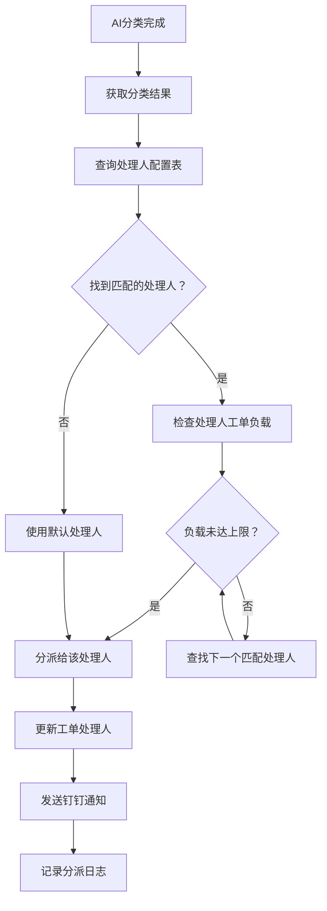
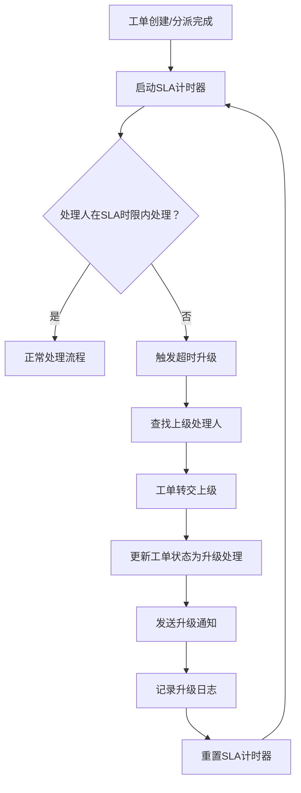
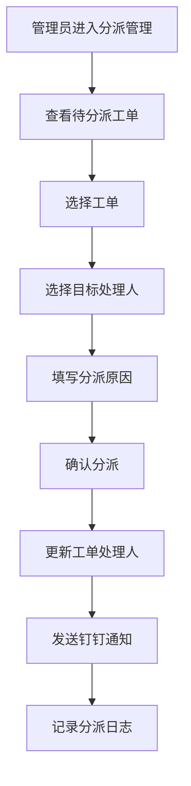

# 客诉工单系统 · 自动分派与升级功能设计

***

## 文档信息

| 项目   | 内容                   |
| ---- | -------------------- |
| 文档编号 | PRD-006-FD-2026-004 |
| 文档版本 | v0.1                 |
| 产品名称 | 客诉工单自动化与智能分类系统 |
| 所属系统 | 客诉工单系统（钉钉AI表格应用） |
| 编制日期 | 2026-06-12       |
| 编制人员 | AI 智能体               |

### 修订记录

| 版本   | 修订日期           | 修订说明 | 修订人    |
| ---- | -------------- | ---- | ------ |
| v0.1 | 2026-06-12 | 初稿创建 | AI 智能体 |

***

> **文档撰写规范（重要）**
>
> 1. **严格遵循模板格式**：各章节表格字段必须与模板保持一致
> 2. **聚焦业务规则**：描述业务逻辑、数据约束、权限控制等，不写技术实现细节
> 3. **减少不必要的示例**：不写JSON/XML格式的报文示例，仅描述报文格式以实际接口返回为准
> 4. **页面布局与交互分离**：§四仅描述页面结构（长什么样），§五描述业务规则（怎么操作）

***

## 一、功能角色矩阵说明

### 1.1 功能描述

- **功能名称：** 自动分派与升级
- **所属模块：** 工单处理
- **功能描述：** 根据AI分类结果自动将工单分派给对应处理人，并在超时未处理时自动升级至上级处理人，确保工单及时处理。

### 1.2 角色权限总览

| 角色      | 功能权限                        | 数据权限   |
| ------- | --------------------------- | ------ |
| 客服人员 | 查看分派记录、查看升级记录           | 全量数据   |
| 店长 | 查看分派记录、查看升级记录、手动分派     | 本门店数据  |
| 品控人员 | 查看分派记录、查看升级记录、手动分派     | 全量数据   |
| 运营管理层 | 查看分派记录、查看升级记录、手动分派、配置分派规则 | 全量数据   |

### 1.3 功能角色矩阵

| 功能点  | 客服人员 | 店长 | 品控人员 | 运营管理层 |
| ---- | :-----: | :-----: | :-----: | :-----: |
| 查看分派记录 |    是    |    是    |    是    |    是    |
| 查看升级记录 |    是    |    是    |    是    |    是    |
| 手动分派 |    否    |    是    |    是    |    是    |
| 配置分派规则 |    否    |    否    |    否    |    是    |

***

## 二、模块路径

系统首页 → 客诉管理 → 分派管理 → 分派记录 / 升级记录 / 分派规则配置

***

## 三、状态流转与流程图

### 3.1 自动分派流程



### 3.2 超时升级流程



### 3.3 手动分派流程



***

## 四、页面布局

### 4.1 页面清单

|  序号 | 页面名称    | 页面类型   | 描述                           |
| :-: | ------- | ------ | ---------------------------- |
|  1  | 分派记录列表 | 主页面    | 展示自动分派和手动分派记录             |
|  2  | 升级记录列表 | 主页面    | 展示超时升级记录                   |
|  3  | 手动分派弹窗 | 弹窗     | 手动将工单分派给指定处理人             |
|  4  | 分派规则配置 | 页面     | 配置自动分派规则（仅运营管理层）         |

***

### 4.2 分派记录列表页面布局

```
┌─────────────────────────────────────────────────────────────────┐
│  查询条件区                                                       │
│  ┌─────────────┐ ┌─────────────┐ ┌──────────┐ ┌──────┐ ┌──────┐ │
│  │ 工单编号    │ │ 分派类型    │ │ 处理人    │ │ 查询 │ │ 重置 │ │
│  │ [输入框    ]│ │ [下拉框   ▼]│ │ [下拉框 ▼]│ │ 按钮 │ │ 按钮 │ │
│  └─────────────┘ └─────────────┘ └──────────┘ └──────┘ └──────┘ │
├─────────────────────────────────────────────────────────────────┤
│  工具栏区    [导出]                                                │
├─────────────────────────────────────────────────────────────────┤
│  列表数据区                                                       │
│  ┌─────┬────────┬──────────┬──────────┬──────────┬────────┬──────────┐ │
│  │ 序号 │ 工单编号│ 客户名称  │ 分派类型  │ 处理人   │ 分派时间 │ 操作     │ │
│  ├─────┼────────┼──────────┼──────────┼──────────┼────────┼──────────┤ │
│  │  1  │ C2026..│ 张先生   │ 自动分派  │ 店长-李四 │ 10:00  │ [详情]   │ │
│  │  2  │ C2026..│ 李女士   │ 手动分派  │ 客服-王五 │ 10:30  │ [详情]   │ │
│  └─────┴────────┴──────────┴──────────┴──────────┴────────┴──────────┘ │
├─────────────────────────────────────────────────────────────────┤
│  分页区    [< 1 2 3 ... 10 >]  [每页 10 ▼]  共 50 条            │
└─────────────────────────────────────────────────────────────────┘
```

### 4.2.1 查询条件区

| 组件名称    | 组件类型 | 位置 | 提示语            | 说明        |
| ------- | ---- | -- | -------------- | --------- |
| 工单编号 | 输入框  | 居左 | 请输入工单编号        | 模糊查询    |
| 分派类型 | 下拉框  | 居左 | 请选择分派类型       | 精确查询    |
| 处理人 | 下拉框  | 居左 | 请选择处理人        | 精确查询    |
| 查询      | 按钮   | 居右 | —              | 主按钮       |
| 重置      | 按钮   | 居右 | —              | 次按钮       |

### 4.2.2 工具栏区

| 组件名称 | 组件类型 | 位置 | 提示语 | 说明          |
| ---- | ---- | -- | --- | ----------- |
| 导出   | 按钮   | 居右 | —   | —           |

### 4.2.3 列表展示区

| 字段      | 组件类型 | 位置 | 说明                |
| ------- | ---- | -- | ----------------- |
| 序号      | 文本   | 居中 | —                 |
| 工单编号 | 文本   | 居左 | —                 |
| 客户名称 | 文本   | 居左 | —                 |
| 分派类型 | 标签   | 居左 | 自动分派/手动分派/升级分派 |
| 处理人 | 文本   | 居左 | —                 |
| 分派时间 | 文本   | 居左 | 格式见数据字典        |
| 操作      | 按钮组  | 居中 | [详情]             |

***

### 4.3 升级记录列表页面布局

```
┌─────────────────────────────────────────────────────────────────┐
│  查询条件区                                                       │
│  ┌─────────────┐ ┌─────────────┐ ┌──────────┐ ┌──────┐ ┌──────┐ │
│  │ 工单编号    │ │ 升级原因    │ │ 查询    │ │ 查询 │ │ 重置 │ │
│  │ [输入框    ]│ │ [下拉框   ▼]│ │         │ │ 按钮 │ │ 按钮 │ │
│  └─────────────┘ └─────────────┘ └──────────┘ └──────┘ └──────┘ │
├─────────────────────────────────────────────────────────────────┤
│  工具栏区    [导出]                                                │
├─────────────────────────────────────────────────────────────────┤
│  列表数据区                                                       │
│  ┌─────┬────────┬──────────┬──────────┬──────────┬────────┬──────────┐ │
│  │ 序号 │ 工单编号│ 原处理人  │ 升级后处理人│ 升级原因  │ 升级时间 │ 操作     │ │
│  ├─────┼────────┼──────────┼──────────┼──────────┼────────┼──────────┤ │
│  │  1  │ C2026..│ 客服-王五 │ 店长-李四  │ 超时升级  │ 12:00  │ [详情]   │ │
│  │  2  │ C2026..│ 店长-李四 │ 运营-赵六  │ 客户不满意│ 14:00  │ [详情]   │ │
│  └─────┴────────┴──────────┴──────────┴──────────┴────────┴──────────┘ │
├─────────────────────────────────────────────────────────────────┤
│  分页区    [< 1 2 3 ... 10 >]  [每页 10 ▼]  共 20 条            │
└─────────────────────────────────────────────────────────────────┘
```

### 4.3.1 查询条件区

| 组件名称    | 组件类型 | 位置 | 提示语            | 说明        |
| ------- | ---- | -- | -------------- | --------- |
| 工单编号 | 输入框  | 居左 | 请输入工单编号        | 模糊查询    |
| 升级原因 | 下拉框  | 居左 | 请选择升级原因       | 精确查询    |
| 查询      | 按钮   | 居右 | —              | 主按钮       |
| 重置      | 按钮   | 居右 | —              | 次按钮       |

### 4.3.2 列表展示区

| 字段      | 组件类型 | 位置 | 说明                |
| ------- | ---- | -- | ----------------- |
| 序号      | 文本   | 居中 | —                 |
| 工单编号 | 文本   | 居左 | —                 |
| 原处理人 | 文本   | 居左 | —                 |
| 升级后处理人 | 文本   | 居左 | —                 |
| 升级原因 | 标签   | 居左 | 超时升级/客户不满意/手动升级 |
| 升级时间 | 文本   | 居左 | 格式见数据字典        |
| 操作      | 按钮组  | 居中 | [详情]             |

***

### 4.4 手动分派弹窗布局

```
┌─────────────────────────────────────────────────┐
│  手动分派                                  [X]  │
├─────────────────────────────────────────────────┤
│  ┌─────────────────────────────────────────┐    │
│  │ 工单编号：C20260612001                   │    │
│  └─────────────────────────────────────────┘    │
│  ┌─────────────────────────────────────────┐    │
│  │ 客户名称：张先生                          │    │
│  └─────────────────────────────────────────┘    │
│  ┌─────────────────────────────────────────┐    │
│  │ 当前处理人：客服-王五                      │    │
│  └─────────────────────────────────────────┘    │
│  ┌─────────────────────────────────────────┐    │
│  │ 目标处理人                                │    │
│  │ [下拉搜索框                           ▼]  │    │
│  └─────────────────────────────────────────┘    │
│  ┌─────────────────────────────────────────┐    │
│  │ 分派原因                                  │    │
│  │ [多行文本框                           ]  │    │
│  └─────────────────────────────────────────┘    │
│                                                 │
│                              [取消]  [确定]      │
└─────────────────────────────────────────────────┘
```

### 4.4.1 表单字段说明

| 字段      | 组件类型 | 位置   | 提示语            | 说明        |
| ------- | ---- | ---- | -------------- | --------- |
| 工单编号 | 文本   | 独占一行 | —              | 只读，系统自动生成 |
| 客户名称 | 文本   | 独占一行 | —              | 只读         |
| 当前处理人 | 文本   | 独占一行 | —              | 只读         |
| 目标处理人 | 下拉搜索框 | 独占一行 | 请选择目标处理人     | 必填\*      |
| 分派原因 | 多行文本框 | 独占一行 | 请输入分派原因       | 必填\*      |

***

### 4.5 分派规则配置页面布局

```
┌─────────────────────────────────────────────────────────────────┐
│  查询条件区                                                       │
│  ┌─────────────┐ ┌─────────────┐ ┌──────┐ ┌──────┐             │
│  │ 角色       │ │ 负责分类    │ │ 查询 │ │ 重置 │             │
│  │ [下拉框   ▼]│ │ [下拉框   ▼]│ │ 按钮 │ │ 按钮 │             │
│  └─────────────┘ └─────────────┘ └──────┘ └──────┘             │
├─────────────────────────────────────────────────────────────────┤
│  工具栏区    [+新增规则]  [导出]                                  │
├─────────────────────────────────────────────────────────────────┤
│  列表数据区                                                       │
│  ┌─────┬──────────┬──────────┬──────────┬──────────┬────────┬──────────┐ │
│  │ 序号 │ 处理人   │ 角色      │ 负责分类  │ 最大工单数│ 状态   │ 操作     │ │
│  ├─────┼──────────┼──────────┼──────────┼──────────┼────────┼──────────┤ │
│  │  1  │ 店长-李四 │ 店长      │ 商品质量  │  10     │ 启用   │ [编辑][删除]│ │
│  │  2  │ 客服-王五 │ 客服      │ 服务态度  │  15     │ 启用   │ [编辑][删除]│ │
│  └─────┴──────────┴──────────┴──────────┴──────────┴────────┴──────────┘ │
├─────────────────────────────────────────────────────────────────┤
│  分页区    [< 1 2 3 ... 10 >]  [每页 10 ▼]  共 15 条            │
└─────────────────────────────────────────────────────────────────┘
```

### 4.5.1 查询条件区

| 组件名称    | 组件类型 | 位置 | 提示语            | 说明        |
| ------- | ---- | -- | -------------- | --------- |
| 角色 | 下拉框  | 居左 | 请选择角色         | 精确查询    |
| 负责分类 | 下拉框  | 居左 | 请选择负责分类       | 精确查询，支持多选 |
| 查询      | 按钮   | 居右 | —              | 主按钮       |
| 重置      | 按钮   | 居右 | —              | 次按钮       |

### 4.5.2 工具栏区

| 组件名称 | 组件类型 | 位置 | 提示语 | 说明          |
| ---- | ---- | -- | --- | ----------- |
| 新增规则 | 按钮   | 居左 | —   | 运营管理层可见 |
| 导出   | 按钮   | 居右 | —   | —           |

### 4.5.3 列表展示区

| 字段      | 组件类型 | 位置 | 说明                |
| ------- | ---- | -- | ----------------- |
| 序号      | 文本   | 居中 | —                 |
| 处理人 | 文本   | 居左 | —                 |
| 角色      | 标签   | 居左 | 枚举-badge样式        |
| 负责分类 | 标签组  | 居左 | 多标签展示           |
| 最大工单数 | 文本   | 居中 | —                 |
| 状态      | 标签   | 居中 | 启用/禁用            |
| 操作      | 按钮组  | 居中 | [编辑] [删除]       |

***

## 五、页面交互说明

### 5.1 分派记录列表页面交互说明

#### 5.1.1 字段交互规则

| 字段        | 类型  | 是否必填 | 约束规则                  | 展示规则 | 举例或枚举       |
| --------- | --- | :--: | --------------------- | ---- | ----------- |
| 工单编号 | 输入框 |   否  | 支持模糊查询；最大50字符       | 明文   | C20260612001 |
| 分派类型 | 下拉框 |   否  | 精确查询；数据源参见第九章数据字典 | 明文   | 自动分派/手动分派/升级分派 |
| 处理人 | 下拉框 |   否  | 精确查询；数据源为处理人配置表    | 明文   | 店长-李四/客服-王五 |

#### 5.1.2 操作交互逻辑

| 操作类型 | 触发操作     | 交互可用性       | 正向输出                                        | 异常场景                                           | 异常处理             | 日志级别 |
| ---- | -------- | ----------- | ------------------------------------------- | ---------------------------------------------- | ---------------- | ---- |
| 查询   | 点击"查询"   | 始终可用        | 按条件筛选，结果在列表中展示，分页同步更新                       | 无                                              | 无                | 接口级  |
| 重置   | 点击"重置"   | 始终可用        | 清空所有筛选条件，恢复初始查询状态                           | 无                                              | 无                | 接口级  |
| 导出   | 点击"导出"   | 始终可用        | 导出全量数据，下载Excel文件                          | 无数据                                            | Toast提示"暂无数据可导出" | 接口级  |

> **导出文件命名规范**：
>
> - 格式：`{业务前缀}_{YYYYMMDD}_{HHMMSS}.xlsx`
> - 示例：`分派记录_20260612_103045.xlsx`

***

### 5.2 升级记录列表页面交互说明

#### 5.2.1 字段交互规则

| 字段        | 类型  | 是否必填 | 约束规则                  | 展示规则 | 举例或枚举       |
| --------- | --- | :--: | --------------------- | ---- | ----------- |
| 工单编号 | 输入框 |   否  | 支持模糊查询；最大50字符       | 明文   | C20260612001 |
| 升级原因 | 下拉框 |   否  | 精确查询；数据源参见第九章数据字典 | 明文   | 超时升级/客户不满意/手动升级 |

#### 5.2.2 操作交互逻辑

| 操作类型 | 触发操作     | 交互可用性       | 正向输出                                        | 异常场景                                           | 异常处理             | 日志级别 |
| ---- | -------- | ----------- | ------------------------------------------- | ---------------------------------------------- | ---------------- | ---- |
| 查询   | 点击"查询"   | 始终可用        | 按条件筛选，结果在列表中展示，分页同步更新                       | 无                                              | 无                | 接口级  |
| 重置   | 点击"重置"   | 始终可用        | 清空所有筛选条件，恢复初始查询状态                           | 无                                              | 无                | 接口级  |
| 导出   | 点击"导出"   | 始终可用        | 导出全量数据，下载Excel文件                          | 无数据                                            | Toast提示"暂无数据可导出" | 接口级  |

> **导出文件命名规范**：
>
> - 格式：`{业务前缀}_{YYYYMMDD}_{HHMMSS}.xlsx`
> - 示例：`升级记录_20260612_103045.xlsx`

***

### 5.3 手动分派弹窗交互说明

#### 5.3.1 字段交互规则

| 字段            | 类型 | 是否必填 | 约束规则                       | 展示规则                | 举例或枚举       |
| ------------- | -- | :--: | -------------------------- | ------------------- | ----------- |
| 工单编号       | 文本 |   —  | 只读，不可编辑                    | 明文                  | C20260612001 |
| 客户名称       | 文本 |   —  | 只读，不可编辑                    | 明文                  | 张先生     |
| 当前处理人       | 文本 |   —  | 只读，不可编辑                    | 明文                  | 客服-王五     |
| 目标处理人       | 下拉搜索框 |   是  | 支持模糊搜索；不可选择当前处理人       | 明文                  | 店长-李四     |
| 分派原因       | 多行文本框 |   是  | 最少5字符，最多200字符            | 明文                  | 该工单涉及商品质量问题，需店长处理 |

#### 5.3.2 操作交互逻辑

| 操作类型 | 触发操作      | 交互可用性       | 正向输出                    | 异常场景 | 异常处理               | 日志级别 |
| ---- | --------- | ----------- | ----------------------- | ---- | ------------------ | ---- |
| 确定分派 | 点击"确定"按钮  | 必填字段全部合规后可用 | 弹窗关闭，列表刷新，Toast提示"分派成功" | 分派失败 | Toast提示"分派失败，请重试！" | 接口级  |
| 取消   | 点击"取消"按钮  | 始终可用        | 关闭弹窗，不保存任何数据            | 无    | 无                  | 不记录  |
| 关闭   | 点击右上角\[X] | 始终可用        | 关闭弹窗，不保存任何数据            | 无    | 无                  | 不记录  |

#### 5.3.3 弹窗说明

| 规则项  | 说明                                   |
| ---- | ------------------------------------ |
| 打开方式 | 在工单详情页或分派管理页面点击"手动分派"按钮           |
| 标题   | 显示"手动分派"                             |
| 数据反显 | 工单编号、客户名称、当前处理人自动填充               |
| 校验时机 | 字段失焦时触发单字段校验；点击"确定"时触发全量校验           |
| 保存规则 | 全部校验通过后提交保存；校验失败时字段下方显示红色提示文本，字段边框变红 |
| 关闭确认 | 如有未保存的修改，关闭时弹出二次确认"是否放弃编辑？"          |

***

### 5.4 分派规则配置页面交互说明

#### 5.4.1 字段交互规则

| 字段        | 类型  | 是否必填 | 约束规则                  | 展示规则 | 举例或枚举       |
| --------- | --- | :--: | --------------------- | ---- | ----------- |
| 角色 | 下拉框 |   否  | 精确查询；数据源参见第九章数据字典 | 明文   | 客服/店长/品控/其他 |
| 负责分类 | 下拉框 |   否  | 精确查询；支持多选；数据源参见第九章数据字典 | 明文   | 商品质量/服务态度/配送问题/其他 |

#### 5.4.2 操作交互逻辑

| 操作类型 | 触发操作     | 交互可用性       | 正向输出                                        | 异常场景                                           | 异常处理             | 日志级别 |
| ---- | -------- | ----------- | ------------------------------------------- | ---------------------------------------------- | ---------------- | ---- |
| 查询   | 点击"查询"   | 始终可用        | 按条件筛选，结果在列表中展示，分页同步更新                       | 无                                              | 无                | 接口级  |
| 重置   | 点击"重置"   | 始终可用        | 清空所有筛选条件，恢复初始查询状态                           | 无                                              | 无                | 接口级  |
| 新增规则 | 点击"新增规则" | 运营管理层可用    | 打开"处理人配置"弹窗（参见《处理人配置管理功能设计》）           | 无                                              | 无                | 接口级  |
| 编辑   | 点击"编辑"   | 运营管理层可用    | 打开"处理人配置"弹窗，反显当前数据                       | 无                                              | 无                | 接口级  |
| 删除   | 点击"删除"   | 运营管理层可用    | 弹出确认弹窗；确认后执行删除，自动刷新列表                    | 无                                              | Toast提示"删除失败" | 接口级  |
| 导出   | 点击"导出"   | 运营管理层可用    | 导出全量数据，下载Excel文件                          | 无数据                                            | Toast提示"暂无数据可导出" | 接口级  |

> **导出文件命名规范**：
>
> - 格式：`{业务前缀}_{YYYYMMDD}_{HHMMSS}.xlsx`
> - 示例：`分派规则_20260612_103045.xlsx`

***

### 5.5 删除确认弹窗交互说明

#### 5.5.1 操作交互逻辑

| 操作类型 | 触发操作     | 交互可用性 | 正向输出             | 异常场景 | 异常处理    | 日志级别 |
| ---- | -------- | ----- | ---------------- | ---- | ------- | ---- |
| 确认删除 | 点击"确定"按钮 | 始终可用  | 执行删除，弹窗关闭，列表自动刷新 | 删除失败 | Toast提示 | 接口级  |
| 取消   | 点击"取消"按钮 | 始终可用  | 关闭弹窗，不做任何操作      | 无    | 无       | 不记录  |

#### 5.5.2 弹窗说明

| 规则项  | 说明              |
| ---- | --------------- |
| 触发条件 | 点击列表行操作列的"删除"按钮 |
| 提示文案 | "是否确认删除该分派规则？" |
| 确认操作 | 执行删除，弹窗关闭，列表刷新  |
| 取消操作 | 关闭弹窗不做任何操作      |

***

## 六、错误处理规范

### 6.1 表单校验错误

- 显示方式：对应字段下方显示红色提示文本，字段边框变红
- 触发时机：表单提交时触发全量校验；字段失去焦点时触发单字段校验

| 字段      | 为空时错误信息     | 格式错误时信息           |
| ------- | ----------- | ----------------- |
| 目标处理人 | 请选择目标处理人 | 目标处理人不能与当前处理人相同 |
| 分派原因 | 分派原因不能为空 | 分派原因最少5字符，最多200字符 |

### 6.2 分派异常处理

| 场景      | 触发条件                         | 提示文案                    | 处理方式                       |
| ------- | ---------------------------- | ----------------------- | -------------------------- |
| 无可用处理人 | 未找到匹配的处理人                  | 未找到匹配的处理人，已使用默认处理人 | 工单分派给系统默认处理人（运营管理层） |
| 处理人负载已满 | 所有匹配处理人工单数已达上限            | 所有匹配处理人工单已满，已使用默认处理人 | 工单分派给系统默认处理人（运营管理层） |
| 分派失败   | 接口调用失败                       | 分派失败，请重试              | Toast 提示，工单保持原状态          |
| 网络/服务异常 | 接口请求失败                       | 接口异常，请稍候再试              | Toast 提示                   |

***

## 七、非功能性需求

### 7.1 合规与安全要求

| 适用规范       | 内容摘要              | 本模块特有说明                    |
| ---------- | ----------------- | -------------------------- |
| 访问控制   | RBAC最小权限、数据权限隔离   | 仅运营管理层可配置分派规则；店长仅可查看和手动分派本门店工单 |
| 操作日志   | 字段级日志、保留期限、不可篡改   | 覆盖操作：手动分派/查看记录/配置规则     |
| 敏感数据脱敏 | 各字段脱敏规则           | 本模块无敏感字段             |
| 文件操作安全 | 导出上限、下载鉴权、导出行为记日志 | 单次导出上限1000条          |

### 7.2 性能需求

| 需求项       | 指标要求          | 说明            |
| --------- | ------------- | ------------- |
| 列表查询响应时间  | ≤ 2s          | 正常网络条件下，含分页查询 |
| 保存/提交响应时间 | ≤ 3s          | 手动分派提交操作     |
| 导出响应时间    | ≤ 5s（1000条以内） | 超出时建议提示异步处理   |
| 页面首屏加载时间  | ≤ 3s          | —             |
| 并发用户数     | 50人同时操作      | 按实际业务填写       |

***

## 八、特殊说明

### 8.1 自动分派规则

1. 系统根据工单的一级分类匹配处理人配置表中的"负责分类"
2. 匹配到多个处理人时，优先分派给当前工单数最少的处理人（负载均衡）
3. 所有匹配处理人工单数都达到上限时，分派给系统默认处理人（运营管理层）
4. 未找到匹配处理人时，使用系统默认处理人

### 8.2 超时升级规则

1. P1级工单超过2小时未处理，自动触发升级
2. P2级工单超过4小时未处理，自动触发升级
3. P3级工单超过8小时未处理，自动触发升级
4. 升级后通知上级处理人，并记录升级日志
5. 升级后重置SLA计时

### 8.3 通知规则

1. 工单分派后，通过钉钉机器人向处理人发送通知
2. 通知内容包含：工单编号、客户名称、分类、严重程度、处理时限
3. 超时升级后，同时通知原处理人和新处理人
4. 通知延迟不超过5分钟

### 8.4 分派记录规则

1. 每次分派（自动/手动/升级）均记录分派日志
2. 记录包含：工单编号、分派类型、处理人、分派时间、操作人
3. 分派记录不可修改或删除
4. 分派记录按时间倒序展示

***

## 九、数据字典

### 9.1 字典项定义

**分派类型（assignType）**

| 枚举值（code） | 显示文本（label） | 说明     |
| :-------: | ----------- | ------ |
|     1     | 自动分派        | 系统自动分派 |
|     2     | 手动分派        | 人工手动分派 |
|     3     | 升级分派        | 超时或不满升级后分派 |

**升级原因（upgradeReason）**

| 枚举值（code） | 显示文本（label） | 说明     |
| :-------: | ----------- | ------ |
|     1     | 超时升级        | 超时未处理自动升级 |
|     2     | 客户不满意      | 客户反馈不满意升级 |
|     3     | 手动升级        | 人工手动升级 |

**角色（assigneeRole）**

| 枚举值（code） | 显示文本（label） | 说明     |
| :-------: | ----------- | ------ |
|     1     | 客服          | 一线客服人员 |
|     2     | 店长          | 门店管理人员 |
|     3     | 品控          | 质量管控人员 |
|     4     | 其他          | 其他角色   |

### 9.2 下拉框数据来源说明

| 字段名     | 数据来源类型 | 来源说明                        |
| ------- | ------ | --------------------------- |
| 分派类型 | 字典项    | 参见 9.1 assignType            |
| 升级原因 | 字典项    | 参见 9.1 upgradeReason            |
| 角色 | 字典项    | 参见 9.1 assigneeRole            |
| 处理人 | 接口动态加载 | 来源：处理人配置接口 /api/v1/assignee/list |

***

## 十、外部系统接口说明

### 10.1 接口清单

| 接口名称    | 功能描述           | 交互方向     | 依赖系统     | 数据流向                    |
| ------- | -------------- | -------- | -------- | ----------------------- |
| 自动分派接口 | 根据分类自动分派工单 | 调用 | 工单管理系统 | 本系统→工单管理系统 |
| 超时检查接口 | 检查工单是否超时 | 调用 | 定时任务服务 | 定时任务服务→本系统 |
| 钉钉通知接口 | 发送分派/升级通知 | 调用 | 钉钉开放平台 | 本系统→钉钉开放平台 |

### 10.2 接口详细说明

**自动分派接口**

| 规则项  | 说明                    |
| ---- | --------------------- |
| 触发时机 | AI分类完成后自动调用           |
| 请求条件 | 工单ID、一级分类           |
| 成功处理 | 返回分派结果（处理人、分派类型）   |
| 失败处理 | 使用默认处理人，记录错误日志     |
| 重试机制 | 不自动重试               |

**超时检查接口**

| 规则项  | 说明                    |
| ---- | --------------------- |
| 触发时机 | 定时任务每5分钟自动执行        |
| 请求条件 | 无                     |
| 成功处理 | 检查所有待处理/处理中工单，触发超时升级 |
| 失败处理 | 记录错误日志，下次定时任务重试   |
| 重试机制 | 下次定时任务自动重试          |

**钉钉通知接口**

| 规则项  | 说明                    |
| ---- | --------------------- |
| 触发时机 | 分派/升级完成后调用          |
| 请求条件 | 处理人ID、通知内容          |
| 成功处理 | 通知发送成功              |
| 失败处理 | 记录失败日志，异步重试3次      |
| 重试机制 | 自动重试3次，间隔5秒          |

***

*文档结束*